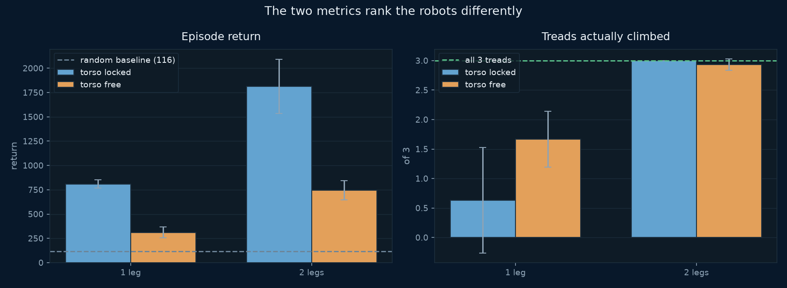
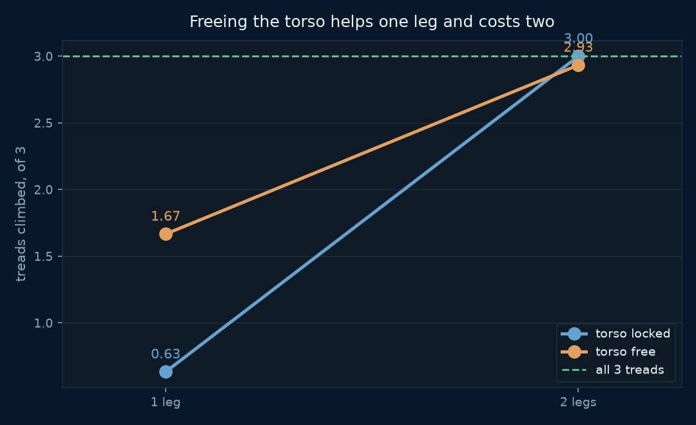
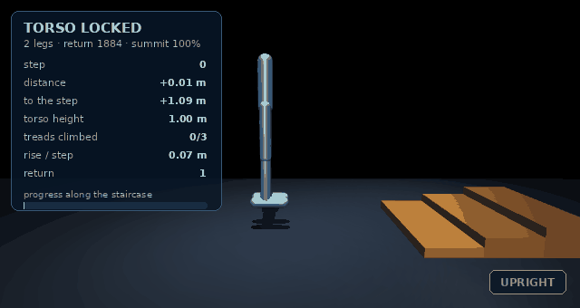
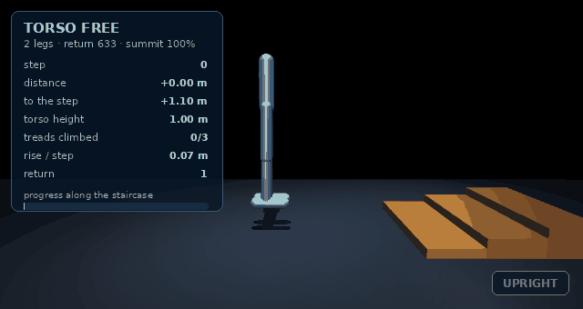

# Biped Stairs — which costs more, a limb or a constraint?

**Baseline:** a random policy, measured before every run — return 67–176
depending on the robot, and **no cell ever reaches the top of the
staircase**.

**Budget:** 800,000 environment steps per run, **three seeds per cell,
four cells** — twelve runs, about 10 minutes wall-clock on CPU at
`--jobs 6`.

Lab 1 locked its hopper's torso upright and noted in passing that freeing
it turns the task into the bipedal-balance problem. This lab tests that
against the obvious rival explanation — that difficulty comes from having
more joints to coordinate — by crossing the two switches:

| | torso locked | torso free |
|---|---|---|
| **1 leg** | 3 actuators, cannot tip | 3 actuators, must balance |
| **2 legs** | 6 actuators, cannot tip | 6 actuators, must balance |

Same staircase, same reward, same episode length. Only the robot changes.

## The falsifier

> **If the leg count changes performance more than the torso constraint
> does, then lab 1's explanation was wrong and joint count is the real
> difficulty axis.**

**It lost, and then it got more interesting.** The leg count dominates —
*and* the torso's effect changes sign depending on how many legs there are.

## The result

| cell | return (3 seeds) | treads climbed /3 | summit |
|---|---|---|---|
| 1 leg, locked | 788 · 871 · 771 | 0.0 · 1.9 · 0.0 | 0% |
| 1 leg, free | 356 · 342 · 231 | 2.0 · 2.0 · 1.0 | 0% |
| **2 legs, locked** | **1866 · 1447 · 2123** | **3.0 · 3.0 · 3.0** | **100%** |
| 2 legs, free | 633 · 874 · 726 | 3.0 · 2.8 · 3.0 | 93% |



**Adding a leg is transformative.** Mean treads climbed goes 0.63 → 3.00
with a locked torso, and 1.67 → 2.93 with a free one. Every two-legged
seed summits; no one-legged seed ever does.

**Freeing the torso interacts with it.**



With one leg it **helps**: 0.63 → 1.67 treads. With two legs it costs a
little climbing and a lot of return: 3.00 → 2.93 treads, 1812 → 744.

The lines are not parallel, so the switches are not independent, and no
main-effects summary of this experiment is honest. The mechanism is
visible in the animations: with a single leg the only way onto a step is
to *lean* into it, which needs a torso that rotates. With two legs you can
simply put one foot up, so the torso freedom stops being useful and
becomes pure instability.

## Watch it





The panel is read from the live simulation every frame. Watch `treads
climbed` and the status chip.

## Three wrong answers before the right one

The metric at the centre of this lab — *how many treads is the robot
standing on* — took three attempts, and every wrong version was quietly
plausible.

1. **Torso height against the absolute tread height.** The robot rests at
   `qpos[1] = -0.196` on flat ground, so standing on the 0.24 m top tread
   reads `+0.045`, not `+0.24`. The threshold was `+0.124`. A policy that
   walked **14.5 m past the entire staircase** reported `climbed 0.00`.
2. **Torso lift above its own resting height.** Better, but a robot
   standing on a tread with bent legs sits *lower* than one standing
   straight on the floor. Measured crouched on a 0.07 m tread: `+0.032`
   against a `0.042` threshold — missed.
3. **Raw foot height.** The foot capsule has a 0.045 m radius, so a foot
   flat on the ground already clears tread one's threshold. A robot that
   never left the floor read `1/3`.

The working version measures the **foot's lift above its own flat-ground
height**, self-calibrated at construction so it cannot rot if a link
length changes.

This mattered twice over: the same expression gated the `+3.0 per tread`
reward, so the first two sweeps trained robots that were never paid for
climbing. **Every number above is from the third sweep.** The first two
are not in this README because they measured the detector, not the robot.

The same bug existed in lab 1's `on_box`, where it was invisible: that
lab's reward and headline metric both use x-position, so its published
findings stand and only a reported statistic was wrong. It is fixed there
too.

## Run it

```bash
git clone https://github.com/yiqiao-yin/deepspeed-course.git
cd deepspeed-course/07_physical_ai/02_biped_stairs
uv sync                       # needs uv: curl -LsSf https://astral.sh/uv/install.sh | sh

uv run morphology.py          # all four robots, and passive stability
uv run stairs_env.py          # the random baseline for each
uv run ../../tests/test_biped_stairs.py     # 42 property checks

uv run train_ppo.py --dry-run               # 30 s smoke test
uv run train_ppo.py --cell 2leg_free        # one cell, ~4 min
uv run train_ppo.py --sweep --seeds 3 --jobs 6   # the whole 2x2, ~10 min

uv run make_figures.py        # every chart above
uv run render.py              # the stills and HUD animations
```

## CPU or GPU

Same answer as lab 1, for the same reason. The largest policy here is
**11,597 parameters**, so the forward pass is not the work — MuJoCo
stepping is, and it is on the CPU either way. `--device auto` resolves to
CPU; `--device cuda` is supported and reported, not recommended.

A sweep is twelve independent processes, so the parallelism that helps is
`--jobs`, not a GPU.

### Why there is no `deepspeed` launcher

Nothing for ZeRO to shard. Registered `launcher="python"`, the eighth
declared exception, and `tests/test_biped_stairs.py` fails if any cell's
policy exceeds 1M parameters so the justification cannot go stale.

### Renting a GPU (RunPod) — for convenience, not speed

```bash
uv run runpod/runpod_ctl.py run 07_physical_ai/02_biped_stairs --dry-run --yes
uv run runpod/runpod_ctl.py run 07_physical_ai/02_biped_stairs \
    --collect --wait --terminate --yes
```

**Confirm the pod is gone with `uv run runpod/runpod_ctl.py pods`.** An
abandoned pod bills until terminated; `--terminate` runs from your machine
in a `finally`, and the in-pod watchdog is a backstop, not a guarantee.

## Environment & Local Testing

| | |
|---|---|
| Dependencies | `mujoco`, `torch`, `numpy`, `matplotlib`, `imageio`, `pillow` |
| GPU | not required, and not faster |
| Download | none — the world is generated from XML in the source |
| Rendering | optional; training never opens a graphics context |
| Runtime | ~4 min a run, ~10 min for the full 2×2 at `--jobs 6` |
