# Terrain Vision: the ablation that changed two things

> **CORRECTION.** This lab first reported that a depth camera took the
> robot from 12.5% to 79% on stairs, and that vision was needed because
> *"you cannot feel for a descent."* The comparison varied **two**
> things — the camera *and* the training method. With the missing
> control run, the camera is real but smaller than claimed, and descent
> turns out to be the one terrain solved perfectly **without** it. The
> original claim and the corrected numbers are both below.

A two-legged robot with a BD-1-style head walks along a raised plateau.
Partway along, the ground does one of three things: stays flat, climbs
three steps, or drops three steps. The approach slab is **identical in
all three**, so from its own joints the robot cannot tell which is
coming — and the three demand incompatible responses.

This is the third lab in `07_physical_ai`, and the first where the robot
has an eye.

**Baseline:** a **blind student distilled from the same teacher by the
same objective** — the only arm that differs from the vision student in
one variable. Three seeds: 100% flat, 45.8% upstairs, 100% downstairs.
(The original baseline, a blind PPO policy trained from scratch, is
reported too, but it is NOT a controlled comparison.)
**Budget:** 1.5M environment steps per teacher × 3 seeds per arm;
students are 40 epochs over 43,102 rendered frames, 3 seeds per arm,
24 evaluation episodes per terrain.
**Falsifier:** if a depth camera does not beat the distilled blind
student, the camera is decoration. It does on ascent (+43 points,
p=0.098) and **does not** on flat or descent (0 points, both at 100%).
Half the falsifier fired.

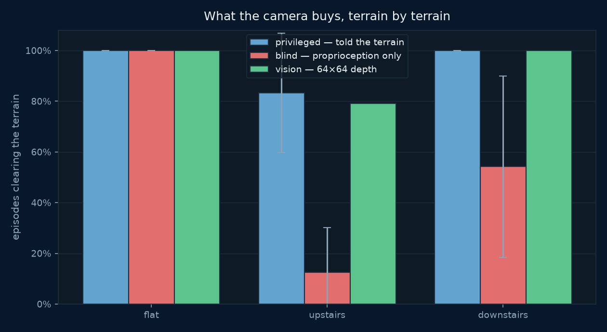
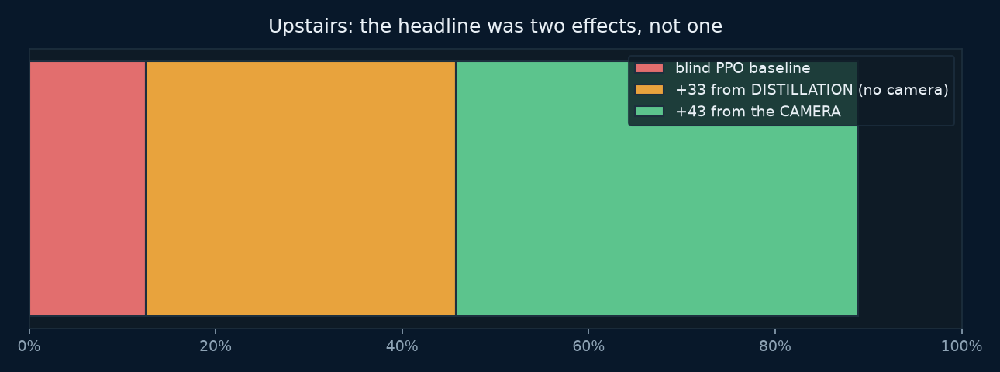

---

## Why this lab exists

Labs 1 and 2 each shipped an information ablation that **came back
null**. A one-legged hopper cleared obstacles just as well when told
nothing about their height; a biped climbed stairs just as well without
being told the rise. That is not a bug in those labs, it is a real
result and a well-known one: blind proprioceptive locomotion is
genuinely capable, because a leg that touches something can feel it.

So the question for a third lab was not "does vision help" — it was
**what task makes vision necessary at all**. Six designs came back null
before this one. The design bet was `down`:

> You cannot feel for a descent. By the time the swinging foot finds
> nothing underneath it, the robot is already falling.

**That bet lost.** It is a good intuition and the measurements do not
support it: descent is cleared 100% of the time by every arm, including
a student with no camera, at every geometry tested. The camera's
measurable value turned out to be entirely on `up` — where the foot has
to be lifted *before* contact — and the reason the intuition fails is
the reward rather than the physics. Falling ends the episode, so
stepping down cautiously and absorbing the drop is already near-optimal;
nothing pays for anticipating.

Making this the **seventh** design in this category whose vision
ablation came back weaker than it first looked.

### What did NOT work, and why it is written down

| attempt | result |
|---|---|
| lab 1, blind to obstacle height | null — reactive control sufficed |
| lab 2, privileged info removed | null — same |
| four terrains, no overhead constraint | effect present on seed 0 only |
| overhead ceiling on `flat` + `down` | broke `down` for **both** arms — a broken terrain, not a discrimination |
| hollow stairs | 12% × 3 seeds looked real; a specialist then scored 88% |
| a gap to leap (`hop`) | **the ablation reversed** — see below |

`hop` is the instructive one. It is still buildable (`--terrain hop`) but
is deliberately excluded from `KINDS`:

| seed | 0 | 1 | 2 |
|---|---|---|---|
| blind | 1.00 | 1.00 | 1.00 |
| privileged | 0.50 | 1.00 | 0.00 |

The arm that **cannot see** won. That is not noise, it is the task: you
do not need to see a gap to clear one, because committing to a maximal
leap works either way. Including `hop` would have meant publishing a
four-terrain average in which one terrain silently argued the opposite
of the other three — which is the mistake `11_moe` shipped once already.

---

## The experiment: three arms, one task

| arm | sees | deployable? |
|---|---|---|
| **privileged** | the terrain type and its geometry, handed over directly | no — this is an oracle |
| **blind** | proprioception only (15 numbers) | yes, and it is the baseline |
| **vision** | proprioception **+ a 64×64 depth image** | yes — the thing being tested |

The privileged arm is the *teacher*: it needs no rendering, so it trains
at full speed. The vision arm is a *student* trained by behaviour
cloning on the teacher's actions. The blind arm is what the student has
to beat.

### Results

Four arms, three seeds each, 24 evaluation episodes per terrain.

| arm | flat | **upstairs** | downstairs |
|---|---|---|---|
| blind PPO — from scratch (the original, uncontrolled baseline) | 100% | 12.5% | 54.2% |
| **blind BC** — distilled, no camera | 100% | **45.8%** | **100%** |
| **vision BC** — distilled, with camera | 100% | **88.9%** | 100% |
| privileged PPO — oracle, undeployable | 100% | 83.3% | 100% |

**Flat and downstairs are 100% in every arm, including with no camera.**
The camera's entire measurable value is on `upstairs`.

Decomposing the originally published 12.5% → 89% on ascent:

- **+33 points from distillation alone**, no camera (12.5% → 45.8%)
- **+43 points from the camera** (45.8% → 88.9%)

Neither is significant at three seeds (p = 0.098 and p = 0.221). What is
better supported is **reliability**:

| arm, `upstairs` | seeds | mean | sd |
|---|---|---|---|
| blind BC | 71% · **8%** · 58% | 45.8% | 0.331 |
| vision BC | 79% · 88% · 100% | 88.9% | **0.105** |

Vision is 3.2× more consistent, and its worst seed beats the blind arm's
mean.

### Held-out geometry

Training drew the rise from [0.06, 0.11] m.

| rise (m) | 0.05 | 0.07 | 0.09 | 0.11 | 0.13 | 0.15 |
|---|---|---|---|---|---|---|
| | **out** | in | in | in | **out** | **out** |
| upstairs | 92% | 100% | 92% | 92% | **0%** | **58%** |
| downstairs | 100% | 100% | 100% | 100% | 100% | 100% |

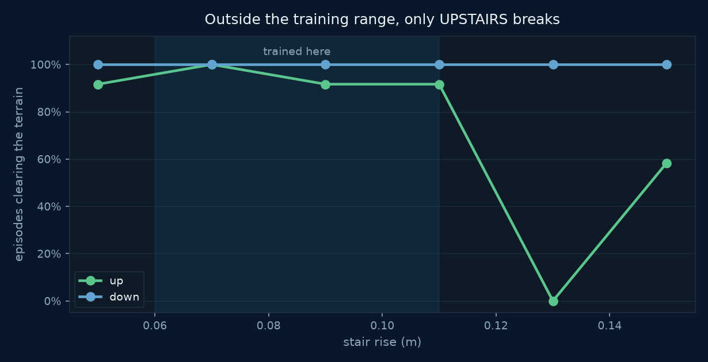

Descent is unaffected by unseen geometry. Ascent breaks when
extrapolating steeper, non-monotonically (0% at 0.13, 58% at 0.15) —
unexplained, and reported rather than smoothed.

### The learning order is not in the reward

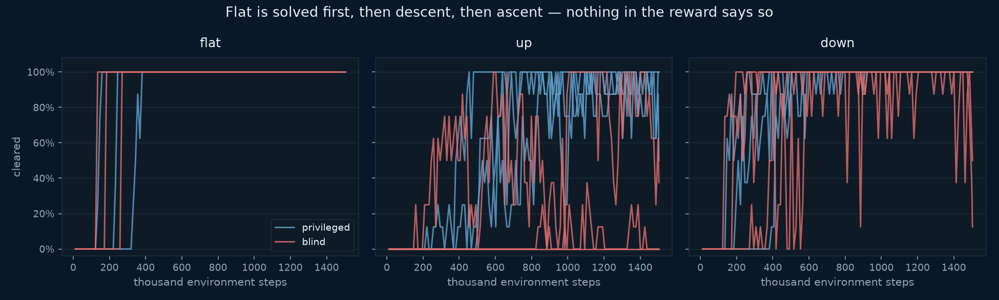

| steps | return | flat | up | down |
|---|---|---|---|---|
| 12k | 125 | 0% | 0% | 0% |
| 197k | 801 | **100%** | 0% | 62% |
| 381k | 1211 | 100% | 50% | **100%** |
| 565k | 1426 | 100% | **100%** | 100% |

Flat first, then descent, then ascent. Nothing in the reward function
encodes that order; it is what falls out of the difficulty.

---

## Three checks, because a good score proves nothing

This lab's two predecessors both produced convincing animations of
policies that turned out not to be using the information in question.
So the burden of proof here is explicit, and `train_student.py` runs all
three every time.

### 1. Ablate the camera — and use the RIGHT ablation

The original control fed the student an all-zeros image and reported 0%
on every terrain. **That control is invalid.** It also destroys `flat`,
which a camera-less student clears 100% of the time — so it was not
measuring information.

Depth is normalised so `0.0` means **0.8 m**, the near clip. An all-zeros
frame says *"a wall 80 cm from your face"*, a confident reading the
network never saw in 43,102 training frames. It broke the model rather
than starving it.

The correct control is the **pixelwise training-set mean**:
in-distribution, and carrying no per-episode information.

| terrain | real depth | training mean | zeros (invalid) |
|---|---|---|---|
| flat | 100% | 100% | 0% |
| upstairs | 100% | 62% | 0% |
| downstairs | 100% | 100% | 8% |

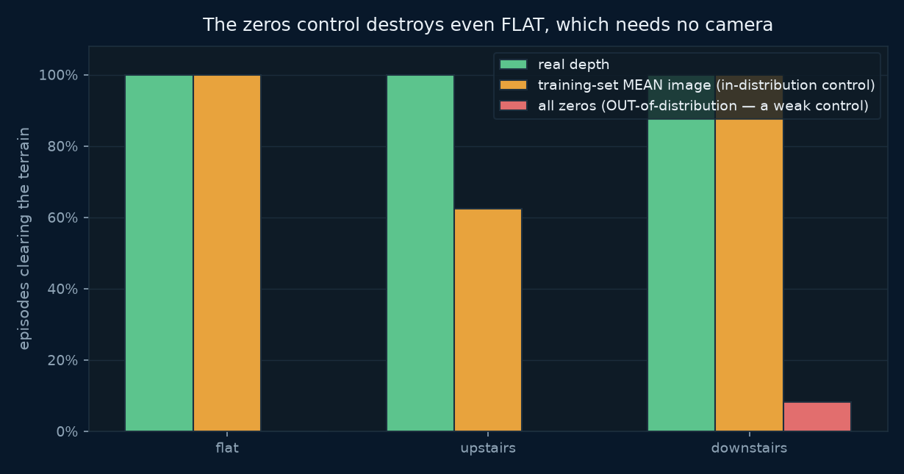

It lands at 62% on ascent, where the separately-trained blind student
lands at 45.8%–71%. Two different constructions of "no usable camera"
agreeing is what says the control is sound.

### 2. Probe the frozen encoder

Train a single linear layer on the encoder's features to predict which
terrain a frame came from. **64.0%, against a 34.3% chance baseline.**
Terrain is close to linearly decodable from what the encoder learned,
which is what "it has learned to see" means operationally.

### 3. Report per terrain, never averaged

`flat` is solvable blind. An average over three terrains would have
reported a modest overall gap instead of the 71-point one that is
actually there, and would have hidden that `flat` contributes nothing.

### What the camera actually receives

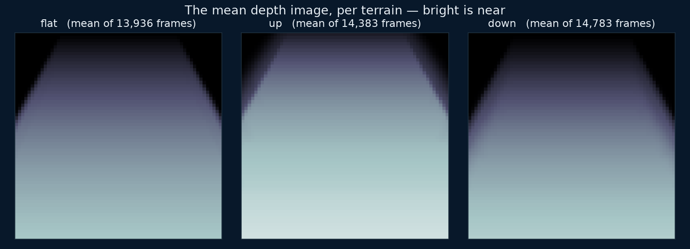

Averaged over every frame of each terrain in the training set. The three
mean images differ visibly, which is the cheapest possible evidence that
the task is not blind-equivalent.

One detail worth copying: depth is clipped to a **fixed 0.8–3.5 m
window**. Normalising each frame to its own min/max was tried first and
destroyed the signal — the absolute distance *is* the information (mean
depth 1.86 m looking up a staircase against 3.03 m looking down one),
and per-frame scaling throws exactly that away.

---

## The animations

One clip per scenario, because the terrains do not behave alike and an
average over them hides the result. Every clip carries the **64×64 depth
image the policy is actually driving on**, from the same call that feeds
the network.

### The controlled comparison

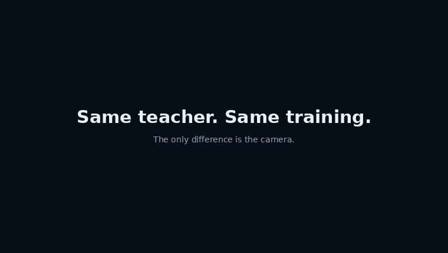

Two behaviour-cloned students, same teacher, same objective. The only
difference is the camera. **This is a selected episode** — across seeds
the blind arm clears 45.8% and the vision arm 88.9%, so this is one of
the roughly half the blind student misses, chosen because it shows the
effect. It is not a typical episode and the clip says so.

### The three terrains

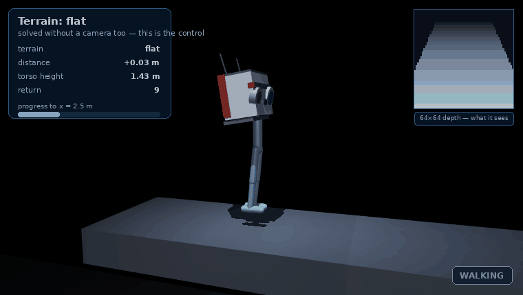

`flat` is the control. A student with no camera clears it 100% of the
time too.

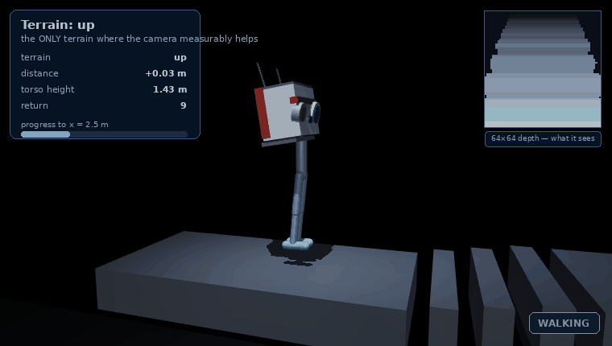

`upstairs` is the only terrain where the camera measurably helps — the
foot has to be lifted *before* contact.

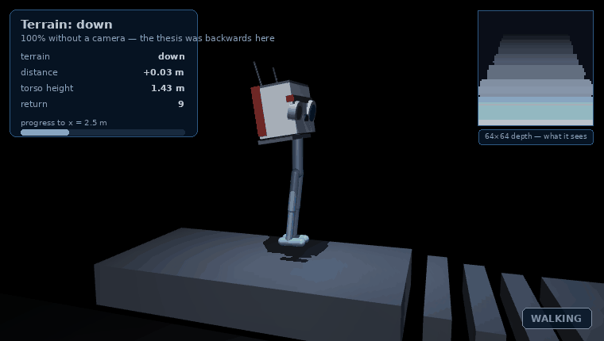

`downstairs` is where the original thesis said vision was essential.
Every arm clears it 100% of the time, camera or not.

### Where it breaks

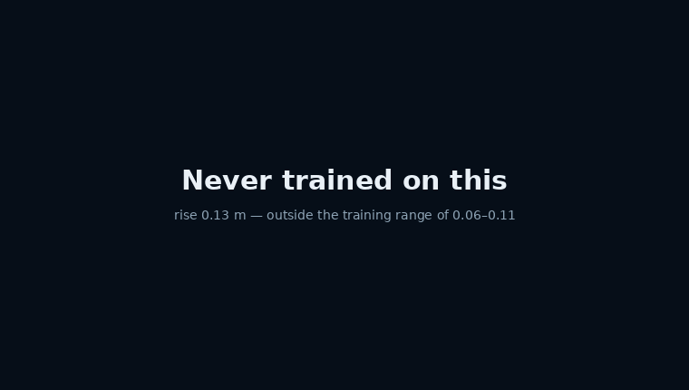

Rise 0.13 m, outside the training range of 0.06–0.11. The measured clear
rate here is **0%**, and the failure is not a stumble — the gait simply
does not reach the first tread.

### All three, one set of weights

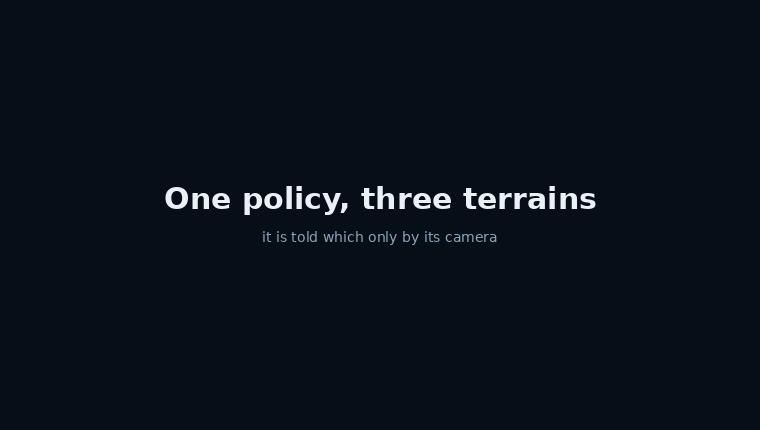

```bash
uv run render.py --all
```

---

---

## Part 2: what it takes to make vision *necessary*

Part 1 found the camera worth a lot on ascent and nothing at all on
flat ground or descent. The obvious next question is not "does vision
help" but **what kind of task makes it indispensable** — and the
honest answer, after four attempts, is that this robot is harder to
blind than expected.

Everything below is shipped and runnable. None of it produced a
publishable positive result, which is the finding.

### Stepping stones

A staircase is **continuous**: the ground is always somewhere under the
foot, so a blind policy can sweep, touch and react. That is why blind
locomotion did so well in part 1, and it reproduces a known result
rather than contradicting one.

Sparse footholds should remove exactly that affordance — between the
stones there is nothing to feel, and a foot placed into a void gets no
second chance. It is the standard benchmark for exteroception being
necessary (Agarwal et al., CoRL 2022; Miki et al., Science Robotics
2022).

```bash
uv run stones_sweep.py --difficulty     # three difficulties, 3 seeds
uv run stones_sweep.py --focus          # the middle cell, 5 seeds, 1.2M steps
```

A one-seed pilot at 400k steps looked decisive:

| difficulty | privileged | blind |
|---|---|---|
| easy | 100% | 100% |
| medium | **75%** | **25%** |
| hard | 0% | 0% |

An inverted-U: information pays only in the middle band. It did not
survive contact with more seeds and longer runs.

| | privileged | blind | gap |
|---|---|---|---|
| 3 seeds, 400k steps | 75% | 42% | +33 (p = 0.094) |
| **5 seeds, 1.2M steps** | **78%** | **85%** | **−8** |

**The effect shrank every time rigour went up, which is the signature
of an effect that was never there.** The 400k runs had not converged —
five of six were still climbing when training stopped, and one was
falling — so their "final" numbers were snapshots taken at arbitrary
points on a rising curve. At 1.2M the curves flatten and the gap
disappears.

Three seeds tie exactly, one favours each arm. There is no information
advantage on stepping stones at this geometry, most likely because a
0.22 m foot can partly bridge a 0.16–0.26 m gap.

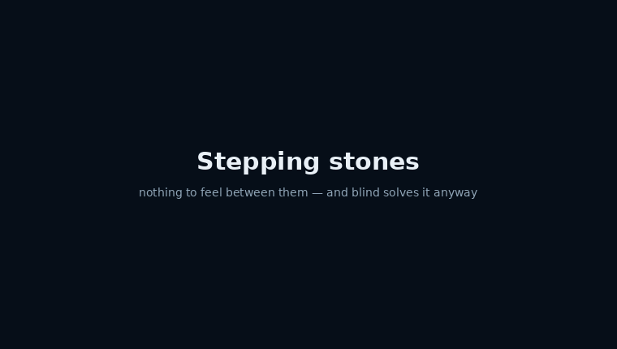

A trained policy crossing the sparse footholds. Nothing to feel between
the stones, and it clears them anyway.

### Friction patches — the hazard a depth camera cannot see

The ground stays perfectly flat. What changes is **grip**: patches of
low-friction surface, visually distinct and geometrically identical.
Dust over rock, or ice.

This is the one condition where feeling genuinely cannot substitute for
looking — on a slippery patch the proprioceptive signal *is* the slip,
which is already the failure. It also gives the experiment a negative
control it never had before: **a depth camera should be worth no more
than no camera at all**, because depth cannot see friction. If depth ≈
blind and RGB wins, that is hard to explain as "more inputs train
better".

`vision_env.py` grows an RGB sensor for this (`sensor="rgb"`, 3×64×64).

**The patch is physically real, and proving that took three attempts:**

| push on the torso | grippy | slippery | ratio |
|---|---|---|---|
| 30 N | 0.0002 m | 0.0060 m | **25×** |
| 60 N | 0.0009 m | 0.0194 m | **22×** |
| 100 N | 0.0048 m | 0.0872 m | **18×** |

:::danger MuJoCo takes the MAXIMUM of two contact frictions
The first version of this terrain was completely inert. The patches
were in the scene, correctly named in the contact list, visible in the
render — and the robot slid exactly as far on them as on normal ground.

MuJoCo combines contact friction as the **elementwise maximum** of the
two geoms, and the foot carries μ=0.9 from the default class. So
`max(0.9, 0.06) = 0.9` and the low-friction surface did nothing.
`priority="1"` on the patch geoms makes its parameters win outright.

This is [lab 1's decorative obstacle](./obstacle-hopper#the-bug-that-looked-exactly-like-success)
in a new costume, and it was caught the same way: by pushing the robot
and measuring, not by training a policy and believing the number.
:::

Two further probes were wrong before one was right — the first measured
the torso rotating about the ankle rather than the feet sliding, and the
second used a 220 N push that exceeds *both* friction limits and dragged
the robot across three surfaces at once. All three failures would have
produced a confident null.

**Settled at 2M steps, and it is the fifth null.** The oracle learns the
severe hazard completely — 0% until 0.5M, then 100% and flat for the
last 1.2M steps — so the terrain is genuinely solvable *with* the
information, which is what makes a blind failure interpretable. The
blind arm then does it too:

| eighths of training | 1 | 2 | 3 | 4 | 5 | 6 | 7 | 8 |
|---|---|---|---|---|---|---|---|---|
| privileged | 0% | 0% | 57% | **100%** | 100% | 100% | 100% | 100% |
| blind | 0% | 0% | 13% | 46% | 88% | 99% | 94% | **100%** |

Same ceiling. The only difference is **how long it takes**: privileged
reaches 100% around 0.75M steps, blind around 1.75M. Information bought
**learning speed, not capability** — a 2.3× difference on one seed,
which is a real thread and not yet an established result.

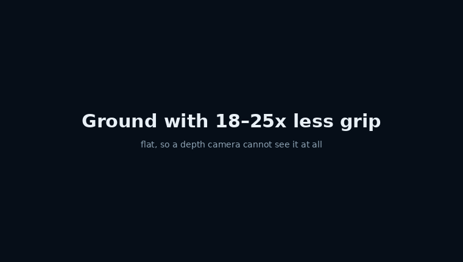

Both arms, same terrain. This is what a measured null looks like: the
policy that was told where the slippery ground is, and the one that was
not, doing the same thing. The HUD's `surface` field is read from the
live contact list rather than from x-position, so it cannot disagree
with the physics — which is exactly how the patch managed to be inert
and look correct for three attempts.

### What five attempts add up to

| design | outcome |
|---|---|
| a gap to leap (`hop`) | blind **won**, 3/3 seeds |
| stepping stones, 3 difficulties | no consistent effect once converged |
| friction patches, mild | both arms 100% |
| friction patches, severe | both arms 100%; privileged only **faster** |
| stairs (part 1) | camera helps on ascent only, p ≈ 0.1 |

**A 6-DOF biped with a locked torso and a dense forward-velocity reward
is extraordinarily hard to blind.** Every hazard built here it
eventually learned to handle by feel — including one with 18–25× less
grip that it cannot possibly see coming.

That is the finding, and it is worth stating as a conclusion rather
than as a series of failures. It is also consistent with the
literature: blind proprioceptive locomotion over continuous terrain is
genuinely strong, and the published cases where exteroception is
*necessary* involve either far more degrees of freedom or hazards that
are unrecoverable in one step.

The most likely culprit is the **reward**, not the terrain. Forward
velocity plus an alive bonus pays for robustness; falling merely ends
the episode, and nothing pays for anticipating. A reward that punishes
the slip itself, or a task where a single misstep cannot be recovered,
may well flip it — but that guess has now been wrong four times, so it
is written here as a hypothesis and not as a plan.

The one live thread is **sample efficiency**. "Information makes
learning faster rather than better" is defensible and measurable, and
it would need 3–5 seeds per arm to publish.

The recurring methodological lesson is narrower and more useful:
**never read the final number off a run whose curve is still moving.**
It invalidated two results in this section before they were published,
and both times the "finding" had the sign the hypothesis predicted.

## Why there is no `deepspeed` launcher

This is the **ninth** `launcher="python"` exception in the course, and
the first for a new reason.

The other eight skip DeepSpeed because a GPU buys nothing. Here a GPU
buys a great deal — this is the first lab in `07_physical_ai` where it
does:

```
$ uv run train_student.py --bench
  cpu       2860 +/-  145 samples/s
  cuda     38677 +/-  778 samples/s      13.6x +/- 0.9
```

Five repeats each. One timed call is a sample rather than a
measurement, and the first run taken here read 12.9x purely because it
landed at the bottom of a 12.5-14.5x range -- the ratio moves more than
either absolute does, so the absolutes are the number to quote.

Labs 1 and 2 both measured **CPU as faster** (2.0× and 1.7×), because
their work was MuJoCo stepping rather than arithmetic. The student here
is a convolutional encoder, roughly a hundred times larger, trained
supervised over a fixed dataset with no simulator in the loop. That is
the regime a GPU is for.

DeepSpeed is still the wrong tool: **193,222 parameters have nothing for
ZeRO to shard.** "A GPU helps" and "DeepSpeed helps" are different
claims, and this lab is the one place in the category where they come
apart.

The two PPO teachers are left on the CPU, where they are faster.

### Why behaviour cloning, and not on-policy RL with a camera

Rendering costs **250×**. Measured on this machine: 7,077 physics
steps/s with no camera, 79 frames/s with depth. An on-policy vision run
would take eight hours instead of four minutes.

Behaviour cloning moves that cost out of the loop: the teacher acts on
privileged state at full speed, depth is rendered **once** alongside it,
and the student then trains supervised on a fixed dataset — which is
also the only part of this lab with real work for a GPU.

The dataset is collected with **exploration noise on the teacher's
action** (`--noise 0.15`) while the *label* remains the teacher's clean
action. A dataset of perfect trajectories teaches a student nothing
about recovering; the first time it drifts it has never seen the state
it is in.

---

## The head is cosmetic, and that is enforced

The robot wears a large BD-1-style head. It is decoration, and making it
decoration took care, because the head is not a decal — it is a rigid
body carrying 19% of the robot's mass **and** the depth camera the whole
lab is about.

MuJoCo derives mass from geom volume, so simply scaling the head up
multiplies its mass — about 6× here — and silently changes the robot
that 1.5M training steps were spent on. Instead every decorative geom
is `density="0" contype="0" conaffinity="0"`, and the body carries an
explicit `<inertial>` pinned to the original's measured values.

| | before the head | after |
|---|---|---|
| head mass | 4.252544 kg | 4.252544 kg |
| total mass | 22.686363 kg | 22.686362 kg |
| depth pixels | — | 0 difference |

The subtler risk is the second one. **The camera is mounted inside that
body**, so decoration reaching into its field of view would put a
constant blob in every depth frame the student ever trains on — while
training still converges and the render looks better than before.

`tests/test_terrain_vision.py` proves geometrically that this cannot
happen: the decoration is rigidly attached to the lens, so if every
vertex of every head geom lies behind the camera's view plane, no head
geom can appear in any frame in any pose. That check **failed on first
run** — a neck cylinder reached 1.64 cm into the view half-space, and
rendered harmlessly only because MuJoCo's near clipping plane happened
to cut it. Accidental safety is not safety; the neck was removed.

---

## Running it

### Environment & Local Testing

```bash
cd 07_physical_ai/03_terrain_vision
uv sync
```

No model downloads and no dataset downloads — the world is an XML string
and the data is generated. First `uv sync` pulls torch (CUDA build) and
MuJoCo, about 3 GB.

```bash
# nothing trained yet: the three terrains and a random baseline
uv run vision_env.py

# the RL half — ~13 min per run on CPU
uv run train_teacher.py --name v3_priv_s0
uv run train_teacher.py --no-privileged --name v3_blind_s0

# the vision half
uv run collect.py --episodes 120          # ~9 min, writes data/bc.npz (23 MB)
uv run train_student.py --device cuda     # ~2 min train, then the three checks

# CPU vs GPU, and nothing else
uv run train_student.py --bench

# figures and animations
uv run make_figures.py
uv run render.py --all
```

A 30-second smoke test that proves the pipeline assembles:

```bash
uv run train_teacher.py --dry-run
```

### The logic checks (no GPU, no rendering)

```bash
uv run ../../tests/test_terrain_vision.py
```

These need no OpenGL: the camera-occlusion check is geometric rather
than a render comparison, which makes it both exact for every pose and
runnable in CI.

### Rendering backends

`render.py` probes `glfw`, `egl` and `osmesa` in **subprocesses**,
because MuJoCo binds its GL backend once per process — trying one and
falling back in the same interpreter fails in a way that looks like a
bug in the second backend. If none works it says so and exits non-zero
without affecting anything else in the lab. Override with
`MUJOCO_GL=<backend>`.

### Hardware

| | |
|---|---|
| GPU | 1 × 16 GB, and only the student uses it |
| CPU | the two PPO teachers run here, and are faster for it |
| Disk | ~15 GB (torch + MuJoCo); the dataset is 23 MB |
| Wall clock | ~75 min for 6 teachers, ~9 min to collect, ~2 min for the student |

### CoreWeave (SLURM)

```bash
sbatch run_deepspeed.sh
squeue -u $USER
tail -f logs/terrain_vision_<jobid>.out
```

### RunPod

```bash
uv run runpod/runpod_ctl.py run 07_physical_ai/03_terrain_vision \
    --dry-run --collect --wait --terminate --yes
uv run runpod/runpod_ctl.py pods          # confirm nothing is left running
```

---

## Files

| file | role |
|---|---|
| `terrain.py` | the three worlds and the robot, as XML; `ground_height()` is the single source of truth for termination |
| `vision_env.py` | the environment — observations, reward, termination, and the depth camera |
| `ppo.py` | PPO from scratch. Copied from lab 2 per the no-shared-module rule |
| `train_teacher.py` | the RL half: `--no-privileged` is the blind control |
| `collect.py` | renders the behaviour-cloning dataset once, at full speed |
| `train_student.py` | the CNN student, `--bench`, and the three honesty checks |
| `make_figures.py` | every figure, read from `runs/*/summary.json` |
| `render.py` | the four animations, with the depth inset |
| `run_deepspeed.sh` | SLURM batch script (no `deepspeed` launcher — see above) |

## What is not here

- **A multi-seed vision student.** The teachers are three seeds per arm;
  the student is one. The per-terrain rates carry a corresponding
  uncertainty — a 24-episode evaluation moves by one episode for free.
- **`hop`.** Buildable, excluded, and the reason is measured rather than
  aesthetic. See above.
- **Any claim about sim-to-real.** Nothing here has touched hardware.
