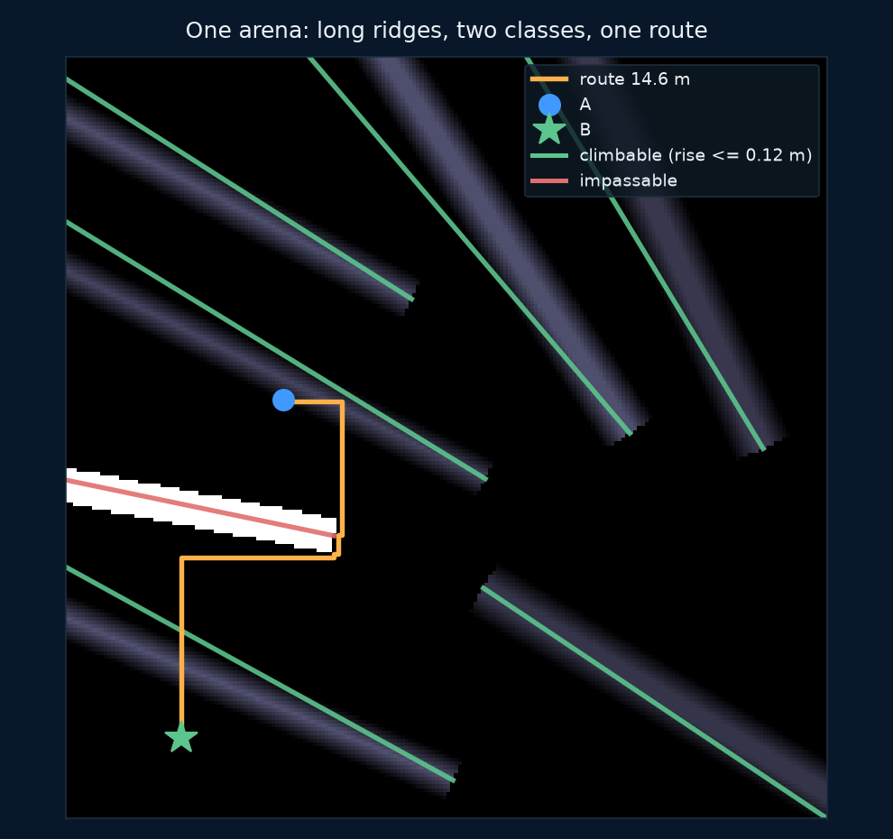
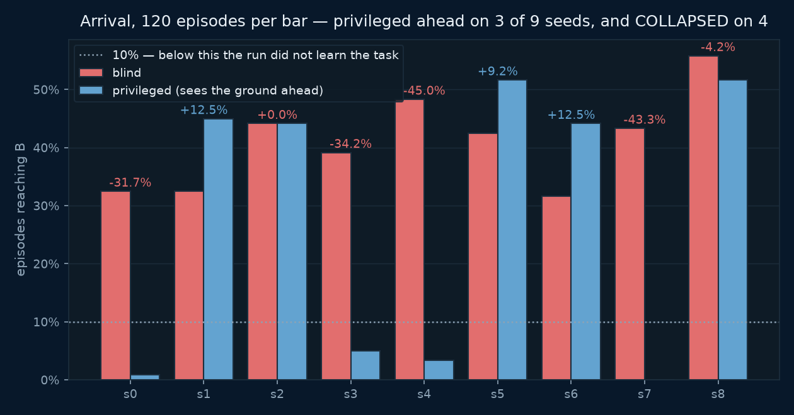
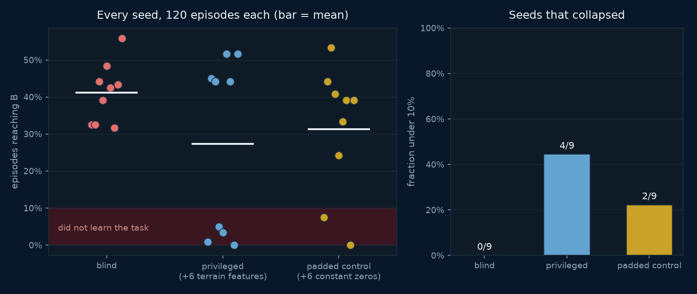
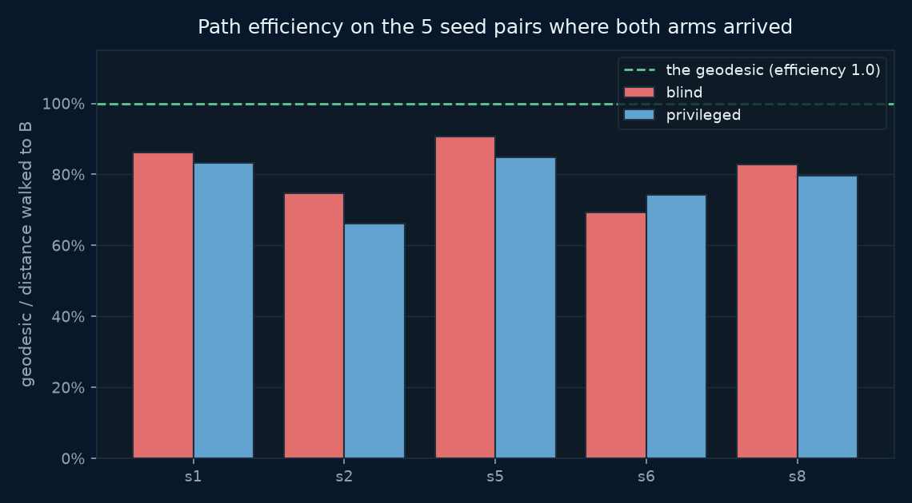

# Terrain Navigation: climb it or walk around it

Labs 1–3 were **planar**: two base joints, terrain as a profile along a
line, every obstacle head-on, no choice to make. This lab adds the
missing dimension — a 20 × 20 m arena, a random start **A** and goal
**B**, and ridges of two kinds that demand opposite responses.

| | rise | the right response |
|---|---|---|
| **climbable** | ≤ 0.12 m | go straight over; detouring costs distance |
| **impassable** | ≥ 0.45 m | walk to its end; climbing wastes the episode |

The threshold comes from [lab 2](../02_biped_stairs), which measured a
two-legged robot climbing 0.04–0.10 m treads reliably and failing above
that.

**Baseline:** the blind policy — proprioception and the goal bearing
only, 21 observation dimensions, same algorithm and same 1.5M steps:
**41.1% arrival** (444/1080 episodes), and **0 of 9 seeds failed to
learn**.
**Budget:** 1.5M environment steps per run × 9 seeds × 3 arms = 27
runs, goal range 7 m; every published number scored on **120 evaluation
episodes per checkpoint** on identical maps.
**Falsifier:** if handing the policy the ground profile ahead does not
beat blind on arrival, terrain information is not what this task needs.
**It did not.** Privileged pooled *below* blind, and the honest reading
of why is a third arm the first version of this lab never ran.



---

## Everything this lab published before was measured in a broken frame

PRs #81, #82 and #83 reported that the privileged policy beat the blind
one on **7 of 9 seeds, Wilcoxon p = 0.022**. That result is
**withdrawn**. It was an artifact of a coordinate bug, and the
correction reverses its direction.

`rootx` and `rooty` are **slide** joints, and the torso body was
declared at `pos="(start_x, start_y)"` in the XML while `reset()` also
wrote the start into `qpos`. A slide joint displaces from where the body
is declared, so the robot spawned at **twice its start coordinates** —
frequently off the height field altogether. Every distance, every
terrain probe and the arrival test ran in a frame shifted by the start
offset: `to_goal()` read 10.44 m where the true distance was 14.78 m.

Eighteen property checks passed throughout, because **not one of them
compared the lab's own idea of position against MuJoCo's**. The thing
that caught it was a reader looking at an animation and asking why the
orange track reached the flag while the robot stood in the middle.

```python
# tests/test_terrain_navigation.py — the check that was missing
worst = max(worst, float(np.linalg.norm(
    env.pos() - env.data.xpos[tid][:2])))
check("pos() matches MuJoCo's own torso position", worst < 1e-6)
```

Both arrival rates are roughly **five times higher** in the corrected
frame, because a robot that starts on the map can actually walk across
it. Every animation and every figure here was regenerated; nothing from
the old frame survives on these pages.

---

## The result: information helps, width hurts, and they were confounded

Three arms, nine seeds each, 120 episodes per checkpoint on identical
maps:



| arm | obs dims | pooled arrival | range | **collapsed** (<10%) | mean of seeds that trained |
|---|---|---|---|---|---|
| blind | 21 | **41.1%** | 32–56% | **0 / 9** | 41.1% |
| privileged (+6 terrain features) | 27 | 27.3% | 0–52% | **4 / 9** | **47.3%** |
| padded control (+6 constant zeros) | 27 | 31.3% | 0–53% | **2 / 9** | 39.2% |

Paired blind vs privileged: ahead on **3 of 9 seeds**, mean **−13.8
points**, Wilcoxon exact **p = 0.250**, sign test 0.508. There is no
arrival advantage.

But the per-seed numbers are not noise around a mean — they are
**bimodal, and only in one arm**. The privileged arm either reaches
44–52% or sits at 0–5%. Nothing in between, and blind never does it.



### The control the original lab never ran

Two explanations fit that bimodality equally well, and **blind vs
privileged cannot tell them apart** because it changes information and
dimensionality at the same time:

- the six extra **dimensions** destabilise PPO at this scale, or
- those particular **features** are harmful.

So: widen the blind observation to 27 with **six constant zeros**. Same
width, zero information.

**Six constant zeros collapsed 2 of 9 seeds.** Blind collapsed none.
Pure observation width destabilises this policy on its own, carrying no
information at all.

| comparison | Fisher exact |
|---|---|
| blind 0/9 vs privileged 4/9 | p = 0.082 |
| blind 0/9 vs **padded 2/9** | p = 0.471 |
| padded 2/9 vs privileged 4/9 | p = 0.620 |

The control lands **between** the two arms and is not separable from
either. So the defensible claim is narrow:

> Adding six inputs to a 12k-parameter policy costs reliability even
> when those inputs carry nothing. The terrain features look useful
> *conditional on the run surviving* — privileged is the best arm at
> 47.3% among seeds that trained — but this experiment cannot
> attribute the extra collapses to the features rather than to the
> width.

**And it is not powered to.** Separating a 22% collapse rate from a 44%
one at 80% power needs roughly **70 seeds per arm**; separating 0% from
22% needs about 40. This has nine. The blind-vs-privileged collapse gap
is a **trend, not a result**, and is reported as one.

### Path efficiency

Scored only on seeds that trained, as `geodesic / distance walked to B`:

| arm | efficiency | fell |
|---|---|---|
| blind | 82.6% (69–91%) | 28.1% |
| privileged | 77.6% (66–85%) | 16.1% |
| padded | 84.3% (72–91%) | 24.1% |



No efficiency advantage either. Privileged falls least, which is the
one axis where the terrain channel shows an unambiguous benefit.

---

## Six bugs that would each have produced a wrong conclusion

The coordinate frame above is the first. The other five all shipped
green on a passing test suite.

**2. Path efficiency was scored against an optimum that was not
optimal.** `solve()` is a **4-connected** BFS — it cannot move
diagonally, so it staircases, and a straight diagonal of length *L*
comes back as *L*·√2. Measured across 59 maps it overstates the shortest
distance by **mean 1.199×, max 1.424×** against a √2 = 1.414 ceiling.

**3. And a clamp destroyed the evidence that it was wrong.**
`evaluate.py` wrapped the ratio in `min(..., 1.0)`. Three episodes
scored 133%, 136% and 144% — a policy beating the optimum, which cannot
happen — and every one was silently rewritten to *exactly 100%*. **An
impossible measurement is evidence.** Clamping it converted the one
signal that the denominator was broken into a plausible number.

The fix is scoped: a separate 8-connected Dijkstra (`world.geodesic`)
used **only** as the metric's denominator. `solve()` is untouched,
because it also places the goal — changing it would have redefined the
task and invalidated all 27 runs.

**4. The renderer filmed a different task than the numbers describe.**
`summary.json` never recorded `goal_range`, so nothing downstream could
recover it, and `render.py` built `NavWorld(mode=..., flat=False,
seed=0)` with no range at all — filming goals at the map's own endpoints
while every published figure was measured at 7 m. The clips showed the
robot stranded 14 m out beside a table reporting 42% arrival. **A figure
and a number that disagree are not a rendering quirk.**

**5. The HUD contradicted the page.** It divided by *total* distance
walked — which keeps counting for ~1300 steps after the robot reaches B
— and against the inflated 4-connected route. Both are now the
published definition, frozen at arrival.

**6. An asset on the page was generated by nothing.**
`nav-route-b.gif` had been rendered once by hand and orphaned. When the
whole lab was re-rendered after the frame fix, that one file **silently
survived from the broken world**, sitting on the page beside eight
corrected clips. An orphan cannot be regenerated, so it cannot be
corrected. There is now a check that every `nav-*` image the pages show
is produced by a shipped command.

### Earlier failures, kept because they recur

**The privileged arm was once broken by its own observation.** An
11 × 11 raw height patch meant 142 inputs to a 2 × 64 MLP, and all three
seeds sat at *exactly* 0% for the whole run. Three identical zeros are
impossible by chance; that is the only reason it was caught. Six summary
features train fine — and the current bimodality finding is the same
lesson at a smaller scale.

**Arriving ENDED the episode, making success the worst outcome.**
Standing still for 2000 steps earned 3000; arriving at step ~700 earned
1170. The policy correctly learned not to arrive.

**Torque control meant the body could not stand** — a 1M-step run on
flat ground reached 0%. Position actuators make a zero action hold the
standing pose.

**The fall detector sat inside the healthy oscillation band** at 0.55,
so episodes ended on a standing robot's startup wobble. Now 0.40 —
below the wobble, far above a real collapse at 0.19.

**The in-training evaluation is too coarse to publish.** Twelve episodes
quantises to 8.3%, and every blind run peaks at exactly 25% (3/12).
Selecting on the peak of a noisy curve is selecting the maximum of
noise. Everything published comes from `evaluate.py` at 120 episodes.

---

## The design, and what was swept to get it

Each constant was chosen by sweeping it against the property the lab
needs, because the first two attempts produced a task with no decision
in it:

| obstacle shape | cost of refusing to climb |
|---|---|
| round mounds, r = 1.2–2.2 m | median **0.00 m** over 109 maps |
| short ridges, 5–8 m | median **0.00 m** |
| **long ridges, 12–17 m** | median **+3.40 m** on a ~15 m route |

Length is the lever: a ridge that nearly spans the arena cannot be
skirted cheaply. Ends stay open so 90% of maps keep *both* routes
available — a choice, not a forced climb.

`tests/test_terrain_navigation.py` pins the **property** rather than the
parameters, so an edit to the lengths is caught by its consequence.

## The robot

`rootx`, `rooty`, **`rootyaw`**, `rootz` plus six leg joints; position
actuators centred on a measured standing pose. The torso is declared at
the **origin** — see the frame bug above.

**Torso pitch and roll stay locked** — inherited from lab 1's
measurement (freeing it gives the bipedal-balance problem) and lab 2's
2×2 (with two legs it costs return and buys no climbing). What it buys
is that the hard part here is navigation. What it costs: nothing here
measures recovery, and yaw is actuated directly because a planar biped
with locked roll cannot generate yaw torque through contact.

## Running it

```bash
cd 07_physical_ai/04_terrain_navigation
uv sync

uv run world.py --check 200     # solvable? do they detour?
uv run robot.py                 # the body on a map
uv run nav_env.py               # random baseline

uv run train_nav.py --flat --name gate_flat     # LOCOMOTION GATE, first

# three arms, nine seeds. blind and privileged are the experiment;
# padded is the control that makes the comparison interpretable.
for s in 0 1 2 3 4 5 6 7 8; do
  for m in blind privileged padded; do
    uv run train_nav.py --mode $m --seed $s --goal-range 7 \
        --name nav5_${m}_s$s
  done
done

uv run evaluate.py --prefix nav5_ --episodes 120   # the published numbers
uv run make_figures.py && uv run render.py --all
```

`--flat` is not part of the experiment. It asks only whether the body
can walk to a point and turn to face it, and it **failed twice** before
the position-actuator and start-pose fixes — which is the whole reason
it runs first.

```bash
uv run ../../tests/test_terrain_navigation.py   # 31 checks, no GPU, no OpenGL
```

### CoreWeave (SLURM)

```bash
sbatch run_deepspeed.sh
squeue -u $USER
tail -f logs/terrain_navigation_<jobid>.out
```

### RunPod

```bash
uv run runpod/runpod_ctl.py run 07_physical_ai/04_terrain_navigation \
    --dry-run --collect --wait --terminate --yes
uv run runpod/runpod_ctl.py pods      # confirm nothing is left running
```

`--terminate` is not optional hygiene: an abandoned pod bills until it
is destroyed. `--dry-run` proves the pipeline assembles before anything
long starts, and `pods` is how you check the box actually went away.

Note `--wait-seconds` defaults to 1800, which is shorter than a full
1.5M-step run — raise it, or the pod is destroyed mid-training.

### Hardware

| | |
|---|---|
| GPU | 1 × 16 GB, optional — the policy is 12k parameters and CPU is faster |
| Disk | ~20 GB (torch + MuJoCo); no downloads, the world is generated |
| Wall clock | ~25 min a run; ~11 h for the full 27-run sweep |

## What this lab does not claim

- **The task is not solved.** The best arm reaches B in about four
  episodes in ten.
- **No arrival advantage for terrain information**, and the collapse
  difference between the arms is a trend (p = 0.082), not a result.
- **The width/feature question is open.** It needs ~70 seeds per arm;
  this has nine, and says so rather than picking the flattering reading.
- **This is a privileged channel, not a camera.** A depth arm would need
  distillation, as in [lab 3](../03_terrain_vision).
- **Every run peaks mid-training and sags.** 1.5M steps is short here.
