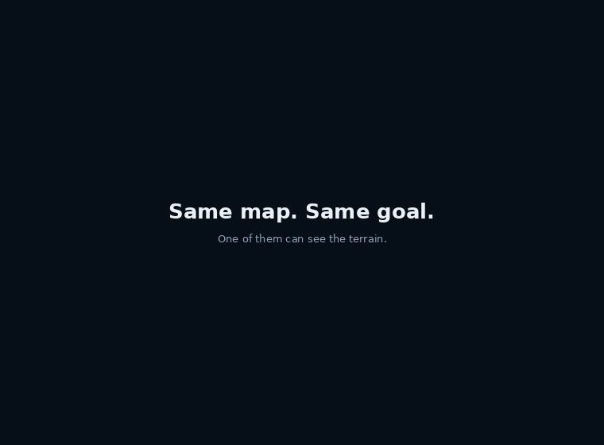

# Terrain Navigation: climb it or walk around it

Labs 1–3 were **planar**: two base joints, terrain as a profile along a
line, every obstacle head-on, no choice to make. This lab adds the
missing dimension — a 20 × 20 m arena, a random start **A** and goal
**B**, and ridges of two kinds that demand opposite responses.

| | rise | the right response |
|---|---|---|
| **climbable** | ≤ 0.12 m | go straight over; detouring costs distance |
| **impassable** | ≥ 0.45 m | walk to its end; climbing wastes the episode |

The threshold comes from [lab 2](../02_biped_stairs), which measured a
two-legged robot climbing 0.04–0.10 m treads reliably and failing above
that.

**Baseline:** the blind policy — proprioception and the goal bearing,
same algorithm, same 1.5M steps, six seeds across two sweeps: **7.8%**
arrival, 43.8% path efficiency.
**Budget:** 1.5M environment steps per run × 3 seeds per arm × 2
independent sweeps, goal range 7 m; scored on **120 evaluation episodes
per checkpoint** on identical maps.
**Falsifier:** if a policy handed the ground profile ahead does not beat
the blind one on arrival, terrain information is not what this task
needs. It does, on 5 of 6 seeds (sign test p = 0.016) — and on path
efficiency on 3/3 pairs.


---

## The result

Two independent sweeps, three seeds each, 120 episodes per checkpoint
on identical maps:


| | arrival | per seed |
|---|---|---|
| blind | 7.8% | 8, 15, 0, 4, 19, 1 % |
| **privileged** | **11.7%** | 16, 16, 4, 6, 18, 11 % |

Ahead on **5 of 6 seeds**, mean **+3.9 points**. Sign test p = 0.016;
Wilcoxon 0.063; paired t 0.089. Pooled Fisher p = 0.016 is an **upper
bound** — episodes within a seed share a policy and are not
independent.

### The route is the stronger signal

On maps **both** arms solve:


| seed pair | maps | blind | privileged |
|---|---|---|---|
| sweep 2, s0 | 2 | 52.1% | 60.8% |
| sweep 2, s1 | 7 | 45.5% | 53.2% |
| sweep 3, s1 | 9 | 33.7% | **50.3%** |
| **mean** | | **43.8%** | **54.8%** |

Better on 3/3 pairs, **+11.0 points**. A paired continuous measure on
identical maps with identical outcomes — much less quantisation noise
than binary arrival. The information buys **better routes**, not just
more of them.



Same map, both arrive: blind walks **25.5 m**, privileged **17.6 m**.

---

## Four bugs that would each have produced a wrong conclusion

**1. The privileged arm was broken by its own observation.** An 11 × 11
raw height patch meant a 142-dimensional input to a 2 × 64 MLP, and all
three seeds sat at *exactly* 0% arrival for the whole run. Three
identical zeros are impossible by chance; that is the only reason it was
caught. Six summary features train fine.

**2. Arriving ENDED the episode, making success the worst outcome.**
Standing still for 2000 steps earned 3000; arriving at step ~700 earned
1170. Success forfeited ~1300 steps of alive bonus, so loitering was
worth 2.5× more — and the policy correctly learned not to arrive.
[Lab 1](../01_obstacle_hopper) documents the mirror of this.

**3. Torque control meant the body could not stand.** It needs a
specific sustained pattern (hip 0.6 / knee 1.0) that exploration almost
never finds; a 1M-step run on flat ground reached 0%. Position
actuators make a zero action hold the standing pose.

**4. The fall detector sat inside the healthy oscillation band.** A
standing robot troughs at 0.49 and settles at 0.77; the threshold was
0.55, so episodes ended on a *healthy* robot's startup wobble. Now 0.40
— below the wobble, far above a real collapse at 0.19.

### And the measurement itself was too coarse

The in-training evaluation uses 12 episodes, which quantises to 8.3%.
It reported these two arms as **exactly 8.3% vs 8.3%**. Re-scoring the
same checkpoints on 120 episodes gave **7.8% vs 11.7%** — the effect was
there all along. Everything published comes from `evaluate.py`.

The *peak* of the training curve is equally unusable: it is the maximum
of ~60 noisy 12-episode evaluations, and every blind run peaks at
exactly 25% (3/12). Selecting on it would manufacture an advantage.

---

## The design, and what was swept to get it

Each constant was chosen by sweeping it against the property the lab
needs, because the first two attempts produced a task with no decision
in it:

| obstacle shape | cost of refusing to climb |
|---|---|
| round mounds, r = 1.2–2.2 m | median **0.00 m** over 109 maps |
| short ridges, 5–8 m | median **0.00 m** |
| **long ridges, 12–17 m** | median **+3.40 m** on a ~15 m route |

Length is the lever: a ridge that nearly spans the arena cannot be
skirted cheaply. Ends stay open so 94% of maps keep *both* routes
available — a choice, not a forced climb.

`tests/test_terrain_navigation.py` pins the **property** rather than the
parameters, so an edit to the lengths is caught by its consequence.

## The robot

`rootx`, `rooty`, **`rootyaw`**, `rootz` plus six leg joints; position
actuators centred on a measured standing pose.

**Torso pitch and roll stay locked** — inherited from lab 1's
measurement (freeing it gives the bipedal-balance problem) and lab 2's
2×2 (with two legs it costs return and buys no climbing). What it buys
is that the hard part here is navigation. What it costs: nothing here
measures recovery, and yaw is actuated directly because a planar biped
with locked roll cannot generate yaw torque through contact.

## Running it

```bash
cd 07_physical_ai/04_terrain_navigation
uv sync

uv run world.py --check 200     # solvable? do they detour?
uv run robot.py                 # the body on a map
uv run nav_env.py               # random baseline

uv run train_nav.py --flat --name gate_flat     # LOCOMOTION GATE, first
for s in 0 1 2; do
  uv run train_nav.py --mode blind      --seed $s --goal-range 7 --name nav_blind_s$s
  uv run train_nav.py --mode privileged --seed $s --goal-range 7 --name nav_priv_s$s
done

uv run evaluate.py --episodes 120               # the published numbers
uv run make_figures.py && uv run render.py --all
```

`--flat` is not part of the experiment. It asks only whether the body
can walk to a point and turn to face it, and it **failed twice** before
the position-actuator and start-pose fixes — which is the whole reason
it runs first.

```bash
uv run ../../tests/test_terrain_navigation.py   # 18 checks, no GPU, no OpenGL
```

### CoreWeave (SLURM)

```bash
sbatch run_deepspeed.sh
squeue -u $USER
tail -f logs/terrain_navigation_<jobid>.out
```

### RunPod

```bash
uv run runpod/runpod_ctl.py run 07_physical_ai/04_terrain_navigation \
    --dry-run --collect --wait --terminate --yes
uv run runpod/runpod_ctl.py pods      # confirm nothing is left running
```

`--terminate` is not optional hygiene: an abandoned pod bills until it
is destroyed. `--dry-run` proves the pipeline assembles before anything
long starts, and `pods` is how you check the box actually went away.

Note `--wait-seconds` defaults to 1800, which is shorter than a full
1.5M-step run — raise it, or the pod is destroyed mid-training.

### Hardware

| | |
|---|---|
| GPU | 1 × 16 GB, optional — the policy is 12k parameters and CPU is faster |
| Disk | ~20 GB (torch + MuJoCo); no downloads, the world is generated |
| Wall clock | ~20 min a run; ~2 h for a full six-run sweep |

## What this lab does not claim

- **The task is not solved.** ~12% arrival, ~55% efficiency when it
  arrives. The claim is that information *helps*, on a task that stays
  hard.
- **Every run peaks mid-training and sags.** 1.5M steps is short here.
- **This is a privileged channel, not a camera.** A depth arm would need
  distillation, as in [lab 3](../03_terrain_vision).
- **One seed of six goes the other way**, and it stays in the table.
