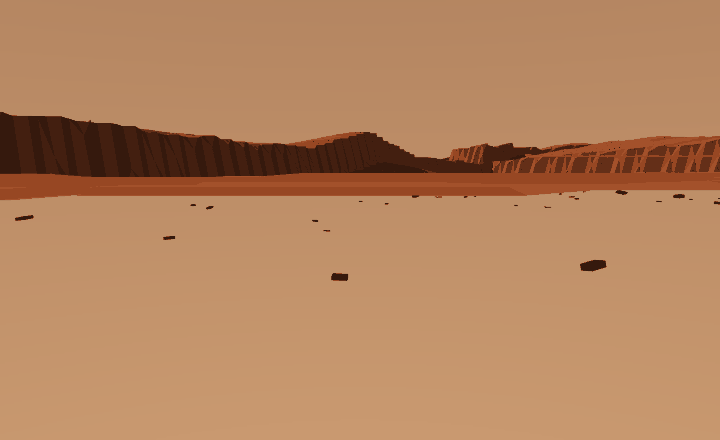

# Mars Terrain — Part 1: the ground, before the robot

## Abstract

A procedurally generated Martian surface, built to be *measured*
rather than admired. Lab 4 shipped a published result that was wrong
because of bugs in its world, its renderer and its metric — not in any
policy — so Lab 5 separates the two problems. **Part 1 contains no
robot:** no PPO, no reward, no arrival rate. It generates terrain at
two scales, asserts seven properties that a picture cannot show, and
produces six animations. Part 2 will put a robot on it. The surface
carries two deliberate affordance classes — smooth landforms a legged
robot should climb, and cliff-edged ones it must walk around — because
a terrain without a decision in it is scenery, not a task.



## Problem Statement

Terrain is the easiest thing in this repository to get wrong without
noticing. The usual check is "does it look right", and a height field
almost always looks right. Lab 4 proved the cost of that: a channel
carver, a coordinate frame, an efficiency denominator and a renderer
all produced plausible output while being wrong, and three of them
reached a published page.

So this lab inverts the usual order. The question is not *can we make
something that looks like Mars* — procedural noise does that in twenty
lines. It is **what has to be true of a generated planet before you
are allowed to believe it**, and can each of those things fail?

### Two scales, because the famous landforms do not fit

Olympus Mons is ~600 km across and ~22 km tall. Valles Marineris runs
~4,000 km. A robot arena is tens of metres. You cannot put either in
one, and a 2 m bump labelled "Olympus Mons" is a lie told with
geometry.

| preset | extent | what it is for |
|---|---|---|
| `regional` | 20 km | the shield volcano, the rift canyon, fossae swarms, cratered highlands, the crustal dichotomy. **For looking at.** |
| `rover` | 60 m | boulder fields, dune ridges, scarps, small craters, fractured bedrock. **Part 2 walks here.** |

The rover map is a *local sample of a Martian-looking surface*, not a
scale model of Mars. Both come from the same code with different
constants, and the properties are checked at both so one cannot stop
being Mars-like while the other still is.

## Solution

### What the generator models, and what it does not

Modelled, because it changes the shape of the ground:

- the **crustal dichotomy** — smooth low northern plains against high,
  rough, heavily cratered southern highlands (regional only; a 60 m
  patch does not straddle a hemispheric boundary)
- **impact craters** with raised rims, bowls and ejecta, drawn from a
  power-law size distribution and carrying an **age**: sharp young
  bowls superimposed on soft, half-filled old ones
- a **shield volcano** — broad, with a summit caldera, and far flatter
  than anyone draws it
- a **rift canyon** with terraced walls, and **swarms of parallel
  graben** sharing one orientation, as at Sirenum Fossae
- **dendritic dry channels** that run downhill and join
- **aeolian ripples** transverse to one prevailing wind
- scattered rock as angular **platy slabs**, not boulders
- patches of exposed, **fractured bedrock pavement**

Not modelled, stated so nobody assumes otherwise: polar ice caps (a
square tile has no pole in it), atmospheric scattering, real MOLA
elevation data, and regolith mechanics — the ground is rigid.

### The two affordance classes

This is what makes the terrain a task rather than scenery, and it is
lab 4's lesson restated in Martian landforms:

| class | landform | rise at the edge | the right response |
|---|---|---|---|
| **climbable** | dune ridges, rounded hills, degraded crater rims | under 0.12 m per step | go over; detouring costs distance |
| **blocked** | mesas, buttes, scarps | far over | walk to the end; the top is walkable, the **edge** is a wall |

The mesa is the interesting one. Its top is as traversable as the
plain — only the shoulder stops you — so **height alone does not
predict whether a robot can be there.** It has to read the edge.

The 0.12 m threshold is inherited from [lab 2](../02_biped_stairs),
which measured a two-legged robot climbing 0.04–0.10 m treads reliably
and failing above that.

## Experiments and Results

`uv run mars.py --check 20`, twenty seeds at both scales:

| | rover (60 m) | regional (20 km) |
|---|---|---|
| relief | 2.7–4.0 m | ~4.2 km |
| slope, mean | 6–10° | 22° |
| walkable (rise ≤ 0.12 m) | **96%** | — |
| crater exponent *b* | ~1.9 | **2.02** |
| edge blocked, climbable class | **4–6%** | — |
| edge blocked, cliff class | **17–24%** | — |

The classes separate by about **3×** at the edge, which is the
property the lab exists to produce.

### What does not work yet, stated plainly

**The routing decision is weak.** Refusing to climb saves a median of
**+1.24 m**, and only **5 of 10 seeds** save more than a metre. For
comparison, lab 4's arena — a quarter the area — reached +3.40 m.
Obstacles here are sparse enough (96% of cells walkable) that a route
can often avoid everything for free.

That is a real limitation and Part 2 inherits it. The fix is probably
not more obstacles but **goal placement**: lab 4 found that where you
put A and B decides whether the terrain's decision actually binds, and
that is a Part 2 question.

## What Went Wrong, and What It Taught Us

Three failures while building this, none of which crashed.

**A carve that accumulated.** The channel walker subtracted its depth
at each of 150 overlapping steps, so a channel asked for 0.15 m was
cut tens of metres deep. The rover map came back with **46 m of relief
inside a 60 m box** and the ASCII view still looked like terrain. Now
the deepest cut per cell is accumulated and applied once — and relief
is asserted against the preset, because "looks like terrain" does not
distinguish 3 m from 46 m.

**A measurement that answered the wrong question.** Traversability was
averaged over each landform's bounding box, reporting mesas as 86%
walkable. True, and meaningless: the box is mostly the flat top and
the surrounding plain. The obstacle is the shoulder, so the
measurement now samples a **ring** at the landform's own radius.

**A silent zero.** `climbing_pays` blocked every cell above the median
elevation — 38% of the arena — which walled the map off entirely. Every
route came back infinite, every sample was dropped, and the function
returned `0.0`. Eight seeds in a row read `+0.00 m`, which looks
exactly like *this terrain contains no decision* and actually meant
*nothing was measured*. **A plausible number is the worst possible
failure value**: it is in range, and it points at the wrong culprit. It
now returns `NaN` and reports its usable-sample count.

## Running It

```bash
cd 07_physical_ai/05_mars_terrain
uv sync

uv run mars.py --check 20            # the measurements
uv run mars.py --scale rover --ascii # one map, in text
uv run mars.py --scale regional      # the planetary view
uv run render_mars.py --all          # six animations
```

```bash
uv run ../../tests/test_mars_terrain.py   # 17 checks, no GPU, no OpenGL
```

### CoreWeave (SLURM)

```bash
sbatch run_deepspeed.sh
squeue -u $USER
tail -f logs/mars_terrain_<jobid>.out
```

**There is no `deepspeed` call in that script and no GPU requested.**
This lab trains nothing — no parameters, no gradients, nothing for
ZeRO to shard — so a distributed launcher would be cargo cult. The
file keeps its name because every example in this course has one and a
reader should find it where they expect.

### RunPod

```bash
uv run runpod/runpod_ctl.py run 07_physical_ai/05_mars_terrain \
    --dry-run --collect --wait --terminate --yes
uv run runpod/runpod_ctl.py pods
```

`--terminate` is not optional hygiene: an abandoned pod bills until it
is destroyed.

### Hardware

| | |
|---|---|
| GPU | none for the generator or the checks; the **renderer** needs an OpenGL context |
| Disk | ~3 GB (numpy + MuJoCo + pillow). No downloads — the planet is generated |
| Wall clock | checks ~40 s; all six animations ~10 min |

## What This Lab Does Not Claim

- **This is not Mars.** It is procedural terrain matched to published
  descriptions and imagery. MOLA elevation data exists; this is not it.
- **No robot has walked here.** Traversability is computed from a gait
  rule, not demonstrated. Part 2 is where that claim gets earned.
- **The routing decision is weak** — +1.24 m median, 5 of 10 seeds.
- **The palette is a presentation choice**, not a result. Nothing here
  simulates atmospheric scattering; the sky is butterscotch because
  surface imagery shows it that way.
