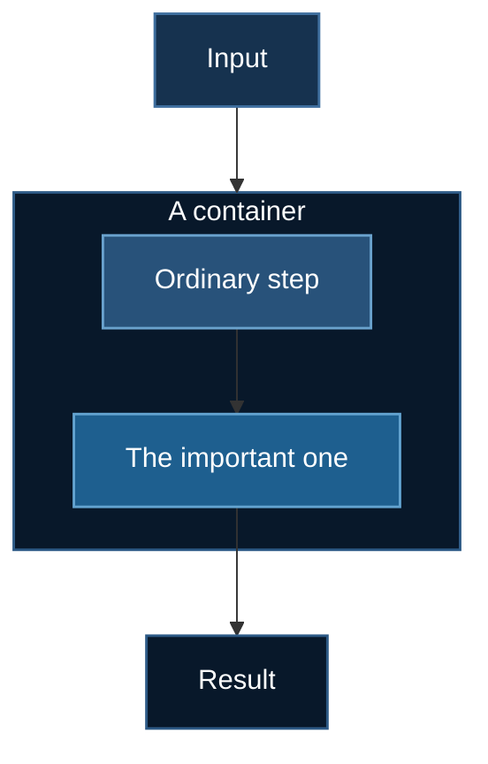

# Contributing

**Yes — contributions from anyone are welcome.** You do not need to know the
maintainer, ask permission first, or be an expert. Fork the repo, add your
example, open a pull request.

This document is deliberately long. It is the difference between "we accept
contributions" and "your contribution will actually be merged," and it is
written to be read by **two audiences**:

- **humans**, who want to know what is expected before spending a weekend on it
- **coding agents such as Claude Code**, which can follow it as an executable
  spec — see [§10](#10-contributing-with-claude-code)

> **In a hurry?** Read [§3 the three-platform contract](#3-the-three-platform-contract-the-part-that-matters-most),
> run `uv run scripts/new_example.py <folder>`, and work through
> [§9 the checklist](#9-the-checklist-definition-of-done).

---

## Table of contents

1. [What this repository is](#1-what-this-repository-is)
2. [What you can contribute](#2-what-you-can-contribute)
3. [The three-platform contract](#3-the-three-platform-contract-the-part-that-matters-most)
4. [The six-file contract](#4-the-six-file-contract)
5. [Step by step](#5-step-by-step)
6. [Hard rules](#6-hard-rules-these-will-block-a-merge)
7. [Writing the test](#7-writing-the-test)
8. [Documentation](#8-documentation)
9. [The checklist (definition of done)](#9-the-checklist-definition-of-done)
10. [Contributing with Claude Code](#10-contributing-with-claude-code)
11. [Review, licensing, conduct](#11-review-licensing-conduct)

---

## 1. What this repository is

A **teaching course**, not a library. Each numbered directory is a
self-contained, runnable DeepSpeed example, escalating in difficulty from a
two-parameter linear model to 560B-parameter multimodal training.

Three consequences that surprise nearly every new contributor:

**There is no package and no shared module.** Directories deliberately
duplicate code rather than import from each other, so a reader can open one
folder and run it without touching the rest.

> ⛔ **Do not refactor shared logic into a common module.** This is the most
> common well-intentioned PR we decline. `require_gpu()` appears verbatim in
> ~19 files *on purpose*. DRY is a good instinct for applications and the wrong
> instinct for a course, where every indirection is a tab the reader has to open.

**Comments and docstrings are the product.** Line-by-line explanation — even on
`#SBATCH` directives — is the pedagogical point, not clutter. A terse,
"clean" script is a *worse* contribution here than a verbose one. Match the
density of the surrounding files.

**Print formatting is part of the API.** READMEs quote expected output. Change
a banner and you invalidate the docs.

---

## 2. What you can contribute

Anything that teaches distributed training, at any level:

| Kind | Examples |
|---|---|
| **A new example** | a model, architecture, or training regime not yet covered |
| **A new subsection** | a deeper treatment inside an existing topic (see `04_video_text/`) |
| **A fix** | a real bug — these are valued more than new features |
| **A test** | a logic check that would have caught a bug we shipped |
| **Docs** | clearer explanation, a diagram, a corrected claim |
| **Tooling** | improvements to `runpod/`, `scripts/`, or `tests/` |

### ⛔ A topic is a FOLDER, not a page

This is the most common way a contribution arrives incomplete, and it has
happened to maintainers as well as newcomers. **A documentation page is not a
topic.** If your contribution introduces a method a reader would want to *run*,
it needs the whole set of assets:

```
NN_your_topic/
├── train_*.py          entry point — uv + deepspeed, require_gpu() first
├── ds_config*.json     DeepSpeed config, with the ZeRO choice explained
├── run_deepspeed.sh    SLURM batch script (CoreWeave)
└── README.md           standalone walkthrough

runpod/runpod_ctl.py    one EXAMPLES entry           (RunPod)
tests/test_*.py         a logic test, registered in TWO places
docusaurus-docs/…       a page + a sidebars.js entry (the book)
```

Use this to decide which you are writing:

| Your change | Folder required? |
|---|---|
| Explains code that **already exists** more clearly | **No** — docs only |
| Adds a diagram, fixes a wrong claim, improves prose | **No** — docs only |
| Introduces a method/model a reader would want to **run** | **Yes — full folder** |
| Introduces a *family* of related methods | **Yes** — one folder, one entry point with a `--method` flag |
| Is a variant of an existing method (a patched loss, a tweak) | **No** — add a module + test to the existing folder |

**Worked example, from this repository.** The DPO family arrived as four
documentation pages plus a loose module dropped into `03_huggingface/06_grpo/`.
That was wrong on both counts, and it was fixed by building what the contract
actually requires:

- `03_huggingface/05_dpo/` — the offline family, one `train_dpo.py` with
  `--method dpo|ipo|cpo|kto|orpo|simpo`, because they share a trainer and
  differ by a scalar function. Six folders would have been six copies of the
  same file.
- `03_huggingface/04_reward_model/` — a genuinely different objective
  (Bradley–Terry, a scalar head, `RewardTrainer`), so a separate folder.
- `03_huggingface/07_online_dpo/` — different memory profile entirely (it
  *generates* during training), so a separate folder with ZeRO-3 instead of
  ZeRO-2.
- Dr. GRPO / DAPO / GSPO stayed **inside** `03_huggingface/06_grpo/` as a module,
  because they are patches to an objective that already has a folder.

The rule of thumb the split follows: **one folder per distinct memory profile
and trainer**, not one folder per paper.

**No topic is off-limits** as long as it is genuinely about scaling or
distributed training. New optimizers, pipeline parallelism, MoE routing, FSDP
comparisons, quantization-aware training, RLHF variants, other modalities — all
welcome.

### Where your example goes

- **New top-level topic** → next number: `10_your_topic/`. Numbers signal
  difficulty; place it where its prerequisites sit, not where it is convenient.
- **Deeper treatment of an existing topic** → a numbered subfolder:
  `04_video_text/05_your_idea/`. This is often the better choice — it inherits the
  topic's context and does not claim the reader has finished everything before it.

### Before you start something large

Open an issue describing the idea. Not for permission — to avoid two people
building the same thing, and so a maintainer can tell you early if it needs 8×H100
to demonstrate (which limits who can learn from it).

---

## 3. The three-platform contract (the part that matters most)

**Every contribution must work sensibly for three different readers.** This is
the core requirement and the one most likely to send a PR back.

```
Reader A  has a laptop, no GPU            -> must FAIL GRACEFULLY, and be told what they CAN do
Reader B  has CoreWeave (shared SLURM)    -> must be able to `sbatch` it, and dry-run it cheaply
Reader C  has a RunPod API key and money  -> must be able to rent, run, and AUTO-SHUT-DOWN
```

You are not expected to *own* all three platforms. You are expected to make
your example **not break** on any of them, and the tooling below does most of
the work.

### Check it, do not guess

The contract is **executable**. Run this before you open a PR:

```bash
uv run scripts/check_contract.py 10_my_topic     # one example
uv run scripts/check_contract.py                 # the whole repo
uv run scripts/check_contract.py -v 10_my_topic  # show passing checks too
```

It audits all three readers plus the asset inventory — ~28 checks per example —
and tells you exactly which reader you broke and why. It needs no GPU, no
network and no downloads.

It is **advisory, not a CI gate**. Older examples predate parts of the contract
and legitimately differ, and failing the build on those would either force churn
in working code or water the checks down until they catch nothing. Reviewers run
it; `--strict` exits 1 for the folders you want held to the line.

The subset that *is* non-negotiable — `EXAMPLES` registration, `bash -n` over
every shell script, `#SBATCH` presence — is enforced by `tests/test_runpod_ctl.py`
and does fail CI.

> **It works.** Pointing it at the repo found a shipped bug: `03_huggingface/03_ocr`
> requested `--ntasks-per-node=2` *and* ran `deepspeed --num_gpus=2`, so SLURM
> started two tasks that each spawned two workers — four processes for two GPUs,
> which hangs. It also found 13 READMEs that never told a RunPod reader how to
> shut the pod down.

---

### 3.1 Reader A — no GPU: fail gracefully

A newcomer with a laptop runs your script. Without a preflight check, DeepSpeed
gets as far as building its fused Adam kernel and dies with:

```
OSError: CUDA_HOME environment variable is not set
```

…raised from deep inside torch's C++ extension loader. That message tells a
newcomer **nothing** about what went wrong or what to do next, and it is the
single most common reason people bounce off distributed training.

**Requirement: every entry point calls `require_gpu()` before importing torch
or deepspeed at module scope.**

Copy it verbatim from any existing example (e.g. `01_basics/01_neuralnet/train_ds.py`)
— the scaffold in §5 writes it for you. Then **customise the message body** to
say something true about *your* example:

```python
    print("\n  TODO: say whether THIS example can run on CPU.")
    print("  If it can, say how (smaller model? fewer steps? ALLOW_CPU=1?).")
    print("  If it cannot, say so plainly and point at one that can.")
```

Three rules for the message:

1. **Say why it stopped**, in one sentence a beginner understands.
2. **Say what they can still do.** Never leave a reader with only a dead end —
   point at `./tests/run_all.sh`, the docs site, or a CPU-runnable example.
3. **Say how to get a GPU**, with the exact `runpod_ctl.py` command.

**Import order matters.** Put heavy imports *inside* `main()`, after the
preflight:

```python
def main() -> None:
    args = parser.parse_args()
    require_gpu()              # <- FIRST

    import deepspeed           # <- only now
    import torch
```

Import torch at module scope and a CPU-only reader gets a CUDA traceback before
your message ever runs.

**`ALLOW_CPU=1` must be honoured.** Some readers genuinely want to step through
the code on CPU. Let them, with a warning that the DeepSpeed config also needs
`"torch_adam": true` and fp16/bf16 disabled.

> **Better still: make part of your example CPU-runnable.**
> `04_video_text/03_token_compression/` and `04_video_text/04_streaming_memory/` are fully
> CPU-runnable because their substance is *algorithms* rather than *weights*.
> If your contribution has an algorithmic core, factor it into a module that
> runs on plain tensors. Readers without a GPU can then learn the actual idea,
> and you get a test suite that runs in CI.

---

### 3.2 Reader B — CoreWeave: SLURM, and a cheap dry run

CoreWeave is a **shared SLURM cluster**. You SSH to a login node and *submit*;
you never run training interactively. So:

**Requirement: ship a `run_deepspeed.sh` with `#SBATCH` headers.**
`tests/test_runpod_ctl.py` asserts every topic has one — *"a CoreWeave user must
be able to `sbatch` every topic"* is a promise the repo makes.

The scaffold generates a correct one. Things it gets right that hand-written
scripts routinely get wrong:

| Directive | Why |
|---|---|
| `--ntasks-per-node=1` | **ONE task.** The `deepspeed` launcher spawns a worker per GPU itself. Let SLURM also start one task per GPU and you get N² processes and usually a hang. |
| `--cpus-per-task=8+` | Too few starves the dataloader; the GPU idles between batches and it looks like a slow model. |
| `mkdir -p logs` | Then `--output=logs/name_%j.out`. Without the mkdir, SLURM silently discards output. |
| `export HF_HOME=/scratch/...` | `$HOME` is usually a small NFS quota; a multi-GB download into it fails slowly. |
| venv built on a **login** node | Compute nodes usually have no network egress. |

**Provide a dry-run path.** A cluster user should be able to validate the
plumbing without burning a full allocation. Support a step cap:

```python
parser.add_argument("--max-steps", type=int, default=-1,
                    help="Cap steps; used by the dry-run path.")
```

Parse with **`parse_known_args()`**, not `parse_args()`. The DeepSpeed launcher
injects `--local_rank` into your script's argv, and a strict parser rejects it
and exits before training starts:

```python
return parser.parse_known_args()[0]      # ✅ tolerates --local_rank
return parser.parse_args()               # ❌ "unrecognized arguments: --local_rank"
```

**And end your launcher's invocation line with `"$@"`.** This is the half that
gets forgotten, and forgetting it is invisible:

```bash
deepspeed --num_gpus=2 train_ds.py "$@"      # ✅ the flag arrives
deepspeed --num_gpus=2 train_ds.py           # ❌ silently swallowed
```

Without it, `sbatch run_deepspeed.sh --max-steps 20` still *submits fine* and
still *runs fine* — it just runs the full job. The dry run is not refused, it is
ignored, and you find out from the bill or the wall clock. Every launcher in
this repository shipped without `"$@"` at one point, which made every documented
dry-run command a no-op; `scripts/check_contract.py` now checks for it so it
cannot come back.

Then document it in your README:

```bash
sbatch run_deepspeed.sh --max-steps 20      # smoke test
sbatch run_deepspeed.sh                     # the real thing
```

Two details worth stating in the README, because readers assume otherwise: the
cap counts **optimizer steps, not epochs** (with gradient accumulation of 4,
`--max-steps 5` consumes 20 micro-batches), and if your launcher is a bare
script with no `#SBATCH` headers — like `05_video_speech/01_longcat_omni/run_2xB200.sh` —
say `./run_2xB200.sh --max-steps 5`, not `sbatch`.

Document the full loop, because a first-time SLURM user does not know it:

```bash
sbatch run_deepspeed.sh          # submit
squeue -u $USER                  # is it running?
tail -f logs/<name>_<jobid>.out  # watch
scancel <jobid>                  # stop
```

---

### 3.3 Reader C — RunPod: rent, run, **shut down**

RunPod is a single-user pod with direct GPU access. There is **no SLURM** — the
`#SBATCH` lines are inert comments — so the pod lifecycle is driven by API
through `runpod/runpod_ctl.py`.

**Requirement: register your example in the `EXAMPLES` table** in
`runpod/runpod_ctl.py`. One line. The scaffold prints it for you:

```python
"10_your_topic": dict(min_vram=24, gpus=1, disk=60,
                      script="train_your_topic.py",
                      note="The one thing that surprises people."),
```

| Field | Meaning |
|---|---|
| `min_vram` | GB **per GPU**. Be honest — too low and readers OOM after paying to download weights. |
| `gpus` | How many. Justify anything above 1 in your README. |
| `disk` | GB including model downloads. Too small and the pod dies mid-download. |
| `script` | Path **relative to your folder**. Nested paths are fine. |
| `launcher` | Omit for `deepspeed` (the default). Set `launcher="python"` **only** if there is genuinely nothing to shard — pure inference, or evaluation. |
| `note` | One line. The surprising constraint, not a description. |

`tests/test_runpod_ctl.py` **fails** if a numbered example is missing from this
table, so you cannot forget.

#### Use the auto-shutdown template. Always.

> ### 💸 An abandoned pod bills until terminated
> *Stopping* is not enough. A forgotten pod is the most expensive mistake in
> this repository, and it is silent.

The canonical invocation, which every README must document:

```bash
export RUNPOD_API_KEY=...        # https://console.runpod.io/user/settings

uv run runpod/runpod_ctl.py recommend 10_your_topic          # what fits, what it costs
uv run runpod/runpod_ctl.py run 10_your_topic \
    --dry-run --collect --wait --terminate --yes
uv run runpod/runpod_ctl.py pods                             # "Nothing is billing."
```

What each flag buys you:

| Flag | Effect |
|---|---|
| `--dry-run` | Caps the training step (300s). The pod still clones, installs, and launches the **real** script, so genuine failures still surface — you just do not pay for a full run. |
| `--collect` | Pod pushes progress and logs to a random ntfy.sh topic. **No SSH, no port forwarding** — RunPod exposes no log endpoint, so the pod pushes. |
| `--wait` | Blocks locally until the pod reports DONE. |
| `--terminate` | Deletes the pod in a `finally` block, so a crash, a network failure, or Ctrl-C **still** stops the billing. Retries five times with backoff. |
| `--yes` | Skips the confirmation. Both `run` and `create` refuse without it and print the hourly rate first. |

Two further safety nets you inherit for free:

- **In-pod watchdog.** `--max-hours` (default 6) kills the container from the
  inside regardless of what your machine is doing. It needs **no API key**.
- **`terminate --all`.** The blunt instrument for cleaning up.

> **The pod is never given `RUNPOD_API_KEY`.** Letting it delete itself would
> mean putting a spending credential on rented hardware. Termination is driven
> from your machine instead. Do not "improve" this. See
> [SECURITY.md](SECURITY.md).

#### If you extend the bootstrap, never echo a token

The results topic is unguessable but **public**. `tests/test_runpod_ctl.py`
enforces this:

```python
for danger in ("$RUNPOD_API_KEY", "$HF_TOKEN", "$WANDB_API_KEY", "env |", "printenv"):
    assert danger not in bootstrap(...)
```

#### If you cannot test on RunPod

Say so in your PR. Registering the table entry and documenting the commands is
enough — a maintainer or another contributor can verify on hardware. **Do not
invent output.** Fabricated "expected output" is worse than none, because
readers compare against it to decide whether their run worked.

---

## 4. The six-file contract

Every example folder has the same shape:

| File | Role |
|---|---|
| `train_*.py` | Entry point. Calls `deepspeed.initialize(...)`, reads the JSON config, starts with `require_gpu()`. |
| `ds_config*.json` | DeepSpeed config — ZeRO stage, precision, optimizer, batch sizes. |
| `run_deepspeed.sh` | SLURM batch script. (`submit_job.sh` / `run_training.sh` are accepted legacy names.) |
| `README.md` | Standalone walkthrough: hardware, setup, run command, expected output. |
| **`pyproject.toml`** | **Makes the folder a `uv` project.** Declares the dependencies, `requires-python`, and the optional `tracking` extra for W&B. |
| **`uv.lock`** | **Committed.** The exact resolved versions, so every reader installs the same thing. |

### `uv sync` must work from a fresh clone

This is the requirement, and it is testable in one command:

```bash
git clone <repo> && cd <repo>/10_my_topic
uv sync                       # MUST succeed with no other setup
uv run deepspeed --num_gpus=1 train_ds.py
```

If that fails, the example is not finished. `uv run` uses the project
environment directly, so there is no `activate` step to forget.

**Commit the lock.** It is the whole point. Without it `uv pip install torch
deepspeed` resolves to whatever is newest the day someone runs it, which is how
a tutorial that worked in March breaks in September with nobody having touched
it. Regenerate deliberately with `uv lock --upgrade`, never as a side effect.

Build one like this:

```bash
cd 10_my_topic
uv init --no-workspace --no-readme        # or copy a neighbour's pyproject.toml
uv add torch deepspeed                    # writes pyproject.toml AND uv.lock
uv sync && uv run python -c "import torch, deepspeed"
```

Rules the existing examples follow, and which yours should:

| Rule | Why |
|---|---|
| **Per-folder lock, not a workspace** | Examples are self-contained by design. A reader opening one folder must be able to run it without the other 22 existing. |
| **`package = false` under `[tool.uv]`** | These are runnable examples, not distributable libraries. Without it `uv sync` tries to build the folder as a package and fails. |
| **W&B goes in `[project.optional-dependencies]`** | Every training script wraps `import wandb` in `try/except` and only tracks when `WANDB_API_KEY` is set. Making it required contradicts the code. |
| **Pin torch to an explicit CUDA index** | `[[tool.uv.index]]` + `[tool.uv.sources]`, currently `cu128`. PyPI's *default* `torch` is a CUDA 13 wheel: on a driver older than CUDA 13 — the 550 and 570 series, which much rented hardware runs — it installs cleanly and then reports `cuda.is_available() == False`. Verified on a driver 550.127 box: `uv sync` succeeded and torch could not see the GPU. `cu128` works on both old and new drivers. |
| **`requires-python = ">=3.10"`** | The floor that actually resolves for current torch. A looser bound produces a lock that cannot install on the Python it claims to support. |

> **Why the CUDA index is not optional.** A lock that resolves torch from
> PyPI gets whatever CUDA build is current — today a CUDA 13 wheel. On a host
> whose driver predates CUDA 13, `uv sync` still succeeds, and then
> `torch.cuda.is_available()` returns **False** while `nvidia-smi` happily
> shows the card. `require_gpu()` then tells the reader they have no GPU. That
> is the quiet-wrongness this repository exists to avoid, so the CUDA build is
> pinned rather than inherited. `tests/gpu/verify_uv_sync_cuda.sh` checks it on
> real hardware — it is what caught this.

`tests/test_runpod_ctl.py` fails if a registered example is missing either
file, so this is enforced rather than merely requested.

Larger examples may add `HARDWARE_REQUIREMENTS.md` or similar.

### The complete asset inventory

Those four files live in your folder. **A topic is not finished until the files
outside it exist too** — they are what make it discoverable, rentable and
verifiable, and almost every one is enforced by CI or by a test:

| Asset | Where | Enforced by |
|---|---|---|
| Entry point | `NN_topic/train_*.py` | `compileall` in CI |
| DeepSpeed config | `NN_topic/ds_config*.json` | `test_ds_configs.py` |
| SLURM launcher | `NN_topic/run_deepspeed.sh` | `test_runpod_ctl.py` — `#SBATCH`, `bash -n`, executable bit |
| Folder README | `NN_topic/README.md` | review |
| **RunPod entry** | `runpod/runpod_ctl.py` → `EXAMPLES` | `test_runpod_ctl.py` **fails** without it |
| **Logic test** | `tests/test_*.py` | review |
| **Test registration** | `tests/run_all.sh` **and** `.github/workflows/tests.yml` | review — *both*, not one |
| **Book page** | `docusaurus-docs/docs/tutorials/…` | `npm run build` |
| **Sidebar entry** | `docusaurus-docs/sidebars.js` | `test_docs_style.py` — a missing entry silently **orphans** the page, so it is now checked |
| **Mermaid palette** | any `\`\`\`mermaid` block | `test_docs_style.py` |

Every row is now guarded. `test_docs_style.py` closed the last gap — the
sidebar entry, which nothing in the Docusaurus build warns about.

`uv run scripts/new_example.py <folder>` writes the four in-folder files and
prints the `runpod_ctl.py` line for you. The rest is on you.

### The batch invariant

DeepSpeed enforces this at startup and aborts if it fails:

```
train_batch_size == train_micro_batch_size_per_gpu × gradient_accumulation_steps × num_gpus
```

**Changing `--num_gpus` in a launcher without updating the JSON is the single
most common breakage in this repository.** `tests/test_ds_configs.py` checks
your config against the GPU count your launcher actually requests.

**The portable fix: omit `train_batch_size` entirely.** DeepSpeed derives it,
and the config then works at any GPU count. The scaffold does this.

### Other config rules the tests enforce

- **Never enable both `fp16` and `bf16`.** DeepSpeed raises at init. Also avoid
  the *latent* form — one hard-`true` while the other is `"auto"`.
- **`"auto"` requires a HuggingFace `Trainer`.** It is a Trainer convention, not
  a DeepSpeed feature; `Trainer` substitutes real values before DeepSpeed sees
  the file. Call `deepspeed.initialize()` directly with `"auto"` in the config
  and it is a parse error.
- **ZeRO-3 needs `stage3_gather_16bit_weights_on_model_save: true`**, or the
  checkpoint is written as shards `from_pretrained` cannot load.
- **`offload_param` requires stage 3.** Below that it is silently ignored.
- **NVMe offload must not point at a network filesystem** (`/home`, `/nfs`) —
  catastrophically slow.

---

## 5. Step by step

### 5.1 Fork and clone

```bash
# Fork on GitHub, then:
git clone https://github.com/<your-username>/deepspeed-course.git
cd deepspeed-course
git remote add upstream https://github.com/yiqiao-yin/deepspeed-course.git
git checkout -b add-my-example
```

Work on a branch, never on `main`.

### 5.2 Set up with `uv`

This repo uses [`uv`](https://docs.astral.sh/uv/) for everything. **Never bare
`pip`, never conda** — including for throwaway checks.

```bash
curl -LsSf https://astral.sh/uv/install.sh | sh    # if you do not have it

uv venv && source .venv/bin/activate
uv pip install torch --index-url https://download.pytorch.org/whl/cu128
uv pip install deepspeed
```

Useful forms:

```bash
uv run script.py                     # run, provisioning deps automatically
uv run --no-project python -c "..."  # a one-off with no project env
uv run tests/test_ds_configs.py      # tests carry their own deps (PEP 723)
```

You do **not** need a working GPU environment to contribute — the entire test
suite runs on CPU.

### 5.3 Scaffold your example

```bash
uv run scripts/new_example.py 10_my_topic --title "My Topic" \
    --vram 24 --gpus 1 --disk 60
```

This writes the four files with the contract already satisfied — `require_gpu()`
wired, a portable `ds_config.json`, a correct SLURM script with secrets left
commented, and a README with the required headings.

It also writes a test stub and prints your `runpod_ctl.py` line.

### 5.4 Verify the scaffold before writing anything

Add the printed line to `EXAMPLES` in `runpod/runpod_ctl.py`, then:

```bash
./tests/run_all.sh
```

Green. **Now** start writing. From here every failure is genuinely yours — you
are never debugging the scaffolding and your model at the same time.

### 5.5 Build it

Replace every `TODO(contributor)`:

```bash
grep -rn 'TODO(contributor)' 10_my_topic tests/test_my_topic.py
```

### 5.6 Verify, commit, push

```bash
./tests/run_all.sh
uv run scripts/audit_readmes.py       # advisory; triage by hand
git add 10_my_topic tests/test_my_topic.py runpod/runpod_ctl.py
git commit -m "feat: Add 10_my_topic — <what it teaches>"
git push origin add-my-example
```

Then open a PR. The template walks you through the checklist.

### 5.7 Keeping up to date

```bash
git fetch upstream && git rebase upstream/main
```

---

## 6. Hard rules (these will block a merge)

### 🔴 Use `uv`, never bare `pip` — and ship a lock

In docs, READMEs, SLURM scripts, and docstrings. `uv pip install X`, not
`pip install X`. This is a `uv`-managed course and mixed instructions strand
readers halfway.

Beyond that, **every example folder must be a `uv` project**: a
`pyproject.toml` and a **committed `uv.lock`**, such that

```bash
cd <your_example> && uv sync
```

works from a fresh clone with no other setup. See
[the six-file contract](#4-the-six-file-contract) for the specific rules and
`tests/test_runpod_ctl.py` for the check that enforces them.

A PR that adds an example without a lock will be asked for one. It is not
bureaucracy: an unlocked example is a tutorial with an expiry date nobody
wrote down.

### 🔴 Use `deepspeed` — this is a DeepSpeed course

The whole point is distributed training. An example that only calls
`Trainer.train()` with no ZeRO config does not belong here.

**Two narrow exceptions**, both already present:
- `03_huggingface/09_multi_agency` drives TRL's `GRPOTrainer` directly.
- `04_video_text/04_streaming_memory` and `04_video_text/05_video_eval` are inference and
  evaluation — no optimizer, nothing to shard.

If you believe yours is a third exception, **say so explicitly in the PR and
explain why**. Using a distributed launcher where there is nothing to distribute
is cargo cult; omitting it because you did not get around to it is not.

### 🔴 Secrets stay commented **and** quoted

```bash
# export WANDB_API_KEY="your_value_here"      # ✅
export WANDB_API_KEY=<ENTER_KEY_HERE>         # ❌ BASH SYNTAX ERROR
```

`<` is a redirection operator. That second line **aborts the script**, which
never reaches the training command. **Seven scripts shipped that way and could
never run.** `tests/test_runpod_ctl.py` now runs `bash -n` over every shell
script in the repo to stop it recurring.

Never commit a real key. Never add `env`, `printenv`, or anything that echoes a
token to the RunPod bootstrap — it publishes to a public feed.

### 🔴 W&B is optional and soft

```python
try:
    import wandb
    WANDB_AVAILABLE = True
except ImportError:
    WANDB_AVAILABLE = False
```

Enable tracking only when `WANDB_API_KEY` is set. Your example must run with no
W&B installed.

### 🔴 Do not refactor shared logic into a common module

See [§1](#1-what-this-repository-is). Duplication is the design.

### 🔴 Type hints on function signatures

```python
def extract_frames(video_path: str, num_frames: int) -> List[np.ndarray]:
```

### 🔴 Never fabricate output

Not in READMEs, not in docs, not in comments. If you have not run it, say
"not yet verified on hardware." A published number that is wrong costs a reader
a day of debugging their own correct setup.

### 🔴 Fail loudly, never silently

The worst bugs this repo has shipped all ran fine and were quietly wrong:

- a frame extractor that returned **one image repeated** — training ran, loss
  decreased, zero temporal signal
- a collator that silently **dropped `pixel_values`** — the model trained on
  text only and nothing raised
- a scaler fit **before** the train/test split — look-ahead bias, great metrics
- an eval harness whose RNG was **correlated with the answer key** — a random
  baseline scored 100%

Raise. Do not return a placeholder. If your pipeline can be misconfigured into
doing nothing, **assert that it did something**:

```python
if "pixel_values_videos" not in encoded and "pixel_values" not in encoded:
    raise RuntimeError(
        "processor returned no video pixels — the vision path is "
        "disconnected and training would silently proceed on text only"
    )
```

---

## 7. Writing the test

### What can and cannot be verified

| Examples | Verification |
|---|---|
| `01`–`04` | Runnable end to end on one machine |
| `05`–`09` | **Not runnable locally.** Verify logic only |

For the second group, do **not** attempt a full training run to validate a
change — it will not fit, and a partial run proves nothing. Write a **logic
test** in `tests/` that exercises the changed code path without a GPU or a
model download.

### Assert properties, not shapes

This is the difference between a test that catches bugs and one that does not.

```python
# ❌ passes on completely broken compression
assert output.shape == (1, 8192, 3584)

# ✅ catches it
r.check(torch.allclose(corrected, true_mass, atol=1e-6),
        "log-size bias exactly reproduces unmerged attention mass")
r.check((naive - true_mass).abs().item() > 1e-3,
        "without the bias, merged attention is measurably wrong "
        "-- if these matched, the test setup would be proving nothing")
```

That second check is the trick worth stealing: **assert that the buggy version
actually fails**, or your test may be passing vacuously.

### Test the shipped source

`tests/_srcload.py` extracts a single function from a training script via `ast`,
so tests run against the **actual shipped code** without importing torch:

```python
from _srcload import Results, load_function, source_contains

fn = load_function("10_my_topic/train_my_topic.py", "my_function")
r.check(fn(2, 3) == 6, "multiplies correctly")
```

### Register it

Tests use [PEP 723](https://peps.python.org/pep-0723/) inline metadata, so
`uv run` provisions each automatically:

```python
# /// script
# requires-python = ">=3.9"
# dependencies = ["torch"]
# ///
```

Add your file to **both**:
- `tests/run_all.sh` → the `TESTS=(...)` array
- `.github/workflows/tests.yml` → a new step

---

## 8. Documentation

### Your folder README

The four required sections — the scaffold pre-heads them:

1. **What this demonstrates** — the DeepSpeed mechanism at issue. "Trains a
   model" is not a mechanism.
2. **Hardware requirements** — VRAM, GPUs, disk, host RAM. State plainly
   whether it runs on CPU.
3. **Environment & Local Testing** — `uv` setup, and **what a reader with no
   GPU can still do**. Every example must answer this.
4. **Running it** — CoreWeave (`sbatch`), RunPod (with `--terminate`), direct.

Plus **expected output** from a real run.

### The docs site

`docusaurus-docs/` mirrors the examples and deploys to GitHub Pages.

```bash
cd docusaurus-docs
npm install
npm start           # dev server, hot reload
npm run build       # MUST pass before pushing
```

Requirements:

- **Frontmatter** — `---\nsidebar_position: N\n---` at the top.
- **Register in `sidebars.js`** under `tutorialSidebar`. A page missing from
  `sidebars.js` is **orphaned** and nothing warns you.
- **`onBrokenLinks: 'throw'`** — link rot fails the build.
- **KaTeX** math and **Mermaid** diagrams are enabled and encouraged.

The docs workflow triggers **only** on pushes to `main` touching
`docusaurus-docs/**`.

### Mermaid: the house theme

**Diagrams are optional.** Plenty of good pages have none. But if you add one,
it must match the theme the rest of the book uses, because a single off-palette
diagram is instantly obvious on a dark page.

The theme is: **ELK layout · dark-blue boxes, containers and subgraphs · white
type · grey arrows.**

#### What you do NOT need to declare

The layout engine and the base colours are set **globally**, once, in
`docusaurus-docs/docusaurus.config.js` under `themeConfig.mermaid`:

| Setting | Value | Meaning |
|---|---|---|
| `layout` | `elk` | ELK routing — `@mermaid-js/layout-elk` is installed as an optional peer dep |
| `elk.nodePlacementStrategy` | `LINEAR_SEGMENTS` | straighter, less tangled edges |
| `flowchart.curve` | `basis` | soft edge curves |
| `theme` | `base` for **both** light and dark | the site is dark-only, so one theme |
| `mainBkg` / `primaryColor` | `#16324f` | default node fill |
| `clusterBkg` / `clusterBorder` | `#08182a` / `#2d5a86` | subgraph containers, deepest blue so nodes sit *on top* of them |
| `lineColor` / `arrowheadColor` | `#98a6b5` | grey arrows, deliberately subordinate to the blue |
| every `*TextColor` | `#ffffff` | white type throughout |

> ⛔ **Do not put `%%{init: ...}%%` or `layout: elk` inside a diagram.** It
> fights the global config and drifts the moment the config changes. All 36
> mermaid pages currently declare neither — keep it that way.

#### What you DO declare: the five node classes

Add these `classDef` lines at the bottom of your diagram and assign nodes with
`class`. Copy the block verbatim — the names are load-bearing across 36 pages:

```
classDef deep   fill:#08182a,stroke:#2d5a86,stroke-width:1.5px,color:#ffffff
classDef dark   fill:#0a1f33,stroke:#2d5a86,stroke-width:1.5px,color:#ffffff
classDef base   fill:#16324f,stroke:#3f6f9f,stroke-width:1.5px,color:#ffffff
classDef bright fill:#1e5f8f,stroke:#63a3d0,stroke-width:1.5px,color:#ffffff
classDef steel  fill:#28527a,stroke:#6aa2cd,stroke-width:1.5px,color:#ffffff
```

Listed darkest to lightest. (The names are historical — `steel` is in fact the
lightest, not `bright`. Pick by the row you want, not by the name.)

| Class | Use it for |
|---|---|
| `deep` | **subgraphs and containers**, and terminal/outcome nodes |
| `dark` | a second container shade when two nest |
| `base` | the **default node** — inputs, ordinary steps |
| `bright` | the node you want the eye to land on |
| `steel` | intermediate stages, or a second emphasis |

Only five shades exist on purpose. A diagram needing a sixth is usually a
diagram that should be two diagrams.

#### A complete example

````markdown

````

Declare all five even if you use three — it keeps the blocks copy-pasteable
between pages and makes a diff that adds a node trivial.

#### Two practical notes

- **Quote every label.** `A["Text with (parens), commas"]` — unquoted labels
  break the parser on punctuation, and the build failure points at the page,
  not the line.
- **Avoid `<br/>`-heavy labels in `LR` graphs.** ELK gives them a lot of
  horizontal room; long stacked labels push the diagram past the page width.

#### Checking it

```bash
uv run tests/test_docs_style.py             # palette + no inline theme overrides
cd docusaurus-docs && npm run build         # mermaid parse errors fail the build
npm start                                   # look at it
```

---

## 9. The checklist (definition of done)

Copy this into your PR. The PR template already contains it.

### Structure — a topic is a FOLDER, not a page
- [ ] Four files present: `train_*.py`, `ds_config*.json`, `run_deepspeed.sh`, `README.md`
- [ ] `run_deepspeed.sh` is executable (`chmod +x`)
- [ ] Registered in `EXAMPLES` in `runpod/runpod_ctl.py`
- [ ] A book page exists **and** is listed in `sidebars.js`
- [ ] A logic test exists, registered in **both** `tests/run_all.sh` and the CI workflow
- [ ] Managed by **`uv`**, trained with **`deepspeed`** (or a stated exception)
- [ ] No shared logic extracted into a common module

### Reader A — no GPU
- [ ] `require_gpu()` is called **before** torch/deepspeed are imported
- [ ] Its message says why it stopped, what the reader can still do, and how to rent a GPU
- [ ] `ALLOW_CPU=1` is honoured
- [ ] The README states plainly whether this runs on CPU

### Reader B — CoreWeave
- [ ] `#SBATCH` headers present, with `--ntasks-per-node=1`
- [ ] `mkdir -p logs` before `--output=logs/...`
- [ ] A dry-run / `--max-steps` path exists and is documented
- [ ] `sbatch` → `squeue` → `tail -f` → `scancel` documented

### Reader C — RunPod
- [ ] Registered in `EXAMPLES` in `runpod/runpod_ctl.py` with honest sizing
- [ ] README documents `run ... --dry-run --collect --wait --terminate --yes`
- [ ] README tells the reader to confirm with `runpod_ctl.py pods`
- [ ] Nothing added to the bootstrap that echoes a credential

### Tooling
- [ ] `uv` everywhere; no bare `pip` or conda
- [ ] `deepspeed` used, or a stated justification for why not
- [ ] Secrets commented **and** quoted
- [ ] W&B wrapped in `try/except ImportError`

### Config
- [ ] Batch invariant holds, or `train_batch_size` is omitted
- [ ] `fp16` and `bf16` not both enabled
- [ ] `"auto"` only where a HF `Trainer` resolves it
- [ ] ZeRO-3 sets `stage3_gather_16bit_weights_on_model_save`

### Verification
- [ ] `./tests/run_all.sh` passes
- [ ] A logic test exists for anything not runnable locally
- [ ] Test registered in `tests/run_all.sh` **and** `.github/workflows/tests.yml`
- [ ] `cd docusaurus-docs && npm run build` passes (if docs changed)
- [ ] Docs page has frontmatter **and** a `sidebars.js` entry
- [ ] Expected output is real, or marked "not yet verified on hardware"

### The one command

```bash
uv run scripts/check_contract.py <your_folder> \
  && ./tests/run_all.sh \
  && (cd docusaurus-docs && npm run build)
```

The first checks the three-platform contract, the second the logic suites, the
third the book. If all three are clean, your PR is in shape.

---

## 10. Contributing with Claude Code

**This is encouraged, not merely tolerated.** This document is written to work
as a spec for a coding agent, and the repository ships
[`CLAUDE.md`](CLAUDE.md) — machine-oriented guidance that Claude Code loads
automatically.

### The workflow

```bash
git clone https://github.com/<your-username>/deepspeed-course.git
cd deepspeed-course
claude
```

Then paste something like:

> Read CONTRIBUTING.md and CLAUDE.md, then add a new example
> `10_my_topic` that demonstrates **&lt;your idea&gt;**.
>
> Follow the three-platform contract exactly: graceful CPU failure via
> `require_gpu()`, a CoreWeave SLURM script with a dry-run path, and a RunPod
> `EXAMPLES` entry documented with the auto-shutdown flags.
>
> Use `uv` for all packages and `deepspeed` for training. Scaffold with
> `uv run scripts/new_example.py`, replace every `TODO(contributor)`, write a
> real logic test that asserts a mathematical property rather than a shape, and
> register it in `tests/run_all.sh` and the CI workflow.
>
> Finish by running `uv run scripts/check_contract.py <folder>`,
> `./tests/run_all.sh` and `cd docusaurus-docs && npm run build`, and report
> honestly what passed, what failed, and what you could not verify without a
> GPU.

### What to insist on

Agents are good at the scaffolding and the prose. They are weak in three
specific places — check these yourself:

| Risk | What to demand |
|---|---|
| **Fabricated output** | "Do not invent expected output. If you have not run it, mark it *not yet verified on hardware*." |
| **Vacuous tests** | "Assert mathematical properties, not shapes. Then prove the test is not vacuous by asserting the buggy version actually fails." |
| **Helpful refactoring** | "Do NOT extract shared logic into a common module. Duplication is deliberate." |

### Your name goes on it

You are the contributor, not the agent. **Read the diff before opening the PR**
— you are accountable for what it says, especially any factual claim about
hardware, memory, or benchmark numbers. Say in the PR description that you used
an agent; that is useful context for review, not a mark against it.

---

## 11. Review, licensing, conduct

### What review looks like

A maintainer will check the contract in §9, that the teaching is *correct* (not
just that the code runs), and that claims are verified or honestly marked.

**Expect requests for more explanation, not less.** "Add a paragraph explaining
why ZeRO-3 here instead of ZeRO-2" is the most common review comment. It is not
a criticism — explanation is the product.

CI runs on every PR: the full `tests/` suite plus `compileall` over every
training script. Both must be green.

### Reporting a security problem

Do **not** open a public issue containing a secret. See [SECURITY.md](SECURITY.md).
If you find a committed credential, report it without including the value and
rotate it immediately.

### Licensing

This repository is released under the [MIT License](LICENSE). By contributing,
you agree your contribution is licensed under the same terms, and you confirm
you have the right to submit it.

No CLA, no paperwork. Opening the pull request is the whole process.

**Do not contribute code you do not have the right to.** Copying a training
script from another repository is fine only if its licence permits it and you
attribute it. When adapting published work, cite the paper — this repo already
does so throughout.

### Code of conduct

Be decent. Assume good faith, critique the work rather than the person, and
remember that beginners are the audience — this is a *course*. Harassment or
demeaning behaviour is not welcome, and maintainers may remove contributions or
block accounts over it.

---

## Thank you

Genuinely. A teaching repository is only as good as the range of people who
have shaped it, and the most valuable contributions are usually the ones that
fix a thing that confused *you* — because it confused everyone else too and
nobody said so.
