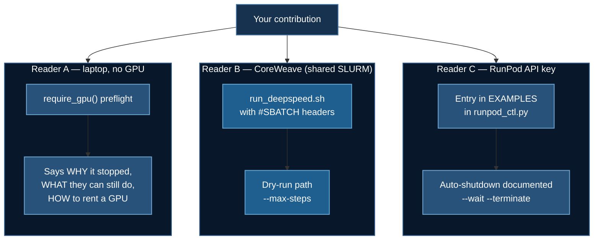

# Contributing

**Contributions from anyone are welcome.** You do not need to know the maintainer, ask permission first, or be an expert. Fork the repository, add your example, open a pull request.

This page is the reader-friendly version. The authoritative, checkable version lives in [`CONTRIBUTING.md`](https://github.com/yiqiao-yin/deepspeed-course/blob/main/CONTRIBUTING.md) at the repo root — it is written to serve **both** human contributors and coding agents such as Claude Code, which can follow it as an executable spec.

:::tip In a hurry?
```bash
git clone https://github.com/<you>/deepspeed-course.git && cd deepspeed-course
uv run scripts/new_example.py 10_my_topic --title "My Topic" --vram 24
./tests/run_all.sh
```
The scaffold writes a skeleton that already satisfies the contract. Then replace every `TODO(contributor)`.
:::

## 1. What this repository is

A **teaching course**, not a library. Each numbered directory is a self-contained, runnable DeepSpeed example, escalating from a two-parameter linear model to 560B-parameter multimodal training.

Three consequences that surprise nearly every new contributor:

:::warning Do not refactor shared logic into a common module
This is the most common well-intentioned PR we decline. `require_gpu()` appears verbatim in ~19 files **on purpose**, so a reader can open one folder and run it without touching the rest.

DRY is a good instinct for applications and the wrong instinct for a course, where every indirection is a tab the reader has to open.
:::

**Comments and docstrings are the product.** Line-by-line explanation — even on `#SBATCH` directives — is the pedagogical point, not clutter. A terse, "clean" script is a *worse* contribution here than a verbose one.

**Print formatting is part of the API.** READMEs quote expected output, so changing a banner invalidates the docs.

## 2. The three-platform contract

This is the core requirement, and the one most likely to send a PR back. **Every contribution must work sensibly for three different readers.**



You are not expected to *own* all three platforms — only to make your example **not break** on any of them. The tooling does most of the work.

### 2.1 Reader A — no GPU: fail gracefully

A newcomer with a laptop runs your script. Without a preflight, DeepSpeed gets as far as building its fused Adam kernel and dies with:

```
OSError: CUDA_HOME environment variable is not set
```

…raised from deep inside torch's C++ extension loader. That tells a beginner **nothing**, and it is the single most common reason people bounce off distributed training.

**Every entry point calls `require_gpu()` before importing torch or deepspeed.** Copy it verbatim from any existing example — the scaffold writes it for you — then customise the message to say something true about *your* example.

Three rules for that message:

1. **Say why it stopped**, in one sentence a beginner understands.
2. **Say what they can still do.** Never leave a dead end — point at `./tests/run_all.sh`, the docs site, or a CPU-runnable example.
3. **Say how to get a GPU**, with the exact `runpod_ctl.py` command.

:::danger Import order is load-bearing
```python
def main() -> None:
    args = parser.parse_args()
    require_gpu()              # <- FIRST

    import deepspeed           # <- only now
    import torch
```
Import torch at module scope and a CPU-only reader gets a CUDA traceback before your message ever runs.
:::

:::tip Better still: make part of your example CPU-runnable
`08_vtt/02_token_compression/` and `08_vtt/03_streaming_memory/` run fully on CPU because their substance is *algorithms* rather than *weights*.

If your contribution has an algorithmic core, factor it into a module that runs on plain tensors. Readers without a GPU can then learn the actual idea — and you get a test suite that runs in CI.
:::

### 2.2 Reader B — CoreWeave: SLURM and a cheap dry run

CoreWeave is a **shared SLURM cluster**: you SSH to a login node and *submit*, never run interactively. So every topic ships a `run_deepspeed.sh` with `#SBATCH` headers — `tests/test_runpod_ctl.py` asserts this, because *"a CoreWeave user must be able to `sbatch` every topic"* is a promise the repo makes.

Things the scaffold gets right that hand-written scripts routinely get wrong:

| Directive | Why |
|---|---|
| `--ntasks-per-node=1` | **ONE task.** The `deepspeed` launcher spawns a worker per GPU itself. Let SLURM also start one per GPU and you get $N^2$ processes and usually a hang. |
| `--cpus-per-task=8+` | Too few starves the dataloader; the GPU idles between batches and it looks like a slow model. |
| `mkdir -p logs` | Before `--output=logs/name_%j.out`. Without it, SLURM silently discards output. |
| `export HF_HOME=/scratch/...` | `$HOME` is usually a small NFS quota; a multi-GB download into it fails slowly. |
| venv built on a **login** node | Compute nodes usually have no network egress. |

**Provide a dry-run path** so a cluster user can validate plumbing without burning an allocation:

```bash
sbatch run_deepspeed.sh --max-steps 20      # smoke test
sbatch run_deepspeed.sh                     # the real thing
```

Two halves, and the second is the one that gets forgotten. Parse with
**`parse_known_args()`** — the DeepSpeed launcher injects `--local_rank` into
your argv and a strict parser exits before training starts. And **end your
launcher's invocation line with `"$@"`**:

```bash
deepspeed --num_gpus=2 train_ds.py "$@"      # ✅ the flag arrives
deepspeed --num_gpus=2 train_ds.py           # ❌ silently swallowed
```

Without `"$@"` the dry run is not refused, it is *ignored*: the job submits, runs
to completion, and nothing warns you. `scripts/check_contract.py` checks for it.

### 2.3 Reader C — RunPod: rent, run, **shut down**

RunPod is a single-user pod with direct GPU access. There is **no SLURM** — the `#SBATCH` lines are inert comments — so the lifecycle is driven by API through `runpod/runpod_ctl.py`.

Register your example in the `EXAMPLES` table. One line; the scaffold prints it:

```python
"10_your_topic": dict(min_vram=24, gpus=1, disk=60,
                      script="train_your_topic.py",
                      note="The one thing that surprises people."),
```

`tests/test_runpod_ctl.py` **fails** if a numbered example is missing from that table, so you cannot forget.

:::danger An abandoned pod bills until terminated
*Stopping* is not enough. A forgotten pod is the most expensive mistake in this repository, and it is silent.
:::

**Use the auto-shutdown template. Always.** Every README must document this invocation:

```bash
export RUNPOD_API_KEY=...        # https://console.runpod.io/user/settings

uv run runpod/runpod_ctl.py recommend 10_your_topic
uv run runpod/runpod_ctl.py run 10_your_topic \
    --dry-run --collect --wait --terminate --yes
uv run runpod/runpod_ctl.py pods                    # "Nothing is billing."
```

| Flag | Effect |
|---|---|
| `--dry-run` | Caps the training step (300 s). The pod still clones, installs and launches the **real** script, so genuine failures surface — you just do not pay for a full run. |
| `--collect` | Pod pushes progress and logs to a random ntfy.sh topic. **No SSH, no port forwarding** — RunPod exposes no log endpoint, so the pod pushes. |
| `--wait` | Blocks locally until the pod reports DONE. |
| `--terminate` | Deletes the pod in a `finally` block, so a crash, a network failure or Ctrl-C **still** stops the billing. Retries five times with backoff. |
| `--yes` | Skips confirmation. Both `run` and `create` refuse without it and print the hourly rate first. |

Two safety nets you inherit for free: an **in-pod watchdog** (`--max-hours`, default 6) that kills the container from the inside and needs no API key, and `terminate --all` as the blunt instrument.

:::note The pod is never given your API key
Letting it delete itself would mean putting a spending credential on rented hardware. Termination is driven from your machine instead. Please do not "improve" this.
:::

**If you cannot test on RunPod**, say so in the PR. Registering the entry and documenting the commands is enough — someone with hardware can verify. **Do not invent output.**

## 3. The four-file contract

| File | Role |
|---|---|
| `train_*.py` | Entry point. Calls `deepspeed.initialize(...)`, reads the JSON config, starts with `require_gpu()`. |
| `ds_config*.json` | ZeRO stage, precision, optimizer, batch sizes. |
| `run_deepspeed.sh` | SLURM batch script. |
| `README.md` | Standalone walkthrough: hardware, setup, run command, expected output. |

### The batch invariant

DeepSpeed enforces this at startup and aborts if it fails:

$$
\text{train\_batch\_size} = \text{micro\_batch\_per\_gpu} \times \text{grad\_accum\_steps} \times N_{\text{gpus}}
$$

:::warning The most common breakage in this repository
Changing `--num_gpus` in a launcher without updating the JSON. `tests/test_ds_configs.py` checks your config against the GPU count your launcher actually requests.

**The portable fix: omit `train_batch_size` entirely.** DeepSpeed derives it and the config then works at any GPU count. The scaffold does this.
:::

Other rules the tests enforce:

- **Never enable both `fp16` and `bf16`** — DeepSpeed raises at init. Avoid the *latent* form too (one hard-`true`, the other `"auto"`).
- **`"auto"` requires a HuggingFace `Trainer`** — it is a Trainer convention, not a DeepSpeed feature. With raw `deepspeed.initialize()` it is a parse error.
- **ZeRO-3 needs `stage3_gather_16bit_weights_on_model_save`**, or the checkpoint is written as shards `from_pretrained` cannot load.
- **`offload_param` requires stage 3** — below that it is silently ignored.

## 4. Hard rules

### Use `uv`, never bare `pip`

In docs, READMEs, SLURM scripts and docstrings. `uv pip install X`, not `pip install X`. Mixed instructions strand readers halfway.

### Use `deepspeed` — this is a DeepSpeed course

An example that only calls `Trainer.train()` with no ZeRO config does not belong here. Two narrow exceptions exist already: `07_huggingface_trl_multi_agency` drives TRL directly, and `08_vtt/03_streaming_memory` / `04_video_eval` are inference and evaluation — no optimizer, nothing to shard.

If yours is a third exception, **say so explicitly in the PR and explain why**.

### Secrets stay commented **and** quoted

```bash
# export WANDB_API_KEY="your_value_here"      # ✅
export WANDB_API_KEY=<ENTER_KEY_HERE>         # ❌ BASH SYNTAX ERROR
```

`<` is a redirection operator. That second line **aborts the script**, which never reaches the training command. **Seven scripts shipped that way and could never run.** `tests/test_runpod_ctl.py` now runs `bash -n` over every shell script to stop it recurring.

### Fail loudly, never silently

:::danger The worst bugs this repo shipped all ran fine and were quietly wrong
- a frame extractor that returned **one image repeated** — training ran, loss decreased, zero temporal signal
- a collator that silently **dropped `pixel_values`** — the model trained on text only, nothing raised
- a scaler fit **before** the train/test split — look-ahead bias, great metrics
- an eval harness whose RNG was **correlated with the answer key** — a random baseline scored 100%

Raise. Do not return a placeholder. If your pipeline can be misconfigured into doing nothing, **assert that it did something.**
:::

### Never fabricate output

Not in READMEs, not in docs, not in comments. If you have not run it, say *"not yet verified on hardware."* A published number that is wrong costs a reader a day debugging their own correct setup.

## 5. Writing the test

| Examples | Verification |
|---|---|
| `01`–`04` | Runnable end to end on one machine |
| `05`–`09` | **Not runnable locally.** Verify logic only |

For the second group, do **not** attempt a full training run — it will not fit, and a partial run proves nothing. Write a logic test in `tests/` that exercises the changed code path with no GPU and no download.

### Assert properties, not shapes

```python
# ❌ passes on completely broken compression
assert output.shape == (1, 8192, 3584)

# ✅ catches it
r.check(torch.allclose(corrected, true_mass, atol=1e-6),
        "log-size bias exactly reproduces unmerged attention mass")
r.check((naive - true_mass).abs().item() > 1e-3,
        "without the bias, merged attention is measurably wrong "
        "-- if these matched, the test setup would be proving nothing")
```

:::tip The trick worth stealing
That second check asserts **the buggy version actually fails**. Without it, your test may be passing vacuously — which is indistinguishable from passing correctly, right up until it matters.
:::

Tests use [PEP 723](https://peps.python.org/pep-0723/) inline metadata so `uv run` provisions each automatically, and `tests/_srcload.py` extracts functions from training scripts via `ast` so tests run against the **actual shipped source** without importing torch.

Register your test in **both** `tests/run_all.sh` and `.github/workflows/tests.yml`.

## 6. Contributing with Claude Code

**This is encouraged, not merely tolerated.** `CONTRIBUTING.md` is written to work as a spec for a coding agent, and the repository ships a `CLAUDE.md` that Claude Code loads automatically.

```bash
git clone https://github.com/<your-username>/deepspeed-course.git
cd deepspeed-course
claude
```

Then paste something like:

> Read CONTRIBUTING.md and CLAUDE.md, then add a new example `10_my_topic` that demonstrates **&lt;your idea&gt;**.
>
> Follow the three-platform contract exactly: graceful CPU failure via `require_gpu()`, a CoreWeave SLURM script with a dry-run path, and a RunPod `EXAMPLES` entry documented with the auto-shutdown flags.
>
> Use `uv` for all packages and `deepspeed` for training. Scaffold with `uv run scripts/new_example.py`, replace every `TODO(contributor)`, write a real logic test that asserts a mathematical property rather than a shape, and register it in `tests/run_all.sh` and the CI workflow.
>
> Finish by running `./tests/run_all.sh` and `cd docusaurus-docs && npm run build`, and report honestly what passed, what failed, and what you could not verify without a GPU.

### What to insist on

Agents are good at scaffolding and prose. They are weak in three specific places — check these yourself:

| Risk | What to demand |
|---|---|
| **Fabricated output** | "Do not invent expected output. If you have not run it, mark it *not yet verified on hardware*." |
| **Vacuous tests** | "Assert mathematical properties, not shapes. Then prove the test is not vacuous by asserting the buggy version actually fails." |
| **Helpful refactoring** | "Do NOT extract shared logic into a common module. Duplication is deliberate." |

:::note Your name goes on it
You are the contributor, not the agent. **Read the diff before opening the PR** — you are accountable for every factual claim in it, especially about hardware, memory, or benchmark numbers.

Say in the PR that you used an agent. That is useful context for review, not a mark against it.
:::

## 7. Definition of done

```bash
./tests/run_all.sh && (cd docusaurus-docs && npm run build)
```

The full checklist is in [`CONTRIBUTING.md` §9](https://github.com/yiqiao-yin/deepspeed-course/blob/main/CONTRIBUTING.md) and is reproduced in the pull request template, so GitHub will hand it to you automatically when you open a PR.

## 8. Review

A maintainer checks the contract, that the teaching is *correct* (not just that the code runs), and that claims are verified or honestly marked. CI runs the full `tests/` suite plus `compileall` over every training script on every PR.

**Expect requests for more explanation, not less.** *"Add a paragraph explaining why ZeRO-3 here instead of ZeRO-2"* is the most common review comment — and it is not a criticism. Explanation is the product.

---

Genuinely: thank you. A teaching repository is only as good as the range of people who have shaped it, and the most valuable contributions are usually the ones that fix a thing that confused *you* — because it confused everyone else too, and nobody said so.
