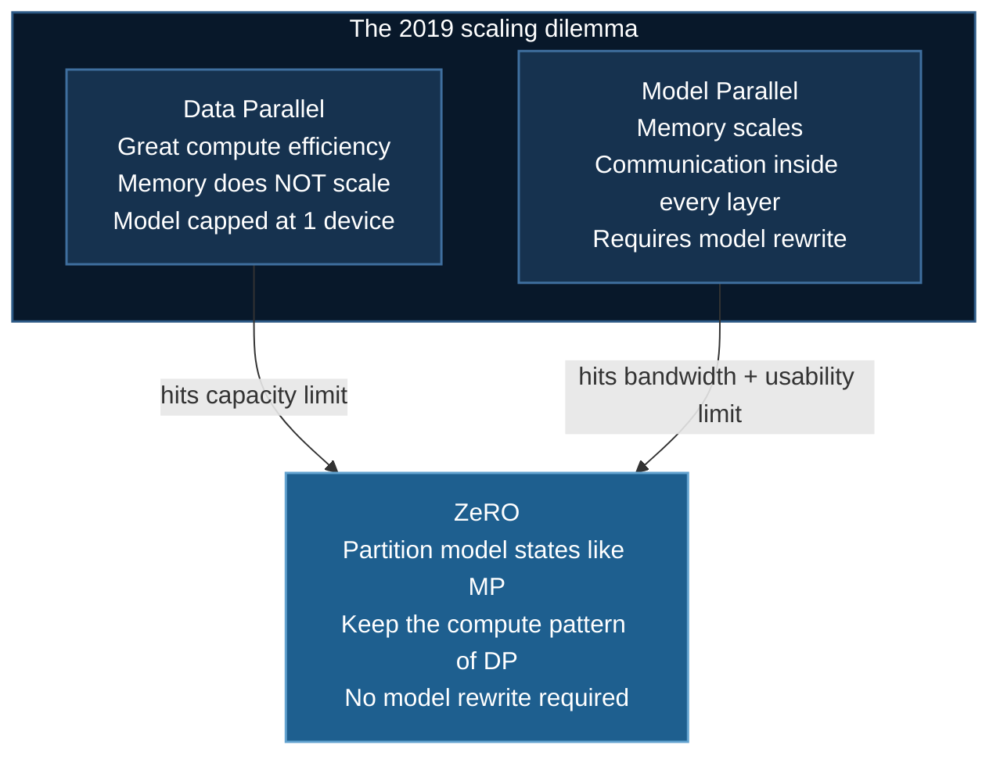
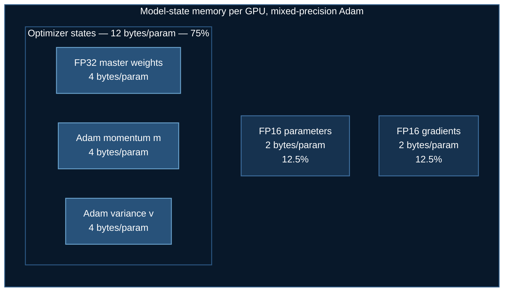
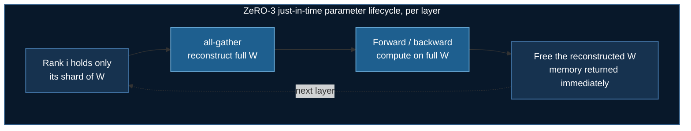
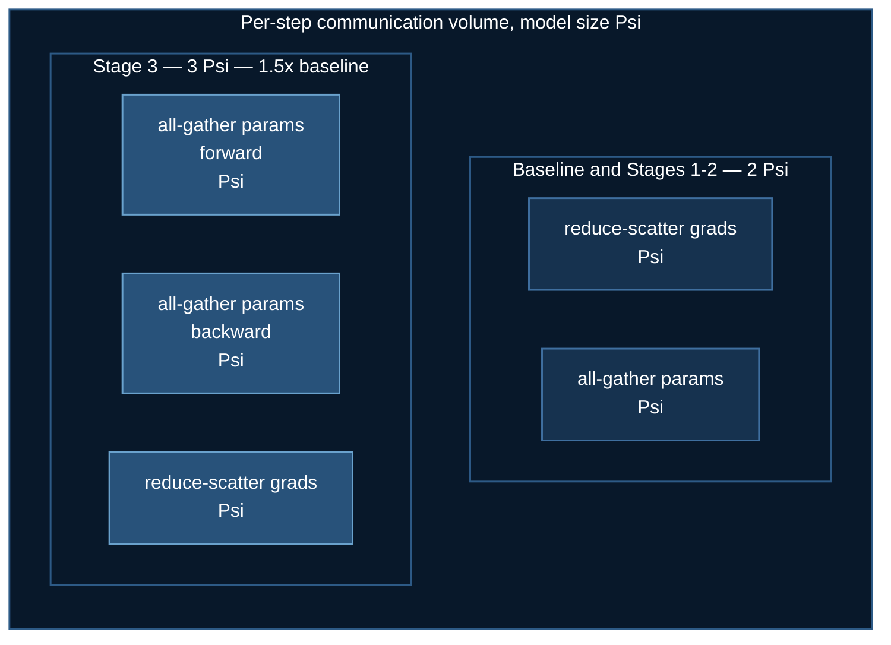
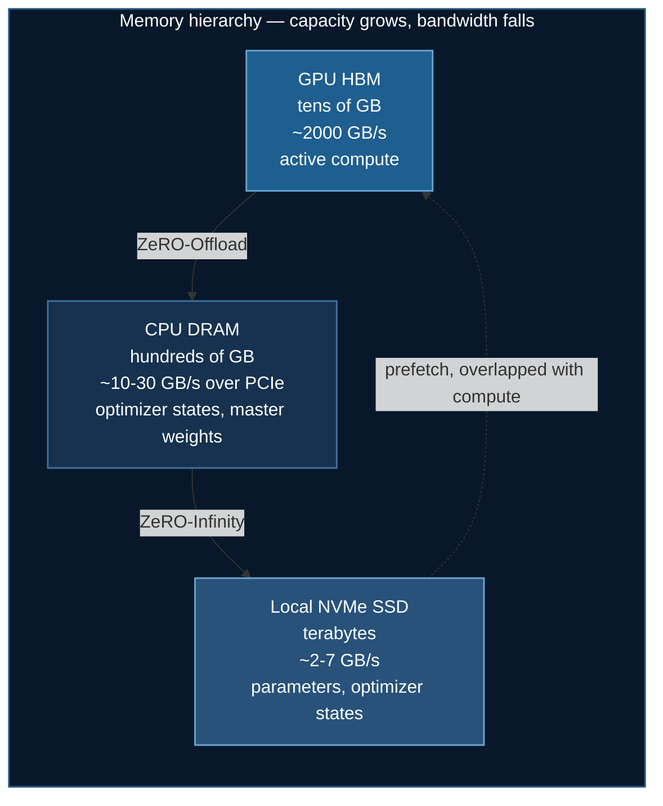
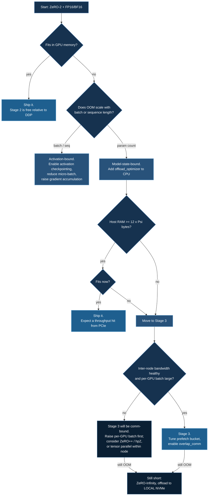

# DeepSpeed ZeRO Stages

**Zero Redundancy Optimizer** — where it came from, why the partitioning is mathematically sound, why it splits into exactly three stages, and what each stage costs you in bandwidth.

:::info Who this page is for
This page assumes you are comfortable with mixed-precision SGD, the Adam update rule, and collective communication primitives (`all-reduce`, `reduce-scatter`, `all-gather`). If you want the operational summary rather than the derivation, jump to [Choosing a Stage](#7-choosing-a-stage-a-decision-procedure).
:::

## 1. The Problem ZeRO Was Invented to Solve

### 1.1 The memory wall in data-parallel training

Classical **data parallelism** (DP) is the workhorse of distributed deep learning. Its contract is simple: replicate the entire model on every device, give each device a different slice of the mini-batch, and `all-reduce` the gradients before the optimizer step. It has excellent compute efficiency — every device does useful FLOPs on every step, and the only communication is one gradient reduction per step.

It also has a fatal property: **memory does not scale.** Adding a 64th GPU gives you 64× the throughput and exactly 1× the model capacity. Every device holds a bit-identical copy of the parameters, the gradients, and the optimizer states. That redundancy is $N_d$-fold, where $N_d$ is the data-parallel degree.

The alternative in 2019 was **model parallelism** — either tensor-slicing (Megatron-LM) or pipeline-slicing (GPipe, PipeDream). Both work, but both are invasive: they require rewriting the model to describe how each operator is split, they introduce communication *inside* the forward and backward pass (rather than once per step), and tensor parallelism in particular degrades sharply once it crosses a node boundary, because it demands high-bandwidth all-reduces at every layer.

ZeRO's founding observation, from Rajbhandari et al. (2019), is that **you do not have to choose.** The memory blow-up of data parallelism is pure redundancy, not a fundamental requirement, and redundancy can be eliminated without changing the model code and — for the first two stages — without sending a single extra byte.



### 1.2 Where the memory actually goes

To eliminate redundancy you must first account for it precisely. ZeRO divides GPU memory into two categories.

**Model states** — memory that is a deterministic function of the parameter count $\Psi$ and the optimizer. This is the part ZeRO-DP attacks.

**Residual states** — activations, temporary buffers, and fragmented free memory. This is the part attacked by ZeRO-R (activation partitioning, constant-size buffers, defragmentation).

Consider the standard recipe: mixed-precision training with Adam, as described by Micikevicius et al. (2018). For each of the $\Psi$ parameters the runtime holds:

| Tensor | Precision | Bytes per parameter |
|---|---|---|
| Parameters (compute copy) | FP16 | $2$ |
| Gradients | FP16 | $2$ |
| Parameters (FP32 master copy) | FP32 | $4$ |
| Adam momentum $m$ | FP32 | $4$ |
| Adam variance $v$ | FP32 | $4$ |

The last three rows are the **optimizer states**. Writing $K$ for the optimizer-state multiplier — $K = 12$ for mixed-precision Adam, $K = 4$ for plain mixed-precision SGD with momentum, $K = 6$ for 8-bit Adam — total model-state memory per device under vanilla DP is:

$$
M_{\text{DP}} = \underbrace{2\Psi}_{\text{fp16 params}} + \underbrace{2\Psi}_{\text{fp16 grads}} + \underbrace{K\Psi}_{\text{optimizer states}} = (4 + K)\,\Psi
$$

For Adam, $M_{\text{DP}} = 16\Psi$ bytes.

:::note The number that should alarm you
The FP16 weights you actually *compute* with are only $2\Psi$ of that $16\Psi$ — **12.5%**. Seven-eighths of your model-state memory is bookkeeping that is touched exactly once per step, during the optimizer update. A 1.5B-parameter GPT-2 needs 3 GB for its FP16 weights and **24 GB** in total. That is why a 32 GB V100 could not train a model that "only" needs 3 GB of weights.
:::



## 2. What "Partitioning" Means Here

The word *partitioning* is used loosely in the distributed-training literature, so it is worth being exact.

Let $\mathcal{P} = \{1, \dots, \Psi\}$ index the model's scalar parameters. A **partition** is a family of disjoint sets $\mathcal{P}_1, \dots, \mathcal{P}_{N_d}$ with $\bigcup_i \mathcal{P}_i = \mathcal{P}$ and $|\mathcal{P}_i| \approx \Psi / N_d$. Rank $i$ takes **exclusive ownership** of $\mathcal{P}_i$: it is the only device that durably stores the optimizer state, and in Stage 3 the parameters, for that index set.

This is a fundamentally different operation from tensor parallelism, and the distinction matters:

| | Tensor parallelism | ZeRO partitioning |
|---|---|---|
| What is split | The **computation** — a matmul is decomposed across devices | The **storage** — the math is untouched |
| Model code | Must be rewritten per-operator | Unchanged |
| Each device computes | A *slice* of every layer's output | The *full* output for its own data shard |
| Communication | Inside each layer, every layer | Once per parameter, per step boundary |
| Mathematically | A different (equivalent) factorization | Bit-identical to single-device DP |

ZeRO does not change what is computed. Run a model with ZeRO-1 and without it and you get the same gradients to the last bit (barring floating-point reduction-order effects). **ZeRO is a memory-management strategy, not a numerical method.**

### 2.1 Why partitioning is *sound* — the two structural facts

Two properties of the training loop make ZeRO possible. Almost every subtlety in the rest of this page follows from them.

**Fact 1 — The optimizer update is elementwise (separable).** For Adam,

$$
m_j \leftarrow \beta_1 m_j + (1-\beta_1) g_j, \qquad
v_j \leftarrow \beta_2 v_j + (1-\beta_2) g_j^2, \qquad
\theta_j \leftarrow \theta_j - \eta \frac{\hat m_j}{\sqrt{\hat v_j} + \epsilon}
$$

The update to coordinate $j$ depends **only** on quantities indexed by $j$. There is no cross-coordinate coupling — no matrix inverse, no full-gradient norm — so the update over $\mathcal{P}$ decomposes *exactly* into $N_d$ independent updates over $\mathcal{P}_1, \dots, \mathcal{P}_{N_d}$. Rank $i$ can update its shard in isolation and be exactly correct.

This is why Stages 1 and 2 are essentially free. It also tells you precisely when ZeRO needs care: any operation that couples coordinates — **global gradient clipping**, which needs $\|g\|_2$ over all of $\mathcal{P}$ — requires an extra small `all-reduce` of a scalar. DeepSpeed does this for you, which is why `gradient_clipping` is a first-class config key rather than something you implement in your training loop.

**Fact 2 — Parameters are needed only transiently.** During the forward pass at layer $\ell$, the device needs $W^{[\ell]}$ and nothing else from the parameter set. Layer $\ell+1$'s weights are dead memory until control reaches them. So a device does not need to *store* the whole model — it needs the right slice **at the right instant**, and can discard it immediately afterwards.

This is the insight behind Stage 3, and it is why Stage 3 costs extra bandwidth while Stages 1 and 2 do not: transient availability must be manufactured by communication, whereas separability was already there for free.



Peak parameter memory under Stage 3 is therefore $\Psi/N_d$ (the durable shard) plus the transient cost of the largest single layer — not $\Psi$. This is also why Stage 3 has a *prefetch* knob (`stage3_prefetch_bucket_size`): you want the `all-gather` for layer $\ell+1$ in flight while layer $\ell$ computes, so the communication hides behind compute.

## 3. The Three Stages, Derived

The three stages are not arbitrary product tiers. They are the **three cumulative partitionable categories of model state**, applied in increasing order of communication cost. The ZeRO paper names them $P_{os}$, $P_{os+g}$, and $P_{os+g+p}$.

The reason the order is what it is falls straight out of the memory table in §1.2: optimizer states are 75% of the budget and are needed only at the step boundary, so partitioning them is both the highest-yield and the lowest-risk move. Gradients are 12.5% and are consumed by the optimizer, so they partition next. Parameters are 12.5% but are needed *continuously during compute*, so they come last and are the only ones that cost extra bandwidth.

$$
\text{partition in order of } \frac{\text{memory saved}}{\text{communication added}}
$$

### 3.1 Stage 1 — $P_{os}$, optimizer state partitioning

Each rank keeps full FP16 parameters and full FP16 gradients, but stores optimizer states for only $\Psi / N_d$ coordinates.

$$
M_1 = 2\Psi + 2\Psi + \frac{K\Psi}{N_d} = 4\Psi + \frac{K\Psi}{N_d}
$$

As $N_d \to \infty$ this tends to $4\Psi$ — a **4× reduction** for Adam. The step becomes: `reduce-scatter` the gradients so rank $i$ receives the fully-reduced gradient for $\mathcal{P}_i$; rank $i$ applies Adam to its shard (valid by Fact 1); `all-gather` the updated FP16 parameters.

```json
{
  "zero_optimization": {
    "stage": 1
  }
}
```

### 3.2 Stage 2 — $P_{os+g}$, add gradient partitioning

Once rank $i$ is the only device that will ever *use* the gradient for $\mathcal{P}_i$, there is no reason for any other rank to retain it. Gradients are reduced into their owner's buffer as they are produced during the backward pass and freed immediately elsewhere.

$$
M_2 = 2\Psi + \frac{(2 + K)\Psi}{N_d}
$$

For Adam this approaches $2\Psi$ — an **8× reduction**. Note the elegance: this stage is a pure consequence of Stage 1. It adds *zero* communication, because the `reduce-scatter` Stage 1 already performs is exactly the operation that makes the other ranks' gradient copies redundant.

DeepSpeed implements this with a bucketed reduce overlapped against backward compute:

```json
{
  "zero_optimization": {
    "stage": 2,
    "contiguous_gradients": true,
    "overlap_comm": true,
    "reduce_bucket_size": 5e8,
    "allgather_bucket_size": 5e8
  }
}
```

- `overlap_comm` issues the gradient reduction for layer $\ell$ while layer $\ell-1$ is still computing, hiding communication behind compute.
- `contiguous_gradients` copies gradients into a pre-allocated flat buffer as they are produced. This costs a copy but prevents the memory *fragmentation* that otherwise causes OOM at high $N_d$ despite ample free memory — a residual-state optimization riding along inside a model-state stage.

**This is the setting used by most examples in this course.**

### 3.3 Stage 3 — $P_{os+g+p}$, add parameter partitioning

Now parameters are sharded too, materialized on demand per Fact 2.

$$
M_3 = \frac{(4 + K)\Psi}{N_d} = \frac{16\Psi}{N_d} \quad \text{(Adam)}
$$

Memory now scales **linearly and without bound** in $N_d$. This is the qualitative break: Stages 1 and 2 reduce memory by a constant factor, whereas Stage 3 makes model size a function of *aggregate cluster memory*. With 1024 GPUs you have 1024× the capacity.

```json
{
  "zero_optimization": {
    "stage": 3,
    "overlap_comm": true,
    "contiguous_gradients": true,
    "stage3_prefetch_bucket_size": 5e7,
    "stage3_param_persistence_threshold": 1e5,
    "stage3_max_live_parameters": 1e9,
    "stage3_gather_16bit_weights_on_model_save": true
  }
}
```

Two of these deserve comment:

- `stage3_param_persistence_threshold` — parameters smaller than this are never partitioned. LayerNorm gains and biases are tiny but numerous; an `all-gather` on a 1024-element tensor is pure latency with no bandwidth benefit. Keeping them replicated is strictly better.
- `stage3_gather_16bit_weights_on_model_save` — without this your checkpoint is a pile of shards. Forgetting it is the single most common Stage-3 operational mistake.

### 3.4 Worked example

A 7.5B-parameter model on $N_d = 64$ GPUs with mixed-precision Adam ($K = 12$, $\Psi = 7.5 \times 10^9$):

| Configuration | Formula | Memory per GPU |
|---|---|---|
| Vanilla DP | $16\Psi$ | **120 GB** |
| ZeRO-1 ($P_{os}$) | $4\Psi + 12\Psi/64$ | **31.4 GB** |
| ZeRO-2 ($P_{os+g}$) | $2\Psi + 14\Psi/64$ | **16.6 GB** |
| ZeRO-3 ($P_{os+g+p}$) | $16\Psi/64$ | **1.9 GB** |

Read the table as a capability statement, not a savings statement. At 120 GB the model is untrainable on any 2019-era accelerator. At 31.4 GB it is untrainable on a 32 GB V100 but fits an 80 GB A100. At 16.6 GB it fits a V100 with room for activations. At 1.9 GB the model states are no longer the constraint at all — **activations are**, which is exactly when you start caring about ZeRO-R and activation checkpointing.

## 4. The Cost: Communication Analysis

Memory savings are only interesting if you can characterize what you pay. This is the part most tutorials omit, and it is the part that determines whether ZeRO-3 is brilliant or ruinous on *your* cluster.

### 4.1 Baseline

A bandwidth-optimal ring `all-reduce` is implemented as a `reduce-scatter` followed by an `all-gather`, each moving $\Psi$ elements per device. So standard data parallelism has a per-step communication volume of

$$
V_{\text{DP}} = 2\Psi
$$

### 4.2 Stages 1 and 2 are communication-neutral

ZeRO-1 and ZeRO-2 replace that fused `all-reduce` with its two constituent halves, separated in time by the optimizer step: `reduce-scatter` the gradients ($\Psi$), update locally, `all-gather` the parameters ($\Psi$).

$$
V_{1} = V_{2} = \Psi + \Psi = 2\Psi = V_{\text{DP}}
$$

**Stages 1 and 2 reduce memory 8× at exactly zero bandwidth cost.** This is not a trade-off; it is a strict improvement, which is why "start at Stage 2" is such robust advice. If you are running vanilla DDP on a model that fits, switching to ZeRO-2 costs you essentially nothing and buys headroom.

### 4.3 Stage 3 costs 1.5×

Stage 3 adds an `all-gather` of parameters in the forward pass and another in the backward pass (the reconstructed weights were freed and must be rebuilt to compute the backward), plus the gradient `reduce-scatter`:

$$
V_{3} = \underbrace{\Psi}_{\text{fwd all-gather}} + \underbrace{\Psi}_{\text{bwd all-gather}} + \underbrace{\Psi}_{\text{grad reduce-scatter}} = 3\Psi = 1.5\,V_{\text{DP}}
$$

A 50% bandwidth increase in exchange for unbounded memory scaling.

:::warning The 1.5× is a floor, not a promise
$3\Psi$ is the volume under *perfect* overlap. Stage 3's communication sits on the critical path of the forward and backward pass, not at the step boundary, so it can only hide behind compute if there is enough compute to hide behind. Arithmetic intensity per parameter scales with batch size, so **small per-GPU batch is the classic ZeRO-3 pathology**: you get the full $3\Psi$ of traffic with too little compute to overlap it, and utilization collapses. This is precisely the regime ZeRO++ was built for.
:::



### 4.4 The Pareto frontier — why exactly three stages

Plotting memory against bandwidth explains the design:

| Stage | Memory per GPU (Adam) | Volume | Marginal trade |
|---|---|---|---|
| DP | $16\Psi$ | $2\Psi$ | — |
| 1 | $4\Psi + 12\Psi/N_d$ | $2\Psi$ | 4× memory for **free** |
| 2 | $2\Psi + 14\Psi/N_d$ | $2\Psi$ | 8× memory for **free** |
| 3 | $16\Psi/N_d$ | $3\Psi$ | unbounded memory for **1.5×** |

The stages exist as separate knobs because they occupy genuinely different points on this frontier. Stages 1 and 2 are Pareto-dominant over plain DP — there is no argument for vanilla DDP over ZeRO-2 on memory grounds. Stage 3 is the first genuine *trade*, so it is the first one you should have to opt into deliberately.

Stage 1 survives as a distinct option mainly because gradient partitioning interacts with gradient accumulation: with many accumulation steps, Stage 2 must either reduce at every micro-step (more latency-bound collectives) or hold unpartitioned accumulation buffers. Stage 1 sidesteps that.

## 5. Beyond the GPU: the Offload Family

ZeRO-DP eliminates redundancy *across* GPUs. The offload line attacks a second axis: memory that need not live on the GPU at all.

### 5.1 ZeRO-Offload

Return to Fact 1. The optimizer step is elementwise, has arithmetic intensity $O(1)$ per parameter, and touches $K\Psi$ bytes exactly once per step. It is a *memory-bandwidth-bound* operation with negligible FLOPs — the single worst use of a GPU in the entire training loop.

Ren et al. (2021) formalize this as a graph-partitioning problem over the training computation and prove that offloading the optimizer step and the FP32 master weights to CPU, while keeping forward and backward on GPU, is the **unique optimal** strategy under the constraints of (i) no more than $O(1)$ CPU compute per parameter and (ii) minimum CPU–GPU traffic. It is not a heuristic; it is the solution to a stated optimization problem.

Two engineering details make it viable: a hand-tuned **CPU Adam** using AVX SIMD and OpenMP (a naïve PyTorch CPU Adam is far too slow), and overlapping the PCIe transfer with backward compute.

```json
{
  "zero_optimization": {
    "stage": 2,
    "offload_optimizer": {
      "device": "cpu",
      "pin_memory": true
    }
  }
}
```

`pin_memory: true` allocates page-locked host memory, enabling DMA transfers that do not stall on the host. It costs non-swappable RAM and is nearly always worth it.

**Budget CPU RAM before enabling this.** Offloading Adam states needs $\approx 12\Psi$ bytes of host memory (plus overhead) — for a 7B model, ~84 GB. Exceed your RAM and the machine begins swapping, at which point throughput does not degrade, it *stops*.

### 5.2 ZeRO-Infinity

Rajbhandari et al. (2021) extend the hierarchy to NVMe, treating GPU memory, CPU DRAM, and SSD as one pool. Beyond simple offload it contributes:

- **Bandwidth-centric partitioning** — parameters are striped across *all* offload devices so aggregate PCIe/NVMe bandwidth scales with device count, instead of bottlenecking on one link.
- **Memory-centric tiling** — a single operator too large for one GPU is executed as a sequence of tiles, removing the "largest individual layer must fit" constraint that otherwise bounds Stage 3.
- An **infinity offload engine** that overlaps NVMe reads with compute.

```json
{
  "zero_optimization": {
    "stage": 3,
    "offload_param":     { "device": "nvme", "nvme_path": "/local_nvme", "pin_memory": true },
    "offload_optimizer": { "device": "nvme", "nvme_path": "/local_nvme", "pin_memory": true }
  },
  "aio": {
    "block_size": 1048576,
    "queue_depth": 8,
    "thread_count": 1,
    "single_submit": false,
    "overlap_events": true
  }
}
```

The `aio` block tunes the asynchronous I/O layer. NVMe offload is only sane on **local** NVMe — pointing `nvme_path` at a network filesystem (a common mistake on shared HPC clusters, where `$HOME` is NFS) is catastrophically slow.



### 5.3 ZeRO++

ZeRO++ (Wang et al., 2023) targets exactly the failure mode flagged in §4.3 — Stage 3 on low-bandwidth clusters or at small per-GPU batch. Three techniques:

- **qwZ** — block-quantized weight `all-gather`, sending FP16 weights as INT8 with per-block scales, halving forward-pass gather volume.
- **hpZ** — hierarchical partitioning that keeps a *secondary*, full replica of the weights within each node, so the backward-pass `all-gather` is satisfied from fast intra-node NVLink and never crosses the slow inter-node fabric. This trades memory for bandwidth, inverting ZeRO's usual direction.
- **qgZ** — quantized gradient averaging via a hierarchical all-to-all that replaces `reduce-scatter`, avoiding the accuracy loss that naïve low-precision reduction would cause.

Together these cut inter-node volume from $3\Psi$ to $0.75\Psi$ — a **4× reduction**, putting Stage 3 *below* vanilla DP's $2\Psi$.

### 5.4 Relationship to other systems

ZeRO Stage 3 and PyTorch's **FSDP** are the same algorithm: shard-gather-compute-free with sharded optimizer states. FSDP is the native PyTorch reimplementation of the idea; DeepSpeed retains a broader offload story (NVMe, CPU Adam) and finer config surface.

ZeRO is also **orthogonal to model parallelism**, which is the point of *3D parallelism*: tensor parallelism within a node (high bandwidth, fine granularity), pipeline parallelism across node groups (low bandwidth, coarse granularity), and ZeRO-powered data parallelism across replicas.

## 6. Residual States: When Model States Stop Being the Problem

Push Stage 3 far enough and $16\Psi/N_d$ becomes negligible — and training still OOMs. At that point the enemy is **activations**.

For a transformer, activation memory scales roughly as

$$
M_{\text{act}} \;\propto\; L \cdot b \cdot s \cdot h
$$

with $L$ layers, batch $b$, sequence length $s$, hidden size $h$ — plus an attention term scaling as $b \cdot s^2 \cdot a$ for $a$ heads, which is why long context is punishing. Note that **none of these terms contain $\Psi$**, so no amount of ZeRO-DP touches them.

The tools here are different:

- **Activation checkpointing** (Chen et al., 2016) — store only layer boundaries and recompute the interior during backward, trading $\approx 33\%$ extra compute for an $O(\sqrt{L})$ rather than $O(L)$ activation footprint.
- **ZeRO-R activation partitioning** ($P_a$) — partition checkpointed activations across ranks, and optionally offload them to CPU.

```json
{
  "activation_checkpointing": {
    "partition_activations": true,
    "cpu_checkpointing": true,
    "contiguous_memory_optimization": true,
    "number_checkpoints": null,
    "synchronize_checkpoint_boundary": false
  }
}
```

Diagnostically: if OOM scales with **batch size or sequence length**, it is activations, and ZeRO stages will not save you. If it scales with **parameter count**, it is model states, and ZeRO will.

## 7. Choosing a Stage: A Decision Procedure



### Summary table

| Feature | Stage 1 | Stage 2 | Stage 3 |
|---|---|---|---|
| Optimizer states partitioned | Yes | Yes | Yes |
| Gradients partitioned | No | Yes | Yes |
| Parameters partitioned | No | No | Yes |
| Memory per GPU (Adam) | $4\Psi + \tfrac{12\Psi}{N_d}$ | $2\Psi + \tfrac{14\Psi}{N_d}$ | $\tfrac{16\Psi}{N_d}$ |
| Communication volume | $2\Psi$ | $2\Psi$ | $3\Psi$ |
| Comm on critical path | No | No | **Yes** |
| Max model size | Bounded | Bounded | Scales with $N_d$ |
| Sensitive to small batch | No | No | **Very** |
| Typical use | Accumulation-heavy runs | **Default choice** | Multi-billion parameters |

## 8. Configurations Used in This Course

```json
// 01_basic_neuralnet/ds_config.json — model states are irrelevant at this size;
// the example exists to show the mechanics, not to save memory.
{
  "zero_optimization": { "stage": 2 },
  "fp16": { "enabled": true }
}
```

```json
// 06_huggingface_grpo/ds_config.json — LoRA means Psi_trainable is tiny, but the
// frozen base weights and the KL reference model still occupy memory. Offload
// buys room for the rollout buffers GRPO needs.
{
  "zero_optimization": {
    "stage": 2,
    "offload_optimizer": { "device": "cpu" }
  }
}
```

```json
// 09_vss/01_longcat_flash_omni/ds_config.json — a 560B-parameter multimodal
// model. Stage 3 with full
// CPU offload is not an optimization here, it is the only way the run exists.
{
  "zero_optimization": {
    "stage": 3,
    "offload_optimizer": { "device": "cpu", "pin_memory": true },
    "offload_param":     { "device": "cpu", "pin_memory": true }
  }
}
```

:::tip LoRA changes the arithmetic completely
With LoRA, $K\Psi$ applies only to the **trainable** adapter parameters, often less than 1% of the model. Optimizer states nearly vanish, and the budget is dominated by frozen base weights and activations. This flips the usual advice: for LoRA fine-tuning, Stage 2 plus activation checkpointing is typically better than Stage 3, because Stage 3 would pay $3\Psi$ of parameter-gather traffic on weights that never receive a gradient.
:::

## 9. Common Failure Modes

**Batch-size assertion at startup.** DeepSpeed enforces
$$\texttt{train\_batch\_size} = \texttt{train\_micro\_batch\_size\_per\_gpu} \times \texttt{gradient\_accumulation\_steps} \times N_d$$
Changing `--num_gpus` without updating the config violates it. Set any one field to `"auto"` under HuggingFace integration and let it be derived.

**Stage 3 checkpoints load as shards.** Set `stage3_gather_16bit_weights_on_model_save: true`, or consolidate afterwards with `zero_to_fp32.py`.

**Throughput collapses on moving to Stage 3.** Almost always §4.3 — per-GPU batch too small to hide $3\Psi$ of traffic. Raise micro-batch before blaming the stage.

**OOM despite ample reported free memory.** Fragmentation. Enable `contiguous_gradients`; consider `PYTORCH_CUDA_ALLOC_CONF=expandable_segments:True`.

**Host swapping with CPU offload.** Budget $\approx 12\Psi$ bytes of RAM for Adam states before enabling.

## References

**Core papers**

1. Rajbhandari, S., Rasley, J., Ruwase, O., & He, Y. (2020). ZeRO: Memory Optimizations Toward Training Trillion Parameter Models. *SC '20*. [arXiv:1910.02054](https://arxiv.org/abs/1910.02054) — introduces $P_{os}$, $P_{os+g}$, $P_{os+g+p}$ and ZeRO-R; source of the $16\Psi$ accounting and the $1.5\times$ communication result.
2. Ren, J., Rajbhandari, S., Aminabadi, R. Y., Ruwase, O., Yang, S., Zhang, M., Li, D., & He, Y. (2021). ZeRO-Offload: Democratizing Billion-Scale Model Training. *USENIX ATC '21*. [arXiv:2101.06840](https://arxiv.org/abs/2101.06840) — the optimality proof for offloading the optimizer step.
3. Rajbhandari, S., Ruwase, O., Rasley, J., Smith, S., & He, Y. (2021). ZeRO-Infinity: Breaking the GPU Memory Wall for Extreme Scale Deep Learning. *SC '21*. [arXiv:2104.07857](https://arxiv.org/abs/2104.07857) — NVMe offload, bandwidth-centric partitioning, memory-centric tiling.
4. Wang, G., Qin, H., Jacobs, S. A., et al. (2023). ZeRO++: Extremely Efficient Collective Communication for Giant Model Training. [arXiv:2306.10209](https://arxiv.org/abs/2306.10209) — qwZ, hpZ, qgZ; $3\Psi \to 0.75\Psi$.

**Context and comparison**

5. Micikevicius, P., Narang, S., Alben, J., et al. (2018). Mixed Precision Training. *ICLR 2018*. [arXiv:1710.03740](https://arxiv.org/abs/1710.03740) — the FP32 master-weight scheme that makes $K = 12$.
6. Shoeybi, M., Patwary, M., Puri, R., LeGresley, P., Casper, J., & Catanzaro, B. (2019). Megatron-LM: Training Multi-Billion Parameter Language Models Using Model Parallelism. [arXiv:1909.08053](https://arxiv.org/abs/1909.08053) — the tensor-parallel baseline ZeRO is contrasted against.
7. Zhao, Y., Gu, A., Varma, R., et al. (2023). PyTorch FSDP: Experiences on Scaling Fully Sharded Data Parallel. [arXiv:2304.11277](https://arxiv.org/abs/2304.11277) — the native PyTorch equivalent of Stage 3.
8. Chen, T., Xu, B., Zhang, C., & Guestrin, C. (2016). Training Deep Nets with Sublinear Memory Cost. [arXiv:1604.06174](https://arxiv.org/abs/1604.06174) — activation checkpointing.
9. Kingma, D. P., & Ba, J. (2015). Adam: A Method for Stochastic Optimization. *ICLR 2015*. [arXiv:1412.6980](https://arxiv.org/abs/1412.6980) — the elementwise update underpinning Fact 1.
10. Narayanan, D., Shoeybi, M., Casper, J., et al. (2021). Efficient Large-Scale Language Model Training on GPU Clusters Using Megatron-LM. *SC '21*. [arXiv:2104.04473](https://arxiv.org/abs/2104.04473) — 3D parallelism, combining ZeRO with tensor and pipeline parallelism.

**Documentation**

- [DeepSpeed ZeRO tutorial](https://www.deepspeed.ai/tutorials/zero/)
- [ZeRO-Offload tutorial](https://www.deepspeed.ai/tutorials/zero-offload/)
- [DeepSpeed configuration reference](https://www.deepspeed.ai/docs/config-json/)

## Next Steps

- [Basic Neural Network](/docs/tutorials/basic/neural-network) — the mechanics of a DeepSpeed training loop, and a memory-accounting treatment of CUDA OOM
- [GRPO Training](/docs/tutorials/huggingface/grpo-training) — where the optimizer-state arithmetic meets LoRA and multi-model RL
- [Hardware Requirements](/docs/guides/hardware-requirements) — mapping these formulas onto specific GPUs
