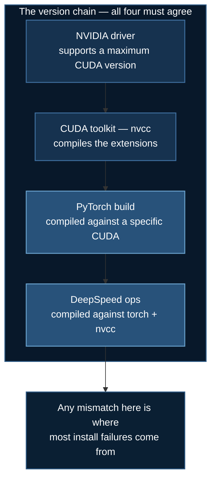

# Installation

Setting up DeepSpeed, and understanding the one thing that makes it harder to install than an ordinary Python package: **it compiles CUDA extensions against your local toolchain.**

## 1. Why DeepSpeed Installs Differently

`pip install deepspeed` is not like `pip install numpy`. DeepSpeed ships C++/CUDA kernels — fused Adam, CPU Adam for offload, sparse attention, async I/O — and those must be compiled against the CUDA toolkit and PyTorch build **on your machine**.



By default DeepSpeed compiles ops **just-in-time**, on first use. That means a broken toolchain shows up not at install time but minutes into your first training run — which is why the verification step in §4 is worth doing up front.

## 2. Prerequisites

| Requirement | Version |
|---|---|
| Python | 3.8+ (3.10–3.11 is the safest range) |
| PyTorch | 2.0+ |
| CUDA toolkit | 11.6+, **matching your PyTorch build** |
| NVIDIA driver | Recent enough for your CUDA version |
| GCC | 7+ (for compiling extensions) |

Check what you have:

```bash
nvidia-smi                                          # driver + max supported CUDA
nvcc --version                                      # CUDA toolkit (may be absent!)
python -c "import torch; print(torch.__version__, torch.version.cuda)"
```

:::warning `nvidia-smi` and `nvcc` report different things
The CUDA version in the `nvidia-smi` header is the **maximum** the driver supports, not what is installed. `nvcc --version` is the actual toolkit.

`nvidia-smi` working while `nvcc` is missing is extremely common — the driver is present but the toolkit is not. PyTorch runs fine (it ships its own CUDA runtime), but DeepSpeed cannot compile ops. Install the toolkit, or rely on prebuilt ops only.
:::

## 3. Installing

### With `uv` (recommended)

```bash
# Install uv
curl -LsSf https://astral.sh/uv/install.sh | sh

# Create and activate an environment
uv venv myenv
source myenv/bin/activate

# PyTorch FIRST, matched to your CUDA toolkit
uv pip install torch --index-url https://download.pytorch.org/whl/cu128

# Then DeepSpeed
uv pip install deepspeed

# Course dependencies
uv pip install numpy pandas matplotlib scikit-learn wandb yfinance
uv pip install transformers datasets accelerate peft trl
```

**Order matters.** DeepSpeed inspects the installed `torch` at build time to decide how to compile. Installing them together, or DeepSpeed first, can produce ops built against the wrong PyTorch.

Match the wheel index to your toolkit: `cu118`, `cu121`, `cu124` as appropriate.

### With pip

```bash
python -m venv myenv
source myenv/bin/activate
pip install --upgrade pip
pip install torch --index-url https://download.pytorch.org/whl/cu128
pip install deepspeed
```

### Pre-building ops (optional)

To compile at install time rather than on first run — worth it on a shared cluster, where JIT compilation on every job start is wasted time and can race between concurrent jobs:

```bash
DS_BUILD_OPS=1 pip install deepspeed --global-option="build_ext"
```

Or build selectively:

```bash
DS_BUILD_FUSED_ADAM=1 DS_BUILD_CPU_ADAM=1 pip install deepspeed
```

| Flag | Needed for |
|---|---|
| `DS_BUILD_CPU_ADAM` | **CPU optimizer offload** — without it, offload is unusably slow |
| `DS_BUILD_FUSED_ADAM` | Fused Adam kernel |
| `DS_BUILD_UTILS` | General utilities |
| `DS_BUILD_AIO` | NVMe offload (needs `libaio-dev`) |
| `DS_BUILD_OPS=1` | Everything — slow to build, and some ops need extra system libraries |

`DS_BUILD_AIO` additionally requires:

```bash
sudo apt-get install libaio-dev     # Debian/Ubuntu
```

## 4. Verify

```bash
ds_report
```

This is the single most useful diagnostic in the DeepSpeed ecosystem. It prints which ops are installed, which are JIT-compatible, and the versions of torch, CUDA, and nvcc as DeepSpeed sees them.

```
--------------------------------------------------
DeepSpeed C++/CUDA extension op report
--------------------------------------------------
JIT compiled ops requires ninja
ninja .................. [OKAY]
--------------------------------------------------
op name ................ installed .. compatible
--------------------------------------------------
cpu_adam ............... [NO] ....... [OKAY]
fused_adam ............. [NO] ....... [OKAY]
transformer_inference .. [NO] ....... [OKAY]
--------------------------------------------------
torch version .................... 2.1.0
torch cuda version ............... 12.1
nvcc version ..................... 12.1
deepspeed install path ........... [...]
```

Read it as: **`installed [NO]` + `compatible [OKAY]` is fine** — the op will be JIT-compiled on first use. `compatible [NO]` is the problem, and usually means a missing toolkit or a version mismatch.

Then confirm the basics from Python:

```python
import torch, deepspeed

print(f"PyTorch:   {torch.__version__}")
print(f"DeepSpeed: {deepspeed.__version__}")
print(f"CUDA available: {torch.cuda.is_available()}")
print(f"torch CUDA: {torch.version.cuda}")

if torch.cuda.is_available():
    for i in range(torch.cuda.device_count()):
        p = torch.cuda.get_device_properties(i)
        print(f"  GPU {i}: {p.name}, {p.total_memory/1e9:.1f} GB, sm_{p.major}{p.minor}")
    print(f"BF16 supported: {torch.cuda.is_bf16_supported()}")
```

`torch.cuda.is_bf16_supported()` tells you whether to use `bf16` or fall back to `fp16` with loss scaling — see [mixed precision](/docs/reference/deepspeed-config#5-mixed-precision). Compute capability `sm_80` (Ampere) or higher means BF16.

## 4a. No GPU? What Still Works

Every training script preflights for a CUDA device and **stops with an
explanation** rather than failing obscurely. Without that check, DeepSpeed gets
as far as compiling its fused Adam kernel and dies with:

```
OSError: CUDA_HOME environment variable is not set.
```

raised from inside torch's C++ extension loader — which tells a newcomer nothing.
Instead you now get:

```
========================================================================
  NO GPU DETECTED - stopping before DeepSpeed fails obscurely
========================================================================
  This example is small enough to run on CPU. Two config changes:
      "optimizer": {"type": "Adam", "params": {"torch_adam": true}}
      "fp16": {"enabled": false}
  then:  ALLOW_CPU=1 deepspeed --num_gpus=1 <script>.py
```

### Running examples 01–04 on CPU

Examples `01`–`04` are small enough to train without a GPU. Two config changes
are required, because both defaults need CUDA:

```json
{
  "optimizer": { "type": "Adam", "params": { "lr": 1e-3, "torch_adam": true } },
  "fp16": { "enabled": false }
}
```

`torch_adam: true` uses PyTorch's Adam instead of DeepSpeed's fused CUDA kernel;
`fp16` needs CUDA and must be off. Then:

```bash
ALLOW_CPU=1 deepspeed --num_gpus=1 train_ds.py
```

It is slow, but it genuinely trains and converges.

:::warning Examples 05–09 cannot run on CPU
They download models measured in GB and need real VRAM; no config flag changes
that. Their preflight says so instead of offering a CPU path.
:::

### What needs no GPU at all

```bash
./tests/run_all.sh     # 203 logic checks — configs, data handling, rewards
```

The test suite validates the *logic* of every example without a GPU or a model
download, and runs in CI on every push. See
[`tests/README.md`](https://github.com/yiqiao-yin/deepspeed-course/blob/main/tests/README.md).

### Or rent a GPU

```bash
export RUNPOD_API_KEY=...
uv run runpod/runpod_ctl.py recommend 01_basic_neuralnet
uv run runpod/runpod_ctl.py run 01_basic_neuralnet --yes
```

See [RunPod Setup](/docs/guides/runpod-setup#2a-provisioning-from-the-command-line).

## 5. Clone the Course

```bash
git clone https://github.com/yiqiao-yin/deepspeed-course.git
cd deepspeed-course
```

Each example directory is self-contained: a training script, a `ds_config.json`, a launcher, and a README. You can run any one of them without touching the others.

## 6. Platform Notes

### SLURM clusters (CoreWeave)

Build the environment on a **login node**, then activate it inside batch scripts:

```bash
#!/bin/bash
#SBATCH --gres=gpu:2
#SBATCH --partition=h200-low
#SBATCH --time=02:00:00

source ~/myenv/bin/activate
deepspeed --num_gpus=2 train_ds.py
```

Three cluster-specific hazards:

- **Login nodes have no GPUs.** `torch.cuda.is_available()` is `False` there, and that is expected. Verify GPU access inside a job or an `srun` session.
- **`$HOME` is often a small NFS quota.** Point `HF_HOME` at scratch or project storage before downloading models, or a large download will fail slowly.
- **Compute nodes are frequently air-gapped.** Anything that downloads at runtime — `yfinance`, `datasets`, `from_pretrained` — must be pre-fetched on a login node and cached.

```bash
export HF_HOME=/scratch/$USER/hf_cache
export HF_HUB_ENABLE_HF_TRANSFER=1     # much faster large downloads
```

If a module system is present, prefer the cluster's CUDA over installing your own:

```bash
module avail cuda
module load cuda/12.1
```

### RunPod

Start from an image with PyTorch preinstalled:

```
runpod/pytorch:2.8.0-py3.11-cuda12.8.1-cudnn-devel-ubuntu22.04
```

Use a **`devel`** image, not `runtime` — `devel` includes `nvcc`, without which DeepSpeed cannot compile ops.

```bash
pip install deepspeed wandb
ds_report
```

Persist the model cache on the network volume so it survives pod restarts:

```bash
export HF_HOME=/workspace/hf_cache
```

## 7. Optional: Weights & Biases

```bash
pip install wandb
wandb login          # key from https://wandb.ai/authorize
```

Every training script in this course wraps `import wandb` in `try/except` and only enables tracking when `WANDB_API_KEY` is set, so **W&B is entirely optional** — the scripts run unchanged without it.

```bash
export WANDB_API_KEY="your_key_here"
```

:::note The scripts contain `<ENTER_KEY_HERE>` placeholders
Batch scripts include lines like `export WANDB_API_KEY=<ENTER_KEY_HERE>`. These are instructional placeholders. Prefer setting the variable in your shell or a `.env` file that is not tracked by git, rather than editing keys into scripts you might commit.
:::

## 8. Common Install Failures

**`CUDA_HOME does not exist` / `nvcc not found`.** No toolkit. Install it, or `module load cuda/...`, or set `CUDA_HOME` if it is installed somewhere non-standard.

**`The detected CUDA version mismatches the version used to compile PyTorch`.** Install a PyTorch wheel matching your toolkit, or change the toolkit.

**`ninja: build stopped: subcommand failed`.** JIT compilation failed. Run `ds_report`, check GCC ≥ 7, ensure `ninja` is installed (`pip install ninja`), and read the full compiler error — the real cause is usually many lines above the last one.

**`cpu_adam` unavailable but offload configured.** `DS_BUILD_CPU_ADAM=1 pip install deepspeed --no-cache-dir`, and install `libaio-dev` if you also want NVMe.

**Install succeeds, first run hangs for minutes.** That is JIT compilation of ops. Normal on first run; pre-build to avoid it.

**Out of disk during install.** CUDA extension builds generate large intermediates. Ensure a few GB free in `TMPDIR`.

**`libaio` errors.** `sudo apt-get install libaio-dev`, or omit `DS_BUILD_AIO` if you do not need NVMe offload.

More symptom-first diagnosis: [Troubleshooting](/docs/reference/troubleshooting).

## Next Steps

- [Quick Start](/docs/getting-started/quick-start) — run your first training job
- [DeepSpeed ZeRO Stages](/docs/getting-started/deepspeed-zero-stages) — the memory theory
- [Hardware Requirements](/docs/guides/hardware-requirements) — check your GPU is sufficient

## References

1. [DeepSpeed installation details](https://www.deepspeed.ai/tutorials/advanced-install/) — `DS_BUILD_*` flags, pre-compilation.
2. [PyTorch install matrix](https://pytorch.org/get-started/locally/) — CUDA-matched wheels.
3. [uv documentation](https://docs.astral.sh/uv/)
4. [CUDA compatibility guide](https://docs.nvidia.com/deploy/cuda-compatibility/) — driver vs toolkit versioning.
