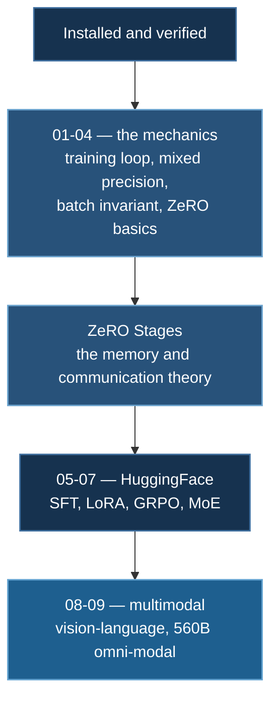

# Quick Start

Your first DeepSpeed run, and how to read what it prints.

## 1. Verify GPU Access

Before DeepSpeed, confirm the basics. On a SLURM cluster this is not a formality — **login nodes have no GPUs**, and this is where people discover that.

```python
# hello.py
import torch

print(f"PyTorch: {torch.__version__}")
print(f"CUDA available: {torch.cuda.is_available()}")

if torch.cuda.is_available():
    for i in range(torch.cuda.device_count()):
        p = torch.cuda.get_device_properties(i)
        print(f"  GPU {i}: {p.name}  {p.total_memory/1e9:.1f} GB  sm_{p.major}{p.minor}")
    print(f"BF16 supported: {torch.cuda.is_bf16_supported()}")

    x = torch.randn(4096, 4096, device="cuda")
    y = x @ x
    torch.cuda.synchronize()
    print(f"Matmul OK — result {tuple(y.shape)}")
else:
    print("No GPU visible. On SLURM this is expected on a login node.")
```

**RunPod / interactive:**

```bash
python hello.py
```

**SLURM:**

```bash
cat > run_hello.sh <<'EOF'
#!/bin/bash
#SBATCH --gres=gpu:1
#SBATCH --partition=h200-low
#SBATCH --time=00:10:00
#SBATCH --job-name=hello
#SBATCH --output=logs/%x_%j.out
mkdir -p logs
source ~/myenv/bin/activate
python hello.py
EOF

sbatch run_hello.sh
squeue -u $USER
tail -f logs/hello_*.out
```

`is_bf16_supported()` decides your precision setting: `True` (Ampere or newer) means use `bf16`; `False` means `fp16` with dynamic loss scaling.

## 2. Your First DeepSpeed Run

```bash
cd 01_basics/01_neuralnet

# Single GPU
deepspeed --num_gpus=1 train_ds.py

# SLURM
sbatch run_deepspeed.sh
tail -f logs/basic_nn_*.out
```

This trains a two-parameter linear model to recover $y = 2x + 1$ over 30 epochs. It is deliberately trivial — the point is that every mechanism you will use at 70B parameters is already present and inspectable here. The full walkthrough is [Basic Neural Network](/docs/tutorials/basic/neural-network).

### Its configuration

```json
{
  "train_batch_size": 32,
  "train_micro_batch_size_per_gpu": 32,
  "gradient_accumulation_steps": 1,
  "optimizer": {
    "type": "Adam",
    "params": { "lr": 1e-3 }
  },
  "fp16": { "enabled": true }
}
```

Note there is **no `zero_optimization` block** — at two parameters there is nothing worth partitioning, so the example omits it. ZeRO appears from `01_basics/04_rnn` onward.

:::warning This config is valid for exactly one GPU
$32 = 32 \times 1 \times 1$. Run `deepspeed --num_gpus=2 train_ds.py` and the [batch invariant](/docs/reference/deepspeed-config#2-batch-size) fails:

```
AssertionError: Check batch related parameters
```

This is the most common first-run failure in the course. Either set `train_batch_size` to 64, or drop `train_micro_batch_size_per_gpu` to 16, or delete `train_batch_size` and let DeepSpeed derive it from the other two.
:::

## 3. Reading the Output

A successful run prints three distinct things. Knowing which is which saves a lot of confusion.

**The resolved configuration.** DeepSpeed echoes the full config it is actually running, including everything `"auto"` became. **This echo is ground truth** — when behaviour surprises you, compare it against what you intended before anything else.

**Initialization notices.** Op loading, JIT compilation on first run (which can take minutes), and the optimizer DeepSpeed selected.

**Training progress**, from the script itself:

```
================================================================================
🚀 Starting DeepSpeed Linear Regression Training
================================================================================
...
Epoch 29/30 Summary: Avg Loss = 0.000123
  Learned Weight: 1.999876
  Learned Bias: 1.000234

Parameter Estimation Errors:
  Weight Error: 0.000124 (0.01%)
  Bias Error: 0.000234 (0.02%)

Model Quality: Excellent!
```

The learned parameters converge to the true $(2, 1)$. The loss floors around $10^{-4}$ rather than reaching zero, and that floor is **FP16 resolution, not an optimization failure** — near $\hat y \approx 2$, consecutive FP16 values differ by about $10^{-3}$. Switch to FP32 and the loss drops several orders of magnitude. A small, concrete demonstration that in mixed precision the arithmetic is often the error floor.

:::note `OVERFLOW! Skipping step` early on is normal
```
[deepspeed] OVERFLOW! Rank 0 Skipping step. Reducing loss scale to 32768.0
```
The dynamic loss scaler starts high and backs off until it finds the largest scale that does not overflow. A handful of these in the first iterations is the controller calibrating. Persisting past the first few dozen steps is a real problem — see [FP16 and loss scaling](/docs/tutorials/basic/neural-network#85-fp16-and-dynamic-loss-scaling).
:::

## 4. Launcher Reference

```bash
# Single GPU
deepspeed --num_gpus=1 train.py

# Multiple GPUs on one node
deepspeed --num_gpus=4 train.py

# Specific GPUs
deepspeed --include localhost:0,1 train.py

# Explicit config on the command line
deepspeed --num_gpus=2 train.py --deepspeed --deepspeed_config ds_config.json

# Multi-node (needs a hostfile and passwordless SSH between nodes)
deepspeed --hostfile=hostfile.txt --num_nodes=2 --num_gpus=8 train.py
```

Most scripts in this course pass `config="ds_config.json"` to `deepspeed.initialize` directly, so the `--deepspeed_config` flag is unnecessary.

## 5. Where to Go Next



The recommended order:

1. **[Basic Neural Network](/docs/tutorials/basic/neural-network)** — the training loop, loss functions as likelihoods, and a memory-accounting treatment of CUDA OOM
2. **[DeepSpeed ZeRO Stages](/docs/getting-started/deepspeed-zero-stages)** — why partitioning works and what each stage costs. Everything else references this
3. **[CIFAR-10](/docs/tutorials/basic/cifar10)** — a real debugging case study: `NaN` at 10% accuracy, diagnosed and repaired to 81%
4. **[HuggingFace Integration](/docs/tutorials/huggingface/overview)** — where the `"auto"` mechanism and LoRA come in

## 6. If Something Breaks

| Symptom | Start here |
|---|---|
| `AssertionError: Check batch related parameters` | §2 above |
| `CUDA out of memory` | [OOM diagnosis](/docs/tutorials/basic/neural-network#92-diagnosis) |
| Loss is `NaN` | [Troubleshooting §3](/docs/reference/troubleshooting#3-nan-divergence-and-loss-behaviour) |
| `nvcc not found`, op build failures | [Installation §8](/docs/getting-started/installation#8-common-install-failures) |
| Hangs with no output | [Troubleshooting §5](/docs/reference/troubleshooting#5-distributed-and-multi-gpu) |
| No GPU visible | On SLURM, you are on a login node |

## Next Steps

- [Basic Neural Network](/docs/tutorials/basic/neural-network) — the first complete example
- [DeepSpeed ZeRO Stages](/docs/getting-started/deepspeed-zero-stages) — memory optimization
- [SLURM Deployment](/docs/guides/slurm-deployment) — production cluster workflow
