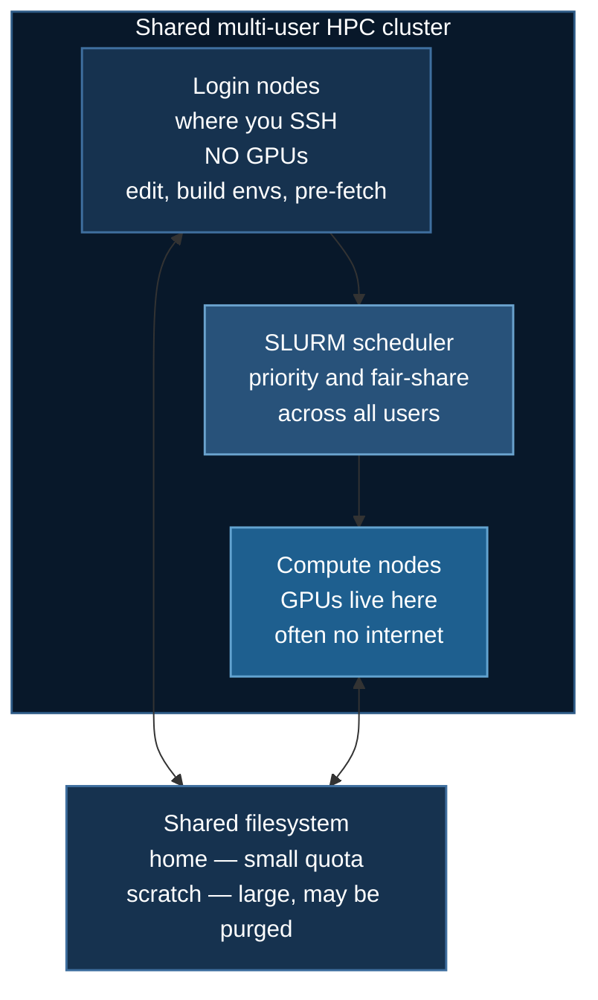

# CoreWeave Setup

Working on CoreWeave's SLURM-managed cluster: the shared-cluster model, environment setup that survives job boundaries, and the pre-fetching discipline air-gapped compute nodes require.

:::info Prerequisite
The submission mechanics — `sbatch`, resource flags, multi-node launching — are covered in [SLURM Deployment](/docs/guides/slurm-deployment). This page covers what is specific to working on a shared cluster like CoreWeave.
:::

## 1. The Architecture



**Why a scheduler exists at all.** Hundreds of users compete for a finite GPU pool. SLURM enforces fair-share allocation, prevents one user monopolizing the cluster, and enables backfill — slotting short jobs into gaps while a large job waits for nodes to free up. The cost is that you cannot simply run something; you request it and wait.

This is the fundamental difference from a single-tenant pod, and it should shape your workflow: **iterate interactively, submit batch jobs only when the code is known to work.**

## 2. First Session

```bash
ssh username@<coreweave-login-host>

sinfo                                   # partitions, limits, node states
sinfo -o "%.15P %.5a %.10l %.6D %.6t %N"
sacctmgr show associations user=$USER   # your account, QOS, and limits
```

Read `sinfo` before choosing a partition:

```
PARTITION    AVAIL  TIMELIMIT  NODES  STATE
h200-low*       up    4:00:00     50   idle
a100-high       up   24:00:00     20  mixed
```

The `*` marks the default. Partitions differ in GPU type, maximum walltime, and priority — a "low" partition typically means a shorter limit and lower cost or higher availability. Matching your job to the right partition is the single biggest lever on queue time.

## 3. Environment Setup

Build **once**, on a login node, into shared storage so every job can activate it.

```bash
curl -LsSf https://astral.sh/uv/install.sh | sh

uv venv ~/myenv
source ~/myenv/bin/activate

uv pip install torch --index-url https://download.pytorch.org/whl/cu128
uv pip install deepspeed
uv pip install transformers datasets accelerate peft trl wandb

ds_report          # verify before submitting anything
```

If the cluster provides CUDA modules, prefer them over installing your own toolkit:

```bash
module avail cuda
module load cuda/12.1
```

:::tip Pre-build DeepSpeed ops on a shared cluster
By default DeepSpeed JIT-compiles its CUDA extensions on first use — inside your job, on the clock, every time a fresh node has a cold cache. Worse, concurrent jobs can race on the same build directory.

```bash
DS_BUILD_CPU_ADAM=1 DS_BUILD_FUSED_ADAM=1 pip install deepspeed --no-cache-dir
```

Build once on the login node. See [Installation §3](/docs/getting-started/installation#pre-building-ops-optional).
:::

## 4. Storage

| Location | Typical size | Purged? | Use for |
|---|---|---|---|
| `$HOME` | Small quota (10–100 GB) | No | Code, virtualenv, scripts |
| Scratch / project | Large (TB) | Often, after N days | Model caches, checkpoints, datasets |

**The default HuggingFace cache is `~/.cache/huggingface`.** Downloading a 20B model into a 50 GB home quota fails partway — slowly, after a long download. Redirect it:

```bash
export HF_HOME=/scratch/$USER/hf_cache
export HF_HUB_ENABLE_HF_TRANSFER=1
```

Put that in `~/.bashrc` so it applies on login nodes and in jobs alike.

## 5. Pre-fetching for Air-Gapped Nodes

Compute nodes frequently have no outbound internet. Anything that downloads at runtime fails, and it fails *after* your job has waited in the queue and been allocated GPUs — an expensive way to discover it.

Fetch everything on the login node first:

```bash
# Models and tokenizers
python - <<'PY'
from transformers import AutoModelForCausalLM, AutoTokenizer
name = "Qwen/Qwen3-0.6B"
AutoTokenizer.from_pretrained(name)
AutoModelForCausalLM.from_pretrained(name)
PY

# Datasets
python -c "from datasets import load_dataset; load_dataset('openai/gsm8k','main')"
```

Then force offline mode inside the job, so a cache miss fails loudly and immediately rather than hanging on a network timeout:

```bash
export HF_HUB_OFFLINE=1
export TRANSFORMERS_OFFLINE=1
```

The same applies to anything else that reaches the network — the [stock-prediction example](/docs/tutorials/intermediate/stock-prediction) calls `yfinance` at runtime, so cache the dataframe to disk on a login node and load from disk in the job.

## 6. A Complete Job Script

This is the pattern the course's `run_deepspeed.sh` scripts follow:

```bash
#!/bin/bash
#SBATCH --job-name=ds_train
#SBATCH --partition=h200-low
#SBATCH --gres=gpu:2
#SBATCH --nodes=1
#SBATCH --ntasks-per-node=1
#SBATCH --cpus-per-task=16
#SBATCH --mem=64G
#SBATCH --time=04:00:00
#SBATCH --output=logs/%x_%j.out
#SBATCH --error=logs/%x_%j.err

mkdir -p logs

echo "=================================================="
echo "Job ID:    $SLURM_JOB_ID"
echo "Node:      $SLURM_NODELIST"
echo "GPUs:      $CUDA_VISIBLE_DEVICES"
echo "Start:     $(date)"
echo "=================================================="

source ~/myenv/bin/activate

export HF_HOME=/scratch/$USER/hf_cache
export HF_HUB_OFFLINE=1
export WANDB_API_KEY="your_key_here"     # optional; scripts skip W&B if unset

nvidia-smi

deepspeed --num_gpus=2 train_ds.py

echo "End: $(date)"
```

Recall from [SLURM Deployment §3](/docs/guides/slurm-deployment#3-batch-script-anatomy) that `--ntasks-per-node=1` is deliberate: the `deepspeed` launcher spawns one worker per GPU itself.

## 7. Working Efficiently on a Shared Cluster

**Debug interactively.** Do not iterate through the batch queue.

```bash
srun --gres=gpu:1 --mem=32G --cpus-per-task=8 --time=01:00:00 --pty bash
```

**Request less to start sooner.** Backfill schedules small, short jobs into gaps ahead of large ones. A 1-GPU, 30-minute job often starts immediately when a 8-GPU, 24-hour job would wait hours. Test at small scale, then scale up.

**Check queue depth before committing.**

```bash
squeue -p h200-low | wc -l
sinfo -p h200-low -o "%.10P %.6t %.6D"      # how many nodes are idle
```

**Checkpoint against the walltime.** Jobs are killed at the limit. See the signal-and-requeue pattern in [SLURM Deployment §7](/docs/guides/slurm-deployment#7-checkpointing-and-time-limits).

**Log the environment.** Node name, GPU model, and package versions at job start make a run reproducible months later, and explain why a rerun behaved differently.

## 8. Troubleshooting

**`torch.cuda.is_available()` is `False`.** You are on a login node. Expected.

**Job pending forever.** `squeue -j <id> --start` and check the `%R` reason column. Try a different partition or fewer resources.

**Job killed with exit code 137.** SIGKILL — the host OOM killer. Raise `--mem`; check `sacct -j <id> --format=MaxRSS` to see how close you were.

**Download hangs then fails inside the job.** Air-gapped node. §5.

**`Disk quota exceeded`.** `$HOME` is full — usually the HF cache. §4.

**NCCL errors on multi-node.** See [SLURM Deployment §6](/docs/guides/slurm-deployment#networking); `NCCL_SOCKET_IFNAME` is often the fix.

**DeepSpeed spends minutes compiling on every job.** Pre-build the ops (§3).

## 9. CoreWeave vs RunPod

| | CoreWeave (SLURM) | RunPod |
|---|---|---|
| Access | Queue-based | Immediate |
| GPU allocation | Shared, scheduled | Dedicated to your pod |
| Internet on compute | Often none | Yes |
| Billing | Compute time used | Pod lifetime, including idle |
| Multi-node | Well supported | Harder |
| Best for | Production, large jobs | Development, iteration |

Many people use both: develop on RunPod where iteration is instant, then submit production runs to CoreWeave where the large allocations live. See [RunPod Setup](/docs/guides/runpod-setup).

## Next Steps

- [SLURM Deployment](/docs/guides/slurm-deployment) — submission, monitoring, multi-node
- [RunPod Setup](/docs/guides/runpod-setup) — the interactive alternative
- [Hardware Requirements](/docs/guides/hardware-requirements) — sizing your request
- [Troubleshooting](/docs/reference/troubleshooting)
