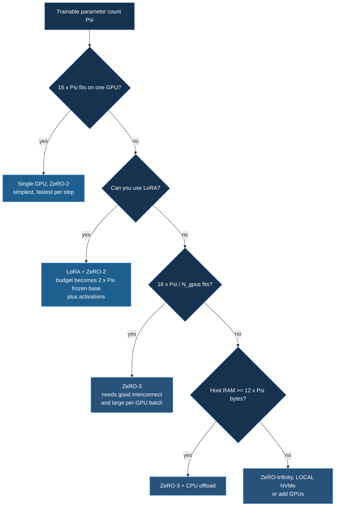

# Hardware Requirements

Sizing hardware from parameter count — and understanding which specification actually constrains you.

## 1. The Two Numbers That Matter

For DeepSpeed training, GPU selection reduces to two quantities, and **peak TFLOPS is usually not one of them.**

**VRAM decides feasibility.** If the model states do not fit, no amount of compute helps. This is a hard threshold, not a gradient.

**Memory bandwidth decides throughput.** Transformer training at realistic batch sizes is largely memory-bandwidth-bound, not compute-bound: the optimizer step is a pure streaming operation with $O(1)$ arithmetic per parameter, attention is bandwidth-heavy, and MoE models are worse still. A GPU with twice the FLOPS and the same bandwidth rarely trains twice as fast.

:::warning Vendor TFLOPS numbers are not comparable as published
Marketing figures mix precisions (FP32 / FP16 / BF16 / FP8), mix **dense and sparse** (sparse figures are 2× and require 2:4 structured sparsity you almost certainly do not have), and mix accumulate precision (FP16 accumulate is 2× FP32 accumulate on GeForce parts). Consumer-card "FP16 TFLOPS" quoted in comparison tables is frequently the **FP32 shader** number.

The tables below therefore give VRAM and memory bandwidth — unambiguous, verifiable, and the quantities that actually predict training behaviour. Where FP32 is listed it is labelled as such. For authoritative compute figures consult the vendor datasheet for your exact SKU.
:::

## 2. GPU Reference

### Consumer

| GPU | VRAM | Memory bandwidth | FP32 (shader) | Notes |
|---|---|---|---|---|
| RTX 3060 | 12 GB | 360 GB/s | 12.7 TF | More VRAM than a 3070 — often the better learning card |
| RTX 3070 | 8 GB | 448 GB/s | 20.3 TF | 8 GB is the real constraint |
| RTX 3080 | 10 GB | 760 GB/s | 29.8 TF | |
| RTX 3090 | 24 GB | 936 GB/s | 35.6 TF | No BF16 tensor advantage over 40-series |
| RTX 4070 | 12 GB | 504 GB/s | 29.1 TF | |
| RTX 4080 | 16 GB | 717 GB/s | 48.7 TF | |
| RTX 4090 | 24 GB | 1008 GB/s | 82.6 TF | Best consumer option for training |

All Ampere and later consumer cards support **BF16**, which is what matters most for LLM work — see [BF16 over FP16](/docs/tutorials/huggingface/overview#bf16-over-fp16-for-llms).

:::note Consumer cards and multi-GPU
GeForce cards lack NVLink from the 40-series onward, so inter-GPU communication goes over PCIe — roughly an order of magnitude slower than the NVLink/NVSwitch fabric in datacenter parts.

Since [ZeRO Stage 3 costs $3\Psi$ of communication on the critical path](/docs/getting-started/deepspeed-zero-stages#43-stage-3-costs-15), **Stage 3 across consumer GPUs is often disappointing**. Stage 2 (which costs the same $2\Psi$ as plain DDP) plus LoRA is usually the better configuration on a consumer multi-GPU box.
:::

### Datacenter

| GPU | VRAM | Memory bandwidth | Notes |
|---|---|---|---|
| A40 | 48 GB GDDR6 | 696 GB/s | Large VRAM, modest bandwidth |
| A100 40 GB | 40 GB HBM2e | 1555 GB/s | |
| A100 80 GB | 80 GB HBM2e | 2039 GB/s | The long-standing workhorse |
| H100 SXM | 80 GB HBM3 | 3350 GB/s | Adds FP8 |
| H200 SXM | 141 GB HBM3e | 4800 GB/s | Same compute as H100, much more memory and bandwidth |
| B200 | 192 GB HBM3e | ~8000 GB/s | What `09_vss` targets |

Note H200 versus H100: **identical compute, 1.76× the memory and 1.43× the bandwidth.** For memory-bound training that is a large real-world gain even though the FLOPS figure is unchanged — a good illustration of why the compute number is the wrong headline.

## 3. Memory Estimation

The single most useful formula in this course. For $\Psi$ trainable parameters:

$$
M_{\text{model states}} = \underbrace{2\Psi}_{\text{BF16/FP16 weights}} + \underbrace{2\Psi}_{\text{gradients}} + \underbrace{4\Psi + 4\Psi + 4\Psi}_{\text{FP32 master} + m + v} = 16\Psi \text{ bytes}
$$

Derivation and consequences: [ZeRO Stages §1.2](/docs/getting-started/deepspeed-zero-stages#12-where-the-memory-actually-goes).

:::note Pure FP32 also comes to $16\Psi$ — for different reasons
Training in FP32 with Adam gives $4\Psi$ (weights) $+ 4\Psi$ (gradients) $+ 4\Psi$ ($m$) $+ 4\Psi$ ($v$) $= 16\Psi$ as well.

The totals coincide; the **breakdowns do not**. Mixed precision moves memory from weights and gradients into the FP32 master copy, and its benefit is speed (tensor cores) and halved *activation* memory, not smaller model states. Quoting "$16\Psi$" is safe either way, but do not conclude that mixed precision reduces model-state memory — it does not.
:::

| Optimizer | $K$ | Total |
|---|---|---|
| Adam / AdamW | 12 | $16\Psi$ |
| 8-bit Adam | ~6 | $10\Psi$ |
| SGD + momentum | 4 | $8\Psi$ |
| SGD | 0 | $4\Psi$ |
| **LoRA** (frozen base) | 12 on adapters only | $2\Psi_{\text{base}} + 16\Psi_{\text{LoRA}}$ |

### Worked examples

| Model | $\Psi$ | Full FT ($16\Psi$) | LoRA ($\approx 2\Psi$) |
|---|---|---|---|
| Qwen3-0.6B | 0.6B | 9.6 GB | 1.2 GB |
| Qwen2-VL-2B | 2B | 32 GB | 4 GB |
| Mistral-7B | 7B | 112 GB | 14 GB |
| gpt-oss-20b | 20B | 320 GB | 40 GB |
| Llama-70B | 70B | 1.12 TB | 140 GB |
| LongCat-Flash-Omni | 560B | 8.96 TB | 1.12 TB |

**Then add activations**, which scale with batch and sequence length and are frequently the binding constraint — especially for CNNs and vision-language models. Budget 20–50% headroom beyond the table.

### With ZeRO

| Stage | Memory per GPU | Communication |
|---|---|---|
| 1 | $4\Psi + 12\Psi/N_d$ | $2\Psi$ — free |
| 2 | $2\Psi + 14\Psi/N_d$ | $2\Psi$ — free |
| 3 | $16\Psi/N_d$ | $3\Psi$ — 1.5× |

## 4. Model → Hardware

| Trainable $\Psi$ | Approach | Example hardware |
|---|---|---|
| < 1B | Full FT, ZeRO-2 | 1× RTX 3060 (12 GB) |
| 1–3B | Full FT ZeRO-2, or LoRA | 1× RTX 4090 (24 GB) |
| 3–7B | LoRA + ZeRO-2 | 1× RTX 4090, or 2× for headroom |
| 7–13B | LoRA + ZeRO-2 | 2× RTX 4090 / 1× A100 80 GB |
| 13–30B | LoRA + ZeRO-2/3 | 4× A100 80 GB |
| 30–70B | LoRA + ZeRO-3, offload | 8× A100 / 4× H100 |
| 70B+ | LoRA + ZeRO-3 + CPU/NVMe offload | 8× H100/H200, large host RAM |
| 500B+ | LoRA + ZeRO-3 + aggressive offload | See `09_vss` — 2× B200 **and 3 TB RAM** |

## 5. This Course's Examples

| Example | Model | Minimum | Recommended |
|---|---|---|---|
| `01`–`04` basics | < 1M params | 1× RTX 3060 | Any CUDA GPU |
| `04_intermediate_rnn_stock_data` | ~5K params | 1× any GPU | 2× for the demo |
| `05_huggingface_trl` | Qwen3-0.6B | 1× RTX 3070 (8 GB) | 2× RTX 4090 |
| `05_huggingface_ocr` | Qwen2-VL-2B | 2× 16 GB with LoRA | 2× RTX 4090 |
| `06_huggingface_grpo` | Qwen-1.5B | 1× 8 GB + 64 GB RAM | 1× RTX 4090 |
| `07_..._gpt_oss` | gpt-oss-20b | 4× A100 80 GB | 4× H100 |
| `07_..._multi_agency` | Qwen-1.5B | 1× RTX 4090 | — |
| `08_vtt` LLaVA | LLaVA 7B | 2× A100 40 GB | 2× A100 80 GB |
| `08_vtt` seq2seq | NLLB-600M | 1× RTX 3090 | 1× A100 |
| `09_vss` | LongCat 560B | **2× B200 + 3 TB RAM + 2 TB disk** | 8× B200 |

:::danger `09_vss` is gated on host RAM, not GPUs
The example's `run_2xB200.sh` preflights GPU count, free disk, and total RAM, and it is the **3 TB of system RAM** that makes the run possible — 1.12 TB of BF16 weights live in host memory and stream to the GPUs. Two B200s alone are not sufficient. Under-provisioned RAM does not degrade gracefully; the host swaps and throughput effectively stops. See [Video-Speech Training](/docs/tutorials/multimodal/video-speech-training#2-the-memory-problem).
:::

## 6. System Requirements

### Host RAM

CPU offload needs $\approx 12\Psi$ bytes for Adam states, plus room for the dataloader and OS.

| Configuration | Host RAM |
|---|---|
| Basic examples | 16 GB |
| HuggingFace, no offload | 32 GB |
| 7B with optimizer offload | 128 GB |
| 70B with offload | 1 TB+ |
| `09_vss` (560B) | **3 TB** |

A useful rule: with offload enabled, provision host RAM at **1.5–2× the theoretical requirement**. Pinned memory is non-swappable and fragments, so the practical ceiling is below the nominal total.

### Storage

| Use | Space |
|---|---|
| Basic examples | 50 GB |
| HuggingFace models | 100–200 GB |
| 70B weights | ~140 GB (BF16) |
| LongCat-Flash-Omni | **~1.1 TB** |

Point `HF_HOME` at the large volume. On HPC clusters `$HOME` is usually a small NFS quota, and a 1.1 TB download into it will fail — slowly.

**NVMe offload requires local NVMe.** `nvme_path` on a network filesystem is catastrophically slow and is the single most common ZeRO-Infinity misconfiguration.

### Interconnect

| Setup | Interconnect | Suitable for |
|---|---|---|
| Single GPU | — | Everything up to its VRAM |
| Multi-GPU, PCIe | ~32–64 GB/s | ZeRO-2 comfortably; Stage 3 marginally |
| Multi-GPU, NVLink | 300–900 GB/s | Stage 3, tensor parallelism |
| Multi-node, 25 GbE | 3 GB/s | Minimum viable; expect comm-bound |
| Multi-node, 100+ Gb InfiniBand | 12.5+ GB/s | Production multi-node |

Interconnect quality is what decides whether Stage 3 is usable. Sizing it from the $3\Psi$ figure is the analysis in [§4 of the ZeRO page](/docs/getting-started/deepspeed-zero-stages#4-the-cost-communication-analysis).

## 7. Cost

:::note Pricing moves constantly
The figures below are order-of-magnitude only, and were indicative when written. Always check current provider pricing — spot and preemptible rates in particular move weekly.
:::

| Provider | GPU | Approx. $/hr |
|---|---|---|
| RunPod (community) | RTX 4090 | ~$0.70 |
| RunPod | A100 80 GB | ~$1.90 |
| CoreWeave | H100 | ~$4.75 |
| AWS | p4d.24xlarge (8× A100) | ~$32.80 |

Practical guidance:

1. **Develop on the smallest GPU that runs the code.** Debug a shape mismatch on a 4090, not on eight H100s.
2. **Use the small-model variant first.** `train_ds_mistral7b.py` exercises the same code path as the 20B script at a fraction of the cost.
3. **Prefer spot/preemptible for experimentation** — and checkpoint frequently enough that preemption costs minutes, not hours.
4. **Size for throughput, not just fit.** A configuration that barely fits with heavy offload can be slower and more expensive overall than one on a larger GPU that runs unencumbered. Cost is $/hr × hours.
5. **Watch the download.** 1.1 TB of weights takes hours; on metered egress it may cost more than the compute.

## Next Steps

- [DeepSpeed ZeRO Stages](/docs/getting-started/deepspeed-zero-stages) — the memory and bandwidth theory
- [Troubleshooting](/docs/reference/troubleshooting) — what to do when it does not fit
- [SLURM Deployment](/docs/guides/slurm-deployment) · [RunPod Setup](/docs/guides/runpod-setup)

## References

1. Rajbhandari, S., Rasley, J., Ruwase, O., & He, Y. (2020). ZeRO. *SC '20*. [arXiv:1910.02054](https://arxiv.org/abs/1910.02054) — the $16\Psi$ accounting.
2. Micikevicius, P., et al. (2018). Mixed Precision Training. *ICLR 2018*. [arXiv:1710.03740](https://arxiv.org/abs/1710.03740)
3. Dettmers, T., Lewis, M., Shleifer, S., & Zettlemoyer, L. (2022). 8-bit Optimizers via Block-wise Quantization. *ICLR 2022*. [arXiv:2110.02861](https://arxiv.org/abs/2110.02861)
4. Hu, E. J., et al. (2022). LoRA. *ICLR 2022*. [arXiv:2106.09685](https://arxiv.org/abs/2106.09685)
5. [NVIDIA A100 datasheet](https://www.nvidia.com/content/dam/en-zz/Solutions/Data-Center/a100/pdf/nvidia-a100-datasheet-nvidia-us-2188504-web.pdf) · [NVIDIA data center GPU specs](https://www.nvidia.com/en-us/data-center/)
