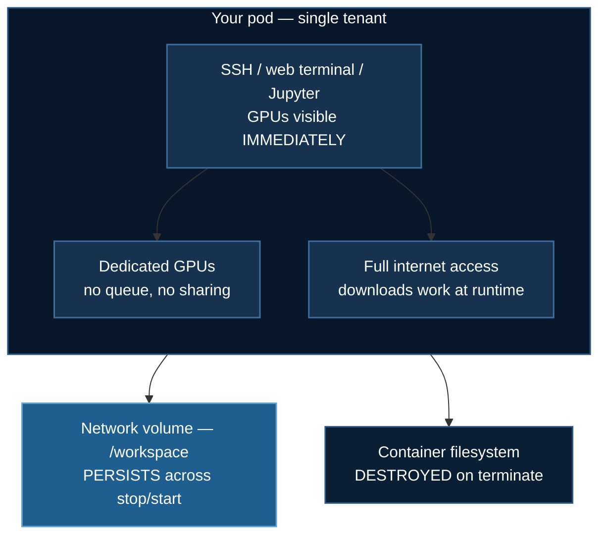

# RunPod Setup

Single-tenant GPU pods: immediate access, no scheduler, and a billing model that rewards different habits than a shared cluster.

## 1. The Model



Two differences from [CoreWeave](/docs/guides/coreweave-setup) drive everything:

**No scheduler.** You SSH in and GPUs are already there. The `#SBATCH` headers in this course's launcher scripts are inert comments — just run `deepspeed` directly.

**You pay for wall-clock, not compute.** A pod sitting idle at a terminal prompt bills exactly the same as one at 100% utilization. On a shared cluster idle time is free; here it is the main way to waste money.

## 2. Creating a Pod

**Choose a `devel` image.** This matters more than it looks:

```
runpod/pytorch:2.8.0-py3.11-cuda12.8.1-cudnn-devel-ubuntu22.04
```

`devel` includes `nvcc`; `runtime` does not. Without `nvcc`, DeepSpeed cannot compile its CUDA extensions and CPU offload in particular will be unavailable. See [Installation §1](/docs/getting-started/installation#1-why-deepspeed-installs-differently).

**Attach a network volume** mounted at `/workspace`. Without one, everything is lost on terminate — including a 100 GB model cache you will then re-download.

**Size the disk for weights.** Container disk defaults are small. Model weights are large: ~14 GB for a 7B in BF16, ~40 GB for gpt-oss-20b, [1.1 TB for LongCat](/docs/tutorials/multimodal/video-speech-training#2-the-memory-problem). Check [Hardware Requirements](/docs/guides/hardware-requirements#storage) before choosing.

## 2a. Provisioning From the Command Line

The repository ships a RunPod client so you can find a GPU, start a pod, run an
example on it, and shut it down without touching the web console.

```bash
export RUNPOD_API_KEY=...        # https://console.runpod.io/user/settings

uv run runpod/runpod_ctl.py gpus --min-vram 24        # live catalogue + prices
uv run runpod/runpod_ctl.py recommend 06_huggingface_grpo
uv run runpod/runpod_ctl.py run 06_huggingface_grpo --yes
uv run runpod/runpod_ctl.py pods                      # what am I paying for?
uv run runpod/runpod_ctl.py terminate <podId>
```

Stdlib only — `uv run` handles everything, nothing to install.

`recommend` maps an example to its VRAM, GPU-count and disk requirements and
lists the cheapest GPUs that satisfy them:

```
06_huggingface_grpo
  Needs: >= 24 GB VRAM x 1 GPU, 80 GB disk

  Cheapest options (1 GPU(s), on-demand):
     $/hr total   VRAM  ID
           0.22    24G  NVIDIA GeForce RTX 3090
           0.34    24G  NVIDIA GeForce RTX 4090
```

`run` creates a pod whose **start command clones this repository and begins
training** — there is no upload step and no SSH key setup:

```bash
cd /workspace && git clone --depth 1 <repo> && cd deepspeed-course
curl -LsSf https://astral.sh/uv/install.sh | sh
uv pip install --system deepspeed
cd <example> && deepspeed --num_gpus=<N> <script>.py | tee /workspace/train.log
```

:::danger Billing starts on creation and stops only on TERMINATE
Stopping a pod is not enough. `create` and `run` both refuse without `--yes` and
print the hourly rate first. When you are finished:

```bash
uv run runpod/runpod_ctl.py pods        # should say "Nothing is billing."
```
:::

:::note Three limitations, stated plainly
**No log streaming.** RunPod's REST API exposes no log endpoint — the `Pod`
schema has `portMappings` and `ports` but nothing log-shaped. Use the web
console, or `ssh root@<ip> -p <port>` then `tail -f /workspace/train.log`.

**Capacity is not guaranteed.** Popular GPUs sell out and RunPod returns HTTP
500 *"no instances currently available"*. The tool reports that as a plain
message with alternatives; nothing is created and nothing is billed.

**`09_vss` cannot run on RunPod.** It needs roughly **3 TB of host RAM**, which
pods do not provide. VRAM is not the binding constraint there.
:::

Full reference: [`runpod/README.md`](https://github.com/yiqiao-yin/deepspeed-course/blob/main/runpod/README.md).

## 3. Setup

```bash
ssh root@<pod-ip> -p <port>          # command is in the dashboard

nvidia-smi                            # GPUs should be visible immediately
```

Put everything persistent on the volume:

```bash
cd /workspace
git clone https://github.com/yiqiao-yin/deepspeed-course.git
cd deepspeed-course

python -m venv /workspace/venv        # on the VOLUME, not in the container
source /workspace/venv/bin/activate

pip install deepspeed wandb
ds_report
```

:::danger Put the venv and the model cache on `/workspace`
The default locations — `~/.cache/huggingface`, a venv in `/root` — live on the **container** filesystem and are destroyed when the pod is terminated. Rebuilding an environment and re-downloading 40 GB of weights on every pod is a slow and expensive habit.

```bash
export HF_HOME=/workspace/hf_cache
export HF_HUB_ENABLE_HF_TRANSFER=1
echo 'export HF_HOME=/workspace/hf_cache' >> ~/.bashrc
```
:::

Note the base images normally ship PyTorch already, so install `deepspeed` on top rather than reinstalling `torch` — replacing it risks a CUDA mismatch with the image.

## 4. Running

No queue, no submission:

```bash
cd /workspace/deepspeed-course/01_basic_neuralnet

deepspeed --num_gpus=1 train_ds.py
deepspeed --num_gpus=4 train_ds.py
```

The course's `run_deepspeed.sh` scripts work here too — the `#SBATCH` lines are comments, and the body is an ordinary shell script. Just run it with `bash run_deepspeed.sh` rather than `sbatch`.

Remember the [batch invariant](/docs/reference/deepspeed-config#2-batch-size): most configs are pinned to a specific GPU count, so changing `--num_gpus` usually requires editing the config.

### Long runs

The SSH session dying kills the training with it. Use a multiplexer:

```bash
tmux new -s train
deepspeed --num_gpus=2 train_ds.py 2>&1 | tee /workspace/train.log
# Ctrl-B then D to detach; reconnect later with:
tmux attach -t train
```

### Jupyter

```bash
jupyter lab --ip=0.0.0.0 --port=8888 --allow-root --no-browser
```

Expose port 8888 in the pod configuration. Good for the notebook examples in `05_huggingface_trl`; less good for long training runs, where a dropped browser connection can interrupt the kernel.

## 5. Cost Discipline

Billing is by pod lifetime, so the habits that matter are different from a shared cluster.

**Stop, don't terminate** — Stop pauses billing while preserving the volume. Terminate destroys everything not on a network volume.

**Develop small, train big.** Debug shape errors on a single RTX 4090; move to 4× A100 only once the code runs. A bug found on 8 H100s costs roughly 40× what the same bug costs on one 4090.

**Use the small-model variant first.** `train_ds_mistral7b.py` exercises the same code path as the 20B script at a fraction of the cost.

**Watch the download clock.** Pulling 1.1 TB of weights bills GPU time for hours of pure I/O. Download to a persistent volume once, then reuse it across pods.

**Check utilization.** If `nvidia-smi` shows the GPU oscillating between 0% and 100%, you are dataloader-bound and paying for an idle GPU — raise `dataloader_num_workers`.

```bash
watch -n 2 nvidia-smi
```

**Set a spending alert.** The most common expensive mistake is a forgotten running pod.

## 6. RunPod vs CoreWeave

| | RunPod | CoreWeave (SLURM) |
|---|---|---|
| Time to first GPU | Seconds | Minutes to hours (queue) |
| GPUs | Dedicated | Shared, scheduled |
| Internet on the node | Yes | Often none |
| Billing | Pod lifetime, idle included | Compute time used |
| Multi-node | Harder | Well supported |
| Persistence | Network volume | Shared filesystem |
| Best for | Development, iteration | Production, large jobs |

A common workflow uses both: iterate on RunPod where the feedback loop is instant, then submit the long production run to CoreWeave where the large allocations and multi-node fabric live. Everything in this course runs on either.

## 7. Troubleshooting

**`nvcc: command not found`.** You are on a `runtime` image. Recreate the pod from a `devel` image, or install the toolkit.

**Environment gone after restarting the pod.** It was on the container filesystem. §3 — put it on `/workspace`.

**Disk full during a model download.** Container disk is small and separate from the volume. Set `HF_HOME=/workspace/hf_cache` and increase the volume.

**Training dies when SSH disconnects.** Use `tmux` (§4).

**Pod will not start.** GPU type unavailable in that region — try another type or region, or reduce the disk request.

**Multi-GPU is slower than single.** Consumer GPUs communicate over PCIe without NVLink, so [ZeRO Stage 3 is often disappointing](/docs/guides/hardware-requirements#consumer) on a 4090 box. Try Stage 2, or a larger per-GPU batch.

**CUDA out of memory.** [OOM diagnosis](/docs/tutorials/basic/neural-network#92-diagnosis) — identify whether you are model-state-, activation-, or fragmentation-bound before reaching for batch size.

## Next Steps

- [Quick Start](/docs/getting-started/quick-start) — your first run
- [Hardware Requirements](/docs/guides/hardware-requirements) — choosing a GPU and disk size
- [CoreWeave Setup](/docs/guides/coreweave-setup) — the scheduled alternative
- [Troubleshooting](/docs/reference/troubleshooting)
