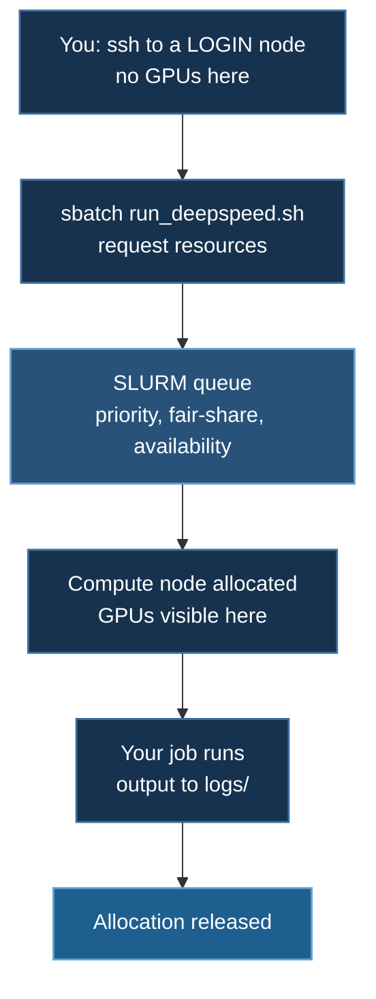

# SLURM Deployment

Running DeepSpeed on SLURM-managed HPC clusters — the submission model, the resource flags that matter, and how to launch multi-node jobs correctly.

## 1. The Mental Model

SLURM clusters are **shared and batch-scheduled**. You do not run training; you *request* that training be run, and a scheduler decides when.



Three consequences that shape everything else:

**Login nodes have no GPUs.** `torch.cuda.is_available()` returns `False` there, and that is correct, not broken. Build environments and edit code on the login node; verify GPU behaviour inside a job.

**Compute nodes are often air-gapped.** Anything that downloads at runtime — `from_pretrained`, `load_dataset`, `yfinance` — will fail. Pre-fetch on the login node and cache to shared storage.

**Jobs are killed at the time limit, without warning by default.** Checkpoint, or lose the run.

## 2. Core Workflow

```bash
sbatch run_deepspeed.sh          # submit, prints a job ID
squeue -u $USER                  # what is queued or running
tail -f logs/basic_nn_12345.out  # follow output
scancel 12345                    # cancel
sacct -j 12345                   # what happened after it finished
```

### Submit a cheap smoke test first

Every training script in the course accepts `--max-steps N`, and every batch
script forwards its arguments through to that script. So the first thing to
submit on a new cluster is not the real job:

```bash
sbatch run_deepspeed.sh --max-steps 5    # does the plumbing work?
sbatch run_deepspeed.sh                  # the real allocation
```

The capped job still clones, installs, loads the model, initializes DeepSpeed
and takes real optimizer steps — so genuine failures (a bad ZeRO stage, a
mismatched batch invariant, a collator dropping half its inputs) surface
exactly as they would in the full run. It just stops after five steps.

The cap counts **optimizer steps, not epochs**. With gradient accumulation of
4, `--max-steps 5` consumes 20 micro-batches.

:::warning If you write your own batch script, end the launch line with `"$@"`
```bash
deepspeed --num_gpus=2 train_ds.py "$@"      # ✅ the flag arrives
deepspeed --num_gpus=2 train_ds.py           # ❌ silently swallowed
```
Without it, `sbatch run_deepspeed.sh --max-steps 5` still submits successfully
and still runs successfully — it just runs the **whole job**. Nothing warns you;
you find out from the wall clock or the bill. Every launcher in this repository
shipped this way at one point, which quietly made every documented dry-run
command a no-op. `scripts/check_contract.py` now checks for it.
:::

## 2a. Every Example Is Submittable

All 23 examples ship a SLURM batch script, so a CoreWeave user can run the
entire course:

| Example | Script | GPUs |
|---|---|---|
| `01_basics/01_neuralnet` | `run_deepspeed.sh` | 1 |
| `01_basics/02_convnet` | `run_deepspeed.sh` | 1 |
| `01_basics/03_convnet_cifar10` | `run_deepspeed.sh` | 2 |
| `01_basics/04_rnn` | `run_deepspeed.sh` | 2 |
| `02_intermediate/01_bayesian_neuralnet` | `run_deepspeed.sh` | 2 |
| `02_intermediate/02_rnn_stock_data` | `run_deepspeed.sh` | 2 |
| `03_huggingface/01_llm_finetuning` | `run_deepspeed.sh` | 2 |
| `03_huggingface/02_trl_sft` | `run_deepspeed.sh` | 2 |
| `03_huggingface/03_ocr` | `submit_job.sh` | 2 |
| `03_huggingface/05_dpo` | `run_deepspeed.sh` | 1 |
| `03_huggingface/04_reward_model` | `run_deepspeed.sh` | 1 |
| `03_huggingface/06_grpo` | `run_deepspeed.sh` | 2 |
| `03_huggingface/07_online_dpo` | `run_deepspeed.sh` | 2 |
| `07_..._gpt_oss_finetune_sft` | `lora/run_deepspeed.sh` | 4 |
| `03_huggingface/09_multi_agency` | `run_slurm.sh` | 1 |
| `04_video_text/02_qwen25vl` | `run_deepspeed.sh` | 2 |
| `04_video_text/03_token_compression` | `run_deepspeed.sh` | 1 |
| `04_video_text/04_streaming_memory` | `run_deepspeed.sh` | 1 |
| `04_video_text/05_video_eval` | `run_deepspeed.sh` | 1 |
| `05_video_speech/01_longcat_omni` | `run_deepspeed.sh` | 2 |
| `05_video_speech/02_thinker_talker` | `run_deepspeed.sh` | 2 |
| `05_video_speech/03_duplex_streaming` | `run_deepspeed.sh` | 1 |
| `05_video_speech/04_omni_eval` | `run_deepspeed.sh` | 1 |

`04_video_text` and `05_video_speech` are also registered as bare top-level names for backward
compatibility; each resolves to the subtopic shown above.

A regression test asserts this coverage, so an example cannot be added without
a way to submit it:

```bash
uv run tests/test_runpod_ctl.py     # includes the SLURM-coverage checks
```

:::note Two that differ from the pattern
`03_huggingface/09_multi_agency` uses `run_slurm.sh` and launches with plain
`python`, because it drives TRL's `GRPOTrainer` directly rather than using the
DeepSpeed launcher.

`04_video_text` has one script covering both trainers — set `TRAINER=llava` or
`TRAINER=seq2seq` (default) before submitting.
:::

:::danger `05_video_speech` is gated on host RAM
Its script requests `--mem=3000G`. That is not padding: 1.1 TB of BF16 weights
live in host memory under ZeRO-3 offload. Submitting it to a partition without
that much RAM will fail or thrash. See
[Video-Speech Training](/docs/tutorials/multimodal/video-speech-training#2-the-memory-problem).
:::

## 3. Batch Script Anatomy

```bash
#!/bin/bash
#SBATCH --job-name=deepspeed_train
#SBATCH --partition=h200-low        # queue; see `sinfo`
#SBATCH --gres=gpu:2                # GPUs PER NODE
#SBATCH --nodes=1
#SBATCH --ntasks-per-node=1         # ONE task — DeepSpeed spawns its own workers
#SBATCH --cpus-per-task=16          # dataloader workers
#SBATCH --mem=64G
#SBATCH --time=04:00:00
#SBATCH --output=logs/%x_%j.out     # %x = job name, %j = job id
#SBATCH --error=logs/%x_%j.err

mkdir -p logs

echo "Job ID:   $SLURM_JOB_ID"
echo "Node:     $SLURM_NODELIST"
echo "GPUs:     $CUDA_VISIBLE_DEVICES"
echo "Start:    $(date)"

source ~/myenv/bin/activate

export HF_HOME=/scratch/$USER/hf_cache
export WANDB_API_KEY="your_key"          # or leave unset; scripts skip W&B

deepspeed --num_gpus=2 train_ds.py

echo "End: $(date)"
```

:::danger `--ntasks-per-node=1`, not one task per GPU
This is the most common SLURM/DeepSpeed mistake. The `deepspeed` launcher **spawns one worker process per GPU itself**. If SLURM also starts one task per GPU, you get $N^2$ processes, all fighting for the same devices — usually a hang, sometimes a confusing NCCL error.

Use `--ntasks-per-node=1` and let DeepSpeed do the process management. (The alternative convention — one SLURM task per GPU driven by `srun` + `torchrun` — is valid too, but do not mix the two.)
:::

### Resource flags

```bash
#SBATCH --gres=gpu:1              # 1 GPU, any type
#SBATCH --gres=gpu:a100:4         # 4 A100s specifically
#SBATCH --gres=gpu:8              # 8 GPUs per node

#SBATCH --mem=64G                 # total host memory
#SBATCH --mem-per-gpu=32G         # alternative form

#SBATCH --time=00:30:00           # 30 minutes
#SBATCH --time=1-00:00:00         # 1 day
```

Sizing guidance:

- **`--cpus-per-task`** — roughly 4–8 per GPU. Too few starves the dataloader and leaves the GPU idle between batches.
- **`--mem`** — with CPU offload, budget $\approx 12\Psi$ bytes for Adam states. See [Hardware Requirements](/docs/guides/hardware-requirements#host-ram). Under-requesting means the job is killed by the OOM killer, which looks like an unexplained crash.
- **`--time`** — shorter jobs schedule sooner under backfill. Request what you need plus margin, not the queue maximum.

## 4. Monitoring

```bash
squeue -u $USER
squeue -u $USER -o "%.10i %.12P %.20j %.2t %.10M %.6D %R"   # %R = reason if pending
squeue -j 12345 --start                                      # estimated start time

scontrol show job 12345                                      # full detail
sacct -u $USER --format=JobID,JobName,State,ExitCode,Elapsed,MaxRSS
```

`MaxRSS` from `sacct` is how you find out whether the job was near its memory limit — worth checking after any unexplained kill.

### GPU utilization inside a running job

```bash
srun --jobid=12345 --pty nvidia-smi                    # one look
srun --jobid=12345 --pty watch -n 2 nvidia-smi         # continuous
```

| Observation | Meaning |
|---|---|
| GPU util 90–100% | Compute-bound — healthy |
| Util oscillating 0 ↔ 100% | **Dataloader-bound.** Raise `--cpus-per-task` and `dataloader_num_workers` |
| Util steady but low (30–60%) | Communication-bound. See [Stage 3 throughput](/docs/getting-started/deepspeed-zero-stages#43-stage-3-costs-15) |
| Memory near capacity | One long batch from OOM |

## 5. Interactive Sessions

For debugging, get a shell on a compute node:

```bash
srun --gres=gpu:1 --mem=32G --cpus-per-task=8 --time=02:00:00 --pty bash

# now on a compute node, with GPUs
nvidia-smi
python hello.py
deepspeed --num_gpus=1 train_ds.py
```

Far faster than iterating through the batch queue. Use it to shake out shape errors and config problems, then submit the real run.

## 6. Multi-Node Training

The part most guides get wrong. DeepSpeed's launcher reaches other nodes **over SSH**, using a hostfile — it does not read the SLURM allocation on its own. Passing `--num_nodes=2` inside an `sbatch` script without a hostfile does not work.

### Option A — generate a hostfile from the allocation

```bash
#!/bin/bash
#SBATCH --job-name=ds_multinode
#SBATCH --nodes=2
#SBATCH --ntasks-per-node=1
#SBATCH --gres=gpu:8
#SBATCH --cpus-per-task=64
#SBATCH --time=08:00:00
#SBATCH --output=logs/%x_%j.out

mkdir -p logs
source ~/myenv/bin/activate

# DeepSpeed hostfile format: "<hostname> slots=<gpus_per_node>"
GPUS_PER_NODE=8
HOSTFILE=hostfile.$SLURM_JOB_ID
scontrol show hostnames "$SLURM_JOB_NODELIST" \
  | awk -v n=$GPUS_PER_NODE '{print $1" slots="n}' > "$HOSTFILE"
cat "$HOSTFILE"

export MASTER_ADDR=$(scontrol show hostnames "$SLURM_JOB_NODELIST" | head -n1)
export MASTER_PORT=29500

deepspeed --hostfile="$HOSTFILE" \
          --master_addr="$MASTER_ADDR" \
          --master_port="$MASTER_PORT" \
          train_ds.py

rm -f "$HOSTFILE"
```

**This requires passwordless SSH between compute nodes.** Many clusters allow it within an allocation; some do not. Test with `ssh <other-node> hostname` from inside a two-node interactive session before committing to this path.

### Option B — `srun` + `torchrun` (usually more robust on SLURM)

When SSH between compute nodes is unavailable, let SLURM do the process launching:

```bash
#!/bin/bash
#SBATCH --nodes=2
#SBATCH --ntasks-per-node=8          # ONE TASK PER GPU in this pattern
#SBATCH --gres=gpu:8
#SBATCH --cpus-per-task=8
#SBATCH --time=08:00:00

source ~/myenv/bin/activate

export MASTER_ADDR=$(scontrol show hostnames "$SLURM_JOB_NODELIST" | head -n1)
export MASTER_PORT=29500
export WORLD_SIZE=$((SLURM_NNODES * 8))

srun python -u train_ds.py           # torch.distributed reads SLURM env vars
```

Your script then initializes from the environment rather than from the DeepSpeed launcher. Note the `--ntasks-per-node` difference from §3 — in this pattern SLURM spawns the workers, so one task per GPU **is** correct.

:::tip Which to choose
Try **Option B** first on an unfamiliar cluster. It uses SLURM's own launcher, needs no SSH trust between nodes, and gives SLURM correct accounting of your processes. Use Option A when you specifically want DeepSpeed's launcher features (`--include`/`--exclude`, per-node environment propagation).
:::

### Networking

```bash
export NCCL_DEBUG=INFO              # confirm which transport is selected
export NCCL_SOCKET_IFNAME=ib0       # pin the fast interface
export NCCL_IB_DISABLE=0            # keep InfiniBand enabled if present
```

`NCCL_SOCKET_IFNAME` is frequently the fix on multi-homed nodes, where NCCL otherwise selects a management interface with no route between compute nodes. `NCCL_DEBUG=INFO` will show you which it picked.

## 7. Checkpointing and Time Limits

A job killed at its time limit loses everything unless you checkpoint. Two mechanisms:

**Save regularly.**

```python
model_engine.save_checkpoint("/scratch/$USER/ckpt", tag=f"step_{step}")
```

DeepSpeed writes sharded checkpoints that reload correctly under the same ZeRO configuration. For Stage 3, remember [`stage3_gather_16bit_weights_on_model_save`](/docs/reference/deepspeed-config#stage-3) if you also want a consolidated export.

**Ask SLURM to warn you before the kill**, then save and requeue:

```bash
#SBATCH --signal=B:USR1@300          # SIGUSR1 300 seconds before the limit
#SBATCH --requeue

trap 'echo "Time limit approaching — checkpointing"; \
      touch /scratch/$USER/ckpt/SAVE_NOW; sleep 240; \
      scontrol requeue $SLURM_JOB_ID' USR1

deepspeed --num_gpus=8 train_ds.py &
wait
```

Note the `&` and `wait`: a bash `trap` only fires between commands, so the training must run in the background for the signal to be handled promptly.

## 8. Troubleshooting

**Job pending indefinitely.**

```bash
squeue -j <id> --start
squeue -u $USER -o "%.10i %.2t %R"     # %R gives the reason
```

`Resources` means waiting for hardware; `Priority` means other jobs are ahead; `QOSMaxJobsPerUserLimit` means you are at a quota. Requesting fewer GPUs or a shorter time often schedules much sooner via backfill.

**Job fails immediately.**

```bash
cat logs/<name>_<id>.err
sacct -j <id> --format=JobID,State,ExitCode,DerivedExitCode
```

Exit code 1 is usually a Python error; **137 is SIGKILL, almost always the host OOM killer** — raise `--mem`.

**No GPUs in the job.** Check `--gres` was specified at all, and `echo $CUDA_VISIBLE_DEVICES` inside the job.

**Hangs at startup.** Usually process-count confusion (§3) or NCCL interface selection (§6). Set `NCCL_DEBUG=INFO` and `TORCH_DISTRIBUTED_DEBUG=DETAIL`.

**Downloads fail on the compute node.** Air-gapped. Pre-fetch on the login node:

```bash
export HF_HOME=/scratch/$USER/hf_cache
python -c "from transformers import AutoModel; AutoModel.from_pretrained('...')"
```

**Disk quota exceeded.** `$HOME` is typically a small NFS quota. Point `HF_HOME` and checkpoint paths at scratch or project storage.

## 9. Practices Worth Adopting

1. **Test interactively first** (§5) — never debug through the batch queue.
2. **Request what you need.** Over-requesting delays scheduling and wastes allocation.
3. **Name jobs meaningfully** — `%x_%j` in the output path makes logs findable months later.
4. **Checkpoint on a schedule**, not just at the end.
5. **Log the environment** at job start — node, GPUs, versions. Invaluable when a run behaves differently a month later.
6. **Clean up old logs and checkpoints.** Scratch filesystems are usually purged, and quotas are real.

## Next Steps

- [CoreWeave Setup](/docs/guides/coreweave-setup) — a specific SLURM cluster
- [RunPod Setup](/docs/guides/runpod-setup) — the non-scheduled alternative
- [Hardware Requirements](/docs/guides/hardware-requirements) — sizing `--gres` and `--mem`
- [Troubleshooting](/docs/reference/troubleshooting) — NCCL and distributed issues

## References

1. [SLURM documentation](https://slurm.schedmd.com/documentation.html) — `sbatch`, `srun`, `sacct`.
2. [DeepSpeed getting started](https://www.deepspeed.ai/getting-started/) — launcher and hostfile format.
3. [PyTorch distributed elastic](https://pytorch.org/docs/stable/elastic/run.html) — `torchrun`, for the Option B pattern.
4. [NCCL environment variables](https://docs.nvidia.com/deeplearning/nccl/user-guide/docs/env.html)
