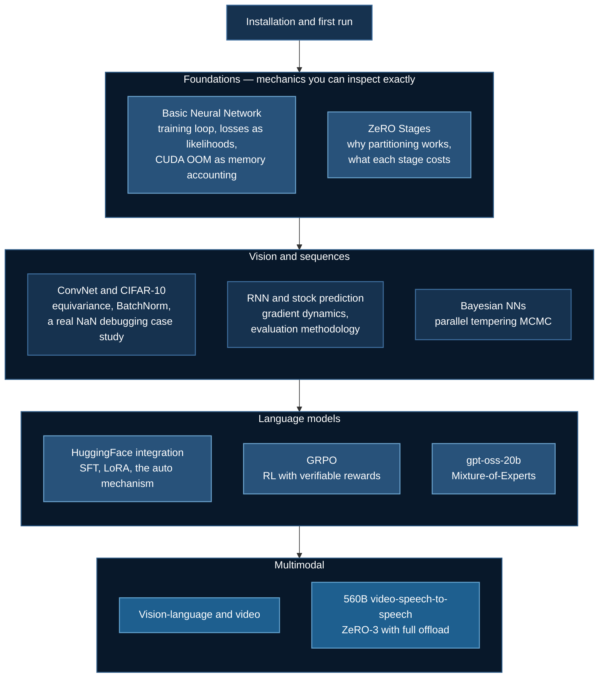

# DeepSpeed Course

**Author:** Yiqiao Yin · [LinkedIn](https://www.linkedin.com/in/yiqiaoyin/) · [YouTube](https://youtube.com/YiqiaoYin/) · [GitHub](https://github.com/yiqiao-yin/deepspeed-course)

Distributed deep learning with DeepSpeed — from a two-parameter linear model to a 560-billion-parameter omni-modal system, with the memory and communication arithmetic worked out at every step.

## Why This Exists

Adding GPUs to a data-parallel job gives you more throughput and **exactly the same model capacity**. Every device holds a bit-identical copy of the parameters, gradients, and optimizer states, so the largest model you can train is the largest that fits on one accelerator.

For mixed-precision Adam, that budget is

$$
M = \underbrace{2\Psi}_{\text{weights}} + \underbrace{2\Psi}_{\text{gradients}} + \underbrace{12\Psi}_{\text{optimizer states}} = 16\Psi \text{ bytes}
$$

A 7B model therefore needs **112 GB** of model states before a single activation is allocated — more than an 80 GB A100, for weights that are only 14 GB. Seven-eighths of that memory is bookkeeping, replicated $N$ times across your cluster for no reason.

DeepSpeed's ZeRO eliminates that redundancy. The first two stages do it at **zero additional communication cost**; the third makes model size scale with aggregate cluster memory rather than a single device. This course develops that arithmetic and then applies it, example by example.

## Two Ways to Read This

**As a course** — work through in order. Each example builds on the last, and the theory pages are referenced from the tutorials that need them.

**As a reference** — jump to the page for the problem you have. [Troubleshooting](/docs/reference/troubleshooting) is organized symptom-first; the [config reference](/docs/reference/deepspeed-config) is organized by config block.

## The Path



| Level | Pages |
|---|---|
| **Foundations** | [Basic Neural Network](/docs/tutorials/basic/neural-network) · [ZeRO Stages](/docs/getting-started/deepspeed-zero-stages) |
| **Vision** | [ConvNet](/docs/tutorials/basic/convnet) · [CIFAR-10](/docs/tutorials/basic/cifar10) |
| **Sequences** | [RNN / LSTM](/docs/tutorials/basic/rnn) · [Stock Prediction](/docs/tutorials/intermediate/stock-prediction) |
| **Probabilistic** | [Bayesian Neural Networks](/docs/tutorials/intermediate/bayesian-nn) |
| **Language models** | [HuggingFace Integration](/docs/tutorials/huggingface/overview) · [TRL Function Calling](/docs/tutorials/huggingface/trl-function-calling) · [GRPO](/docs/tutorials/huggingface/grpo-training) · [GPT-OSS](/docs/tutorials/huggingface/gpt-oss-finetuning) |
| **Multimodal** | [OCR Vision-Language](/docs/tutorials/huggingface/ocr-vision-language) · [Video-Text](/docs/tutorials/multimodal/video-text-training) · [Video-Speech](/docs/tutorials/multimodal/video-speech-training) |

## Start Here

### On a SLURM cluster (CoreWeave)

```bash
git clone https://github.com/yiqiao-yin/deepspeed-course.git
cd deepspeed-course/01_basic_neuralnet

sbatch run_deepspeed.sh
squeue -u $USER
tail -f logs/basic_nn_*.out
```

You SSH to a login node, which has **no GPUs**, and submit jobs to reach them. See [SLURM Deployment](/docs/guides/slurm-deployment) and [CoreWeave Setup](/docs/guides/coreweave-setup).

### On a single-tenant pod (RunPod)

```bash
git clone https://github.com/yiqiao-yin/deepspeed-course.git
cd deepspeed-course

uv venv myenv && source myenv/bin/activate
uv pip install torch deepspeed wandb

cd 01_basic_neuralnet
deepspeed --num_gpus=1 train_ds.py
```

GPUs are available immediately; the `#SBATCH` lines in the launcher scripts are inert comments. See [RunPod Setup](/docs/guides/runpod-setup).

Full setup, including the CUDA toolchain requirements that make DeepSpeed harder to install than a normal package: [Installation](/docs/getting-started/installation).

## Repository Layout

Each directory is self-contained — a training script, a `ds_config.json`, a launcher, and a README. You can run any one without touching the others.

```
deepspeed-course/
├── 01_basic_neuralnet/                       # Linear regression — the mechanics
├── 02_basic_convnet/                         # CNN on synthetic MNIST
├── 02_basic_convnet_cifar10_examples/        # CIFAR-10 — the 10% -> 81% case study
├── 03_basic_rnn/                             # LSTM time series
├── 04_bayesian_neuralnet/                    # Parallel tempering MCMC
├── 04_intermediate_rnn_stock_data/           # Real market data with yfinance
├── 05_huggingface/                           # LLM fine-tuning
├── 05_huggingface_trl/                       # TRL SFT for function calling
├── 05_huggingface_ocr/                       # Qwen2-VL vision-language
├── 06_huggingface_grpo/                      # GRPO on GSM8K
├── 07_huggingface_openai_gpt_oss_finetune_sft/  # gpt-oss-20b MoE LoRA
├── 07_huggingface_trl_multi_agency/          # Multi-agent GRPO (exploratory)
├── 08_vtt/                                   # Video-text training
└── 09_vss/                                   # LongCat-Flash-Omni 560B
```

## A Note on Honesty

Several examples in this repository are **infrastructure tests rather than trainable models** — the OCR example ships 10 synthetic samples, the video-text frame extractor returns the same image repeated, the multi-agent example trains against a reward its own docstring calls a dummy. Where that is the case, the corresponding page says so plainly and explains what you would change.

Validating a pipeline at small scale is genuinely most of the engineering work at these model sizes. But it is worth knowing which you are looking at.

## Reference

- [DeepSpeed Configuration](/docs/reference/deepspeed-config) — every key, and the combinations that are invalid
- [Troubleshooting](/docs/reference/troubleshooting) — symptom-first diagnosis
- [Hardware Requirements](/docs/guides/hardware-requirements) — sizing from parameter count

## Next Steps

- [Installation](/docs/getting-started/installation) — set up your environment
- [Quick Start](/docs/getting-started/quick-start) — run your first job and read its output
- [DeepSpeed ZeRO Stages](/docs/getting-started/deepspeed-zero-stages) — the theory the rest of the course rests on
