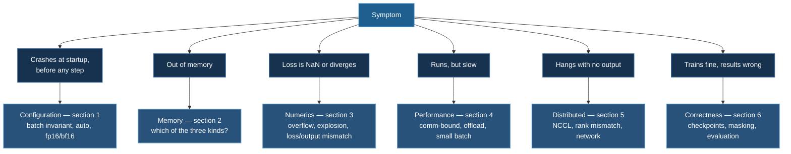

# Troubleshooting

Symptom-first diagnosis. Find your error message or behaviour, follow the reasoning, apply the fix.

:::tip Read the startup echo first
Before anything else: DeepSpeed prints the fully-resolved configuration at initialization, including everything `"auto"` became. A large fraction of "DeepSpeed is broken" turns out to be "DeepSpeed is running a different config than I thought." Compare that echo against your intent.
:::

## Quick Index



---

## 1. Startup Failures

### Batch size assertion

```
AssertionError: Check batch related parameters. train_batch_size is not equal
to micro_batch_per_gpu * gradient_acc_step * world_size
```

The [batch invariant](/docs/reference/deepspeed-config#2-batch-size) is violated:

$$
\texttt{train\_batch\_size} = \texttt{micro\_batch} \times \texttt{grad\_accum} \times N_{\text{gpus}}
$$

**By far the most common first-run failure**, and it happens because most example configs hard-code all three fields for a specific GPU count. Change `--num_gpus` and the arithmetic breaks.

**Fix:** specify only two of the three and let DeepSpeed derive the rest, or set all three to `"auto"` under HF `Trainer`.

### `"auto"` not resolving

```
TypeError: '<' not supported between instances of 'str' and 'int'
```

`"auto"` is a HuggingFace convention, resolved by `Trainer` from `TrainingArguments`. With raw `deepspeed.initialize` nothing resolves it. Either run under `Trainer`/TRL, or replace every `"auto"` with a literal.

### Both `fp16` and `bf16` enabled

Mutually exclusive. Enable exactly one, or neither (which means FP32).

### Missing optimizer

```
DeepSpeedConfigError: optimizer must be specified
```

Either add an `optimizer` block, or pass an optimizer object to `deepspeed.initialize(optimizer=...)`. Under `Trainer`, HF supplies one if the config omits the block.

### CUDA/PyTorch/DeepSpeed mismatch

```
RuntimeError: The detected CUDA version (12.1) mismatches the version that
was used to compile PyTorch (11.8)
```

DeepSpeed compiles CUDA extensions against your local toolkit, which must match what PyTorch was built with.

```bash
ds_report                                  # what DeepSpeed sees and can build
python -c "import torch; print(torch.version.cuda)"
nvcc --version
```

Align them, or install a PyTorch build matching your toolkit. See [Installation](/docs/getting-started/installation).

---

## 2. Out of Memory

**"Lower the batch size" is a reflex, not a diagnosis.** There are three distinct causes with three different fixes. The full treatment is the [OOM diagnosis flow](/docs/tutorials/basic/neural-network#9-cuda-out-of-memory-a-memory-accounting-treatment); this is the short version.

| When it happens | Cause | Fix |
|---|---|---|
| **First forward pass** | Model states — $16\Psi$ does not fit | LoRA, ZeRO 2/3, offload, more GPUs. Batch size is irrelevant |
| Scales with batch or sequence length | Activations | Gradient checkpointing, lower micro-batch, raise accumulation, shorter sequences |
| **After many successful steps** | Fragmentation or a leak | `contiguous_gradients`, `expandable_segments`, check for retained graphs |

### Reading the message

```
CUDA out of memory. Tried to allocate 2.00 GiB
(GPU 0; 39.59 GiB total capacity; 32.14 GiB already allocated;
 1.21 GiB free; 36.88 GiB reserved in total by PyTorch)
```

If **reserved − allocated** exceeds the failed request (here 4.74 GiB > 2 GiB), memory exists but is **fragmented** — no single contiguous block is large enough.

```bash
export PYTORCH_CUDA_ALLOC_CONF=expandable_segments:True
```

### OOM at step 200, not step 1

Two classic causes:

**Retained autograd graph.** `total_loss += loss` keeps the whole graph — and every activation in it — alive across iterations. Use `loss.item()` or `loss.detach()`.

**Variable shapes.** Varying sequence lengths accumulate mismatched cached blocks. Bucket or pad to fixed lengths.

### OOM with `overlap_comm` enabled

`overlap_comm: true` allocates communication buffers roughly 4.5× `reduce_bucket_size`. At `2e8` that is substantial. Lower the bucket sizes rather than disabling overlap:

```json
{ "zero_optimization": { "reduce_bucket_size": 5e7, "allgather_bucket_size": 5e7 } }
```

### OOM at Stage 3 specifically

Lower `stage3_max_live_parameters` — the ceiling on simultaneously-materialized parameters, and the primary Stage-3 memory control. Then `stage3_prefetch_bucket_size`. Then `sub_group_size` if the optimizer step itself is what OOMs.

### Host RAM exhausted / machine unresponsive

With CPU offload, budget $\approx 12\Psi$ bytes of host RAM for Adam states — ~84 GB for a 7B model. Exceed it and the host swaps; throughput does not degrade, it stops.

```bash
free -g
watch -n 5 free -g
```

Reduce `buffer_count`, or move to NVMe offload (local disk only).

---

## 3. NaN, Divergence, and Loss Behaviour

### Loss is NaN from step 1

Usually not numerical — usually structural.

1. **All labels masked.** With completion-only loss masking, if the response template fails to match, every label is `-100` and the loss is `0/0`. [Verify the mask](/docs/tutorials/huggingface/trl-function-calling#4-completion-only-loss-masking).
2. **NaN in the data.** `assert torch.isfinite(batch["input_ids"]).all()`.
3. **Unfused softmax/cross-entropy in FP16.** Use `nn.CrossEntropyLoss` on logits, never `log(softmax(z))`.

### Loss decreases then goes NaN

Gradient explosion or FP16 overflow, often both — see the [CIFAR-10 case study](/docs/tutorials/basic/cifar10#3-the-failure), where Adam squaring a gradient of ~1000 exceeded the FP16 maximum of 65,504.

```json
{ "gradient_clipping": 1.0, "bf16": { "enabled": true }, "fp16": { "enabled": false } }
```

If BF16 is unavailable, lower the learning rate and add clipping. Add normalization layers if the architecture lacks them.

### Persistent `OVERFLOW! Skipping step`

```
[deepspeed] OVERFLOW! Rank 0 Skipping step. Reducing loss scale to 32768.0
```

In the **first few dozen steps this is normal** — the dynamic loss scaler calibrating. Persisting beyond that means gradients are genuinely too large. Lower the LR, add clipping, or switch to BF16. Raising `initial_scale_power` treats the symptom.

### Loss not decreasing

Work in this order:

1. **Can the model overfit a single batch to near-zero loss?** If not, the bug is in the model or data pipeline, not the optimizer. This isolates more than any other test.
2. **Is the initial loss right?** A $K$-class classifier should start at $-\log(1/K) = \ln K$ — 2.3026 for 10 classes. A very different value means broken initialization, labels, or loss.
3. Sweep the learning rate logarithmically, $10^{-2}$ to $10^{-5}$.
4. Are inputs standardized? This is a [conditioning](/docs/tutorials/basic/neural-network#7-linear-regression-as-a-neural-network) issue.
5. Does the loss match the output layer? [MSE on a sigmoid output](/docs/tutorials/basic/neural-network#31-mean-squared-error) barely learns.

### Gradients exploding (RNNs)

Structural for recurrent models — the Jacobian product is a matrix *power*. See the [gradient analysis](/docs/tutorials/basic/rnn#mathematical-analysis).

- `"gradient_clipping": 1.0` — mandatory, not optional
- Orthogonal initialization for `weight_hh`
- Prefer LSTM/GRU over vanilla RNN; prefer `tanh` over `relu` recurrence
- Truncate BPTT

---

## 4. Performance

### Throughput collapses on moving to Stage 3

Expected if per-GPU batch is small. Stage 3 costs [$3\Psi$ versus $2\Psi$](/docs/getting-started/deepspeed-zero-stages#43-stage-3-costs-15) and its communication sits on the critical path of forward and backward, so it can only hide behind compute if there is enough compute.

**Raise the micro-batch before blaming the stage.** If you cannot, you are in the regime ZeRO++ was built for; consider tensor parallelism within a node instead.

### Slow with CPU offload

Inherent — every optimizer step crosses PCIe. Check:

- `pin_memory: true` (enables DMA; large effect)
- Offload is going to RAM, not a swap file (`free -g`)
- `round_robin_gradients: true` for Stage 1/2 with offload

### Diagnosing where time goes

```json
{ "wall_clock_breakdown": true, "flops_profiler": { "enabled": true, "profile_step": 10 } }
```

`wall_clock_breakdown` splits forward/backward/step. `flops_profiler` reports achieved FLOPS and per-module cost. For communication specifically:

```json
{ "comms_logger": { "enabled": true, "verbose": false, "prof_all": true } }
```

Low GPU utilization in `nvidia-smi` with high communication time means you are comm-bound: larger batch, fewer GPUs, or a lower ZeRO stage.

### Slow data loading

If GPU utilization oscillates between 0% and 100%, the bottleneck is the input pipeline, not the model. Raise `dataloader_num_workers`, enable `pin_memory`, and pre-tokenize offline.

### `cudnn.benchmark` for CNNs

```python
torch.backends.cudnn.benchmark = True
```

5–20% on convolutional models with **fixed** input shapes. With varying shapes it re-benchmarks constantly and is a net loss.

---

## 5. Distributed and Multi-GPU

### NCCL errors

```
NCCL error: unhandled system error
RuntimeError: NCCL communicator was aborted
```

Diagnose first:

```bash
export NCCL_DEBUG=INFO      # verbose; shows which transport is selected
```

Common causes and fixes:

```bash
export NCCL_P2P_DISABLE=1     # peer-to-peer unsupported (some consumer/virtualized setups)
export NCCL_IB_DISABLE=1      # InfiniBand present but misconfigured
export NCCL_SOCKET_IFNAME=eth0  # multiple interfaces; pin the right one
```

`NCCL_SOCKET_IFNAME` is frequently the answer on multi-homed cloud nodes, where NCCL otherwise picks an interface with no route between nodes.

### Hangs at initialization

A hang with no output is almost always a **collective mismatch**: one rank is waiting for an operation another rank never issues.

- **Rank count mismatch** — `--num_gpus` disagrees with what is visible. Check `CUDA_VISIBLE_DEVICES`.
- **Conditional collectives** — code where only some ranks call an all-reduce. Every rank must execute the same collective sequence, so anything inside `if rank == 0:` must not contain one.
- **Uneven data** — one rank exhausts its shard early and stops participating. Use `drop_last=True`.
- **Blocked port** — the master port is in use or firewalled. Change `--master_port`.

```bash
export TORCH_DISTRIBUTED_DEBUG=DETAIL     # reports which collective mismatched
```

### GPUs not detected

```bash
nvidia-smi
echo $CUDA_VISIBLE_DEVICES
python -c "import torch; print(torch.cuda.device_count())"
```

On SLURM, GPUs are only visible on compute nodes — a login node will show none. See [SLURM Deployment](/docs/guides/slurm-deployment).

### Multi-node launch fails

DeepSpeed's launcher reaches other nodes over SSH and needs a hostfile plus passwordless SSH between compute nodes. Under SLURM, generate the hostfile from the allocation rather than hard-coding it — see the [multi-node section](/docs/guides/slurm-deployment#6-multi-node-training).

---

## 6. Correctness

### Stage-3 checkpoint will not load

Set `stage3_gather_16bit_weights_on_model_save: true`, or consolidate:

```bash
python zero_to_fp32.py . pytorch_model.bin
```

Under LoRA, save adapters with `model.save_pretrained()` instead.

### Model outputs garbage after fine-tuning

- **Chat template mismatch** between training and inference. Print `apply_chat_template` output in both and diff them.
- **Loss masking wrong** — the model learned to reproduce prompts.
- **Wrong pad token**, or padded positions not masked out of the loss.

### Tokenizer has no pad token

```python
if tokenizer.pad_token is None:
    tokenizer.pad_token = tokenizer.eos_token
```

Common for decoder-only models. Ensure padded positions are excluded from the loss, or the model learns to emit padding.

### Metrics look good, task performance does not

You are probably reading the wrong metric. Cross-entropy is what you optimize, not what you care about:

| Task | Report |
|---|---|
| Classification | Accuracy, F1, **calibration** |
| OCR / transcription | Character or word error rate |
| Structured extraction | Field-level exact match |
| Time series | RMSE **and** [Theil U vs persistence](/docs/tutorials/intermediate/stock-prediction#the-other-thing-missing-a-baseline) |
| Speech generation | WER via ASR, plus MOS or a learned proxy |
| RL | Held-out accuracy, not training reward |

### Results too good to be true

Suspect data leakage. For time series the classic is [fitting the scaler before the split](/docs/tutorials/intermediate/stock-prediction#5-the-bug-scaler-fitted-before-the-split). In general: any transform fitted on data that includes the test set.

### Non-deterministic results

```python
import torch, random, numpy as np
torch.manual_seed(42); random.seed(42); np.random.seed(42)
torch.use_deterministic_algorithms(True)
```

Full determinism is not achievable in distributed training — floating-point reduction order varies with the number of ranks — so results will differ slightly across GPU counts even with a fixed seed. That is expected, not a bug.

---

## 7. Debugging Toolkit

```bash
ds_report                                  # environment, available ops, compatibility
export NCCL_DEBUG=INFO                     # collective transport and errors
export TORCH_DISTRIBUTED_DEBUG=DETAIL      # collective mismatch detection
export PYTORCH_CUDA_ALLOC_CONF=expandable_segments:True
export CUDA_LAUNCH_BLOCKING=1              # synchronous errors — slow, but points at the real line
```

```python
# Where the memory went
print(torch.cuda.memory_summary())
print(f"allocated {torch.cuda.memory_allocated()/1e9:.2f} GB")
print(f"reserved  {torch.cuda.memory_reserved()/1e9:.2f} GB")

# Gradient norms — the earliest warning of instability
total = sum(p.grad.data.norm(2).item() ** 2
            for p in model.parameters() if p.grad is not None) ** 0.5
print(f"grad norm {total:.4f}")

# Confirm what LoRA is actually training
model.print_trainable_parameters()
```

```json
{ "steps_per_print": 1, "wall_clock_breakdown": true, "memory_breakdown": true }
```

:::tip `CUDA_LAUNCH_BLOCKING=1` when a stack trace makes no sense
CUDA kernels launch asynchronously, so an error surfaces at whatever line happens to synchronize next — often far from the real cause. Setting this makes launches synchronous, so the traceback points at the actual kernel. Slow, but it turns an incomprehensible trace into an obvious one.
:::

## 8. Getting Help

Before opening an issue, collect:

1. `ds_report` output
2. Your full `ds_config.json`
3. The launch command, including `--num_gpus`
4. The complete traceback, not just the last line
5. `nvidia-smi` output
6. Versions: `torch`, `deepspeed`, `transformers`, CUDA

- [DeepSpeed GitHub issues](https://github.com/microsoft/DeepSpeed/issues)
- [DeepSpeed documentation](https://www.deepspeed.ai/)
- [HuggingFace forums](https://discuss.huggingface.co/)

## Next Steps

- [DeepSpeed Config Reference](/docs/reference/deepspeed-config) — every key, and invalid combinations
- [ZeRO Stages](/docs/getting-started/deepspeed-zero-stages) — the memory and communication theory
- [Hardware Requirements](/docs/guides/hardware-requirements) — sizing before you hit these errors
