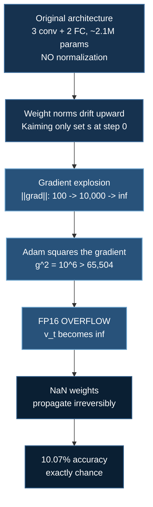
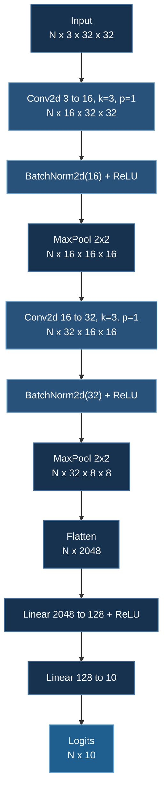

# CIFAR-10 CNN

A CNN on real image data — and, more usefully, a documented **failure-and-recovery case study**: a run that produced `NaN` and 10.07% accuracy (exactly chance on 10 classes), diagnosed to root cause, and repaired to 81.07%.

:::info Why this page is structured around a bug
Most tutorials show the configuration that works. This example is more valuable for the configuration that *didn't*, because the failure was overdetermined — gradient explosion, FP16 overflow, and an unnormalized architecture reinforcing each other — and untangling it exercises exactly the diagnostic skills that transfer to larger runs. The full engineering log is in `02_basic_convnet_cifar10_examples/MODEL_IMPROVEMENT_STRATEGY.md`.

This page assumes [Basic ConvNet](/docs/tutorials/basic/convnet) for the convolution and BatchNorm mechanics.
:::

## 1. The Task

CIFAR-10 (Krizhevsky, 2009): 60,000 32×32 RGB images in 10 mutually exclusive classes — 50,000 train, 10,000 test.

It is a deceptively hard benchmark for its size. At 32×32 the images are small enough that a modest CNN trains in minutes, but the classes contain real intra-class variation (pose, lighting, occlusion) and genuinely confusable pairs — cat/dog, automobile/truck, deer/horse. Chance is 10%; a linear classifier on raw pixels reaches ~40%; a small CNN reaches 70–85%; heavily-tuned modern architectures exceed 99%.

| | |
|---|---|
| Images | 60,000 (50,000 train / 10,000 test) |
| Resolution | 32×32×3 |
| Classes | airplane, automobile, bird, cat, deer, dog, frog, horse, ship, truck |
| Chance accuracy | 10% |
| This example | **81.07%** |

## 2. Quick Start

```bash
cd 02_basic_convnet_cifar10_examples

# SLURM (CoreWeave / HPC) — the batch script requests 2 GPUs
sbatch run_deepspeed.sh

# Direct execution (RunPod / single pod)
deepspeed --num_gpus=2 cifar10_deepspeed.py
```

CIFAR-10 downloads automatically on first run (~170 MB).

## 3. The Failure

The first version of this example did not train. It produced:

```
Epoch 1:  ||grad|| = 100
Epoch 5:  ||grad|| = 10,000
Epoch 10: ||grad|| = inf
...
Loss: nan | Accuracy: 10.07%
```

**10.07% on 10 balanced classes is precisely chance.** That number is diagnostically valuable: it means the model is not making weak predictions, it is making *no* predictions. Once weights contain `NaN`, every logit is `NaN`, `argmax` returns a constant index, and accuracy pins to the base rate. Distinguish this from a model stuck at 15–20%, which is learning something and is a different class of problem.

Three causes compounded.

### 3.1 Gradient explosion

From the [backpropagation analysis](/docs/tutorials/basic/neural-network#42-the-algorithm), the gradient reaching layer 1 is a product of per-layer Jacobians:

$$
\left\|\frac{\partial\mathcal{L}}{\partial\mathbf{W}^{[1]}}\right\| \;\sim\; \prod_{\ell=2}^{L}\left\|\mathbf{W}^{[\ell]\top}\mathbf{D}^{[\ell]}\right\|
$$

If the typical factor is $s$, the norm scales as $s^{L}$. At $s = 1.5$ over 5 layers that is $7.6\times$ per backward pass — and because each step's update *increases* the weight norms, $s$ itself grows. The divergence is super-exponential, which is why the norm went from $10^2$ to $10^4$ to `inf` in ten epochs.

The original architecture — three conv layers (32→64→64) plus two FC layers, ~2.1M parameters, **no normalization** — had nothing to hold $s$ near 1.

### 3.2 FP16 overflow

FP16's maximum finite value is **65,504**. The optimizer state is where this bites:

$$
\|\mathbf{g}\| \approx 1000 \;\Longrightarrow\; g^2 \approx 10^{6} \;\gg\; 65{,}504 \;\Longrightarrow\; \texttt{inf}
$$

Adam's second moment $\mathbf{v}_t = \beta_2\mathbf{v}_{t-1} + (1-\beta_2)\mathbf{g}_t^{\odot 2}$ **squares the gradient**. A gradient norm of 1000 is large but finite and recoverable; its square is not representable. Once $\mathbf{v}$ holds `inf`, the update $\hat{\mathbf m}/(\sqrt{\hat{\mathbf v}} + \epsilon)$ becomes $\text{finite}/\infty = 0$ or, if $\mathbf m$ also overflowed, $\infty/\infty = $ `NaN`, which then propagates into the weights and never leaves.

:::note This is precisely what dynamic loss scaling cannot fix
[Loss scaling](/docs/tutorials/basic/neural-network#85-fp16-and-dynamic-loss-scaling) protects against gradient *underflow* by multiplying the loss upward. Here the problem is **overflow** — the scaler responds by repeatedly halving the scale and skipping steps, so you see a stream of `OVERFLOW! Skipping step` and no progress. Persistent overflow past the first few dozen steps is not the scaler calibrating; it is a signal that the gradients are genuinely too large, and the fix belongs upstream.
:::

### 3.3 Depth without stabilization

Kaiming initialization sets $s \approx 1$ **at step zero only**. It says nothing about step 5,000. Without a mechanism that actively re-normalizes activations during training, weight norms drift and $s$ drifts with them. Initialization is a starting condition, not a control loop.



## 4. The Fix

Partial measures were tried first and are instructive because they **were not sufficient**: gradient clipping alone, disabling FP16 alone, and lowering the learning rate alone each improved matters without producing a trainable run. The failure had three reinforcing causes, so it needed a change on each axis.

### 4.1 Add BatchNorm — the load-bearing change

```python
self.conv1 = nn.Conv2d(3, 16, kernel_size=3, stride=1, padding=1)
self.bn1   = nn.BatchNorm2d(16)
self.pool  = nn.MaxPool2d(kernel_size=2, stride=2)
self.conv2 = nn.Conv2d(16, 32, kernel_size=3, stride=1, padding=1)
self.bn2   = nn.BatchNorm2d(32)
self.fc1   = nn.Linear(32 * 8 * 8, 128)
self.fc2   = nn.Linear(128, 10)
```

BatchNorm re-standardizes activations to zero mean and unit variance **at every forward pass**, so it is the control loop that initialization is not. It also bounds the layer's effective Jacobian: scaling $\mathbf{W}$ by $\alpha$ leaves the normalized output unchanged, which makes the layer's gradient **scale-invariant** in its weights and removes the runaway feedback of §3.1 at its source.

Per [Santurkar et al. (2018)](/docs/tutorials/basic/convnet#batch-normalization), the mechanism is landscape smoothing rather than reduced covariate shift — but either way the empirical effect here is decisive.

### 4.2 Switch Adam → SGD with momentum

```json
{
  "optimizer": {
    "type": "SGD",
    "params": { "lr": 0.01, "momentum": 0.9 }
  }
}
```

Two reasons, one numerical and one about generalization.

**Numerically**, SGD with momentum never squares the gradient. It removes the $g^2$ overflow path of §3.2 entirely, and it drops optimizer state from $K=12$ bytes per parameter to $K=4$.

**For generalization**, adaptive methods are known to find solutions that generalize worse than SGD on image classification (Wilson et al., 2017). Essentially every state-of-the-art CIFAR/ImageNet result uses SGD with momentum, not Adam. The reflex "Adam is the safe default" is correct for transformers and wrong here.

### 4.3 Disable FP16

```json
{ "fp16": { "enabled": false } }
```

:::danger Do not "enable FP16 to speed this up"
This is the trap the earlier version of this page fell into — it listed *"Slow Training → Enable FP16"* under troubleshooting, which reintroduces the exact failure the example was built to fix.

At ~208K parameters this model is not memory-constrained and FP16 buys almost nothing, while re-exposing the overflow path. If you want reduced precision here, use **BF16** (`"bf16": {"enabled": true}`) on Ampere or newer: it carries FP32's exponent range, so $g^2 = 10^6$ is representable and the overflow cannot occur. FP16 is the wrong tool for a numerically fragile run.
:::

### 4.4 Conservative initialization and clipping

```python
nn.init.kaiming_normal_(m.weight, mode="fan_out", nonlinearity="relu")
# ...for Linear layers, an extra safety factor:
m.weight.data.mul_(0.5)
```

```json
{ "gradient_clipping": 1.0 }
```

The extra $0.5$ on FC weights is a belt-and-braces measure that lowers the starting $s$; it costs a little early progress and is not strictly required once BatchNorm is present. Gradient clipping rescales whenever $\|\mathbf{g}\|_2 > 1$, providing a hard ceiling regardless of what the architecture does. It is cheap insurance and should be on by default.

### 4.5 Summary of the change set

| Axis | Before | After | Attacks |
|---|---|---|---|
| Architecture | 3 conv + 2 FC, 2.1M params, no norm | 2 conv + 2 FC, **BatchNorm**, ~208K params | Gradient explosion at source |
| Optimizer | Adam | **SGD + momentum 0.9** | The $g^2$ overflow path |
| Precision | FP16 | **FP32** (or BF16) | Representable range |
| Init | Kaiming | Kaiming + 0.5 on FC | Initial scale |
| Clipping | none | **`gradient_clipping: 1.0`** | Hard ceiling |

## 5. The Working Configuration

This is the configuration in the repository — `02_basic_convnet_cifar10_examples/ds_config.json`, verbatim:

```json
{
  "train_micro_batch_size_per_gpu": 32,
  "gradient_accumulation_steps": 1,
  "optimizer": {
    "type": "SGD",
    "params": {
      "lr": 0.01,
      "momentum": 0.9,
      "weight_decay": 5e-4
    }
  },
  "gradient_clipping": 1.0,
  "fp16": {
    "enabled": false
  }
}
```

:::tip Note what is *absent*: `train_batch_size`
The config previously hard-coded `train_batch_size: 32`, which only satisfies
the invariant on **one** GPU — while `run_deepspeed.sh` requests two, so the run
aborted at startup with `AssertionError: Check batch related parameters`.

Omitting the field is the portable form: DeepSpeed derives it as
$\texttt{micro\_batch} \times \texttt{grad\_accum} \times N_{\text{gpus}}$, so the same config
works at any `--num_gpus` (32 on one GPU, 64 on two). `tests/test_ds_configs.py`
now checks this invariant against each launcher's actual `--num_gpus` across
every config in the repository.

Weight decay of $5\times10^{-4}$ has also been added — see §7.
:::

### Architecture and dimensions



| Layer | Output shape | Parameters |
|---|---|---|
| Conv1 (3→16, 3×3) | $[N, 16, 32, 32]$ | $16(3\cdot3\cdot3 + 1) = 448$ |
| BatchNorm1 | $[N, 16, 32, 32]$ | $32$ |
| Pool1 | $[N, 16, 16, 16]$ | 0 |
| Conv2 (16→32, 3×3) | $[N, 32, 16, 16]$ | $32(16\cdot3\cdot3+1) = 4{,}640$ |
| BatchNorm2 | $[N, 32, 16, 16]$ | $64$ |
| Pool2 | $[N, 32, 8, 8]$ | 0 |
| FC1 (2048→128) | $[N, 128]$ | $262{,}272$ |
| FC2 (128→10) | $[N, 10]$ | $1{,}290$ |
| **Total** | | **≈ 268,700** |

Note where the parameters are: **97.6% sit in FC1**, a single dense layer, while the convolutional layers that do the actual feature extraction hold under 2%. This is the classic pre-2014 CNN shape, and it is why modern architectures replace the flatten-then-dense head with **global average pooling** — which would reduce FC1's 262K parameters to zero and typically generalizes better.

### Data augmentation

```python
transform_train = transforms.Compose([
    transforms.RandomCrop(32, padding=4),
    transforms.RandomHorizontalFlip(),
    transforms.ToTensor(),
    transforms.Normalize((0.4914, 0.4822, 0.4465),
                         (0.2023, 0.1994, 0.2010)),
])
```

Each transform encodes a claim about label invariance:

- **RandomCrop(32, padding=4)** — pad to 40×40, crop back to 32×32, giving a shift of up to ±4 pixels. Asserts translation invariance, and, per [the shift-invariance caveat](/docs/tutorials/basic/convnet#why-convolution-and-not-some-other-local-operator), supplies by data what strided pooling fails to guarantee architecturally.
- **RandomHorizontalFlip** — asserts mirror invariance. Valid for CIFAR-10's object classes. **It would be wrong for text or digits**, where a mirrored 'b' is a 'd'; augmentation choices are dataset-specific assertions, not universal defaults.
- **Normalize** — the per-channel means and standard deviations *of CIFAR-10 itself*. Same conditioning argument as everywhere else in this course.

Test-time transforms deliberately omit crop and flip: augmentation is a training-time regularizer, and applying it at evaluation makes your metric noisy and optimistically biased.

### Schedule and stopping

```python
initial_lr    = 0.01
warmup_epochs = 5
total_epochs  = 50
patience_limit = 15
```

Linear warmup for 5 epochs, then cosine decay (Loshchilov & Hutter, 2017):

$$
\eta(t) = \begin{cases}
\eta_0\,\dfrac{t+1}{T_{\text{warm}}} & t < T_{\text{warm}} \\[10pt]
\eta_0\cdot\tfrac{1}{2}\left(1 + \cos\left(\pi\,\dfrac{t - T_{\text{warm}}}{T_{\text{total}} - T_{\text{warm}}}\right)\right) & \text{otherwise}
\end{cases}
$$

Warmup matters here specifically because of BatchNorm: its running statistics are meaningless for the first few hundred steps, so a full-size step early is taken on the basis of badly-estimated normalization.

## 6. Results

```
📚 Epoch  0/50 — Learning Rate: 2.000000e-03
   Step 0   | Loss: 2.302585 | Acc: 10.00% | Grad Norm: 0.450
   Step 100 | Loss: 1.856432 | Acc: 28.12% | Grad Norm: 0.623
📈 Epoch 0 Summary:  Avg Loss 1.722649 | Accuracy 37.47% | Avg Grad Norm 2.450

📈 Epoch 25 Summary: Avg Loss 0.685432 | Accuracy 75.23% | Avg Grad Norm 4.123

📈 Epoch 49 Summary: Avg Loss 0.542771 | Accuracy 81.07% | Avg Grad Norm 3.993
```

| Metric | Value |
|---|---|
| Final accuracy | **81.07%** |
| Loss reduction | 1.72 → 0.54 (68%) |
| Epochs | 50 (early-stopping patience 15) |
| Gradient norm | 0.45 → ~4, **finite and stable throughout** |

Two things to read here.

**The step-0 loss is 2.302585, and that is exactly right.** A correctly-initialized 10-class classifier should predict uniformly, giving $-\log(1/10) = \ln 10 = 2.302585$. This is the single best sanity check available at the start of a classification run: if your initial loss is far from $\ln K$, the bug is in initialization, label encoding, or the loss function — before a single step has been taken.

**Gradient norms settle around 4 and stay there.** Compare to the broken run's $10^2 \to 10^4 \to \infty$. Logging $\|\mathbf{g}\|_2$ every epoch costs nothing and is the earliest available warning of the §3 failure mode:

```python
total_norm = 0.0
for p in model_engine.module.parameters():
    if p.grad is not None:
        total_norm += p.grad.data.norm(2).item() ** 2
total_norm = total_norm ** 0.5
```

## 7. Getting Past 81%

81% comes from a ~269K-parameter network with no residual connections. The gap to the ~96% a ResNet-18 reaches on CIFAR-10 is architectural, and closing it means changing the model rather than the schedule.

| Change | Expected gain | Why |
|---|---|---|
| Global average pooling instead of flatten+FC1 | +1–3% | Removes 262K parameters (97% of the model) from a layer that mostly memorizes |
| A third conv block (32→64) | +3–5% | Receptive field currently covers only part of a 32×32 image |
| Residual connections | +5–8% | Enables real depth; see [the degradation problem](/docs/tutorials/basic/convnet#where-this-architecture-sits) |
| Cutout / random erasing | +1–2% | Forces reliance on multiple cues rather than one discriminative patch |
| Mixup | +1–2% | Convex combinations of inputs *and* labels; strong regularizer |
| Label smoothing ($\varepsilon = 0.1$) | +0.5–1% | Bounds the logit gap, improves calibration |
| Weight decay $5\times10^{-4}$ | +1–2% | **Not currently set in `ds_config.json`** — standard for CIFAR SGD recipes |
| Longer schedule (200 epochs) | +2–4% | 50 epochs under-trains a cosine schedule |

:::tip The highest-value single change
Add weight decay. The current config has none, and $5\times10^{-4}$ with SGD+momentum is the standard CIFAR-10 recipe — a one-line change:

```json
"optimizer": {
  "type": "SGD",
  "params": { "lr": 0.01, "momentum": 0.9, "weight_decay": 5e-4 }
}
```

One caveat worth knowing: weight decay applied to BatchNorm's $\gamma$ and $\beta$ parameters is generally counterproductive, since BatchNorm makes the preceding layer scale-invariant and decaying $\gamma$ interacts with the effective learning rate in unintuitive ways. Production recipes exclude norm parameters and biases from decay via optimizer parameter groups.
:::

## 7a. Measured: three modern architectures

The table above is a list of *expected* gains. This section is what the
repository actually observed when those changes were implemented and run.

`02_basic_convnet_cifar10_examples/train_modern_cifar10.py` trains three
architectures on the same DeepSpeed setup, changing only the model and the
recipe:

```bash
cd 02_basic_convnet_cifar10_examples
uv sync
uv run train_modern_cifar10.py --list-models          # no GPU needed
deepspeed --num_gpus=2 train_modern_cifar10.py --model cifarnet --epochs 64
```

### Results

Rented **2× RTX 3090** on RunPod, torch 2.8.0+cu128, **16 epochs**, batch 256
per GPU, `flip=alternating translate=4 cutout=12`, label smoothing 0.2,
SGD + Nesterov with warmup then cosine decay to zero:

| Model | Params | Test accuracy | With mirror TTA | Wall clock |
|---|---:|---:|---:|---:|
| baseline `cifar10_deepspeed.py` | 269K | 81.07% | — | — |
| `resnet9` | 6.6M | 92.93% | 93.18% | 142 s |
| `cifarnet` | 6.1M | **93.32%** | **93.75%** | 128 s |
| `wrn_16_8` | 11.0M | 93.09% | 93.22% | 302 s |

:::warning 16 epochs is not a converged run
These are the numbers this repository measured, not the numbers the papers
report. Published results for these designs are 94–96%; the remaining gap is
**training budget, not architecture**. Raise `--epochs` to close it — the table
above is what fits in roughly two minutes per model on two consumer cards.

A published accuracy nobody ran is worse than no accuracy at all, because a
reader compares against it to decide whether their own run worked. See
[CONTRIBUTING.md](/docs/contributing).
:::

### The ordering is the lesson

`cifarnet` has the **fewest parameters** and the **shortest runtime**, and
wins. `wrn_16_8` carries 80% more parameters than `resnet9`, takes twice as
long, and finishes within a tenth of a point of it.

At this budget capacity is not the binding constraint, which is the same
conclusion the [mean-reversion page](/docs/tutorials/intermediate/mean-reversion-forecasting)
reaches from the opposite direction — there, more parameters were monotonically
*worse*.

### What actually buys the accuracy

Ordered by contribution, which is not the order most people would guess:

1. **Augmentation** — `flip + translate + cutout`. The baseline uses none, and
   this is worth more than the architecture change.
2. **Schedule** — warmup then cosine decay **to zero**, not a fixed LR.
3. **Label smoothing** ($\varepsilon = 0.2$), paired with logit scaling.
4. **Test-time augmentation** — averaging an image with its mirror measured
   **+0.13 to +0.43 points** for one extra forward pass.
5. **The architecture**, last.

Copy only the architecture and keep the baseline's augmentation, and the number
will not move.

### The models

| Model | Source | What is unusual about it |
|---|---|---|
| `resnet9` | fast-CIFAR lineage | Nothing — the recognisable residual net, included as the familiar reference point. |
| `cifarnet` | [arXiv:2404.00498](https://arxiv.org/abs/2404.00498) | First layer is a **frozen** 2×2 conv initialised from the eigenvectors of training-image patches — a whitening transform, not learned features. BatchNorm scales are frozen at 1; only biases train. |
| `wrn_16_8` | [arXiv:1605.07146](https://arxiv.org/abs/1605.07146) | Wide ResNet: wider, not deeper. |

The whitening initialisation is the one worth understanding. Measured on
correlated inputs, it drops the off-diagonal/diagonal covariance ratio of the
first layer's outputs from **0.28 to 0.000002** versus random init — the
network starts with a decorrelated representation instead of learning one.
`tests/test_modern_cifar.py` asserts that, because a "whitening" layer that
does not whiten is just a frozen random projection, which is strictly worse
than a learned one and fails silently.

:::note What is deliberately not reproduced
The speedruns these architectures come from reach 94% in **2.6 seconds** using
a custom optimizer (Muon), GPU-resident pre-decoded data and a hand-tuned fp16
schedule. This folder trains with DeepSpeed, so the optimizer comes from
`ds_config_modern.json`. The architecture and recipe transfer; the wall clock
does not, and quoting speedrun timings from a DeepSpeed run would be exactly
the fabricated number the warning above is about.
:::

### Verify it yourself

```bash
uv run tests/test_modern_cifar.py                  # 33 property checks, no GPU
bash tests/gpu/verify_02_modern_cifar.sh 2 64      # 2 GPUs, 64 epochs
```

## 8. DeepSpeed Notes

At ~269K parameters, model states are $16\Psi \approx 4.3$ MB — irrelevant. **This example is not memory-constrained**, so ZeRO stages buy nothing measurable here and the config correctly omits `zero_optimization`. The example exists to show the training mechanics on real data, not to demonstrate memory optimization.

Two things that *would* matter at scale, both covered in [ZeRO Stages](/docs/getting-started/deepspeed-zero-stages) and the [ConvNet compute section](/docs/tutorials/basic/convnet#computational-cost-where-cnn-training-actually-spends-resources):

- CNN memory is dominated by **activations**, not model states, so activation checkpointing beats ZeRO-3 for vision models.
- **BatchNorm computes statistics per-GPU.** At `train_micro_batch_size_per_gpu: 32` that is fine. Push the micro-batch to 2–4 to fit a larger model and the batch statistics become too noisy to be useful — at which point you need `SyncBatchNorm` or GroupNorm. Gradient accumulation does not help, because it accumulates gradients rather than statistics.

## 9. Troubleshooting

**Accuracy pinned at exactly 10%.** Not a tuning problem — the model is producing constant output. Check for `NaN` in the loss, then work through §3. Verify the step-0 loss is $\approx 2.3026$.

**`NaN` loss.** Confirm `fp16.enabled` is `false` (or use BF16), that `gradient_clipping` is set, and that BatchNorm layers are present.

**Batch-size assertion at startup.** The §5 warning — reconcile the config with `--num_gpus`.

**Accuracy plateaus at 60–70%.** Expected for this architecture without weight decay. See §7; start with weight decay and a longer schedule.

**Training accuracy ≫ test accuracy.** Overfitting: 269K parameters on 50K images with only crop and flip. Add weight decay, then Cutout or Mixup.

**Gradient norms climbing steadily.** The early-warning signal from §6. Lower the learning rate or tighten clipping before it becomes `inf`.

## Next Steps

- [Basic ConvNet](/docs/tutorials/basic/convnet) — convolution, BatchNorm, and receptive fields in depth
- [Basic RNN](/docs/tutorials/basic/rnn) — sequence modelling, where the same Jacobian-product instability returns
- [DeepSpeed ZeRO Stages](/docs/getting-started/deepspeed-zero-stages) — when model states *do* become the constraint

## References

1. Krizhevsky, A. (2009). *Learning Multiple Layers of Features from Tiny Images*. Technical report, University of Toronto. — the CIFAR-10 dataset.
2. Ioffe, S., & Szegedy, C. (2015). Batch Normalization. *ICML 2015*. [arXiv:1502.03167](https://arxiv.org/abs/1502.03167)
3. Santurkar, S., Tsipras, D., Ilyas, A., & Madry, A. (2018). How Does Batch Normalization Help Optimization? *NeurIPS 2018*. [arXiv:1805.11604](https://arxiv.org/abs/1805.11604)
4. Pascanu, R., Mikolov, T., & Bengio, Y. (2013). On the difficulty of training Recurrent Neural Networks. *ICML 2013*. [arXiv:1211.5063](https://arxiv.org/abs/1211.5063) — gradient clipping.
5. Micikevicius, P., et al. (2018). Mixed Precision Training. *ICLR 2018*. [arXiv:1710.03740](https://arxiv.org/abs/1710.03740) — FP16 range and loss scaling.
6. Wilson, A. C., Roelofs, R., Stern, M., Srebro, N., & Recht, B. (2017). The Marginal Value of Adaptive Gradient Methods in Machine Learning. *NeurIPS 2017*. [arXiv:1705.08292](https://arxiv.org/abs/1705.08292) — why SGD over Adam for vision.
7. Loshchilov, I., & Hutter, F. (2017). SGDR: Stochastic Gradient Descent with Warm Restarts. *ICLR 2017*. [arXiv:1608.03983](https://arxiv.org/abs/1608.03983) — cosine annealing.
8. He, K., Zhang, X., Ren, S., & Sun, J. (2016). Deep Residual Learning for Image Recognition. *CVPR 2016*. [arXiv:1512.03385](https://arxiv.org/abs/1512.03385)
9. DeVries, T., & Taylor, G. W. (2017). Improved Regularization of Convolutional Neural Networks with Cutout. [arXiv:1708.04552](https://arxiv.org/abs/1708.04552)
10. Zhang, H., Cisse, M., Dauphin, Y. N., & Lopez-Paz, D. (2018). mixup: Beyond Empirical Risk Minimization. *ICLR 2018*. [arXiv:1710.09412](https://arxiv.org/abs/1710.09412)
11. Jordan, K. (2024). 94% on CIFAR-10 in 3.29 Seconds on a Single GPU. [arXiv:2404.00498](https://arxiv.org/abs/2404.00498) — the `cifarnet` architecture, the whitening initialisation, and derandomised flipping.
12. Zagoruyko, S., & Komodakis, N. (2016). Wide Residual Networks. *BMVC 2016*. [arXiv:1605.07146](https://arxiv.org/abs/1605.07146) — `wrn_16_8`.
13. Lin, M., Chen, Q., & Yan, S. (2014). Network In Network. *ICLR 2014*. [arXiv:1312.4400](https://arxiv.org/abs/1312.4400) — global average pooling.
