# Basic ConvNet

A comprehensive introduction to Convolutional Neural Networks (CNNs) and training them with DeepSpeed for image classification.

## Introduction to Convolutional Neural Networks

Convolutional Neural Networks (CNNs) are a specialized class of neural networks designed specifically for processing structured grid data, such as images. They have revolutionized computer vision, achieving superhuman performance in tasks like image classification, object detection, and segmentation.

### Why CNNs for Images?

Traditional fully-connected neural networks have significant limitations when applied to images:

1. **Parameter explosion**: A 224×224 RGB image has 150,528 input features. A fully-connected layer with 1000 neurons would require over 150 million parameters!

2. **No spatial awareness**: Fully-connected networks treat each pixel independently, ignoring the spatial structure and local patterns in images.

3. **No translation invariance**: A cat in the top-left corner looks completely different to a fully-connected network than the same cat in the bottom-right corner.

CNNs address these issues through three key architectural innovations:
- **Local connectivity** (receptive fields)
- **Parameter sharing** (convolution)
- **Spatial hierarchies** (pooling)

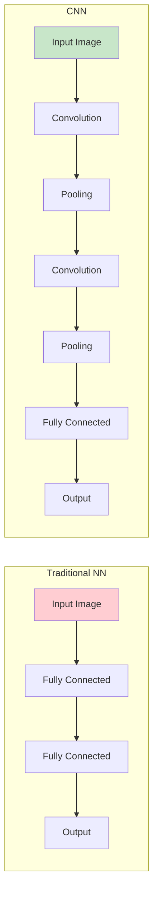

---

## The Convolution Operation

### Mathematical Origins

The convolution operation has deep roots in mathematics, signal processing, and statistics. It describes how one function modifies another through a "sliding" operation.

#### Continuous Convolution (Integral Form)

For two continuous functions $f$ and $g$, their convolution $(f * g)$ is defined as:

$$
(f * g)(t) = \int_{-\infty}^{\infty} f(\tau) \cdot g(t - \tau) \, d\tau
$$

This integral computes a weighted average of $f$ at each point $t$, where the weights are given by $g$ "flipped" and "shifted" to position $t$.

**Intuition**: Imagine $g$ as a "template" that slides across $f$, computing an overlap at each position.

#### Discrete Convolution (Summation Form)

For discrete signals (like digital images), the convolution becomes a summation:

$$
(f * g)[n] = \sum_{m=-\infty}^{\infty} f[m] \cdot g[n - m]
$$

For finite signals of length $N$ and $M$:

$$
(f * g)[n] = \sum_{m=0}^{M-1} f[m] \cdot g[n - m]
$$

#### 2D Convolution for Images

For images, we extend to two dimensions. Given an input image $I$ and a kernel (filter) $K$:

$$
(I * K)[i, j] = \sum_{m} \sum_{n} I[i+m, j+n] \cdot K[m, n]
$$

Or equivalently, with the kernel flipped (cross-correlation, which is what deep learning frameworks actually use):

$$
(I \star K)[i, j] = \sum_{m=0}^{k_h-1} \sum_{n=0}^{k_w-1} I[i+m, j+n] \cdot K[m, n]
$$

Where:
- $I$ is the input image of size $H \times W$
- $K$ is the kernel of size $k_h \times k_w$
- $(i, j)$ is the output position
- $(m, n)$ indexes the kernel elements

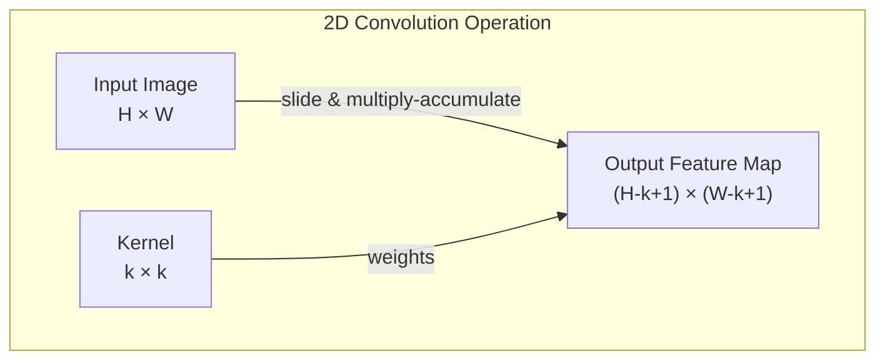

### The Sliding Window Mechanism

The convolution operation works by sliding a small window (the kernel) across the input image:

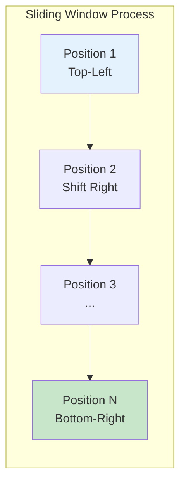

**Step-by-step example:**

Consider a 5×5 input and a 3×3 kernel:

$$
\text{Input } I = \begin{bmatrix}
1 & 2 & 3 & 0 & 1 \\
0 & 1 & 2 & 3 & 1 \\
1 & 2 & 1 & 0 & 0 \\
0 & 1 & 2 & 3 & 2 \\
2 & 1 & 0 & 1 & 1
\end{bmatrix}, \quad
\text{Kernel } K = \begin{bmatrix}
1 & 0 & -1 \\
1 & 0 & -1 \\
1 & 0 & -1
\end{bmatrix}
$$

For position $(0, 0)$:

$$
\text{Output}[0,0] = \sum_{m=0}^{2} \sum_{n=0}^{2} I[m,n] \cdot K[m,n]
$$

$$
= (1 \cdot 1) + (2 \cdot 0) + (3 \cdot (-1)) + (0 \cdot 1) + (1 \cdot 0) + (2 \cdot (-1)) + (1 \cdot 1) + (2 \cdot 0) + (1 \cdot (-1))
$$

$$
= 1 + 0 - 3 + 0 + 0 - 2 + 1 + 0 - 1 = -4
$$

This particular kernel is a **vertical edge detector** (Sobel-like filter).

---

## Understanding Digital Images

### Image as a Tensor

Digital images are represented as multi-dimensional arrays (tensors):

#### Grayscale Images

A grayscale image is a 2D matrix where each element represents pixel intensity:

$$
I \in \mathbb{R}^{H \times W}
$$

where $H$ is height, $W$ is width, and values typically range from 0 (black) to 255 (white) or 0.0 to 1.0 when normalized.

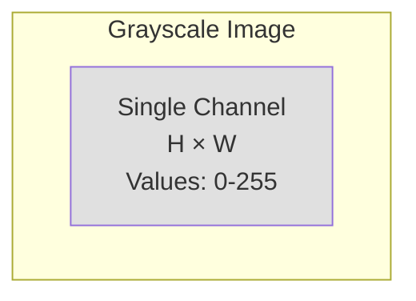

#### RGB Color Images

Color images have three channels (Red, Green, Blue):

$$
I \in \mathbb{R}^{H \times W \times 3} \quad \text{or} \quad I \in \mathbb{R}^{3 \times H \times W}
$$

The second format (channels-first) is the PyTorch convention.

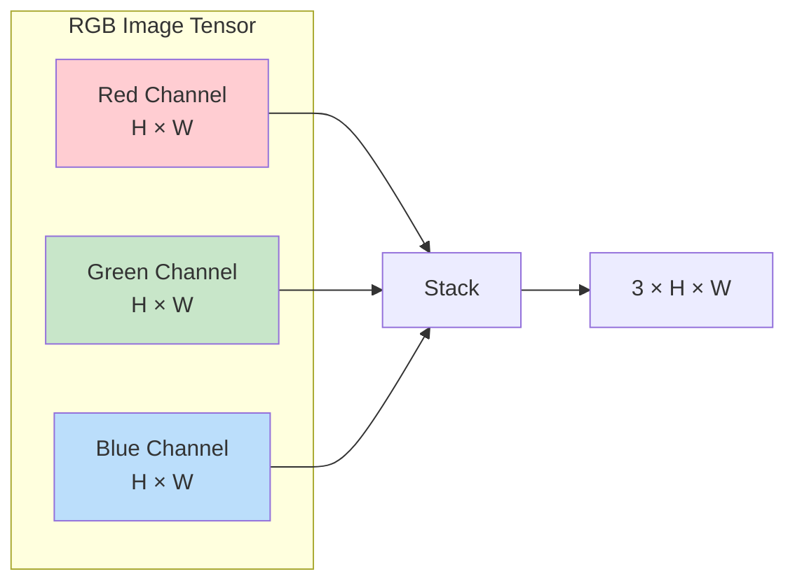

#### Batch of Images

In deep learning, we process batches of images:

$$
\mathbf{X} \in \mathbb{R}^{N \times C \times H \times W}
$$

Where:
- $N$ = batch size (number of images)
- $C$ = channels (1 for grayscale, 3 for RGB)
- $H$ = height
- $W$ = width

**Example**: A batch of 32 RGB images of size 224×224 has shape `[32, 3, 224, 224]`.

---

## Convolution Layer Parameters

### Stride

**Stride** determines how many pixels the kernel moves between positions.

$$
\text{Output size} = \left\lfloor \frac{W - K}{S} \right\rfloor + 1
$$

Where:
- $W$ = input size
- $K$ = kernel size
- $S$ = stride

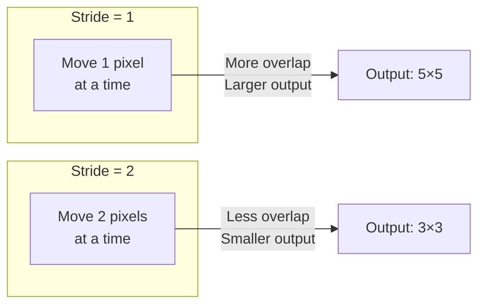

**Example**: 7×7 input, 3×3 kernel
- Stride 1: Output = $(7-3)/1 + 1 = 5$
- Stride 2: Output = $(7-3)/2 + 1 = 3$

### Padding

**Padding** adds pixels around the input border, allowing control over output size.

$$
\text{Output size} = \left\lfloor \frac{W + 2P - K}{S} \right\rfloor + 1
$$

Where $P$ = padding size.

**Common padding strategies:**

| Padding Type | Value | Purpose |
|--------------|-------|---------|
| Valid (no padding) | $P = 0$ | Output smaller than input |
| Same | $P = \lfloor K/2 \rfloor$ | Output same size as input (stride=1) |
| Full | $P = K - 1$ | Output larger than input |

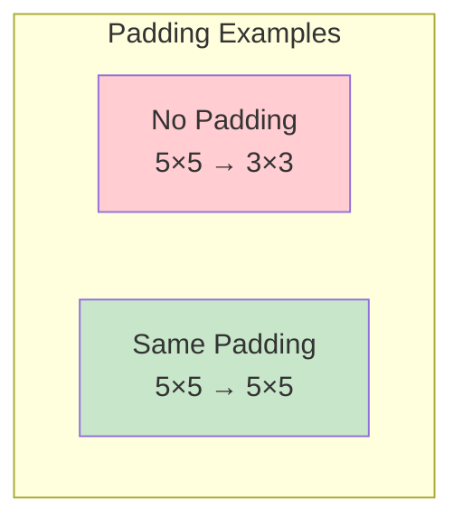

### Multiple Channels and Filters

For multi-channel inputs (like RGB), each filter spans all input channels:

$$
\text{Output}[i,j] = \sum_{c=0}^{C_{in}-1} \sum_{m=0}^{k_h-1} \sum_{n=0}^{k_w-1} I[c, i+m, j+n] \cdot K[c, m, n] + b
$$

Where:
- $C_{in}$ = number of input channels
- $K \in \mathbb{R}^{C_{in} \times k_h \times k_w}$ = one filter
- $b$ = bias term

**Multiple filters** produce multiple output channels (feature maps):

$$
\text{Filter bank: } \mathbf{W} \in \mathbb{R}^{C_{out} \times C_{in} \times k_h \times k_w}
$$

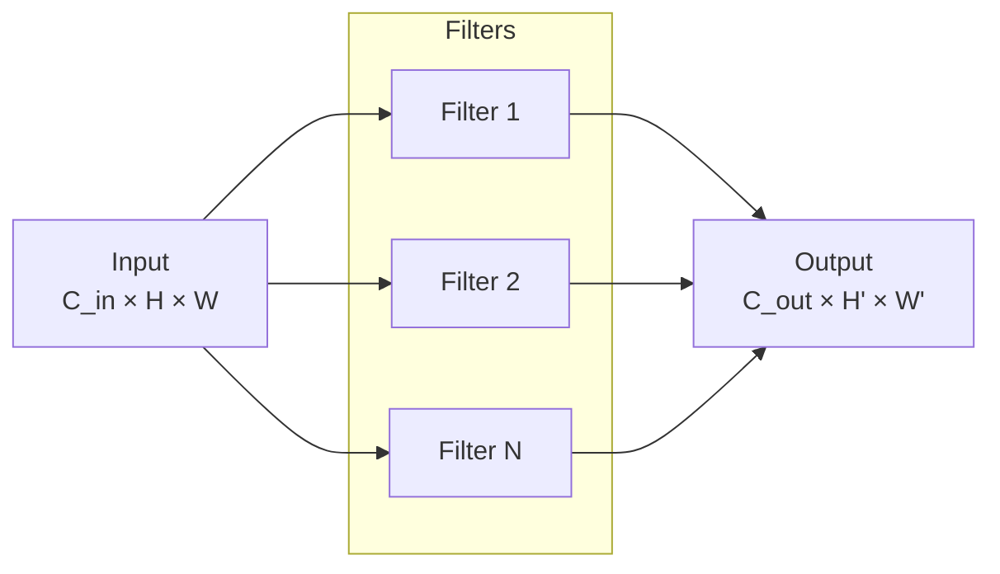

**Dimension calculation:**

$$
\text{Output shape: } (C_{out}, H_{out}, W_{out})
$$

Where:
$$
H_{out} = \left\lfloor \frac{H_{in} + 2P - k_h}{S} \right\rfloor + 1
$$

---

## Pooling Layers

Pooling reduces spatial dimensions while retaining important features.

### Max Pooling

Takes the maximum value in each window:

$$
\text{MaxPool}(X)[i,j] = \max_{(m,n) \in R_{ij}} X[m,n]
$$

Where $R_{ij}$ is the pooling region at position $(i,j)$.

### Average Pooling

Takes the average value in each window:

$$
\text{AvgPool}(X)[i,j] = \frac{1}{|R_{ij}|} \sum_{(m,n) \in R_{ij}} X[m,n]
$$

### Global Average Pooling

Reduces each feature map to a single value:

$$
\text{GAP}(X)[c] = \frac{1}{H \times W} \sum_{i=0}^{H-1} \sum_{j=0}^{W-1} X[c, i, j]
$$

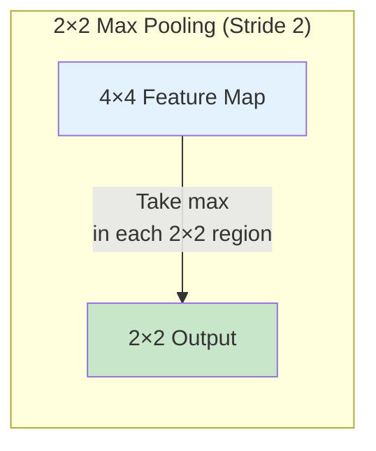

**Example**: 2×2 Max Pooling on a 4×4 input:

$$
\begin{bmatrix}
1 & 3 & 2 & 4 \\
5 & 6 & 1 & 2 \\
3 & 2 & 1 & 0 \\
1 & 2 & 3 & 4
\end{bmatrix}
\xrightarrow{\text{MaxPool 2×2}}
\begin{bmatrix}
6 & 4 \\
3 & 4
\end{bmatrix}
$$

### Why Pooling?

1. **Dimensionality reduction**: Reduces computation and memory
2. **Translation invariance**: Small shifts don't change output much
3. **Feature abstraction**: Captures "presence" of features, not exact location

---

## Feature Hierarchy and Receptive Fields

### Receptive Field

The **receptive field** is the region in the input image that affects a particular neuron's output.

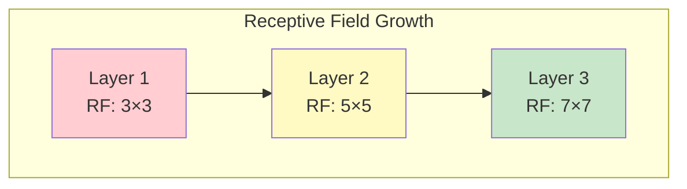

**Receptive field calculation** (for stacked 3×3 convolutions with stride 1):

$$
\text{RF}_l = \text{RF}_{l-1} + (k - 1) \times \prod_{i=1}^{l-1} s_i
$$

For $n$ layers of 3×3 convolutions with stride 1:
$$
\text{RF} = 1 + 2n
$$

### Feature Hierarchy

CNNs learn hierarchical features:

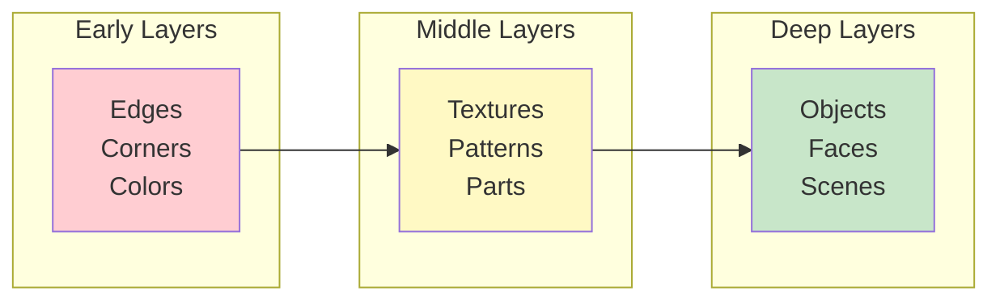

| Layer Depth | Features Learned | Example |
|-------------|-----------------|---------|
| Layer 1-2 | Edges, colors, gradients | Vertical lines, blobs |
| Layer 3-5 | Textures, patterns | Fur, fabric, eyes |
| Layer 6+ | Object parts, objects | Faces, wheels, buildings |

---

## Common Kernel Types

### Edge Detection Kernels

**Sobel Horizontal:**
$$
K_x = \begin{bmatrix}
-1 & 0 & 1 \\
-2 & 0 & 2 \\
-1 & 0 & 1
\end{bmatrix}
$$

**Sobel Vertical:**
$$
K_y = \begin{bmatrix}
-1 & -2 & -1 \\
0 & 0 & 0 \\
1 & 2 & 1
\end{bmatrix}
$$

### Blur Kernels

**Gaussian Blur (3×3 approximation):**
$$
K_{blur} = \frac{1}{16} \begin{bmatrix}
1 & 2 & 1 \\
2 & 4 & 2 \\
1 & 2 & 1
\end{bmatrix}
$$

### Sharpening Kernel

$$
K_{sharp} = \begin{bmatrix}
0 & -1 & 0 \\
-1 & 5 & -1 \\
0 & -1 & 0
\end{bmatrix}
$$

:::info
In CNNs, we don't hand-design these kernels—they are **learned** from data through backpropagation!
:::

---

## Weight Initialization for CNNs

### The Importance of Initialization

Proper weight initialization is crucial for training deep networks. Poor initialization leads to:
- **Vanishing gradients**: Signals shrink to zero
- **Exploding gradients**: Signals blow up to infinity
- **Symmetry breaking**: All neurons must start different

### Xavier/Glorot Initialization

For layers with sigmoid or tanh activation:

$$
W \sim \mathcal{U}\left(-\sqrt{\frac{6}{n_{in} + n_{out}}}, \sqrt{\frac{6}{n_{in} + n_{out}}}\right)
$$

Or normal distribution:
$$
W \sim \mathcal{N}\left(0, \sqrt{\frac{2}{n_{in} + n_{out}}}\right)
$$

### Kaiming/He Initialization

For layers with ReLU activation (recommended for CNNs):

$$
W \sim \mathcal{N}\left(0, \sqrt{\frac{2}{n_{in}}}\right)
$$

Where $n_{in} = C_{in} \times k_h \times k_w$ for convolutional layers.

**Why Kaiming for ReLU?**
- ReLU zeros out half the activations (negative values)
- Kaiming compensates by doubling the variance
- Maintains signal magnitude through deep networks

---

## CNN Architecture Patterns

### The Classic Pattern: Conv → ReLU → Pool

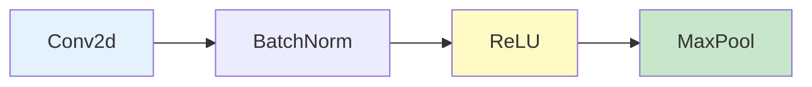

### Batch Normalization

Normalizes activations to have zero mean and unit variance:

$$
\hat{x}_i = \frac{x_i - \mu_B}{\sqrt{\sigma_B^2 + \epsilon}}
$$

$$
y_i = \gamma \hat{x}_i + \beta
$$

Where:
- $\mu_B, \sigma_B^2$ = batch mean and variance
- $\gamma, \beta$ = learnable scale and shift
- $\epsilon$ = small constant for numerical stability

**Benefits:**
- Allows higher learning rates
- Reduces sensitivity to initialization
- Acts as regularization

### Dropout for Regularization

Randomly zeros activations during training:

$$
y_i = \begin{cases}
0 & \text{with probability } p \\
\frac{x_i}{1-p} & \text{with probability } 1-p
\end{cases}
$$

The $\frac{1}{1-p}$ factor ensures expected value remains unchanged.

---

## DeepSpeed Implementation

Now let's implement a CNN using DeepSpeed for distributed training optimization.

### Overview

This example demonstrates:
- CNN architecture with DeepSpeed
- Kaiming/He weight initialization
- Learning rate scheduling (warmup + cosine decay)
- Early stopping and gradient monitoring
- Real-time accuracy tracking

**Task:** 10-class classification on 28x28 grayscale images

### Quick Start

```bash
cd 02_basic_convnet

# Single GPU
deepspeed --num_gpus=1 train_ds.py

# Multi-GPU
deepspeed --num_gpus=2 train_ds.py
```

### Model Architecture

```python
class CNNModelEnhanced(nn.Module):
    def __init__(self):
        super().__init__()
        self.conv1 = nn.Conv2d(1, 16, kernel_size=5, padding=2)
        self.pool = nn.MaxPool2d(kernel_size=2, stride=2)
        self.conv2 = nn.Conv2d(16, 32, kernel_size=5, padding=2)
        self.fc1 = nn.Linear(32 * 7 * 7, 128)
        self.fc2 = nn.Linear(128, 10)

        self._initialize_weights()  # Kaiming initialization
```

**Architecture Flow with Dimensions:**

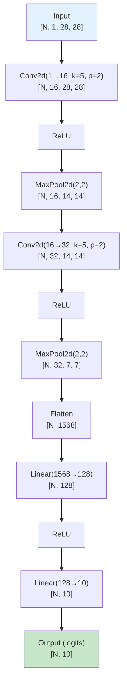

**Dimension calculations:**

| Layer | Input Shape | Output Shape | Parameters |
|-------|-------------|--------------|------------|
| Conv1 | [N, 1, 28, 28] | [N, 16, 28, 28] | $16 \times (1 \times 5 \times 5 + 1) = 416$ |
| Pool1 | [N, 16, 28, 28] | [N, 16, 14, 14] | 0 |
| Conv2 | [N, 16, 14, 14] | [N, 32, 14, 14] | $32 \times (16 \times 5 \times 5 + 1) = 12,832$ |
| Pool2 | [N, 32, 14, 14] | [N, 32, 7, 7] | 0 |
| FC1 | [N, 1568] | [N, 128] | $1568 \times 128 + 128 = 200,832$ |
| FC2 | [N, 128] | [N, 10] | $128 \times 10 + 10 = 1,290$ |
| **Total** | | | **~208,000** |

### Training Enhancements

#### Kaiming Initialization

```python
def _initialize_weights(self):
    for m in self.modules():
        if isinstance(m, nn.Conv2d):
            nn.init.kaiming_normal_(m.weight, mode='fan_out', nonlinearity='relu')
            if m.bias is not None:
                nn.init.constant_(m.bias, 0)
        elif isinstance(m, nn.Linear):
            nn.init.kaiming_normal_(m.weight, mode='fan_out', nonlinearity='relu')
            nn.init.constant_(m.bias, 0)
```

This ensures:
$$
\text{Var}(W) = \frac{2}{n_{in}}
$$

#### Learning Rate Schedule

```python
def get_lr_schedule(epoch, initial_lr=0.001, warmup_epochs=5, total_epochs=50):
    if epoch < warmup_epochs:
        # Linear warmup
        return initial_lr * (epoch + 1) / warmup_epochs
    else:
        # Cosine decay
        progress = (epoch - warmup_epochs) / (total_epochs - warmup_epochs)
        return initial_lr * 0.5 * (1 + cos(progress * pi))
```

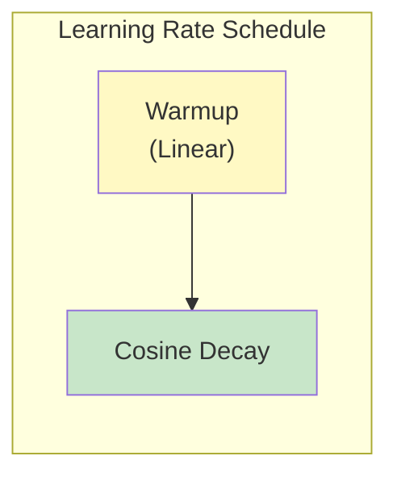

**Mathematical formulation:**

$$
\eta(t) = \begin{cases}
\eta_0 \cdot \frac{t+1}{T_{warmup}} & \text{if } t < T_{warmup} \\[10pt]
\eta_0 \cdot \frac{1}{2}\left(1 + \cos\left(\pi \cdot \frac{t - T_{warmup}}{T_{total} - T_{warmup}}\right)\right) & \text{otherwise}
\end{cases}
$$

#### Early Stopping

```python
patience_limit = 15
min_improvement = 1e-5

if avg_loss < best_loss - min_improvement:
    best_loss = avg_loss
    patience_counter = 0
else:
    patience_counter += 1
    if patience_counter >= patience_limit:
        break  # Stop training
```

### DeepSpeed Configuration

```json
{
  "train_batch_size": 32,
  "train_micro_batch_size_per_gpu": 32,
  "gradient_accumulation_steps": 1,
  "optimizer": {
    "type": "Adam",
    "params": {
      "lr": 1e-3
    }
  },
  "fp16": {
    "enabled": true
  }
}
```

### Training Parameters

| Parameter | Value | Description |
|-----------|-------|-------------|
| Learning Rate | $10^{-3}$ | Initial learning rate $\eta_0$ |
| LR Schedule | Warmup + Cosine | Gradual warmup, then decay |
| Warmup Epochs | 5 | Linear warmup period |
| Total Epochs | 50 | Maximum training epochs |
| Early Stopping | 15 epochs | Patience before stopping |
| Batch Size | 32 | Samples per gradient update |
| Parameters | ~208,000 | Total trainable parameters |

### Gradient Monitoring

The script tracks gradient norms to detect training issues:

```python
total_norm = 0.0
for p in model_engine.module.parameters():
    if p.grad is not None:
        param_norm = p.grad.data.norm(2)
        total_norm += param_norm.item() ** 2
total_norm = total_norm ** 0.5
```

This computes the L2 norm:

$$
\|\nabla \theta\|_2 = \sqrt{\sum_{i} \left(\frac{\partial \mathcal{L}}{\partial \theta_i}\right)^2}
$$

**Healthy patterns:**
- Gradual decrease and stabilization
- Values typically 0.01 - 1.0

**Problem indicators:**
- Sudden spikes: gradient explosion
- Near zero: vanishing gradients

### Expected Output

```
Epoch 49 Summary:
  - Avg Loss: 2.145678
  - Accuracy: 15.75%
  - Avg Grad Norm: 0.118765

Note: With synthetic random data, expect "Poor" quality.
With real MNIST, expect 95-99% accuracy.
```

### Using Real MNIST

Replace synthetic data with actual MNIST:

```python
from torchvision import datasets, transforms

transform = transforms.Compose([
    transforms.ToTensor(),
    transforms.Normalize((0.1307,), (0.3081,))
])

train_dataset = datasets.MNIST(
    './data',
    train=True,
    download=True,
    transform=transform
)
```

The normalization values are the mean (0.1307) and standard deviation (0.3081) of the MNIST dataset.

---

## Summary

In this tutorial, you learned:

1. **Convolution Fundamentals**
   - Mathematical definition (continuous and discrete)
   - 2D convolution for images
   - The sliding window mechanism

2. **Image Representation**
   - Grayscale vs. RGB images
   - Tensor formats (NCHW)
   - Batch processing

3. **CNN Components**
   - Convolutional layers with stride and padding
   - Pooling layers (max, average, global)
   - Receptive fields and feature hierarchies

4. **Training Techniques**
   - Kaiming initialization for ReLU networks
   - Batch normalization and dropout
   - Learning rate scheduling

5. **DeepSpeed Integration**
   - Model setup and configuration
   - Mixed precision training
   - Gradient monitoring

## Next Steps

- [CIFAR-10 CNN](/docs/tutorials/basic/cifar10) - Real dataset with color images
- [Basic RNN](/docs/tutorials/basic/rnn) - Sequence modeling with LSTMs
- [DeepSpeed ZeRO Stages](/docs/getting-started/deepspeed-zero-stages) - Memory optimization

## References

1. LeCun, Y., et al. (1998). Gradient-based learning applied to document recognition. *Proceedings of the IEEE*, 86(11), 2278-2324.
2. Krizhevsky, A., Sutskever, I., & Hinton, G. E. (2012). ImageNet classification with deep convolutional neural networks. *NeurIPS*.
3. He, K., et al. (2015). Delving deep into rectifiers: Surpassing human-level performance on ImageNet classification. *ICCV*.
4. Ioffe, S., & Szegedy, C. (2015). Batch normalization: Accelerating deep network training. *ICML*.
5. Dumoulin, V., & Visin, F. (2016). A guide to convolution arithmetic for deep learning. *arXiv:1603.07285*.
