# Basic ConvNet

A comprehensive introduction to Convolutional Neural Networks (CNNs) and training them with DeepSpeed for image classification.

## Introduction to Convolutional Neural Networks

Convolutional Neural Networks (CNNs) are a specialized class of neural networks designed specifically for processing structured grid data, such as images. They have revolutionized computer vision, achieving superhuman performance in tasks like image classification, object detection, and segmentation.

### Why CNNs for Images?

Traditional fully-connected neural networks have significant limitations when applied to images:

1. **Parameter explosion**: A 224×224 RGB image has 150,528 input features. A fully-connected layer with 1000 neurons would require over 150 million parameters!

2. **No spatial awareness**: Fully-connected networks treat each pixel independently, ignoring the spatial structure and local patterns in images.

3. **No translation invariance**: A cat in the top-left corner looks completely different to a fully-connected network than the same cat in the bottom-right corner.

CNNs address these issues through three key architectural innovations:
- **Local connectivity** (receptive fields)
- **Parameter sharing** (convolution)
- **Spatial hierarchies** (pooling)

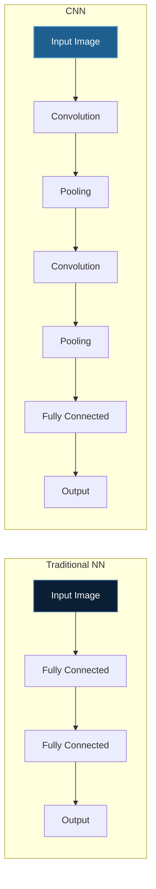
```mermaid
flowchart LR
    subgraph "Traditional NN"
        I1[Input Image] --> FC1[Fully Connected]
        FC1 --> FC2[Fully Connected]
        FC2 --> O1[Output]
    end

    subgraph "CNN"
        I2[Input Image] --> C1[Convolution]
        C1 --> P1[Pooling]
        P1 --> C2[Convolution]
        C2 --> P2[Pooling]
        P2 --> FC[Fully Connected]
        FC --> O2[Output]
    end

    style I1 fill:#0a1f33,stroke:#2d5a86,stroke-width:1.5px,color:#ffffff
    style I2 fill:#1e5f8f,stroke:#63a3d0,stroke-width:1.5px,color:#ffffff
```

---

## The Convolution Operation

### Mathematical Origins

The convolution operation has deep roots in mathematics, signal processing, and statistics. It describes how one function modifies another through a "sliding" operation.

#### Continuous Convolution (Integral Form)

For two continuous functions $f$ and $g$, their convolution $(f * g)$ is defined as:

$$
(f * g)(t) = \int_{-\infty}^{\infty} f(\tau) \cdot g(t - \tau) \, d\tau
$$

This integral computes a weighted average of $f$ at each point $t$, where the weights are given by $g$ "flipped" and "shifted" to position $t$.

**Intuition**: Imagine $g$ as a "template" that slides across $f$, computing an overlap at each position.

#### Discrete Convolution (Summation Form)

For discrete signals (like digital images), the convolution becomes a summation:

$$
(f * g)[n] = \sum_{m=-\infty}^{\infty} f[m] \cdot g[n - m]
$$

For finite signals of length $N$ and $M$:

$$
(f * g)[n] = \sum_{m=0}^{M-1} f[m] \cdot g[n - m]
$$

#### 2D Convolution for Images

For images, we extend to two dimensions. Given an input image $I$ and a kernel (filter) $K$:

$$
(I * K)[i, j] = \sum_{m} \sum_{n} I[i+m, j+n] \cdot K[m, n]
$$

Where:
- $I$ is the input image of size $H \times W$
- $K$ is the kernel of size $k_h \times k_w$
- $(i, j)$ is the output position
- $(m, n)$ indexes the kernel elements

:::warning "Convolution" in deep learning is actually cross-correlation
True convolution *flips* the kernel before sliding it:

$$
(I * K)[i,j] = \sum_{m}\sum_{n} I[i-m,\, j-n]\,K[m,n]
$$

What `nn.Conv2d` computes is **cross-correlation**, with no flip:

$$
(I \star K)[i,j] = \sum_{m=0}^{k_h-1}\sum_{n=0}^{k_w-1} I[i+m,\, j+n]\,K[m,n]
$$

The distinction is immaterial for learning — since $K$ is learned, the network simply learns the flipped kernel, and the two hypothesis classes are identical. It matters in exactly two places: when you **port hand-designed kernels** from a signal-processing reference (a Sobel operator must be flipped to behave as documented), and when you invoke the **convolution theorem**, $\mathcal{F}\{f * g\} = \mathcal{F}\{f\}\cdot\mathcal{F}\{g\}$, which holds for true convolution and underlies FFT-based conv implementations. Cross-correlation is associative-unfriendly and non-commutative; convolution is both.
:::

### Why convolution and not some other local operator?

The choice is not heuristic. It is forced by a symmetry requirement.

Let $T_{\mathbf{v}}$ denote translation of an image by vector $\mathbf{v}$. An operator $\Phi$ is **translation-equivariant** if

$$
\Phi(T_{\mathbf{v}} I) = T_{\mathbf{v}}(\Phi I) \quad \text{for all } \mathbf{v}
$$

— shifting the input shifts the output identically. The relevant theorem: **a linear operator is translation-equivariant if and only if it is a convolution.** Convolution is not *a* way to build a shift-equivariant linear layer; it is the *only* way.

This is why CNNs work on images. The statistics of natural images are approximately stationary — an edge is an edge wherever it appears — so equivariance is the correct inductive bias, and imposing it as a hard architectural constraint is far more sample-efficient than hoping a fully-connected layer learns it from data.

:::note Equivariance is not invariance
The convolution layer is **equivariant**: move the cat, the cat's feature map moves. The classifier needs **invariance**: move the cat, the label does not change. Invariance is manufactured downstream — by pooling, by strided subsampling, and ultimately by global average pooling, which sums over all spatial positions and so discards location entirely. Conflating the two is the most common conceptual error about CNNs.

Note also that this invariance is only *approximate*. Azulay & Weiss (2019) and Zhang (2019) showed that strided downsampling violates the Nyquist criterion, so modern CNNs are **not** shift-invariant in practice: a one-pixel translation can change the predicted class. Anti-aliased (blur-pooled) downsampling substantially repairs this.
:::

### What parameter sharing actually buys

Return to the 224×224×3 image and a hypothetical first layer producing 64 feature maps.

| Layer type | Parameter count | |
|---|---|---|
| Fully connected to $224\times224\times64$ | $150{,}528 \times 3{,}211{,}264$ | $\approx 4.8\times10^{11}$ |
| Conv2d, $3\to64$, $3\times3$ kernel | $64\times(3\times3\times3 + 1)$ | $\mathbf{1{,}792}$ |

Eight orders of magnitude, from two constraints: **local connectivity** (each output depends on a $k\times k$ patch, not all $HW$ pixels) and **parameter sharing** (the *same* kernel is reused at every spatial position). Crucially, the parameter count $C_{out}(C_{in}k_hk_w + 1)$ is **independent of $H$ and $W$** — the same layer processes any resolution. A fully-connected layer cannot.

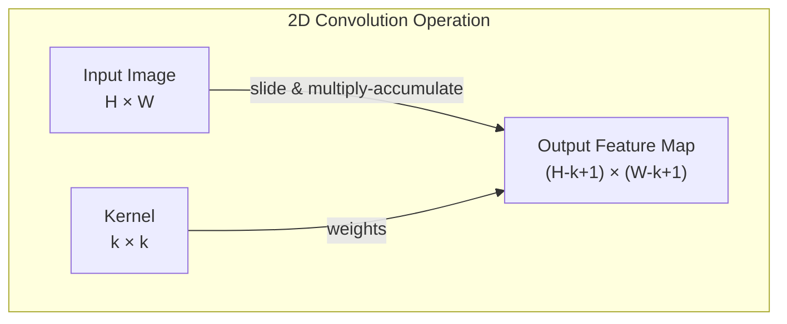
```mermaid
flowchart TB
    subgraph "2D Convolution Operation"
        direction LR
        IMG["Input Image<br/>H × W"]
        KERNEL["Kernel<br/>k × k"]
        OUTPUT["Output Feature Map<br/>(H-k+1) × (W-k+1)"]
    end

    IMG --> |"slide & multiply-accumulate"| OUTPUT
    KERNEL --> |"weights"| OUTPUT
```

### The Sliding Window Mechanism

The convolution operation works by sliding a small window (the kernel) across the input image:

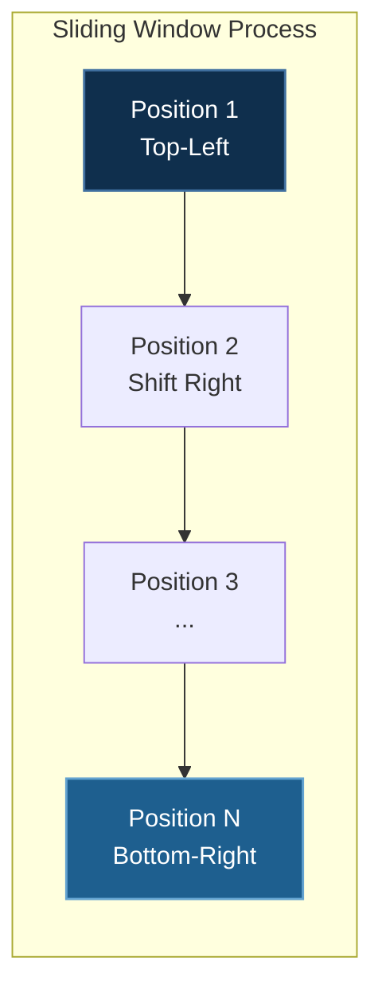
```mermaid
flowchart LR
    subgraph "Sliding Window Process"
        direction TB
        P1["Position 1<br/>Top-Left"]
        P2["Position 2<br/>Shift Right"]
        P3["Position 3<br/>..."]
        P4["Position N<br/>Bottom-Right"]
    end

    P1 --> P2 --> P3 --> P4

    style P1 fill:#0f2f4d,stroke:#3f6f9f,stroke-width:1.5px,color:#ffffff
    style P4 fill:#1e5f8f,stroke:#63a3d0,stroke-width:1.5px,color:#ffffff
```

**Step-by-step example:**

Consider a 5×5 input and a 3×3 kernel:

$$
\text{Input } I = \begin{bmatrix}
1 & 2 & 3 & 0 & 1 \\
0 & 1 & 2 & 3 & 1 \\
1 & 2 & 1 & 0 & 0 \\
0 & 1 & 2 & 3 & 2 \\
2 & 1 & 0 & 1 & 1
\end{bmatrix}, \quad
\text{Kernel } K = \begin{bmatrix}
1 & 0 & -1 \\
1 & 0 & -1 \\
1 & 0 & -1
\end{bmatrix}
$$

For position $(0, 0)$:

$$
\text{Output}[0,0] = \sum_{m=0}^{2} \sum_{n=0}^{2} I[m,n] \cdot K[m,n]
$$

$$
= (1 \cdot 1) + (2 \cdot 0) + (3 \cdot (-1)) + (0 \cdot 1) + (1 \cdot 0) + (2 \cdot (-1)) + (1 \cdot 1) + (2 \cdot 0) + (1 \cdot (-1))
$$

$$
= 1 + 0 - 3 + 0 + 0 - 2 + 1 + 0 - 1 = -4
$$

This particular kernel is a **vertical edge detector** (Sobel-like filter).

---

## Understanding Digital Images

### Image as a Tensor

Digital images are represented as multi-dimensional arrays (tensors):

#### Grayscale Images

A grayscale image is a 2D matrix where each element represents pixel intensity:

$$
I \in \mathbb{R}^{H \times W}
$$

where $H$ is height, $W$ is width, and values typically range from 0 (black) to 255 (white) or 0.0 to 1.0 when normalized.

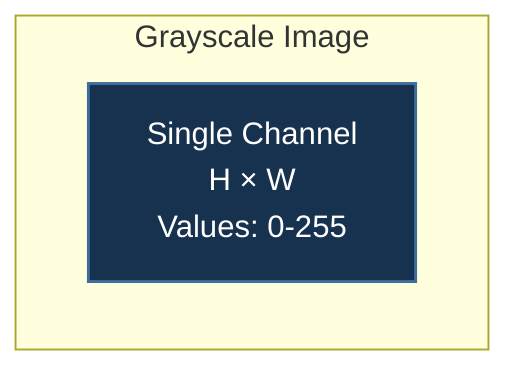
```mermaid
flowchart TB
    subgraph "Grayscale Image"
        G["Single Channel<br/>H × W<br/>Values: 0-255"]
    end

    style G fill:#16324f,stroke:#3f6f9f,stroke-width:1.5px,color:#ffffff
```

#### RGB Color Images

Color images have three channels (Red, Green, Blue):

$$
I \in \mathbb{R}^{H \times W \times 3} \quad \text{or} \quad I \in \mathbb{R}^{3 \times H \times W}
$$

The second format (channels-first) is the PyTorch convention.

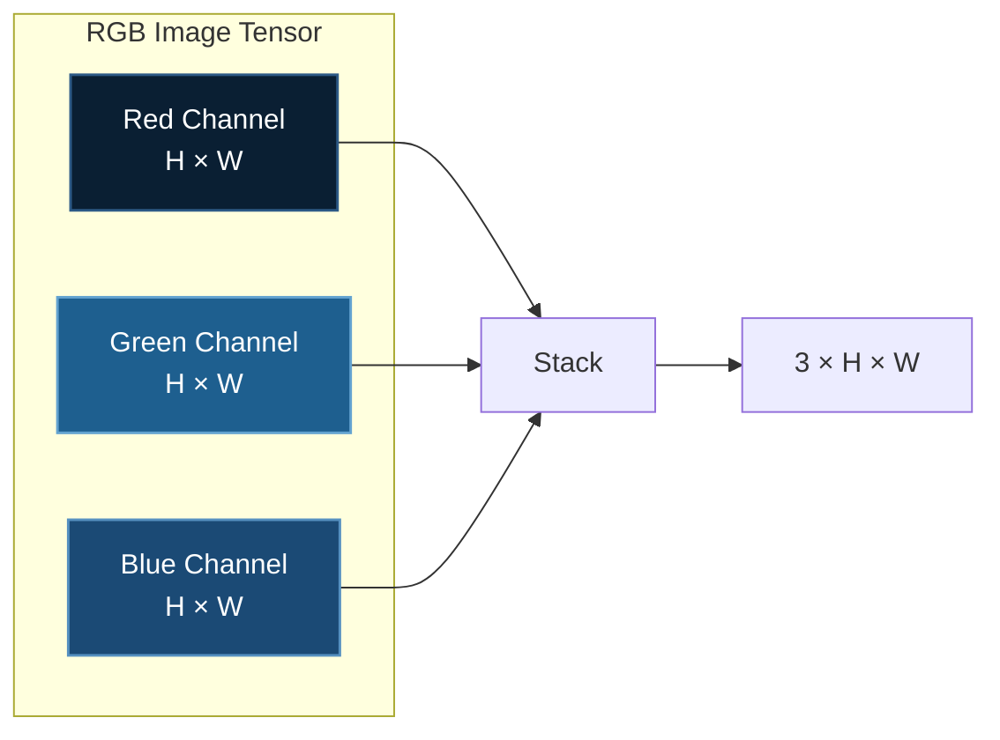
```mermaid
flowchart LR
    subgraph "RGB Image Tensor"
        R["Red Channel<br/>H × W"]
        G["Green Channel<br/>H × W"]
        B["Blue Channel<br/>H × W"]
    end

    R --> STACK["Stack"]
    G --> STACK
    B --> STACK
    STACK --> IMG["3 × H × W"]

    style R fill:#0a1f33,stroke:#2d5a86,stroke-width:1.5px,color:#ffffff
    style G fill:#1e5f8f,stroke:#63a3d0,stroke-width:1.5px,color:#ffffff
    style B fill:#1b4a75,stroke:#5590c0,stroke-width:1.5px,color:#ffffff
```

#### Batch of Images

In deep learning, we process batches of images:

$$
\mathbf{X} \in \mathbb{R}^{N \times C \times H \times W}
$$

Where:
- $N$ = batch size (number of images)
- $C$ = channels (1 for grayscale, 3 for RGB)
- $H$ = height
- $W$ = width

**Example**: A batch of 32 RGB images of size 224×224 has shape `[32, 3, 224, 224]`.

---

## Convolution Layer Parameters

### Stride

**Stride** determines how many pixels the kernel moves between positions.

$$
\text{Output size} = \left\lfloor \frac{W - K}{S} \right\rfloor + 1
$$

Where:
- $W$ = input size
- $K$ = kernel size
- $S$ = stride

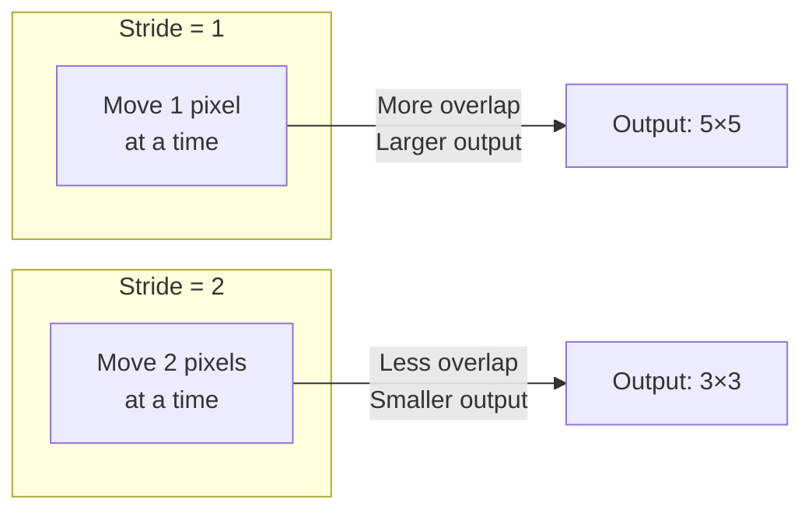
```mermaid
flowchart LR
    subgraph "Stride = 1"
        S1["Move 1 pixel<br/>at a time"]
    end

    subgraph "Stride = 2"
        S2["Move 2 pixels<br/>at a time"]
    end

    S1 --> |"More overlap<br/>Larger output"| O1["Output: 5×5"]
    S2 --> |"Less overlap<br/>Smaller output"| O2["Output: 3×3"]
```

**Example**: 7×7 input, 3×3 kernel
- Stride 1: Output = $(7-3)/1 + 1 = 5$
- Stride 2: Output = $(7-3)/2 + 1 = 3$

### Padding

**Padding** adds pixels around the input border, allowing control over output size.

$$
\text{Output size} = \left\lfloor \frac{W + 2P - K}{S} \right\rfloor + 1
$$

Where $P$ = padding size.

**Common padding strategies:**

| Padding Type | Value | Purpose |
|--------------|-------|---------|
| Valid (no padding) | $P = 0$ | Output smaller than input |
| Same | $P = \lfloor K/2 \rfloor$ | Output same size as input (stride=1) |
| Full | $P = K - 1$ | Output larger than input |

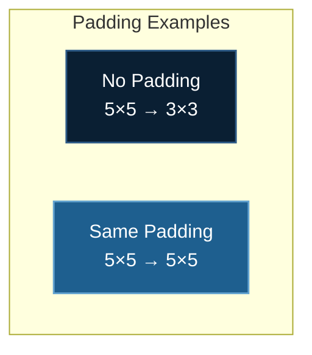
```mermaid
flowchart TB
    subgraph "Padding Examples"
        NP["No Padding<br/>5×5 → 3×3"]
        SP["Same Padding<br/>5×5 → 5×5"]
    end

    style NP fill:#0a1f33,stroke:#2d5a86,stroke-width:1.5px,color:#ffffff
    style SP fill:#1e5f8f,stroke:#63a3d0,stroke-width:1.5px,color:#ffffff
```

### Multiple Channels and Filters

For multi-channel inputs (like RGB), each filter spans all input channels:

$$
\text{Output}[i,j] = \sum_{c=0}^{C_{in}-1} \sum_{m=0}^{k_h-1} \sum_{n=0}^{k_w-1} I[c, i+m, j+n] \cdot K[c, m, n] + b
$$

Where:
- $C_{in}$ = number of input channels
- $K \in \mathbb{R}^{C_{in} \times k_h \times k_w}$ = one filter
- $b$ = bias term

**Multiple filters** produce multiple output channels (feature maps):

$$
\text{Filter bank: } \mathbf{W} \in \mathbb{R}^{C_{out} \times C_{in} \times k_h \times k_w}
$$

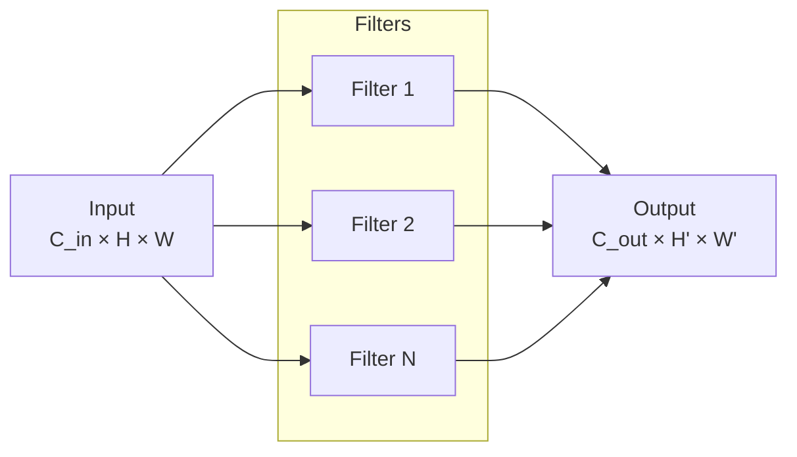
```mermaid
flowchart LR
    INPUT["Input<br/>C_in × H × W"]

    subgraph "Filters"
        F1["Filter 1"]
        F2["Filter 2"]
        FN["Filter N"]
    end

    OUTPUT["Output<br/>C_out × H' × W'"]

    INPUT --> F1 --> OUTPUT
    INPUT --> F2 --> OUTPUT
    INPUT --> FN --> OUTPUT
```

**Dimension calculation:**

$$
\text{Output shape: } (C_{out}, H_{out}, W_{out})
$$

Where:
$$
H_{out} = \left\lfloor \frac{H_{in} + 2P - k_h}{S} \right\rfloor + 1
$$

---

## Pooling Layers

Pooling reduces spatial dimensions while retaining important features.

### Max Pooling

Takes the maximum value in each window:

$$
\text{MaxPool}(X)[i,j] = \max_{(m,n) \in R_{ij}} X[m,n]
$$

Where $R_{ij}$ is the pooling region at position $(i,j)$.

### Average Pooling

Takes the average value in each window:

$$
\text{AvgPool}(X)[i,j] = \frac{1}{|R_{ij}|} \sum_{(m,n) \in R_{ij}} X[m,n]
$$

### Global Average Pooling

Reduces each feature map to a single value:

$$
\text{GAP}(X)[c] = \frac{1}{H \times W} \sum_{i=0}^{H-1} \sum_{j=0}^{W-1} X[c, i, j]
$$

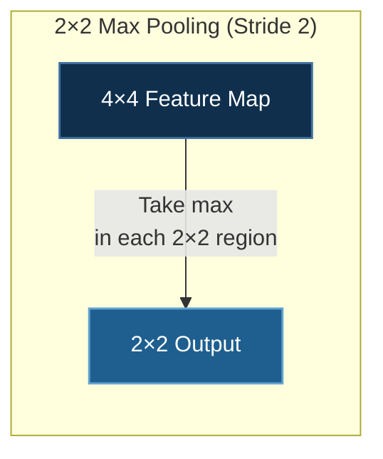
```mermaid
flowchart LR
    subgraph "2×2 Max Pooling (Stride 2)"
        INPUT["4×4 Feature Map"]
        OUTPUT["2×2 Output"]
    end

    INPUT --> |"Take max<br/>in each 2×2 region"| OUTPUT

    style INPUT fill:#0f2f4d,stroke:#3f6f9f,stroke-width:1.5px,color:#ffffff
    style OUTPUT fill:#1e5f8f,stroke:#63a3d0,stroke-width:1.5px,color:#ffffff
```

**Example**: 2×2 Max Pooling on a 4×4 input:

$$
\begin{bmatrix}
1 & 3 & 2 & 4 \\
5 & 6 & 1 & 2 \\
3 & 2 & 1 & 0 \\
1 & 2 & 3 & 4
\end{bmatrix}
\xrightarrow{\text{MaxPool 2×2}}
\begin{bmatrix}
6 & 4 \\
3 & 4
\end{bmatrix}
$$

### Why Pooling?

1. **Dimensionality reduction**: Reduces computation and memory
2. **Translation invariance**: Small shifts don't change output much
3. **Feature abstraction**: Captures "presence" of features, not exact location

---

## Feature Hierarchy and Receptive Fields

### Receptive Field

The **receptive field** is the region in the input image that affects a particular neuron's output.

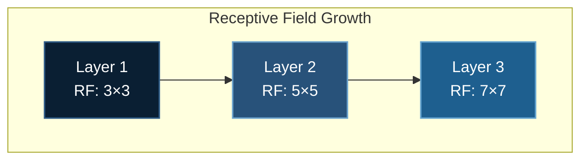
```mermaid
flowchart TB
    subgraph "Receptive Field Growth"
        L1["Layer 1<br/>RF: 3×3"]
        L2["Layer 2<br/>RF: 5×5"]
        L3["Layer 3<br/>RF: 7×7"]
    end

    L1 --> L2 --> L3

    style L1 fill:#0a1f33,stroke:#2d5a86,stroke-width:1.5px,color:#ffffff
    style L2 fill:#28527a,stroke:#6aa2cd,stroke-width:1.5px,color:#ffffff
    style L3 fill:#1e5f8f,stroke:#63a3d0,stroke-width:1.5px,color:#ffffff
```

**Receptive field calculation** (for stacked 3×3 convolutions with stride 1):

$$
\text{RF}_l = \text{RF}_{l-1} + (k - 1) \times \prod_{i=1}^{l-1} s_i
$$

For $n$ layers of 3×3 convolutions with stride 1:
$$
\text{RF} = 1 + 2n
$$

Note the $\prod_i s_i$ term: with stride-1 layers the receptive field grows **linearly** in depth, but each stride-2 layer *doubles* the growth rate thereafter. This is why architectures interleave downsampling — reaching a 224-pixel receptive field with stride-1 3×3 convolutions alone would need 112 layers.

:::note Two 3×3 convolutions beat one 5×5
Stacking two 3×3 layers gives a 5×5 receptive field using $2\times(3^2 C^2) = 18C^2$ parameters instead of $25C^2$ — 28% fewer — while inserting an extra nonlinearity between them, increasing expressiveness. Three stacked 3×3 layers reach 7×7 with $27C^2$ against $49C^2$. This observation is the entire architectural thesis of VGG (Simonyan & Zisserman, 2015) and is why 3×3 became the default kernel size.
:::

:::warning The *effective* receptive field is far smaller than the theoretical one
The formula above gives the set of input pixels that *can* influence an output. Luo et al. (2016) showed that the actual influence, $\partial y / \partial x_{ij}$, is distributed approximately **Gaussian** over that region and decays quickly from the centre — the effective receptive field grows only as $O(\sqrt{n})$ in depth, not $O(n)$, and occupies a small fraction of the theoretical area.

The practical consequence: computing a theoretical receptive field that covers your object and concluding the network can see it is unsound. It is a necessary condition, not a sufficient one — which is part of why dilated convolutions, and later self-attention, were introduced to obtain genuine long-range dependence.
:::

### Feature Hierarchy

CNNs learn hierarchical features:

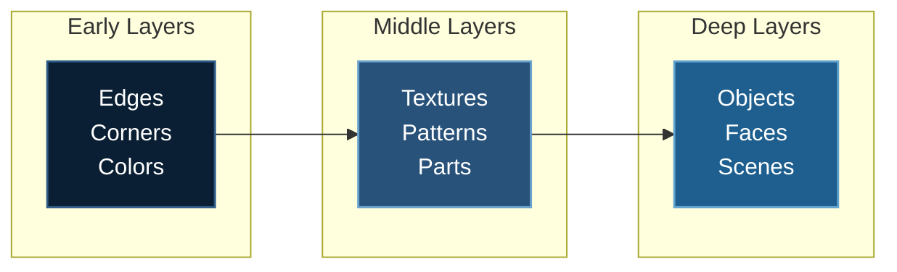
```mermaid
flowchart LR
    subgraph "Early Layers"
        E["Edges<br/>Corners<br/>Colors"]
    end

    subgraph "Middle Layers"
        M["Textures<br/>Patterns<br/>Parts"]
    end

    subgraph "Deep Layers"
        D["Objects<br/>Faces<br/>Scenes"]
    end

    E --> M --> D

    style E fill:#0a1f33,stroke:#2d5a86,stroke-width:1.5px,color:#ffffff
    style M fill:#28527a,stroke:#6aa2cd,stroke-width:1.5px,color:#ffffff
    style D fill:#1e5f8f,stroke:#63a3d0,stroke-width:1.5px,color:#ffffff
```

| Layer Depth | Features Learned | Example |
|-------------|-----------------|---------|
| Layer 1-2 | Edges, colors, gradients | Vertical lines, blobs |
| Layer 3-5 | Textures, patterns | Fur, fabric, eyes |
| Layer 6+ | Object parts, objects | Faces, wheels, buildings |

---

## Common Kernel Types

### Edge Detection Kernels

**Sobel Horizontal:**
$$
K_x = \begin{bmatrix}
-1 & 0 & 1 \\
-2 & 0 & 2 \\
-1 & 0 & 1
\end{bmatrix}
$$

**Sobel Vertical:**
$$
K_y = \begin{bmatrix}
-1 & -2 & -1 \\
0 & 0 & 0 \\
1 & 2 & 1
\end{bmatrix}
$$

### Blur Kernels

**Gaussian Blur (3×3 approximation):**
$$
K_{blur} = \frac{1}{16} \begin{bmatrix}
1 & 2 & 1 \\
2 & 4 & 2 \\
1 & 2 & 1
\end{bmatrix}
$$

### Sharpening Kernel

$$
K_{sharp} = \begin{bmatrix}
0 & -1 & 0 \\
-1 & 5 & -1 \\
0 & -1 & 0
\end{bmatrix}
$$

:::info
In CNNs, we don't hand-design these kernels—they are **learned** from data through backpropagation!
:::

---

## Weight Initialization for CNNs

### The Importance of Initialization

Proper weight initialization is crucial for training deep networks. Poor initialization leads to:
- **Vanishing gradients**: Signals shrink to zero
- **Exploding gradients**: Signals blow up to infinity
- **Symmetry breaking**: All neurons must start different

### The variance-propagation argument

Both standard schemes come from the same one-line calculation. For a layer $z = \sum_{i=1}^{n_{in}} w_i x_i$ with $w_i$ i.i.d. zero-mean and independent of $\mathbf{x}$,

$$
\operatorname{Var}(z) = n_{in}\operatorname{Var}(w)\operatorname{Var}(x)
$$

Signal magnitude is preserved layer-to-layer exactly when $n_{in}\operatorname{Var}(w) = 1$. Every initializer below is a different answer to "what should $\operatorname{Var}(w)$ be?"

### Xavier/Glorot initialization

For symmetric, roughly linear activations (sigmoid near the origin, tanh), Glorot & Bengio (2010) compromise between preserving forward variance ($n_{in}$) and backward variance ($n_{out}$), taking the harmonic-mean-like average:

$$
\operatorname{Var}(W) = \frac{2}{n_{in} + n_{out}}
$$

Realized either as a normal or a uniform distribution — note $\operatorname{Var}(\mathcal{U}(-a,a)) = a^2/3$, which is where the 6 comes from:

$$
W \sim \mathcal{N}\!\left(0,\; \frac{2}{n_{in}+n_{out}}\right)
\qquad\text{or}\qquad
W \sim \mathcal{U}\!\left(-\sqrt{\frac{6}{n_{in}+n_{out}}},\; \sqrt{\frac{6}{n_{in}+n_{out}}}\right)
$$

### Kaiming/He initialization

ReLU zeros the negative half of a symmetric pre-activation distribution, so it **halves the variance**: $\operatorname{Var}(\mathrm{ReLU}(z)) = \tfrac{1}{2}\operatorname{Var}(z)$. The condition $n_{in}\operatorname{Var}(w) = 1$ therefore becomes $\tfrac{1}{2}n_{in}\operatorname{Var}(w) = 1$, and He et al. (2015) correct by exactly the factor of 2:

$$
\operatorname{Var}(W) = \frac{2}{n_{in}}, \qquad\text{i.e.}\qquad W \sim \mathcal{N}\!\left(0,\; \frac{2}{n_{in}}\right)
$$

For a convolutional layer the fan-in counts the whole receptive volume, $n_{in} = C_{in}\times k_h\times k_w$; the fan-out is $C_{out}\times k_h\times k_w$.

:::warning Notation: $\mathcal{N}(\mu, \sigma^2)$ takes a *variance*
Many write these as $\mathcal{N}(0, \sqrt{2/n_{in}})$, which reads as a variance of $\sqrt{2/n_{in}}$ and is wrong by a square root. The variance is $2/n_{in}$; the **standard deviation** is $\sqrt{2/n_{in}}$. PyTorch's `kaiming_normal_` takes the correct convention internally, so the bug is usually confined to hand-rolled initializers — where it silently mis-scales every layer.
:::

**Why this compounds.** Getting the factor wrong by $\alpha$ per layer scales activations by $\alpha^{L/2}$ over $L$ layers. He et al. show a 30-layer network that trains fine under Kaiming but does not train *at all* under Xavier: the missing factor of 2 per layer decays the signal by $2^{-15} \approx 3\times10^{-5}$ by the output.

:::note `mode='fan_out'` on a `Linear` layer is unusual
The example below calls `kaiming_normal_(..., mode='fan_out')` on both `Conv2d` and `Linear`. For convolutions `fan_out` is a defensible choice (it preserves variance in the *backward* pass, and is what the original ResNet code used). For `nn.Linear`, whose weight is stored as `[out_features, in_features]`, `fan_out` computes the fan from `in_features`... which makes it behave like `fan_in` for the forward pass. It works, but if you want the textbook behaviour on linear layers, use the default `mode='fan_in'` and be explicit about it.
:::

---

## CNN Architecture Patterns

### The Classic Pattern: Conv → ReLU → Pool


```mermaid
flowchart LR
    CONV["Conv2d"] --> BN["BatchNorm"] --> RELU["ReLU"] --> POOL["MaxPool"]

    style CONV fill:#0f2f4d,stroke:#3f6f9f,stroke-width:1.5px,color:#ffffff
    style RELU fill:#28527a,stroke:#6aa2cd,stroke-width:1.5px,color:#ffffff
    style POOL fill:#1e5f8f,stroke:#63a3d0,stroke-width:1.5px,color:#ffffff
```

### Batch Normalization

Normalizes activations to have zero mean and unit variance:

$$
\hat{x}_i = \frac{x_i - \mu_B}{\sqrt{\sigma_B^2 + \epsilon}}
$$

$$
y_i = \gamma \hat{x}_i + \beta
$$

Where:
- $\mu_B, \sigma_B^2$ = batch mean and variance
- $\gamma, \beta$ = learnable scale and shift
- $\epsilon$ = small constant for numerical stability

**Benefits:**
- Allows higher learning rates
- Reduces sensitivity to initialization
- Acts as regularization

:::note The "internal covariate shift" explanation is not supported by the evidence
Ioffe & Szegedy (2015) motivated BatchNorm as reducing *internal covariate shift* — the drift in each layer's input distribution as earlier layers update. Santurkar et al. (2018) tested this directly: they injected explicit, severe distributional noise *after* each BatchNorm layer, deliberately restoring covariate shift, and the networks still trained faster than unnormalized baselines.

Their alternative account, supported by both theory and measurement, is that BatchNorm **smooths the optimization landscape** — it improves the Lipschitz constants of the loss and of its gradient, so gradients become more predictive of the loss at the points actually reached by a step. That is what permits larger learning rates. Worth knowing, because the covariate-shift story is still repeated widely and leads people to reach for BatchNorm in settings where the smoothing argument does not apply.
:::

:::danger BatchNorm and distributed training interact badly
BatchNorm computes $\mu_B$ and $\sigma_B^2$ over the **local** micro-batch on each GPU. Two consequences under DeepSpeed:

**The effective normalization batch is `train_micro_batch_size_per_gpu`, not `train_batch_size`.** Splitting a batch of 256 across 8 GPUs means each BatchNorm layer sees 32 samples. Push the micro-batch to 2 or 4 — which is exactly what memory pressure and gradient accumulation encourage — and the batch statistics become so noisy that training degrades. **Gradient accumulation does not help**: it accumulates gradients, not batch statistics, so 8 accumulation steps of size 4 still normalizes over 4 samples.

**The fix depends on why the batch is small.** Use `nn.SyncBatchNorm.convert_sync_batchnorm(model)` to compute statistics across all ranks — correct, but it adds an all-reduce at every BatchNorm layer in both passes. Or switch to a **batch-independent** normalizer: GroupNorm (Wu & He, 2018) or LayerNorm, whose statistics do not depend on the batch axis at all and are therefore immune to this whole class of problem. That independence is a major reason transformers use LayerNorm.
:::

### Dropout for Regularization

Randomly zeros activations during training:

$$
y_i = \begin{cases}
0 & \text{with probability } p \\
\frac{x_i}{1-p} & \text{with probability } 1-p
\end{cases}
$$

The $\frac{1}{1-p}$ factor ensures expected value remains unchanged. This is **inverted dropout**: the scaling happens at training time so that inference is a plain forward pass with no rescaling — which is why `model.eval()` must be called, and why forgetting it silently degrades your reported accuracy.

:::warning Do not stack Dropout before BatchNorm
Li et al. (2019) identify a **variance shift**: dropout changes the variance of its output between train mode (where units are dropped and rescaled) and eval mode (where they are not). A downstream BatchNorm accumulates running statistics under the training-mode variance, then normalizes with them under the eval-mode variance. The mismatch degrades test accuracy in a way that looks like overfitting but is not.

The practical rule, and the reason modern CNNs use little or no dropout in convolutional stacks: put dropout **after** all BatchNorm layers, typically only in the classifier head. ResNet and its descendants rely on BatchNorm plus weight decay for regularization and omit dropout from the trunk entirely.
:::

---

## Computational Cost: Where CNN Training Actually Spends Resources

CNNs invert the memory profile of the language models discussed in [ZeRO Stages](/docs/getting-started/deepspeed-zero-stages). Knowing which regime you are in determines which optimization is worth applying.

### FLOPs

A convolutional layer performs, per forward pass:

$$
\text{FLOPs} \approx 2 \cdot \underbrace{H_{out}W_{out}}_{\text{positions}} \cdot \underbrace{C_{out}}_{\text{filters}} \cdot \underbrace{C_{in}k_hk_w}_{\text{MACs per output}}
$$

The factor 2 counts a multiply and an add. Note that **cost scales with spatial resolution while parameter count does not** — the parameter-sharing property that makes CNNs so compact is exactly what makes their compute cost resolution-dependent.

### How convolution is actually executed

`cuDNN` does not run a naive sextuple loop. The dominant strategy is **im2col + GEMM**: each $k_h\times k_w\times C_{in}$ input patch is flattened into a column, producing a matrix of shape $(C_{in}k_hk_w) \times (H_{out}W_{out})$, and the convolution becomes a single dense matrix multiply against the filter bank reshaped to $C_{out} \times (C_{in}k_hk_w)$. This trades memory — patches overlap, so im2col duplicates data by a factor of up to $k_hk_w$ — for the ability to call a maximally-tuned GEMM kernel on Tensor Cores.

Alternatives that cuDNN benchmarks against at runtime: **FFT-based** convolution (via the convolution theorem, efficient for large kernels), and **Winograd** minimal-filtering algorithms (fewer multiplies for small kernels, which is why 3×3 stride-1 is so fast on NVIDIA hardware).

:::tip `torch.backends.cudnn.benchmark = True`
This lets cuDNN time every available algorithm on the first call for each input shape and cache the winner. It typically buys 5–20% on a CNN — but only if your input shapes are **fixed**. With varying shapes it re-benchmarks constantly and is a net loss. Fixed-size image batches are the ideal case.
:::

### Memory: activations dominate

For the two-layer CNN below at batch 32, model states are $16\Psi = 16 \times 208{,}000 \approx 3.3$ MB. The retained activations for the backward pass are:

| Tensor | Shape | Elements at $N=32$ |
|---|---|---|
| Input | $[N, 1, 28, 28]$ | 25,088 |
| Conv1 out | $[N, 16, 28, 28]$ | 401,408 |
| Pool1 out | $[N, 16, 14, 14]$ | 100,352 |
| Conv2 out | $[N, 32, 14, 14]$ | 200,704 |
| Pool2 out | $[N, 32, 7, 7]$ | 50,176 |

Roughly 778,000 elements against 208,000 parameters — and that ratio grows linearly with batch size while the parameter count stays fixed.

**This is the general CNN situation.** Early layers hold high-resolution, many-channel feature maps; a ResNet-50 at batch 256 spends the large majority of its memory on activations. The consequences for DeepSpeed:

- **ZeRO Stage 3 helps far less than it does for LLMs.** It partitions model states, which are not the bottleneck, while adding $3\Psi$ of communication. Stage 1 or 2 is usually the right choice for CNNs.
- **Activation checkpointing is the high-value lever**, precisely inverting the LLM advice.
- **`channels_last` memory format** (`model.to(memory_format=torch.channels_last)`) lets Tensor Cores read NHWC directly instead of transposing NCHW, often a 10–30% speedup on convolutions in mixed precision, at no accuracy cost.

---

## DeepSpeed Implementation

Now let's implement a CNN using DeepSpeed for distributed training optimization.

### Overview

This example demonstrates:
- CNN architecture with DeepSpeed
- Kaiming/He weight initialization
- Learning rate scheduling (warmup + cosine decay)
- Early stopping and gradient monitoring
- Real-time accuracy tracking

**Task:** 10-class classification on 28x28 grayscale images

### Quick Start

```bash
cd 02_basic_convnet

# Single GPU
deepspeed --num_gpus=1 train_ds.py

# Multi-GPU
deepspeed --num_gpus=2 train_ds.py
```

### Model Architecture

```python
class CNNModelEnhanced(nn.Module):
    def __init__(self):
        super().__init__()
        self.conv1 = nn.Conv2d(1, 16, kernel_size=5, padding=2)
        self.pool = nn.MaxPool2d(kernel_size=2, stride=2)
        self.conv2 = nn.Conv2d(16, 32, kernel_size=5, padding=2)
        self.fc1 = nn.Linear(32 * 7 * 7, 128)
        self.fc2 = nn.Linear(128, 10)

        self._initialize_weights()  # Kaiming initialization
```

**Architecture Flow with Dimensions:**

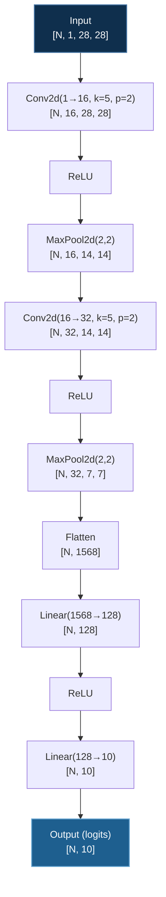
```mermaid
flowchart TB
    INPUT["Input<br/>[N, 1, 28, 28]"]
    CONV1["Conv2d(1→16, k=5, p=2)<br/>[N, 16, 28, 28]"]
    RELU1["ReLU"]
    POOL1["MaxPool2d(2,2)<br/>[N, 16, 14, 14]"]
    CONV2["Conv2d(16→32, k=5, p=2)<br/>[N, 32, 14, 14]"]
    RELU2["ReLU"]
    POOL2["MaxPool2d(2,2)<br/>[N, 32, 7, 7]"]
    FLAT["Flatten<br/>[N, 1568]"]
    FC1["Linear(1568→128)<br/>[N, 128]"]
    RELU3["ReLU"]
    FC2["Linear(128→10)<br/>[N, 10]"]
    OUTPUT["Output (logits)<br/>[N, 10]"]

    INPUT --> CONV1 --> RELU1 --> POOL1
    POOL1 --> CONV2 --> RELU2 --> POOL2
    POOL2 --> FLAT --> FC1 --> RELU3 --> FC2 --> OUTPUT

    style INPUT fill:#0f2f4d,stroke:#3f6f9f,stroke-width:1.5px,color:#ffffff
    style OUTPUT fill:#1e5f8f,stroke:#63a3d0,stroke-width:1.5px,color:#ffffff
```

**Dimension calculations:**

| Layer | Input Shape | Output Shape | Parameters |
|-------|-------------|--------------|------------|
| Conv1 | [N, 1, 28, 28] | [N, 16, 28, 28] | $16 \times (1 \times 5 \times 5 + 1) = 416$ |
| Pool1 | [N, 16, 28, 28] | [N, 16, 14, 14] | 0 |
| Conv2 | [N, 16, 14, 14] | [N, 32, 14, 14] | $32 \times (16 \times 5 \times 5 + 1) = 12,832$ |
| Pool2 | [N, 32, 14, 14] | [N, 32, 7, 7] | 0 |
| FC1 | [N, 1568] | [N, 128] | $1568 \times 128 + 128 = 200,832$ |
| FC2 | [N, 128] | [N, 10] | $128 \times 10 + 10 = 1,290$ |
| **Total** | | | **~208,000** |

### Training Enhancements

#### Kaiming Initialization

```python
def _initialize_weights(self):
    for m in self.modules():
        if isinstance(m, nn.Conv2d):
            nn.init.kaiming_normal_(m.weight, mode='fan_out', nonlinearity='relu')
            if m.bias is not None:
                nn.init.constant_(m.bias, 0)
        elif isinstance(m, nn.Linear):
            nn.init.kaiming_normal_(m.weight, mode='fan_out', nonlinearity='relu')
            nn.init.constant_(m.bias, 0)
```

This ensures:
$$
\text{Var}(W) = \frac{2}{n_{in}}
$$

#### Learning Rate Schedule

```python
def get_lr_schedule(epoch, initial_lr=0.001, warmup_epochs=5, total_epochs=50):
    if epoch < warmup_epochs:
        # Linear warmup
        return initial_lr * (epoch + 1) / warmup_epochs
    else:
        # Cosine decay
        progress = (epoch - warmup_epochs) / (total_epochs - warmup_epochs)
        return initial_lr * 0.5 * (1 + cos(progress * pi))
```

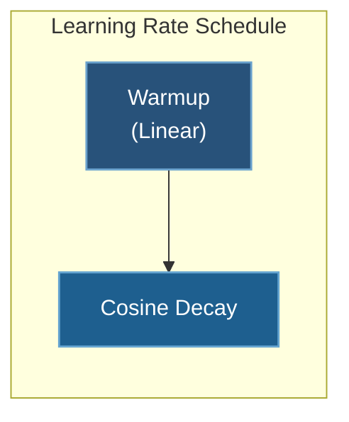
```mermaid
flowchart LR
    subgraph "Learning Rate Schedule"
        W["Warmup<br/>(Linear)"] --> C["Cosine Decay"]
    end

    style W fill:#28527a,stroke:#6aa2cd,stroke-width:1.5px,color:#ffffff
    style C fill:#1e5f8f,stroke:#63a3d0,stroke-width:1.5px,color:#ffffff
```

**Mathematical formulation:**

$$
\eta(t) = \begin{cases}
\eta_0 \cdot \frac{t+1}{T_{warmup}} & \text{if } t < T_{warmup} \\[10pt]
\eta_0 \cdot \frac{1}{2}\left(1 + \cos\left(\pi \cdot \frac{t - T_{warmup}}{T_{total} - T_{warmup}}\right)\right) & \text{otherwise}
\end{cases}
$$

#### Early Stopping

```python
patience_limit = 15
min_improvement = 1e-5

if avg_loss < best_loss - min_improvement:
    best_loss = avg_loss
    patience_counter = 0
else:
    patience_counter += 1
    if patience_counter >= patience_limit:
        break  # Stop training
```

### DeepSpeed Configuration

```json
{
  "train_batch_size": 32,
  "train_micro_batch_size_per_gpu": 32,
  "gradient_accumulation_steps": 1,
  "optimizer": {
    "type": "Adam",
    "params": {
      "lr": 1e-3
    }
  },
  "fp16": {
    "enabled": true
  }
}
```

### Training Parameters

| Parameter | Value | Description |
|-----------|-------|-------------|
| Learning Rate | $10^{-3}$ | Initial learning rate $\eta_0$ |
| LR Schedule | Warmup + Cosine | Gradual warmup, then decay |
| Warmup Epochs | 5 | Linear warmup period |
| Total Epochs | 50 | Maximum training epochs |
| Early Stopping | 15 epochs | Patience before stopping |
| Batch Size | 32 | Samples per gradient update |
| Parameters | ~208,000 | Total trainable parameters |

### Gradient Monitoring

The script tracks gradient norms to detect training issues:

```python
total_norm = 0.0
for p in model_engine.module.parameters():
    if p.grad is not None:
        param_norm = p.grad.data.norm(2)
        total_norm += param_norm.item() ** 2
total_norm = total_norm ** 0.5
```

This computes the L2 norm:

$$
\|\nabla \theta\|_2 = \sqrt{\sum_{i} \left(\frac{\partial \mathcal{L}}{\partial \theta_i}\right)^2}
$$

**Healthy patterns:**
- Gradual decrease and stabilization
- Values typically 0.01 - 1.0

**Problem indicators:**
- Sudden spikes: gradient explosion
- Near zero: vanishing gradients

### Expected Output

```
Epoch 49 Summary:
  - Avg Loss: 2.145678
  - Accuracy: 15.75%
  - Avg Grad Norm: 0.118765

Note: With synthetic random data, expect "Poor" quality.
With real MNIST, expect 95-99% accuracy.
```

### Using Real MNIST

Replace synthetic data with actual MNIST:

```python
from torchvision import datasets, transforms

transform = transforms.Compose([
    transforms.ToTensor(),
    transforms.Normalize((0.1307,), (0.3081,))
])

train_dataset = datasets.MNIST(
    './data',
    train=True,
    download=True,
    transform=transform
)
```

The normalization values are the mean (0.1307) and standard deviation (0.3081) of the MNIST dataset. Standardizing inputs matters for the same reason as in [the linear-regression example](/docs/tutorials/basic/neural-network#7-linear-regression-as-a-neural-network): it conditions the Hessian, so gradient descent does not have to traverse a badly-scaled valley.

---

## Where This Architecture Sits

The LeNet-style stack above — `conv → relu → pool`, repeated, then a classifier head — is the 1998 design. It is worth knowing what changed and why, because each step was driven by a specific failure of the previous one.

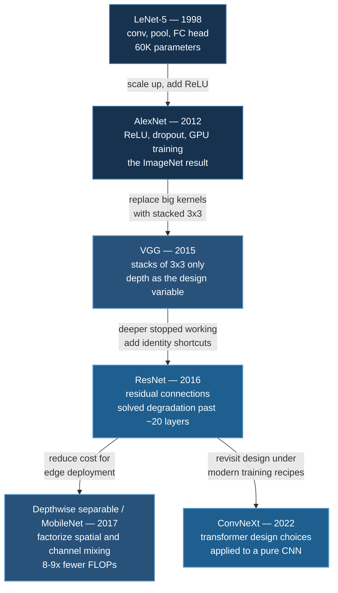
```mermaid
flowchart TB
    LENET["LeNet-5 — 1998<br/>conv, pool, FC head<br/>60K parameters"]
    ALEX["AlexNet — 2012<br/>ReLU, dropout, GPU training<br/>the ImageNet result"]
    VGG["VGG — 2015<br/>stacks of 3x3 only<br/>depth as the design variable"]
    RES["ResNet — 2016<br/>residual connections<br/>solved degradation past ~20 layers"]
    MOD["Depthwise separable / MobileNet — 2017<br/>factorize spatial and channel mixing<br/>8-9x fewer FLOPs"]
    NEXT["ConvNeXt — 2022<br/>transformer design choices<br/>applied to a pure CNN"]

    LENET -->|"scale up, add ReLU"| ALEX
    ALEX -->|"replace big kernels<br/>with stacked 3x3"| VGG
    VGG -->|"deeper stopped working<br/>add identity shortcuts"| RES
    RES -->|"reduce cost for<br/>edge deployment"| MOD
    RES -->|"revisit design under<br/>modern training recipes"| NEXT

    classDef deep fill:#08182a,stroke:#2d5a86,stroke-width:1.5px,color:#ffffff
    classDef base fill:#16324f,stroke:#3f6f9f,stroke-width:1.5px,color:#ffffff
    classDef steel fill:#28527a,stroke:#6aa2cd,stroke-width:1.5px,color:#ffffff
    classDef bright fill:#1e5f8f,stroke:#63a3d0,stroke-width:1.5px,color:#ffffff
    class LENET,ALEX base
    class VGG,MOD steel
    class RES,NEXT bright
```

**Residual connections** deserve the emphasis. He et al. (2016) observed *degradation*: a 56-layer plain CNN had higher **training** error than a 20-layer one — not overfitting, an optimization failure. The fix is to have each block learn a residual $\mathcal{F}(x)$ and output $\mathcal{F}(x) + x$. The identity path makes the block's Jacobian $\mathbf{I} + \mathbf{J}$, so the Jacobian product from [the backprop analysis](/docs/tutorials/basic/neural-network#42-the-algorithm) has singular values near 1 by construction and gradients reach early layers intact.

**Depthwise separable convolution** factorizes the standard operation into a per-channel spatial convolution followed by a $1\times1$ channel mixing, reducing cost from $C_{in}C_{out}k^2$ to $C_{in}k^2 + C_{in}C_{out}$ — roughly a $1/k^2$ saving, about 9× for $k=3$.

**On CNNs versus Vision Transformers.** ViT (Dosovitskiy et al., 2021) discards the convolutional prior for self-attention. It wins at very large data scale, where the weaker inductive bias becomes an advantage rather than a liability, and loses on smaller datasets, where convolution's built-in equivariance is worth more than flexibility. ConvNeXt (Liu et al., 2022) then showed that much of ViT's reported advantage came from *training recipes* rather than architecture: a pure CNN modernized with the same augmentation, optimizer, and schedule matches ViT on ImageNet. The honest summary is that architecture and training protocol are badly confounded in this literature.

---

## Summary

In this tutorial, you learned:

1. **Convolution Fundamentals**
   - Mathematical definition (continuous and discrete)
   - 2D convolution for images
   - The sliding window mechanism

2. **Image Representation**
   - Grayscale vs. RGB images
   - Tensor formats (NCHW)
   - Batch processing

3. **CNN Components**
   - Convolutional layers with stride and padding
   - Pooling layers (max, average, global)
   - Receptive fields and feature hierarchies

4. **Training Techniques**
   - Kaiming initialization for ReLU networks
   - Batch normalization and dropout
   - Learning rate scheduling

5. **DeepSpeed Integration**
   - Model setup and configuration
   - Mixed precision training
   - Gradient monitoring

## Next Steps

- [CIFAR-10 CNN](/docs/tutorials/basic/cifar10) - Real dataset with color images
- [Basic RNN](/docs/tutorials/basic/rnn) - Sequence modeling with LSTMs
- [DeepSpeed ZeRO Stages](/docs/getting-started/deepspeed-zero-stages) - Memory optimization

## References

**Foundational architectures**

1. LeCun, Y., Bottou, L., Bengio, Y., & Haffner, P. (1998). Gradient-based learning applied to document recognition. *Proceedings of the IEEE*, 86(11), 2278–2324. — LeNet-5.
2. Krizhevsky, A., Sutskever, I., & Hinton, G. E. (2012). ImageNet Classification with Deep Convolutional Neural Networks. *NeurIPS 2012*. — AlexNet.
3. Simonyan, K., & Zisserman, A. (2015). Very Deep Convolutional Networks for Large-Scale Image Recognition. *ICLR 2015*. [arXiv:1409.1556](https://arxiv.org/abs/1409.1556) — the stacked-3×3 argument.
4. He, K., Zhang, X., Ren, S., & Sun, J. (2016). Deep Residual Learning for Image Recognition. *CVPR 2016*. [arXiv:1512.03385](https://arxiv.org/abs/1512.03385) — degradation and residual connections.
5. Howard, A. G., Zhu, M., Chen, B., et al. (2017). MobileNets: Efficient Convolutional Neural Networks for Mobile Vision Applications. [arXiv:1704.04861](https://arxiv.org/abs/1704.04861) — depthwise separable convolution.
6. Liu, Z., Mao, H., Wu, C.-Y., Feichtenhofer, C., Darrell, T., & Xie, S. (2022). A ConvNet for the 2020s. *CVPR 2022*. [arXiv:2201.03545](https://arxiv.org/abs/2201.03545)
7. Dosovitskiy, A., Beyer, L., Kolesnikov, A., et al. (2021). An Image is Worth 16x16 Words: Transformers for Image Recognition at Scale. *ICLR 2021*. [arXiv:2010.11929](https://arxiv.org/abs/2010.11929)

**Convolution, equivariance, receptive fields**

8. Dumoulin, V., & Visin, F. (2016). A Guide to Convolution Arithmetic for Deep Learning. [arXiv:1603.07285](https://arxiv.org/abs/1603.07285) — the definitive reference for the output-size formulas.
9. Luo, W., Li, Y., Urtasun, R., & Zemel, R. (2016). Understanding the Effective Receptive Field in Deep Convolutional Neural Networks. *NeurIPS 2016*. [arXiv:1701.04128](https://arxiv.org/abs/1701.04128)
10. Cohen, T. S., & Welling, M. (2016). Group Equivariant Convolutional Networks. *ICML 2016*. [arXiv:1602.07576](https://arxiv.org/abs/1602.07576) — generalizes equivariance beyond translation.
11. Zhang, R. (2019). Making Convolutional Networks Shift-Invariant Again. *ICML 2019*. [arXiv:1904.11486](https://arxiv.org/abs/1904.11486)
12. Azulay, A., & Weiss, Y. (2019). Why do deep convolutional networks generalize so poorly to small image transformations? *JMLR*, 20(184). [arXiv:1805.12177](https://arxiv.org/abs/1805.12177)
13. Yu, F., & Koltun, V. (2016). Multi-Scale Context Aggregation by Dilated Convolutions. *ICLR 2016*. [arXiv:1511.07122](https://arxiv.org/abs/1511.07122)

**Initialization and normalization**

14. Glorot, X., & Bengio, Y. (2010). Understanding the difficulty of training deep feedforward neural networks. *AISTATS 2010*.
15. He, K., Zhang, X., Ren, S., & Sun, J. (2015). Delving Deep into Rectifiers. *ICCV 2015*. [arXiv:1502.01852](https://arxiv.org/abs/1502.01852) — the factor-of-2 ReLU correction.
16. Ioffe, S., & Szegedy, C. (2015). Batch Normalization. *ICML 2015*. [arXiv:1502.03167](https://arxiv.org/abs/1502.03167)
17. Santurkar, S., Tsipras, D., Ilyas, A., & Madry, A. (2018). How Does Batch Normalization Help Optimization? *NeurIPS 2018*. [arXiv:1805.11604](https://arxiv.org/abs/1805.11604) — refutes the internal-covariate-shift account.
18. Wu, Y., & He, K. (2018). Group Normalization. *ECCV 2018*. [arXiv:1803.08494](https://arxiv.org/abs/1803.08494) — batch-independent normalization for small micro-batches.
19. Srivastava, N., Hinton, G., Krizhevsky, A., Sutskever, I., & Salakhutdinov, R. (2014). Dropout: A Simple Way to Prevent Neural Networks from Overfitting. *JMLR*, 15(56), 1929–1958.
20. Li, X., Chen, S., Hu, X., & Yang, J. (2019). Understanding the Disharmony between Dropout and Batch Normalization by Variance Shift. *CVPR 2019*. [arXiv:1801.05134](https://arxiv.org/abs/1801.05134)

**Implementation and systems**

21. Chetlur, S., Woolley, C., Vandermersch, P., et al. (2014). cuDNN: Efficient Primitives for Deep Learning. [arXiv:1410.0759](https://arxiv.org/abs/1410.0759) — im2col + GEMM.
22. Lavin, A., & Gray, S. (2016). Fast Algorithms for Convolutional Neural Networks. *CVPR 2016*. [arXiv:1509.09308](https://arxiv.org/abs/1509.09308) — Winograd minimal filtering.
23. Loshchilov, I., & Hutter, F. (2017). SGDR: Stochastic Gradient Descent with Warm Restarts. *ICLR 2017*. [arXiv:1608.03983](https://arxiv.org/abs/1608.03983) — the cosine schedule used above.
24. Goyal, P., Dollár, P., Girshick, R., et al. (2017). Accurate, Large Minibatch SGD: Training ImageNet in 1 Hour. [arXiv:1706.02677](https://arxiv.org/abs/1706.02677) — linear LR scaling, warmup, and the SyncBN discussion of §BatchNorm.
