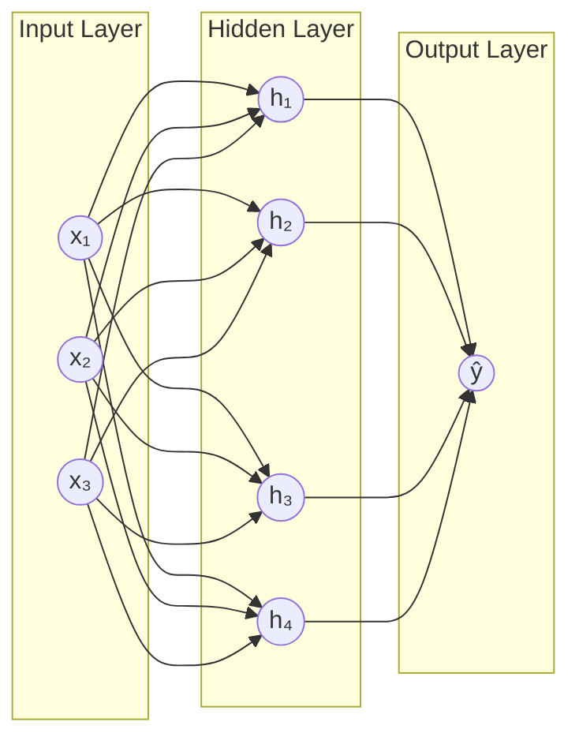
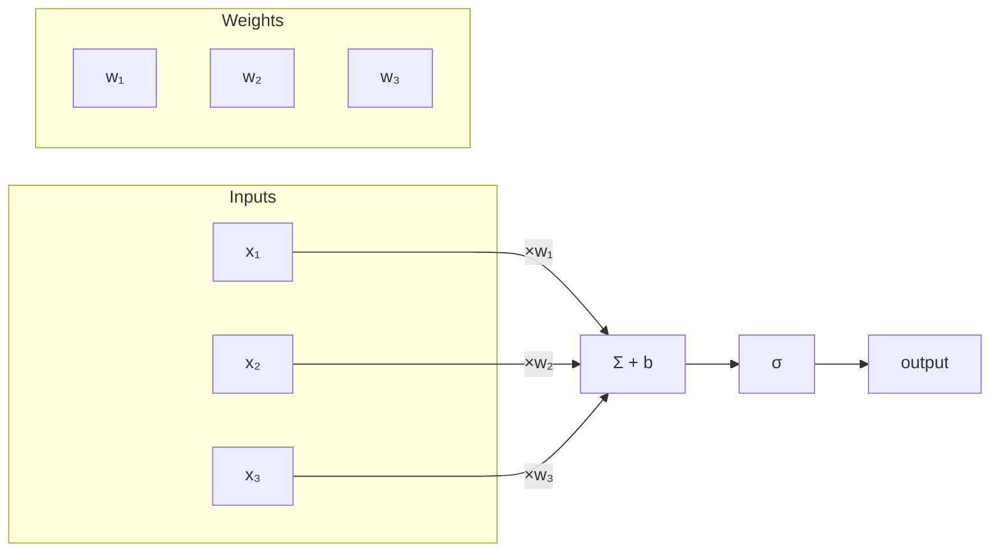
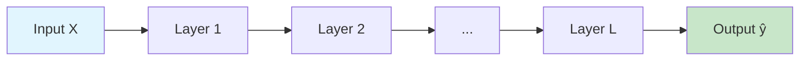
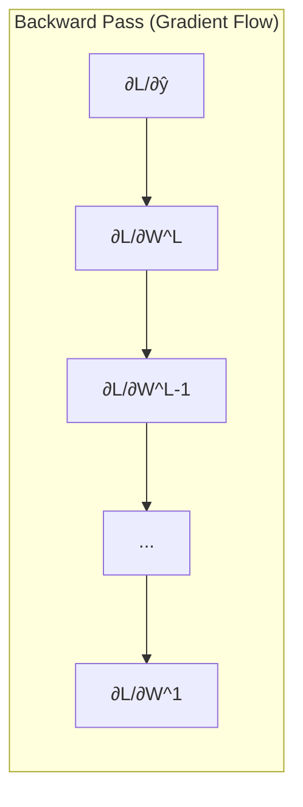
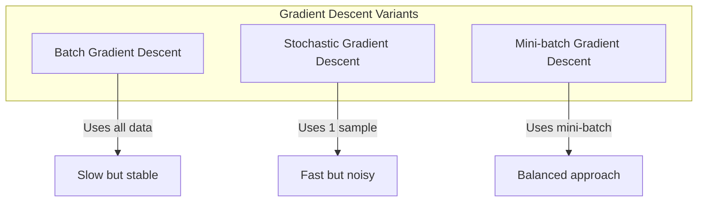
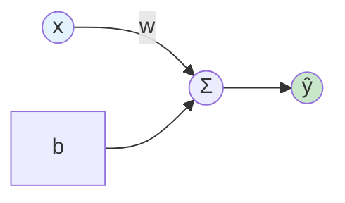
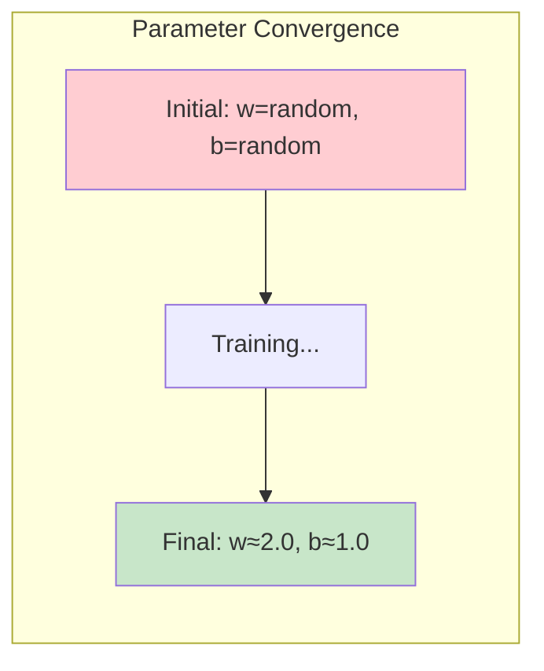

# Basic Neural Network

A comprehensive introduction to neural networks and training them with DeepSpeed for distributed computing.

## Introduction to Neural Networks

Neural networks are computational models inspired by the biological neural networks in the human brain. They form the foundation of modern deep learning and have revolutionized fields from computer vision to natural language processing.

### What is a Neural Network?

A neural network is a function approximator that learns to map inputs to outputs through a series of interconnected layers of artificial neurons. Each neuron receives inputs, applies weights and a bias, passes the result through an activation function, and produces an output.



### The Artificial Neuron (Perceptron)

The fundamental building block of a neural network is the **artificial neuron** or **perceptron**. It performs the following computation:

$$
z = \sum_{i=1}^{n} w_i x_i + b = \mathbf{w}^T \mathbf{x} + b
$$

Where:
- $\mathbf{x} = [x_1, x_2, ..., x_n]^T$ is the input vector
- $\mathbf{w} = [w_1, w_2, ..., w_n]^T$ is the weight vector
- $b$ is the bias term
- $z$ is the weighted sum (pre-activation)

The output of the neuron is obtained by applying an **activation function** $\sigma$:

$$
a = \sigma(z) = \sigma\left(\mathbf{w}^T \mathbf{x} + b\right)
$$



## Mathematical Foundations

### Activation Functions

Activation functions introduce **non-linearity** into the network, allowing it to learn complex patterns. Without activation functions, a neural network would simply be a linear transformation, regardless of depth.

#### Common Activation Functions

**1. Sigmoid (Logistic)**

$$
\sigma(z) = \frac{1}{1 + e^{-z}}
$$

- Output range: $(0, 1)$
- Derivative: $\sigma'(z) = \sigma(z)(1 - \sigma(z))$
- Use case: Binary classification (output layer)
- Issue: Vanishing gradients for large $|z|$

**2. Hyperbolic Tangent (tanh)**

$$
\tanh(z) = \frac{e^z - e^{-z}}{e^z + e^{-z}} = 2\sigma(2z) - 1
$$

- Output range: $(-1, 1)$
- Derivative: $\tanh'(z) = 1 - \tanh^2(z)$
- Use case: Hidden layers (zero-centered output)
- Issue: Still suffers from vanishing gradients

**3. Rectified Linear Unit (ReLU)**

$$
\text{ReLU}(z) = \max(0, z) = \begin{cases} z & \text{if } z > 0 \\ 0 & \text{if } z \leq 0 \end{cases}
$$

- Output range: $[0, \infty)$
- Derivative: $\text{ReLU}'(z) = \begin{cases} 1 & \text{if } z > 0 \\ 0 & \text{if } z \leq 0 \end{cases}$
- Use case: Hidden layers (most common choice)
- Advantage: Computationally efficient, mitigates vanishing gradients
- Issue: "Dying ReLU" problem (neurons that always output 0)

**4. Leaky ReLU**

$$
\text{LeakyReLU}(z) = \begin{cases} z & \text{if } z > 0 \\ \alpha z & \text{if } z \leq 0 \end{cases}
$$

Where $\alpha$ is a small constant (typically 0.01). This addresses the dying ReLU problem.

**5. Softmax (for multi-class classification)**

$$
\text{softmax}(z_i) = \frac{e^{z_i}}{\sum_{j=1}^{K} e^{z_j}}
$$

- Converts raw scores (logits) to probabilities
- Output sums to 1: $\sum_{i=1}^{K} \text{softmax}(z_i) = 1$

### Forward Propagation

Forward propagation is the process of computing the output of a neural network given an input. For a network with $L$ layers:



**Layer-by-layer computation:**

For layer $l$ (where $l = 1, 2, ..., L$):

$$
\mathbf{z}^{[l]} = \mathbf{W}^{[l]} \mathbf{a}^{[l-1]} + \mathbf{b}^{[l]}
$$

$$
\mathbf{a}^{[l]} = \sigma^{[l]}(\mathbf{z}^{[l]})
$$

Where:
- $\mathbf{a}^{[0]} = \mathbf{x}$ (input)
- $\mathbf{W}^{[l]} \in \mathbb{R}^{n_l \times n_{l-1}}$ is the weight matrix for layer $l$
- $\mathbf{b}^{[l]} \in \mathbb{R}^{n_l}$ is the bias vector for layer $l$
- $n_l$ is the number of neurons in layer $l$
- $\sigma^{[l]}$ is the activation function for layer $l$

**Matrix dimensions:**

| Layer | Weights $\mathbf{W}^{[l]}$ | Bias $\mathbf{b}^{[l]}$ | Activation $\mathbf{a}^{[l]}$ |
|-------|---------------------------|------------------------|------------------------------|
| 1 | $(n_1, n_0)$ | $(n_1, 1)$ | $(n_1, 1)$ |
| 2 | $(n_2, n_1)$ | $(n_2, 1)$ | $(n_2, 1)$ |
| $l$ | $(n_l, n_{l-1})$ | $(n_l, 1)$ | $(n_l, 1)$ |
| $L$ | $(n_L, n_{L-1})$ | $(n_L, 1)$ | $(n_L, 1)$ |

### Loss Functions

The loss function (or cost function) measures how well the network's predictions match the true values.

**1. Mean Squared Error (MSE) - for regression:**

$$
\mathcal{L}_{\text{MSE}} = \frac{1}{n} \sum_{i=1}^{n} (y_i - \hat{y}_i)^2
$$

**2. Binary Cross-Entropy - for binary classification:**

$$
\mathcal{L}_{\text{BCE}} = -\frac{1}{n} \sum_{i=1}^{n} \left[ y_i \log(\hat{y}_i) + (1 - y_i) \log(1 - \hat{y}_i) \right]
$$

**3. Categorical Cross-Entropy - for multi-class classification:**

$$
\mathcal{L}_{\text{CE}} = -\frac{1}{n} \sum_{i=1}^{n} \sum_{k=1}^{K} y_{i,k} \log(\hat{y}_{i,k})
$$

### Backpropagation

Backpropagation is the algorithm used to compute gradients of the loss function with respect to all parameters in the network. It applies the **chain rule** of calculus to efficiently compute these gradients.



**The Chain Rule:**

For a composite function $f(g(x))$:

$$
\frac{\partial f}{\partial x} = \frac{\partial f}{\partial g} \cdot \frac{\partial g}{\partial x}
$$

**Backpropagation Algorithm:**

1. **Compute output error:**
   $$\delta^{[L]} = \nabla_{\mathbf{a}^{[L]}} \mathcal{L} \odot \sigma'^{[L]}(\mathbf{z}^{[L]})$$

2. **Propagate error backward (for $l = L-1, L-2, ..., 1$):**
   $$\delta^{[l]} = \left((\mathbf{W}^{[l+1]})^T \delta^{[l+1]}\right) \odot \sigma'^{[l]}(\mathbf{z}^{[l]})$$

3. **Compute gradients:**
   $$\frac{\partial \mathcal{L}}{\partial \mathbf{W}^{[l]}} = \delta^{[l]} (\mathbf{a}^{[l-1]})^T$$
   $$\frac{\partial \mathcal{L}}{\partial \mathbf{b}^{[l]}} = \delta^{[l]}$$

Where $\odot$ denotes element-wise multiplication.

### Gradient Descent Optimization

Once we have the gradients, we update the parameters to minimize the loss:

$$
\mathbf{W}^{[l]} := \mathbf{W}^{[l]} - \eta \frac{\partial \mathcal{L}}{\partial \mathbf{W}^{[l]}}
$$

$$
\mathbf{b}^{[l]} := \mathbf{b}^{[l]} - \eta \frac{\partial \mathcal{L}}{\partial \mathbf{b}^{[l]}}
$$

Where $\eta$ is the **learning rate**.



#### Advanced Optimizers

**1. Momentum:**

$$
\mathbf{v}_t = \beta \mathbf{v}_{t-1} + (1-\beta) \nabla_\theta \mathcal{L}
$$
$$
\theta := \theta - \eta \mathbf{v}_t
$$

**2. Adam (Adaptive Moment Estimation):**

$$
\mathbf{m}_t = \beta_1 \mathbf{m}_{t-1} + (1-\beta_1) \nabla_\theta \mathcal{L}
$$
$$
\mathbf{v}_t = \beta_2 \mathbf{v}_{t-1} + (1-\beta_2) (\nabla_\theta \mathcal{L})^2
$$
$$
\hat{\mathbf{m}}_t = \frac{\mathbf{m}_t}{1 - \beta_1^t}, \quad \hat{\mathbf{v}}_t = \frac{\mathbf{v}_t}{1 - \beta_2^t}
$$
$$
\theta := \theta - \eta \frac{\hat{\mathbf{m}}_t}{\sqrt{\hat{\mathbf{v}}_t} + \epsilon}
$$

Typical values: $\beta_1 = 0.9$, $\beta_2 = 0.999$, $\epsilon = 10^{-8}$

## The Universal Approximation Theorem

One of the most important theoretical results in neural network theory is the **Universal Approximation Theorem**:

> A feedforward neural network with a single hidden layer containing a finite number of neurons can approximate any continuous function on compact subsets of $\mathbb{R}^n$, given appropriate activation functions.

This theorem guarantees that neural networks are powerful enough to represent virtually any function, though it doesn't tell us:
- How many neurons are needed
- How to find the right weights
- How long training will take

## Linear Regression as a Neural Network

The simplest neural network is **linear regression** - a single layer with no activation function:

$$
\hat{y} = \mathbf{w}^T \mathbf{x} + b = wx + b
$$

For our example, we'll learn the function $y = 2x + 1$:



**Target function:** $y = 2x + 1$

**Model:** $\hat{y} = wx + b$

**Goal:** Learn $w \approx 2$ and $b \approx 1$

---

## DeepSpeed Implementation

Now let's implement this using DeepSpeed for distributed training optimization.

### Overview

This example demonstrates:
- DeepSpeed initialization and training loop
- FP16 mixed precision training
- Multi-GPU distributed training
- Optional W&B experiment tracking

### Quick Start

```bash
cd 01_basic_neuralnet

# Single GPU
deepspeed --num_gpus=1 train_ds.py

# Multi-GPU
deepspeed --num_gpus=2 train_ds.py
```

### Model Architecture

```python
class SimpleModel(nn.Module):
    def __init__(self):
        super().__init__()
        self.linear = nn.Linear(1, 1)

    def forward(self, x):
        return self.linear(x)
```

This creates a single linear layer that computes:

$$
\hat{y} = wx + b
$$

Where `self.linear` contains learnable parameters $w$ (weight) and $b$ (bias).

### DeepSpeed Configuration

```json
{
  "train_batch_size": 32,
  "train_micro_batch_size_per_gpu": 32,
  "gradient_accumulation_steps": 1,
  "optimizer": {
    "type": "Adam",
    "params": {
      "lr": 1e-3
    }
  },
  "fp16": {
    "enabled": true
  }
}
```

**Configuration breakdown:**

| Parameter | Value | Description |
|-----------|-------|-------------|
| `train_batch_size` | 32 | Total batch size across all GPUs |
| `train_micro_batch_size_per_gpu` | 32 | Batch size per GPU per step |
| `gradient_accumulation_steps` | 1 | Steps before weight update |
| `optimizer.type` | Adam | Optimizer algorithm |
| `optimizer.params.lr` | 1e-3 | Learning rate $\eta$ |
| `fp16.enabled` | true | Enable mixed precision |

### Training Parameters

| Parameter | Value | Mathematical Notation |
|-----------|-------|----------------------|
| Learning Rate | $10^{-3}$ | $\eta = 0.001$ |
| Optimizer | Adam | $\beta_1=0.9, \beta_2=0.999$ |
| Epochs | 30 | Training iterations |
| Batch Size | 32 | Samples per gradient update |
| Loss Function | MSE | $\mathcal{L} = \frac{1}{n}\sum(y - \hat{y})^2$ |
| Precision | FP16 | 16-bit floating point |

### Key Concepts

#### DeepSpeed Initialization

```python
model_engine, _, _, _ = deepspeed.initialize(
    model=model,
    model_parameters=model.parameters(),
    config="ds_config.json"
)
```

This wraps your PyTorch model with DeepSpeed's optimization engine, enabling:
- Automatic mixed precision training
- Distributed data parallelism
- Memory optimization
- Gradient accumulation

#### Training Loop

```python
for epoch in range(num_epochs):
    for batch in dataloader:
        # Forward pass: compute ŷ = wx + b
        outputs = model_engine(inputs)

        # Compute loss: L = (1/n)Σ(y - ŷ)²
        loss = criterion(outputs, targets)

        # Backward pass: compute ∂L/∂w and ∂L/∂b
        model_engine.backward(loss)

        # Update: w := w - η(∂L/∂w)
        model_engine.step()
```

### Expected Output

After training, the model should learn parameters close to the true values:

```
Epoch 29/30 Summary: Avg Loss = 0.000123
  Learned Weight: 1.999876
  Learned Bias: 1.000234

Parameter Estimation Errors:
  Weight Error: 0.000124 (0.01%)
  Bias Error: 0.000234 (0.02%)

Model Quality: Excellent!
```

**Convergence visualization:**



### Why the Loss Decreases

During training, the MSE loss decreases because:

1. **Initially**: Random weights produce poor predictions
   - $\hat{y} = 0.5x - 0.3$ (random)
   - Loss is high

2. **Gradients guide updates**:
   - $\frac{\partial \mathcal{L}}{\partial w}$ tells us to increase $w$
   - $\frac{\partial \mathcal{L}}{\partial b}$ tells us to increase $b$

3. **Finally**: Weights converge to true values
   - $\hat{y} \approx 2x + 1$
   - Loss approaches zero

### Optional: Weights & Biases

Enable experiment tracking:

```bash
export WANDB_API_KEY="your_api_key"
deepspeed --num_gpus=1 train_ds_enhanced.py
```

The script works without W&B - it simply skips tracking.

## Troubleshooting

### CUDA Out of Memory

Reduce batch size:
```json
{
  "train_batch_size": 16,
  "train_micro_batch_size_per_gpu": 16
}
```

### FP16 Errors

Disable mixed precision:
```json
{
  "fp16": {
    "enabled": false
  }
}
```

### Loss Not Decreasing

- Check learning rate (try $10^{-4}$ or $10^{-2}$)
- Verify data is properly normalized
- Ensure batch size isn't too large

## Summary

In this tutorial, you learned:

1. **Neural Network Fundamentals**
   - Neurons, weights, biases, and activation functions
   - Forward propagation and the computation graph
   - Backpropagation and gradient descent

2. **Mathematical Foundations**
   - Loss functions (MSE, Cross-Entropy)
   - Optimization algorithms (SGD, Adam)
   - The Universal Approximation Theorem

3. **DeepSpeed Training**
   - Model initialization with DeepSpeed
   - Configuration for distributed training
   - Mixed precision (FP16) training

## Next Steps

- [Basic ConvNet](/docs/tutorials/basic/convnet) - Image classification with CNNs
- [DeepSpeed ZeRO Stages](/docs/getting-started/deepspeed-zero-stages) - Memory optimization techniques
- [Basic RNN](/docs/tutorials/basic/rnn) - Sequence modeling with LSTMs

## References

1. Goodfellow, I., Bengio, Y., & Courville, A. (2016). *Deep Learning*. MIT Press.
2. Nielsen, M. (2015). *Neural Networks and Deep Learning*. Determination Press.
3. Rumelhart, D. E., Hinton, G. E., & Williams, R. J. (1986). Learning representations by back-propagating errors. *Nature*, 323(6088), 533-536.
4. Kingma, D. P., & Ba, J. (2014). Adam: A method for stochastic optimization. *arXiv preprint arXiv:1412.6980*.
5. Cybenko, G. (1989). Approximation by superpositions of a sigmoidal function. *Mathematics of Control, Signals and Systems*, 2(4), 303-314.
