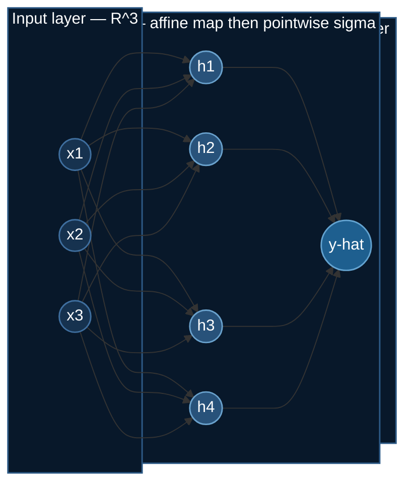
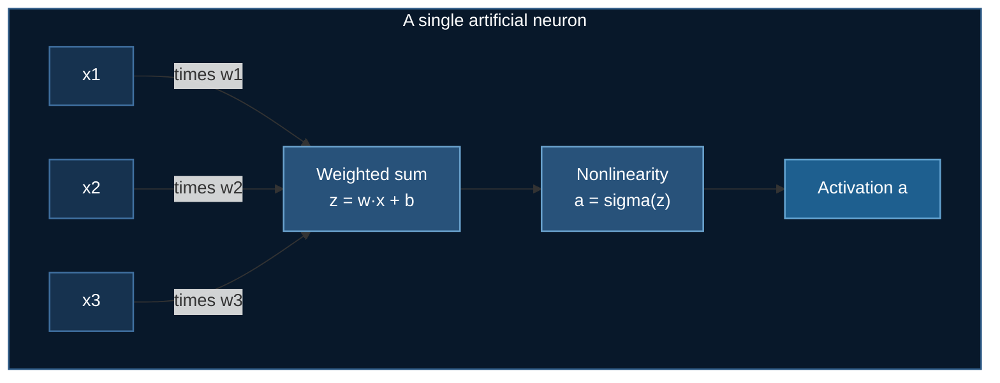
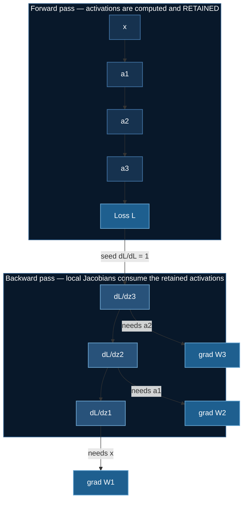
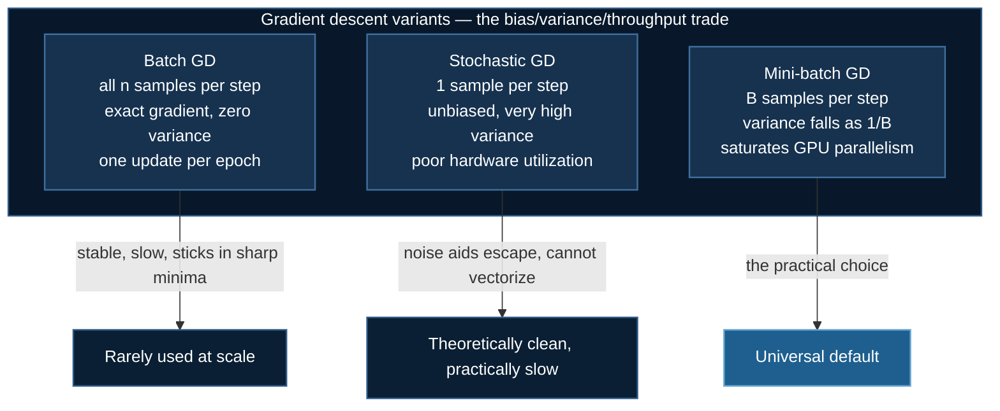
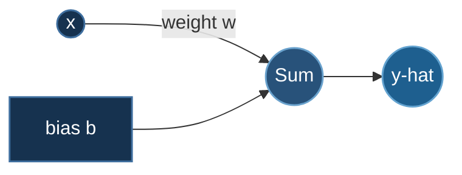
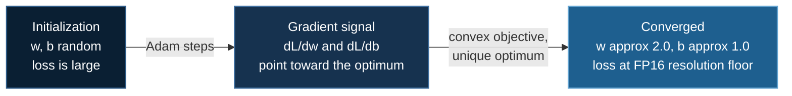
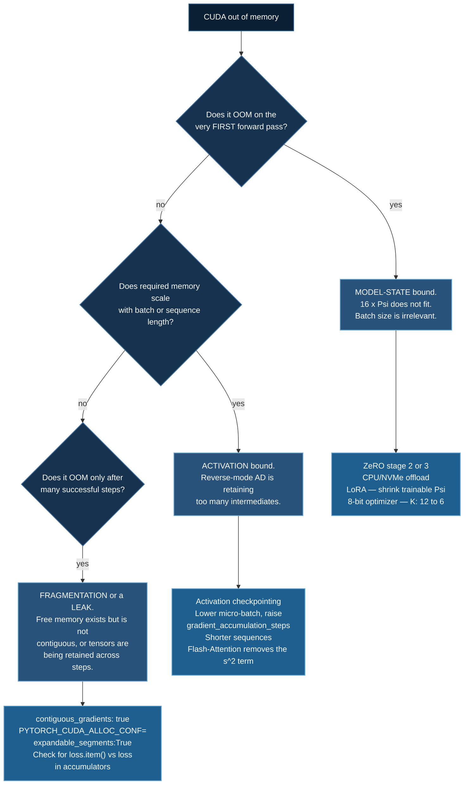

# Basic Neural Network

Feedforward networks from first principles — approximation theory, the statistical meaning of loss functions, reverse-mode differentiation, and a memory-accounting treatment of why CUDA runs out of memory — followed by a DeepSpeed implementation.

:::info Scope
The running example is deliberately trivial: recovering $y = 2x + 1$ with a one-parameter-pair linear model. The *point* is not the model. It is that every mechanism you will use at 70B parameters — the optimizer's memory footprint, FP16 loss scaling, the batch-size invariant, the allocator's fragmentation behaviour — is already present and observable at this scale, where you can reason about it exactly.
:::

## 1. What a Neural Network Is

A neural network is a **parametric family of functions** $f_\theta : \mathbb{R}^{n} \to \mathbb{R}^{m}$ built by composing affine maps with a fixed pointwise nonlinearity. Training is the search for a $\theta$ minimizing an empirical risk. That is the whole object; the biological framing is historical.

Formally, for depth $L$:

$$
f_\theta(\mathbf{x}) = \sigma^{[L]} \circ A^{[L]} \circ \sigma^{[L-1]} \circ A^{[L-1]} \circ \cdots \circ \sigma^{[1]} \circ A^{[1]} (\mathbf{x})
$$

where each $A^{[\ell]}(\mathbf{u}) = \mathbf{W}^{[\ell]}\mathbf{u} + \mathbf{b}^{[\ell]}$ is affine and $\sigma^{[\ell]}$ acts elementwise. The parameter vector $\theta$ is the concatenation of all $\mathbf{W}^{[\ell]}, \mathbf{b}^{[\ell]}$.

The nonlinearity is what makes the object non-trivial. If every $\sigma^{[\ell]}$ were the identity, the composition of affine maps would collapse:

$$
A^{[L]} \circ \cdots \circ A^{[1]}(\mathbf{x}) = \underbrace{\left(\prod_{\ell=L}^{1}\mathbf{W}^{[\ell]}\right)}_{\text{a single matrix}}\mathbf{x} + \tilde{\mathbf{b}}
$$

A 100-layer linear network has exactly the expressive power of one affine layer. **Depth buys nothing without nonlinearity** — a fact worth stating precisely, because it is the reason activation functions exist at all.


```mermaid
flowchart LR
    subgraph IN["Input layer — R^3"]
        x1(("x1"))
        x2(("x2"))
        x3(("x3"))
    end

    subgraph HID["Hidden layer — affine map then pointwise sigma"]
        h1(("h1"))
        h2(("h2"))
        h3(("h3"))
        h4(("h4"))
    end

    subgraph OUT["Output layer"]
        y1(("y-hat"))
    end

    x1 --> h1
    x1 --> h2
    x1 --> h3
    x1 --> h4
    x2 --> h1
    x2 --> h2
    x2 --> h3
    x2 --> h4
    x3 --> h1
    x3 --> h2
    x3 --> h3
    x3 --> h4

    h1 --> y1
    h2 --> y1
    h3 --> y1
    h4 --> y1

    classDef deep fill:#08182a,stroke:#2d5a86,stroke-width:1.5px,color:#ffffff
    classDef base fill:#16324f,stroke:#3f6f9f,stroke-width:1.5px,color:#ffffff
    classDef steel fill:#28527a,stroke:#6aa2cd,stroke-width:1.5px,color:#ffffff
    classDef bright fill:#1e5f8f,stroke:#63a3d0,stroke-width:1.5px,color:#ffffff
    class x1,x2,x3 base
    class h1,h2,h3,h4 steel
    class y1 bright
    class IN,HID,OUT deep
```

### 1.1 The single unit

$$
z = \sum_{i=1}^{n} w_i x_i + b = \mathbf{w}^{\top}\mathbf{x} + b, \qquad a = \sigma(z)
$$

The pre-activation $z$ is an inner product: geometrically, $\mathbf{w}$ is a direction in input space and $z$ measures the signed projection of $\mathbf{x}$ onto it, offset by $b$. The set $\{\mathbf{x} : \mathbf{w}^\top\mathbf{x} + b = 0\}$ is a hyperplane, and $\sigma$ determines how sharply the unit distinguishes the two sides of it. A ReLU unit computes a *hinge* about that hyperplane; a network of them tiles input space into polyhedral regions on each of which $f_\theta$ is affine.


```mermaid
flowchart LR
    subgraph UNIT["A single artificial neuron"]
        direction LR
        X1["x1"]
        X2["x2"]
        X3["x3"]
        SUM["Weighted sum<br/>z = w·x + b"]
        ACT["Nonlinearity<br/>a = sigma(z)"]
        OUTN["Activation a"]
    end

    X1 -->|"times w1"| SUM
    X2 -->|"times w2"| SUM
    X3 -->|"times w3"| SUM
    SUM --> ACT --> OUTN

    classDef deep fill:#08182a,stroke:#2d5a86,stroke-width:1.5px,color:#ffffff
    classDef base fill:#16324f,stroke:#3f6f9f,stroke-width:1.5px,color:#ffffff
    classDef steel fill:#28527a,stroke:#6aa2cd,stroke-width:1.5px,color:#ffffff
    classDef bright fill:#1e5f8f,stroke:#63a3d0,stroke-width:1.5px,color:#ffffff
    class X1,X2,X3 base
    class SUM,ACT steel
    class OUTN bright
    class UNIT deep
```

## 2. Activation Functions

### 2.1 The classical saturating pair

**Sigmoid.**

$$
\sigma(z) = \frac{1}{1 + e^{-z}}, \qquad \sigma'(z) = \sigma(z)\bigl(1 - \sigma(z)\bigr)
$$

The derivative is bounded by $\sigma'(z) \le \tfrac{1}{4}$, attained at $z = 0$. This bound is the entire story of why deep sigmoid networks were untrainable. Chaining $L$ layers multiplies $L$ such factors, so gradient magnitude decays at least as fast as $4^{-L}$ — at $L = 10$ that is a factor of $10^{-6}$ before any weight matrix is considered. Sigmoid is also not zero-centred, so all gradients entering a downstream weight share a sign, producing the characteristic zig-zag in optimization trajectories.

**Hyperbolic tangent.**

$$
\tanh(z) = \frac{e^{z} - e^{-z}}{e^{z} + e^{-z}} = 2\sigma(2z) - 1, \qquad \tanh'(z) = 1 - \tanh^{2}(z)
$$

Zero-centred and with $\tanh'(0) = 1$, so it is strictly better than sigmoid in hidden layers — but it still saturates, and the vanishing-gradient problem returns for $|z| \gtrsim 3$.

### 2.2 The piecewise-linear family

**ReLU** (Nair & Hinton, 2010; Glorot et al., 2011):

$$
\mathrm{ReLU}(z) = \max(0, z), \qquad \mathrm{ReLU}'(z) = \mathbb{1}[z > 0]
$$

The derivative is exactly $1$ on the active half-line. Gradients neither shrink nor grow as they pass through the nonlinearity — they are only *gated*. This is why ReLU, not any change to the architecture, is the single most important reason deep networks became trainable.

It is not differentiable at $z = 0$; frameworks return a subgradient (PyTorch uses $0$). This is harmless — the event $z = 0$ has measure zero.

Its failure mode is the **dying ReLU**: if a large gradient step drives $\mathbf{w}^\top\mathbf{x} + b < 0$ for every $\mathbf{x}$ in the data distribution, the unit outputs zero, receives zero gradient, and can never recover. It is permanently dead. Leaky ReLU addresses this directly:

$$
\mathrm{LeakyReLU}(z) = \begin{cases} z & z > 0 \\ \alpha z & z \le 0\end{cases}, \qquad \alpha \approx 0.01
$$

**GELU** (Hendrycks & Gimpel, 2016), the default in modern transformers:

$$
\mathrm{GELU}(z) = z\,\Phi(z), \qquad \Phi(z) = \tfrac{1}{2}\left[1 + \mathrm{erf}\!\left(\tfrac{z}{\sqrt{2}}\right)\right]
$$

It weights the input by the probability that a standard normal falls below it — a smooth, stochastic-regularizer-flavoured gate. Being smooth and non-monotonic near the origin, it admits small negative outputs and avoids the hard dead zone. **SiLU/Swish**, $z\,\sigma(z)$, is closely related, and **SwiGLU** — a gated variant — is used in LLaMA-family models.

### 2.3 Softmax

$$
\mathrm{softmax}(\mathbf{z})_i = \frac{e^{z_i}}{\sum_{j=1}^{K} e^{z_j}}
$$

Softmax is a normalizer, not a squashing function; it maps $\mathbb{R}^K$ onto the interior of the probability simplex. Two properties matter operationally:

**Shift invariance.** $\mathrm{softmax}(\mathbf{z} + c\mathbf{1}) = \mathrm{softmax}(\mathbf{z})$. Implementations exploit this by subtracting $\max_j z_j$ before exponentiating, which is what prevents $e^{z_i}$ from overflowing. In FP16, $e^{z}$ overflows at $z \approx 11.09$, so **without the max-subtraction trick softmax in half precision overflows almost immediately.** Never hand-roll it.

**Jacobian.** $\dfrac{\partial\,\mathrm{softmax}_i}{\partial z_j} = \mathrm{softmax}_i(\delta_{ij} - \mathrm{softmax}_j)$, which collapses to a strikingly simple form when composed with cross-entropy — see §3.3.

## 3. Loss Functions: What They Assume and When They Fail

The choice of loss is not a matter of taste. **Every loss is a negative log-likelihood under some noise model**, and picking one is picking a distributional assumption about your data. Getting this wrong is a modelling error, not a hyperparameter mistake.

Given data $\{(\mathbf{x}_i, y_i)\}_{i=1}^{n}$ and a model that outputs the parameters of a conditional distribution $p_\theta(y \mid \mathbf{x})$, maximum likelihood minimizes

$$
\mathcal{L}(\theta) = -\frac{1}{n}\sum_{i=1}^{n} \log p_\theta(y_i \mid \mathbf{x}_i)
$$

Everything below is a special case.

### 3.1 Mean Squared Error

$$
\mathcal{L}_{\mathrm{MSE}} = \frac{1}{n}\sum_{i=1}^{n}(y_i - \hat y_i)^2
$$

**Statistical identity.** Assume $y \mid \mathbf{x} \sim \mathcal{N}(f_\theta(\mathbf{x}), \varsigma^2)$ with fixed $\varsigma$. Then

$$
-\log p_\theta(y\mid\mathbf{x}) = \frac{(y - f_\theta(\mathbf{x}))^2}{2\varsigma^2} + \log\left(\varsigma\sqrt{2\pi}\right)
$$

The second term is constant in $\theta$, so minimizing MSE **is** Gaussian maximum likelihood. The minimizer of the population risk is the conditional mean, $f^\star(\mathbf{x}) = \mathbb{E}[y \mid \mathbf{x}]$.

| Pros | Cons |
|---|---|
| Smooth and strongly convex in $\hat y$; gradient $\propto$ residual, so it is self-scaling — large errors produce large corrections | **Quadratic sensitivity to outliers.** A single point at 10× the typical residual contributes 100× the loss and dominates the gradient |
| Correct choice when you want the conditional mean | Assumes **homoscedastic Gaussian** noise. Real data with heavy tails or input-dependent variance violates this |
| Gradient is exactly $\hat y - y$ for a linear output — trivially stable | Catastrophic when paired with a **saturating output activation** (see the box below) |
| Analytically tractable; closed-form solution in the linear case | Not scale-invariant — depends on the units of $y$, so learning rates must be retuned if you rescale targets |

:::danger Never pair MSE with a sigmoid output
With $\hat y = \sigma(z)$ and $\mathcal{L} = (y - \hat y)^2$, the chain rule gives
$$\frac{\partial\mathcal{L}}{\partial z} = -2(y - \hat y)\,\sigma'(z) = -2(y-\hat y)\,\sigma(z)(1-\sigma(z))$$
Consider a maximally wrong confident prediction: $y = 1$, $z = -10$, so $\hat y \approx 4.5\times10^{-5}$. The error term $(y - \hat y) \approx 1$ is as large as possible — but $\sigma'(-10) \approx 4.5\times10^{-5}$, so the gradient is $\approx 10^{-4}$. **The model is as wrong as it can be and learns almost nothing.** Cross-entropy exists precisely to cancel this factor.
:::

### 3.2 Robust regression alternatives

**Mean Absolute Error** ($L_1$): NLL of a **Laplace** likelihood; the population minimizer is the conditional *median*. Gradient is $\pm 1$ regardless of residual magnitude — bounded influence, hence robust — but it is constant near zero, so it does not anneal as you converge and it is non-differentiable at the origin.

**Huber loss**, the standard compromise:

$$
\mathcal{L}_\delta(r) = \begin{cases}
\tfrac{1}{2}r^2 & |r| \le \delta \\[4pt]
\delta\left(|r| - \tfrac{1}{2}\delta\right) & |r| > \delta
\end{cases}, \qquad r = y - \hat y
$$

Quadratic near zero (smooth convergence, self-annealing gradients) and linear in the tail (bounded influence). $C^1$ everywhere. The cost is a hyperparameter $\delta$ that must be set relative to the noise scale.

| Loss | Implied likelihood | Population minimizer | Outlier influence |
|---|---|---|---|
| MSE / $L_2$ | Gaussian | Conditional mean | Unbounded, grows linearly in $r$ |
| MAE / $L_1$ | Laplace | Conditional median | Bounded, constant |
| Huber | Gaussian core, Laplace tails | Between mean and median | Bounded beyond $\delta$ |
| Quantile / pinball | Asymmetric Laplace | Conditional $\tau$-quantile | Bounded |

### 3.3 Cross-entropy

Binary:

$$
\mathcal{L}_{\mathrm{BCE}} = -\frac{1}{n}\sum_{i=1}^{n}\Bigl[y_i\log\hat y_i + (1-y_i)\log(1-\hat y_i)\Bigr]
$$

Multi-class:

$$
\mathcal{L}_{\mathrm{CE}} = -\frac{1}{n}\sum_{i=1}^{n}\sum_{k=1}^{K} y_{i,k}\log \hat y_{i,k}
$$

**Statistical identity.** BCE is the Bernoulli NLL; categorical CE is the multinomial NLL. Equivalently, $\mathcal{L}_{\mathrm{CE}} = H(p_{\text{data}}, p_\theta)$, the cross-entropy between the empirical label distribution and the model's, which decomposes as $H(p) + D_{\mathrm{KL}}(p \,\|\, p_\theta)$ — minimizing it minimizes the KL divergence to the data distribution.

**The gradient identity that makes it work.** Compose softmax with cross-entropy and the Jacobian from §2.3 telescopes:

$$
\frac{\partial \mathcal{L}_{\mathrm{CE}}}{\partial z_k} = \hat y_k - y_k
$$

The saturating $\sigma'$ factor cancels *exactly*. Gradient magnitude is now proportional to the error itself, so a confidently wrong prediction produces a large gradient — the opposite of the MSE-plus-sigmoid pathology. This is the reason classification uses cross-entropy.

| Pros | Cons |
|---|---|
| Gradient $\hat y - y$ — no saturation, error-proportional updates | Unbounded: $-\log(\hat y)\to\infty$ as $\hat y \to 0$, so a single mislabelled example can produce an enormous gradient |
| A **strictly proper scoring rule** — uniquely minimized by the true conditional probabilities, so it yields calibrated probabilities | Numerically fragile if computed naively; requires the log-sum-exp trick |
| Convex in the logits for linear models | Degrades badly under severe class imbalance; the majority class dominates the sum |
| Information-theoretically principled (equals KL up to a constant) | Encourages over-confidence, especially with high-capacity models trained to zero training loss |

:::tip Always use the fused implementation
Use `nn.CrossEntropyLoss` on **logits**, never `nn.NLLLoss(torch.log(softmax(z)))`. The fused kernel computes $\log\sum_j e^{z_j}$ via the log-sum-exp trick, $\log\sum_j e^{z_j} = m + \log\sum_j e^{z_j - m}$ with $m = \max_j z_j$. The unfused version computes $\log(\hat y_k)$ where $\hat y_k$ may already have underflowed to $0$ in FP16, yielding `-inf` and then `NaN`. The same applies to `BCEWithLogitsLoss` over `BCELoss`.
:::

**Variants worth knowing.** *Label smoothing* (Szegedy et al., 2016) replaces the one-hot target with $(1-\varepsilon)\mathbf{y} + \varepsilon/K$, bounding the logit gap and improving calibration. *Focal loss* (Lin et al., 2017) reweights by $(1 - \hat y_k)^\gamma$, down-weighting easy examples under extreme imbalance.

## 4. Reverse-Mode Differentiation

**Backpropagation is reverse-mode automatic differentiation applied to a scalar-valued composition.** The name predates the AD framing (Rumelhart, Hinton & Williams, 1986), but the framing is the one that explains its cost.

### 4.1 Why reverse mode

For $f: \mathbb{R}^{n} \to \mathbb{R}^{m}$ built from elementary operations, the chain rule can be evaluated in either associative order:

- **Forward mode** costs $O(n)$ passes — one per input dimension — and is efficient when $n \ll m$.
- **Reverse mode** costs $O(m)$ passes — one per *output* — and is efficient when $m \ll n$.

A loss function has $m = 1$ and $n = |\theta|$, potentially $10^{11}$. Reverse mode computes the entire gradient in a **single** backward sweep at a cost of roughly 2× the forward pass, independent of parameter count. Forward mode would require $10^{11}$ passes. This asymmetry is why deep learning is computationally possible at all.

The price is memory: reverse mode must **retain intermediate activations** from the forward pass to evaluate local Jacobians on the way back. Compute is cheap and memory is dear — which is precisely the trade activation checkpointing exploits, and a major reason training needs far more memory than inference.


```mermaid
flowchart TB
    subgraph FWD["Forward pass — activations are computed and RETAINED"]
        direction LR
        A0["x"] --> A1["a1"] --> A2["a2"] --> A3["a3"] --> LOSS["Loss L"]
    end

    subgraph BWD["Backward pass — local Jacobians consume the retained activations"]
        direction RL
        D3["dL/dz3"] --> D2["dL/dz2"] --> D1["dL/dz1"]
    end

    LOSS -->|"seed dL/dL = 1"| D3
    D3 -->|"needs a2"| G3["grad W3"]
    D2 -->|"needs a1"| G2["grad W2"]
    D1 -->|"needs x"| G1["grad W1"]

    classDef deep fill:#08182a,stroke:#2d5a86,stroke-width:1.5px,color:#ffffff
    classDef base fill:#16324f,stroke:#3f6f9f,stroke-width:1.5px,color:#ffffff
    classDef steel fill:#28527a,stroke:#6aa2cd,stroke-width:1.5px,color:#ffffff
    classDef bright fill:#1e5f8f,stroke:#63a3d0,stroke-width:1.5px,color:#ffffff
    class A0,A1,A2,A3 base
    class D1,D2,D3 steel
    class LOSS,G1,G2,G3 bright
    class FWD,BWD deep
```

### 4.2 The algorithm

Define the **error signal** $\delta^{[\ell]} = \partial\mathcal{L}/\partial\mathbf{z}^{[\ell]}$, the gradient with respect to layer $\ell$'s pre-activations. Then:

1. **Output layer:**
   $$\delta^{[L]} = \nabla_{\mathbf{a}^{[L]}}\mathcal{L} \odot \dot\sigma^{[L]}\!\left(\mathbf{z}^{[L]}\right)$$

2. **Recursion**, for $\ell = L-1, \dots, 1$:
   $$\delta^{[\ell]} = \left(\left(\mathbf{W}^{[\ell+1]}\right)^{\top}\delta^{[\ell+1]}\right)\odot \dot\sigma^{[\ell]}\!\left(\mathbf{z}^{[\ell]}\right)$$

3. **Parameter gradients:**
   $$\frac{\partial\mathcal{L}}{\partial\mathbf{W}^{[\ell]}} = \delta^{[\ell]}\left(\mathbf{a}^{[\ell-1]}\right)^{\top}, \qquad \frac{\partial\mathcal{L}}{\partial\mathbf{b}^{[\ell]}} = \delta^{[\ell]}$$

Here $\odot$ is the Hadamard product and $\dot\sigma$ denotes $\sigma'$.

Step 2 is where **vanishing and exploding gradients** originate. Unrolling it gives

$$
\delta^{[1]} = \left(\prod_{\ell=2}^{L}\left(\mathbf{W}^{[\ell]}\right)^{\top}\mathbf{D}^{[\ell]}\right)\delta^{[L]}, \qquad \mathbf{D}^{[\ell]} = \mathrm{diag}\!\left(\dot\sigma^{[\ell]}(\mathbf{z}^{[\ell]})\right)
$$

a product of $L-1$ matrices. If the typical singular value of $\mathbf{W}^{[\ell]\top}\mathbf{D}^{[\ell]}$ is $s$, gradient magnitude scales as $s^{L}$ — exponential decay for $s<1$, explosion for $s>1$. Only $s \approx 1$ is stable, and it is a knife-edge.

The three standard remedies all target this product directly: **initialization** to make $s \approx 1$ at step zero (He et al., 2015: $\mathrm{Var}(w) = 2/n_{\text{in}}$ for ReLU, correcting Glorot's $1/n_{\text{in}}$ for the halved variance ReLU induces); **normalization layers** to keep $\mathbf{z}^{[\ell]}$ in the non-saturating region throughout training; and **residual connections** (He et al., 2016), which add an identity path so the Jacobian becomes $\mathbf{I} + \mathbf{J}$, keeping singular values near 1 by construction.

## 5. Optimization

### 5.1 Gradient descent and its variants

$$
\theta_{t+1} = \theta_t - \eta\,\nabla_\theta\mathcal{L}(\theta_t)
$$

The variants differ only in what estimates $\nabla_\theta\mathcal{L}$:


```mermaid
flowchart TB
    subgraph GD["Gradient descent variants — the bias/variance/throughput trade"]
        direction TB
        BGD["Batch GD<br/>all n samples per step<br/>exact gradient, zero variance<br/>one update per epoch"]
        SGD["Stochastic GD<br/>1 sample per step<br/>unbiased, very high variance<br/>poor hardware utilization"]
        MBGD["Mini-batch GD<br/>B samples per step<br/>variance falls as 1/B<br/>saturates GPU parallelism"]
    end

    BGD -->|"stable, slow, sticks in sharp minima"| R1["Rarely used at scale"]
    SGD -->|"noise aids escape, cannot vectorize"| R2["Theoretically clean, practically slow"]
    MBGD -->|"the practical choice"| R3["Universal default"]

    classDef deep fill:#08182a,stroke:#2d5a86,stroke-width:1.5px,color:#ffffff
    classDef base fill:#16324f,stroke:#3f6f9f,stroke-width:1.5px,color:#ffffff
    classDef bright fill:#1e5f8f,stroke:#63a3d0,stroke-width:1.5px,color:#ffffff
    classDef dark fill:#0a1f33,stroke:#2d5a86,stroke-width:1.5px,color:#ffffff
    class BGD,SGD,MBGD base
    class R3 bright
    class R1,R2 dark
    class GD deep
```

The mini-batch gradient is an unbiased estimator with variance $\mathrm{Var} \propto \varsigma^2/B$. Halving noise therefore requires **quadrupling** the batch — the diminishing return that motivates the linear scaling rule ($\eta \propto B$) and its eventual breakdown past a critical batch size (McCandlish et al., 2018).

### 5.2 Momentum and Adam

**Momentum** accumulates an exponentially weighted average of past gradients, damping oscillation across high-curvature directions:

$$
\mathbf{v}_t = \beta\mathbf{v}_{t-1} + (1-\beta)\nabla_\theta\mathcal{L}, \qquad \theta_{t+1} = \theta_t - \eta\mathbf{v}_t
$$

**Adam** (Kingma & Ba, 2015) additionally tracks a second moment, giving each coordinate its own effective step size:

$$
\mathbf{m}_t = \beta_1\mathbf{m}_{t-1} + (1-\beta_1)\mathbf{g}_t, \qquad
\mathbf{v}_t = \beta_2\mathbf{v}_{t-1} + (1-\beta_2)\mathbf{g}_t^{\odot 2}
$$

$$
\hat{\mathbf{m}}_t = \frac{\mathbf{m}_t}{1-\beta_1^{\,t}}, \qquad
\hat{\mathbf{v}}_t = \frac{\mathbf{v}_t}{1-\beta_2^{\,t}}, \qquad
\theta_{t+1} = \theta_t - \eta\,\frac{\hat{\mathbf{m}}_t}{\sqrt{\hat{\mathbf{v}}_t} + \epsilon}
$$

Typical values: $\beta_1 = 0.9$, $\beta_2 = 0.999$, $\epsilon = 10^{-8}$.

Two observations that matter downstream:

**Bias correction is not cosmetic.** Initializing $\mathbf{m}_0 = \mathbf{v}_0 = \mathbf{0}$ biases the estimates toward zero early on. Without the $1/(1-\beta_i^t)$ correction the first steps are enormously mis-scaled — which is also why Adam wants a **warmup** schedule when $\beta_2$ is large.

**Adam costs memory.** It stores $\mathbf{m}$ and $\mathbf{v}$ per parameter, plus an FP32 master copy under mixed precision — **12 bytes per parameter** against 2 for the FP16 weight itself. This single fact is the origin of the ZeRO stages; see [DeepSpeed ZeRO Stages](/docs/getting-started/deepspeed-zero-stages).

Note also that the Adam update is **elementwise**: coordinate $j$ depends only on $g_j, m_j, v_j$. That separability is what makes optimizer-state partitioning exactly correct rather than an approximation.

## 6. Approximation Theory: What Networks Can and Cannot Do

**Universal Approximation Theorem** (Cybenko, 1989; Hornik, 1991). Let $\sigma$ be continuous, non-polynomial. For any continuous $f$ on a compact $\mathcal{K}\subset\mathbb{R}^{n}$ and any $\varepsilon>0$, there exist $N$, $\mathbf{w}_i$, $b_i$, $\alpha_i$ with

$$
\sup_{\mathbf{x}\in\mathcal{K}}\left| f(\mathbf{x}) - \sum_{i=1}^{N}\alpha_i\,\sigma\!\left(\mathbf{w}_i^{\top}\mathbf{x}+b_i\right)\right| < \varepsilon
$$

A single hidden layer suffices. But read the quantifiers carefully — the theorem is **existential and non-constructive**. It does not bound $N$, does not say the weights are findable by gradient descent, and says nothing about generalization. It rules out one failure mode (insufficient expressiveness) and is silent on the two that actually bite: optimization and statistical efficiency.

:::note Why depth, then?
Width-based universality is not an argument for shallow networks, because the required $N$ can be *exponential* in the input dimension. **Depth separation** results make this precise: Telgarsky (2016) exhibits functions computable by a $\Theta(k^3)$-depth ReLU network that any network of depth $O(k)$ needs $\Omega(2^{k})$ units to approximate. Eldan & Shamir (2016) give a function representable by a small 3-layer network requiring exponential width at 2 layers. Depth is exponentially more parameter-efficient for structured, compositional targets — which is what real data tends to be.
:::

## 7. Linear Regression as a Neural Network

The degenerate case: one layer, no activation.

$$
\hat y = \mathbf{w}^{\top}\mathbf{x} + b = wx + b
$$


```mermaid
flowchart LR
    XIN(("x")) -->|"weight w"| SUM(("Sum"))
    BIAS["bias b"] --> SUM
    SUM --> YOUT(("y-hat"))

    classDef base fill:#16324f,stroke:#3f6f9f,stroke-width:1.5px,color:#ffffff
    classDef steel fill:#28527a,stroke:#6aa2cd,stroke-width:1.5px,color:#ffffff
    classDef bright fill:#1e5f8f,stroke:#63a3d0,stroke-width:1.5px,color:#ffffff
    class XIN,BIAS base
    class SUM steel
    class YOUT bright
```

**Target:** $y = 2x + 1$. **Model:** $\hat y = wx + b$. **Goal:** recover $w \approx 2$, $b \approx 1$.

This problem is convex with a unique global optimum and a closed-form solution, so we know the right answer in advance. That makes it an ideal instrument: any deviation from $(2, 1)$ is attributable to the *machinery* — precision, batch invariants, loss scaling — not to the optimization landscape.

The MSE objective is

$$
\mathcal{L}(w,b) = \frac{1}{n}\sum_{i=1}^{n}\left(y_i - wx_i - b\right)^2
$$

with gradients

$$
\frac{\partial\mathcal{L}}{\partial w} = -\frac{2}{n}\sum_i x_i(y_i - \hat y_i), \qquad
\frac{\partial\mathcal{L}}{\partial b} = -\frac{2}{n}\sum_i (y_i - \hat y_i)
$$

Its Hessian is constant, $\mathbf{H} = \tfrac{2}{n}\mathbf{X}^\top\mathbf{X}$, so the condition number $\kappa(\mathbf{H})$ is fixed by the data. Since $x \sim \mathcal{N}(0,1)$ here, $\kappa$ is near 1 and convergence is fast. Skip the input standardization and $\kappa$ blows up — the concrete reason "normalize your inputs" is advice rather than superstition.

---

## 8. DeepSpeed Implementation

### 8.1 Quick start

```bash
cd 01_basics/01_neuralnet

# Single GPU
deepspeed --num_gpus=1 train_ds.py

# Multi-GPU
deepspeed --num_gpus=2 train_ds.py

# With W&B tracking and early stopping
export WANDB_API_KEY="your_api_key"
deepspeed --num_gpus=1 train_ds_enhanced.py
```

### 8.2 Model

```python
class SimpleModel(nn.Module):
    def __init__(self):
        super().__init__()
        self.linear = nn.Linear(1, 1)

    def forward(self, x: torch.Tensor) -> torch.Tensor:
        return self.linear(x)
```

`nn.Linear(1, 1)` holds two learnable scalars — `weight` ($w$) and `bias` ($b$).

### 8.3 Configuration

```json
{
  "train_batch_size": 32,
  "train_micro_batch_size_per_gpu": 32,
  "gradient_accumulation_steps": 1,
  "optimizer": {
    "type": "Adam",
    "params": { "lr": 1e-3 }
  },
  "fp16": { "enabled": true }
}
```

| Parameter | Value | Meaning |
|---|---|---|
| `train_batch_size` | 32 | **Global** batch across all GPUs and accumulation steps |
| `train_micro_batch_size_per_gpu` | 32 | Samples per GPU per forward pass |
| `gradient_accumulation_steps` | 1 | Micro-steps before an optimizer step |
| `optimizer.type` | Adam | $\beta_1=0.9$, $\beta_2=0.999$ |
| `optimizer.params.lr` | 1e-3 | Learning rate $\eta$ |
| `fp16.enabled` | true | Mixed precision with dynamic loss scaling |

:::warning The batch-size invariant
DeepSpeed asserts, at startup, that

$$
\texttt{train\_batch\_size} = \texttt{train\_micro\_batch\_size\_per\_gpu} \times \texttt{gradient\_accumulation\_steps} \times N_{\text{gpus}}
$$

The config above is valid for **one** GPU. Launch it with `--num_gpus=2` and $32 \ne 32\times1\times2$, and the run aborts immediately. Either update the config or set exactly one of the three fields to `"auto"` and let DeepSpeed derive it. This is the single most common first-run failure in this course.
:::

### 8.4 Initialization and the training loop

```python
model_engine, optimizer, _, _ = deepspeed.initialize(
    model=model,
    model_parameters=model.parameters(),
    config="ds_config.json",
)
```

`model_engine` is not merely a wrapper — it replaces the optimizer, installs gradient hooks, and takes ownership of the backward and step calls. Consequently the loop uses `model_engine.backward(loss)` and `model_engine.step()`, **not** `loss.backward()` and `optimizer.step()`:

```python
for epoch in range(num_epochs):
    for inputs, targets in dataloader:
        inputs  = inputs.to(model_engine.device)
        targets = targets.to(model_engine.device)

        outputs = model_engine(inputs)            # y-hat = wx + b
        loss = criterion(outputs, targets)        # MSE

        model_engine.backward(loss)               # scales loss, accumulates grads
        model_engine.step()                       # unscales, clips, steps, zeroes
```

Three things `model_engine.backward()` does that `loss.backward()` does not:

1. Multiplies the loss by the **dynamic loss scale** before differentiating (§8.5).
2. Triggers gradient reduction across ranks — bucketed and overlapped with backward compute.
3. Handles gradient accumulation, reducing only on accumulation boundaries.

And `model_engine.step()` unscales gradients, checks for overflow, applies clipping, runs the optimizer, and **zeroes gradients**. There is no `optimizer.zero_grad()` — adding one is harmless here but signals a misunderstanding of ownership.

### 8.5 FP16 and dynamic loss scaling

FP16 has a 10-bit mantissa and, critically, a narrow exponent range: normal values span roughly $6\times10^{-5}$ to $65504$. Gradients in a converging network are routinely $10^{-7}$ or smaller — **below the FP16 subnormal floor, where they flush to exactly zero.** Left alone, mixed-precision training silently stops learning.

Loss scaling (Micikevicius et al., 2018) fixes this by exploiting linearity of differentiation. Multiply the loss by $S$ before backward:

$$
\nabla_\theta (S\cdot\mathcal{L}) = S\cdot\nabla_\theta\mathcal{L}
$$

Every gradient is shifted up by $S$ into the representable range; divide by $S$ before the optimizer step and the update is mathematically unchanged. DeepSpeed selects $S$ **dynamically**: start high, and whenever an `inf`/`NaN` appears in the gradients, *skip that step* and halve $S$; after a run of clean steps, double it. This is a feedback controller tracking the largest $S$ that does not overflow.

:::note Skipped steps at the start of training are normal
Log lines like `OVERFLOW! Skipping step. Reducing loss scale to 32768.0` in the first iterations are the controller calibrating, not an error. Persistent overflow past the first few dozen steps is a genuine problem — usually a learning rate that is too high, or an unfused softmax/cross-entropy. **BF16 avoids the whole mechanism**: it has FP32's exponent range with a 7-bit mantissa, so it does not need loss scaling. On Ampere or newer, prefer `"bf16": {"enabled": true}` unless you have a specific reason not to.
:::

### 8.6 Expected output

```
Epoch 29/30 Summary: Avg Loss = 0.000123
  Learned Weight: 1.999876
  Learned Bias: 1.000234

Parameter Estimation Errors:
  Weight Error: 0.000124 (0.01%)
  Bias Error: 0.000234 (0.02%)

Model Quality: Excellent!
```

The loss floors near $10^{-4}$ rather than $0$. That floor is **FP16 resolution**, not an optimization failure: near $\hat y \approx 2$, consecutive FP16 values differ by $\approx 10^{-3}$, so parameters cannot be resolved more finely. Switching to FP32 drives the loss several orders of magnitude lower. A useful demonstration that in mixed precision, *the arithmetic is often the error floor.*


```mermaid
flowchart LR
    INIT["Initialization<br/>w, b random<br/>loss is large"]
    GRAD["Gradient signal<br/>dL/dw and dL/db<br/>point toward the optimum"]
    CONV["Converged<br/>w approx 2.0, b approx 1.0<br/>loss at FP16 resolution floor"]

    INIT -->|"Adam steps"| GRAD -->|"convex objective,<br/>unique optimum"| CONV

    classDef base fill:#16324f,stroke:#3f6f9f,stroke-width:1.5px,color:#ffffff
    classDef dark fill:#0a1f33,stroke:#2d5a86,stroke-width:1.5px,color:#ffffff
    classDef bright fill:#1e5f8f,stroke:#63a3d0,stroke-width:1.5px,color:#ffffff
    class INIT dark
    class GRAD base
    class CONV bright
```

---

## 9. CUDA Out of Memory: A Memory-Accounting Treatment

"Reduce the batch size" is a reflex, not a diagnosis. Sometimes it is the wrong move. Here is the accounting that tells you which case you are in.

### 9.1 Where the memory goes

Total GPU memory during training decomposes as

$$
M_{\text{total}} = \underbrace{M_{\text{params}} + M_{\text{grads}} + M_{\text{opt}}}_{\text{model states — independent of batch size}} + \underbrace{M_{\text{act}}}_{\text{activations — scales with batch}} + \underbrace{M_{\text{frag}} + M_{\text{ctx}}}_{\text{overhead}}
$$

**Model states**, for $\Psi$ parameters under mixed-precision Adam:

$$
M_{\text{params}} = 2\Psi, \quad M_{\text{grads}} = 2\Psi, \quad M_{\text{opt}} = \underbrace{4\Psi}_{\text{fp32 master}} + \underbrace{4\Psi}_{m} + \underbrace{4\Psi}_{v} = 12\Psi
$$

$$
\boxed{M_{\text{model states}} = 16\Psi \text{ bytes}}
$$

A 7B model needs **112 GB** of model states before a single activation is allocated — more than an 80 GB A100. No batch size reduction helps, because none of these terms contains the batch size.

**Activations** are what reverse-mode AD retains (§4.1). For a transformer, roughly

$$
M_{\text{act}} \approx L \cdot b \cdot s \cdot h \cdot c \;+\; \underbrace{L\cdot a\cdot b\cdot s^2}_{\text{attention matrices}}
$$

with $L$ layers, batch $b$, sequence length $s$, hidden size $h$, $a$ heads, and a small constant $c$ counting retained tensors per layer. Note the $s^2$ term — **doubling sequence length quadruples attention activation memory**, which is why long-context runs OOM so abruptly.

**CUDA context** is ~300–600 MB per process, before your model exists.

### 9.2 Diagnosis


```mermaid
flowchart TB
    OOM["CUDA out of memory"]
    Q1{"Does it OOM on the<br/>very FIRST forward pass?"}
    Q2{"Does required memory scale<br/>with batch or sequence length?"}
    Q3{"Does it OOM only after<br/>many successful steps?"}

    MS["MODEL-STATE bound.<br/>16 x Psi does not fit.<br/>Batch size is irrelevant."]
    ACT["ACTIVATION bound.<br/>Reverse-mode AD is retaining<br/>too many intermediates."]
    FRAG["FRAGMENTATION or a LEAK.<br/>Free memory exists but is not<br/>contiguous, or tensors are<br/>being retained across steps."]

    FIXMS["ZeRO stage 2 or 3<br/>CPU/NVMe offload<br/>LoRA — shrink trainable Psi<br/>8-bit optimizer — K: 12 to 6"]
    FIXACT["Activation checkpointing<br/>Lower micro-batch, raise<br/>gradient_accumulation_steps<br/>Shorter sequences<br/>Flash-Attention removes the s^2 term"]
    FIXFRAG["contiguous_gradients: true<br/>PYTORCH_CUDA_ALLOC_CONF=<br/>expandable_segments:True<br/>Check for loss.item() vs loss<br/>in accumulators"]

    OOM --> Q1
    Q1 -->|"yes"| MS
    Q1 -->|"no"| Q2
    Q2 -->|"yes"| ACT
    Q2 -->|"no"| Q3
    Q3 -->|"yes"| FRAG

    MS --> FIXMS
    ACT --> FIXACT
    FRAG --> FIXFRAG

    classDef deep fill:#08182a,stroke:#2d5a86,stroke-width:1.5px,color:#ffffff
    classDef base fill:#16324f,stroke:#3f6f9f,stroke-width:1.5px,color:#ffffff
    classDef steel fill:#28527a,stroke:#6aa2cd,stroke-width:1.5px,color:#ffffff
    classDef bright fill:#1e5f8f,stroke:#63a3d0,stroke-width:1.5px,color:#ffffff
    classDef dark fill:#0a1f33,stroke:#2d5a86,stroke-width:1.5px,color:#ffffff
    class OOM dark
    class Q1,Q2,Q3 base
    class MS,ACT,FRAG steel
    class FIXMS,FIXACT,FIXFRAG bright
```

### 9.3 Reading the error message

```
CUDA out of memory. Tried to allocate 2.00 GiB
(GPU 0; 39.59 GiB total capacity; 32.14 GiB already allocated;
 1.21 GiB free; 36.88 GiB reserved in total by PyTorch)
```

Read all four numbers together:

- **allocated (32.14)** — live tensors.
- **reserved (36.88)** — held by PyTorch's caching allocator, which does not return memory to the driver on `del`.
- **reserved − allocated = 4.74 GiB** — cached but unused. It is *free*, yet the 2 GiB request still failed.
- **free (1.21)** — unreserved.

When a request fails despite reserved−allocated exceeding it, the cache is **fragmented**: 4.74 GiB exists in blocks none of which is a contiguous 2 GiB. Hence `expandable_segments:True`, which lets the allocator grow segments in place rather than assembling a patchwork.

:::tip Why OOM at step 200 and not step 1
Two classic causes, both fragmentation-adjacent. **Variable shapes:** if sequence lengths vary, the allocator accumulates differently-sized cached blocks that never quite fit the next request. Bucketing or padding to fixed lengths fixes it. **Accidental graph retention:** writing `total_loss += loss` instead of `total_loss += loss.item()` keeps the entire autograd graph — and every activation in it — alive across iterations. Memory then grows monotonically and OOMs at a step count that depends only on your GPU size.
:::

### 9.4 Remedies, ordered by what they cost

| Remedy | Memory saved | Cost |
|---|---|---|
| Lower micro-batch, raise `gradient_accumulation_steps` | Linear in activations | None — global batch is preserved, throughput drops slightly |
| BF16 / FP16 | ~2× on params and activations | Numerical range (FP16); needs Ampere+ (BF16) |
| Activation checkpointing | $O(L) \to O(\sqrt{L})$ activations | ~33% more compute |
| ZeRO Stage 2 | 8× on model states | **None** — same communication volume as DDP |
| ZeRO Stage 3 | $16\Psi \to 16\Psi/N_d$ | 1.5× communication volume |
| CPU optimizer offload | $12\Psi$ off the GPU | PCIe transfer; needs $\approx 12\Psi$ host RAM |
| 8-bit Adam | $K: 12 \to 6$ | Small quantization error |
| LoRA | $\Psi_{\text{trainable}}$ drops by 100× or more | Reduced capacity; base weights still resident |
| Flash-Attention | Removes the $b s^2 a$ term | Kernel/hardware support required |

**For the toy model in this tutorial**, model states are $16 \times 2 = 32$ bytes. If it OOMs, the cause is another process on the GPU — check `nvidia-smi`.

```json
// Trade activation memory for compute, keeping global batch fixed at 32
{
  "train_batch_size": 32,
  "train_micro_batch_size_per_gpu": 8,
  "gradient_accumulation_steps": 4
}
```

## 10. Other Failure Modes

**FP16 overflow / persistent `NaN` loss.** Disable mixed precision to confirm the diagnosis, then prefer BF16 over disabling:

```json
{ "bf16": { "enabled": true }, "fp16": { "enabled": false } }
```

**Loss not decreasing.** Work through it in order: (1) can the model overfit a **single batch** to near-zero loss? If not, the bug is in the model or data pipeline, not the optimizer. (2) Sweep the learning rate logarithmically — $10^{-2}$ to $10^{-5}$. (3) Verify inputs are standardized (§7 — this is a conditioning issue). (4) Confirm the loss matches the output layer (§3 — MSE on a sigmoid output will crawl).

**Loss decreasing then diverging to `NaN`.** Usually exploding gradients. Add `"gradient_clipping": 1.0`. Note this requires a global gradient norm — a cross-coordinate operation — so under ZeRO it costs a small extra all-reduce, which DeepSpeed handles internally.

## 11. Summary

1. **Structure** — a network is a composition of affine maps and pointwise nonlinearities; without the nonlinearity, depth collapses to a single affine map.
2. **Loss functions are likelihood choices** — MSE assumes homoscedastic Gaussian noise and returns the conditional mean; cross-entropy is the Bernoulli/categorical NLL and is a strictly proper scoring rule. The softmax–cross-entropy gradient $\hat y - y$ cancels the saturation factor that cripples MSE-with-sigmoid.
3. **Backpropagation is reverse-mode AD** — one backward sweep for the whole gradient, at the price of retaining activations. Compute is cheap, memory is dear.
4. **Adam's separability** underpins the whole ZeRO partitioning story; its 12 bytes per parameter is why that story was necessary.
5. **Universal approximation is existential** — depth-separation results explain why depth, not width, is the practical lever.
6. **OOM is a diagnosable accounting problem**: model states scale with $\Psi$, activations with $b \cdot s$ (and $s^2$ for attention), fragmentation with time. Each has a different fix, and reaching for batch size first is often the wrong move.

## Next Steps

- [Basic ConvNet](/docs/tutorials/basic/convnet) — weight sharing and inductive bias
- [DeepSpeed ZeRO Stages](/docs/getting-started/deepspeed-zero-stages) — the memory arithmetic of §9.1, developed in full
- [Basic RNN](/docs/tutorials/basic/rnn) — where the §4.2 Jacobian product returns as backpropagation through time

## References

**Foundations**

1. Rumelhart, D. E., Hinton, G. E., & Williams, R. J. (1986). Learning representations by back-propagating errors. *Nature*, 323(6088), 533–536.
2. Goodfellow, I., Bengio, Y., & Courville, A. (2016). *Deep Learning*. MIT Press.
3. Baydin, A. G., Pearlmutter, B. A., Radul, A. A., & Siskind, J. M. (2018). Automatic Differentiation in Machine Learning: a Survey. *JMLR*, 18(153). [arXiv:1502.05767](https://arxiv.org/abs/1502.05767)

**Approximation theory**

4. Cybenko, G. (1989). Approximation by superpositions of a sigmoidal function. *Mathematics of Control, Signals and Systems*, 2(4), 303–314.
5. Hornik, K. (1991). Approximation capabilities of multilayer feedforward networks. *Neural Networks*, 4(2), 251–257.
6. Telgarsky, M. (2016). Benefits of depth in neural networks. *COLT 2016*. [arXiv:1602.04485](https://arxiv.org/abs/1602.04485)
7. Eldan, R., & Shamir, O. (2016). The Power of Depth for Feedforward Neural Networks. *COLT 2016*. [arXiv:1512.03965](https://arxiv.org/abs/1512.03965)

**Activations, initialization, optimization**

8. Nair, V., & Hinton, G. E. (2010). Rectified Linear Units Improve Restricted Boltzmann Machines. *ICML 2010*.
9. Glorot, X., & Bengio, Y. (2010). Understanding the difficulty of training deep feedforward neural networks. *AISTATS 2010*.
10. He, K., Zhang, X., Ren, S., & Sun, J. (2015). Delving Deep into Rectifiers. *ICCV 2015*. [arXiv:1502.01852](https://arxiv.org/abs/1502.01852)
11. He, K., Zhang, X., Ren, S., & Sun, J. (2016). Deep Residual Learning for Image Recognition. *CVPR 2016*. [arXiv:1512.03385](https://arxiv.org/abs/1512.03385)
12. Hendrycks, D., & Gimpel, K. (2016). Gaussian Error Linear Units (GELUs). [arXiv:1606.08415](https://arxiv.org/abs/1606.08415)
13. Kingma, D. P., & Ba, J. (2015). Adam: A Method for Stochastic Optimization. *ICLR 2015*. [arXiv:1412.6980](https://arxiv.org/abs/1412.6980)
14. McCandlish, S., Kaplan, J., Amodei, D., et al. (2018). An Empirical Model of Large-Batch Training. [arXiv:1812.06162](https://arxiv.org/abs/1812.06162)

**Losses and calibration**

15. Gneiting, T., & Raftery, A. E. (2007). Strictly Proper Scoring Rules, Prediction, and Estimation. *JASA*, 102(477), 359–378.
16. Huber, P. J. (1964). Robust Estimation of a Location Parameter. *Annals of Mathematical Statistics*, 35(1), 73–101.
17. Szegedy, C., Vanhoucke, V., Ioffe, S., Shlens, J., & Wojna, Z. (2016). Rethinking the Inception Architecture for Computer Vision. *CVPR 2016*. [arXiv:1512.00567](https://arxiv.org/abs/1512.00567)
18. Lin, T.-Y., Goyal, P., Girshick, R., He, K., & Dollár, P. (2017). Focal Loss for Dense Object Detection. *ICCV 2017*. [arXiv:1708.02002](https://arxiv.org/abs/1708.02002)
19. Guo, C., Pleiss, G., Sun, Y., & Weinberger, K. Q. (2017). On Calibration of Modern Neural Networks. *ICML 2017*. [arXiv:1706.04599](https://arxiv.org/abs/1706.04599)

**Systems and memory**

20. Micikevicius, P., Narang, S., Alben, J., et al. (2018). Mixed Precision Training. *ICLR 2018*. [arXiv:1710.03740](https://arxiv.org/abs/1710.03740)
21. Chen, T., Xu, B., Zhang, C., & Guestrin, C. (2016). Training Deep Nets with Sublinear Memory Cost. [arXiv:1604.06174](https://arxiv.org/abs/1604.06174)
22. Rajbhandari, S., Rasley, J., Ruwase, O., & He, Y. (2020). ZeRO: Memory Optimizations Toward Training Trillion Parameter Models. *SC '20*. [arXiv:1910.02054](https://arxiv.org/abs/1910.02054)
23. Dao, T., Fu, D. Y., Ermon, S., Rudra, A., & Ré, C. (2022). FlashAttention: Fast and Memory-Efficient Exact Attention with IO-Awareness. *NeurIPS 2022*. [arXiv:2205.14135](https://arxiv.org/abs/2205.14135)
24. Dettmers, T., Lewis, M., Shleifer, S., & Zettlemoyer, L. (2022). 8-bit Optimizers via Block-wise Quantization. *ICLR 2022*. [arXiv:2110.02861](https://arxiv.org/abs/2110.02861)
