# Basic RNN (LSTM)

Train an LSTM model for time series prediction using DeepSpeed with ZeRO-2 optimization.

## Overview

This example demonstrates:
- LSTM architecture with proper initialization
- ZeRO-2 memory optimization
- Gradient clipping for RNN stability
- Validation set and early stopping
- Optional W&B experiment tracking

**Task:** Multi-frequency sine wave prediction

---

## Understanding Sequential Data

### Why Sequential Data is Different

Traditional feedforward neural networks assume that all inputs are independent. However, many real-world data types have inherent **temporal or sequential dependencies**:

| Data Type | Sequential Nature |
|-----------|-------------------|
| Text | Words depend on previous words for meaning |
| Speech | Phonemes flow continuously in time |
| Stock Prices | Today's price relates to yesterday's |
| Weather | Temperature patterns follow temporal cycles |
| Music | Notes form melodies through time |
| Video | Frames are temporally correlated |

The key insight is that **the order matters**. The sentence "dog bites man" has a completely different meaning from "man bites dog" even though they contain the same words.

### The Time Dimension

Sequential data introduces a **time index** $t$ to our data:

$$
\mathbf{x} = \{x_1, x_2, x_3, \ldots, x_T\}
$$

Where:
- $x_t$ is the observation at time step $t$
- $T$ is the total sequence length
- Each $x_t$ can be a scalar, vector, or even a matrix

For example, in a sentence:
- $x_1$ = "The"
- $x_2$ = "cat"
- $x_3$ = "sat"
- ...

### Why Standard Neural Networks Fail

A feedforward network processes inputs independently:

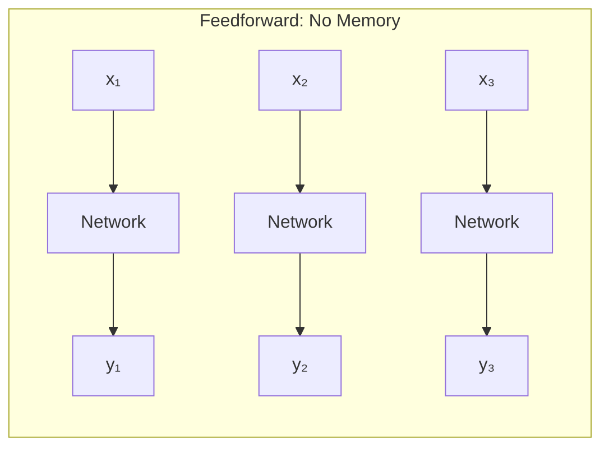

**Problems:**
1. **No memory** - Each input processed in isolation
2. **Fixed input size** - Cannot handle variable-length sequences
3. **No parameter sharing** - Learns separate patterns for each position

---

## Markov Chains: The Foundation

### What is a Markov Chain?

A **Markov chain** is a mathematical model for sequences where the probability of the next state depends only on the current state, not on the history of how we got there.

**The Markov Property (Memoryless):**

$$
P(X_{t+1} | X_t, X_{t-1}, \ldots, X_1) = P(X_{t+1} | X_t)
$$

This is called the **first-order Markov assumption** - the future depends only on the present, not the past.

### Markov Chain Diagram

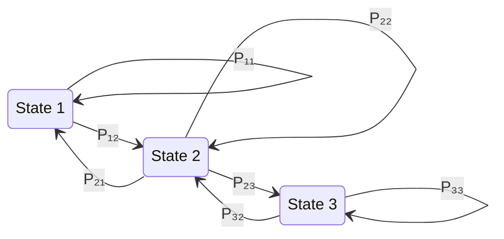

### Transition Matrix

The dynamics of a Markov chain are captured by a **transition matrix** $\mathbf{P}$:

$$
\mathbf{P} = \begin{bmatrix}
P_{11} & P_{12} & P_{13} \\
P_{21} & P_{22} & P_{23} \\
P_{31} & P_{32} & P_{33}
\end{bmatrix}
$$

Where $P_{ij} = P(X_{t+1} = j | X_t = i)$ is the probability of transitioning from state $i$ to state $j$.

**Properties:**
- All entries are non-negative: $P_{ij} \geq 0$
- Rows sum to 1: $\sum_j P_{ij} = 1$

### Higher-Order Markov Models

Real sequences often have longer dependencies. An **$n$-th order Markov model** considers the last $n$ states:

$$
P(X_{t+1} | X_t, X_{t-1}, \ldots, X_1) = P(X_{t+1} | X_t, X_{t-1}, \ldots, X_{t-n+1})
$$

**Example:** In language modeling:
- 1st order: P("sat" | "cat")
- 2nd order: P("sat" | "the", "cat")
- 3rd order: P("sat" | "the", "cat", "happily")

### From Markov Chains to RNNs

RNNs extend Markov chains by:
1. Learning the transition function (not just storing probabilities)
2. Maintaining a **continuous hidden state** instead of discrete states
3. Theoretically capturing **infinite-order dependencies** through the hidden state

| Aspect | Markov Chain | RNN |
|--------|--------------|-----|
| State | Discrete | Continuous vector |
| Transitions | Fixed probabilities | Learned function |
| Memory | Limited to order $n$ | Theoretically unlimited |
| Parameters | $O(|S|^n)$ | Fixed (shared weights) |

---

## Recurrent Neural Network Architecture

### The Core Idea

An RNN introduces a **hidden state** $\mathbf{h}_t$ that acts as memory, carrying information from previous time steps:

$$
\mathbf{h}_t = f(\mathbf{h}_{t-1}, \mathbf{x}_t)
$$

The hidden state is updated at each time step based on:
1. The previous hidden state $\mathbf{h}_{t-1}$
2. The current input $\mathbf{x}_t$

### RNN: Folded vs Unfolded Representation

RNNs can be visualized in two equivalent ways:

#### Folded (Compact) View

The folded view shows the RNN as a single unit with a self-loop, resembling a Markov chain:

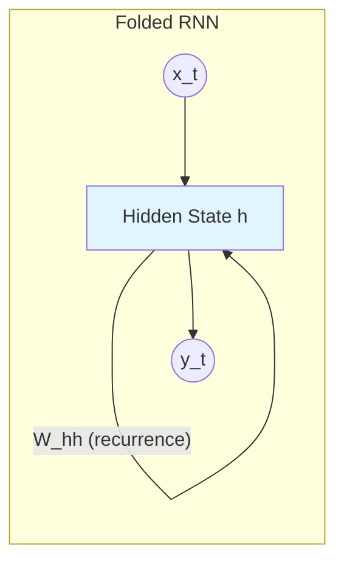

This compact representation emphasizes:
- The **recurrent connection** (self-loop)
- **Parameter sharing** - same weights at every time step
- The Markov-like structure

#### Unfolded (Expanded) View

Unfolding the RNN through time reveals its structure as a deep network:

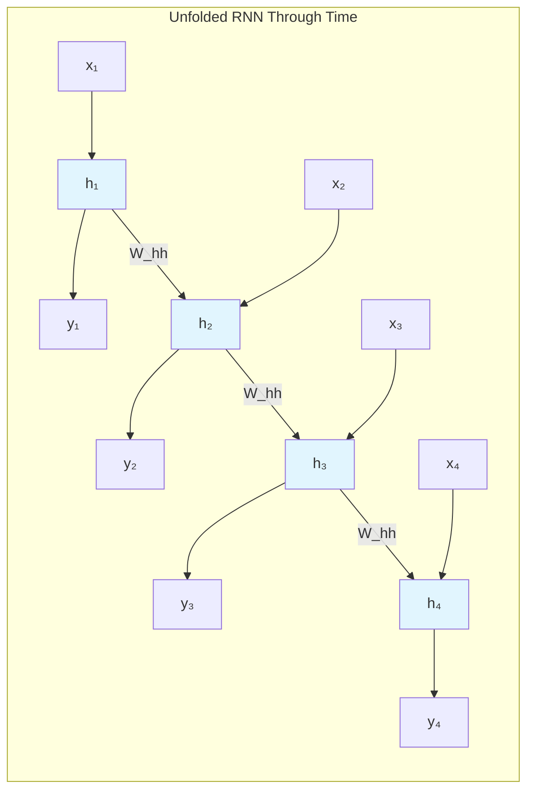

**Key Insight:** The **same weights** $W_{hh}$ are used at every time step. This is called **weight tying** or **parameter sharing**.

### Mathematical Formulation

#### Vanilla RNN Equations

**Hidden State Update:**

$$
\mathbf{h}_t = \tanh(\mathbf{W}_{xh} \mathbf{x}_t + \mathbf{W}_{hh} \mathbf{h}_{t-1} + \mathbf{b}_h)
$$

**Output:**

$$
\mathbf{y}_t = \mathbf{W}_{hy} \mathbf{h}_t + \mathbf{b}_y
$$

Where:
- $\mathbf{x}_t \in \mathbb{R}^d$ — input vector at time $t$
- $\mathbf{h}_t \in \mathbb{R}^n$ — hidden state at time $t$
- $\mathbf{y}_t \in \mathbb{R}^m$ — output at time $t$
- $\mathbf{W}_{xh} \in \mathbb{R}^{n \times d}$ — input-to-hidden weights
- $\mathbf{W}_{hh} \in \mathbb{R}^{n \times n}$ — hidden-to-hidden weights (recurrent)
- $\mathbf{W}_{hy} \in \mathbb{R}^{m \times n}$ — hidden-to-output weights
- $\mathbf{b}_h, \mathbf{b}_y$ — bias vectors

#### Complete RNN Data Flow

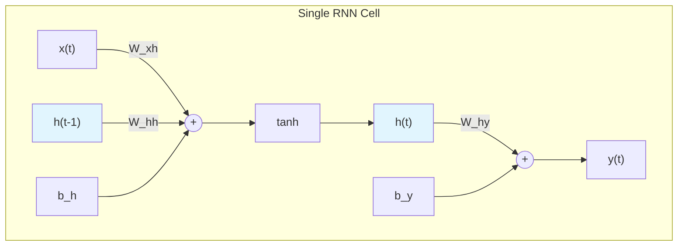

### Why Weight Sharing Matters

Using the same weights at every time step provides several benefits:

1. **Generalization** - Patterns learned at one position apply everywhere
2. **Variable-length sequences** - Same model handles any sequence length
3. **Parameter efficiency** - Number of parameters independent of sequence length
4. **Translation invariance** - Recognizes patterns regardless of their position in the sequence

---

## Forward Propagation Through Time (FPTT)

### The Forward Pass

Forward propagation in an RNN processes the sequence from $t=1$ to $t=T$:

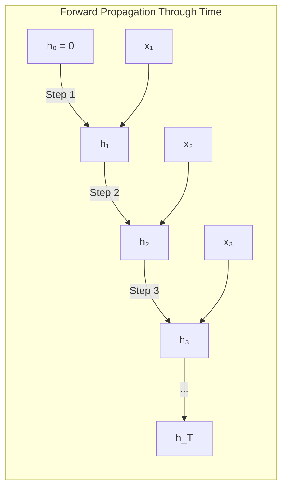

### Algorithm

**Forward Propagation Through Time:**

$$
\begin{aligned}
\mathbf{h}_0 &= \mathbf{0} \quad \text{(initial hidden state)} \\
\\
\text{For } t &= 1 \text{ to } T: \\
\mathbf{a}_t &= \mathbf{W}_{xh} \mathbf{x}_t + \mathbf{W}_{hh} \mathbf{h}_{t-1} + \mathbf{b}_h \\
\mathbf{h}_t &= \tanh(\mathbf{a}_t) \\
\mathbf{o}_t &= \mathbf{W}_{hy} \mathbf{h}_t + \mathbf{b}_y \\
\hat{\mathbf{y}}_t &= \text{softmax}(\mathbf{o}_t) \quad \text{(for classification)}
\end{aligned}
$$

### Step-by-Step Example

Let's trace through with concrete values:

**Setup:**
- Input dimension: $d = 2$
- Hidden dimension: $n = 3$
- Sequence: $\mathbf{x}_1 = [1, 0]^T$, $\mathbf{x}_2 = [0, 1]^T$

**Weights (simplified):**
$$
\mathbf{W}_{xh} = \begin{bmatrix} 0.1 & 0.2 \\ 0.3 & 0.4 \\ 0.5 & 0.6 \end{bmatrix}, \quad
\mathbf{W}_{hh} = \begin{bmatrix} 0.1 & 0.1 & 0.1 \\ 0.1 & 0.1 & 0.1 \\ 0.1 & 0.1 & 0.1 \end{bmatrix}
$$

**Time step 1:**
$$
\begin{aligned}
\mathbf{a}_1 &= \mathbf{W}_{xh} \mathbf{x}_1 + \mathbf{W}_{hh} \mathbf{h}_0 = \begin{bmatrix} 0.1 \\ 0.3 \\ 0.5 \end{bmatrix} + \mathbf{0} = \begin{bmatrix} 0.1 \\ 0.3 \\ 0.5 \end{bmatrix} \\
\mathbf{h}_1 &= \tanh(\mathbf{a}_1) = \begin{bmatrix} 0.0997 \\ 0.2913 \\ 0.4621 \end{bmatrix}
\end{aligned}
$$

**Time step 2:**
$$
\begin{aligned}
\mathbf{a}_2 &= \mathbf{W}_{xh} \mathbf{x}_2 + \mathbf{W}_{hh} \mathbf{h}_1 \\
&= \begin{bmatrix} 0.2 \\ 0.4 \\ 0.6 \end{bmatrix} + \begin{bmatrix} 0.0853 \\ 0.0853 \\ 0.0853 \end{bmatrix} = \begin{bmatrix} 0.2853 \\ 0.4853 \\ 0.6853 \end{bmatrix} \\
\mathbf{h}_2 &= \tanh(\mathbf{a}_2) = \begin{bmatrix} 0.2780 \\ 0.4503 \\ 0.5943 \end{bmatrix}
\end{aligned}
$$

Notice how $\mathbf{h}_2$ contains information from both $\mathbf{x}_1$ and $\mathbf{x}_2$!

---

## Backpropagation Through Time (BPTT)

### The Challenge

In standard neural networks, we compute gradients using backpropagation. For RNNs, we must account for the **temporal dependencies** — the loss at time $t$ depends on hidden states at all previous times.

### Total Loss

The total loss over a sequence is the sum of losses at each time step:

$$
\mathcal{L} = \sum_{t=1}^{T} \mathcal{L}_t = \sum_{t=1}^{T} \mathcal{L}(\hat{\mathbf{y}}_t, \mathbf{y}_t)
$$

### The BPTT Algorithm

**Key Insight:** When we differentiate with respect to weights, we must sum contributions from all time steps.

For the recurrent weight $\mathbf{W}_{hh}$:

$$
\frac{\partial \mathcal{L}}{\partial \mathbf{W}_{hh}} = \sum_{t=1}^{T} \frac{\partial \mathcal{L}_t}{\partial \mathbf{W}_{hh}}
$$

But here's the key: $\mathcal{L}_t$ depends on $\mathbf{h}_t$, which depends on $\mathbf{h}_{t-1}$, which depends on $\mathbf{h}_{t-2}$, and so on...

### The Chain Rule Through Time

Using the chain rule, the gradient of loss at time $t$ with respect to $\mathbf{W}_{hh}$:

$$
\frac{\partial \mathcal{L}_t}{\partial \mathbf{W}_{hh}} = \sum_{k=1}^{t} \frac{\partial \mathcal{L}_t}{\partial \mathbf{h}_t} \frac{\partial \mathbf{h}_t}{\partial \mathbf{h}_k} \frac{\partial \mathbf{h}_k}{\partial \mathbf{W}_{hh}}
$$

The term $\frac{\partial \mathbf{h}_t}{\partial \mathbf{h}_k}$ requires going back through all intermediate hidden states:

$$
\frac{\partial \mathbf{h}_t}{\partial \mathbf{h}_k} = \prod_{i=k+1}^{t} \frac{\partial \mathbf{h}_i}{\partial \mathbf{h}_{i-1}} = \prod_{i=k+1}^{t} \mathbf{W}_{hh}^T \text{diag}(\tanh'(\mathbf{a}_i))
$$

### BPTT Visualization

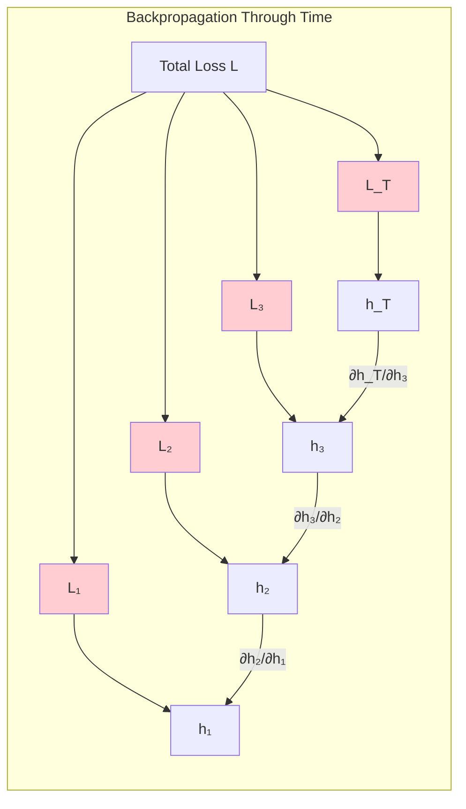

### Complete BPTT Equations

**Gradient of loss with respect to output:**

$$
\boldsymbol{\delta}_t^{(o)} = \frac{\partial \mathcal{L}_t}{\partial \mathbf{o}_t}
$$

**Gradient flowing into hidden state (accumulates from future):**

$$
\boldsymbol{\delta}_t^{(h)} = \mathbf{W}_{hy}^T \boldsymbol{\delta}_t^{(o)} + \mathbf{W}_{hh}^T \boldsymbol{\delta}_{t+1}^{(a)}
$$

**Gradient through tanh activation:**

$$
\boldsymbol{\delta}_t^{(a)} = \boldsymbol{\delta}_t^{(h)} \odot (1 - \mathbf{h}_t^2)
$$

**Parameter gradients (summed over all time steps):**

$$
\begin{aligned}
\frac{\partial \mathcal{L}}{\partial \mathbf{W}_{hy}} &= \sum_{t=1}^{T} \boldsymbol{\delta}_t^{(o)} \mathbf{h}_t^T \\
\frac{\partial \mathcal{L}}{\partial \mathbf{W}_{hh}} &= \sum_{t=1}^{T} \boldsymbol{\delta}_t^{(a)} \mathbf{h}_{t-1}^T \\
\frac{\partial \mathcal{L}}{\partial \mathbf{W}_{xh}} &= \sum_{t=1}^{T} \boldsymbol{\delta}_t^{(a)} \mathbf{x}_t^T
\end{aligned}
$$

---

## The Vanishing and Exploding Gradient Problem

### Why It Happens

Remember the term:

$$
\frac{\partial \mathbf{h}_t}{\partial \mathbf{h}_k} = \prod_{i=k+1}^{t} \mathbf{W}_{hh}^T \text{diag}(\tanh'(\mathbf{a}_i))
$$

This is a **product of $(t-k)$ matrices**. For long sequences, this product either:
- **Explodes** if eigenvalues of $\mathbf{W}_{hh} > 1$
- **Vanishes** if eigenvalues of $\mathbf{W}_{hh} < 1$

### Mathematical Analysis

Let $\lambda_{max}$ be the largest eigenvalue of $\mathbf{W}_{hh}$. Since $|\tanh'(x)| \leq 1$:

$$
\left\| \frac{\partial \mathbf{h}_t}{\partial \mathbf{h}_k} \right\| \leq |\lambda_{max}|^{t-k}
$$

- If $|\lambda_{max}| > 1$: gradients grow exponentially (**exploding**)
- If $|\lambda_{max}| < 1$: gradients shrink exponentially (**vanishing**)

### Visualization of Gradient Flow

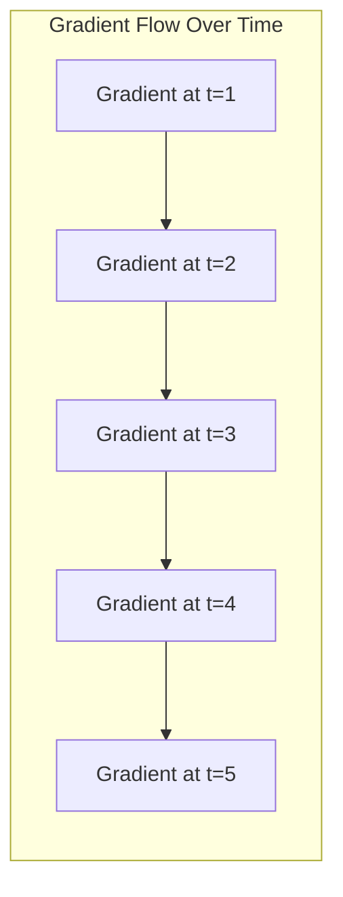

**Vanishing (λ < 1):** `1.0 → 0.5 → 0.25 → 0.125 → 0.0625`

**Exploding (λ > 1):** `1.0 → 2.0 → 4.0 → 8.0 → 16.0`

### Solutions

| Problem | Solution |
|---------|----------|
| Exploding | Gradient clipping |
| Vanishing | LSTM, GRU (gating mechanisms) |
| Both | Better initialization, layer normalization |

---

## Long Short-Term Memory (LSTM)

### The LSTM Solution

LSTMs solve the vanishing gradient problem by introducing **gates** that control information flow:

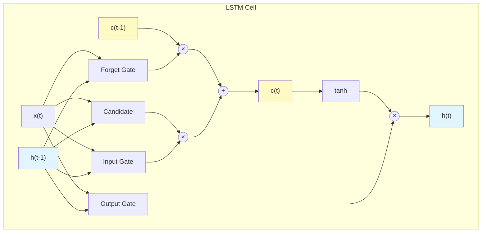

### LSTM Equations

**Forget Gate** — decides what to remove from cell state:

$$
\mathbf{f}_t = \sigma(\mathbf{W}_{xf} \mathbf{x}_t + \mathbf{W}_{hf} \mathbf{h}_{t-1} + \mathbf{b}_f)
$$

**Input Gate** — decides what new information to store:

$$
\mathbf{i}_t = \sigma(\mathbf{W}_{xi} \mathbf{x}_t + \mathbf{W}_{hi} \mathbf{h}_{t-1} + \mathbf{b}_i)
$$

**Candidate Cell State** — new information to potentially add:

$$
\tilde{\mathbf{c}}_t = \tanh(\mathbf{W}_{xc} \mathbf{x}_t + \mathbf{W}_{hc} \mathbf{h}_{t-1} + \mathbf{b}_c)
$$

**Cell State Update** — the memory update:

$$
\mathbf{c}_t = \mathbf{f}_t \odot \mathbf{c}_{t-1} + \mathbf{i}_t \odot \tilde{\mathbf{c}}_t
$$

**Output Gate** — decides what to output:

$$
\mathbf{o}_t = \sigma(\mathbf{W}_{xo} \mathbf{x}_t + \mathbf{W}_{ho} \mathbf{h}_{t-1} + \mathbf{b}_o)
$$

**Hidden State** — the final output:

$$
\mathbf{h}_t = \mathbf{o}_t \odot \tanh(\mathbf{c}_t)
$$

### Why LSTMs Work

The cell state $\mathbf{c}_t$ acts as a **highway** for gradients:

$$
\mathbf{c}_t = \mathbf{f}_t \odot \mathbf{c}_{t-1} + \mathbf{i}_t \odot \tilde{\mathbf{c}}_t
$$

When $\mathbf{f}_t \approx 1$ (forget gate open), gradients flow directly through:

$$
\frac{\partial \mathbf{c}_t}{\partial \mathbf{c}_{t-1}} = \mathbf{f}_t \approx 1
$$

This avoids the vanishing gradient problem!

### Gate Interpretations

| Gate | Value ≈ 0 | Value ≈ 1 |
|------|-----------|-----------|
| Forget $\mathbf{f}_t$ | Erase memory | Keep memory |
| Input $\mathbf{i}_t$ | Ignore new info | Store new info |
| Output $\mathbf{o}_t$ | Don't output | Output cell content |

---

## Gated Recurrent Unit (GRU)

### Simplified Gating

GRU combines the forget and input gates into a single **update gate**:

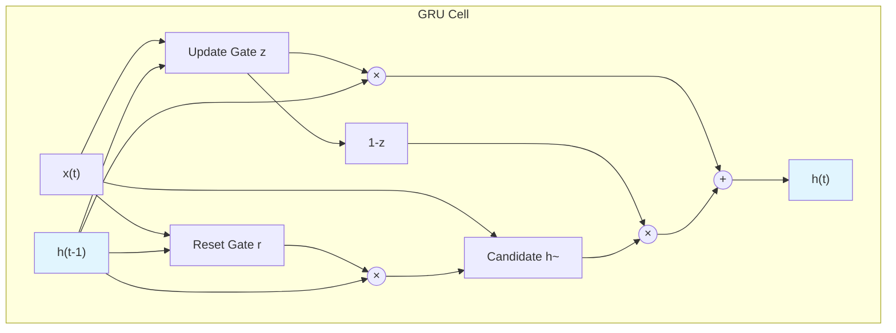

### GRU Equations

**Update Gate:**

$$
\mathbf{z}_t = \sigma(\mathbf{W}_{xz} \mathbf{x}_t + \mathbf{W}_{hz} \mathbf{h}_{t-1} + \mathbf{b}_z)
$$

**Reset Gate:**

$$
\mathbf{r}_t = \sigma(\mathbf{W}_{xr} \mathbf{x}_t + \mathbf{W}_{hr} \mathbf{h}_{t-1} + \mathbf{b}_r)
$$

**Candidate Hidden State:**

$$
\tilde{\mathbf{h}}_t = \tanh(\mathbf{W}_{xh} \mathbf{x}_t + \mathbf{W}_{hh} (\mathbf{r}_t \odot \mathbf{h}_{t-1}) + \mathbf{b}_h)
$$

**Hidden State Update:**

$$
\mathbf{h}_t = (1 - \mathbf{z}_t) \odot \tilde{\mathbf{h}}_t + \mathbf{z}_t \odot \mathbf{h}_{t-1}
$$

### LSTM vs GRU

| Aspect | LSTM | GRU |
|--------|------|-----|
| Gates | 3 (forget, input, output) | 2 (update, reset) |
| States | 2 (cell, hidden) | 1 (hidden) |
| Parameters | More | ~25% fewer |
| Performance | Better for long sequences | Comparable, faster training |

---

## RNN Architectures

### Many-to-Many (Sequence-to-Sequence)

Used for: Machine translation, video captioning

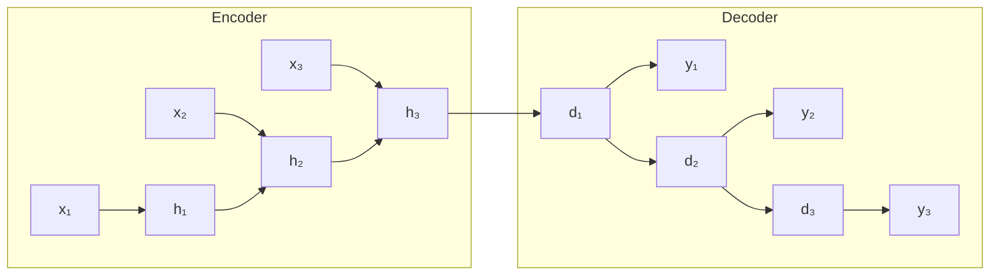

### Many-to-One (Classification)

Used for: Sentiment analysis, document classification

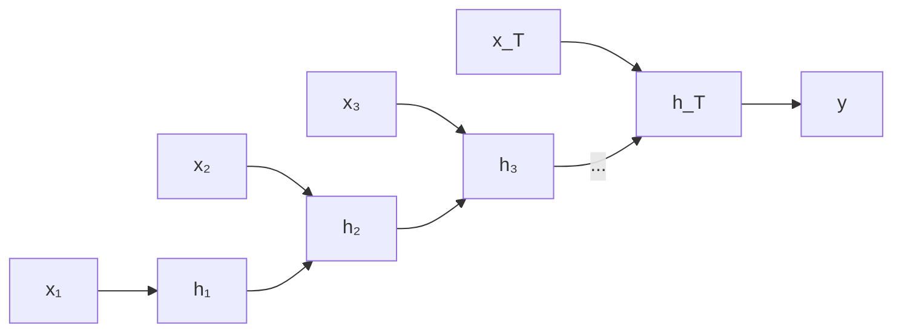

### One-to-Many (Generation)

Used for: Music generation, image captioning

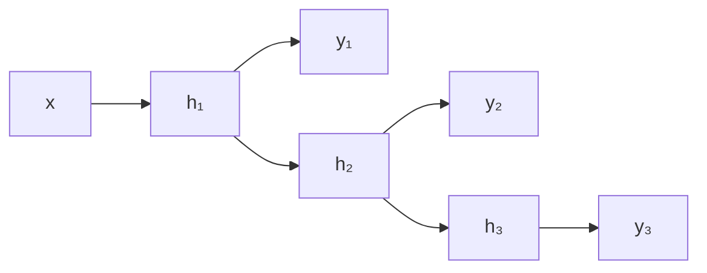

### Bidirectional RNN

Processes sequences in both directions:

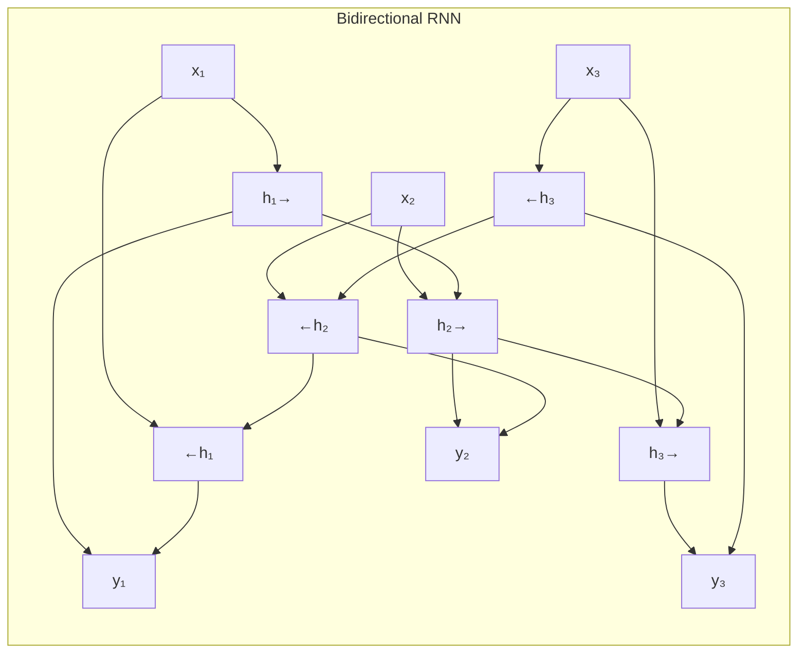

$$
\mathbf{h}_t = [\overrightarrow{\mathbf{h}}_t; \overleftarrow{\mathbf{h}}_t]
$$

---

## Quick Start

```bash
cd 03_basic_rnn

# Single GPU
deepspeed train_rnn_deepspeed.py

# Multi-GPU
deepspeed --num_gpus=2 train_rnn_deepspeed.py
```

## Model Architecture

```python
class LSTMModel(nn.Module):
    def __init__(self, input_size=1, hidden_size=64, num_layers=2):
        super().__init__()
        self.lstm = nn.LSTM(
            input_size=input_size,
            hidden_size=hidden_size,
            num_layers=num_layers,
            batch_first=True,
            dropout=0.2
        )
        self.fc = nn.Linear(hidden_size, 1)

        self._initialize_weights()
```

### Proper LSTM Initialization

```python
def _initialize_weights(self):
    for name, param in self.lstm.named_parameters():
        if 'weight_ih' in name:
            # Xavier for input-hidden weights
            nn.init.xavier_uniform_(param.data)
        elif 'weight_hh' in name:
            # Orthogonal for hidden-hidden weights
            nn.init.orthogonal_(param.data)
        elif 'bias' in name:
            # Forget gate bias = 1.0 for better gradients
            param.data.fill_(0)
            n = param.size(0)
            param.data[n//4:n//2].fill_(1.0)
```

**Why These Initializations?**

| Weight Type | Initialization | Reason |
|------------|----------------|---------|
| Input-Hidden | Xavier | Maintains variance across layers |
| Hidden-Hidden | Orthogonal | Preserves gradient magnitudes through time |
| Forget Gate Bias | 1.0 | Encourages remembering by default |

---

## DeepSpeed Configuration

```json
{
  "train_batch_size": 128,
  "train_micro_batch_size_per_gpu": 32,
  "gradient_accumulation_steps": 2,
  "optimizer": {
    "type": "Adam",
    "params": {
      "lr": 5e-4,
      "weight_decay": 1e-5
    }
  },
  "scheduler": {
    "type": "WarmupLR",
    "params": {
      "warmup_min_lr": 0,
      "warmup_max_lr": 5e-4,
      "warmup_num_steps": 100
    }
  },
  "fp16": {
    "enabled": true,
    "loss_scale": 0,
    "loss_scale_window": 1000
  },
  "zero_optimization": {
    "stage": 2,
    "contiguous_gradients": true,
    "overlap_comm": true
  },
  "gradient_clipping": 1.0
}
```

## Key Features

### Gradient Clipping

Essential for RNN stability:

```json
{
  "gradient_clipping": 1.0
}
```

**How it works:**

$$
\mathbf{g} \leftarrow \begin{cases}
\mathbf{g} & \text{if } \|\mathbf{g}\| \leq \theta \\
\frac{\theta}{\|\mathbf{g}\|} \mathbf{g} & \text{if } \|\mathbf{g}\| > \theta
\end{cases}
$$

Where $\theta = 1.0$ is the clipping threshold.

### ZeRO-2 Optimization

Partitions gradients and optimizer states:

```json
{
  "zero_optimization": {
    "stage": 2,
    "contiguous_gradients": true,
    "overlap_comm": true
  }
}
```

### Learning Rate Warmup

Stabilizes early training:

```json
{
  "scheduler": {
    "type": "WarmupLR",
    "params": {
      "warmup_num_steps": 100
    }
  }
}
```

---

## Dataset

Synthetic multi-frequency sine wave:

```python
def generate_data(n_samples, seq_length=50):
    t = np.linspace(0, 4*np.pi, n_samples + seq_length)

    # Multi-frequency signal
    signal = (np.sin(0.5 * t) +
              0.5 * np.sin(2.0 * t) +
              0.3 * np.sin(5.0 * t))

    # Add noise
    signal += np.random.normal(0, 0.1, signal.shape)

    return create_sequences(signal, seq_length)
```

- Training samples: 8,000 sequences
- Validation samples: 2,000 sequences
- Sequence length: 50 timesteps

## Training Parameters

| Parameter | Value |
|-----------|-------|
| Hidden Size | 64 |
| LSTM Layers | 2 |
| Dropout | 0.2 |
| Learning Rate | 5e-4 |
| Warmup Steps | 100 |
| Epochs | 50 |
| Early Stopping | 10 epochs |
| Batch Size | 128 total |

## Expected Results

```
Training Summary:
  - Initial Loss: 1.523456
  - Final Loss: 0.012345
  - Loss Reduction: 99.19%

Validation Summary:
  - Best Val Loss: 0.015678
  - Val Loss Reduction: 98.92%

Model Quality: Excellent! (MSE < 0.05)
```

## Monitoring

### Gradient Norms

Watch for stability:
- Healthy: 0.01 - 1.0
- Exploding: > 10 (clipping should prevent)
- Vanishing: < 0.001

### W&B Metrics

When enabled, tracks:
- Step-level: loss, gradient norm, learning rate
- Epoch-level: train/val loss averages
- Final: quality assessment

## Troubleshooting

### Gradient Explosion

```
Loss: inf or NaN
```

Solutions:
- Lower gradient clipping: `"gradient_clipping": 0.5`
- Reduce learning rate: `"lr": 1e-4`
- Check initialization

### CUDA OOM

Solutions:
- Reduce `train_micro_batch_size_per_gpu`
- Increase `gradient_accumulation_steps`
- Enable ZeRO Stage 3

### Poor Convergence

- Increase warmup steps
- Adjust learning rate
- Check data normalization

## Advanced Usage

### Custom Time Series Data

```python
def get_custom_data_loaders(file_path, batch_size):
    data = pd.read_csv(file_path)

    X_train, y_train = create_sequences(data, seq_length=50)

    train_dataset = TensorDataset(
        torch.FloatTensor(X_train),
        torch.FloatTensor(y_train)
    )

    return DataLoader(train_dataset, batch_size=batch_size, shuffle=True)
```

### GRU Alternative

```python
self.rnn = nn.GRU(
    input_size=input_size,
    hidden_size=hidden_size,
    num_layers=num_layers,
    batch_first=True,
    dropout=0.2
)
```

---

## Summary: Key Equations Reference

### Vanilla RNN
$$
\mathbf{h}_t = \tanh(\mathbf{W}_{xh} \mathbf{x}_t + \mathbf{W}_{hh} \mathbf{h}_{t-1} + \mathbf{b}_h)
$$

### BPTT Gradient (simplified)
$$
\frac{\partial \mathcal{L}}{\partial \mathbf{W}_{hh}} = \sum_{t=1}^{T} \sum_{k=1}^{t} \frac{\partial \mathcal{L}_t}{\partial \mathbf{h}_t} \left( \prod_{i=k+1}^{t} \frac{\partial \mathbf{h}_i}{\partial \mathbf{h}_{i-1}} \right) \frac{\partial \mathbf{h}_k}{\partial \mathbf{W}_{hh}}
$$

### LSTM Cell
$$
\begin{aligned}
\mathbf{f}_t &= \sigma(\mathbf{W}_f [\mathbf{h}_{t-1}, \mathbf{x}_t] + \mathbf{b}_f) \\
\mathbf{i}_t &= \sigma(\mathbf{W}_i [\mathbf{h}_{t-1}, \mathbf{x}_t] + \mathbf{b}_i) \\
\mathbf{o}_t &= \sigma(\mathbf{W}_o [\mathbf{h}_{t-1}, \mathbf{x}_t] + \mathbf{b}_o) \\
\tilde{\mathbf{c}}_t &= \tanh(\mathbf{W}_c [\mathbf{h}_{t-1}, \mathbf{x}_t] + \mathbf{b}_c) \\
\mathbf{c}_t &= \mathbf{f}_t \odot \mathbf{c}_{t-1} + \mathbf{i}_t \odot \tilde{\mathbf{c}}_t \\
\mathbf{h}_t &= \mathbf{o}_t \odot \tanh(\mathbf{c}_t)
\end{aligned}
$$

### GRU Cell
$$
\begin{aligned}
\mathbf{z}_t &= \sigma(\mathbf{W}_z [\mathbf{h}_{t-1}, \mathbf{x}_t]) \\
\mathbf{r}_t &= \sigma(\mathbf{W}_r [\mathbf{h}_{t-1}, \mathbf{x}_t]) \\
\tilde{\mathbf{h}}_t &= \tanh(\mathbf{W}_h [\mathbf{r}_t \odot \mathbf{h}_{t-1}, \mathbf{x}_t]) \\
\mathbf{h}_t &= (1 - \mathbf{z}_t) \odot \tilde{\mathbf{h}}_t + \mathbf{z}_t \odot \mathbf{h}_{t-1}
\end{aligned}
$$

---

## Next Steps

- [Stock Prediction](/docs/tutorials/intermediate/stock-prediction) - Real-world RNN application
- [Bayesian Neural Networks](/docs/tutorials/intermediate/bayesian-nn) - Uncertainty estimation
