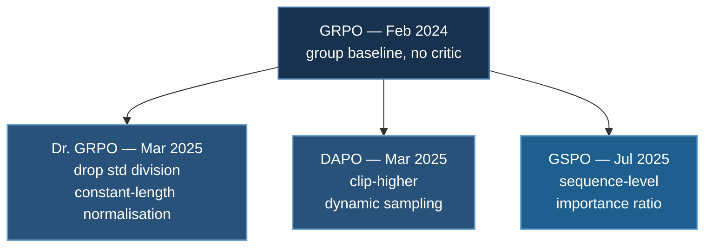

# Beyond GRPO: Dr. GRPO, DAPO, GSPO

[GRPO](./grpo-training.md) removed the critic and made verifier-based RL
affordable. It also shipped with biases its own authors did not set out to
introduce, and 2025 was largely spent identifying and removing them.

This page is the state of the art as of **August 2026**, and it is the most
volatile page in this section — treat the specific methods as current examples
of a pattern rather than a settled answer.

## 1. The Timeline

| Method | arXiv | Date | Fixes |
|---|---|---|---|
| *GRPO* | [2402.03300](https://arxiv.org/abs/2402.03300) | *Feb 2024* | — |
| **DAPO** | [2503.14476](https://arxiv.org/abs/2503.14476) | Mar 2025 | clipping, degenerate groups |
| **Dr. GRPO** | [2503.20783](https://arxiv.org/abs/2503.20783) | Mar 2025 | length and difficulty bias |
| **GSPO** | [2507.18071](https://arxiv.org/abs/2507.18071) | Jul 2025 | token-level importance ratio |

## 2. What GRPO Gets Wrong

Recall GRPO's advantage: sample $G$ responses per prompt, and use the group's
own statistics as the baseline.

$$
\hat{A}_i = \frac{r_i - \operatorname{mean}(\mathbf{r})}{\operatorname{std}(\mathbf{r})}
$$

Three problems hide in that formula and its surrounding loss. [GRPO §7](./grpo-training.md)
introduces the first; here is the full set.

### Bias 1 — dividing by the group standard deviation

$\operatorname{std}(\mathbf{r})$ varies with **question difficulty**. A prompt
where the model gets 5/8 right has high variance; one where it gets 1/8 right
has low variance. Dividing by it scales up the gradient from *easy-to-vary*
questions and scales down everything else, so the model preferentially learns
from questions of middling difficulty — an effect nobody chose.

**Dr. GRPO's fix:** drop the division. Use $r_i - \operatorname{mean}(\mathbf{r})$
and let the advantage keep its natural scale.

### Bias 2 — normalising the loss by response length

GRPO averages the per-token loss within each response. That makes each
*response* contribute equally, which sounds fair and is not: it makes each
**token** in a long response count less. The gradient signal per token is
diluted exactly in the responses that contain the most reasoning.

**Dr. GRPO's fix:** normalise by a constant instead of by $|y_i|$, so every
token carries the same weight regardless of which response it sits in.

### Bias 3 — degenerate groups

If all $G$ responses get the same reward — all correct or all wrong — then
$r_i - \operatorname{mean}(\mathbf{r}) = 0$ for every one of them. The
advantage vanishes, the gradient is zero, and **the entire group is wasted
compute**.

[GRPO's worked example](./grpo-worked-example.md) computes how often this
happens. With per-sample success probability $p$ and group size $G$:

$$
\Pr[\text{degenerate}] = p^G + (1-p)^G
$$

It is worst at the extremes — an easy prompt and an impossible one are equally
useless — and those are common in any real dataset.

**DAPO's fix:** *dynamic sampling.* Filter out all-correct and all-wrong groups
and keep sampling until the batch is full of groups that actually carry signal.
You pay in generation; you stop paying for zero-gradient batches.

### Bias 4 — the token-level importance ratio

The subtlest one, and GSPO's contribution. GRPO inherits PPO's **per-token**
importance ratio $\pi_\theta(y_{i,t}) / \pi_{\theta_{\text{old}}}(y_{i,t})$, but
the reward is assigned to the **whole sequence**. The unit of optimisation and
the unit of reward do not match, and the resulting per-token gradient estimates
are noisy.

**GSPO's fix:** a **sequence-level** importance ratio, aligning the optimisation
unit with the reward unit. The paper reports that despite clipping substantially
*more* tokens than GRPO, GSPO trains more efficiently — which is the tell that
GRPO's token-level estimates were noise rather than signal.

## 3. DAPO's Other Half: Clip-Higher

PPO-style clipping is symmetric: $[1-\epsilon, 1+\epsilon]$. DAPO decouples the
bounds and **raises the upper one**.

The reasoning: the upper clip is what limits how much probability mass a token
can *gain* in one update. Holding it tight suppresses exploration precisely
where the model is discovering something new, and the well-known symptom is
**entropy collapse** — the policy sharpens early, stops exploring, and plateaus.

## 4. What to Actually Change

The fixes are small and mostly independent, so they compose. In rough order of
payoff per line of code:

| Change | From | Effort | Why |
|---|---|---|---|
| Stop dividing by group std | Dr. GRPO | one line | Removes difficulty bias |
| Constant-length loss normalisation | Dr. GRPO | one line | Stops diluting long responses |
| Filter degenerate groups | DAPO | small | Stops paying for zero gradients |
| Raise the upper clip bound | DAPO | one line | Delays entropy collapse |
| Sequence-level importance ratio | GSPO | moderate | Aligns optimisation with reward |

:::tip Start with the two one-liners
Removing the std division and fixing length normalisation are two lines and
address the biases most likely to be distorting your run today. Do those, watch
whether the reward curve changes shape, and only then consider the structural
change GSPO asks for.
:::

## 5. What to Monitor

The biases above are visible in the logs if you know what to plot. All of these
matter more than the reward curve:

| Metric | Watch for |
|---|---|
| **Degenerate-group fraction** | Rising toward 1 means most compute produces no gradient |
| **Policy entropy** | Collapsing early means the upper clip is too tight |
| **Mean response length** | Steady growth with flat accuracy is length gaming |
| **Group reward std** | Near zero means the batch has nothing to learn from |
| **Clip fraction** | Both bounds separately — DAPO's whole point is that they differ |

:::warning A rising reward curve is not evidence of anything on its own
Every failure mode on this page is compatible with a reward that climbs. Length
gaming climbs. Learning only medium-difficulty questions climbs. Entropy
collapse climbs, right up until it plateaus. Plot the diagnostics.
:::

## 6. This Page Will Date Fastest

The offline family on [the DPO page](./preference-optimization.md) has been
stable for two years. This area has not, and the survey literature is still
consolidating: methods like ATPO now reframe GRPO, DAPO and their relatives as
instances of a single token-preference objective, which suggests the specific
named methods matter less than the failure modes they each identified.

The durable content of this page is **§2 — the four biases**. Those are
properties of the GRPO objective, and they will still be there whatever the
current best-named fix is called.

## 7. Next

**[gpt-oss Fine-Tuning](./gpt-oss-finetuning.md)** — applying this machinery at
20B scale.

Or back to [GRPO](./grpo-training.md) for the base algorithm, or
[the worked example](./grpo-worked-example.md) for the degenerate-group
arithmetic computed rather than asserted.

## References

1. Shao et al. *DeepSeekMath: Pushing the Limits of Mathematical Reasoning* (2024) — GRPO. [arXiv:2402.03300](https://arxiv.org/abs/2402.03300)
2. Yu et al. *DAPO: An Open-Source LLM Reinforcement Learning System at Scale* (2025). [arXiv:2503.14476](https://arxiv.org/abs/2503.14476)
3. Liu et al. *Understanding R1-Zero-Like Training: A Critical Perspective* (2025) — Dr. GRPO. [arXiv:2503.20783](https://arxiv.org/abs/2503.20783)
4. Zheng et al. *Group Sequence Policy Optimization* (2025). [arXiv:2507.18071](https://arxiv.org/abs/2507.18071)
5. *Reinforcement Learning for LLM Post-Training: A Survey*. [arXiv:2407.16216](https://arxiv.org/abs/2407.16216)
