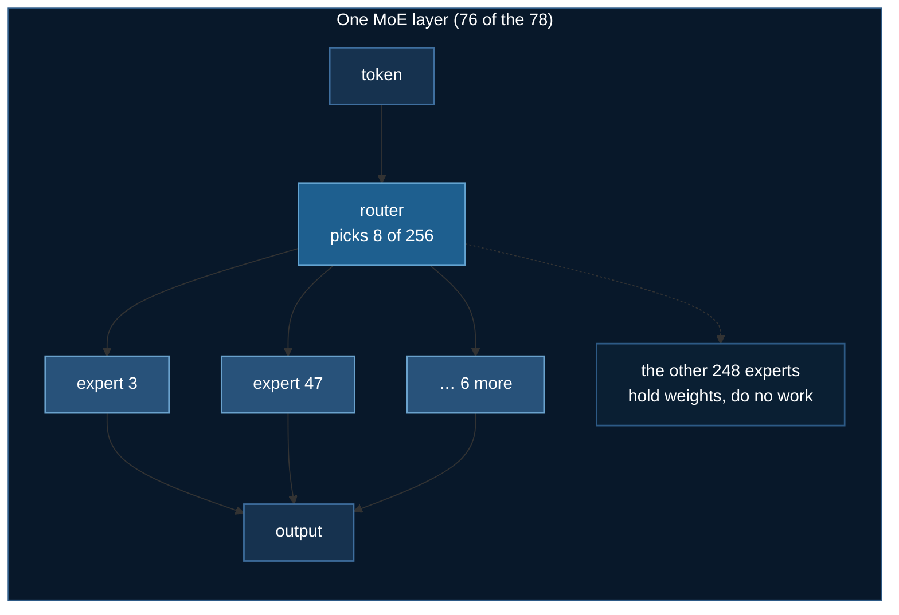
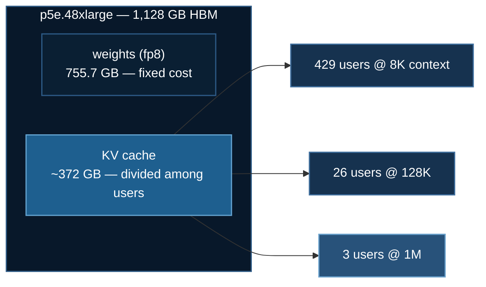

# GLM-5.3: Fine-tuning a 755 GB Sparse MoE

[GLM-5.3](https://huggingface.co/zai-org/GLM-5.3) was released by zai-org on
2026-08-31. It is a ~743-billion-parameter sparse mixture-of-experts model, and
almost everything a Llama fine-tuning recipe teaches you is either wrong or
irrelevant for it.

This page is about the reasoning you do *before* you download 755 GB.

Code: [`03_huggingface/01_llm_finetuning/train_glm53_ds.py`](https://github.com/yiqiao-yin/deepspeed-course/blob/main/03_huggingface/01_llm_finetuning/train_glm53_ds.py)

:::tip Everything here runs without a GPU
```bash
uv run train_glm53_ds.py --plan
```
reads the published `config.json` and prints the whole analysis below — where
the parameters live, what LoRA should target, what the KV cache costs, and
whether your hardware can hold the model. No download, no GPU.
:::

## 1. Reading a model before downloading it

Two files on the Hub tell you nearly everything, and both are small:

- `config.json` — dimensions, expert counts, attention type
- `model.safetensors.index.json` — a map of **every** tensor name to its shard

For GLM-5.3 that index lists **118,629 tensors** and a total of 755,617,140,416
bytes. Reading it is how the LoRA target modules in this example were *verified*
rather than guessed, and it costs about 11 MB instead of 755 GB.

| | |
|---|---|
| architecture | `GlmMoeDsaForCausalLM` (`model_type: glm_moe_dsa`) |
| parameters | ~743 B, with 8 of 256 experts active per token |
| weights | **755.7 GB** fp8 / 1,506.7 GB bf16 |
| layers | 78 (+1 multi-token-prediction layer) |
| attention | MLA — compressed q/kv (`q_lora_rank` 2048, `kv_lora_rank` 512) |
| sparse attention | DSA indexer, on **22 of 78 layers only** |
| context | 1,048,576 tokens |
| requires | `transformers >= 5.15` |

## 2. A "743B model" is 97% experts

```
routed experts     724.78 B   97.5%
shared experts       2.83 B    0.4%
dense MLP layers     0.68 B    0.1%
attention           12.87 B    1.7%
router (gate)        0.12 B    0.0%
embeddings           1.90 B    0.3%
TOTAL              743.18 B
```



The computed 743.18 B cross-checks against the measured 755.7 GB of fp8 bytes —
fp8 is about one byte per parameter, and the ~1.7% gap is the `weight_scale_inv`
block-scale tensors. That cross-check is what makes the arithmetic trustworthy:
a common failure is to count `intermediate_size` once per layer as though the
model were dense, which reports this model as ~14 B and passes a capacity check
it should fail.

## 3. MLA does not save parameters — it saves the cache

This one is genuinely counterintuitive, and the first version of this example's
own test asserted the opposite and failed against correct code.

Multi-head Latent Attention compresses keys and values through a low-rank
projection. The intuition "compression means fewer parameters" is wrong here:

$$
\text{MLA attention} = 12.9\text{ B} \quad>\quad \text{vanilla } 4h^2L = 11.8\text{ B}
$$

GLM-5.3 uses 64 heads × 256 head_dim = 16,384, which is 2.7× its hidden size of
6,144, so `o_proj` alone is larger than a vanilla attention block. MLA
attention is *slightly bigger* in parameter count.

What it compresses is the **KV cache**:

| | per token | at 1,048,576 tokens |
|---|---|---|
| MLA (caches the latent + RoPE key) | **87.8 KB** | **94 GB** |
| vanilla MHA (caches k and v per head) | 4,992 KB | 5,360 GB |

A 57× reduction, and the only reason a 1M-token context is physically possible.
Claiming the wrong benefit means sizing the wrong resource.

## 4. Why LoRA targets attention, not the experts

The targets are `q_a_proj`, `q_b_proj`, `kv_a_proj_with_mqa`, `kv_b_proj`,
`o_proj` — verified against the safetensors index. The 256 expert MLPs, 97% of
the model, stay **frozen**. So does the router.

:::danger Copying q_proj/k_proj/v_proj from a Llama recipe matches nothing
Those names do not exist in this model. Depending on the peft version that
either raises, or silently attaches an adapter to nothing — and the loss still
goes down, because the base model is already good. A LoRA run that trained
nothing looks exactly like one that worked.
:::

**Why not adapt the experts, when they are where the parameters are?**

An adapter on expert *k* only receives gradient when the router sends a token to
expert *k*. At top-8 of 256, each expert sees roughly **3% of tokens**. You would
add hundreds of thousands of adapter matrices, each training on a sliver of the
data, most staying near their initialisation. Attention is shared by every token
on every layer, so one adapter there sees the entire dataset — for 2% of the
parameters.

**Why leave the router frozen?** Training it changes *which* experts fire, a far
more destructive edit than changing how they are read. Routing collapse — where
the router learns to send everything to a handful of experts — is the classic
way a fine-tuned MoE quietly degrades, and it does not announce itself in the
loss.

:::info With stock peft, freezing the experts is the only option there is
Building the model on the meta device reveals that transformers **fuses** the
256 experts into 3D parameter tensors at runtime —
`model.layers.N.mlp.experts.gate_up_proj` has shape `(256, 4096, 6144)` — even
though the checkpoint stores them per expert as
`mlp.experts.{k}.gate_proj`. **The checkpoint layout and the runtime module
tree are not the same thing.**

So the experts are not `nn.Linear` modules at all, and peft's LoRA only wraps
`Linear`, `Embedding` and `Conv1D`. There is nothing for it to attach to.
Adapting the experts would require custom code operating on the fused tensor.
The reasoning above says you *should not*; the implementation says with
standard tooling you *cannot*.
:::

### Verify all of this before you rent anything

```bash
uv run train_glm53_ds.py --verify-arch
```

builds the full 743 B module tree on the **meta device** — no memory, no weight
download, a couple of seconds — and checks that every LoRA target actually
resolves:

```
  built GlmMoeDsaForCausalLM: 1,660 modules
    q_a_proj               FOUND      78 instances
    q_b_proj               FOUND      78 instances
    kv_a_proj_with_mqa     FOUND      78 instances
    kv_b_proj              FOUND      78 instances
    o_proj                 FOUND      78 instances
  parameters: 743.38 B (transformers) vs 743.18 B (config arithmetic)
```

Two things are confirmed there for free. The targets are real — and a
Llama-style `q_proj`/`k_proj`/`v_proj` list matches **zero** modules in this
tree, so the warning above is not a hypothetical. And the independent
parameter counts agree to **0.03%**, which is the config arithmetic in §2
checking out against the actual implementation rather than against itself.

## 5. LoRA does not make it fit

The most common misconception about parameter-efficient fine-tuning:

> LoRA freezes the base weights, which removes **optimizer state**. It does not
> reduce what it costs to **hold** the model.

All 755 GB must still be resident across your ranks.

| configuration | total VRAM | holds fp8 GLM-5.3? |
|---|---|---|
| 1 × A100 80GB | 80 GB | no — 11.3× short |
| 8 × A100 80GB | 640 GB | no |
| 8 × H100 80GB | 640 GB | no |
| 8 × H200 141GB | 1,128 GB | **yes**, with room for LoRA + activations |
| 8 × B200 180GB | 1,440 GB | yes, comfortably |

The script computes this and refuses **before** downloading, because the
alternative is discovering it after 755 GB have landed:

```
    weights on disk   755.7 GB
    needed (x1.2)     906.8 GB   (LoRA frees optimizer state, NOT the base weights)
    you have          8 x 80 GB = 640 GB
    verdict           DOES NOT FIT — short by 1.4x
    would need        ~12 x 80 GB
```

This is also why the DeepSpeed config uses **ZeRO stage 3 and not stage 2**.
Stage 2 shards optimizer state and gradients, but every rank still holds a full
copy of the parameters — 755 GB per GPU, which no card has. Only stage 3 shards
the parameters themselves.

## 6. What is verified, and what is not

**This script has never been run against GLM-5.3 itself.** Nothing in it is
stubbed — the same code path runs both models and only the weights differ — but
being precise about which claims are proven matters more than a tidy story:

| | Status |
|---|---|
| The architecture and capacity analysis | **verified**, cross-checked against measured file sizes and against transformers' own parameter count (0.03% apart) |
| LoRA target module names | **verified twice** — against the published safetensors index, and against the real module tree built on the meta device |
| All four stages end to end | **verified on a rented RTX 3090** with `zai-org/glm-edge-1.5b-chat` |
| transformers 5.16.1 can build GLM-5.3 | **verified** — `glm_moe_dsa` is implemented, `GlmMoeDsaForCausalLM` instantiates |
| The same four stages on GLM-5.3 | **not verified** — needs ~8×H200 (~$29/hr on RunPod) or 4×B300 |

## 7. Running it

```bash
cd 03_huggingface/01_llm_finetuning
uv sync

# no GPU: the whole analysis, and 26 property assertions
uv run train_glm53_ds.py --plan
uv run ../../tests/test_glm53_arch.py

# CoreWeave
sbatch run_glm53.sh --max-steps 20                        # cheap dry run
NUM_GPUS=1 sbatch run_glm53.sh --model zai-org/glm-edge-1.5b-chat

# RunPod, with automatic shutdown
uv run runpod/runpod_ctl.py run 03_huggingface/01_llm_finetuning \
    --dry-run --collect --wait --terminate --yes
uv run runpod/runpod_ctl.py pods        # must say "Nothing is billing."
```

## 8. Serving it on EC2: what changes when the traffic is concurrent

Everything above is about **fine-tuning**, which is a batch job — it either
fits or it does not, and if it takes six hours nobody is waiting on a socket.
**Serving** the same model behind an API is a different regime with different
walls, and the interesting one is not the one people expect.

:::note These numbers are derived, not measured
Everything in this section is arithmetic on the verified `config.json` plus
published hardware specifications. Nothing here has been benchmarked on a real
node, and real throughput will be lower than every ceiling quoted. Treat it as
capacity *planning*, not as a result.
:::

### The instance choice is made for you

| EC2 instance | GPUs | total HBM | holds 755.7 GB fp8? |
|---|---|---|---|
| `p4d.24xlarge` | 8 × A100 40/80GB | 320–640 GB | no |
| `p5.48xlarge` | 8 × H100 80GB | 640 GB | **no** — 116 GB short |
| `p5e.48xlarge` | 8 × H200 141GB | 1,128 GB | yes, 372 GB spare |
| `p6-b200.48xlarge` | 8 × B200 180GB | ~1,440 GB | yes, comfortably |

The jump from `p5` to `p5e` is not a performance upgrade here, it is the
difference between one node and two. On 8×H100 you must shard across **two**
nodes, and every layer's expert dispatch then crosses the network instead of
NVLink — EFA at 3.2 Tbps against NVLink's ~900 GB/s per GPU. Single-node
serving is worth a great deal at this size.

### The real limit on concurrency is the KV cache, not compute

On a `p5e` node, weights take 755.7 GB and leave ~372 GB. Every concurrent
request needs its own KV cache, at the 87.8 KB/token MLA figure from §3:

| context per request | KV cache per request | concurrent requests (p5e) |
|---|---|---|
| 8K | 0.74 GB | **~429** |
| 32K | 2.94 GB | ~107 |
| 128K | 11.78 GB | ~26 |
| **1M (the advertised context)** | **94.22 GB** | **~3** |



**The 1M-token context and meaningful concurrency are mutually exclusive.** A
node that serves 429 chat users at 8K serves three users at full context. That
is a product decision disguised as an infrastructure one, and it should be
made deliberately: cap the context you expose per tier, or provision separate
pools for long-context traffic. Selling "1M context" on a shared endpoint
without that arithmetic is how you discover it at 3am.

MLA is what makes this survivable at all — vanilla attention would need 4,992
KB/token, which is **4.9 GB per 1K tokens** and would allow roughly zero
concurrent long-context requests.

### The MoE batching paradox

For a dense model, bigger batches are strictly good: you amortise the weight
read over more tokens. For a 256-expert MoE, batching also **widens** how many
experts get touched, because different tokens route differently:

| batch | distinct experts hit | expert bytes read per step | per token |
|---|---|---|---|
| 1 | 8 (3%) | 23 GB | 23.0 GB |
| 16 | 102 (40%) | 293 GB | 18.3 GB |
| 64 | 222 (87%) | 638 GB | 10.0 GB |
| 128 | 252 (98%) | 722 GB | 5.6 GB |
| 256 | 256 (100%) | **734 GB** | 2.9 GB |

Per-token cost falls, which is why batching still wins. But total weight
traffic **saturates**: past a batch of roughly 128, every decode step reads
essentially the entire expert bank, and the model stops being sparse in the
only sense HBM cares about. You are paying dense-743B bandwidth for
sparse-39B compute.

The practical consequences:

- **Throughput scales sub-linearly with batch size**, and the knee is early.
  Capacity-plan against measured throughput at your batch size, never by
  extrapolating from batch 1.
- **Expert load imbalance becomes a straggler problem.** Routing is
  data-dependent, so under expert parallelism one GPU can receive far more
  tokens than another in the same step, and every other rank waits. Traffic
  that is topically uniform — one language, one domain, one prompt template —
  makes this *worse*, not better, because real routing is far from uniform.
- **All-to-all is on the critical path.** 76 MoE layers × (dispatch + combine)
  is 152 collective operations per forward pass. On one node that is NVLink;
  across nodes it is your network, per token.

### Decode is memory-bound, and that sets the latency floor

Each generated token activates ~39 B of the 743 B parameters — 5.3%. At fp8
that is 39 GB read per token, against ~38.4 TB/s of aggregate HBM bandwidth on
8×H200:

$$
\frac{39\text{ GB}}{38.4\text{ TB/s}} \approx 1.0\text{ ms/token}
$$

That is a hard floor of roughly **1,000 tokens/second single-stream**, before
any kernel inefficiency, all-to-all, or Python. Adding GPUs does not reduce
per-token latency much — it buys you concurrency and KV cache room. If your
product needs faster single-stream generation, the lever is speculative
decoding or the model's own multi-token-prediction head, not more hardware.

### Operational issues that bite before any of the above

- **Cold start is minutes, not seconds.** 755 GB has to reach the node from S3
  before it serves one request. Even at an optimistic 10 GB/s that is ~75
  seconds of pure transfer, and realistically several minutes with
  dequantisation and sharding. **Scale-to-zero is not viable**; you hold warm
  capacity and pay for it. Autoscaling reacts far too slowly for a traffic
  spike — provision for the peak or queue.
- **Head-of-line blocking on long prefills.** A single 1M-token prefill is an
  enormous compute job. Without disaggregated prefill/decode and continuous
  batching, that one request stalls every other user on the node. This is the
  most common way a long-context endpoint feels broken.
- **Failure domain.** One node is 8 GPUs; a single GPU fault takes the whole
  replica down, and the replacement pays the cold start again. Run at least
  two replicas before you promise an SLA.
- **Cost is dominated by idle time, not tokens.** These instances are billed
  by the hour whether or not anyone calls the API, so utilisation is the whole
  economic story. Check current on-demand and capacity-block pricing — it
  changes, and reserved capacity behaves very differently from on-demand for a
  workload you cannot scale to zero.

### And if you fine-tune at this scale on EC2

The page above uses ZeRO-3 on a single node. Across nodes, ZeRO-3's
parameter all-gather runs per layer per step over EFA rather than NVLink, and
at 755 GB that communication, not compute, sets your step time. Production
training at this size generally combines expert parallelism with tensor and
pipeline parallelism instead of relying on ZeRO-3 alone.

One genuine consolation: **LoRA checkpoints are megabytes, not terabytes.**
You never write the frozen 755 GB base, so checkpointing is cheap and frequent
— which matters when a multi-node job's mean time between failures is measured
in hours.


## References

- [zai-org/GLM-5.3 on HuggingFace](https://huggingface.co/zai-org/GLM-5.3)
- DeepSeek-AI, *DeepSeek-V2* — the MLA design GLM-5.3's attention follows
- Hu et al., *LoRA: Low-Rank Adaptation of Large Language Models*, [arXiv:2106.09685](https://arxiv.org/abs/2106.09685)
- Rajbhandari et al., *ZeRO: Memory Optimizations Toward Training Trillion Parameter Models*, [arXiv:1910.02054](https://arxiv.org/abs/1910.02054)
