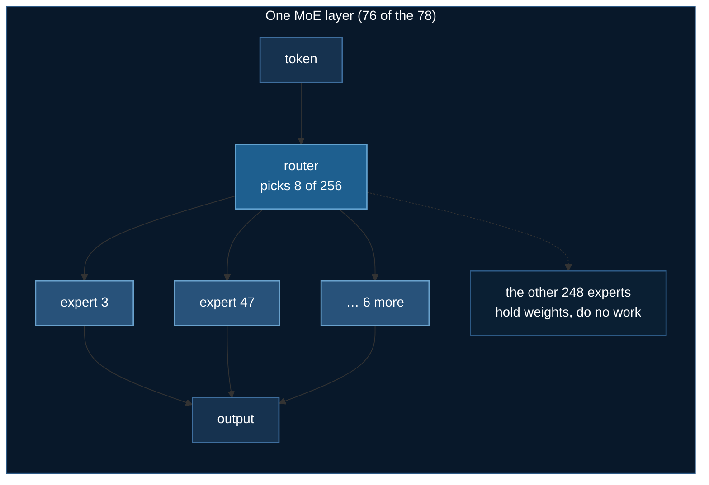

# GLM-5.3: Fine-tuning a 755 GB Sparse MoE

[GLM-5.3](https://huggingface.co/zai-org/GLM-5.3) was released by zai-org on
2026-08-31. It is a ~743-billion-parameter sparse mixture-of-experts model, and
almost everything a Llama fine-tuning recipe teaches you is either wrong or
irrelevant for it.

This page is about the reasoning you do *before* you download 755 GB.

Code: [`03_huggingface/01_llm_finetuning/train_glm53_ds.py`](https://github.com/yiqiao-yin/deepspeed-course/blob/main/03_huggingface/01_llm_finetuning/train_glm53_ds.py)

:::tip Everything here runs without a GPU
```bash
uv run train_glm53_ds.py --plan
```
reads the published `config.json` and prints the whole analysis below — where
the parameters live, what LoRA should target, what the KV cache costs, and
whether your hardware can hold the model. No download, no GPU.
:::

## 1. Reading a model before downloading it

Two files on the Hub tell you nearly everything, and both are small:

- `config.json` — dimensions, expert counts, attention type
- `model.safetensors.index.json` — a map of **every** tensor name to its shard

For GLM-5.3 that index lists **118,629 tensors** and a total of 755,617,140,416
bytes. Reading it is how the LoRA target modules in this example were *verified*
rather than guessed, and it costs about 11 MB instead of 755 GB.

| | |
|---|---|
| architecture | `GlmMoeDsaForCausalLM` (`model_type: glm_moe_dsa`) |
| parameters | ~743 B, with 8 of 256 experts active per token |
| weights | **755.7 GB** fp8 / 1,506.7 GB bf16 |
| layers | 78 (+1 multi-token-prediction layer) |
| attention | MLA — compressed q/kv (`q_lora_rank` 2048, `kv_lora_rank` 512) |
| sparse attention | DSA indexer, on **22 of 78 layers only** |
| context | 1,048,576 tokens |
| requires | `transformers >= 5.15` |

## 2. A "743B model" is 97% experts

```
routed experts     724.78 B   97.5%
shared experts       2.83 B    0.4%
dense MLP layers     0.68 B    0.1%
attention           12.87 B    1.7%
router (gate)        0.12 B    0.0%
embeddings           1.90 B    0.3%
TOTAL              743.18 B
```



The computed 743.18 B cross-checks against the measured 755.7 GB of fp8 bytes —
fp8 is about one byte per parameter, and the ~1.7% gap is the `weight_scale_inv`
block-scale tensors. That cross-check is what makes the arithmetic trustworthy:
a common failure is to count `intermediate_size` once per layer as though the
model were dense, which reports this model as ~14 B and passes a capacity check
it should fail.

## 3. MLA does not save parameters — it saves the cache

This one is genuinely counterintuitive, and the first version of this example's
own test asserted the opposite and failed against correct code.

Multi-head Latent Attention compresses keys and values through a low-rank
projection. The intuition "compression means fewer parameters" is wrong here:

$$
\text{MLA attention} = 12.9\text{ B} \quad>\quad \text{vanilla } 4h^2L = 11.8\text{ B}
$$

GLM-5.3 uses 64 heads × 256 head_dim = 16,384, which is 2.7× its hidden size of
6,144, so `o_proj` alone is larger than a vanilla attention block. MLA
attention is *slightly bigger* in parameter count.

What it compresses is the **KV cache**:

| | per token | at 1,048,576 tokens |
|---|---|---|
| MLA (caches the latent + RoPE key) | **87.8 KB** | **94 GB** |
| vanilla MHA (caches k and v per head) | 4,992 KB | 5,360 GB |

A 57× reduction, and the only reason a 1M-token context is physically possible.
Claiming the wrong benefit means sizing the wrong resource.

## 4. Why LoRA targets attention, not the experts

The targets are `q_a_proj`, `q_b_proj`, `kv_a_proj_with_mqa`, `kv_b_proj`,
`o_proj` — verified against the safetensors index. The 256 expert MLPs, 97% of
the model, stay **frozen**. So does the router.

:::danger Copying q_proj/k_proj/v_proj from a Llama recipe matches nothing
Those names do not exist in this model. Depending on the peft version that
either raises, or silently attaches an adapter to nothing — and the loss still
goes down, because the base model is already good. A LoRA run that trained
nothing looks exactly like one that worked.
:::

**Why not adapt the experts, when they are where the parameters are?**

An adapter on expert *k* only receives gradient when the router sends a token to
expert *k*. At top-8 of 256, each expert sees roughly **3% of tokens**. You would
add hundreds of thousands of adapter matrices, each training on a sliver of the
data, most staying near their initialisation. Attention is shared by every token
on every layer, so one adapter there sees the entire dataset — for 2% of the
parameters.

**Why leave the router frozen?** Training it changes *which* experts fire, a far
more destructive edit than changing how they are read. Routing collapse — where
the router learns to send everything to a handful of experts — is the classic
way a fine-tuned MoE quietly degrades, and it does not announce itself in the
loss.

## 5. LoRA does not make it fit

The most common misconception about parameter-efficient fine-tuning:

> LoRA freezes the base weights, which removes **optimizer state**. It does not
> reduce what it costs to **hold** the model.

All 755 GB must still be resident across your ranks.

| configuration | total VRAM | holds fp8 GLM-5.3? |
|---|---|---|
| 1 × A100 80GB | 80 GB | no — 11.3× short |
| 8 × A100 80GB | 640 GB | no |
| 8 × H100 80GB | 640 GB | no |
| 8 × H200 141GB | 1,128 GB | **yes**, with room for LoRA + activations |
| 8 × B200 192GB | 1,536 GB | yes, comfortably |

The script computes this and refuses **before** downloading, because the
alternative is discovering it after 755 GB have landed:

```
    weights on disk   755.7 GB
    needed (x1.2)     906.8 GB   (LoRA frees optimizer state, NOT the base weights)
    you have          8 x 80 GB = 640 GB
    verdict           DOES NOT FIT — short by 1.4x
    would need        ~12 x 80 GB
```

This is also why the DeepSpeed config uses **ZeRO stage 3 and not stage 2**.
Stage 2 shards optimizer state and gradients, but every rank still holds a full
copy of the parameters — 755 GB per GPU, which no card has. Only stage 3 shards
the parameters themselves.

## 6. What is verified, and what is not

**This script has never been run against GLM-5.3 itself.** Nothing in it is
stubbed — the same code path runs both models and only the weights differ — but
being precise about which claims are proven matters more than a tidy story:

| | Status |
|---|---|
| The architecture and capacity analysis | **verified**, cross-checked against measured file sizes |
| LoRA target module names | **verified** against the published safetensors index |
| All four stages end to end | **verified on a rented RTX 3090** with `zai-org/glm-edge-1.5b-chat` |
| The same four stages on GLM-5.3 | **not verified** — needs ~8×H200, which was not available to rent |

## 7. Running it

```bash
cd 03_huggingface/01_llm_finetuning
uv sync

# no GPU: the whole analysis, and 26 property assertions
uv run train_glm53_ds.py --plan
uv run ../../tests/test_glm53_arch.py

# CoreWeave
sbatch run_glm53.sh --max-steps 20                        # cheap dry run
NUM_GPUS=1 sbatch run_glm53.sh --model zai-org/glm-edge-1.5b-chat

# RunPod, with automatic shutdown
uv run runpod/runpod_ctl.py run 03_huggingface/01_llm_finetuning \
    --dry-run --collect --wait --terminate --yes
uv run runpod/runpod_ctl.py pods        # must say "Nothing is billing."
```

## References

- [zai-org/GLM-5.3 on HuggingFace](https://huggingface.co/zai-org/GLM-5.3)
- DeepSeek-AI, *DeepSeek-V2* — the MLA design GLM-5.3's attention follows
- Hu et al., *LoRA: Low-Rank Adaptation of Large Language Models*, [arXiv:2106.09685](https://arxiv.org/abs/2106.09685)
- Rajbhandari et al., *ZeRO: Memory Optimizations Toward Training Trillion Parameter Models*, [arXiv:1910.02054](https://arxiv.org/abs/1910.02054)
