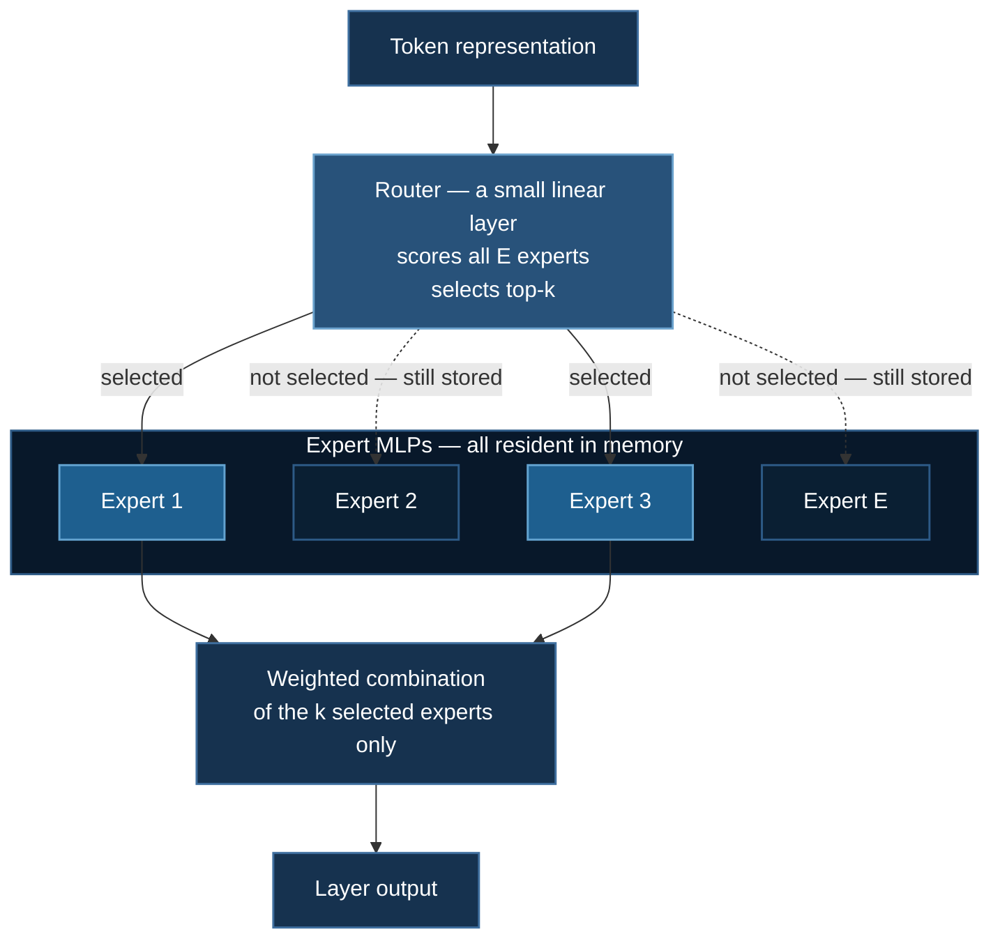

# GPT-OSS Fine-tuning

LoRA fine-tuning of `openai/gpt-oss-20b` — a **Mixture-of-Experts** model — with DeepSpeed. MoE changes the memory arithmetic, the LoRA targeting strategy, and what "20B parameters" means.

**Model:** `openai/gpt-oss-20b` · **Dataset:** `HuggingFaceH4/Multilingual-Thinking` · **Example:** `03_huggingface/08_gpt_oss_lora/lora`

## 1. Mixture-of-Experts Changes the Arithmetic

In a dense transformer every parameter participates in every forward pass. In an MoE, each layer's feed-forward block is replaced by $E$ **expert** MLPs plus a small **router** that selects the top-$k$ (typically 2–4) experts per token.



The consequence that matters for this page:

$$
\Psi_{\text{total}} \gg \Psi_{\text{active}}
$$

An MoE gets the *quality* of a large model at the *compute* of a small one, because only $k$ of $E$ experts run per token. But **memory is governed by $\Psi_{\text{total}}$, not $\Psi_{\text{active}}$** — every expert must be resident, since the router may select any of them for the next token.

:::warning "20B" is a memory number, not a compute number
Do not size your hardware from active parameters. All 20B parameters occupy VRAM regardless of how few are used per token. In BF16 that is $2\Psi = 40$ GB for weights alone, before optimizer states, gradients, or activations.

Full fine-tuning would need $16\Psi = 320$ GB of model states — four 80 GB A100s just to hold them, with nothing left for activations. **This is why the example uses LoRA**, and why full fine-tuning is not offered as an option.
:::

MoE also makes the model unusually **memory-bandwidth bound**: the arithmetic intensity per byte of weights read is low, since each expert's weights serve only the fraction of tokens routed to it.

## 2. Quick Start

```bash
cd 03_huggingface/08_gpt_oss_lora/lora

# SLURM
sbatch run_deepspeed.sh

# Direct
deepspeed --num_gpus=4 train_ds.py
```

Variants in the same directory, for different hardware:

| Script | Target |
|---|---|
| `train_ds.py` | `gpt-oss-20b` on 4× A100 / RTX 4090 |
| `train_ds_h200.py` | Datacenter GPUs — H200, H100, RTX 5090 |
| `train_ds_mistral7b.py` | Mistral-7B on 8 GB cards (2× RTX 3070) |

Start with the Mistral variant if you are validating the pipeline — it exercises the same code path at a fraction of the memory.

## 3. Model Loading

```python
model_kwargs = {
    "attn_implementation": "eager",
    "torch_dtype": torch.bfloat16,
    # ...
}
model = AutoModelForCausalLM.from_pretrained(model_name, **model_kwargs)
```

**`attn_implementation="eager"`.** The default would be SDPA or FlashAttention-2, which are faster and use less memory. `eager` is chosen because gpt-oss uses attention sinks and a sliding-window pattern that the fused kernels did not initially support; eager is the reference path that is always correct.

This is a real cost — you lose FlashAttention's removal of the $O(s^2)$ activation term. If your `transformers` and `kernels` versions support it, benchmark `"kernels-community/vllm-flash-attn3"` or `"sdpa"` and use it if outputs match.

**`torch_dtype=torch.bfloat16`.** Weights load directly in BF16 — 40 GB rather than 80 GB in FP32, and no loss scaling needed. See [BF16 over FP16](/docs/tutorials/huggingface/overview#bf16-over-fp16-for-llms).

:::note MXFP4 quantization
gpt-oss ships with MoE expert weights in **MXFP4** — a 4-bit microscaling format that stores a shared exponent per block of values. It is what makes a 20B MoE loadable on a single 80 GB card at inference.

For *training*, quantized experts complicate gradient flow, so the common approach is to dequantize to BF16 on load (as above) and adapt with LoRA. If you are memory-limited, `Mxfp4Config(dequantize=False)` keeps experts quantized — a QLoRA-style setup — at some cost in fidelity. Check that your `transformers` version supports the combination before relying on it.
:::

## 4. LoRA on MoE: `target_parameters`

```python
lora_config = LoraConfig(
    r=8,
    lora_alpha=16,
    target_parameters=[
        # ... expert projection tensors ...
    ],
    lora_dropout=0.0,   # must be 0 when using target_parameters
)
```

This is the unusual part, and it is specific to MoE.

Standard LoRA uses `target_modules` — names of `nn.Linear` submodules such as `q_proj`. **MoE experts are frequently not separate `nn.Linear` modules.** For efficiency they are stored as large stacked *parameter tensors* of shape `[num_experts, in_features, out_features]`, so that all experts can be gathered in one batched matmul. There is no module named `expert_7.gate_proj` for `target_modules` to match.

PEFT's `target_parameters` handles this by attaching adapters to **parameter tensors** directly rather than to modules.

:::warning `lora_dropout` must be 0 with `target_parameters`
The comment in the code is load-bearing. Dropout is implemented as a module wrapper applied to a module's input; with no module to wrap, PEFT cannot insert it, and a nonzero value raises or is silently ignored depending on version.

If you need regularization here, use weight decay or early stopping instead. In practice LoRA at $r=8$ on a 20B base is already heavily constrained and rarely overfits a small instruction set.
:::

The commented-out alternative in the source targets only attention projections:

```python
# lora_config = LoraConfig(
#     r=8, lora_alpha=16,
#     target_modules=["q_proj", "k_proj", "v_proj", "o_proj"],
#     lora_dropout=0.05,
# )
```

Which to use is a real decision. **Attention-only** is simpler, supports dropout, and adapts *how tokens attend*. **Expert-targeting** adapts the feed-forward computation where most MoE capacity lives, and is generally the stronger choice for teaching new content or a new language — which is what the multilingual dataset here is doing. Attention-only is often enough for style or format adaptation.

### Scale

At $r = 8$, a LoRA adapter over $d\times k$ adds $r(d + k)$ parameters against $dk$. For typical dimensions this is well under 1% of the model, so:

$$
M \approx \underbrace{2\Psi_{\text{base}}}_{\approx 40\ \text{GB, frozen BF16}} + \underbrace{16\Psi_{\text{LoRA}}}_{\text{a few hundred MB}} + M_{\text{act}}
$$

The frozen base dominates. That is the whole reason this fits.

## 5. DeepSpeed Configuration

From `ds_config.json` — note it is written entirely in `"auto"` form, so it requires HF `Trainer`:

```json
{
  "bf16": { "enabled": true },
  "zero_optimization": {
    "stage": 2,
    "allgather_partitions": true,
    "allgather_bucket_size": 2e8,
    "overlap_comm": true,
    "reduce_scatter": true,
    "reduce_bucket_size": 2e8,
    "contiguous_gradients": true,
    "offload_optimizer": { "device": "none" },
    "gather_16bit_weights_on_model_save": true
  },
  "optimizer": {
    "type": "AdamW",
    "params": { "lr": "auto", "betas": "auto", "eps": "auto", "weight_decay": "auto" }
  },
  "scheduler": {
    "type": "WarmupLR",
    "params": { "warmup_min_lr": "auto", "warmup_max_lr": "auto", "warmup_num_steps": "auto" }
  },
  "gradient_accumulation_steps": "auto",
  "gradient_clipping": "auto",
  "train_batch_size": "auto",
  "train_micro_batch_size_per_gpu": "auto",
  "data_types": { "grad_accum_dtype": "bf16" }
}
```

| Setting | Why |
|---|---|
| **Stage 2, not 3** | LoRA. Stage 3 would gather 40 GB of frozen expert weights every forward and backward to partition a few hundred MB of trainable state — see [the LoRA note](/docs/tutorials/huggingface/overview#3-choosing-a-strategy-from-parameter-count) |
| `offload_optimizer: none` | The optimizer state is LoRA-sized. Offloading it would add PCIe traffic to save nothing |
| All keys `"auto"` | Resolved from `TrainingArguments` by `Trainer` — [see the mechanism](/docs/tutorials/huggingface/overview#2-the-auto-mechanism) |
| `grad_accum_dtype: bf16` | Accumulate gradients in BF16 rather than FP32. Saves memory; with many accumulation steps, watch for precision loss |
| `activation_checkpointing` present but all-false | Not enabled by default. **Turn it on if you OOM** — it is the highest-value memory lever here |

The config also contains `stage3_*` keys. They are inert at Stage 2 — harmless, but do not read them as evidence that Stage 3 is active.

### Training hyperparameters

| Parameter | Value |
|---|---|
| Learning rate | 2e-4 |
| Epochs | 10 |
| LoRA $r$ / $\alpha$ | 8 / 16 |
| Dataset | `HuggingFaceH4/Multilingual-Thinking` |

$2\times10^{-4}$ is roughly 10× a typical full fine-tuning rate, which is standard and correct for LoRA: the adapter is randomly initialized and low-rank, so it tolerates — and needs — larger steps than pretrained weights would.

## 6. Hardware

| Setup | Feasible? | Notes |
|---|---|---|
| 4× A100 80 GB | Yes | The reference configuration |
| 4× RTX 4090 (96 GB total) | Yes | Enable activation checkpointing |
| 2× H100/H200 | Yes | `train_ds_h200.py` |
| 1× A100 80 GB | Tight | 40 GB weights + activations; needs checkpointing and short sequences |
| 2× RTX 3070 (16 GB) | No — for 20B | Use `train_ds_mistral7b.py` |

`HARDWARE_GUIDE.md` in the example directory has the full comparison.

## 7. Troubleshooting

**OOM on load, before training.** 40 GB of BF16 weights do not fit. More GPUs, the Mistral variant, or MXFP4 without dequantization.

**OOM during training.** Enable activation checkpointing in `ds_config.json` (`partition_activations: true`) and `gradient_checkpointing=True` in `TrainingArguments`. Then shorten sequences.

**`lora_dropout must be 0` error.** §4 — an artifact of `target_parameters`.

**`target_parameters` unrecognized.** Requires a recent PEFT. Upgrade, or fall back to the commented `target_modules` variant.

**`"auto"` unresolved.** You are not running under HF `Trainer`.

**Very slow steps.** `attn_implementation="eager"` is the likely cause (§3); also check that experts are not being dequantized every forward.

**Checkpoint will not reload.** For LoRA, save adapters with `model.save_pretrained()` — you do not need to write 40 GB of unchanged base weights. `gather_16bit_weights_on_model_save` matters only if you merge and export the full model.

## Next Steps

- [GRPO Training](/docs/tutorials/huggingface/grpo-training) — RL on top of an SFT'd model
- [HuggingFace Integration](/docs/tutorials/huggingface/overview) — `"auto"`, and choosing a stage
- [ZeRO Stages](/docs/getting-started/deepspeed-zero-stages) — why Stage 2 under LoRA

## References

**Mixture-of-Experts**

1. Shazeer, N., Mirhoseini, A., Maziarz, K., et al. (2017). Outrageously Large Neural Networks: The Sparsely-Gated Mixture-of-Experts Layer. *ICLR 2017*. [arXiv:1701.06538](https://arxiv.org/abs/1701.06538)
2. Fedus, W., Zoph, B., & Shazeer, N. (2022). Switch Transformers: Scaling to Trillion Parameter Models with Simple and Efficient Sparsity. *JMLR*, 23(120). [arXiv:2101.03961](https://arxiv.org/abs/2101.03961)
3. Lepikhin, D., Lee, H., Xu, Y., et al. (2021). GShard: Scaling Giant Models with Conditional Computation and Automatic Sharding. *ICLR 2021*. [arXiv:2006.16668](https://arxiv.org/abs/2006.16668)
4. Jiang, A. Q., Sablayrolles, A., Roux, A., et al. (2024). Mixtral of Experts. [arXiv:2401.04088](https://arxiv.org/abs/2401.04088)
5. Rajbhandari, S., Li, C., Yao, Z., et al. (2022). DeepSpeed-MoE: Advancing Mixture-of-Experts Inference and Training to Power Next-Generation AI Scale. *ICML 2022*. [arXiv:2201.05596](https://arxiv.org/abs/2201.05596)

**Parameter-efficient fine-tuning and quantization**

6. Hu, E. J., Shen, Y., Wallis, P., et al. (2022). LoRA. *ICLR 2022*. [arXiv:2106.09685](https://arxiv.org/abs/2106.09685)
7. Dettmers, T., Pagnoni, A., Holtzman, A., & Zettlemoyer, L. (2023). QLoRA. *NeurIPS 2023*. [arXiv:2305.14314](https://arxiv.org/abs/2305.14314)
8. Rouhani, B. D., Zhao, R., More, A., et al. (2023). Microscaling Data Formats for Deep Learning. [arXiv:2310.10537](https://arxiv.org/abs/2310.10537) — the MX format family behind MXFP4.
9. Dao, T., Fu, D. Y., Ermon, S., Rudra, A., & Ré, C. (2022). FlashAttention. *NeurIPS 2022*. [arXiv:2205.14135](https://arxiv.org/abs/2205.14135)
10. [PEFT documentation](https://huggingface.co/docs/peft) · [gpt-oss model card](https://huggingface.co/openai/gpt-oss-20b)
