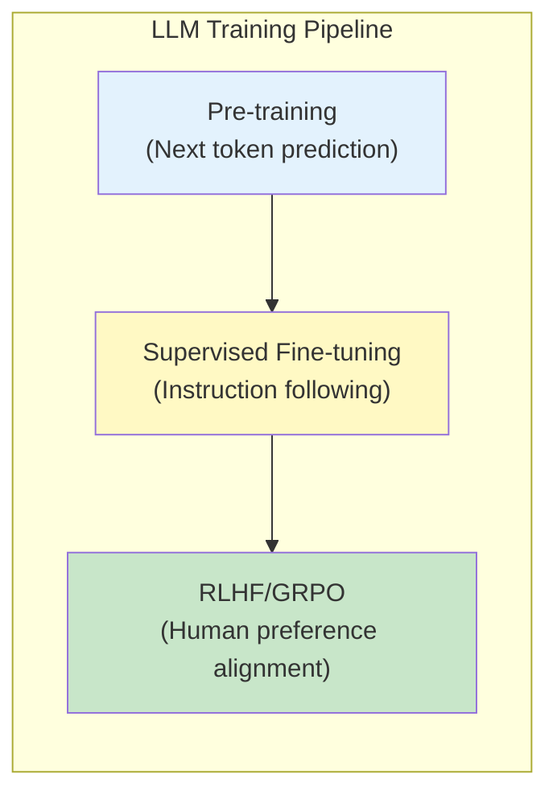
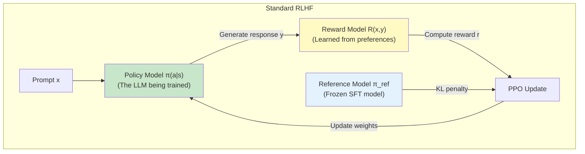
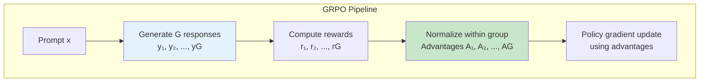
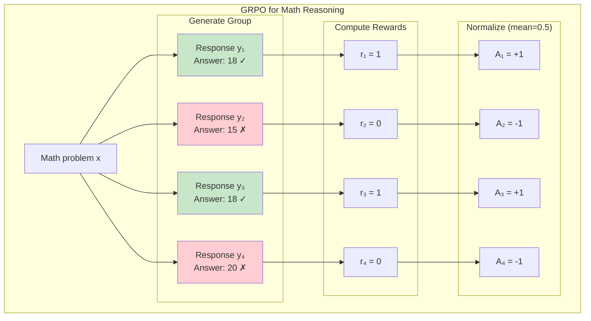
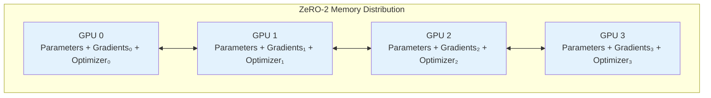
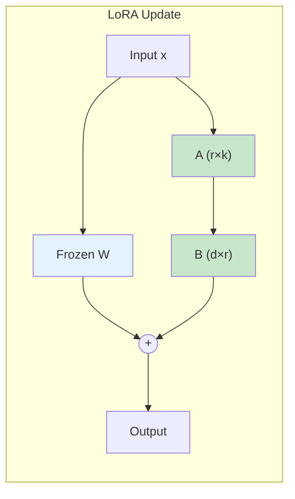
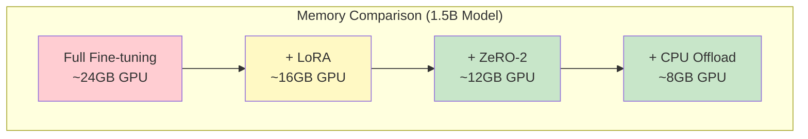

# GRPO Training

Memory-efficient GRPO (Group Relative Policy Optimization) fine-tuning for mathematical reasoning.

## Overview

This example demonstrates:
- GRPO algorithm implementation
- LoRA for parameter efficiency
- ZeRO-2 with CPU offloading
- Training on consumer GPUs (8GB+)

**Model:** Qwen-1.5B (distilled)
**Dataset:** GSM8K (8K math reasoning samples)
**Target:** 8GB GPU support

---

## The Evolution of LLM Alignment

### From Pre-training to Alignment

Large Language Models (LLMs) are trained in multiple stages:



| Stage | Objective | Data |
|-------|-----------|------|
| Pre-training | Predict next token | Trillions of tokens from web |
| SFT | Follow instructions | Human-written responses |
| RLHF/GRPO | Align with preferences | Human preference comparisons |

### Why Do We Need Alignment?

Pre-trained models learn to predict text, but they don't learn:
- Which responses humans **prefer**
- How to be **helpful** vs just fluent
- How to avoid **harmful** outputs
- How to reason **step-by-step**

**The Alignment Problem:** How do we make models that do what we *want*, not just what they *predict*?

---

## Reinforcement Learning from Human Feedback (RLHF)

### The Standard RLHF Pipeline

Traditional RLHF involves three components:



### The PPO Objective

Proximal Policy Optimization (PPO) maximizes:

$$
\mathcal{L}_{\text{PPO}} = \mathbb{E}_{(x,y) \sim \pi_\theta} \left[ R(x, y) - \beta \cdot D_{KL}(\pi_\theta \| \pi_{ref}) \right]
$$

Where:
- $R(x, y)$ is the reward for response $y$ to prompt $x$
- $D_{KL}(\pi_\theta \| \pi_{ref})$ prevents the policy from drifting too far from the reference
- $\beta$ controls the strength of the KL penalty

### Problems with Standard RLHF

| Issue | Description |
|-------|-------------|
| **Reward Model Required** | Must train a separate reward model on preference data |
| **Training Instability** | PPO is notoriously unstable with language models |
| **Memory Intensive** | Need 3 models in memory: policy, reward, reference |
| **Reward Hacking** | Model may exploit reward model weaknesses |
| **Variance** | High variance in gradient estimates |

---

## Direct Preference Optimization (DPO)

### Eliminating the Reward Model

DPO showed that the reward model can be **implicitly** derived from preferences:

$$
R(x, y) = \beta \log \frac{\pi_\theta(y|x)}{\pi_{ref}(y|x)} + \beta \log Z(x)
$$

This leads to the DPO loss:

$$
\mathcal{L}_{\text{DPO}} = -\mathbb{E}_{(x, y_w, y_l)} \left[ \log \sigma \left( \beta \log \frac{\pi_\theta(y_w|x)}{\pi_{ref}(y_w|x)} - \beta \log \frac{\pi_\theta(y_l|x)}{\pi_{ref}(y_l|x)} \right) \right]
$$

Where:
- $y_w$ is the **preferred** (winning) response
- $y_l$ is the **rejected** (losing) response
- $\sigma$ is the sigmoid function

### DPO Advantages

- No reward model needed
- Simpler training pipeline
- More stable than PPO

### DPO Limitations

- Requires **paired preferences** (winner vs loser)
- Cannot easily incorporate **reward signals** from verifiers
- Limited to **pairwise** comparisons

---

## Group Relative Policy Optimization (GRPO)

### The Key Innovation

GRPO, introduced by DeepSeek, addresses limitations of both PPO and DPO by:

1. **Generating multiple responses** per prompt (a "group")
2. **Computing rewards** for each response (can use any reward function)
3. **Normalizing rewards** within each group (relative ranking)
4. **Eliminating the reference model** (no KL divergence term needed)



### Why "Group Relative"?

The key insight is that **absolute reward values don't matter** — only the **relative ranking** within a group matters.

For a prompt $x$ with $G$ generated responses $\{y_1, y_2, \ldots, y_G\}$:

$$
\bar{r} = \frac{1}{G} \sum_{i=1}^{G} r_i, \quad \sigma_r = \sqrt{\frac{1}{G} \sum_{i=1}^{G} (r_i - \bar{r})^2}
$$

The **advantage** for each response:

$$
A_i = \frac{r_i - \bar{r}}{\sigma_r}
$$

This normalization:
- Makes training **scale-invariant** to reward magnitude
- Provides **natural baseline subtraction** (reduces variance)
- Creates **contrastive signal** within each group

### The GRPO Objective

GRPO maximizes the following objective:

$$
\mathcal{L}_{\text{GRPO}} = \mathbb{E}_{x \sim \mathcal{D}} \left[ \mathbb{E}_{y_1, \ldots, y_G \sim \pi_\theta(\cdot|x)} \left[ \frac{1}{G} \sum_{i=1}^{G} A_i \cdot \log \pi_\theta(y_i | x) \right] \right]
$$

Breaking this down:
- Sample a prompt $x$ from the dataset
- Generate $G$ responses from the current policy
- Compute normalized advantages $A_i$ for each response
- Update policy to increase probability of high-advantage responses

### Policy Gradient Derivation

The gradient of the GRPO objective is:

$$
\nabla_\theta \mathcal{L}_{\text{GRPO}} = \mathbb{E} \left[ \frac{1}{G} \sum_{i=1}^{G} A_i \cdot \nabla_\theta \log \pi_\theta(y_i | x) \right]
$$

This is a **REINFORCE-style** gradient where:
- Positive advantages → increase response probability
- Negative advantages → decrease response probability
- Zero-mean advantages → natural variance reduction

### Why No Reference Model?

Traditional RLHF uses a KL penalty to prevent the policy from deviating too far:

$$
\mathcal{L}_{\text{RLHF}} = R(x,y) - \beta \cdot D_{KL}(\pi_\theta \| \pi_{ref})
$$

GRPO achieves similar regularization through:
1. **Group normalization** — relative advantages prevent extreme updates
2. **Clipping** — limits the size of policy updates (like PPO)
3. **Small learning rates** — gradual policy changes

This eliminates the need to keep a reference model in memory!

---

## GRPO vs Other Methods

### Comparison Table

| Aspect | PPO (RLHF) | DPO | GRPO |
|--------|-----------|-----|------|
| Reward Model | Required | Not needed | Optional (can use verifiers) |
| Reference Model | Required | Required | Not needed |
| Memory (3B model) | ~36GB | ~24GB | ~12GB |
| Training Stability | Low | High | High |
| Reward Type | Learned | Implicit | Flexible (verifier, LLM judge, etc.) |
| Data Format | Single responses | Paired preferences | Multiple responses per prompt |

### When to Use GRPO

GRPO is particularly effective for:

| Use Case | Why GRPO Works Well |
|----------|---------------------|
| **Math reasoning** | Can use answer verification as reward |
| **Code generation** | Can use test execution as reward |
| **Factual QA** | Can use retrieval verification as reward |
| **Reasoning chains** | Can reward correct intermediate steps |

---

## Mathematical Reasoning with GRPO

### The GSM8K Task

GSM8K contains grade-school math word problems:

```
Question: Janet's ducks lay 16 eggs per day. She eats 3 for breakfast
every morning and bakes muffins for her friends every day with 4 eggs.
She sells the remainder at the farmers' market for $2 per egg. How much
does she make every day?

Answer: Janet has 16 - 3 - 4 = 9 eggs remaining.
She makes 9 * 2 = $18 every day.
#### 18
```

### Reward Function for Math

For math problems, we can use a **verifiable reward**:

$$
R(x, y) = \begin{cases}
1 & \text{if extracted answer matches ground truth} \\
0 & \text{otherwise}
\end{cases}
$$

```python
def compute_reward(response: str, ground_truth: str) -> float:
    """Binary reward based on answer correctness."""
    # Extract the final answer (after ####)
    extracted = extract_answer(response)

    # Compare with ground truth
    if extracted == ground_truth:
        return 1.0
    else:
        return 0.0
```

### Why GRPO Excels at Math



The model learns to:
- **Increase probability** of reasoning chains that lead to correct answers
- **Decrease probability** of reasoning chains that lead to wrong answers
- **Generalize** correct reasoning patterns across problems

---

## GRPO Training Algorithm

### Complete Algorithm

```
Algorithm: GRPO Training

Input: Dataset D, Policy π_θ, Group size G, Learning rate α
Output: Trained policy π_θ

1. For each training iteration:

   # Sample batch of prompts
   2. Sample batch B = {x₁, x₂, ..., xₙ} from D

   # Generate response groups
   3. For each prompt xᵢ in B:
      - Generate G responses: {yᵢ₁, yᵢ₂, ..., yᵢG} ~ π_θ(·|xᵢ)

   # Compute rewards
   4. For each response yᵢⱼ:
      - Compute reward rᵢⱼ = R(xᵢ, yᵢⱼ)

   # Normalize within groups
   5. For each prompt xᵢ:
      - Compute mean: r̄ᵢ = (1/G) Σⱼ rᵢⱼ
      - Compute std: σᵢ = sqrt((1/G) Σⱼ (rᵢⱼ - r̄ᵢ)²)
      - Compute advantages: Aᵢⱼ = (rᵢⱼ - r̄ᵢ) / (σᵢ + ε)

   # Policy gradient update
   6. Compute loss: L = -(1/NG) Σᵢ Σⱼ Aᵢⱼ · log π_θ(yᵢⱼ|xᵢ)

   7. Update: θ ← θ - α · ∇_θ L

8. Return π_θ
```

### Key Implementation Details

#### Response Generation

```python
def generate_group(model, prompt, group_size=4, temperature=0.7):
    """Generate multiple responses for a single prompt."""
    responses = []
    for _ in range(group_size):
        response = model.generate(
            prompt,
            max_new_tokens=256,
            temperature=temperature,
            do_sample=True
        )
        responses.append(response)
    return responses
```

#### Advantage Computation

```python
def compute_advantages(rewards: torch.Tensor, eps: float = 1e-8):
    """
    Compute normalized advantages within each group.

    Args:
        rewards: Tensor of shape [batch_size, group_size]

    Returns:
        advantages: Tensor of shape [batch_size, group_size]
    """
    # Compute mean and std within each group (along group dimension)
    mean = rewards.mean(dim=1, keepdim=True)
    std = rewards.std(dim=1, keepdim=True)

    # Normalize
    advantages = (rewards - mean) / (std + eps)

    return advantages
```

#### GRPO Loss

```python
def grpo_loss(log_probs: torch.Tensor, advantages: torch.Tensor):
    """
    Compute GRPO policy gradient loss.

    Args:
        log_probs: Log probabilities of responses [batch, group_size]
        advantages: Normalized advantages [batch, group_size]

    Returns:
        loss: Scalar loss value
    """
    # Policy gradient: maximize advantage-weighted log probs
    # Negate for minimization
    loss = -(advantages * log_probs).mean()

    return loss
```

---

## Distributed GRPO Training

### Why Distributed Training?

GRPO benefits significantly from distributed training:

| Aspect | Single GPU | Multi-GPU |
|--------|-----------|-----------|
| **Batch diversity** | Limited prompts | More diverse prompts |
| **Response diversity** | Same model generates all | Can use model parallelism |
| **Memory** | Limited by single GPU | Aggregate across GPUs |
| **Throughput** | Sequential generation | Parallel generation |

### DeepSpeed ZeRO for GRPO



### Training Strategy

For GRPO with DeepSpeed:

1. **Each GPU** generates responses for a subset of prompts
2. **All-reduce** aggregates rewards across GPUs
3. **ZeRO** partitions optimizer states and gradients
4. **Gradient accumulation** enables large effective batch sizes

```python
# Distributed GRPO training loop
for batch in dataloader:
    prompts = batch["prompts"]

    # Each GPU generates for its local prompts
    responses = generate_group(model, prompts, group_size=4)

    # Compute rewards (can be done locally)
    rewards = compute_rewards(responses, batch["answers"])

    # Normalize advantages within each group
    advantages = compute_advantages(rewards)

    # Compute log probabilities
    log_probs = compute_log_probs(model, prompts, responses)

    # GRPO loss
    loss = grpo_loss(log_probs, advantages)

    # DeepSpeed backward (handles gradient accumulation)
    model.backward(loss)
    model.step()
```

---

## Quick Start

```bash
cd 06_huggingface_grpo

# SLURM submission
sbatch run_deepspeed.sh

# Direct execution
deepspeed --num_gpus=1 grpo_gsm8k_train.py
```

## LoRA Configuration

```python
from peft import LoraConfig

lora_config = LoraConfig(
    r=16,                    # Rank of update matrices
    lora_alpha=32,           # Scaling factor
    target_modules=[         # Which layers to adapt
        "q_proj", "k_proj",
        "v_proj", "o_proj"
    ],
    lora_dropout=0.05,       # Regularization
    bias="none",             # Don't train biases
    task_type="CAUSAL_LM"
)
```

### Why LoRA for GRPO?

LoRA (Low-Rank Adaptation) is essential for memory-efficient GRPO:

$$
W_{new} = W_{frozen} + \Delta W = W_{frozen} + BA
$$

Where:
- $W_{frozen} \in \mathbb{R}^{d \times k}$ is the pre-trained weight (frozen)
- $B \in \mathbb{R}^{d \times r}$ and $A \in \mathbb{R}^{r \times k}$ are trainable
- $r \ll \min(d, k)$ is the low rank

Benefits for GRPO:
- Only trains ~1% of parameters
- Fits on 8GB GPUs
- Fast iterations for RL training
- Can merge back into base model



---

## DeepSpeed Configuration

```json
{
  "bf16": {"enabled": true},
  "zero_optimization": {
    "stage": 2,
    "offload_optimizer": {
      "device": "cpu",
      "pin_memory": true
    },
    "contiguous_gradients": true,
    "overlap_comm": true
  },
  "gradient_accumulation_steps": 8,
  "train_micro_batch_size_per_gpu": 1,
  "gradient_clipping": 1.0
}
```

### Configuration Breakdown

| Setting | Value | Purpose |
|---------|-------|---------|
| `bf16.enabled` | true | Memory-efficient training |
| `zero_optimization.stage` | 2 | Partition gradients + optimizer |
| `offload_optimizer.device` | cpu | Move optimizer states to CPU |
| `gradient_accumulation_steps` | 8 | Effective batch size = 8 |
| `train_micro_batch_size_per_gpu` | 1 | Fit in limited GPU memory |

### Memory Savings



---

## GSM8K Dataset

Mathematical word problems with chain-of-thought solutions:

```
Q: Janet's ducks lay 16 eggs per day. She eats three for breakfast
every morning and bakes muffins for her friends. How many eggs does
she have left?

A: Janet starts with 16 eggs. She eats 3. So she has 16 - 3 = 13.
#### 13
```

### Dataset Statistics

| Property | Value |
|----------|-------|
| Training samples | 7,473 |
| Test samples | 1,319 |
| Average question length | 46 words |
| Average solution length | 3.5 steps |

---

## Memory Requirements

| Configuration | GPU Memory | System RAM |
|--------------|------------|------------|
| Full model | 24 GB | 32 GB |
| LoRA + ZeRO-2 | 12 GB | 32 GB |
| LoRA + Offload | 8 GB | 64 GB |

## Training Parameters

| Parameter | Value |
|-----------|-------|
| Base LR | 5e-5 |
| LoRA rank | 16 |
| Group size | 4 |
| Batch size | 1 per GPU |
| Gradient accum | 8 |
| Epochs | 3 |

---

## Monitoring GRPO Training

### Key Metrics

```python
# Metrics to track during GRPO training
metrics = {
    "reward/mean": rewards.mean(),           # Average reward
    "reward/std": rewards.std(),             # Reward variance
    "advantage/mean": advantages.mean(),     # Should be ~0
    "advantage/std": advantages.std(),       # Should be ~1
    "policy/entropy": -log_probs.mean(),     # Exploration
    "accuracy": (rewards > 0).float().mean() # Task performance
}
```

### Expected Training Curves

```
Epoch 1:
  Accuracy: 0.35 → 0.45
  Reward mean: 0.35 → 0.45

Epoch 2:
  Accuracy: 0.45 → 0.55
  Reward mean: 0.45 → 0.55

Epoch 3:
  Accuracy: 0.55 → 0.62
  Reward mean: 0.55 → 0.62

Final GSM8K Accuracy: ~62% (from ~35% baseline)
```

---

## Advanced GRPO Techniques

### KL Penalty (Optional)

For more stable training, add a KL penalty:

$$
\mathcal{L} = \mathcal{L}_{\text{GRPO}} + \beta \cdot D_{KL}(\pi_\theta \| \pi_{old})
$$

```python
def grpo_loss_with_kl(log_probs, old_log_probs, advantages, beta=0.01):
    # GRPO term
    pg_loss = -(advantages * log_probs).mean()

    # KL penalty (approximate)
    kl = (old_log_probs - log_probs).mean()

    return pg_loss + beta * kl
```

### Reward Shaping

For complex tasks, combine multiple reward signals:

$$
R(x, y) = w_1 \cdot R_{correctness} + w_2 \cdot R_{format} + w_3 \cdot R_{length}
$$

```python
def compute_shaped_reward(response, ground_truth):
    # Primary: answer correctness
    r_correct = 1.0 if extract_answer(response) == ground_truth else 0.0

    # Secondary: proper formatting
    r_format = 0.1 if "####" in response else 0.0

    # Tertiary: reasonable length
    r_length = 0.05 if 50 < len(response) < 500 else 0.0

    return r_correct + r_format + r_length
```

---

## Summary: GRPO Key Equations

### Advantage Computation
$$
A_i = \frac{r_i - \bar{r}}{\sigma_r}, \quad \bar{r} = \frac{1}{G}\sum_{i=1}^G r_i
$$

### Policy Gradient
$$
\nabla_\theta \mathcal{L} = \mathbb{E}\left[\frac{1}{G}\sum_{i=1}^G A_i \cdot \nabla_\theta \log \pi_\theta(y_i|x)\right]
$$

### LoRA Update
$$
W_{new} = W_{frozen} + BA, \quad B \in \mathbb{R}^{d \times r}, A \in \mathbb{R}^{r \times k}
$$

---

## Troubleshooting

### Low Reward Variance

If all responses get similar rewards:
- Increase temperature for more diverse generation
- Use larger group size
- Check reward function implementation

### Training Instability

- Reduce learning rate
- Increase gradient accumulation
- Add KL penalty
- Use gradient clipping

### Out of Memory

- Enable CPU offloading
- Reduce group size
- Use smaller LoRA rank
- Enable gradient checkpointing

---

## Next Steps

- [GPT-OSS Fine-tuning](/docs/tutorials/huggingface/gpt-oss-finetuning) - Larger models
- [Multi-Agent](/docs/tutorials/huggingface/multi-agent) - Ensemble learning
