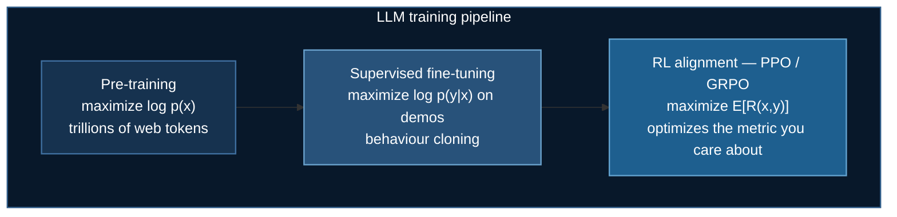
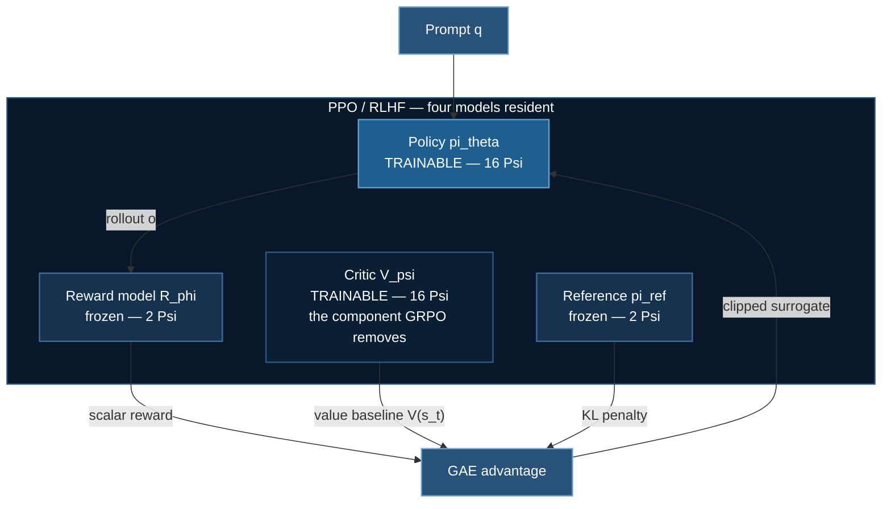
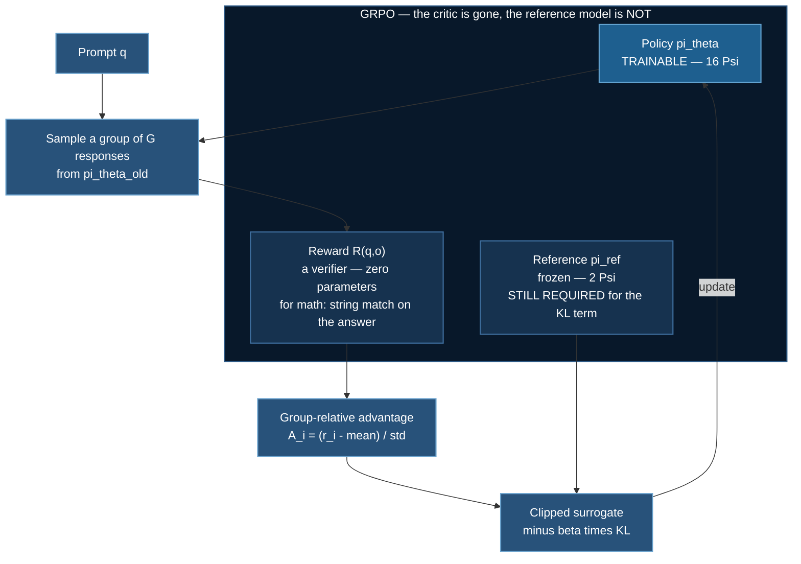
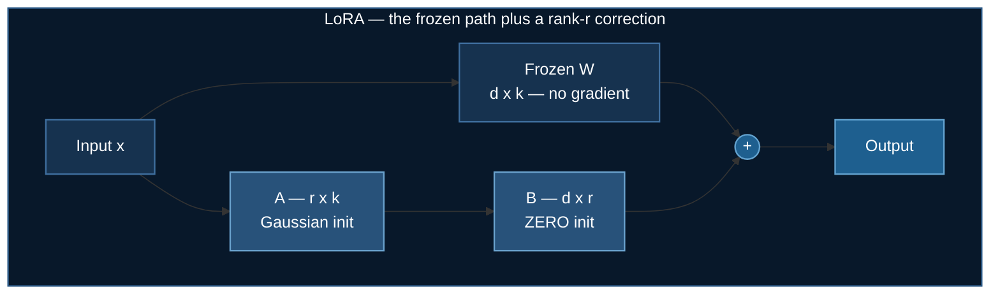

# GRPO Training

Group Relative Policy Optimization — derived from the policy gradient theorem, situated against PPO, DPO and RLOO, with its known biases stated and its memory footprint accounted for. Then a memory-efficient implementation on GSM8K with LoRA and DeepSpeed ZeRO-2.

**Model:** Qwen-1.5B (distilled) · **Dataset:** GSM8K · **Target:** 8 GB GPU

:::danger Correction to a widespread misconception
GRPO is frequently described — including in earlier versions of this page — as *"eliminating the reference model, so no KL term is needed."* **This is wrong.** The objective published in DeepSeekMath (Shao et al., 2024, Eq. 3) contains an explicit $\beta\,\mathbb{D}_{\mathrm{KL}}\!\left[\pi_\theta \,\|\, \pi_{\text{ref}}\right]$ term and requires a frozen reference model.

What GRPO eliminates is the **critic** (value network) — a *trainable* model the same size as the policy. That is where the memory saving comes from, and it is a much stronger claim than dropping a frozen reference. The distinction is developed in [§5](#5-what-grpo-actually-removes-a-memory-accounting).
:::

---

## 1. Why Reinforcement Learning At All

An LLM is trained in stages, and each stage optimizes a different objective:


```mermaid
flowchart LR
    subgraph PIPE["LLM training pipeline"]
        direction LR
        PT["Pre-training<br/>maximize log p(x)<br/>trillions of web tokens"]
        SFT["Supervised fine-tuning<br/>maximize log p(y|x) on demos<br/>behaviour cloning"]
        RL["RL alignment — PPO / GRPO<br/>maximize E[R(x,y)]<br/>optimizes the metric you care about"]
    end

    PT --> SFT --> RL

    classDef deep fill:#08182a,stroke:#2d5a86,stroke-width:1.5px,color:#ffffff
    classDef base fill:#16324f,stroke:#3f6f9f,stroke-width:1.5px,color:#ffffff
    classDef steel fill:#28527a,stroke:#6aa2cd,stroke-width:1.5px,color:#ffffff
    classDef bright fill:#1e5f8f,stroke:#63a3d0,stroke-width:1.5px,color:#ffffff
    class PT base
    class SFT steel
    class RL bright
    class PIPE deep
```

The reason RL is not redundant with SFT is a **distribution mismatch**. SFT is maximum likelihood on a fixed corpus of demonstrations — behaviour cloning. It trains the model on the *demonstrator's* state distribution, but at inference the model must act on states induced by *its own* previous tokens. Errors compound: this is the classic covariate-shift argument of DAgger (Ross et al., 2011), and in the sequence setting it is exposure bias.

More fundamentally, SFT can only imitate. If a correct answer is reachable by a reasoning chain no human wrote down, likelihood training on human chains cannot find it. RL optimizes $\mathbb{E}_{y\sim\pi_\theta}[R(x,y)]$ — the quantity you actually care about — over the model's own output distribution, and can therefore discover behaviours absent from the demonstration set.

For mathematical reasoning this is especially compelling, because $R$ need not be learned at all: **the answer is checkable**. That is the regime GRPO was designed for.

## 2. From Policy Gradients to PPO

### 2.1 The policy gradient theorem

Treat generation as a finite-horizon MDP: state $s_t = (q, o_{<t})$ is the prompt plus tokens so far, action $a_t = o_t$ is the next token, and the policy is the LM itself, $\pi_\theta(o_t \mid q, o_{<t})$. We maximize

$$
J(\theta) = \mathbb{E}_{q \sim P(Q),\; o \sim \pi_\theta(\cdot\mid q)}\bigl[R(q, o)\bigr]
$$

The score-function identity $\nabla_\theta \pi_\theta = \pi_\theta \nabla_\theta \log \pi_\theta$ gives the REINFORCE estimator (Williams, 1992):

$$
\nabla_\theta J(\theta) = \mathbb{E}\left[R(q,o)\sum_{t=1}^{|o|}\nabla_\theta \log \pi_\theta(o_t \mid q, o_{<t})\right]
$$

This is unbiased and essentially unusable on its own: its variance scales with the magnitude of $R$ and with sequence length. With $|o| = 512$ tokens, a single scalar reward must be credited across 512 factors.

### 2.2 Baselines and why they are free

For any function $b(s)$ that does not depend on the action,

$$
\mathbb{E}_{a\sim\pi_\theta}\bigl[\nabla_\theta\log\pi_\theta(a\mid s)\,b(s)\bigr]
= b(s)\sum_a \pi_\theta(a\mid s)\frac{\nabla_\theta\pi_\theta(a\mid s)}{\pi_\theta(a\mid s)}
= b(s)\,\nabla_\theta\!\!\underbrace{\sum_a \pi_\theta(a\mid s)}_{=\,1} = 0
$$

So replacing $R$ with the **advantage** $A = R - b(s)$ leaves the gradient unbiased while changing its variance. Choosing $b$ well is the entire game. **This identity is the hinge of the whole page: PPO, GRPO and RLOO differ almost exclusively in how they construct $b$.**

| Method | Baseline $b$ | Cost |
|---|---|---|
| REINFORCE | $0$ | None; variance is enormous |
| Actor–critic / PPO | $V_\psi(s)$, a learned value network | A second trainable model of policy size |
| RLOO | Mean reward of the *other* $G-1$ samples | $G$ samples per prompt, no extra model |
| **GRPO** | Mean reward of the group, then divided by group std | $G$ samples per prompt, no extra model |

### 2.3 PPO

PPO (Schulman et al., 2017) fixes a second problem: a large policy step can collapse the policy, and the sampled data is only valid near $\pi_{\theta_{\text{old}}}$. Define the importance ratio

$$
\rho_t(\theta) = \frac{\pi_\theta(o_t \mid q, o_{<t})}{\pi_{\theta_{\text{old}}}(o_t \mid q, o_{<t})}
$$

and optimize the clipped surrogate — the objective the DeepSeekMath paper states as its Eq. 1:

$$
\mathcal{J}_{\text{PPO}}(\theta) = \mathbb{E}\left[\frac{1}{|o|}\sum_{t=1}^{|o|}\min\Bigl(\rho_t(\theta)A_t,\;\operatorname{clip}\bigl(\rho_t(\theta), 1-\varepsilon, 1+\varepsilon\bigr)A_t\Bigr)\right]
$$

The $\min$ with a clipped copy creates a pessimistic bound: once the ratio moves beyond $1\pm\varepsilon$ in the direction that would *improve* the surrogate, the gradient is cut off. Typically $\varepsilon = 0.2$.

In RLHF, $A_t$ comes from GAE (Schulman et al., 2016) over a learned critic $V_\psi$. **That critic is the problem.** It is initialized from the policy, is the same size, and is trained concurrently — so it carries a full $16\Psi$ of model states. It is also genuinely hard to fit: it must predict the expected future reward of a partial generation, from a sparse terminal signal, on a non-stationary distribution.


```mermaid
flowchart TB
    subgraph PPOSYS["PPO / RLHF — four models resident"]
        direction TB
        POLICY["Policy pi_theta<br/>TRAINABLE — 16 Psi"]
        CRITIC["Critic V_psi<br/>TRAINABLE — 16 Psi<br/>the component GRPO removes"]
        RM["Reward model R_phi<br/>frozen — 2 Psi"]
        REF["Reference pi_ref<br/>frozen — 2 Psi"]
    end

    PROMPT["Prompt q"] --> POLICY
    POLICY -->|"rollout o"| RM
    RM -->|"scalar reward"| ADV["GAE advantage"]
    CRITIC -->|"value baseline V(s_t)"| ADV
    REF -->|"KL penalty"| ADV
    ADV -->|"clipped surrogate"| POLICY

    classDef deep fill:#08182a,stroke:#2d5a86,stroke-width:1.5px,color:#ffffff
    classDef base fill:#16324f,stroke:#3f6f9f,stroke-width:1.5px,color:#ffffff
    classDef steel fill:#28527a,stroke:#6aa2cd,stroke-width:1.5px,color:#ffffff
    classDef bright fill:#1e5f8f,stroke:#63a3d0,stroke-width:1.5px,color:#ffffff
    classDef dark fill:#0a1f33,stroke:#2d5a86,stroke-width:1.5px,color:#ffffff
    class POLICY bright
    class CRITIC dark
    class RM,REF base
    class PROMPT,ADV steel
    class PPOSYS deep
```

## 3. Direct Preference Optimization — the other escape route

DPO (Rafailov et al., 2023) takes a different exit. Under the KL-regularized RL objective the optimal policy has a closed form,

$$
\pi^{*}(y\mid x) = \frac{1}{Z(x)}\pi_{\text{ref}}(y\mid x)\exp\!\left(\tfrac{1}{\beta}R(x,y)\right)
$$

which can be inverted for the implied reward,

$$
R(x,y) = \beta\log\frac{\pi^{*}(y\mid x)}{\pi_{\text{ref}}(y\mid x)} + \beta\log Z(x)
$$

Substituting into a Bradley–Terry preference model, the intractable $Z(x)$ cancels between the two responses, leaving a supervised objective:

$$
\mathcal{L}_{\text{DPO}} = -\mathbb{E}_{(x,y_w,y_l)}\left[\log\sigma\!\left(\beta\log\frac{\pi_\theta(y_w\mid x)}{\pi_{\text{ref}}(y_w\mid x)} - \beta\log\frac{\pi_\theta(y_l\mid x)}{\pi_{\text{ref}}(y_l\mid x)}\right)\right]
$$

No rollouts, no reward model, no critic — DPO is a classification loss on a **fixed** preference dataset.

Its limitation is exactly what makes GRPO attractive for math. DPO is **off-policy and offline**: it can only learn from preference pairs already collected, cannot query a verifier during training, and cannot exploit a scalar reward that is cheap to evaluate on new samples. When you have a ground-truth checker, throwing it away to collect pairwise human preferences is a strange trade.

## 4. GRPO

### 4.1 The idea

Ask what the critic is *for*. It supplies a baseline: an estimate of the expected reward from state $s$. But if you are willing to sample $G$ responses to the *same* prompt, you can estimate that expectation by Monte Carlo — directly, with no learned model:

$$
V(q) \approx \bar r = \frac{1}{G}\sum_{i=1}^{G} r_i
$$

**Replace a learned function approximator with an empirical mean over a group of rollouts.** That is GRPO in one sentence. It exploits a property special to LLM alignment: unlike a robotics episode, generating $G$ samples from the same prompt is cheap and embarrassingly parallel.

### 4.2 The objective

For prompt $q$, sample a group $\{o_1,\dots,o_G\}\sim\pi_{\theta_{\text{old}}}(\cdot\mid q)$ and score each with $r_i = R(q, o_i)$. Under **outcome supervision**, every token of $o_i$ receives the same normalized advantage:

$$
\hat A_{i,t} = \tilde r_i = \frac{r_i - \operatorname{mean}(\mathbf{r})}{\operatorname{std}(\mathbf{r})}, \qquad \mathbf{r} = (r_1,\dots,r_G)
$$

Writing $\rho_{i,t}(\theta) = \dfrac{\pi_\theta(o_{i,t}\mid q, o_{i,<t})}{\pi_{\theta_{\text{old}}}(o_{i,t}\mid q, o_{i,<t})}$, the GRPO objective (Shao et al., 2024, Eq. 3) is

$$
\mathcal{J}_{\text{GRPO}}(\theta) = \mathbb{E}\Biggl[\frac{1}{G}\sum_{i=1}^{G}\frac{1}{|o_i|}\sum_{t=1}^{|o_i|}\Bigl\{\min\bigl(\rho_{i,t}\hat A_{i,t},\;\operatorname{clip}(\rho_{i,t}, 1-\varepsilon, 1+\varepsilon)\hat A_{i,t}\bigr) - \beta\,\mathbb{D}_{\mathrm{KL}}\bigl[\pi_\theta \,\|\, \pi_{\text{ref}}\bigr]\Bigr\}\Biggr]
$$

Compare term by term with $\mathcal{J}_{\text{PPO}}$: the clipped surrogate is **identical**. Exactly two things changed.

1. $A_t$ from a learned critic $\longrightarrow$ $\hat A_{i,t}$ from group statistics.
2. The KL penalty moved *out of the reward* and *into the loss*, as an explicit term with its own estimator.

Everything else — the ratio, the clip, $\varepsilon$ — is PPO.


```mermaid
flowchart TB
    subgraph GRPOSYS["GRPO — the critic is gone, the reference model is NOT"]
        direction TB
        POLICY["Policy pi_theta<br/>TRAINABLE — 16 Psi"]
        REF["Reference pi_ref<br/>frozen — 2 Psi<br/>STILL REQUIRED for the KL term"]
        VERIF["Reward R(q,o)<br/>a verifier — zero parameters<br/>for math: string match on the answer"]
    end

    Q["Prompt q"] --> GEN["Sample a group of G responses<br/>from pi_theta_old"]
    GEN --> VERIF
    VERIF --> NORM["Group-relative advantage<br/>A_i = (r_i - mean) / std"]
    NORM --> LOSS["Clipped surrogate<br/>minus beta times KL"]
    REF --> LOSS
    LOSS -->|"update"| POLICY
    POLICY --> GEN

    classDef deep fill:#08182a,stroke:#2d5a86,stroke-width:1.5px,color:#ffffff
    classDef base fill:#16324f,stroke:#3f6f9f,stroke-width:1.5px,color:#ffffff
    classDef steel fill:#28527a,stroke:#6aa2cd,stroke-width:1.5px,color:#ffffff
    classDef bright fill:#1e5f8f,stroke:#63a3d0,stroke-width:1.5px,color:#ffffff
    class POLICY bright
    class REF,VERIF base
    class Q,GEN,NORM,LOSS steel
    class GRPOSYS deep
```

### 4.3 The KL estimator — why it is not what you would write

Naively, $\mathbb{D}_{\mathrm{KL}}$ is estimated by the sample mean of $\log\frac{\pi_\theta}{\pi_{\text{ref}}}$. GRPO instead uses (Eq. 4):

$$
\mathbb{D}_{\mathrm{KL}}\bigl[\pi_\theta\|\pi_{\text{ref}}\bigr] = \frac{\pi_{\text{ref}}(o_{i,t}\mid q, o_{i,<t})}{\pi_\theta(o_{i,t}\mid q, o_{i,<t})} - \log\frac{\pi_{\text{ref}}(o_{i,t}\mid q, o_{i,<t})}{\pi_\theta(o_{i,t}\mid q, o_{i,<t})} - 1
$$

This is Schulman's **k3** estimator. Writing $u = \log\frac{\pi_{\text{ref}}}{\pi_\theta}$, the three candidates are

| Estimator | Form | Unbiased? | Variance | Sign |
|---|---|---|---|---|
| k1 | $-u$ | Yes | High | Can be **negative** |
| k2 | $\tfrac{1}{2}u^2$ | No | Low | Always $\ge 0$ |
| **k3** | $e^{u} - u - 1$ | **Yes** | Low | Always $\ge 0$ |

k3 is unbiased *and* guaranteed non-negative, because $e^u - u - 1 \ge 0$ for all real $u$ with equality only at $u=0$. That non-negativity matters: k1 fluctuates in sign sample-to-sample, and a "penalty" that is sometimes a bonus is a poor regularizer.

:::note This is the fix for the naive implementation
A KL penalty written as `kl = (old_log_probs - log_probs).mean()` is k1 — high variance and sign-unstable. Prefer:

```python
log_ratio = ref_logprobs - policy_logprobs        # u
kl = torch.exp(log_ratio) - log_ratio - 1.0       # k3: unbiased, non-negative
```
:::

### 4.4 Relation to RLOO

RLOO (Ahmadian et al., 2024) uses the **leave-one-out** baseline

$$
b_i = \frac{1}{G-1}\sum_{j\ne i} r_j \quad\Longrightarrow\quad A_i^{\text{RLOO}} = r_i - b_i = \frac{G}{G-1}\bigl(r_i - \bar r\bigr)
$$

Since $b_i$ excludes $r_i$, it is *independent of the action being scored* and the baseline identity of §2.2 applies exactly — RLOO's advantage is **strictly unbiased**. GRPO's $\bar r$ includes $r_i$, so $\hat A_i$ is weakly correlated with $o_i$ and carries an $O(1/G)$ bias. Note the two differ only by the constant factor $\tfrac{G}{G-1}$, which is absorbed into the learning rate — so before std-normalization, **GRPO's advantage is RLOO's up to a scalar.** The real divergence is the $1/\operatorname{std}(\mathbf{r})$ factor, and that turns out to be the contentious part.

## 5. What GRPO Actually Removes: A Memory Accounting

Use the mixed-precision Adam accounting from [ZeRO Stages](/docs/getting-started/deepspeed-zero-stages): a **trainable** model costs $16\Psi$ bytes of model states; a **frozen** model in BF16 costs $2\Psi$.

| Component | PPO / RLHF | GRPO | DPO |
|---|---|---|---|
| Policy (trainable) | $16\Psi$ | $16\Psi$ | $16\Psi$ |
| **Critic (trainable)** | $16\Psi$ | — | — |
| Reward model (frozen) | $2\Psi$ | $0$ — a verifier | — |
| Reference (frozen) | $2\Psi$ | $2\Psi$ | $2\Psi$ |
| **Total model states** | $\mathbf{36\Psi}$ | $\mathbf{18\Psi}$ | $\mathbf{18\Psi}$ |

For $\Psi = 1.5\times10^9$: PPO $\approx$ 54 GB, GRPO $\approx$ 27 GB. **GRPO halves model-state memory, and the entire saving is the critic.** Dropping a frozen reference model would have saved $2\Psi$ — about 6% — which is why the "no reference model" framing both misstates the algorithm and undersells it.

Two caveats that keep this honest:

- GRPO's *activation* memory is worse than PPO's per optimizer step, because it holds $G$ rollouts per prompt rather than one. Model states fall; rollout buffers rise. Budget for both.
- With **LoRA**, only adapter parameters are trainable, so the $16\Psi$ terms collapse to $16\Psi_{\text{LoRA}} + 2\Psi_{\text{base}}$. The critic's removal still matters, but proportionally less — and the reference model can often be obtained *for free* by disabling the adapters, since the frozen base weights **are** $\pi_{\text{ref}}$. See §8.

## 6. A Worked Numerical Example

Take GSM8K with binary verifier reward and group size $G=4$.

**Prompt.** *Janet's ducks lay 16 eggs per day. She eats 3 for breakfast and bakes muffins with 4. She sells the rest at \$2 per egg. How much does she make daily?* Ground truth: **18**.

**Rollouts and rewards.**

| $i$ | Final answer | $r_i$ |
|---|---|---|
| 1 | 18 ✓ | 1 |
| 2 | 15 ✗ | 0 |
| 3 | 18 ✓ | 1 |
| 4 | 20 ✗ | 0 |

$\bar r = 0.5$. The **population** standard deviation is

$$
\operatorname{std}_{\text{pop}} = \sqrt{\tfrac{1}{4}\bigl[(0.5)^2 + (0.5)^2 + (0.5)^2 + (0.5)^2\bigr]} = 0.5
$$

giving advantages

$$
\hat{\mathbf A} = \frac{(1,0,1,0) - 0.5}{0.5} = (+1,\,-1,\,+1,\,-1)
$$

Every token of responses 1 and 3 is reinforced with weight $+1$; every token of 2 and 4 is suppressed with weight $-1$. No critic was consulted, and the absolute scale of $R$ never entered.

:::warning `torch.std` uses Bessel's correction — this is a real bug source
PyTorch's `Tensor.std()` defaults to `unbiased=True`, dividing by $G-1$, not $G$. On the same data:

$$
\operatorname{std}_{\text{sample}} = \sqrt{\tfrac{1}{3}\bigl[4\times 0.25\bigr]} = 0.577 \;\Longrightarrow\; \hat{\mathbf A} = (\pm 0.866)
$$

A **13% smaller** effective advantage than the paper's formula, i.e. a silently reduced learning rate — and the discrepancy grows as $G$ shrinks. Write `rewards.std(dim=1, unbiased=False)` (or `correction=0`) to match the published objective, and be aware that library implementations differ on this point.
:::

### 6.1 The degenerate-group problem

Now suppose all four rollouts are correct: $\mathbf r = (1,1,1,1)$. Then $\bar r = 1$, $\operatorname{std} = 0$, and

$$
\hat A_i = \frac{1 - 1}{0 + \epsilon} = 0 \quad \text{for every } i
$$

**The gradient is exactly zero. The prompt contributes nothing.** The same holds if all four are wrong. This is not a numerical edge case — it is structural, and it governs how much of your compute does useful work.

Model each rollout as $r_i \sim \mathrm{Bernoulli}(p)$ i.i.d. within a group, where $p$ is the model's per-sample success rate on that prompt. A group is degenerate iff all $G$ samples agree:

$$
\Pr[\text{degenerate}] = p^{G} + (1-p)^{G}
$$

| $p$ | $G=4$ | $G=8$ | $G=16$ |
|---|---|---|---|
| 0.1 | 65.6% | 43.0% | 18.5% |
| 0.3 | 24.8% | 5.8% | 0.33% |
| 0.5 | **12.5%** | 0.78% | 0.003% |
| 0.7 | 24.8% | 5.8% | 0.33% |
| 0.9 | 65.6% | 43.0% | 18.5% |

Three consequences worth internalizing:

1. **Signal is maximized at $p = 0.5$.** GRPO learns most from problems the model solves about half the time — a formal statement of "train at the edge of competence."
2. **Success is self-defeating.** As training drives $p \to 0.9$, roughly two-thirds of groups at $G=4$ become degenerate. Throughput of *useful gradient* collapses precisely because the model improved. Reward curves flattening late in training often reflect this, not a converged policy.
3. **Group size is variance-reduction with sharply diminishing returns.** Going $4 \to 8$ at $p=0.9$ takes waste from 65.6% to 43.0%; $8 \to 16$ takes it to 18.5%. Each doubling doubles rollout cost, and rollout dominates GRPO wall-clock.

The practical remedies follow directly: **filter degenerate groups** before the optimizer step (DAPO's dynamic sampling, Yu et al., 2025), **curriculum** toward problems near $p\approx0.5$, and raise $G$ only once filtering is in place.

For a full simulation of this effect with runnable code, see the [worked example page](/docs/tutorials/huggingface/grpo-worked-example).

## 7. Known Biases: The Dr. GRPO Critique

Liu et al. (2025) show that two normalizers in the objective are not innocuous.

**Length normalization $1/|o_i|$.** For a response with *negative* advantage, dividing the summed per-token loss by $|o_i|$ means a longer wrong answer receives a *smaller per-token penalty*. Gradient descent therefore finds it cheaper to be wrong at length, and incorrect responses grow monotonically during training — the widely-observed "length inflation" of R1-Zero-style runs, which is easy to misread as emergent deliberation.

**Standard-deviation normalization $1/\operatorname{std}(\mathbf r)$.** Under binary rewards $\operatorname{std}(\mathbf{r}) \approx \sqrt{\hat p(1-\hat p)}$, minimized when $\hat p$ is near 0 or 1. Dividing by it **up-weights** questions that are nearly-always-solved or nearly-never-solved, and down-weights the informative middle — the opposite of the curriculum you want, and in direct tension with the §6.1 analysis.

**Dr. GRPO** removes both, using an unnormalized sum of token-level surrogates and a mean-only baseline:

$$
\hat A_{i,t}^{\text{Dr.GRPO}} = r_i - \operatorname{mean}(\mathbf r)
$$

The authors report matched reasoning accuracy at substantially better token efficiency, and RL-tuned Qwen2.5-Math-7B to state-of-the-art on MATH in 27 hours on 8×A100.

:::tip Practical reading
If you observe response length climbing while accuracy plateaus, suspect the $1/|o_i|$ term before you conclude the model is "learning to think longer." Both `scale_rewards=False` (drop std normalization) and length-normalization variants are exposed by TRL's `GRPOConfig`.
:::

## 8. Implementation

### 8.1 Quick start

```bash
cd 06_huggingface_grpo

# SLURM (CoreWeave / HPC)
sbatch run_deepspeed.sh

# Direct (RunPod / single pod)
deepspeed --num_gpus=1 grpo_gsm8k_train.py
```

### 8.2 The verifier reward

$$
R(q, o) = \begin{cases}1 & \text{extracted answer} = \text{ground truth}\\ 0 & \text{otherwise}\end{cases}
$$

```python
def compute_reward(response: str, ground_truth: str) -> float:
    """Binary verifier reward: the answer follows '####' in GSM8K."""
    extracted = extract_answer(response)
    return 1.0 if extracted == ground_truth else 0.0
```

This is the whole reason GRPO suits math. $R$ has **no parameters**, cannot be reward-hacked in the usual sense, and never drifts — three failure modes of learned reward models eliminated by construction. (It can still be *gamed*: a model that emits a guessed integer with no reasoning scores 1 whenever it is lucky, which is what format and process rewards are for.)

### 8.3 Advantage computation

```python
def compute_advantages(rewards: torch.Tensor, eps: float = 1e-8) -> torch.Tensor:
    """
    Group-relative advantages, matching DeepSeekMath Eq. 5.

    Args:
        rewards: [batch_size, group_size]
    Returns:
        advantages: [batch_size, group_size]
    """
    mean = rewards.mean(dim=1, keepdim=True)
    # correction=0 -> population std, as in the paper. The PyTorch default
    # (Bessel-corrected) shrinks advantages by sqrt((G-1)/G); see section 6.
    std = rewards.std(dim=1, keepdim=True, correction=0)
    return (rewards - mean) / (std + eps)


def nondegenerate_mask(rewards: torch.Tensor, tol: float = 1e-6) -> torch.Tensor:
    """Groups whose rewards are not all identical contribute zero gradient."""
    return rewards.std(dim=1, correction=0) > tol
```

### 8.4 The loss

```python
def grpo_loss(
    logprobs:      torch.Tensor,  # [B, G, T] under pi_theta
    old_logprobs:  torch.Tensor,  # [B, G, T] under pi_theta_old (detached)
    ref_logprobs:  torch.Tensor,  # [B, G, T] under pi_ref       (detached)
    advantages:    torch.Tensor,  # [B, G]
    mask:          torch.Tensor,  # [B, G, T] 1 for real tokens
    epsilon: float = 0.2,
    beta: float = 0.04,
) -> torch.Tensor:
    """Clipped surrogate plus a k3 KL penalty — DeepSeekMath Eq. 3 and 4."""
    adv = advantages.unsqueeze(-1)                       # broadcast over tokens

    ratio = torch.exp(logprobs - old_logprobs)
    surrogate = torch.min(
        ratio * adv,
        torch.clamp(ratio, 1.0 - epsilon, 1.0 + epsilon) * adv,
    )

    # k3: unbiased AND non-negative. Do not use (ref - policy).mean() here.
    log_ratio = ref_logprobs - logprobs
    kl = torch.exp(log_ratio) - log_ratio - 1.0

    per_token = surrogate - beta * kl
    # Per-sequence mean, i.e. the 1/|o_i| of Eq. 3. Dropping this denominator
    # in favour of a plain sum is the Dr. GRPO variant; see section 7.
    per_seq = (per_token * mask).sum(-1) / mask.sum(-1).clamp(min=1)

    return -per_seq.mean()                               # maximize -> minimize
```

### 8.5 LoRA

$$
W_{\text{eff}} = W_{\text{frozen}} + \Delta W = W_{\text{frozen}} + \frac{\alpha}{r}BA, \qquad B\in\mathbb{R}^{d\times r},\; A\in\mathbb{R}^{r\times k},\; r \ll \min(d,k)
$$

```python
from peft import LoraConfig

lora_config = LoraConfig(
    r=16,                                   # rank
    lora_alpha=32,                          # scaling; effective factor alpha/r = 2
    target_modules=["q_proj", "k_proj", "v_proj", "o_proj"],
    lora_dropout=0.05,
    bias="none",
    task_type="CAUSAL_LM",
)
```

$A$ is initialized Gaussian and $B$ to **zero**, so $\Delta W = 0$ at step 0 and training starts exactly at the base model — essential in RL, where a perturbed initial policy produces garbage rollouts and a reward signal with no gradient.


```mermaid
flowchart LR
    subgraph LORA["LoRA — the frozen path plus a rank-r correction"]
        direction LR
        X["Input x"]
        W["Frozen W<br/>d x k — no gradient"]
        A["A — r x k<br/>Gaussian init"]
        B["B — d x r<br/>ZERO init"]
        ADD(("+"))
        Y["Output"]
    end

    X --> W --> ADD
    X --> A --> B --> ADD
    ADD --> Y

    classDef deep fill:#08182a,stroke:#2d5a86,stroke-width:1.5px,color:#ffffff
    classDef base fill:#16324f,stroke:#3f6f9f,stroke-width:1.5px,color:#ffffff
    classDef steel fill:#28527a,stroke:#6aa2cd,stroke-width:1.5px,color:#ffffff
    classDef bright fill:#1e5f8f,stroke:#63a3d0,stroke-width:1.5px,color:#ffffff
    class X,W base
    class A,B steel
    class ADD,Y bright
    class LORA deep
```

:::tip LoRA gives you the reference model for free
$\pi_{\text{ref}}$ is the base model. With LoRA the base weights are already resident and frozen, so disabling the adapters — `with model.disable_adapter():` — yields $\pi_{\text{ref}}$ logprobs with **no second copy of the model**. The $2\Psi$ reference term in §5 drops to zero. This, not the critic removal, is what actually gets 1.5B-parameter GRPO onto an 8 GB card.
:::

### 8.6 DeepSpeed configuration

```json
{
  "bf16": { "enabled": true },
  "zero_optimization": {
    "stage": 2,
    "offload_optimizer": { "device": "cpu", "pin_memory": true },
    "contiguous_gradients": true,
    "overlap_comm": true
  },
  "gradient_accumulation_steps": 8,
  "train_micro_batch_size_per_gpu": 1,
  "gradient_clipping": 1.0
}
```

| Setting | Rationale |
|---|---|
| `bf16` | Avoids FP16 loss-scaling entirely. RL losses are dominated by a small clipped surrogate plus a KL term; the dynamic loss-scale controller interacts badly with the resulting spiky gradients. Prefer BF16 for RL on Ampere+. |
| `stage: 2` | With LoRA, $\Psi_{\text{trainable}}$ is tiny, so Stage 3 would pay $3\Psi$ of parameter-gather traffic on weights that never receive a gradient. Stage 2 is the right point. |
| `offload_optimizer` | Moves the (small, LoRA-sized) Adam states off the GPU to leave room for rollout buffers. |
| `gradient_accumulation_steps: 8` | GRPO gradients are high-variance; a large effective batch is the primary stabilizer. |
| `train_micro_batch_size_per_gpu: 1` | Each micro-batch already holds $G$ rollouts, so the real activation load is $G\times$ this. |
| `gradient_clipping: 1.0` | Non-negotiable in RL — a single anomalous group can produce an enormous update. |

:::warning The batch-size invariant still applies
$\texttt{train\_batch\_size} = \texttt{micro\_batch} \times \texttt{grad\_accum} \times N_{\text{gpus}}$. The config above resolves to $1\times8\times N$. Launching with a different `--num_gpus` without updating it aborts at startup.
:::

### 8.7 Hyperparameters

| Parameter | Value | Note |
|---|---|---|
| Base LR | 5e-5 | LoRA tolerates ~10× the LR of full fine-tuning |
| LoRA rank $r$ | 16 | |
| Group size $G$ | 4 | Raise to 8–16 with degenerate-group filtering (§6.1) |
| Clip $\varepsilon$ | 0.2 | PPO default; inherited unchanged |
| KL coefficient $\beta$ | 0.04 | Lower for verifiable rewards, where drift is less dangerous |
| Sampling temperature | 0.7–1.0 | **Must be $>0$.** Greedy decoding gives $\operatorname{std}(\mathbf r)=0$ for every group |
| Gradient accumulation | 8 | |
| Epochs | 3 | |

### 8.8 Memory ladder


```mermaid
flowchart LR
    FULL["Full fine-tuning<br/>~24 GB"]
    LORA["plus LoRA<br/>~16 GB<br/>trainable Psi collapses"]
    ZERO["plus ZeRO-2<br/>~12 GB<br/>partition grads and optimizer"]
    OFF["plus CPU offload<br/>~8 GB<br/>Adam states to host RAM"]

    FULL --> LORA --> ZERO --> OFF

    classDef dark fill:#0a1f33,stroke:#2d5a86,stroke-width:1.5px,color:#ffffff
    classDef steel fill:#28527a,stroke:#6aa2cd,stroke-width:1.5px,color:#ffffff
    classDef base fill:#16324f,stroke:#3f6f9f,stroke-width:1.5px,color:#ffffff
    classDef bright fill:#1e5f8f,stroke:#63a3d0,stroke-width:1.5px,color:#ffffff
    class FULL dark
    class LORA steel
    class ZERO base
    class OFF bright
```

| Configuration | GPU memory | System RAM |
|---|---|---|
| Full model | 24 GB | 32 GB |
| LoRA + ZeRO-2 | 12 GB | 32 GB |
| LoRA + offload | 8 GB | 64 GB |

## 9. Monitoring

```python
metrics = {
    "reward/mean":        rewards.mean(),
    "reward/std":         rewards.std(),
    "advantage/mean":     advantages.mean(),        # must be ~0 by construction
    "advantage/std":      advantages.std(),         # ~1 with population std
    "groups/degenerate":  (rewards.std(dim=1, correction=0) < 1e-6).float().mean(),
    "policy/entropy":     entropy.mean(),
    "kl/ref":             kl.mean(),                # k3, so must be >= 0
    "ratio/clipfrac":     ((ratio - 1).abs() > 0.2).float().mean(),
    "completion/length":  mask.sum(-1).float().mean(),
    "accuracy":           (rewards > 0).float().mean(),
}
```

Diagnostics, in order of how much they tell you:

- **`groups/degenerate`** — the §6.1 quantity. Rising toward 1 means most compute is producing no gradient. Raise $G$, filter, or rebalance the curriculum.
- **`advantage/mean` $\ne 0$** — an arithmetic bug. It is zero by construction; a nonzero value means normalization is over the wrong axis.
- **`kl/ref` negative** — you are using k1, not k3. See §4.3.
- **`ratio/clipfrac` > 0.3** — $\pi_\theta$ has moved too far from $\pi_{\theta_{\text{old}}}$; lower the LR or take fewer inner epochs per rollout batch.
- **`completion/length` climbing while `accuracy` is flat** — the §7 length bias, not emergent reasoning.

Expected trajectory on GSM8K with this configuration:

```
Epoch 1:  accuracy 0.35 -> 0.45
Epoch 2:  accuracy 0.45 -> 0.55
Epoch 3:  accuracy 0.55 -> 0.62

Final GSM8K accuracy ~62%, from a ~35% baseline
```

## 10. Troubleshooting

**All advantages are zero.** Temperature is 0 or too low, so every rollout in a group is identical. Set `temperature >= 0.7`, `do_sample=True`. Then check §6.1 — if the model is at $p\approx 0.9$, degenerate groups are expected and you need filtering, not a decoding change.

**Reward rises, held-out accuracy does not.** Reward hacking. With a verifier the usual culprit is format exploitation — the model emits a bare number with no reasoning and is right by chance. Add a format reward, or evaluate under a stricter extractor.

**KL explodes and output degenerates.** $\beta$ too low or LR too high. Raise $\beta$, and verify you are using the k3 estimator; a sign-unstable k1 penalty will not hold the policy in place.

**Training destabilizes late.** Often the §7 std-normalization bias concentrating updates on extreme-$p$ questions. Try `scale_rewards=False` (Dr. GRPO).

**Out of memory.** GRPO's footprint is dominated by $G$ rollouts, not model states. Reduce $G$ or `max_new_tokens` before touching the ZeRO stage; enable gradient checkpointing. See the [OOM diagnosis flow](/docs/tutorials/basic/neural-network#92-diagnosis).

## 11. Summary

1. **GRPO is PPO with the critic replaced by a group mean.** The clipped surrogate is unchanged.
2. **It does not remove the reference model or the KL term** — it removes the *critic*, halving model states from $36\Psi$ to $18\Psi$. Under LoRA, the reference is then free via adapter disabling.
3. The KL uses the **k3** estimator: unbiased and non-negative, unlike the naive log-ratio.
4. **Degenerate groups are the central practical constraint.** $\Pr = p^G + (1-p)^G$; signal peaks at $p=0.5$ and collapses as the model improves.
5. **Both normalizers are biased.** $1/|o_i|$ inflates the length of wrong answers; $1/\operatorname{std}$ up-weights uninformative questions. Dr. GRPO removes both.
6. It excels wherever reward is **verifiable** — math, code, structured extraction — because $R$ then has no parameters and cannot drift.

## Next Steps

- [GRPO: Worked Numerical Example](/docs/tutorials/huggingface/grpo-worked-example) — full simulation of the degenerate-group and estimator-bias effects
- [DeepSpeed ZeRO Stages](/docs/getting-started/deepspeed-zero-stages) — the $16\Psi$ accounting used in §5
- [GPT-OSS Fine-tuning](/docs/tutorials/huggingface/gpt-oss-finetuning) — larger models
- [Multi-Agent](/docs/tutorials/huggingface/multi-agent) — ensembles

## References

**GRPO and its analysis**

1. Shao, Z., Wang, P., Zhu, Q., Xu, R., Song, J., et al. (2024). DeepSeekMath: Pushing the Limits of Mathematical Reasoning in Open Language Models. [arXiv:2402.03300](https://arxiv.org/abs/2402.03300) — introduces GRPO; Eq. 3 (objective), Eq. 4 (k3 KL), Eq. 5 (outcome-supervision advantage).
2. DeepSeek-AI (2025). DeepSeek-R1: Incentivizing Reasoning Capability in LLMs via Reinforcement Learning. [arXiv:2501.12948](https://arxiv.org/abs/2501.12948) — GRPO at scale with rule-based rewards.
3. Liu, Z., Chen, C., Li, W., et al. (2025). Understanding R1-Zero-Like Training: A Critical Perspective. [arXiv:2503.20783](https://arxiv.org/abs/2503.20783) — Dr. GRPO; the length- and std-normalization biases of §7.
4. Yu, Q., Zhang, Z., Zhu, R., et al. (2025). DAPO: An Open-Source LLM Reinforcement Learning System at Scale. [arXiv:2503.14476](https://arxiv.org/abs/2503.14476) — dynamic sampling for degenerate groups, clip-higher, token-level loss.

**Policy gradient foundations**

5. Williams, R. J. (1992). Simple statistical gradient-following algorithms for connectionist reinforcement learning. *Machine Learning*, 8, 229–256. — REINFORCE.
6. Sutton, R. S., McAllester, D., Singh, S., & Mansour, Y. (1999). Policy Gradient Methods for Reinforcement Learning with Function Approximation. *NeurIPS 1999*. — the policy gradient theorem and the baseline identity.
7. Schulman, J., Wolski, F., Dhariwal, P., Radford, A., & Klimov, O. (2017). Proximal Policy Optimization Algorithms. [arXiv:1707.06347](https://arxiv.org/abs/1707.06347)
8. Schulman, J., Moritz, P., Levine, S., Jordan, M., & Abbeel, P. (2016). High-Dimensional Continuous Control Using Generalized Advantage Estimation. *ICLR 2016*. [arXiv:1506.02438](https://arxiv.org/abs/1506.02438)
9. Schulman, J. (2020). [Approximating KL Divergence](http://joschu.net/blog/kl-approx.html) — the k1/k2/k3 estimators of §4.3.

**Alternatives and context**

10. Ouyang, L., Wu, J., Jiang, X., et al. (2022). Training language models to follow instructions with human feedback. *NeurIPS 2022*. [arXiv:2203.02155](https://arxiv.org/abs/2203.02155) — InstructGPT; the canonical three-stage RLHF pipeline.
11. Rafailov, R., Sharma, A., Mitchell, E., Ermon, S., Manning, C. D., & Finn, C. (2023). Direct Preference Optimization: Your Language Model is Secretly a Reward Model. *NeurIPS 2023*. [arXiv:2305.18290](https://arxiv.org/abs/2305.18290)
12. Ahmadian, A., Cremer, C., Gallé, M., et al. (2024). Back to Basics: Revisiting REINFORCE-Style Optimization for Learning from Human Feedback in LLMs. *ACL 2024*. [arXiv:2402.14740](https://arxiv.org/abs/2402.14740) — RLOO; the leave-one-out baseline of §4.4.
13. Ross, S., Gordon, G. J., & Bagnell, J. A. (2011). A Reduction of Imitation Learning and Structured Prediction to No-Regret Online Learning. *AISTATS 2011*. [arXiv:1011.0686](https://arxiv.org/abs/1011.0686) — the covariate-shift argument of §1.
14. Cobbe, K., Kosaraju, V., Bavarian, M., et al. (2021). Training Verifiers to Solve Math Word Problems. [arXiv:2110.14168](https://arxiv.org/abs/2110.14168) — GSM8K.
15. Hu, E. J., Shen, Y., Wallis, P., et al. (2022). LoRA: Low-Rank Adaptation of Large Language Models. *ICLR 2022*. [arXiv:2106.09685](https://arxiv.org/abs/2106.09685)
