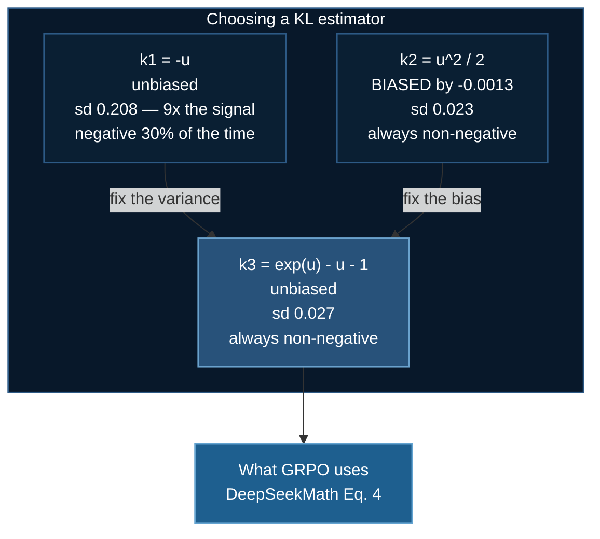

# GRPO: A Worked Numerical Example

A companion to [GRPO Training](/docs/tutorials/huggingface/grpo-training). Everything here is computed on toy or simulated data so the mechanics are fully inspectable — no model, no GPU, no training run.

Three questions are answered quantitatively:

1. What do the advantages actually look like, and how much does the `torch.std` convention change them?
2. How often does a group produce **zero gradient**, and what does that do to your compute budget?
3. Is the k3 KL estimator really better than the log-ratio, and by how much?

:::info Reproducibility
Every number on this page is produced by the code blocks shown, using `numpy` with `default_rng(0)`. No GPU required — the whole page runs in a few seconds on a laptop.
:::

## 1. Setup

We model one GSM8K-style prompt. The policy has some per-sample success probability $p$ on that prompt — the probability that a single sampled chain of thought reaches the correct final answer. The verifier reward is binary, so within a group of $G$ rollouts,

$$
r_i \stackrel{\text{iid}}{\sim} \mathrm{Bernoulli}(p), \qquad i = 1,\dots,G
$$

This i.i.d. assumption is an idealization — rollouts from one policy on one prompt share failure modes and are positively correlated in practice — but it is the right first-order model, and it makes every quantity below closed-form and checkable.

```python
import numpy as np

rng = np.random.default_rng(0)

def advantages(rewards: np.ndarray, correction: int = 0, eps: float = 1e-8):
    """Group-relative advantages. correction=0 -> population std (the paper);
    correction=1 -> Bessel-corrected (the PyTorch/NumPy default)."""
    mean = rewards.mean(axis=-1, keepdims=True)
    std = rewards.std(axis=-1, keepdims=True, ddof=correction)
    return (rewards - mean) / (std + eps)
```

## 2. The Concrete Group

**Prompt.** *Janet's ducks lay 16 eggs per day. She eats 3 for breakfast and bakes muffins with 4. She sells the rest at \$2 per egg. How much does she make daily?* Ground truth: **18**.

Four sampled rollouts at temperature 0.7:

| $i$ | Reasoning (abridged) | Answer | $r_i$ |
|---|---|---|---|
| 1 | $16-3-4=9$; $9\times2=18$ | 18 ✓ | 1 |
| 2 | $16-3=13$; forgets the muffins; $13\times2=26$, misreports | 15 ✗ | 0 |
| 3 | $16-(3+4)=9$; $9\times2=18$ | 18 ✓ | 1 |
| 4 | $16-3-4=9$; $9\times2=18$, then arithmetic slip | 20 ✗ | 0 |

```python
r = np.array([1., 0., 1., 0.])
G = len(r)

print("mean           ", r.mean())                       # 0.5
print("std population ", r.std(ddof=0))                  # 0.5
print("std Bessel     ", r.std(ddof=1))                  # 0.5773502691896257
print("A (population) ", advantages(r, correction=0))    # [ 1. -1.  1. -1.]
print("A (Bessel)     ", advantages(r, correction=1))    # [ 0.866 -0.866  0.866 -0.866]
```

| Convention | $\operatorname{std}$ | $\hat{\mathbf A}$ |
|---|---|---|
| Population, $\tfrac{1}{G}$ — **DeepSeekMath Eq. 5** | 0.5000 | $(+1, -1, +1, -1)$ |
| Bessel-corrected, $\tfrac{1}{G-1}$ — **NumPy/PyTorch default** | 0.5774 | $(+0.866, -0.866, +0.866, -0.866)$ |

Every token of rollouts 1 and 3 is pushed up; every token of 2 and 4 is pushed down. Note that rollout 4 had *correct reasoning* and slipped only at the last step — outcome supervision punishes the whole chain regardless. This is the credit-assignment weakness that process supervision addresses.

### 2.1 The Bessel correction is a silent learning-rate change

The two conventions differ by exactly $\sqrt{(G-1)/G}$:

```python
for G_ in (4, 8, 16, 32):
    f = np.sqrt((G_ - 1) / G_)
    print(f"G={G_:>3}  ratio={f:.4f}  advantage shrunk by {100*(1-f):.1f}%")
```

```
G=  4  ratio=0.8660  advantage shrunk by 13.4%
G=  8  ratio=0.9354  advantage shrunk by  6.5%
G= 16  ratio=0.9682  advantage shrunk by  3.2%
G= 32  ratio=0.9841  advantage shrunk by  1.6%
```

Because the advantage multiplies the whole surrogate, a uniform 13.4% shrink at $G=4$ is indistinguishable from setting a 13.4% smaller learning rate. It will not crash anything — it will just quietly change your results, and it changes *differently* at different group sizes, which is exactly the kind of thing that makes a $G$ sweep uninterpretable. Pin the convention explicitly:

```python
std = rewards.std(dim=1, keepdim=True, correction=0)   # PyTorch >= 2.0
```

### 2.2 GRPO versus RLOO on the same group

```python
rloo = np.array([r[i] - (r.sum() - r[i]) / (G - 1) for i in range(G)])
print("RLOO           ", rloo)                            # [ 0.6667 -0.6667  0.6667 -0.6667]
print("G/(G-1)*(r-mean)", G/(G-1) * (r - r.mean()))       # [ 0.6667 -0.6667  0.6667 -0.6667]
```

The identity $A_i^{\text{RLOO}} = \tfrac{G}{G-1}(r_i - \bar r)$ holds exactly. So before std-normalization, RLOO and GRPO produce the *same direction* and differ only by a constant absorbed into the learning rate. The genuine difference is GRPO's division by $\operatorname{std}(\mathbf r)$ — which is the part [Dr. GRPO](/docs/tutorials/huggingface/grpo-training#7-known-biases-the-dr-grpo-critique) argues should be removed.

## 3. The Degenerate-Group Problem

If all $G$ rollouts receive the same reward, $\operatorname{std}(\mathbf r) = 0$, every advantage is $0/\epsilon = 0$, and **the prompt contributes exactly nothing to the gradient** — after paying for $G$ full generations.

$$
\Pr[\text{degenerate}] = \Pr[\textstyle\sum_i r_i \in \{0, G\}] = p^{G} + (1-p)^{G}
$$

```python
N = 200_000
print(f"{'p':>5} {'G':>4} {'theory':>9} {'simulated':>10}")
for p in (0.1, 0.3, 0.5, 0.7, 0.9):
    for G_ in (4, 8, 16):
        r_sim = (rng.random((N, G_)) < p)
        s = r_sim.sum(axis=1)
        sim = np.mean((s == 0) | (s == G_))
        theory = p**G_ + (1 - p)**G_
        print(f"{p:>5} {G_:>4} {theory:>9.4f} {sim:>10.4f}")
```

| $p$ | $G=4$ theory | sim | $G=8$ theory | sim | $G=16$ theory | sim |
|---|---|---|---|---|---|---|
| 0.1 | 0.6562 | 0.6555 | 0.4305 | 0.4310 | 0.1853 | 0.1841 |
| 0.3 | 0.2482 | 0.2480 | 0.0577 | 0.0563 | 0.0033 | 0.0034 |
| **0.5** | **0.1250** | 0.1247 | 0.0078 | 0.0078 | 0.0000 | 0.0000 |
| 0.7 | 0.2482 | 0.2486 | 0.0577 | 0.0579 | 0.0033 | 0.0034 |
| 0.9 | 0.6562 | 0.6587 | 0.4305 | 0.4309 | 0.1853 | 0.1837 |

Simulation matches theory throughout. Three readings:

**Signal is maximal at $p = 0.5$ and symmetric about it.** GRPO extracts the most gradient from problems the model solves about half the time. Problems it always solves and problems it never solves are equally worthless — a formal version of "train at the edge of competence," and a direct argument for curriculum design.

**Improvement is self-limiting.** Early in training a hard set might sit at $p\approx0.3$: only 24.8% of groups are wasted at $G=4$. Drive the model to $p\approx0.9$ and **65.6%** of groups are wasted. Two-thirds of your rollout compute now produces no gradient, and the reward curve flattens for reasons that have nothing to do with the policy having converged.

**Raising $G$ helps, expensively.** At $p=0.9$, $G:4\to8$ cuts waste from 65.6% to 43.0%; $8\to16$ takes it to 18.5%. Each doubling doubles generation cost, and generation — not the backward pass — dominates GRPO wall-clock.

### 3.1 The cost-normalized view

Fix a budget of 1000 rollouts. Larger $G$ means fewer distinct prompts:

```python
print(f"{'p':>5} {'G':>4} {'groups':>8} {'non-degenerate':>16}")
for p in (0.5, 0.7, 0.9):
    for G_ in (4, 8, 16):
        groups = 1000 // G_
        useful = groups * (1 - (p**G_ + (1 - p)**G_))
        print(f"{p:>5} {G_:>4} {groups:>8} {useful:>16.1f}")
```

| $p$ | $G$ | Groups per 1000 rollouts | Non-degenerate |
|---|---|---|---|
| 0.5 | 4 | 250 | **218.8** |
| 0.5 | 8 | 125 | 124.0 |
| 0.5 | 16 | 62 | 62.0 |
| 0.7 | 4 | 250 | **188.0** |
| 0.7 | 8 | 125 | 117.8 |
| 0.7 | 16 | 62 | 61.8 |
| 0.9 | 4 | 250 | **86.0** |
| 0.9 | 8 | 125 | 71.2 |
| 0.9 | 16 | 62 | 50.5 |

:::warning Do not read this as "always use G=4"
On raw count of useful groups per unit compute, small $G$ wins at every $p$. But the count is not the whole objective — the *quality* of each group's baseline also depends on $G$. The variance of the baseline estimate is

$$\operatorname{Var}(\bar r) = \frac{p(1-p)}{G}$$

so at $p=0.5$ the baseline's standard error is 0.250 at $G=4$ and 0.125 at $G=16$. Small $G$ buys more prompts, each with a noisier baseline; large $G$ buys fewer prompts, each with a sharper one.

The real conclusion is that **$G$ trades prompt coverage against baseline precision, and the degenerate-group rate is a third axis that dominates once $p$ is extreme.** The clean escape is to decouple them: filter degenerate groups and resample, as DAPO does, so that raising $G$ is not the only lever you have.
:::

### 3.2 Filtering in practice

```python
def nondegenerate_mask(rewards, tol=1e-6):
    """Rows whose rewards are not all identical."""
    return rewards.std(axis=-1, ddof=0) > tol

batch = (rng.random((16, 4)) < 0.9).astype(float)   # 16 prompts, G=4, p=0.9
mask = nondegenerate_mask(batch)
print(f"{mask.sum()}/{len(batch)} groups carry gradient")
```

Two things this buys you. It makes the waste **visible** — log it as `groups/degenerate` and you can see the §3 effect happening rather than inferring it from a flat reward curve. And it makes the effective batch size **honest**: if 10 of 16 groups are degenerate, your gradient is an average over 6 prompts, not 16, and the variance is correspondingly higher than your config suggests.

## 4. The KL Estimator, Measured

[§4.3 of the main page](/docs/tutorials/huggingface/grpo-training#43-the-kl-estimator--why-it-is-not-what-you-would-write) claims k3 is unbiased *and* non-negative while k1 is unbiased but high-variance and sign-unstable. That is checkable directly, because for small discrete distributions the true KL is computable in closed form.

Let $u = \log\dfrac{\pi_{\text{ref}}}{\pi_\theta}$ evaluated at tokens sampled from $\pi_\theta$:

$$
k_1 = -u, \qquad k_2 = \tfrac{1}{2}u^2, \qquad k_3 = e^{u} - u - 1
$$

```python
q    = np.array([0.40, 0.30, 0.15, 0.10, 0.05])   # pi_theta
pref = np.array([0.35, 0.25, 0.20, 0.12, 0.08])   # pi_ref
true_kl = np.sum(q * np.log(q / pref))            # 0.023224

M = 200_000
idx = rng.choice(len(q), size=M, p=q)             # sample from pi_theta
u = np.log(pref[idx] / q[idx])

for name, est in (("k1", -u), ("k2", 0.5 * u**2), ("k3", np.exp(u) - u - 1)):
    print(f"{name}: mean={est.mean():.6f}  bias={est.mean()-true_kl:+.6f}  "
          f"sd={est.std():.6f}  P(<0)={np.mean(est < 0):.3f}")
```

True $\mathbb{D}_{\mathrm{KL}} = 0.023224$. Over 200,000 samples:

| Estimator | Mean | Bias | Std. dev. | $\Pr[\hat k < 0]$ |
|---|---|---|---|---|
| k1 $= -u$ | 0.023481 | $+0.000256$ | 0.2081 | **0.299** |
| k2 $= \tfrac{1}{2}u^2$ | 0.021923 | $-0.001301$ | 0.0230 | 0.000 |
| **k3** $= e^u - u - 1$ | 0.023201 | $\mathbf{-0.000024}$ | 0.0274 | **0.000** |

The theory holds exactly:

- **k1 is unbiased but ruinous in variance.** Its standard deviation is 0.208 against a true value of 0.023 — the noise is **nine times the signal**. And it is negative on 29.9% of samples: a "penalty" term that is a *bonus* nearly a third of the time.
- **k2 has the lowest variance but is genuinely biased.** Its bias, $-0.0013$, is 21 standard errors from zero on this sample — not a fluke.
- **k3 achieves both.** Bias $-2.4\times10^{-5}$ is within half a standard error of zero (SE $= 0.0274/\sqrt{200000} = 6.1\times10^{-5}$), and it is never negative, since $e^u - u - 1 \ge 0$ for all real $u$. It pays only a **19% variance premium over k2** while remaining unbiased, and delivers a **7.6× variance reduction over k1**.

That last ratio is the practical case. Swapping k1 for k3 costs one extra `exp` per token and removes roughly 87% of the standard deviation from your KL term.



## 5. Putting It Together

```python
import numpy as np
rng = np.random.default_rng(0)

def grpo_step_stats(p: float, G: int, n_prompts: int = 512):
    """One synthetic GRPO batch. Returns the fraction of groups that carry
    gradient and the effective number of prompts contributing to it."""
    rewards = (rng.random((n_prompts, G)) < p).astype(float)

    mean = rewards.mean(axis=1, keepdims=True)
    std  = rewards.std(axis=1, keepdims=True, ddof=0)          # population
    adv  = (rewards - mean) / (std + 1e-8)

    live = (std.squeeze(-1) > 1e-6)
    return {
        "p": p,
        "G": G,
        "live_frac": live.mean(),
        "effective_prompts": int(live.sum()),
        "adv_mean": adv.mean(),        # ~0 by construction
        "adv_std_live": adv[live].std(),
    }

for p in (0.3, 0.5, 0.7, 0.9):
    s = grpo_step_stats(p, G=4)
    print(f"p={s['p']}  live={s['live_frac']:.3f}  "
          f"effective_prompts={s['effective_prompts']:>3}/512  "
          f"adv_mean={s['adv_mean']:+.2e}  adv_std={s['adv_std_live']:.3f}")
```

```
p=0.3  live=0.779  effective_prompts=399/512  adv_mean=+2.34e-17  adv_std=1.000
p=0.5  live=0.879  effective_prompts=450/512  adv_mean=+2.87e-18  adv_std=1.000
p=0.7  live=0.750  effective_prompts=384/512  adv_mean=-1.68e-17  adv_std=1.000
p=0.9  live=0.355  effective_prompts=182/512  adv_mean=-1.79e-17  adv_std=1.000
```

(Run this block on a freshly seeded `default_rng(0)`. Executing §3 and §4 first advances the generator, so the counts shift by a few prompts — the pattern is unchanged.)

Two invariants worth using as assertions in a real trainer:

- **`adv_mean` is zero to machine precision.** It must be — the advantage is a mean-centred quantity. A nonzero value in your own code means you normalized over the wrong axis, which is the most common GRPO implementation bug and is otherwise silent.
- **`adv_std` is exactly 1.0 on live groups** under the population convention. Under the Bessel default it would be $\sqrt{G/(G-1)} = 1.155$ at $G=4$ — a quick check of which convention your stack is using.

And the headline: at $p=0.9$ the configured batch of 512 prompts is really a batch of **182**. Your gradient is built from roughly a third of the prompts your config file claims.

## 6. What to Take Away

1. **Advantages are just mean-centred, std-scaled rewards.** All the subtlety is in which $\operatorname{std}$ — the Bessel default silently shrinks advantages by 13.4% at $G=4$.
2. **Before std-normalization, GRPO $\equiv$ RLOO up to a constant.** The division by $\operatorname{std}(\mathbf r)$ is the real design choice, and the one Dr. GRPO rejects.
3. **Degenerate groups are the dominant practical inefficiency**, they get *worse* as the model improves, and $\Pr = p^G + (1-p)^G$ predicts them exactly. Log the rate; do not infer it.
4. **$G$ trades prompt coverage against baseline precision.** Filtering decouples the two and is cheaper than raising $G$.
5. **k3 is not a detail.** Against k1 it is a 7.6× variance reduction and removes a penalty term that would otherwise be a bonus 30% of the time.

## Next Steps

- [GRPO Training](/docs/tutorials/huggingface/grpo-training) — the full derivation and the DeepSpeed implementation
- [DeepSpeed ZeRO Stages](/docs/getting-started/deepspeed-zero-stages) — the memory accounting behind the critic-removal argument

## References

1. Shao, Z., et al. (2024). DeepSeekMath. [arXiv:2402.03300](https://arxiv.org/abs/2402.03300) — Eq. 3–5.
2. Liu, Z., et al. (2025). Understanding R1-Zero-Like Training: A Critical Perspective. [arXiv:2503.20783](https://arxiv.org/abs/2503.20783) — Dr. GRPO.
3. Yu, Q., et al. (2025). DAPO: An Open-Source LLM Reinforcement Learning System at Scale. [arXiv:2503.14476](https://arxiv.org/abs/2503.14476) — dynamic sampling.
4. Ahmadian, A., et al. (2024). Back to Basics: Revisiting REINFORCE-Style Optimization. [arXiv:2402.14740](https://arxiv.org/abs/2402.14740) — RLOO.
5. Schulman, J. (2020). [Approximating KL Divergence](http://joschu.net/blog/kl-approx.html) — k1/k2/k3.
