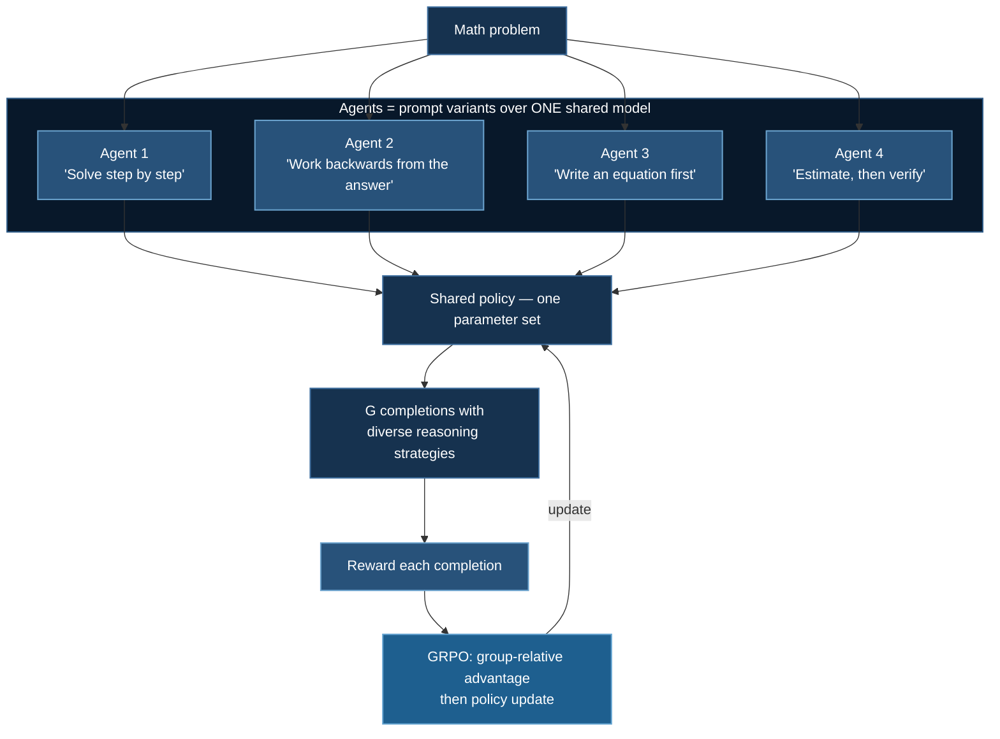

# Multi-Agent GRPO

An **exploratory** example: multiple prompt-conditioned agents sharing one set of weights, trained with GRPO on mathematical reasoning.

**Model:** Qwen-1.5B · **Example:** `07_huggingface_trl_multi_agency`

:::warning Read this as a research sketch, not a recipe
This is an exploratory example rather than a validated pipeline. The value is in the design questions it raises. If you want a production GRPO setup, use [GRPO Training](/docs/tutorials/huggingface/grpo-training).

**The concrete defects described in §4 have now been fixed**: the PPO value head is gone, both scripts use a verifiable exact-match reward instead of string similarity, and the reward alignment bug is corrected. `tests/test_grpo_rewards.py` guards all three:

```bash
uv run tests/test_grpo_rewards.py
```

§4 keeps the analysis because each mistake is instructive — and because the *conceptual* questions it raises (does agent conditioning actually reduce degenerate groups?) remain open.
:::

## 1. What "Multi-Agent" Means Here

Not multiple models. **One set of weights, conditioned on different instruction prefixes.**



The underlying idea is reasonable and connects directly to the [degenerate-group problem](/docs/tutorials/huggingface/grpo-worked-example#3-the-degenerate-group-problem). GRPO learns only when a group's rewards **differ**; a group where all $G$ rollouts agree contributes exactly zero gradient, and

$$
\Pr[\text{degenerate}] = p^{G} + (1-p)^{G}
$$

Plain GRPO obtains diversity from **sampling temperature** alone, which perturbs token choices without changing strategy — all $G$ rollouts tend to follow the same approach and therefore succeed or fail together, making $p^G + (1-p)^G$ larger than the independence assumption predicts.

Conditioning each rollout on a *different instruction* induces diversity at the level of **strategy**, not just tokens. If agent 1 sets up an equation and agent 2 estimates-and-checks, their errors are less correlated, groups are less often degenerate, and more of the rollout budget produces gradient. **That is a genuinely sound motivation**, and it is essentially structured exploration.

## 2. Quick Start

```bash
cd 07_huggingface_trl_multi_agency

python main.py              # synthetic data
python train_grpo_math.py   # GSM8K-style data
```

| Script | Data | Reward |
|---|---|---|
| `main.py` | Synthetic | `reward_answer_correct` — verifiable exact match |
| `train_grpo_math.py` | GSM8K-style | `reward_answer_correct` — verifiable exact match |

`reward_unique_chars` is retained in `main.py`, explicitly labelled a dummy, as a smoke test for the training loop.

## 3. The Code

```python
class MultiAgentLLM:
    def __init__(self, model_name, num_agents=4):
        self.num_agents = num_agents
        self.tokenizer = AutoTokenizer.from_pretrained(model_name)
        # Plain causal LM — no value head. GRPO has no critic (see 4.1).
        self.model = AutoModelForCausalLM.from_pretrained(model_name)

    def generate_agent_outputs(self, prompt_variants):
        """Generate completions from each agent variant."""
        ...

    def aggregate_hidden_states(self, agent_outputs):
        """Average the hidden states across agent completions."""
        ...
```

Generation is stopped by a custom criterion on `</response>`:

```python
class StopOnTokens(StoppingCriteria):
    def __call__(self, input_ids, scores, **kwargs):
        return any(input_ids[0, -len(t):].tolist() == t for t in self.stop_token_ids)
```

## 4. An Honest Critique

### 4.1 The value head was vestigial — fixed

```python
# BEFORE:
self.model = AutoModelForCausalLMWithValueHead.from_pretrained(model_name)
```

`AutoModelForCausalLMWithValueHead` attaches a scalar value head — a critic — to the model. That is a **PPO** construct.

The entire point of GRPO is that it **removes the critic**, replacing the learned baseline $V_\psi(s)$ with the group mean $\bar r$. See [the derivation](/docs/tutorials/huggingface/grpo-training#41-the-idea) and [the memory accounting](/docs/tutorials/huggingface/grpo-training#5-what-grpo-actually-removes-a-memory-accounting): dropping the critic is what takes model states from $36\Psi$ to $18\Psi$.

Loading a value head while training with GRPO allocates a head that is never used for advantage estimation. It is harmless but wasteful, and it signals the code evolved from a PPO example.

**Fixed:** both scripts now use `AutoModelForCausalLM`. A second bug surfaced while making the change — `GRPOTrainer` was being passed the model *name* rather than the loaded model, so it loaded a **second copy of the weights** and the model built in `__init__` was never trained at all. It now receives `model=self.model`.

### 4.2 Hidden-state aggregation is not part of GRPO — documented, retained

```python
def aggregate_hidden_states(self, agent_outputs):
    """Average the hidden states across agent completions."""
```

Averaging hidden states across agents is an interesting idea but has **no role in the GRPO objective**, which operates purely on per-token log-probabilities and scalar rewards. Nothing in

$$
\mathcal{J}_{\text{GRPO}}(\theta) = \mathbb{E}\left[\frac{1}{G}\sum_{i}\frac{1}{|o_i|}\sum_{t}\left\{\min\left(\rho_{i,t}\hat A_{i,t},\ \operatorname{clip}(\rho_{i,t},1\!-\!\varepsilon,1\!+\!\varepsilon)\hat A_{i,t}\right) - \beta\mathbb{D}_{\mathrm{KL}}\right\}\right]
$$

consumes a hidden state. Averaging representations across *different* completions is also conceptually odd: hidden states at the same index in different sequences correspond to different tokens in different contexts, so the mean is not obviously meaningful.

If the intent is ensembling, the principled versions are **logit averaging at each decoding step** (a genuine product/mixture of experts over the same next-token distribution) or **self-consistency** — sample $G$ chains, take the majority final answer (Wang et al., 2023), which is the standard and very effective method for exactly this setting.

### 4.3 The rewards would not teach mathematics — fixed

**`reward_unique_chars`** — the docstring says "Dummy reward". It rewards character diversity, so the optimal policy is to emit as many distinct characters as possible. It is a pipeline smoke test.

**String similarity to a reference** is more defensible but still unsound for math: an answer of `42` and an answer of `-42` are ~95% similar as strings and one of them is wrong; a correct solution written differently from the reference scores poorly. It rewards **surface form**, not correctness — precisely the reward-hacking failure that [verifiable rewards](/docs/tutorials/huggingface/grpo-training#82-the-verifier-reward) are meant to eliminate.

**Fixed:** both scripts now use the verifiable reward below. A third bug surfaced here too — the old `make_similarity_reward_fn` closed over the dataset's completion list and zipped it *positionally* against generated completions. Since GRPO samples $G$ rollouts per prompt, generation $i$ does not correspond to dataset row $i$, so **every rollout was scored against the wrong reference**. Reading references from `**kwargs`, which the trainer expands to match the generated batch, fixes the alignment.

The reward is the one-line function from the GRPO page:

```python
def compute_reward(response: str, ground_truth: str) -> float:
    return 1.0 if extract_answer(response) == ground_truth else 0.0
```

Exact match on the extracted final answer. Zero parameters, cannot drift, cannot be gamed by paraphrase.

### 4.4 Advantages must be computed within a prompt, not across agents

The subtlety that decides whether the multi-agent idea works at all.

GRPO's baseline is the mean reward **for a given prompt**. If agent-conditioned rollouts are pooled and normalized together correctly, this is fine — the group for problem $q$ is all $G$ completions of $q$ regardless of which instruction variant produced them, and the strategy diversity is exactly the benefit.

But if you normalize *per agent* — comparing agent 1's rollouts only against other agent-1 rollouts — you learn something different and probably unintended: each agent is optimized to beat its own average, and the model receives no signal about which **strategy** is better. Worse, if agent prompts differ in difficulty, per-agent normalization discards precisely the comparison you wanted.

:::tip What to log
Per-agent mean reward, alongside the overall group statistics. If one instruction variant dominates, the interesting finding is that the strategy matters — and you may want to keep the losing variants anyway, because their role is to decorrelate the group, not to win.

Also log `groups/degenerate`. The whole hypothesis of this example is that agent conditioning reduces it relative to temperature-only sampling. **That is a measurable claim, and it is the experiment worth running.** See the [simulation](/docs/tutorials/huggingface/grpo-worked-example#3-the-degenerate-group-problem) for the baseline rates to compare against.
:::

## 5. Turning This Into a Real Experiment

| Change | Why |
|---|---|
| ~~Drop `AutoModelForCausalLMWithValueHead`~~ | **Done** — GRPO has no critic (§4.1) |
| ~~Replace similarity reward with exact-match verification~~ | **Done** — correctness, not surface form (§4.3) |
| Remove hidden-state aggregation, or replace with self-consistency voting | It has no role in the objective (§4.2) |
| Normalize advantages **within prompt**, across all agents | Preserves the strategy comparison (§4.4) |
| Log `groups/degenerate` per condition | Tests the actual hypothesis |
| Ablate: agent-conditioned vs. temperature-only at matched rollout budget | The comparison that would make this publishable |

That last row is the point. The claim "instruction-conditioned agents reduce degenerate groups relative to temperature sampling at equal cost" is crisp, cheap to test, and currently untested by this code.

## 6. Related Work

The example sits near several established lines, and it is worth knowing which:

- **Self-consistency** (Wang et al., 2023) — sample multiple chains, majority-vote the answer. No training. Strong baseline that this approach must beat to be interesting.
- **Multi-agent debate** (Du et al., 2023) — several model instances critique and revise each other's answers over rounds. Inference-time, and a genuinely different mechanism from prompt-diverse sampling.
- **Society of Minds / role-conditioning** (Park et al., 2023; Wu et al., 2023) — distinct personas or roles, typically orchestrated rather than jointly trained.
- **Diversity-promoting RL** — explicit entropy or novelty bonuses to prevent policy collapse, the standard RL answer to the exploration problem this example addresses with prompts.

The distinguishing feature here is that the agents **share weights and are trained jointly**, so improving one improves all — which is either the elegant part or the confound, depending on whether you can show the diversity survives training. Policy collapse toward a single strategy is the obvious risk, and monitoring per-agent reward divergence is how you would detect it.

## 7. Troubleshooting

**Rewards are all identical.** With `reward_unique_chars` on similar completions this is expected — zero variance means zero advantage means no gradient. Use a real reward.

**Generation never stops.** `StopOnTokens` matches an exact token sequence; if `</response>` tokenizes differently in context the match fails. Verify with `tokenizer.encode("</response>", add_special_tokens=False)` and always set `max_new_tokens` as a backstop.

**OOM.** $G$ agents × rollout length is the cost, not the model. Reduce `num_agents` or `max_new_tokens` first.

**Reward rises, accuracy does not.** Reward hacking — §4.3. Almost guaranteed with a similarity reward.

## Next Steps

- [GRPO Training](/docs/tutorials/huggingface/grpo-training) — the correct objective, verifiable rewards, and a working configuration
- [GRPO: Worked Numerical Example](/docs/tutorials/huggingface/grpo-worked-example) — the degenerate-group analysis this example is implicitly trying to address

## References

1. Shao, Z., Wang, P., Zhu, Q., et al. (2024). DeepSeekMath. [arXiv:2402.03300](https://arxiv.org/abs/2402.03300) — GRPO.
2. Wang, X., Wei, J., Schuurmans, D., et al. (2023). Self-Consistency Improves Chain of Thought Reasoning in Language Models. *ICLR 2023*. [arXiv:2203.11171](https://arxiv.org/abs/2203.11171)
3. Du, Y., Li, S., Torralba, A., Tenenbaum, J. B., & Mordatch, I. (2023). Improving Factuality and Reasoning in Language Models through Multiagent Debate. [arXiv:2305.14325](https://arxiv.org/abs/2305.14325)
4. Wu, Q., Bansal, G., Zhang, J., et al. (2023). AutoGen: Enabling Next-Gen LLM Applications via Multi-Agent Conversation. [arXiv:2308.08155](https://arxiv.org/abs/2308.08155)
5. Park, J. S., O'Brien, J. C., Cai, C. J., et al. (2023). Generative Agents: Interactive Simulacra of Human Behavior. *UIST 2023*. [arXiv:2304.03442](https://arxiv.org/abs/2304.03442)
6. Wei, J., Wang, X., Schuurmans, D., et al. (2022). Chain-of-Thought Prompting Elicits Reasoning in Large Language Models. *NeurIPS 2022*. [arXiv:2201.11903](https://arxiv.org/abs/2201.11903)
7. Yu, Q., Zhang, Z., Zhu, R., et al. (2025). DAPO. [arXiv:2503.14476](https://arxiv.org/abs/2503.14476) — dynamic sampling for degenerate groups.
8. Cobbe, K., Kosaraju, V., Bavarian, M., et al. (2021). Training Verifiers to Solve Math Word Problems. [arXiv:2110.14168](https://arxiv.org/abs/2110.14168) — GSM8K.
