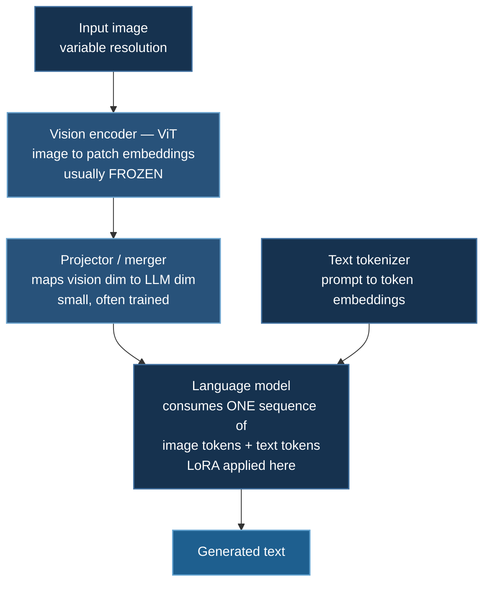

# OCR Vision-Language

Fine-tuning Qwen2-VL-2B with LoRA and DeepSpeed — and why vision-language models break the memory assumptions that hold for text-only LLMs.

**Model:** `Qwen/Qwen2-VL-2B-Instruct` · **Example:** `05_huggingface_ocr`

:::warning The bundled dataset is synthetic
`prepare_dataset()` in `train_ds.py` generates **10 synthetic samples** with the fixed instruction `"Describe this image."` (`--max-samples 10`). It is a **plumbing test**: it verifies that the processor, the DeepSpeed engine, LoRA injection, and the training loop all work end to end on your hardware.

It will not produce a useful OCR model. Getting one means substituting a real dataset — see §6. This page is written to explain the machinery so that substitution is straightforward.
:::

## 1. How a VLM Is Assembled

A vision-language model is three components with a specific division of labour:



The key idea: **the projector converts image patches into things that look like token embeddings**, so the language model consumes one homogeneous sequence and needs no architectural change. An image becomes, literally, a run of tokens in the prompt.

That single fact drives everything else on this page.

### Qwen2-VL specifics

**Naive dynamic resolution.** Most VLMs resize every image to a fixed square (336×336, say), destroying aspect ratio and detail. Qwen2-VL processes images at their **native resolution**, emitting a variable number of visual tokens. For OCR this is decisive — downsampling a document to 336×336 makes the text unreadable, so no amount of fine-tuning can recover it.

**M-RoPE.** Multimodal Rotary Position Embedding decomposes position into temporal, height, and width components, so the model encodes *2-D* spatial layout rather than a flattened raster order. Again important for documents, where "the number to the right of this label" is a spatial relationship.

## 2. Quick Start

```bash
cd 05_huggingface_ocr

# SLURM
sbatch submit_job.sh

# Direct
deepspeed --num_gpus=2 train_ds.py --use-lora
```

Defaults from `train_ds.py`:

| Argument | Default |
|---|---|
| `--model-name` | `Qwen/Qwen2-VL-2B-Instruct` |
| `--use-lora` | off — **pass it explicitly** |
| `--lora-r` / `--lora-alpha` / `--lora-dropout` | 8 / 16 / 0.05 |
| `--use-4bit` | off |
| `--max-samples` | 10 (synthetic) |
| `--max-length` | 512 |
| `--batch-size` | 1 |
| `--gradient-accumulation-steps` | 4 |
| `--num-epochs` | 10 |
| `--learning-rate` | 5e-5 |

## 3. The Memory Problem Is Sequence Length, Not Parameters

At 2B parameters, model states under LoRA are negligible. **Vision-language training is bound by sequence length**, and by an amount that surprises people.

A single high-resolution image can expand into **thousands** of visual tokens. Where a text prompt might be 100 tokens, the same request with a document image can be 2,000–8,000. And from the [activation memory analysis](/docs/tutorials/basic/neural-network#91-where-the-memory-goes):

$$
M_{\text{act}} \approx L\cdot b\cdot s\cdot h\cdot c \;+\; \underbrace{L\cdot a\cdot b\cdot s^{2}}_{\text{attention}}
$$

The attention term is **quadratic in $s$**. Doubling image resolution roughly doubles the visual token count and therefore *quadruples* attention activation memory. This is why `--batch-size 1` with `--gradient-accumulation-steps 4` is the right default: the micro-batch is 1 because one sample can be enormous.

:::tip Bound the token count with `min_pixels` / `max_pixels`
Dynamic resolution means an unbounded input produces an unbounded sequence — a single 4K screenshot can OOM a run that was stable for a hundred steps. Cap it at the processor:

```python
processor = Qwen2VLProcessor.from_pretrained(
    model_name,
    min_pixels=256 * 28 * 28,      # floor: keep small images legible
    max_pixels=1280 * 28 * 28,     # ceiling: bounds worst-case sequence length
)
```

The `28 × 28` factor is the patch area times the spatial merge. This single setting is the most effective lever on VLM memory — more than batch size, more than ZeRO stage. Raise `max_pixels` for dense documents; lower it if you OOM.
:::

## 4. LoRA Targets the Language Model Only

```python
peft_config = LoraConfig(
    task_type=TaskType.CAUSAL_LM,
    r=args.lora_r,
    lora_alpha=args.lora_alpha,
    lora_dropout=args.lora_dropout,
    target_modules=["q_proj", "k_proj", "v_proj", "o_proj",
                    "gate_proj", "up_proj", "down_proj"],
    bias="none",
)
model = get_peft_model(model, peft_config)
model.print_trainable_parameters()
```

Those seven module names are the **attention projections and MLP** of the language decoder. The vision tower's parameters are named differently and receive no adapters, so the ViT stays entirely frozen.

That is the right default, for a reason worth stating: the vision encoder was pretrained on enormous image corpora and already produces good general visual features. What a task-specific fine-tune usually needs to change is **how the language model interprets and verbalizes** those features. Adapting the LLM side is both cheaper and less prone to catastrophic forgetting of visual competence.

:::note When you *should* adapt the vision side
If your images are far outside the encoder's pretraining distribution — medical scans, satellite imagery, engineering schematics — frozen features may simply lack the needed information, and no amount of LLM adaptation recovers it. Two options: add adapters to the vision tower's projections as well, or unfreeze the **projector** alone, which is small, cheap, and often enough since it is the component that translates between the two representation spaces.
:::

Also note `gradient_checkpointing_enable()` in the loading path. Given §3, this is not optional — it trades ~33% extra compute for a large reduction in retained activations, and for VLMs the activations *are* the budget.

:::warning `use_cache` and gradient checkpointing conflict
`use_cache=True` (the generation KV cache) is incompatible with gradient checkpointing and produces a warning plus silently disabled checkpointing in some versions. Set `model.config.use_cache = False` during training and re-enable it for inference.
:::

## 5. Data Handling

```python
text = self.processor.apply_chat_template(messages, tokenize=False, add_generation_prompt=False)
inputs = self.processor(text=[text], images=[image], return_tensors="pt", ...)
```

Two things differ from text-only SFT:

**The processor, not the tokenizer.** `Qwen2VLProcessor` bundles an image processor with the tokenizer. It resizes and patchifies the image, and — critically — **expands the `<|image_pad|>` placeholder in the templated text into the exact number of visual token positions that image produced.** Tokenizing text and encoding images separately gets this wrong and produces a shape mismatch, or worse, a silent misalignment.

**Variable sequence lengths.** Different images yield different token counts, so batches need padding and the resulting shape variability interacts badly with the caching allocator — see the [fragmentation note](/docs/tutorials/basic/neural-network#93-reading-the-error-message). Bucketing images by approximate token count materially reduces both padding waste and fragmentation.

Loss masking applies here exactly as in [the SFT page](/docs/tutorials/huggingface/trl-function-calling#4-completion-only-loss-masking), and matters more: you never want gradient on the image tokens or the instruction, only on the assistant's answer.

## 6. Replacing the Synthetic Data

To train an actual OCR model, replace `prepare_dataset()` with a real dataset in `(image, instruction, answer)` form. Reasonable public options:

| Dataset | Contents |
|---|---|
| `naver-clova-ix/cord-v2` | Receipts with structured field annotations |
| `nielsr/docvqa_1200_examples` | Document VQA |
| `HuggingFaceM4/ChartQA` | Charts with question–answer pairs |
| `getomni-ai/ocr-benchmark` | General OCR evaluation |

```python
from datasets import load_dataset
raw = load_dataset("naver-clova-ix/cord-v2", split="train")

def to_messages(ex):
    return {"messages": [
        {"role": "user", "content": [
            {"type": "image"},
            {"type": "text", "text": "Extract all text from this receipt as JSON."},
        ]},
        {"role": "assistant", "content": [{"type": "text", "text": ex["ground_truth"]}]},
    ], "image": ex["image"]}
```

Raise `--max-samples`, and expect to lower `max_pixels` as you do.

:::note Evaluate with the right metric
Token-level cross-entropy is what you optimize; it is not what you care about. For OCR report **character error rate** or **word error rate** — normalized edit distance between prediction and ground truth. For structured extraction report **field-level exact match**, which is what downstream systems actually consume. A model with good perplexity that transposes digits in totals is useless for receipts, and CE will not tell you.
:::

## 7. DeepSpeed Configuration

ZeRO-2 with BF16 is the right setting, for the reason given in [the overview](/docs/tutorials/huggingface/overview#3-choosing-a-strategy-from-parameter-count): under LoRA the trainable parameter count is tiny, so Stage 3 would `all-gather` the full model in forward and backward — including the entire frozen vision tower — to save memory that was never the constraint.

```json
{
  "bf16": { "enabled": true },
  "zero_optimization": {
    "stage": 2,
    "contiguous_gradients": true,
    "overlap_comm": true
  },
  "gradient_clipping": 1.0,
  "train_batch_size": "auto",
  "train_micro_batch_size_per_gpu": "auto",
  "gradient_accumulation_steps": "auto"
}
```

### Hardware

| Setup | VRAM | Notes |
|---|---|---|
| 2× RTX 4090 | 48 GB | Comfortable with LoRA + checkpointing |
| 2× RTX 4000-series (16 GB) | 32 GB | The example's target; keep `max_pixels` low |
| 1× A100 80 GB | 80 GB | Single-GPU, room for larger `max_pixels` |
| 8 GB card | — | Needs `--use-4bit` (QLoRA) and aggressive pixel caps |

## 7a. Which OCR model, measured

The page so far fine-tunes Qwen2-VL-2B. That teaches the mechanics and says
nothing about *which* model to fine-tune, and the field moved: purpose-built OCR
models now compete with general VLMs several times their size, and they differ
by more than an order of magnitude in what a page costs them.

`05_huggingface_ocr/run_modern_ocr.py` measures five on the same pages.

### Results

2× RTX 3090 (RunPod), torch 2.8.0+cu128, transformers 5.16, **12 rendered
pages**, greedy decoding:

| Model | Params | CER (pooled) | CER (median) | Tokens/page | Acc /100 tok |
|---|---|---:|---:|---:|---:|
| `qwen2-vl-2b` | 2.2B | **0.0000** | 0.0000 | 164 | 0.610 |
| `qwen2.5-vl-3b` | 3.8B | **0.0000** | 0.0000 | 164 | 0.610 |
| `got-ocr2` | 580M | 0.1530 | 0.0104 | 286 | 0.296 |
| `florence-2-base` | 230M | 0.4108 | 0.4800 | 10* | n/a |
| `deepseek-ocr` | 3B MoE (570M active) | **0.0000** | 0.0000 | **100** | **1.000** |

**\*** Florence-2's `10` is the length of `input_ids` alone. Its visual tokens
travel in `pixel_values` and never enter `input_ids`, so the figure is **not
comparable** and no efficiency number is reported for it. Tabulating it as-is
would have ranked the weakest model the most efficient by an order of
magnitude — a conclusion produced entirely by where a model happens to keep
its tokens.

Florence-2 runs only on transformers 4.47.1, reads **0/12** exactly and merges
lines (`'614.54order reference 028658'`) — the expected result for a 230M
*general* VLM on multi-line pages, which is why it is in the table as a
control rather than a contender.

Both Qwen models read **12/12 pages exactly**. `got-ocr2` read **6/12** exactly,
with a per-page range of **0.0000 to 1.7639** — one page ran away and generated
far more than the reference, which alone accounts for the gap between its pooled
0.1530 and its median 0.0104.

:::warning Rendered text is not a document benchmark
These pages are cleanly rendered, so the error rates are a **floor**. Real
scans bring skew, noise and JPEG artefacts none of this measures. `0.0000`
means "perfect on easy input", not "solved". Use `--source hf` for a real
corpus, and read [OmniDocBench](https://github.com/opendatalab/OmniDocBench)
for numbers that mean something about documents.
:::

`got-ocr2`'s pooled 0.1530 against a median of **0.0104** is the interesting
row. That gap is the signature of a handful of pages failing badly while most
are near-perfect — not a uniformly weak model. Reporting only the pooled figure
would have libelled it; reporting only the median would have hidden the
failures.

### Two of five would not run, for the same reason

Both are `trust_remote_code` models whose published code targets an **older
transformers** than Qwen2.5-VL requires:

| Model | Error |
|---|---|
| `deepseek-ocr` | `ImportError: cannot import name 'LlamaFlashAttention2'` |
| `florence-2-base` | `AttributeError: 'Florence2LanguageConfig' object has no attribute 'forced_bos_token_id'` |

Running them means a **separate pinned environment**, and pinning back far
enough for them breaks Qwen2.5-VL. That is a genuine constraint on building one
OCR pipeline across these models, and a concrete argument for the per-folder
`uv.lock` this course now ships.

A pinned `transformers==4.47.1` environment (the last release containing
`LlamaFlashAttention2`, checked against the tagged sources) **unblocks both**.
Their rows above are measured there. Pinning the main environment back that far
would break Qwen2.5-VL, so they get their own venv — built with
`--system-site-packages` so torch is reused rather than re-downloaded.

Florence-2 took four attempts, and the diagnosis is the lesson. The failure is
inside `Florence2LanguageConfig.__init__`:

```python
if self.forced_bos_token_id is None and kwargs.get(...):
```

It reads the attribute **while constructing itself**, and transformers 5 moved
that field off `PretrainedConfig`. It fires while loading the *processor*, so
every fix applied at model-load time never executed. Three identical errors in
a row were the signal — an unchanged symptom means an unchanged code path — and
I read them as "the fix didn't take" instead. Reproducing it locally on CPU,
which cost nothing, settled it in one run after several GPU runs had not.

:::danger A number that nearly shipped
An earlier harness took DeepSeek-OCR's `None`, `str()`'d it, and scored the
literal string `"None"` against every reference. It produced a pooled CER of
**0.9594**, median 0.9600, min/max 0.9231/0.9710 — the shape of a real
measurement of a weak model, across twelve pages. It was caught only because
0.9594 exactly matched an unrelated sanity run. The script now refuses to score
any model whose pages all come back empty, because *reporting an accuracy for a
model that produced no output is worse than reporting nothing* — it reads as
evidence.
:::

Reaching that conclusion took seven GPU runs, each surfacing the next layer:
`AutoProcessor` cannot instantiate DeepSeek-OCR → it needs a custom `infer()` →
which imports `addict`, `matplotlib`, then `easydict` → which then hits the
version wall. Every package was discovered *after* several GB had downloaded.

### What the table actually says

Three models tie at **CER 0.0000**, so on this corpus accuracy does not
separate them at all — and that is the point. What separates them is cost:

| Model | Tokens/page | Accuracy per 100 tokens |
|---|---:|---:|
| `deepseek-ocr` | **100** | **1.000** |
| `qwen2-vl-2b` | 164 | 0.610 |
| `qwen2.5-vl-3b` | 164 | 0.610 |
| `got-ocr2` | 286 | 0.296 |

DeepSeek-OCR reads these pages perfectly using **39% fewer tokens** than the
Qwen models and **65% fewer** than GOT-OCR2. That is its paper's claim —
optical context compression — reproduced here on twelve easy pages. It is not
evidence about hard documents, and the ceiling effect at the top of the table
is a property of the corpus, not of the models.

If you rank on accuracy alone, three models tie and you pick arbitrarily. Rank
on accuracy *and* tokens and the answer is unambiguous.

### The metric is where OCR benchmarks go wrong

`ocr_metrics.py` runs on CPU. Four traps, each of which produces a plausible
number and a wrong ranking:

1. **CER divides by the reference.** A prediction-length denominator lets a
   model improve its score by emitting less.
2. **It is not clipped at 1.0**, so runaway generation stays visible.
3. **An empty reference with invented text scores 1.0** — not 0.0, and not a
   `ZeroDivisionError`.
4. **Pooled ≠ averaged.** One 1000-character page read perfectly plus one
   2-character page read wrong gives pooled 0.0020 and averaged 0.5000 —
   **250× apart on identical predictions**.

### Accuracy alone is the wrong axis

DeepSeek-OCR ([arXiv:2510.18234](https://arxiv.org/abs/2510.18234)) makes the
argument explicitly: a page compressed into ~100 vision tokens decodes at ~97%
precision, falling to ~60% at 20× compression. That is the same bargain as
[token compression in `08_vtt`](/docs/tutorials/multimodal/token-compression) —
shrink what the model looks at, pay in accuracy. Ranking on accuracy alone
recommends a model half a point better and sixty times more expensive.

:::note One bug worth repeating
The first version of this benchmark rendered fixed-length lines without
measuring them, and **eight lines per run overflowed the image and were
clipped**. The reference text contained words that were not in the picture, so
every model was scored against text it could not read. It produced entirely
plausible numbers. The generator now wraps to the font's measured width and
asserts nothing overflows — the assertion is the fix, not the wrapping.
:::

## 8. Troubleshooting

**OOM after several successful steps.** Almost always a larger-than-usual image. Set `max_pixels` (§3) rather than lowering batch size, which is already 1.

**Shape mismatch between image features and input IDs.** Text and images were processed separately. Everything must go through one `processor(...)` call so the image-pad expansion matches.

**`use_cache` warning, memory higher than expected.** `model.config.use_cache = False` during training.

**Loss decreases but output is generic.** Loss masking probably includes the instruction — the model is learning to reproduce a constant prompt. See §5.

**Vision encoder in FP32 while the rest is BF16.** Some VLM loading paths keep the ViT in FP32. Check `model.visual.dtype` and cast if needed; the mismatch costs memory and speed.

**Results look fine but the metric is bad.** You are probably reading cross-entropy. Use CER/WER — §6.

## Next Steps

- [Video-Text Training](/docs/tutorials/multimodal/video-text-training) — the same ideas extended over time
- [TRL Function Calling](/docs/tutorials/huggingface/trl-function-calling) — chat templates and loss masking in the text-only case
- [ZeRO Stages](/docs/getting-started/deepspeed-zero-stages) — why Stage 2 rather than 3 under LoRA

## References


1. Wang, P., Bai, S., Tan, S., et al. (2024). Qwen2-VL: Enhancing Vision-Language Model's Perception of the World at Any Resolution. [arXiv:2409.12191](https://arxiv.org/abs/2409.12191) — naive dynamic resolution and M-RoPE.
2. Liu, H., Li, C., Wu, Q., & Lee, Y. J. (2023). Visual Instruction Tuning. *NeurIPS 2023*. [arXiv:2304.08485](https://arxiv.org/abs/2304.08485) — LLaVA; the projector design.
3. Alayrac, J.-B., Donahue, J., Luc, P., et al. (2022). Flamingo: a Visual Language Model for Few-Shot Learning. *NeurIPS 2022*. [arXiv:2204.14198](https://arxiv.org/abs/2204.14198)
4. Radford, A., Kim, J. W., Hallacy, C., et al. (2021). Learning Transferable Visual Models From Natural Language Supervision. *ICML 2021*. [arXiv:2103.00020](https://arxiv.org/abs/2103.00020) — CLIP, the usual vision tower.
5. Dosovitskiy, A., Beyer, L., Kolesnikov, A., et al. (2021). An Image is Worth 16x16 Words. *ICLR 2021*. [arXiv:2010.11929](https://arxiv.org/abs/2010.11929)
6. Kim, G., Hong, T., Yim, M., et al. (2022). OCR-free Document Understanding Transformer. *ECCV 2022*. [arXiv:2111.15664](https://arxiv.org/abs/2111.15664) — Donut, and the CORD benchmark.
7. Hu, E. J., Shen, Y., Wallis, P., et al. (2022). LoRA. *ICLR 2022*. [arXiv:2106.09685](https://arxiv.org/abs/2106.09685)
8. Chen, T., Xu, B., Zhang, C., & Guestrin, C. (2016). Training Deep Nets with Sublinear Memory Cost. [arXiv:1604.06174](https://arxiv.org/abs/1604.06174) — gradient checkpointing.
9. Su, J., Lu, Y., Pan, S., et al. (2024). RoFormer: Enhanced Transformer with Rotary Position Embedding. *Neurocomputing*, 568. [arXiv:2104.09864](https://arxiv.org/abs/2104.09864) — RoPE, which M-RoPE extends.
