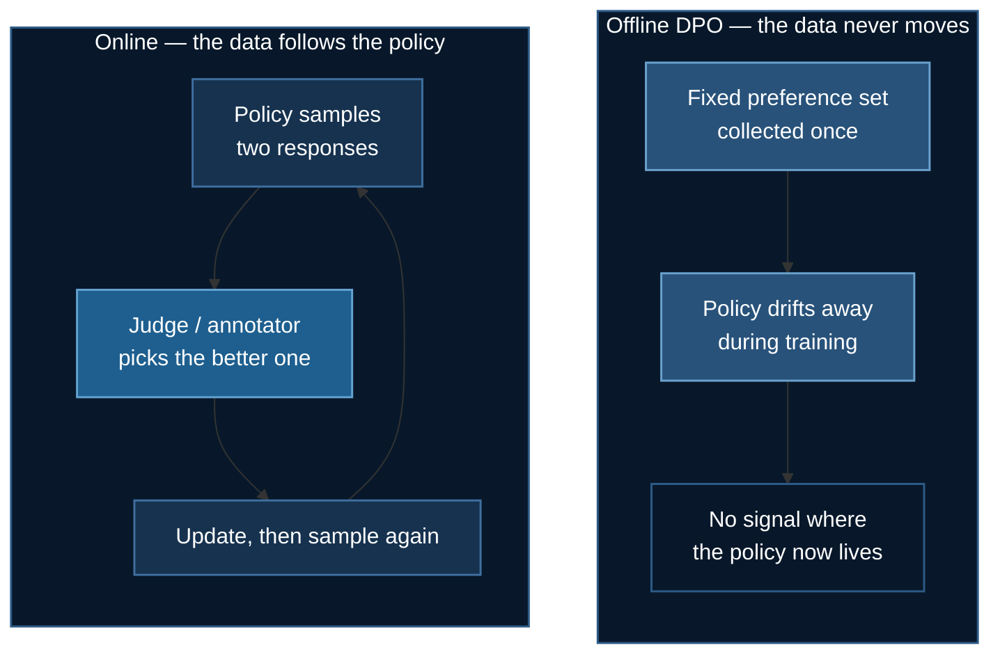

# Online Preference Methods

[DPO and its family](./preference-optimization.md) learn from a **fixed** dataset
collected before training started. [GRPO](./grpo-training.md) samples fresh
rollouts and scores them with a **verifier**.

There is a gap between those two, and it is where a lot of practical alignment
lives: you want fresh on-policy samples, but you have **no verifier** — only a
judge that can say which of two responses is better.

**Example folder:** [`06_huggingface_online_dpo/`](https://github.com/yiqiao-yin/deepspeed-course/tree/main/06_huggingface_online_dpo) — `--method online_dpo|nash_md|xpo`, ZeRO-3 because it generates during training.

**TRL trainers:** `OnlineDPOTrainer`, `NashMDTrainer`, `XPOTrainer`

## 1. The Distribution-Shift Problem

Offline DPO has a failure mode that is easy to miss and hard to fix after the
fact.

Your preference pairs were generated by *some* model — an earlier checkpoint, a
different model, a human. As training proceeds, your policy moves away from
whatever produced that data. Within a few hundred steps it is generating
responses that look nothing like anything in the dataset, and **you have no
preference signal for the region it now occupies**.



The symptom: DPO improves for a while, then plateaus or degrades, and the
implicit-reward margin keeps climbing regardless. The margin is measuring
separation on **stale** data.

## 2. Where These Sit in Time

| Method | arXiv | Date | vs GRPO |
|---|---|---|---|
| Nash-MD | [2312.00886](https://arxiv.org/abs/2312.00886) | Dec 2023 | **before** |
| Online DPO (OAIF) | [2402.04792](https://arxiv.org/abs/2402.04792) | Feb 7, 2024 | just after |
| *GRPO* | [2402.03300](https://arxiv.org/abs/2402.03300) | *Feb 5, 2024* | — |
| XPO | [2405.21046](https://arxiv.org/abs/2405.21046) | May 2024 | after |

:::note Honest placement
Nash-MD predates GRPO by two months, so strictly it belongs earlier. The page is
placed here because the bulk of the family (OAIF, XPO) is contemporaneous or
later, and because it reads better *after* GRPO's rollout machinery — these are
best understood as "GRPO's sampling loop with a judge instead of a verifier."
:::

## 3. Online DPO

The smallest possible change to DPO: instead of reading pairs from disk, sample
two responses from the **current** policy and ask a judge which is better.

Everything else — the loss, the implicit reward, the reference model — is
unchanged. What changes is that the preference data is regenerated every step,
so it never goes stale.

**What plays the judge:**

| Judge | Cost | Notes |
|---|---|---|
| A reward model | cheap | Back to needing [stage 2](./rlhf-reward-modeling.md) |
| A stronger LLM | moderate | OAIF's setting; this is RLAIF |
| A human | very high | Rarely feasible online |
| A rule / verifier | ~free | If you have one, use [GRPO](./grpo-training.md) |

:::warning Online DPO is not cheap
You now pay for generation on every step — two samples per prompt — plus judging.
That is most of GRPO's cost profile without GRPO's group baseline. Reach for it
when offline DPO has visibly plateaued, not by default.
:::

**Dataset shape changes too:** offline DPO needs `prompt / chosen / rejected`;
online DPO needs only `prompt`. The pairs are manufactured during training.

## 4. Nash-MD

*Munos et al., Dec 2023.*

A different critique. A **reward model** compresses all of human preference into
one scalar per response, and that compression is lossy in a specific way: it
assumes preferences are *transitive* and representable by a single number. Real
preferences are neither — A can beat B, B beat C, and C beat A.

Nash-MD keeps the **preference model** $P(y \succ y' \mid x)$ instead of
collapsing it to a reward, and seeks the **Nash equilibrium** of the resulting
two-player game: a policy that no other policy beats on average. It gets there
with mirror descent against a geometric mixture of the current and reference
policies.

The practical payoff is robustness — the solution does not depend on the
sampling distribution the way a fitted reward model does. The cost is a
genuinely more complex training loop, which is why it is used far less than
Online DPO.

## 5. XPO

*Xie et al., May 2024.*

XPO is a **one-line change to online DPO** that adds a principled exploration
bonus, and it comes with the strongest known theoretical guarantees in this
family — provable sample-efficiency, and the ability to explore *beyond the
support of the initial model and its preference data*.

The problem it addresses is real and under-discussed: online DPO samples from
the current policy, so it can only ever learn about responses the policy is
already somewhat likely to produce. If a better mode exists that the policy
assigns near-zero probability, online sampling will never find it. The
exploration bonus deliberately pushes probability toward under-sampled regions.

:::tip When theory earns its keep
XPO is the rare case where a one-line change carries a real guarantee. If you
are already running online DPO, it is close to free to try — the same trainer
shape, the same data requirements.
:::

## 6. Choosing

| Situation | Use |
|---|---|
| Fixed preference set, no budget for generation | [Offline DPO](./preference-optimization.md) |
| Offline DPO plateaued; a judge is available | **Online DPO** |
| Already running online DPO, want better coverage | **XPO** |
| Preferences are intransitive / reward model feels lossy | **Nash-MD** |
| A ground-truth **verifier** exists | [GRPO](./grpo-training.md) |

The last row remains the sharpest boundary in this whole section. A verifier is
a stronger signal than any judge, and it is free to evaluate.

## 7. Running It

```bash
uv venv && source .venv/bin/activate
uv pip install torch --index-url https://download.pytorch.org/whl/cu121
uv pip install deepspeed transformers trl peft accelerate datasets
```

```python
from trl import OnlineDPOConfig, OnlineDPOTrainer

trainer = OnlineDPOTrainer(
    model=model,
    judge=judge,                    # or reward_model=...
    args=OnlineDPOConfig(output_dir="./online-dpo", beta=0.1),
    train_dataset=prompt_only_dataset,   # prompts ONLY — no chosen/rejected
    processing_class=tokenizer,
)
trainer.train()
```

**Memory.** You are holding the policy, the reference model, *and* whatever
plays the judge, plus a generation buffer. Budget as you would for
[GRPO](./grpo-training.md) rather than for offline DPO — the ZeRO reasoning in
[`06_huggingface_grpo/ds_config.json`](https://github.com/yiqiao-yin/deepspeed-course/blob/main/06_huggingface_grpo/ds_config.json)
transfers directly.

## 8. Next

**[Beyond GRPO](./beyond-grpo.md)** — GRPO shipped with known biases, and 2025
was spent fixing them.

## References

1. Munos et al. *Nash Learning from Human Feedback* (2023). [arXiv:2312.00886](https://arxiv.org/abs/2312.00886)
2. Guo et al. *Direct Language Model Alignment from Online AI Feedback* (2024). [arXiv:2402.04792](https://arxiv.org/abs/2402.04792)
3. Xie et al. *Exploratory Preference Optimization* (2024). [arXiv:2405.21046](https://arxiv.org/abs/2405.21046)
4. Tang et al. *Understanding the Performance Gap between Online and Offline Alignment Algorithms* (2024). [arXiv:2405.08448](https://arxiv.org/abs/2405.08448)
