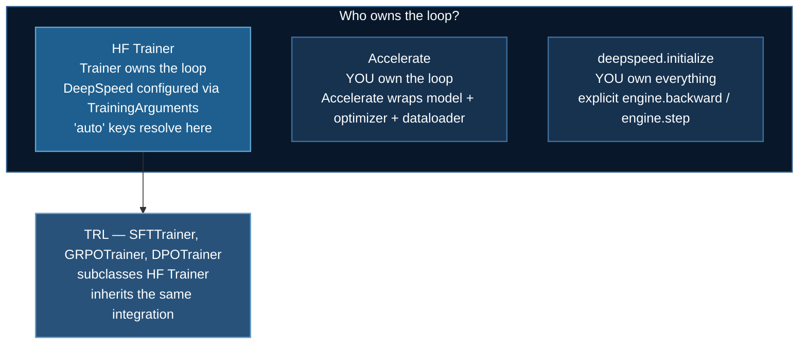
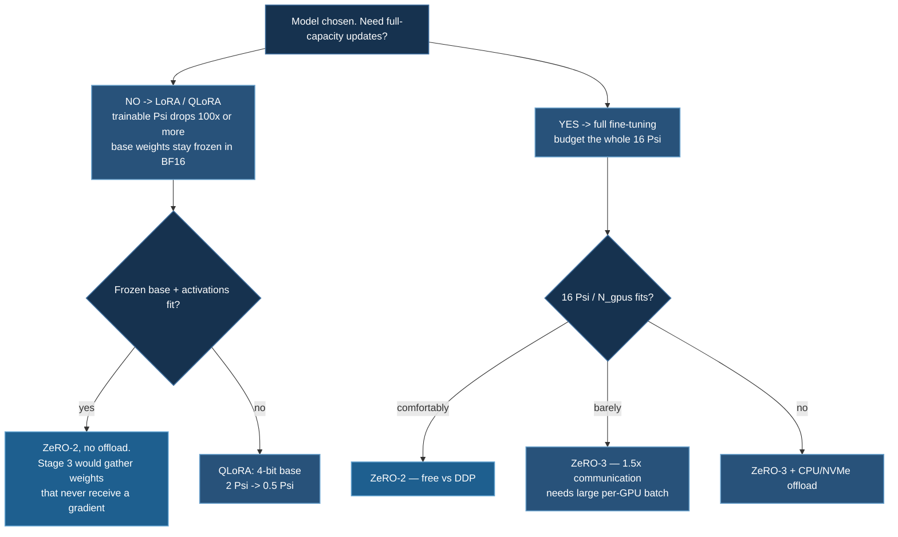

# HuggingFace Integration

How the HuggingFace stack and DeepSpeed actually connect — who owns the optimizer, what `"auto"` resolves to and when it does not, and how to choose a memory strategy from parameter count.

:::info Prerequisite
This page assumes [DeepSpeed ZeRO Stages](/docs/getting-started/deepspeed-zero-stages), particularly the $16\Psi$ mixed-precision accounting and the communication analysis. Every recommendation below is derived from it.
:::

## 1. Three Integration Paths

There are three ways to run a HuggingFace model under DeepSpeed, and they differ in **who owns the training loop**.



| Path | Use when | Config style |
|---|---|---|
| **HF `Trainer`** | Standard supervised fine-tuning | Pass `deepspeed="ds_config.json"` to `TrainingArguments`; `"auto"` works |
| **TRL trainers** | SFT, DPO, GRPO, reward modelling | Same as `Trainer` — TRL subclasses it |
| **Accelerate** | Custom loop, but you want device/precision handled | `accelerate config`, then `accelerator.prepare(...)` |
| **Raw `deepspeed.initialize`** | Full control, non-standard training | Explicit config file; **no `"auto"`** |

### HF Trainer

```python
from transformers import Trainer, TrainingArguments

args = TrainingArguments(
    output_dir="./out",
    per_device_train_batch_size=4,
    gradient_accumulation_steps=2,
    learning_rate=2e-5,
    bf16=True,
    deepspeed="ds_config.json",     # <-- the whole integration
)
Trainer(model=model, args=args, train_dataset=ds).train()
```

`Trainer` calls `deepspeed.initialize` internally and takes ownership of `backward` and `step`. Do not call them yourself.

### Raw DeepSpeed

```python
model_engine, optimizer, _, _ = deepspeed.initialize(
    model=model, model_parameters=model.parameters(), config="ds_config.json"
)
for batch in loader:
    loss = model_engine(**batch).loss
    model_engine.backward(loss)
    model_engine.step()
```

Used by the [basic examples](/docs/tutorials/basic/neural-network#84-initialization-and-the-training-loop) in this course.

## 2. The `"auto"` Mechanism

DeepSpeed configs in the HuggingFace examples are full of `"auto"`:

```json
{
  "train_batch_size": "auto",
  "train_micro_batch_size_per_gpu": "auto",
  "gradient_accumulation_steps": "auto",
  "gradient_clipping": "auto",
  "optimizer": { "params": { "lr": "auto", "betas": "auto", "eps": "auto", "weight_decay": "auto" } },
  "scheduler": { "params": { "warmup_min_lr": "auto", "warmup_max_lr": "auto", "warmup_num_steps": "auto" } }
}
```

`"auto"` is **not** a DeepSpeed feature. It is a HuggingFace convention: `Trainer` walks the config before initialization and substitutes the corresponding `TrainingArguments` value.

| Config key | Filled from |
|---|---|
| `train_micro_batch_size_per_gpu` | `per_device_train_batch_size` |
| `gradient_accumulation_steps` | `gradient_accumulation_steps` |
| `train_batch_size` | product of the above and world size |
| `optimizer.params.lr` | `learning_rate` |
| `optimizer.params.weight_decay` | `weight_decay` |
| `gradient_clipping` | `max_grad_norm` |
| `scheduler.params.warmup_num_steps` | `warmup_steps` |

This is what makes the batch-size invariant self-satisfying — set `train_batch_size` to `"auto"` and it can never disagree with `--num_gpus`.

:::danger `"auto"` silently does nothing outside HF Trainer
Pass a config containing `"auto"` to `deepspeed.initialize` directly and there is nothing to resolve it. Depending on the key you get a parse error or, worse, a string where a number was expected.

**Rule:** `"auto"` requires HF `Trainer` (or a TRL trainer). With raw `deepspeed.initialize`, every value must be literal. In this course, `03_huggingface/08_gpt_oss_lora` uses `"auto"` because it runs under `Trainer`; `01_basics/01_neuralnet` uses literals because it does not.
:::

## 3. Choosing a Strategy from Parameter Count

Model states are $16\Psi$ bytes for full fine-tuning with mixed-precision Adam. Everything below follows.

| Trainable $\Psi$ | Model states | Strategy |
|---|---|---|
| < 1B | < 16 GB | ZeRO-2, full fine-tuning. One GPU is fine |
| 1–7B | 16–112 GB | ZeRO-2 + BF16; **or LoRA**, which is usually better value |
| 7–20B | 112–320 GB | LoRA + ZeRO-2, or full FT with ZeRO-3 across many GPUs |
| 20–70B | 320 GB–1.1 TB | LoRA + ZeRO-3, or QLoRA on one node |
| > 70B | > 1.1 TB | ZeRO-3 + CPU/NVMe offload, or 3D parallelism |



:::tip With LoRA, prefer Stage 2 over Stage 3
LoRA freezes the base model, so $\Psi_{\text{trainable}}$ is often under 1% of $\Psi$ and the $16\Psi$ term nearly vanishes — the budget becomes frozen base weights ($2\Psi$ in BF16) plus activations, neither of which ZeRO-DP partitions.

Stage 3 would `all-gather` the full parameter set in both forward and backward, paying $3\Psi$ of traffic on weights that never receive a gradient. **Stage 2 plus gradient checkpointing is the right configuration for LoRA**, and it is what every LoRA example in this course uses.
:::

## 4. Reference Configurations

**ZeRO-2 + BF16** — the default for models up to ~7B, or any LoRA run:

```json
{
  "bf16": { "enabled": true },
  "zero_optimization": {
    "stage": 2,
    "allgather_partitions": true,
    "allgather_bucket_size": 2e8,
    "overlap_comm": true,
    "reduce_scatter": true,
    "reduce_bucket_size": 2e8,
    "contiguous_gradients": true
  },
  "gradient_clipping": "auto",
  "train_batch_size": "auto",
  "train_micro_batch_size_per_gpu": "auto",
  "gradient_accumulation_steps": "auto"
}
```

**ZeRO-3 + offload** — full fine-tuning of large models:

```json
{
  "bf16": { "enabled": true },
  "zero_optimization": {
    "stage": 3,
    "offload_optimizer": { "device": "cpu", "pin_memory": true },
    "offload_param":     { "device": "cpu", "pin_memory": true },
    "overlap_comm": true,
    "contiguous_gradients": true,
    "stage3_prefetch_bucket_size": 5e7,
    "stage3_param_persistence_threshold": 1e5,
    "stage3_gather_16bit_weights_on_model_save": true
  }
}
```

:::warning `stage3_gather_16bit_weights_on_model_save`
Without it, a Stage-3 checkpoint is written as shards and `from_pretrained` cannot load it. Recover with `zero_to_fp32.py` in the checkpoint directory — but setting the flag up front is easier.
:::

### BF16 over FP16 for LLMs

Every HuggingFace example in this course uses BF16 where the hardware allows. BF16 has FP32's 8-bit exponent with a 7-bit mantissa, so it needs no [loss scaling](/docs/tutorials/basic/neural-network#85-fp16-and-dynamic-loss-scaling) and cannot overflow the way FP16 does at $g^2 > 65{,}504$. Transformer training is range-sensitive rather than precision-sensitive, so this is the right trade. Requires Ampere (A100, RTX 30xx) or newer — on V100 or T4, FP16 with dynamic loss scaling is the only option.

## 5. The Examples in This Course

| Example | Model | Technique | Stage |
|---|---|---|---|
| [TRL Function Calling](/docs/tutorials/huggingface/trl-function-calling) | Qwen3-0.6B | SFT for tool use | 2 |
| [OCR Vision-Language](/docs/tutorials/huggingface/ocr-vision-language) | Qwen2-VL-2B | Multimodal LoRA | 2 |
| [RLHF and Reward Modeling](/docs/tutorials/huggingface/rlhf-reward-modeling) | — | The four-model pipeline (concepts) | — |
| [Preference Optimization](/docs/tutorials/huggingface/preference-optimization) | — | DPO / IPO / CPO / KTO / ORPO / SimPO | 1 |
| [GRPO Training](/docs/tutorials/huggingface/grpo-training) | Qwen-1.5B | RL with verifiable rewards | 2 + offload |
| [Online Preference Methods](/docs/tutorials/huggingface/online-preference-methods) | — | Online DPO / Nash-MD / XPO | 2 |
| [Beyond GRPO](/docs/tutorials/huggingface/beyond-grpo) | — | Dr. GRPO / DAPO / GSPO | 2 |
| [GPT-OSS Fine-tuning](/docs/tutorials/huggingface/gpt-oss-finetuning) | gpt-oss-20b | MoE LoRA | 2 |
| [Multi-Agent](/docs/tutorials/huggingface/multi-agent) | Qwen-1.5B | Multi-agent GRPO (exploratory) | — |

## 6. Common Issues

**Batch-size assertion at startup.** $\texttt{train\_batch\_size} = \texttt{micro} \times \texttt{accum} \times N_{\text{gpus}}$. Under `Trainer`, set all three to `"auto"`.

**`"auto"` not resolving.** You are not using HF `Trainer`. See §2.

**OOM immediately, before any step.** Model-state bound — $16\Psi$ does not fit. LoRA, more GPUs, or offload. Batch size is irrelevant here; see the [OOM diagnosis flow](/docs/tutorials/basic/neural-network#92-diagnosis).

**OOM after several successful steps.** Activation-bound or fragmenting. Enable `gradient_checkpointing=True`, lower the micro-batch, raise accumulation.

**Throughput collapses when moving to Stage 3.** Per-GPU batch too small to hide $3\Psi$ of traffic. Raise the micro-batch before blaming the stage.

**Loss is `NaN` from step 1 with FP16.** Use BF16 if the hardware allows.

**Tokenizer has no pad token.** Common for decoder-only models. `tokenizer.pad_token = tokenizer.eos_token`, and make sure padded positions are masked out of the loss.

## Next Steps

- [TRL Function Calling](/docs/tutorials/huggingface/trl-function-calling) — SFT and completion-only loss masking
- [DeepSpeed ZeRO Stages](/docs/getting-started/deepspeed-zero-stages) — the memory arithmetic behind §3
- [DeepSpeed Config Reference](/docs/reference/deepspeed-config)

## References

1. Wolf, T., Debut, L., Sanh, V., et al. (2020). Transformers: State-of-the-Art Natural Language Processing. *EMNLP 2020: System Demonstrations*. [arXiv:1910.03771](https://arxiv.org/abs/1910.03771)
2. von Werra, L., Belkada, Y., Tunstall, L., et al. (2020). TRL: Transformer Reinforcement Learning. [GitHub](https://github.com/huggingface/trl)
3. Rajbhandari, S., Rasley, J., Ruwase, O., & He, Y. (2020). ZeRO. *SC '20*. [arXiv:1910.02054](https://arxiv.org/abs/1910.02054)
4. Hu, E. J., Shen, Y., Wallis, P., et al. (2022). LoRA: Low-Rank Adaptation of Large Language Models. *ICLR 2022*. [arXiv:2106.09685](https://arxiv.org/abs/2106.09685)
5. Dettmers, T., Pagnoni, A., Holtzman, A., & Zettlemoyer, L. (2023). QLoRA: Efficient Finetuning of Quantized LLMs. *NeurIPS 2023*. [arXiv:2305.14314](https://arxiv.org/abs/2305.14314)
6. [HuggingFace DeepSpeed integration docs](https://huggingface.co/docs/transformers/deepspeed)
7. [DeepSpeed configuration reference](https://www.deepspeed.ai/docs/config-json/)
