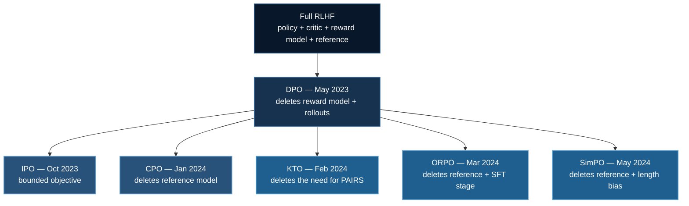

# Preference Optimization: DPO and Its Descendants

[RLHF](./rlhf-reward-modeling.md) needs four models and a rollout loop. DPO's
claim is that for offline preference data, **the reward model was never
necessary** — and the family that grew out of it spent the following year
deleting the rest of the pipeline one component at a time.

This is what most alignment work actually uses. It is roughly an order of
magnitude cheaper than [GRPO](./grpo-training.md) and, on most public
benchmarks, competitive.

**Example folder:** [`05_huggingface_dpo/`](https://github.com/yiqiao-yin/deepspeed-course/tree/main/05_huggingface_dpo) — one `train_dpo.py` with `--method dpo|ipo|cpo|kto|orpo|simpo`, plus `preference_losses.py` (all six losses on plain tensors, no GPU, no download).

**TRL trainers:** `DPOTrainer`, `KTOTrainer`, `ORPOTrainer`; `CPOTrainer` and `BCOTrainer` now live under `trl.experimental`.

:::warning SimPO is not a `DPOTrainer` loss type
It is `CPOConfig(loss_type="simpo", cpo_alpha=0.0)` plus `simpo_gamma`. Leaving `cpo_alpha` at its default of `1.0` silently trains **CPO-SimPO**, which is a different method.

(`DPOConfig` does expose `loss_type="sigmoid_norm"`, which applies SimPO's length normalisation to the DPO loss — related, but not the same objective.)
:::

## 1. The Timeline

Ordering matters here, and it is not clean — the family **straddles GRPO**:

| Method | arXiv | Date | Deletes |
|---|---|---|---|
| **DPO** | [2305.18290](https://arxiv.org/abs/2305.18290) | May 2023 | reward model, rollouts |
| **IPO** | [2310.12036](https://arxiv.org/abs/2310.12036) | Oct 2023 | — (fixes DPO's overfitting) |
| **CPO** | [2401.08417](https://arxiv.org/abs/2401.08417) | Jan 2024 | reference model |
| **KTO** | [2402.01306](https://arxiv.org/abs/2402.01306) | Feb 2, 2024 | the need for *pairs* |
| *GRPO* | [2402.03300](https://arxiv.org/abs/2402.03300) | *Feb 5, 2024* | *the critic* |
| **ORPO** | [2403.07691](https://arxiv.org/abs/2403.07691) | Mar 2024 | reference model + SFT stage |
| **SimPO** | [2405.14734](https://arxiv.org/abs/2405.14734) | May 2024 | reference model, length bias |

:::note Why this page sits before GRPO despite the overlap
KTO precedes GRPO by three days; ORPO and SimPO follow it. The page is placed by
when the *class* was established (DPO, May 2023) and because offline preference
optimization is simpler and cheaper, so it is the right thing to reach for
first. The dates above are given so the overlap is visible rather than hidden.
:::

## 2. DPO: the Cancellation

Under the KL-regularised RLHF objective, the optimal policy has a closed form.
Invert it and you get the reward *implied* by any policy:

$$
r(x,y) = \beta \log \frac{\pi(y \mid x)}{\pi_{\text{ref}}(y \mid x)} + \beta \log Z(x)
$$

Substitute that into Bradley–Terry, and the intractable partition function
$Z(x)$ **cancels between the two responses**:

$$
\mathcal{L}_{\text{DPO}} = -\mathbb{E}\left[\log\sigma\left(\beta\log\frac{\pi_\theta(y_w \mid x)}{\pi_{\text{ref}}(y_w \mid x)} - \beta\log\frac{\pi_\theta(y_l \mid x)}{\pi_{\text{ref}}(y_l \mid x)}\right)\right]
$$

That cancellation is the entire paper. No reward model, no rollouts, no critic —
**the policy is the reward model, read off implicitly.** What remains is a
binary classification loss on a fixed dataset.

What it still costs: a frozen reference model in memory, and the inability to
query a verifier or score anything not already in your dataset.

## 3. What Each Descendant Deletes



### IPO — a finite optimum

DPO's $-\log\sigma(\cdot)$ is **unbounded below** in the margin. Pushing the
margin from 10 to 20 still reduces the loss, so on a near-deterministic
preference set the optimiser keeps separating long after the preference is
learned. Because that margin is a log-ratio against the reference, "keep
pushing" means "keep walking away from the reference" — the KL term stops
restraining anything.

IPO replaces the sigmoid with a squared loss around a fixed target:

$$
\mathcal{L}_{\text{IPO}} = \left(h_{\pi} - \frac{1}{2\tau}\right)^2, \qquad
h_\pi = \log\frac{\pi_\theta(y_w)}{\pi_{\text{ref}}(y_w)} - \log\frac{\pi_\theta(y_l)}{\pi_{\text{ref}}(y_l)}
$$

Now the objective has a minimum at a **finite** margin. Verified in the test
suite: at $\tau = 0.1$ the target margin is 5.0, IPO's loss is ~0 there and
rises on *both* sides, while DPO's keeps falling monotonically as the margin
grows to 100.

:::warning `tau` runs the opposite way to `beta`
The optimal margin is $1/(2\tau)$, so **smaller $\tau$ targets a larger margin**
— the reverse of DPO's $\beta$. Carrying a value across from a DPO config is a
reliable way to get the opposite of what you intended.
:::

### KTO — no pairs required

Every other loss here needs `(prompt, chosen, rejected)`: two responses to the
same prompt, ranked. That data is expensive and unnatural to collect. What
organisations actually have is a pile of individual outputs with a thumbs
up/down — unpaired, and usually imbalanced.

KTO consumes exactly that, borrowing the asymmetric value function from
Kahneman–Tversky prospect theory (losses hurt more than equivalent gains
please). Each example is one response and one bit.

:::danger The class-weight knob is not optional
`desirable_weight` / `undesirable_weight` exist because unpaired data is almost
never balanced. The paper's guidance is to keep
$w_D \cdot n_{\text{desirable}} \approx w_U \cdot n_{\text{undesirable}}$.

Ignore it on a 10:1 dataset and the model optimises almost entirely for the
majority class **while the loss curve looks perfectly healthy**.
:::

### ORPO — one stage, no reference model

ORPO's argument: the SFT stage already contains the signal, it just lacks the
downward force. So fold a mild penalty on the disfavoured response directly into
the SFT objective:

$$
\mathcal{L}_{\text{ORPO}} = \mathcal{L}_{\text{NLL}}(y_w) - \lambda \log\sigma\left(\log\frac{\text{odds}(y_w)}{\text{odds}(y_l)}\right)
$$

One stage. No reference model, no separate alignment run, no second frozen copy
in VRAM. For small models and modest budgets this is the cheapest thing here.

**Why odds and not log-probs?** The odds ratio saturates; a log-prob ratio grows
without bound as $p_l \to 0$ and would let the alignment term overwhelm the NLL
term, destroying the fluency the SFT half is building. Saturation is what lets
the two terms share one objective instead of needing two stages.

### SimPO — the length argument

DPO's implicit reward is a **sum** of token log-probs. Sum more terms and you
get a different number, so length leaks into the reward through a route with
nothing to do with quality.

SimPO makes the reward the **average** log-prob — which is also what the model
maximises at decoding time, so the training and inference objectives finally
agree:

$$
\mathcal{L}_{\text{SimPO}} = -\log\sigma\left(\frac{\beta}{|y_w|}\log\pi_\theta(y_w) - \frac{\beta}{|y_l|}\log\pi_\theta(y_l) - \gamma\right)
$$

The margin $\gamma$ supplies the floor that the deleted KL term used to.

:::warning SimPO's `beta` is ~20x DPO's
DPO's $\beta \approx 0.1$ acts on **sums**; SimPO's $\beta \approx 2.0$ acts on
**averages**, which are far smaller in magnitude. Carrying the value across
silently disables the objective.
:::

## 4. Measured, Not Asserted

Two properties decide most practical choices. Both are computed by
`preference_losses.py`, not claimed here.

### Which methods hold a second model in VRAM?

Perturb *only* the reference model and see who notices:

```
  DPO      delta =    -0.229387   USES the reference
  IPO      delta =    -2.000000   USES the reference
  CPO      delta =    +0.000000   reference-free
  ORPO     delta =    +0.000000   reference-free
  SimPO    delta =    +0.000000   reference-free
```

Those zeros are exact, not rounded — the test suite asserts bit-level equality,
because "approximately indifferent" would mean the reference leaked in somewhere.

For a 7B model, reference-free is roughly **14 GB** you get back.

### Does length leak into the reward?

Every response below has per-token log-prob $-0.5$ — **identical quality by
construction**:

```
    length    sum log-prob    avg log-prob
  ------------------------------------------
        10           -5.00           -0.50
        20          -10.00           -0.50
        40          -20.00           -0.50
        80          -40.00           -0.50
```

The sum-based score falls linearly with length; the average-based score does not
move. DPO, IPO and CPO score with the sum; ORPO and SimPO normalise.

```
  CPO   margin   -1.0000   nonzero purely from the length difference
  SimPO margin   -0.5000   exactly -gamma — length has cancelled
```

:::note Be precise about the direction
Here the longer response scores *lower*, because more tokens means a more
negative sum. The widely-reported real-world drift is toward *longer* outputs,
which comes from the interaction with preference data whose chosen responses are
already longer.

The claim this experiment supports is the narrower, sturdier one: **a
length-unnormalised objective lets length into the reward at all.** Which
direction it pushes depends on your data.
:::

## 5. Choosing

| Situation | Use |
|---|---|
| Paired preferences, memory available | **DPO** — the default; best-understood |
| DPO margins exploding, model degrading | **IPO** — bounded objective |
| Only thumbs up/down, no pairs | **KTO** — the only one that fits |
| Reference model will not fit | **CPO**, **ORPO**, **SimPO** |
| Want to skip a separate SFT run | **ORPO** — one stage |
| Outputs drifting verbose | **SimPO** — length-normalised |
| You have a cheap **verifier** | none of these — [GRPO](./grpo-training.md) |

That last row is the real boundary. When a ground-truth checker exists — maths,
code, anything with a unit test — throwing it away to collect pairwise human
preferences is a strange trade.

## 6. Running It

```bash
uv venv && source .venv/bin/activate
uv pip install torch --index-url https://download.pytorch.org/whl/cu128
uv pip install deepspeed transformers trl peft accelerate datasets
```

```python
from trl import DPOConfig, DPOTrainer

trainer = DPOTrainer(
    model=model,
    ref_model=None,          # None => a frozen copy is made, or LoRA's base is
                             # reused with the adapter disabled. Never leave a
                             # reference model out of a method that needs one.
    args=DPOConfig(output_dir="./dpo", beta=0.1),
    train_dataset=dataset,   # needs prompt / chosen / rejected
    processing_class=tokenizer,
)
trainer.train()
```

:::tip LoRA halves the reference-model cost
With LoRA, the reference model is the **base weights with the adapter
disabled** — no second copy needed. That makes DPO nearly as memory-cheap as the
reference-free methods, and is usually a better first move than switching
objectives to save memory.
:::

Verify the objectives on CPU before renting anything:

```bash
uv run 05_huggingface_dpo/preference_losses.py
uv run tests/test_preference_losses.py     # 58 checks, no GPU
```

## 7. Next

**[GRPO](./grpo-training.md)** — what to do when you have a verifier instead of
preference pairs, and why removing the *critic* is a different move from
removing the reward model.

## References

1. Rafailov et al. *Direct Preference Optimization* (2023). [arXiv:2305.18290](https://arxiv.org/abs/2305.18290)
2. Azar et al. *A General Theoretical Paradigm to Understand Learning from Human Preferences* (2023). [arXiv:2310.12036](https://arxiv.org/abs/2310.12036)
3. Xu et al. *Contrastive Preference Optimization* (2024). [arXiv:2401.08417](https://arxiv.org/abs/2401.08417)
4. Ethayarajh et al. *KTO: Model Alignment as Prospect Theoretic Optimization* (2024). [arXiv:2402.01306](https://arxiv.org/abs/2402.01306)
5. Hong et al. *ORPO: Monolithic Preference Optimization without Reference Model* (2024). [arXiv:2403.07691](https://arxiv.org/abs/2403.07691)
6. Meng et al. *SimPO: Simple Preference Optimization with a Reference-Free Reward* (2024). [arXiv:2405.14734](https://arxiv.org/abs/2405.14734)
7. Park et al. *Disentangling Length from Quality in Direct Preference Optimization* (2024). [arXiv:2403.19159](https://arxiv.org/abs/2403.19159)
