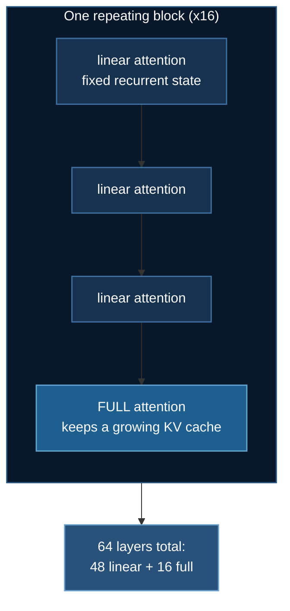

# Qwen3.8-27B: Fine-tuning a Hybrid-Attention Model

[Qwen3.8-27B](https://huggingface.co/Qwen/Qwen3.8-27B) is 27 billion parameters
in 55.6 GB — a model you can actually rent two GPUs for. What makes it worth a
page is not its size but its shape: **48 of its 64 layers are not attention
layers at all.**

Code: [`03_huggingface/01_llm_finetuning/train_qwen38_ds.py`](https://github.com/yiqiao-yin/deepspeed-course/blob/main/03_huggingface/01_llm_finetuning/train_qwen38_ds.py)

:::tip Everything here runs without a GPU
```bash
uv run train_qwen38_ds.py --plan          # the whole analysis, from config.json
uv run train_qwen38_ds.py --verify-arch   # build the real module tree, no weights
```
:::

## 1. Two ways to make a big model affordable

This folder now holds two frontier examples, and reading them together is the
point. [GLM-5.3](./glm53-moe-finetuning.md) and Qwen3.8 solve the same problem
from opposite ends.

| | GLM-5.3 | Qwen3.8-27B |
|---|---|---|
| shape | sparse MoE | **dense**, hybrid attention |
| parameters | 743 B, 39 B active per token | 27 B, all active |
| the trick | most parameters idle on any given token | most **layers** keep no KV cache |
| attacks | the *parameter* dimension | the *sequence* dimension |
| weights | 755.7 GB | 55.6 GB |
| hardware | 8 × H200 | **2 × 48 GB** |

GLM-5.3 shrinks what the model *is*. Qwen3.8 shrinks what the model must
*remember*. Both are memory techniques wearing different clothes — which is the
through-line of this entire course.

## 2. 48 linear layers, 16 full-attention layers

`config.json` publishes a `layer_types` list, and it is strictly periodic:
every fourth layer is full attention, the rest are linear.

```
linear, linear, linear, FULL, linear, linear, linear, FULL, ...
```



| | |
|---|---|
| architecture | `Qwen3_5ForConditionalGeneration` (`model_type: qwen3_5`) |
| parameters | 27.36 B total, **26.90 B** without the vision tower |
| weights | 55.6 GB bf16 |
| layers | 64 — **48 linear attention, 16 full attention** |
| full attention | GQA, 24 q-heads / 4 kv-heads, head_dim 256 |
| linear attention | gated-delta: 16 k-heads × 128, 48 v-heads × 128, causal conv kernel 4, SSM state in **float32** |
| vision tower | 27 layers, hidden 1152, patch 16 (0.46 B) |
| context | 262,144 tokens |
| transformers | config was saved with 5.8.0.dev0; **verified working on 5.16.1**, the version this folder's `uv.lock` pins |

:::note It is a vision-language model, and that matters for reading the config
The architecture is `...ForConditionalGeneration` and everything about the
language model is nested under `text_config`. `config["num_hidden_layers"]` is
simply **absent** at the top level, and a `.get(..., 0)` default silently turns
that into a plausible zero. Every function in the shipped script goes through
one `_text_config()` helper for exactly this reason.

`AutoModelForCausalLM` returns `Qwen3_5ForCausalLM` — the 26.90 B language half,
no vision tower — so text-only SFT is a first-class supported path, which is
what makes this example belong in an LLM fine-tuning folder.
:::

## 3. Only a quarter of the layers keep a KV cache

A linear-attention layer carries a **fixed recurrent state** instead of a cache
that grows with every token. So the per-token cache cost counts 16 layers, not
64:

| | per token | at 262,144 tokens |
|---|---|---|
| **hybrid (16 full layers)** | **64 KB** | **17.2 GB** |
| if all 64 layers were full attention | 256 KB | 68.7 GB |

A 4× reduction — and sizing a deployment over all 64 layers would overstate the
requirement by exactly that factor.

The other half of the story is the part that does *not* scale:

```
the 48 linear layers hold 159 MB per SEQUENCE,
independent of length — the same for 1 token or the full 262,144
```

That constant is the whole argument for the architecture. A recurrent state is
$O(1)$ in sequence length where a KV cache is $O(n)$, so the linear layers cost
the same at 1K context as at 262K. Treating that 159 MB as a per-token figure
inverts the entire reasoning, which is why the shipped function takes **no
sequence-length argument at all** — there is nothing for it to depend on.

:::info Why the DeepSpeed config disables fp16 and says so
The recurrent state is applied repeatedly down the sequence, and the model's own
config pins it to float32 (`mamba_ssm_dtype`). A small representation error in a
recurrent operator **compounds with length** rather than averaging out — exactly
what fp16's narrow exponent range produces. bf16 keeps fp32's range, which is
why `ds_config_qwen38.json` uses it and disables fp16 outright.
:::

## 4. The mistake this model invites

Here is the thing most likely to go wrong, and it is nastier than GLM-5.3's
version of the same problem.

The standard LoRA target list — `q_proj`, `k_proj`, `v_proj`, `o_proj`, copied
from every Llama recipe — **does exist in this model**. On the 16 full-attention
layers. The other 48 layers have no `q_proj` at all; they expose
`linear_attn.in_proj_{qkv,z,b,a}` and `linear_attn.out_proj`, which share no
names with the attention layers.

:::danger It does not error. It trains. The loss falls.
peft matches the 16 layers, attaches adapters, and runs. Three quarters of a
good model is still a good model, so the loss curve looks perfectly healthy.
You have fine-tuned **25% of the depth** and nothing tells you.

With GLM-5.3 the same list matches *nothing*, which at least has a chance of
raising. Here it matches *something*, which is worse.
:::

The shipped `lora_target_modules()` covers both families, and `--plan` reports
coverage as a number so the mistake is visible rather than inferred:

```
$ uv run train_qwen38_ds.py --plan --lora-scope attention-full
    target modules    q_proj, k_proj, v_proj, o_proj
    layer coverage    16/64 (25% of depth)

    WARNING: 48 layers get NO adapter.
```

```
$ uv run train_qwen38_ds.py --plan            # the default
    target modules    q_proj, k_proj, v_proj, o_proj, in_proj_qkv,
                      in_proj_z, in_proj_b, in_proj_a, out_proj
    layer coverage    64/64 (100% of depth)
```

`--lora-scope attention-full` reproduces the mistake **on purpose**, because a
warning you can measure is worth more than one you have to trust.

### Verify it against the real module tree

```bash
uv run train_qwen38_ds.py --verify-arch
```

builds the model on the **meta device** — no memory, no weight download — and
counts every target in the actual tree:

```
  built Qwen3_5ForCausalLM: 1,015 modules
    q_proj           full-attn    FOUND      16
    k_proj           full-attn    FOUND      16
    v_proj           full-attn    FOUND      16
    o_proj           full-attn    FOUND      16
    in_proj_qkv      linear-attn  FOUND      48
    in_proj_z        linear-attn  FOUND      48
    in_proj_b        linear-attn  FOUND      48
    in_proj_a        linear-attn  FOUND      48
    out_proj         linear-attn  FOUND      48
  parameters: 26.90 B
```

**16 and 48.** Not an argument about what the architecture probably does — a
count from the object that will actually be trained.

The training script also asserts at runtime that the adapter attached to
something, because peft happily produces a model with zero trainable
parameters when nothing matches, and such a run trains, logs a loss, and
changes nothing:

```python
trainable = sum(p.numel() for p in trainer.model.parameters() if p.requires_grad)
if not args.no_lora and trainable == 0:
    raise RuntimeError("LoRA attached to nothing: 0 trainable parameters.")
```

## 5. Hardware: two cards is the floor

55.6 GB of bf16 weights do not fit one 48 GB card, and LoRA does not change
that — it removes optimizer state for the frozen base, not the base itself.

| configuration | total VRAM | holds it? |
|---|---|---|
| 1 × 48 GB (A6000 / L40S) | 48 GB | no |
| 2 × 24 GB (3090 / 4090) | 48 GB | no |
| **2 × 48 GB** | **96 GB** | **yes** — the default |
| 2 × 80 GB (A100 / H100) | 160 GB | comfortable |

So `ds_config_qwen38.json` uses **ZeRO stage 3**: the parameters themselves must
be sharded (~28 GB per rank), and stage 2 would leave a full 55.6 GB copy on
every GPU.

The script computes this and refuses before downloading, rather than after
55.6 GB have landed.

## 6. Running it

```bash
cd 03_huggingface/01_llm_finetuning
uv sync

# no GPU
uv run train_qwen38_ds.py --plan
uv run train_qwen38_ds.py --verify-arch
uv run ../../tests/test_qwen38_arch.py       # 32 property assertions

# CoreWeave
sbatch run_qwen38.sh --max-steps 20          # cheap dry run first
sbatch run_qwen38.sh

# RunPod, with automatic shutdown — needs 2 x 48 GB
uv run runpod/runpod_ctl.py gpus --min-vram 46
uv run runpod/runpod_ctl.py run 03_huggingface/01_llm_finetuning \
    --dry-run --collect --wait --terminate --yes
uv run runpod/runpod_ctl.py pods             # must say "Nothing is billing."
```
