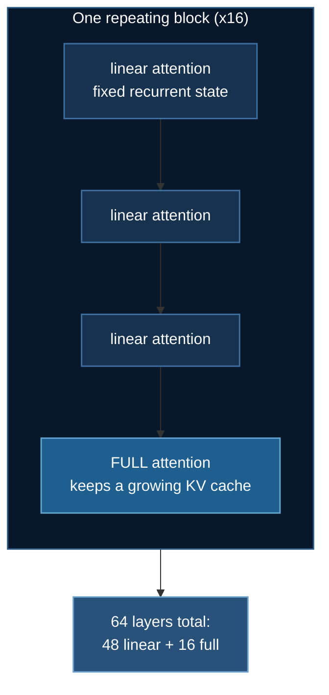

# Qwen3.8-27B: Fine-tuning a Hybrid-Attention Model

[Qwen3.8-27B](https://huggingface.co/Qwen/Qwen3.8-27B) is 27 billion parameters
in 55.6 GB — a model you can actually rent two GPUs for. What makes it worth a
page is not its size but its shape: **48 of its 64 layers are not attention
layers at all.**

Code: [`03_huggingface/01_llm_finetuning/train_qwen38_ds.py`](https://github.com/yiqiao-yin/deepspeed-course/blob/main/03_huggingface/01_llm_finetuning/train_qwen38_ds.py)

:::tip Everything here runs without a GPU
```bash
uv run train_qwen38_ds.py --plan          # the whole analysis, from config.json
uv run train_qwen38_ds.py --verify-arch   # build the real module tree, no weights
```
:::

## 1. Two ways to make a big model affordable

This folder now holds two frontier examples, and reading them together is the
point. [GLM-5.3](./glm53-moe-finetuning.md) and Qwen3.8 solve the same problem
from opposite ends.

| | GLM-5.3 | Qwen3.8-27B |
|---|---|---|
| shape | sparse MoE | **dense**, hybrid attention |
| parameters | 743 B, 39 B active per token | 27 B, all active |
| the trick | most parameters idle on any given token | most **layers** keep no KV cache |
| attacks | the *parameter* dimension | the *sequence* dimension |
| weights | 755.7 GB | 55.6 GB |
| hardware | 8 × H200 | **2 × 80 GB** |

GLM-5.3 shrinks what the model *is*. Qwen3.8 shrinks what the model must
*remember*. Both are memory techniques wearing different clothes — which is the
through-line of this entire course.

## 2. 48 linear layers, 16 full-attention layers

`config.json` publishes a `layer_types` list, and it is strictly periodic:
every fourth layer is full attention, the rest are linear.

```
linear, linear, linear, FULL, linear, linear, linear, FULL, ...
```



| | |
|---|---|
| architecture | `Qwen3_5ForConditionalGeneration` (`model_type: qwen3_5`) |
| parameters | 27.36 B total, **26.90 B** without the vision tower |
| weights | 55.6 GB bf16 |
| layers | 64 — **48 linear attention, 16 full attention** |
| full attention | GQA, 24 q-heads / 4 kv-heads, head_dim 256 |
| linear attention | gated-delta: 16 k-heads × 128, 48 v-heads × 128, causal conv kernel 4, SSM state in **float32** |
| vision tower | 27 layers, hidden 1152, patch 16 (0.46 B) |
| context | 262,144 tokens |
| transformers | config was saved with 5.8.0.dev0; **verified working on 5.16.1**, the version this folder's `uv.lock` pins |

:::note It is a vision-language model, and that matters for reading the config
The architecture is `...ForConditionalGeneration` and everything about the
language model is nested under `text_config`. `config["num_hidden_layers"]` is
simply **absent** at the top level, and a `.get(..., 0)` default silently turns
that into a plausible zero. Every function in the shipped script goes through
one `_text_config()` helper for exactly this reason.

`AutoModelForCausalLM` returns `Qwen3_5ForCausalLM` — the 26.90 B language half,
no vision tower — so text-only SFT is a first-class supported path, which is
what makes this example belong in an LLM fine-tuning folder.
:::

## 3. Only a quarter of the layers keep a KV cache

A linear-attention layer carries a **fixed recurrent state** instead of a cache
that grows with every token. So the per-token cache cost counts 16 layers, not
64:

| | per token | at 262,144 tokens |
|---|---|---|
| **hybrid (16 full layers)** | **64 KB** | **17.2 GB** |
| if all 64 layers were full attention | 256 KB | 68.7 GB |

A 4× reduction — and sizing a deployment over all 64 layers would overstate the
requirement by exactly that factor.

The other half of the story is the part that does *not* scale:

```
the 48 linear layers hold 159 MB per SEQUENCE,
independent of length — the same for 1 token or the full 262,144
```

That constant is the whole argument for the architecture. A recurrent state is
$O(1)$ in sequence length where a KV cache is $O(n)$, so the linear layers cost
the same at 1K context as at 262K. Treating that 159 MB as a per-token figure
inverts the entire reasoning, which is why the shipped function takes **no
sequence-length argument at all** — there is nothing for it to depend on.

:::info Why the DeepSpeed config disables fp16 and says so
The recurrent state is applied repeatedly down the sequence, and the model's own
config pins it to float32 (`mamba_ssm_dtype`). A small representation error in a
recurrent operator **compounds with length** rather than averaging out — exactly
what fp16's narrow exponent range produces. bf16 keeps fp32's range, which is
why `ds_config_qwen38.json` uses it and disables fp16 outright.
:::

## 4. The mistake this model invites

Here is the thing most likely to go wrong, and it is nastier than GLM-5.3's
version of the same problem.

The standard LoRA target list — `q_proj`, `k_proj`, `v_proj`, `o_proj`, copied
from every Llama recipe — **does exist in this model**. On the 16 full-attention
layers. The other 48 layers have no `q_proj` at all; they expose
`linear_attn.in_proj_{qkv,z,b,a}` and `linear_attn.out_proj`, which share no
names with the attention layers.

:::danger It does not error. It trains. The loss falls.
peft matches the 16 layers, attaches adapters, and runs. Three quarters of a
good model is still a good model, so the loss curve looks perfectly healthy.
You have fine-tuned **25% of the depth** and nothing tells you.

With GLM-5.3 the same list matches *nothing*, which at least has a chance of
raising. Here it matches *something*, which is worse.
:::

The shipped `lora_target_modules()` covers both families, and `--plan` reports
coverage as a number so the mistake is visible rather than inferred:

```
$ uv run train_qwen38_ds.py --plan --lora-scope attention-full
    target modules    q_proj, k_proj, v_proj, o_proj
    layer coverage    16/64 (25% of depth)

    WARNING: 48 layers get NO adapter.
```

```
$ uv run train_qwen38_ds.py --plan            # the default
    target modules    q_proj, k_proj, v_proj, o_proj, in_proj_qkv,
                      in_proj_z, in_proj_b, in_proj_a, out_proj
    layer coverage    64/64 (100% of depth)
```

`--lora-scope attention-full` reproduces the mistake **on purpose**, because a
warning you can measure is worth more than one you have to trust.

### Verify it against the real module tree

```bash
uv run train_qwen38_ds.py --verify-arch
```

builds the model on the **meta device** — no memory, no weight download — and
counts every target in the actual tree:

```
  built Qwen3_5ForCausalLM: 1,015 modules
    q_proj           full-attn    FOUND      16
    k_proj           full-attn    FOUND      16
    v_proj           full-attn    FOUND      16
    o_proj           full-attn    FOUND      16
    in_proj_qkv      linear-attn  FOUND      48
    in_proj_z        linear-attn  FOUND      48
    in_proj_b        linear-attn  FOUND      48
    in_proj_a        linear-attn  FOUND      48
    out_proj         linear-attn  FOUND      48
  parameters: 26.90 B
```

**16 and 48.** Not an argument about what the architecture probably does — a
count from the object that will actually be trained.

The training script also asserts at runtime that the adapter attached to
something, because peft happily produces a model with zero trainable
parameters when nothing matches, and such a run trains, logs a loss, and
changes nothing:

```python
trainable = sum(p.numel() for p in trainer.model.parameters() if p.requires_grad)
if not args.no_lora and trainable == 0:
    raise RuntimeError("LoRA attached to nothing: 0 trainable parameters.")
```

## 5. Hardware: two cards is the floor

55.6 GB of bf16 weights do not fit one 48 GB card, and LoRA does not change
that — it removes optimizer state for the frozen base, not the base itself.

Sizing this by aggregate VRAM is how you get it wrong, and I did. The weights
shard across ranks under ZeRO-3; the **activations, gather buffers and
fragmentation do not** — every rank pays those in full, and at 64 layers that is
about **20 GB even with gradient checkpointing on**.

$$
\text{per GPU} \;=\; \underbrace{\frac{55.6}{N}}_{\text{shards}} \;+\; \underbrace{\sim20\text{ GB}}_{\text{does not shard}}
$$

| configuration | weight shard | + overhead | per GPU | verdict |
|---|---|---|---|---|
| 1 × 48 GB | 55.6 | 20.5 | 76.1 | no |
| 2 × 24 GB | 27.8 | 20.5 | 48.3 | no |
| **2 × 48 GB** (A6000 / L40S) | 27.8 | 20.5 | **48.3** | **no — measured OOM, 1.01× over** |
| **2 × 80 GB** (A100 / H100) | 27.8 | 20.5 | 48.3 | **yes** |
| 4 × 48 GB | 13.9 | 20.5 | 34.4 | yes |

:::warning 2 × 48 GB looks like it fits, and does not
The first version of this example asserted 2 × 48 GB on an aggregate check —
96 GB against 55.6 GB of weights, comfortable. On a real 2 × L40S pod it OOMed
at the **first training step** with 44.25 GiB resident on a 44.39 GiB card,
while ZeRO-3 was correctly sharding the weights to ~27 GB. It missed by 1%.

Note also what the card reports: an "48 GB" L40S offers **44.39 GiB** usable.
At margins this thin, nominal capacity is not the number that decides.

Adding ranks shrinks the shard but never the overhead, so there is a floor: a
card smaller than the per-rank overhead cannot run this model however many of
them you buy.
:::

So `ds_config_qwen38.json` uses **ZeRO stage 3**: the parameters themselves must
be sharded (~28 GB per rank), and stage 2 would leave a full 55.6 GB copy on
every GPU.

The script computes this and refuses before downloading, rather than after
55.6 GB have landed.

## 6. When a 2-GPU pod hangs before the first step

This example was verified on rented hardware, and the first two attempts failed
in ways worth publishing, because both are things you will hit.

### The VLM tokenizer path pulls in the image processor

TRL's `SFTTrainer` calls `AutoProcessor.from_pretrained(...)` when you do not
hand it one. On a vision-language repo that resolves to the **multimodal**
processor, and the run dies before training starts:

```
ImportError: Qwen2VLImageProcessor requires the PIL library but it was not
found in your environment.
```

— during *text-only* SFT that never touches an image. The fix is one argument,
and the shipped script passes it:

```python
trainer = SFTTrainer(model=model, args=sft_config, train_dataset=ds,
                     processing_class=tokenizer,      # <- skips AutoProcessor
                     peft_config=peft_config)
```

### An ALLREDUCE of one element that never completes

The second attempt got further — 55.6 GB downloaded, weights loaded, LoRA
attached at 64/64 coverage — and then stopped dead:

```
[rank1] Watchdog caught collective operation timeout:
  WorkNCCL(SeqNum=1, OpType=ALLREDUCE, NumelIn=1, NumelOut=1,
           Timeout(ms)=1800000) ran for 1800069 milliseconds before timing out
  PG status: last enqueued work: 1, last completed work: -1
  #0 barrier from torch/distributed/distributed_c10d.py:5030
  #2 wait_for_everyone from accelerate/state.py:412
  #6 _prepare_dataset from trl/trainer/sft_trainer.py:1451
```

Read the numbers before reaching for the model. `NumelIn=1` — this is an
all-reduce of a **single element**, a plain barrier, and `last completed
work: -1` means the first collective never landed at all. Nothing about a
27 B model, ZeRO-3, or LoRA can make two ranks fail to agree on one number.

:::danger This is the pod, not your code
It is the same failure this course documents for
[a 2× RTX 4000 Ada pod](../intermediate/stock-prediction.md): the machine
advertises GPU peer-to-peer it cannot actually perform. Diagnose it in about a
minute, before blaming anything you wrote:

```bash
bash tests/gpu/diagnose_nccl.sh    # bare 2-process all_reduce, no DeepSpeed
nvidia-smi topo -m                 # `SYS` between the cards is the tell
```

The fix is an environment variable:

```bash
NCCL_P2P_DISABLE=1 deepspeed --num_gpus=2 train_qwen38_ds.py
```

It is deliberately **not** hardcoded into `run_qwen38.sh`, because on hardware
where peer-to-peer works, disabling it costs real bandwidth. Set it when you
have diagnosed that you need it.
:::

The general lesson generalises past this model: **a collective whose payload is
one element is a barrier, and a barrier that times out is an infrastructure
problem.** The size of the tensor in the error message tells you which half of
the stack to look at.


### A 27 B model that would not fit 96 GB

With the NCCL problem out of the way the run got further still — weights
loaded, LoRA attached at 47.5 M trainable parameters (0.176%) — and then:

```
torch.OutOfMemoryError: CUDA out of memory. Tried to allocate 60.00 MiB.
GPU 0 has a total capacity of 44.39 GiB of which 47.38 MiB is free.
Of the allocated memory 43.73 GiB is allocated by PyTorch
```

Read that carefully: **43.73 GiB on one card**, for a model whose weights are
55.6 GB in total and which ZeRO-3 was supposed to shard across two ranks at
~28 GB each. Failing to find 60 MiB is a symptom; the disease is that *each
rank was holding the entire model*.

The cause was ordering, in the script rather than the config:

```python
model = AutoModelForCausalLM.from_pretrained(...)   # <- WRONG, config not live yet
sft_config = SFTConfig(..., deepspeed="ds_config_qwen38.json")
```

Building `SFTConfig` with `deepspeed=...` is what instantiates transformers'
`HfDeepSpeedConfig`, and that object registers a global which
`from_pretrained` checks to decide whether to partition parameters **as it
loads** (`zero.Init`). Construct the model first and the global is absent, so
every rank materialises the whole model and DeepSpeed shards it only
afterwards — by which point you have already paid the peak.

:::tip The rule, stated generally
Under **ZeRO-3**, the DeepSpeed config must exist *before* the model is
constructed. `stage3` in a JSON file does nothing for load-time memory if the
`TrainingArguments`/`SFTConfig` that carries it is built afterwards.

The symptom is distinctive and easy to misread: an out-of-memory error whose
requested allocation is trivially small, on hardware that should have had
plenty of room. When the number in *"tried to allocate"* is far smaller than
the headroom you expected, suspect that sharding never happened rather than
that you are marginally short.
:::


## 7. What is verified, and how

| | Status |
|---|---|
| Hybrid layer split, KV-cache and state arithmetic | **verified** against the published `layer_types`, cross-checked by 37 assertions |
| LoRA target names and per-family counts | **verified** on the meta device: `q_proj` 16, `in_proj_qkv` 48 |
| transformers 5.16.1 builds the model | **verified** — `Qwen3_5ForCausalLM`, 26.90 B parameters |
| Data → model → LoRA → training steps | **verified on a rented 2 × A100-SXM4-80GB pod** |
| 2 × 48 GB is *not* enough | **verified the hard way** — OOM on 2 × L40S |
| Generation from the trained adapter | **verified on 1 × A100-SXM4-80GB** — see below |

### The verified run

`deepspeed --num_gpus=2 train_qwen38_ds.py --max-steps 4 --max-samples 32`
on 2 × A100-SXM4-80GB, via `runpod_ctl.py --collect --wait --terminate`.
Trimmed, and **measured**:

```
    weight shard      27.8 GB per GPU (ZeRO-3 across 2)
    + per-GPU overhead 20.5 GB
    = needed per GPU  48.3 GB
    you have          85 GB per GPU (2 x 85 = 170 GB total)
    verdict           FITS

  [1/4] dataset: tatsu-lab/alpaca
  32 examples

  [2/4] model: Qwen/Qwen3.8-27B  (55.6 GB)
  LoRA targets: q_proj, k_proj, v_proj, o_proj, in_proj_qkv,
                in_proj_z, in_proj_b, in_proj_a, out_proj
  layer coverage: 64/64 (100% of depth)

  [3/4] fine-tuning
  trainable: 47.5 M of 26.94 B (0.176%)   [ZeRO-3: parameters are partitioned across ranks]
  {'loss': '2.963', 'grad_norm': '4.525', 'mean_token_accuracy': '0.5419', 'epoch': '0.5'}
  {'loss': '2.848', 'grad_norm': '4.561', 'mean_token_accuracy': '0.5518', 'epoch': '1'}
  {'loss': '2.389', 'grad_norm': '4.510', 'mean_token_accuracy': '0.5706', 'epoch': '1.5'}
  {'loss': '2.076', 'grad_norm': '3.821', 'mean_token_accuracy': '0.6007', 'epoch': '2'}
  {'train_runtime': '1594', 'train_loss': '2.569', 'epoch': '2'}
  adapter written to ./qwen38-lora-out

  [4/4] inference
  Skipped: ZeRO-3 shards the weights across ranks.
```

**47.5 M trainable of 26.94 B — 0.176%** — with all 64 layers covered. That is
the page's central claim, measured on the pod rather than inferred, and the
`[ZeRO-3: parameters are partitioned across ranks]` tag is there because a
partitioned parameter reports `numel() == 0` locally; without reading
`ds_numel` the same line printed a meaningless *"47.5 M of 0.05 B (100%)"*.

Four steps on 32 examples is a **pipeline test, not a result**. The loss moves
in the right direction and nothing about quality is claimed.

:::note 400 seconds per step is not representative
That pod needed `NCCL_P2P_DISABLE=1` (§6), which forces every ZeRO-3 all-gather
through the host instead of the GPU interconnect — and ZeRO-3 gathers every
layer on every step. The workaround makes the run *possible*, not fast. On
hardware with working peer-to-peer, expect substantially better.
:::

### Generation, verified separately

Under **multi-rank** ZeRO-3 the weights are sharded, so `generate()` on rank 0
would read partial tensors. The script detects that and says so rather than
emitting garbage:

```
  [4/4] inference
  Skipped: ZeRO-3 shards the weights across ranks.
```

Note the corrected capacity model also says a **single** 80 GB card fits
(55.6 + 20.5 = 76.1 needed), so the generation path was verified on one:

```
$ deepspeed --num_gpus=1 train_qwen38_ds.py --max-steps 2 --max-samples 16 --max-length 256

  trainable: 47.5 M of 26.94 B (0.176%)
  adapter written to ./qwen38-lora-out

  [4/4] inference
  prompt:   In two sentences, explain why a model might replace attention
            with a recurrent layer.
  response: 'Recurrent layers can capture sequential dependencies with a
             fixed-size hidden state, which may be more memory-efficient than
             storing and computing over all pairwise attention scores.
             Additionally, recurrent architectures can be more computationally
             efficient for very long sequences where the quadratic complexity
             of attention becomes prohibitive.'
```

That answer happens to describe the architecture it is running on, which is a
coincidence of the prompt rather than evidence of anything — two optimizer
steps on 16 examples teach a 27 B model nothing. What it *does* prove is that
the adapter loads, the model generates, and nothing in the pipeline is silently
producing empty output. The script raises if the generation comes back blank,
because an empty completion after a successful train is exactly the kind of
quiet failure this course exists to catch.

:::tip The raw output includes reasoning tokens
Qwen3.8 emits `<think>` blocks, and the untrimmed response above continues into
one. That is the model working as designed, not a formatting bug — but if you
are scoring these completions programmatically, strip the reasoning span first
or you will be grading the model's scratchpad.
:::


## 8. Running it

```bash
cd 03_huggingface/01_llm_finetuning
uv sync

# no GPU
uv run train_qwen38_ds.py --plan
uv run train_qwen38_ds.py --verify-arch
uv run ../../tests/test_qwen38_arch.py       # 32 property assertions

# CoreWeave
sbatch run_qwen38.sh --max-steps 20          # cheap dry run first
sbatch run_qwen38.sh

# RunPod, with automatic shutdown — needs 2 x 48 GB
uv run runpod/runpod_ctl.py gpus --min-vram 46
uv run runpod/runpod_ctl.py run 03_huggingface/01_llm_finetuning \
    --dry-run --collect --wait --terminate --yes
uv run runpod/runpod_ctl.py pods             # must say "Nothing is billing."
```

:::warning Two things will bite you on RunPod here
**Capacity.** You need *two* 48 GB cards in one pod, and 2-GPU availability for
any given model comes and goes minute to minute. List what is actually
available (`gpus --min-vram 46`) and pass `--gpu` explicitly rather than
letting the cheapest-fit picker choose something that cannot be allocated.

**The wait timeout.** `--wait-seconds` defaults to 1800, and a 55.6 GB download
does not reliably finish in 30 minutes. When the timer expires with
`--terminate`, the pod is destroyed mid-download — you get *"no DONE marker —
the run may still be going"* and nothing else. Pass `--wait-seconds 5700`.
:::
