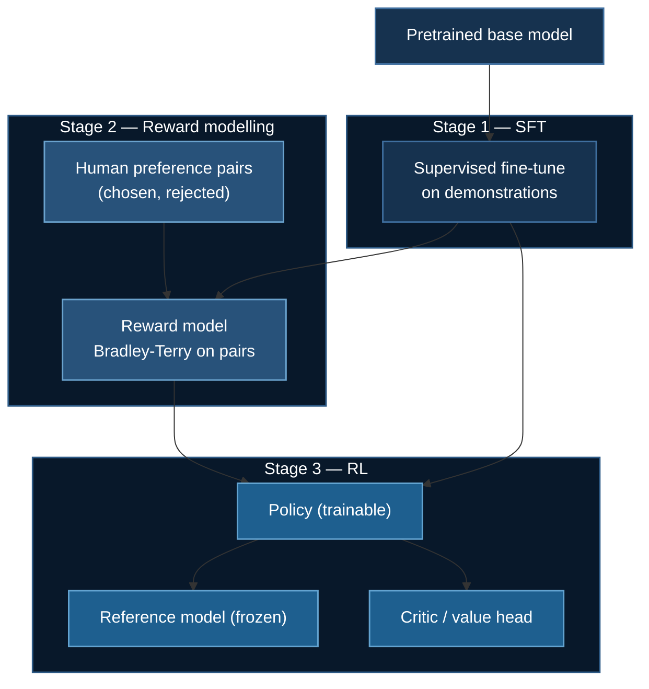

# RLHF and Reward Modeling

Everything in the next four pages is defined by **what it deletes from this
pipeline**. So it is worth building the pipeline first, even though almost
nobody runs it in full any more.

**Example folder:** [`05_huggingface_reward_model/`](https://github.com/yiqiao-yin/deepspeed-course/tree/main/05_huggingface_reward_model) — `RewardTrainer` + DeepSpeed, plus `reward_modeling.py` (the Bradley-Terry objective on plain tensors, no GPU).

**TRL trainers:** `RewardTrainer`, `PPOTrainer`

## 1. Why Alignment Needs More Than SFT

[Supervised fine-tuning](./llm-finetuning.md) maximises the likelihood of a
reference answer. That works when there *is* a reference answer. It breaks down
for the questions people actually ask a chat model:

- "Is this reply helpful?" — no single correct token sequence
- "Is this reply safe?" — defined by what it must *not* say
- "Is this reply the right length?" — a property of the whole response

SFT can only tell the model *"this output was good"*. It has no way to say
*"this output was better than that one"*, and it can never say *"this output was
bad"* — a maximum-likelihood objective has no mechanism for pushing probability
**down**.

:::note The asymmetry that motivates everything downstream
Minimising NLL on good responses raises their likelihood without ever lowering
the likelihood of bad ones. Every method in this section exists to add the
missing downward force. They differ only in how expensively they get it.
:::

## 2. The Classical Three-Stage Pipeline

*Christiano et al. 2017; Stiennon et al. 2020; Ouyang et al. 2022 (InstructGPT).*



### Stage 2: the reward model

Humans are unreliable at absolute scores and reliable at comparisons. So you do
not ask *"rate this 1–10"*; you ask *"which of these two is better?"* and fit a
**Bradley–Terry** model to the answers:

$$
P(y_w \succ y_l \mid x) = \sigma\big(r_\phi(x, y_w) - r_\phi(x, y_l)\big)
$$

Maximising its likelihood gives the reward-model loss:

$$
\mathcal{L}_{\text{RM}} = -\mathbb{E}_{(x,y_w,y_l)}\Big[\log \sigma\big(r_\phi(x,y_w) - r_\phi(x,y_l)\big)\Big]
$$

`RewardTrainer` implements exactly this. In practice $r_\phi$ is the SFT model
with the language-modelling head replaced by a scalar head.

:::warning Only *differences* in the reward are identified
Add a constant to every reward and the loss is unchanged — $\sigma$ sees only
the difference. The absolute scale is meaningless, so "our reward model scores
0.8" says nothing. This also means a reward model is only calibrated **near the
data it was trained on**, which is why the next stage needs a leash.
:::

### Stage 3: PPO against the reward model

Now optimise the policy against $r_\phi$ — but not too hard:

$$
\max_{\pi_\theta}\ \mathbb{E}_{y \sim \pi_\theta}\big[r_\phi(x,y)\big]
\;-\; \beta\, \mathbb{D}_{\text{KL}}\big[\pi_\theta \,\|\, \pi_{\text{ref}}\big]
$$

The KL term is not a regulariser in the usual sense. It exists because the
reward model is **wrong off-distribution**, and an unconstrained optimiser will
find where it is wrong and go there. That is reward hacking, and it looks like
the reward climbing beautifully while output quality collapses.

`PPOTrainer` implements the clipped surrogate. [The GRPO page](./grpo-training.md)
derives it in full (§2), so it is not repeated here.

## 3. Four Models in Memory

This is the number that drives everything that follows.

| Component | Trainable? | Memory (7B, mixed-precision Adam) |
|---|---|---|
| Policy | yes | $16\Psi$ ≈ 112 GB |
| Critic | yes | $16\Psi$ ≈ 112 GB |
| Reward model | no | $2\Psi$ ≈ 14 GB |
| Reference model | no | $2\Psi$ ≈ 14 GB |
| **Total** | | **≈ 252 GB** |

Using the $16\Psi$ accounting from [ZeRO stages](/docs/getting-started/deepspeed-zero-stages):
2 bytes fp16 weights + 2 bytes gradients + 12 bytes optimizer state per
parameter, for each *trainable* model.

:::danger This is why the rest of this section exists
Full RLHF holds **two trainable models and two frozen ones**. Every method on
the following pages is an argument about which of those four you can delete:

| Method | Deletes | Page |
|---|---|---|
| **DPO** | the reward model *and* the rollouts | [next](./preference-optimization.md) |
| **ORPO / SimPO** | the reference model | [next](./preference-optimization.md) |
| **KTO** | the requirement for *paired* data | [next](./preference-optimization.md) |
| **GRPO** | the critic | [GRPO](./grpo-training.md) |

"DPO removes the reward model" and "GRPO removes the critic" are **different
claims about different components**. Treating either as *"the one that removes
the extra model"* is the most common confusion in this area.
:::

## 4. When the Classical Pipeline Is Still Right

Rarely — but not never:

- **You need a reusable reward signal.** A trained reward model scores anything,
  including outputs from a model you have not built yet. A DPO run produces no
  reusable artefact.
- **Your preferences are genuinely subjective and plentiful.** A reward model
  generalises across prompts in a way a fixed preference set cannot.
- **You want best-of-$n$ sampling.** That needs a scorer at inference time,
  which only the reward-model route gives you.

Otherwise, start at [DPO](./preference-optimization.md). It is roughly an order
of magnitude cheaper and, on most public benchmarks, competitive.

## 5. Running It

```bash
uv venv && source .venv/bin/activate
uv pip install torch --index-url https://download.pytorch.org/whl/cu128
uv pip install deepspeed transformers trl peft accelerate datasets
```

```python
from trl import RewardConfig, RewardTrainer

trainer = RewardTrainer(
    model=model,                    # SFT model + scalar head
    args=RewardConfig(
        output_dir="./rm",
        per_device_train_batch_size=4,
        # A reward model trains on PAIRS, so effective batch is 2x this in
        # forward passes. Size your memory accordingly.
    ),
    train_dataset=paired_dataset,   # needs `chosen` and `rejected` columns
    processing_class=tokenizer,
)
trainer.train()
```

For the DeepSpeed side, the same ZeRO reasoning as
[`06_huggingface_grpo/ds_config.json`](https://github.com/yiqiao-yin/deepspeed-course/blob/main/06_huggingface_grpo/ds_config.json)
applies — with the caveat that only the policy and critic are *trainable*, so
sharding the frozen models buys you nothing beyond their fp16 weights.

## 6. Next

**[Preference Optimization](./preference-optimization.md)** — DPO's observation
that the reward model was never necessary in the first place.

## References

1. Christiano et al. *Deep Reinforcement Learning from Human Preferences* (2017). [arXiv:1706.03741](https://arxiv.org/abs/1706.03741)
2. Schulman et al. *Proximal Policy Optimization Algorithms* (2017). [arXiv:1707.06347](https://arxiv.org/abs/1707.06347)
3. Stiennon et al. *Learning to Summarize with Human Feedback* (2020). [arXiv:2009.01325](https://arxiv.org/abs/2009.01325)
4. Ouyang et al. *Training Language Models to Follow Instructions with Human Feedback* (2022). [arXiv:2203.02155](https://arxiv.org/abs/2203.02155)
5. Bai et al. *Constitutional AI: Harmlessness from AI Feedback* (2022). [arXiv:2212.08073](https://arxiv.org/abs/2212.08073)
