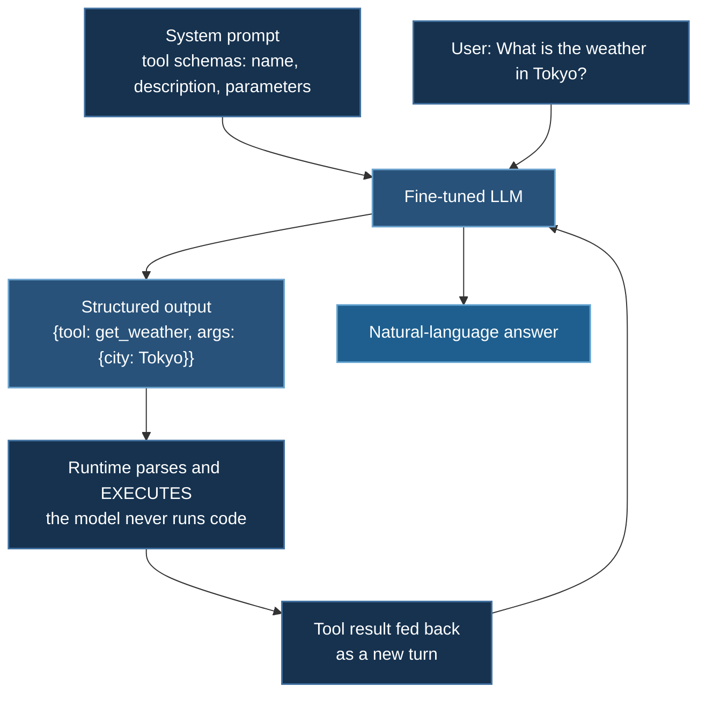

# TRL Function Calling

Supervised fine-tuning of Qwen3-0.6B for tool use with TRL's `SFTTrainer` and DeepSpeed ZeRO-2 — and the two details that decide whether SFT works: **chat templates** and **completion-only loss masking**.

**Model:** `Qwen/Qwen3-0.6B` · **Task:** emit well-formed tool calls · **Example:** `03_huggingface/02_trl_sft`

## 1. What Function Calling Is

A function-calling model does not execute anything. It performs **structured generation**: given a set of tool schemas and a user request, emit a syntactically valid call with correctly typed arguments. The runtime parses that output, executes the real function, and feeds the result back.



The learning problem is narrower than it looks. A base model already knows what a JSON object is and what "weather in Tokyo" means. What it lacks is the **discipline** to emit exactly the required schema, every time, with no prose around it. SFT is well suited to this: the target format is deterministic, so a few hundred well-formed examples go a long way.

## 2. Quick Start

```bash
cd 03_huggingface/02_trl_sft

# Training (2 GPUs)
deepspeed --num_gpus=2 train_trl_deepspeed.py

# SLURM
sbatch run_deepspeed.sh

# Inference
python inference_trl_model.py --mode sample        # a few canned examples
python inference_trl_model.py --mode single        # one query
python inference_trl_model.py --mode interactive   # chat loop
```

## 3. Data Format

```json
[
  {
    "messages": [
      {"role": "system",    "content": "You have access to tools..."},
      {"role": "user",      "content": "What's the weather in Tokyo?"},
      {"role": "assistant", "content": "{\"tool\": \"get_weather\", \"args\": {\"city\": \"Tokyo\"}}"}
    ]
  }
]
```

`SFTTrainer` recognizes a `messages` column and applies the tokenizer's **chat template** automatically.

### Why the chat template matters more than the content

A chat template is a Jinja string stored in `tokenizer_config.json` that turns a message list into the exact token sequence the model saw during its own instruction tuning — role markers, special tokens, turn boundaries:

```python
text = tokenizer.apply_chat_template(messages, tokenize=False)
```

:::danger Hand-formatting the prompt is the most common way to waste an SFT run
If you build a prompt as `f"User: {q}\nAssistant: {a}"` while the model was trained with `<|im_start|>user\n...<|im_end|>`, you are fine-tuning on a distribution the model has never seen. It will still learn something, but you have thrown away the instruction tuning you were building on, and inference will mismatch training unless you reproduce the same wrong format there too.

Always use `apply_chat_template`, and always verify what it produced:

```python
print(tokenizer.apply_chat_template(messages, tokenize=False))
```

Print it once. Confirm the special tokens are there and that generation is set to begin exactly where the assistant turn starts.
:::

## 4. Completion-Only Loss Masking

The single most important detail on this page.

By default, causal LM training computes cross-entropy over **every** token — system prompt, user message, and assistant response alike. For instruction tuning that is usually wrong.

$$
\mathcal{L}_{\text{all}} = -\sum_{t=1}^{T}\log p_\theta(x_t \mid x_{<t})
\qquad\text{vs.}\qquad
\mathcal{L}_{\text{completion}} = -\sum_{t \in \mathcal{A}}\log p_\theta(x_t \mid x_{<t})
$$

where $\mathcal{A}$ indexes assistant tokens only.

Why it matters here: in this dataset the system prompt containing the tool schemas is **long and near-identical across every example**, while the assistant response is a short JSON object. Train on all tokens and the loss is dominated by memorizing a boilerplate system prompt the model will always be *given* at inference and never has to produce. Gradient signal on the part you actually care about is proportionally diluted.

```python
from trl import SFTTrainer, SFTConfig, DataCollatorForCompletionOnlyLM

response_template = "<|im_start|>assistant\n"     # must match the chat template
collator = DataCollatorForCompletionOnlyLM(response_template, tokenizer=tokenizer)

trainer = SFTTrainer(
    model=model,
    args=SFTConfig(...),
    train_dataset=dataset,
    data_collator=collator,
)
```

The collator sets labels to `-100` — PyTorch's `ignore_index` — everywhere before the response template, so those positions contribute no loss.

:::tip Verify the mask rather than trusting it
`DataCollatorForCompletionOnlyLM` matches `response_template` as a **token** sequence, not a string. If tokenization splits it differently in context, the match silently fails and you get either an all-`-100` batch (loss `NaN`) or no masking at all. Check one batch:

```python
batch = collator([tokenizer(text) for text in [example_text]])
labels = batch["labels"][0]
print(tokenizer.decode([t for t in batch["input_ids"][0][labels != -100]]))
```

That should print the assistant turn and nothing else.
:::

### Packing

`SFTConfig(packing=True)` concatenates short examples into full-length sequences, eliminating padding waste. Very effective when examples are much shorter than `max_seq_length` — as here.

The trade-off: packed sequences can let attention cross example boundaries unless the implementation supplies boundary-aware masking. For short independent examples the contamination is usually tolerable; for tasks where cross-example leakage would matter, leave it off.

## 5. Configuration

From `train_trl_deepspeed.py`:

| Parameter | Value |
|---|---|
| Model | `Qwen/Qwen3-0.6B` |
| Epochs | 3 |
| Per-device batch | 4 |
| Learning rate | 2e-5 |
| Trainer | `trl.SFTTrainer` |

And `ds_config.json`:

```json
{
  "train_batch_size": 16,
  "train_micro_batch_size_per_gpu": 4,
  "gradient_accumulation_steps": 2,
  "optimizer": {
    "type": "AdamW",
    "params": { "lr": 2e-5, "betas": [0.9, 0.999], "eps": 1e-8, "weight_decay": "auto" }
  },
  "scheduler": {
    "type": "WarmupLR",
    "params": { "warmup_min_lr": 0, "warmup_max_lr": 2e-5, "warmup_num_steps": 100 }
  },
  "gradient_clipping": 1.0,
  "fp16": { "enabled": false },
  "bf16": { "enabled": false },
  "zero_optimization": {
    "stage": 2,
    "offload_optimizer": { "device": "none" },
    "allgather_partitions": true,
    "allgather_bucket_size": 2e8,
    "overlap_comm": true,
    "reduce_scatter": true,
    "reduce_bucket_size": 2e8,
    "contiguous_gradients": true
  }
}
```

Batch invariant: $16 = 4 \times 2 \times 2$ — **fixed at 2 GPUs**.

:::warning Both `fp16` and `bf16` are disabled — this run is FP32
That is a deliberate, conservative choice and it works fine at 0.6B: model states are $16 \times 0.6\times10^9 \approx 9.6$ GB, which fits comfortably.

It is also leaving roughly 2× throughput and half the memory on the table. On Ampere or newer, enable BF16:

```json
{ "bf16": { "enabled": true } }
```

Since `weight_decay` is `"auto"`, this config expects HF `Trainer` to resolve it — which `SFTTrainer` provides, as it subclasses `Trainer`. See [the `"auto"` mechanism](/docs/tutorials/huggingface/overview#2-the-auto-mechanism).
:::

Note also that ZeRO-2 here is close to symbolic: at 0.6B parameters a single modern GPU holds the whole run. The example is configured this way to demonstrate the integration, not because the memory is needed.

## 6. Why This Task Suits SFT

Compare against the alternatives covered elsewhere in this course:

| Method | Needs | Right for tool calling? |
|---|---|---|
| **SFT** | Demonstrations of correct output | **Yes** — the target format is deterministic and demonstrable |
| [DPO](/docs/tutorials/huggingface/grpo-training#3-direct-preference-optimization--the-other-escape-route) | Preference pairs | Overkill — there is no meaningful "preferred" among valid calls |
| [GRPO](/docs/tutorials/huggingface/grpo-training) | A reward function | Possible — schema validity is verifiable — but SFT is far cheaper |

The general rule: **when you can write down the correct output, do SFT.** Reach for RL when you can only *score* outputs, not produce them — which is exactly the mathematical-reasoning case GRPO addresses.

That said, a hybrid is standard in production: SFT to establish the format, then a small RL pass with a schema-validity reward to eliminate residual malformed outputs.

## 7. Inference and the Reliability Gap

```bash
python inference_trl_model.py --mode interactive
```

SFT makes valid tool calls *likely*, not *certain*. A model at 98% schema compliance still fails one call in fifty, and a downstream `json.loads` raises on each one.

For production, do not rely on the fine-tune alone:

- **Constrained decoding** — mask the logits at each step to only those tokens that can continue a valid parse of the schema (Outlines, `lm-format-enforcer`, or vLLM's guided decoding). This makes malformed output *impossible* rather than unlikely.
- **Validate and retry** — parse against the JSON schema, and on failure re-prompt with the error.

Fine-tuning improves the *semantics* — choosing the right tool with the right arguments. Constrained decoding guarantees the *syntax*. They solve different problems and the combination is much stronger than either.

## 8. Troubleshooting

**Loss is `NaN` from step 1.** Usually the completion mask matched nothing, so every label is `-100` and the loss is `0/0`. Verify per §4.

**Model outputs prose around the JSON.** Loss masking is probably off, so it learned the conversational distribution rather than the call format. Also check that the stop condition at inference is the chat template's end-of-turn token.

**Model ignores the tool schema.** The system prompt at inference must match training. Print `apply_chat_template` output in both places and diff them.

**Batch-size assertion.** The config is fixed at 2 GPUs ($16 = 4\times2\times2$); set the three fields to `"auto"` to make it portable.

**Tokenizer has no pad token.** `tokenizer.pad_token = tokenizer.eos_token`, and confirm padded positions are masked out of the loss.

## Next Steps

- [OCR Vision-Language](/docs/tutorials/huggingface/ocr-vision-language) — SFT extended to multimodal inputs
- [GRPO Training](/docs/tutorials/huggingface/grpo-training) — when you can score outputs but not write them
- [HuggingFace Integration](/docs/tutorials/huggingface/overview) — the `"auto"` mechanism and strategy selection

## References

1. Ouyang, L., Wu, J., Jiang, X., et al. (2022). Training language models to follow instructions with human feedback. *NeurIPS 2022*. [arXiv:2203.02155](https://arxiv.org/abs/2203.02155) — the SFT stage in context.
2. Schick, T., Dwivedi-Yu, J., Dessì, R., et al. (2023). Toolformer: Language Models Can Teach Themselves to Use Tools. *NeurIPS 2023*. [arXiv:2302.04761](https://arxiv.org/abs/2302.04761)
3. Qin, Y., Liang, S., Ye, Y., et al. (2024). ToolLLM: Facilitating Large Language Models to Master 16000+ Real-world APIs. *ICLR 2024*. [arXiv:2307.16789](https://arxiv.org/abs/2307.16789)
4. Patil, S. G., Zhang, T., Wang, X., & Gonzalez, J. E. (2023). Gorilla: Large Language Model Connected with Massive APIs. [arXiv:2305.15334](https://arxiv.org/abs/2305.15334)
5. Willard, B. T., & Louf, R. (2023). Efficient Guided Generation for Large Language Models. [arXiv:2307.09702](https://arxiv.org/abs/2307.09702) — constrained decoding.
6. Zhou, C., Liu, P., Xu, P., et al. (2023). LIMA: Less Is More for Alignment. *NeurIPS 2023*. [arXiv:2305.11206](https://arxiv.org/abs/2305.11206) — why small, high-quality SFT sets work.
7. Yang, A., Yang, B., Zhang, B., et al. (2025). Qwen3 Technical Report. [arXiv:2505.09388](https://arxiv.org/abs/2505.09388)
8. [TRL SFTTrainer documentation](https://huggingface.co/docs/trl/sft_trainer)
