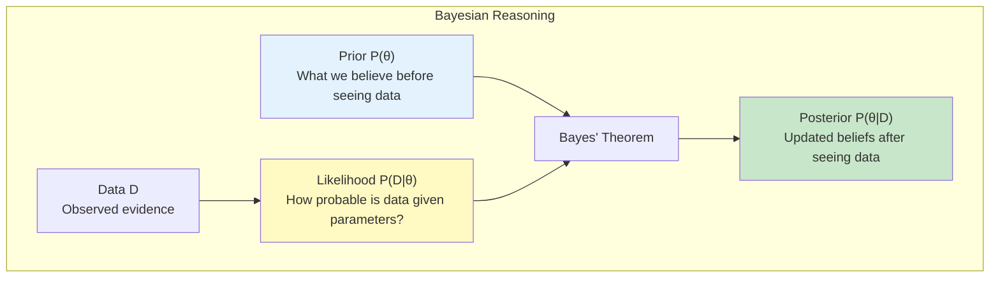
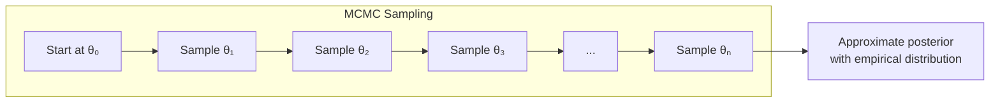
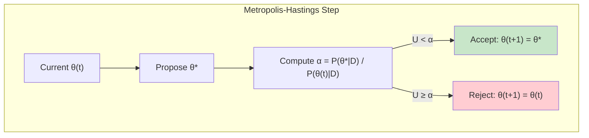
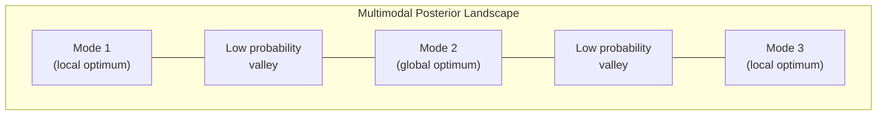
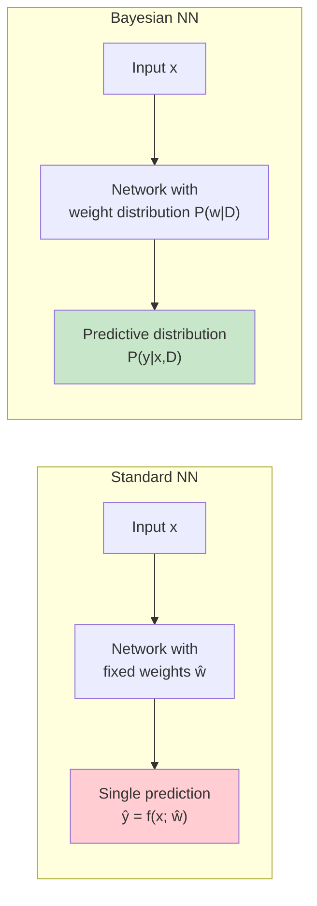
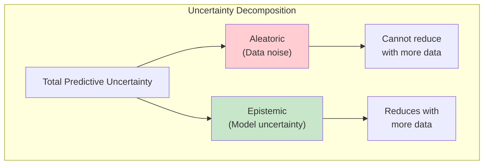
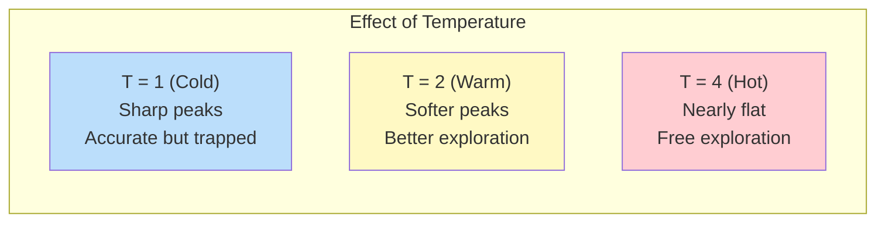
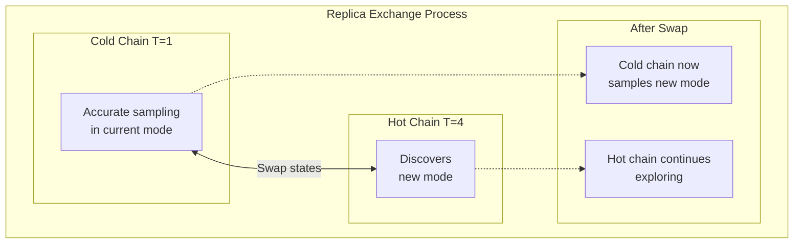
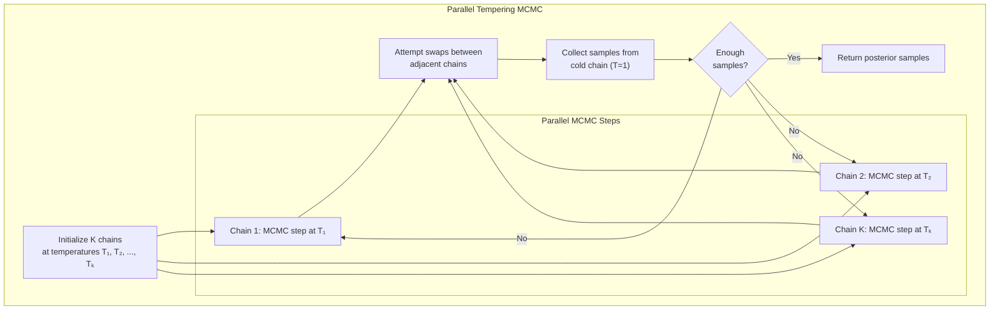
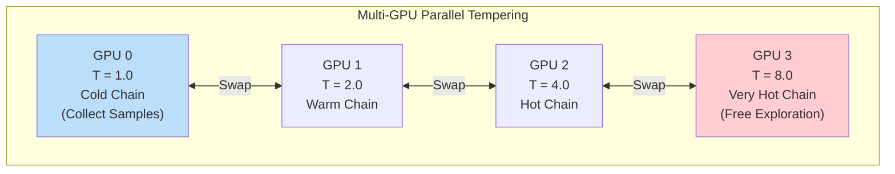

# Bayesian Neural Networks

Train Bayesian neural networks using parallel tempering MCMC for uncertainty estimation.

## Overview

This example demonstrates:
- Parallel tempering (replica exchange) MCMC
- Multi-GPU distributed Bayesian inference
- Temperature-based chain swaps
- Multimodal posterior exploration

**Task:** Bayesian inference for neural network weights

---

## The Bayesian Framework

### From Conditional Probability to Bayes' Theorem

The Bayesian framework emerges from a simple question: **How should we update our beliefs when we observe new evidence?**

Starting with the definition of conditional probability:

$$
P(A | B) = \frac{P(A \cap B)}{P(B)}
$$

We can write the joint probability two ways:

$$
P(A \cap B) = P(A | B) \cdot P(B) = P(B | A) \cdot P(A)
$$

Rearranging gives us **Bayes' Theorem**:

$$
P(A | B) = \frac{P(B | A) \cdot P(A)}{P(B)}
$$

### Bayes' Theorem for Inference

In the context of statistical inference, we replace $A$ with parameters $\theta$ and $B$ with observed data $\mathcal{D}$:

$$
\underbrace{P(\theta | \mathcal{D})}_{\text{Posterior}} = \frac{\overbrace{P(\mathcal{D} | \theta)}^{\text{Likelihood}} \cdot \overbrace{P(\theta)}^{\text{Prior}}}{\underbrace{P(\mathcal{D})}_{\text{Evidence}}}
$$

Or more compactly:

$$
\text{Posterior} \propto \text{Likelihood} \times \text{Prior}
$$

### Why Do Statisticians Use This Framework?

The Bayesian approach provides several fundamental advantages:



| Aspect | Frequentist | Bayesian |
|--------|-------------|----------|
| Parameters | Fixed but unknown | Random variables with distributions |
| Uncertainty | Confidence intervals (long-run frequency) | Credible intervals (probability statements) |
| Prior knowledge | Not formally incorporated | Explicitly encoded in prior |
| Results | Point estimates + p-values | Full posterior distribution |
| Interpretation | "If we repeated this experiment..." | "Given this data, the probability is..." |

### The Challenge: Computing the Posterior

The evidence (marginal likelihood) requires integrating over all possible parameter values:

$$
P(\mathcal{D}) = \int P(\mathcal{D} | \theta) \cdot P(\theta) \, d\theta
$$

For neural networks with millions of parameters, this integral is **intractable**. We cannot compute it analytically.

**This is why we need MCMC.**

---

## Markov Chain Monte Carlo (MCMC)

### The Core Idea

MCMC is a clever solution to an impossible problem: **instead of computing the posterior analytically, we generate samples from it.**



**Key Insight:** If we construct a Markov chain whose **stationary distribution** is the posterior $P(\theta | \mathcal{D})$, then after enough steps, the samples will be distributed according to the posterior.

### Why "Monte Carlo"?

Monte Carlo methods use random sampling to solve deterministic problems. Instead of computing:

$$
\mathbb{E}_{P(\theta|\mathcal{D})}[f(\theta)] = \int f(\theta) \cdot P(\theta | \mathcal{D}) \, d\theta
$$

We approximate with samples:

$$
\mathbb{E}_{P(\theta|\mathcal{D})}[f(\theta)] \approx \frac{1}{N} \sum_{i=1}^{N} f(\theta^{(i)}), \quad \theta^{(i)} \sim P(\theta | \mathcal{D})
$$

### Why "Markov Chain"?

A Markov chain has the property that the next state depends only on the current state:

$$
P(\theta^{(t+1)} | \theta^{(t)}, \theta^{(t-1)}, \ldots, \theta^{(0)}) = P(\theta^{(t+1)} | \theta^{(t)})
$$

This memoryless property makes the chain computationally tractable while still able to explore the full parameter space.

### The Metropolis-Hastings Algorithm

The most fundamental MCMC algorithm:

**Algorithm:**
1. Start at some initial $\theta^{(0)}$
2. For $t = 1, 2, \ldots, N$:
   - Propose: $\theta^* \sim Q(\theta^* | \theta^{(t-1)})$
   - Compute acceptance ratio:
   $$
   \alpha = \min\left(1, \frac{P(\theta^* | \mathcal{D}) \cdot Q(\theta^{(t-1)} | \theta^*)}{P(\theta^{(t-1)} | \mathcal{D}) \cdot Q(\theta^* | \theta^{(t-1)})}\right)
   $$
   - Accept with probability $\alpha$:
   $$
   \theta^{(t)} = \begin{cases} \theta^* & \text{with probability } \alpha \\ \theta^{(t-1)} & \text{with probability } 1 - \alpha \end{cases}
   $$

For symmetric proposals $Q(\theta^* | \theta) = Q(\theta | \theta^*)$, this simplifies to:

$$
\alpha = \min\left(1, \frac{P(\theta^* | \mathcal{D})}{P(\theta^{(t-1)} | \mathcal{D})}\right)
$$

**Key Property:** We only need the ratio of posteriors, so the intractable normalizing constant $P(\mathcal{D})$ cancels out!

$$
\frac{P(\theta^* | \mathcal{D})}{P(\theta^{(t-1)} | \mathcal{D})} = \frac{P(\mathcal{D} | \theta^*) \cdot P(\theta^*)}{P(\mathcal{D} | \theta^{(t-1)}) \cdot P(\theta^{(t-1)})}
$$

### Visualizing MCMC



---

## The Problem with Standard MCMC

### Multimodal Posteriors

Neural network posteriors are notoriously **multimodal** — they have many peaks separated by valleys of low probability:



**The Problem:** Standard MCMC chains get **trapped** in one mode. They cannot cross the low-probability valleys to discover other modes.

### Why Does This Matter?

If we only sample from one mode:
- Our uncertainty estimates are **overconfident**
- We miss important alternative parameter configurations
- Predictions may be **biased** toward one solution

---

## Bayesian Neural Networks: Purpose and Benefits

### What Makes Neural Networks "Bayesian"?

In standard neural networks, we find a **single point estimate** of the weights $\hat{\mathbf{w}}$ by minimizing a loss function.

In Bayesian neural networks, we treat weights as **random variables** and compute the **full posterior distribution** $P(\mathbf{w} | \mathcal{D})$.



### The Bayesian Predictive Distribution

Instead of a point prediction, we integrate over all possible weights:

$$
P(y | x, \mathcal{D}) = \int P(y | x, \mathbf{w}) \cdot P(\mathbf{w} | \mathcal{D}) \, d\mathbf{w}
$$

In practice, we approximate with MCMC samples:

$$
P(y | x, \mathcal{D}) \approx \frac{1}{N} \sum_{i=1}^{N} P(y | x, \mathbf{w}^{(i)}), \quad \mathbf{w}^{(i)} \sim P(\mathbf{w} | \mathcal{D})
$$

### Why Use Bayesian Neural Networks?

| Capability | How It Works |
|------------|--------------|
| **Uncertainty Quantification** | The spread of the predictive distribution tells us how confident the model is |
| **Robust Predictions** | Averaging over many weight configurations reduces overfitting |
| **Out-of-Distribution Detection** | High uncertainty on unfamiliar inputs |
| **Principled Regularization** | Priors act as regularizers (e.g., weight decay ≈ Gaussian prior) |
| **Model Comparison** | Marginal likelihood enables formal model selection |

### Types of Uncertainty

Bayesian NNs distinguish two types of uncertainty:

$$
\underbrace{\text{Var}[y|x,\mathcal{D}]}_{\text{Total Uncertainty}} = \underbrace{\mathbb{E}[\text{Var}[y|x,\mathbf{w}]]}_{\text{Aleatoric (data noise)}} + \underbrace{\text{Var}[\mathbb{E}[y|x,\mathbf{w}]]}_{\text{Epistemic (model uncertainty)}}
$$

- **Aleatoric uncertainty**: Inherent noise in the data (irreducible)
- **Epistemic uncertainty**: Uncertainty due to limited data (reducible with more data)



---

## Parallel Tempering: The Solution

### The Temperature Concept

Parallel tempering introduces a **temperature** parameter $T$ that modifies the posterior:

$$
P_T(\theta | \mathcal{D}) \propto P(\mathcal{D} | \theta)^{1/T} \cdot P(\theta)
$$

Or equivalently, in log space:

$$
\log P_T(\theta | \mathcal{D}) = \frac{1}{T} \log P(\mathcal{D} | \theta) + \log P(\theta) + \text{const}
$$

### What Temperature Does

| Temperature | Effect on Posterior | Behavior |
|-------------|---------------------|----------|
| $T = 1$ | Original posterior | Samples from true target |
| $T > 1$ | Flattened posterior | Easier to cross barriers |
| $T \to \infty$ | Approaches prior | Random walk exploration |



### Visualizing Temperature Effects

At temperature $T$, the posterior becomes:

$$
P_T(\theta) \propto P(\theta)^{1/T}
$$

For $T > 1$:
- Peaks become **shorter** (less concentrated)
- Valleys become **shallower** (easier to cross)
- The landscape becomes **smoother**

**Mathematical Intuition:** If the original posterior has a barrier with probability ratio $10^{-6}$, at $T=2$ this becomes $(10^{-6})^{1/2} = 10^{-3}$, making it 1000× easier to cross!

---

## The Replica Exchange Algorithm

### Why Exchange Replicas?

Running hot chains alone isn't useful — they don't sample from the correct distribution. The key insight is:

1. **Hot chains** explore freely and find new modes
2. **Cold chains** sample accurately from discovered modes
3. **Swaps** transfer discoveries from hot chains to cold chains



### The Swap Acceptance Criterion

For chains $i$ and $j$ at temperatures $T_i$ and $T_j$, the swap acceptance probability is:

$$
\alpha_{swap} = \min\left(1, \exp(\Delta)\right)
$$

Where:

$$
\Delta = \left(\frac{1}{T_i} - \frac{1}{T_j}\right) \cdot \left(\log P(\mathcal{D} | \theta_j) - \log P(\mathcal{D} | \theta_i)\right)
$$

**Why This Formula?**

To maintain detailed balance (ensuring the combined system has the correct stationary distribution), we need:

$$
P_i(\theta_i) P_j(\theta_j) \cdot \alpha(\theta_i \leftrightarrow \theta_j) = P_i(\theta_j) P_j(\theta_i) \cdot \alpha(\theta_j \leftrightarrow \theta_i)
$$

This leads to the Metropolis criterion for swaps:

$$
\alpha = \min\left(1, \frac{P_i(\theta_j) P_j(\theta_i)}{P_i(\theta_i) P_j(\theta_j)}\right)
$$

Substituting $P_T(\theta) \propto P(\mathcal{D}|\theta)^{1/T} P(\theta)$:

$$
\alpha = \min\left(1, \frac{P(\mathcal{D}|\theta_j)^{1/T_i} P(\mathcal{D}|\theta_i)^{1/T_j}}{P(\mathcal{D}|\theta_i)^{1/T_i} P(\mathcal{D}|\theta_j)^{1/T_j}}\right)
$$

Taking logs gives our formula for $\Delta$.

### When Are Swaps Accepted?

Consider chains at $T_i = 1$ (cold) and $T_j = 2$ (warm):

$$
\Delta = \left(1 - 0.5\right) \cdot \left(\log P_j - \log P_i\right) = 0.5 \cdot (\log P_j - \log P_i)
$$

- If the **hot chain** found a **better** state ($\log P_j > \log P_i$): $\Delta > 0$, swap likely accepted
- If the **cold chain** has a **better** state ($\log P_i > \log P_j$): $\Delta < 0$, swap less likely

**This is exactly what we want:** good discoveries propagate from hot to cold chains!

### The Temperature Ladder

Choosing temperatures is crucial. A geometric spacing works well:

$$
T_k = T_{min} \cdot \left(\frac{T_{max}}{T_{min}}\right)^{k/(K-1)}, \quad k = 0, 1, \ldots, K-1
$$

For $K = 4$ GPUs with $T_{min} = 1$ and $T_{max} = 8$:

| GPU | $k$ | Temperature |
|-----|-----|-------------|
| 0 | 0 | $1.0$ |
| 1 | 1 | $2.0$ |
| 2 | 2 | $4.0$ |
| 3 | 3 | $8.0$ |

**Why Geometric Spacing?**

The swap acceptance probability depends on $1/T_i - 1/T_j$. Geometric spacing ensures this difference is roughly constant between adjacent pairs, leading to uniform swap acceptance rates across the ladder.

---

## Complete Parallel Tempering Algorithm



### Algorithm Pseudocode

```
Algorithm: Parallel Tempering MCMC

Input: K temperatures T₁ < T₂ < ... < Tₖ, N iterations
Output: Samples from posterior P(θ|D)

1. Initialize chains θ₁, θ₂, ..., θₖ
2. For iteration t = 1 to N:

   # Parallel MCMC updates (one per GPU)
   3. For each chain k in parallel:
      - Propose θ* ~ Q(θ*|θₖ)
      - α = min(1, P(D|θ*)^(1/Tₖ) · P(θ*) / P(D|θₖ)^(1/Tₖ) · P(θₖ))
      - Accept θₖ ← θ* with probability α

   # Replica exchange (communication between GPUs)
   4. For k = 1 to K-1:
      - Compute Δ = (1/Tₖ - 1/Tₖ₊₁) · (log P(D|θₖ₊₁) - log P(D|θₖ))
      - If log(U) < Δ where U ~ Uniform(0,1):
        - Swap θₖ ↔ θₖ₊₁

   # Collect samples from cold chain
   5. If t > burn_in:
      - Store θ₁ as posterior sample

6. Return collected samples
```

---

## Quick Start

```bash
cd 04_bayesian_neuralnet

# SLURM submission (2 GPUs)
sbatch run_deepspeed.sh

# Direct execution
deepspeed --num_gpus=2 parallel_tempering_mcmc.py
```

## Model Architecture

```python
class BayesianMLP(nn.Module):
    def __init__(self, input_size=10, hidden_size=64, output_size=1):
        super().__init__()
        self.fc1 = nn.Linear(input_size, hidden_size)
        self.fc2 = nn.Linear(hidden_size, hidden_size)
        self.fc3 = nn.Linear(hidden_size, output_size)

    def forward(self, x):
        x = F.relu(self.fc1(x))
        x = F.relu(self.fc2(x))
        return self.fc3(x)
```

## Implementation Details

### 1. Temperature Assignment

Each GPU runs a chain at a different temperature:

```python
def get_temperature(rank, num_gpus, max_temp=4.0):
    """Assign temperature based on GPU rank."""
    if num_gpus == 1:
        return 1.0
    # Geometric spacing for uniform swap acceptance
    return max_temp ** (rank / (num_gpus - 1))

# Example with 4 GPUs:
# GPU 0: T=1.0 (cold - collect samples here)
# GPU 1: T=1.587
# GPU 2: T=2.52
# GPU 3: T=4.0 (hot - explore freely)
```

### 2. MCMC Sampling with Temperature

Each chain performs Metropolis-Hastings updates:

```python
def mcmc_step(model, data, temperature):
    """Single MCMC step with temperature scaling."""
    # Propose new parameters
    old_params = get_params(model)
    new_params = propose(old_params, step_size=0.01)

    # Compute tempered log posterior
    old_log_prob = log_likelihood(model, data) / temperature + log_prior(model)
    set_params(model, new_params)
    new_log_prob = log_likelihood(model, data) / temperature + log_prior(model)

    # Metropolis acceptance
    log_alpha = new_log_prob - old_log_prob
    if np.log(np.random.random()) < log_alpha:
        return True  # Accept
    else:
        set_params(model, old_params)
        return False  # Reject
```

### 3. Replica Exchange Between GPUs

```python
def attempt_swap(chain_i, chain_j, temp_i, temp_j):
    """Attempt swap between adjacent temperature chains."""
    # Compute log likelihoods (not tempered)
    log_lik_i = log_likelihood(chain_i, data)
    log_lik_j = log_likelihood(chain_j, data)

    # Swap acceptance criterion
    delta = (1/temp_i - 1/temp_j) * (log_lik_j - log_lik_i)

    if np.log(np.random.random()) < delta:
        # Swap parameters between chains
        params_i = get_params(chain_i)
        params_j = get_params(chain_j)
        set_params(chain_i, params_j)
        set_params(chain_j, params_i)
        return True
    return False
```

### 4. Log Posterior Computation

```python
def log_posterior(model, data, temperature=1.0):
    """Compute tempered log posterior."""
    x, y = data

    # Log likelihood (tempered)
    predictions = model(x)
    mse = F.mse_loss(predictions, y, reduction='sum')
    log_lik = -0.5 * mse / (noise_variance * temperature)

    # Log prior (not tempered - keeps regularization constant)
    log_prior = 0
    for param in model.parameters():
        log_prior -= 0.5 * prior_precision * (param ** 2).sum()

    return log_lik + log_prior
```

## DeepSpeed Configuration

```json
{
  "train_batch_size": 64,
  "train_micro_batch_size_per_gpu": 32,
  "gradient_accumulation_steps": 2,
  "optimizer": {
    "type": "Adam",
    "params": {
      "lr": 1e-4
    }
  },
  "fp16": {
    "enabled": false
  }
}
```

**Note:** FP16 is disabled for numerical stability in MCMC. The log probability computations require full precision.

## Running with SLURM

```bash
#!/bin/bash
#SBATCH --gres=gpu:2
#SBATCH --partition=gpu
#SBATCH --time=01:00:00
#SBATCH --job-name=bayesian_nn

source ~/myenv/bin/activate
deepspeed --num_gpus=2 parallel_tempering_mcmc.py
```

## Expected Output

```
Parallel Tempering MCMC with 2 GPUs

GPU 0: Temperature = 1.00 (cold chain)
GPU 1: Temperature = 4.00 (hot chain)

Iteration 100:
  Chain 0 acceptance: 0.32
  Chain 1 acceptance: 0.45
  Swap attempts: 10, accepted: 3

Iteration 1000:
  Collected 500 posterior samples from cold chain
  Mean prediction uncertainty: 0.15

Final Results:
  Posterior mean predictions: [...]
  95% credible intervals: [...]
```

---

## Why Multiple GPUs for Bayesian Inference?

The connection between parallel tempering and multi-GPU computing is natural:



| # GPUs | Temperature Range | Benefit |
|--------|-------------------|---------|
| 2 | T ∈ {1, 4} | Basic exploration |
| 4 | T ∈ {1, 2, 4, 8} | Better mode discovery |
| 8 | T ∈ {1, 1.5, 2, 3, 4, 6, 8, 12} | Fine-grained ladder, high swap rates |

**More GPUs = More Temperatures = Better Posterior Exploration**

---

## Summary: Key Equations

### Bayes' Theorem
$$
P(\theta | \mathcal{D}) = \frac{P(\mathcal{D} | \theta) \cdot P(\theta)}{P(\mathcal{D})}
$$

### Tempered Posterior
$$
P_T(\theta | \mathcal{D}) \propto P(\mathcal{D} | \theta)^{1/T} \cdot P(\theta)
$$

### Metropolis-Hastings Acceptance
$$
\alpha = \min\left(1, \frac{P(\theta^* | \mathcal{D})}{P(\theta^{(t)} | \mathcal{D})}\right)
$$

### Swap Acceptance
$$
\Delta = \left(\frac{1}{T_i} - \frac{1}{T_j}\right) \cdot \left(\log P(\mathcal{D} | \theta_j) - \log P(\mathcal{D} | \theta_i)\right)
$$

### Predictive Distribution
$$
P(y | x, \mathcal{D}) \approx \frac{1}{N} \sum_{i=1}^{N} P(y | x, \mathbf{w}^{(i)})
$$

---

## Use Cases

- **Uncertainty estimation**: Get confidence intervals on predictions
- **Model selection**: Compare models via marginal likelihood
- **Robust predictions**: Average over parameter uncertainty
- **Scientific inference**: Proper uncertainty propagation
- **Safety-critical applications**: Know when the model is uncertain

## Troubleshooting

### Low Acceptance Rate

- Reduce step size in proposals
- Increase temperature range
- Check log posterior computation

### Poor Mixing

- Add more temperatures (use more GPUs)
- Increase swap frequency
- Adjust temperature ladder spacing

### Low Swap Acceptance

- Use geometric temperature spacing
- Reduce temperature ratio between adjacent chains
- Ensure log likelihood computation is correct

## Next Steps

- [Stock Prediction](/docs/tutorials/intermediate/stock-prediction) - Real-world application
- [HuggingFace Overview](/docs/tutorials/huggingface/overview) - Large model training
