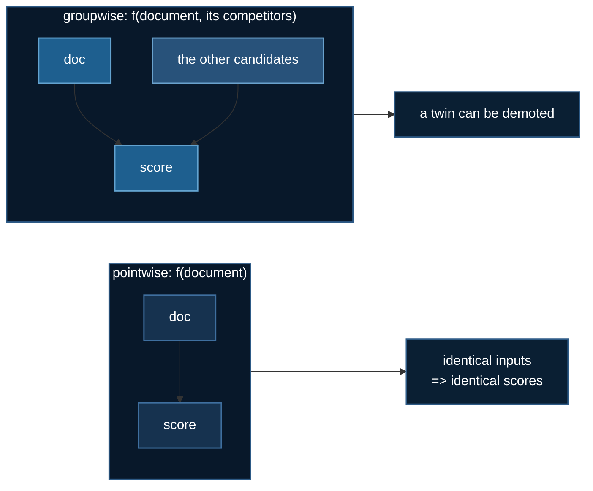

# Groupwise Ranking

The [previous page](./learning-to-rank.md) varied the **loss** and held the
scoring function fixed: one document in, one score out. This page does the
opposite. The loss is frozen at ListNet for every model, and what changes is
how much of the candidate list the scorer is allowed to see.

That single change is the difference between "how relevant is this document?"
and "how relevant is this document *given the other nine*?" — and the second
question is the one search engines actually face.

Code: [`02_intermediate/04_groupwise_ranking/`](https://github.com/yiqiao-yin/deepspeed-course/tree/main/02_intermediate/04_groupwise_ranking)

## 1. Why context matters at all

Consider ten candidate documents where two are near-duplicates of each other.
Both are relevant. Showing both wastes a slot — the second adds nothing the user
did not already get from the first.

A pointwise scorer **cannot express this**. It sees one document at a time, and
two documents with nearly identical features must receive nearly identical
scores. Not "does so by default" — *must*, as a matter of what kind of function
it is. No amount of training, data, or capacity changes that.



## 2. Two architectures

**GSF** (Ai et al., 2019) scores documents *jointly* in groups. The
implementation here enumerates every ordered pair, feeds each through a shared
network that emits two scores, and averages each document's scores over all
groups it appeared in:

$$
s_i = \frac{1}{2}\left(\frac{1}{n}\sum_{j} g_1(\mathbf{x}_i, \mathbf{x}_j)
      + \frac{1}{n}\sum_{j} g_2(\mathbf{x}_j, \mathbf{x}_i)\right)
$$

**SetRank** (arXiv:1912.05891) uses multi-head self-attention over the whole
candidate set, so every document attends to every other. Note what it
deliberately does **not** have: a positional encoding. A candidate set has no
meaningful order, and encoding one would be a bug — see below.

## 3. The two properties that decide correctness

A groupwise ranker fails in ways that leave the loss curve looking perfectly
healthy. Two measurements catch both failure modes, and the shipped code prints
them next to every NDCG.

### Context sensitivity

Does a document's score change when its **neighbours** change? Perturb the other
documents, hold this one fixed, measure the score movement.

For a pointwise model this must be **exactly 0.0** — not small, zero, because
the other documents are not arguments to the function. If a supposedly
groupwise model also measures ~0, it has collapsed into a pointwise scorer and
every claim you make about it is false.

### Permutation equivariance

Shuffle the candidate list. The scores must permute **identically**:

$$
f(\pi \cdot \mathbf{X}) = \pi \cdot f(\mathbf{X})
$$

If they do not, the model is reading candidate **order** — and at training time,
candidate order is very often label order. The model learns to read the answer
key, reports a superb NDCG, and collapses in production.

:::danger This is not hypothetical
The first GSF written for this folder formed its groups by *rotating* the list,
which depends on absolute position. It trained fine. It scored well. Its
permutation error was **1.5e-01**.

The property test is what caught it — a shape assertion would have passed, and
so would the loss curve. After rewriting it to enumerate all ordered pairs the
error is **9.5e-07**, which is float noise.

The test suite also builds a deliberately position-dependent model and asserts
the checker **rejects** it. A one-sided check that only ever sees correct models
would pass even if it returned zero unconditionally.
:::

## 4. A task where context is required, not merely useful

The first version of this example used a soft "redundancy" task where context
*helps*. The pointwise baseline won it. That is a genuine result and the folder
still ships the task — but a demonstration should be decisive before it is
realistic, so the default is harsher.

`--task duplicate` plants near-identical documents in each list and demotes the
worse twin to grade 0. Solving it requires noticing something about a *pair*,
which a function of one document cannot do.

Measured across 4,096 train / 1,024 test queries, 12 documents per list:

| task | pointwise | GSF | SetRank | untrained |
|---|---|---|---|---|
| `duplicate` — context **required** | 0.9369 | **0.9903** | 0.9834 | 0.5431 |
| `redundancy` — context merely helps | 0.9913 | **0.9970** | 0.9964 | 0.6260 |

Groupwise scoring buys **+0.053 NDCG** where context is required and **+0.006**
where it is only useful. Both rows are worth publishing. The second is the
honest caveat: on tasks where a document's value doesn't really depend on its
neighbours, an $O(L^2)$ scorer buys you almost nothing for a large constant
factor.

| model | parameters | context sensitivity | permutation error |
|---|---|---|---|
| pointwise | 5,313 | 0.000000 | 0.00e+00 |
| GSF | 6,402 | 0.737396 | 9.54e-07 |
| SetRank | 68,097 | 0.666664 | 2.19e-05 |

:::tip More context capacity is not free
SetRank has roughly 10× GSF's parameters and **loses to it**. At smaller data
scales it loses badly — and gets *worse* with more training, measured at 250,
800 and 2,400 steps across three learning rates (0.90 → 0.79). The attention
mechanism is strictly more expressive and strictly more able to overfit a few
thousand queries.
:::

## 5. Why this needs DeepSpeed

The same query-sharding constraint as the previous page, but sharper:

:::danger A group must not span devices
Split a candidate list across two ranks and each document is scored against a
**subset** of its real competitors. The duplicate-detection the whole
architecture exists for simply stops working when the twin lands on the other
GPU — silently, with no error, and with a loss that still decreases.
:::

The memory that matters here is the $O(L^2)$ **activation**, not the parameter
count: GSF enumerates every ordered pair and SetRank attends over the whole set,
so doubling `--list-len` quadruples memory while doubling the hidden size barely
registers. This is why the config uses ZeRO stage 0 — sharding optimizer state
for a 68k-parameter model adds communication to save kilobytes, and does not
touch the tensor that actually dominates.

## 6. Running it

```bash
cd 02_intermediate/04_groupwise_ranking
uv sync

# no GPU — the models and both property checks are pure tensor code
uv run groupwise.py
uv run ../../tests/test_groupwise_ranking.py
ALLOW_CPU=1 uv run train_groupwise_ranking.py --model all

# CoreWeave
sbatch run_deepspeed.sh --model all

# RunPod, with automatic shutdown
uv run runpod/runpod_ctl.py run 02_intermediate/04_groupwise_ranking \
    --dry-run --collect --wait --terminate --yes
uv run runpod/runpod_ctl.py pods        # confirm nothing is still billing
```

The training script prints `context` and `perm_err` beside every NDCG, and
warns you explicitly when the permutation error exceeds 1e-4 that the score
should be treated as unproven rather than as a result.

## References

- Ai et al., *Learning Groupwise Multivariate Scoring Functions Using Deep Neural Networks* (GSF), ICTIR 2019
- Pang et al., *SetRank: Learning a Permutation-Invariant Ranking Model for Information Retrieval*, [arXiv:1912.05891](https://arxiv.org/abs/1912.05891)
- Pang et al., *DeepRank: A New Deep Architecture for Relevance Ranking in Information Retrieval*, CIKM 2017
