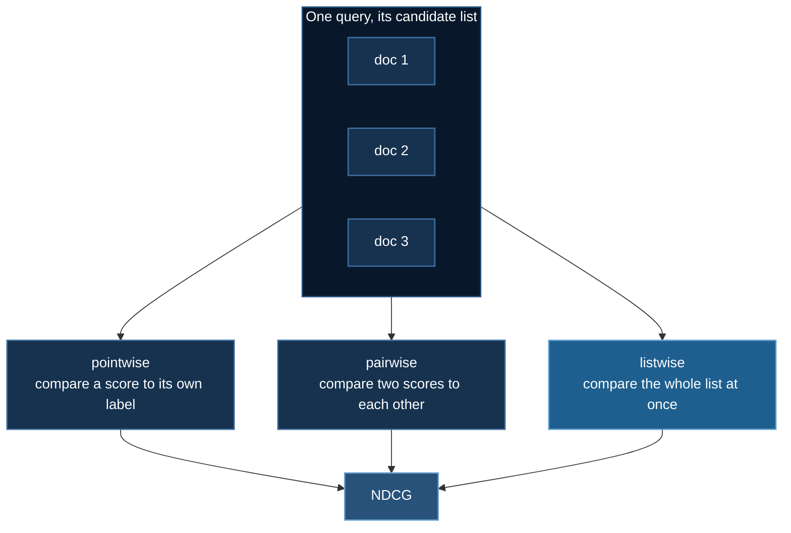

# Learning to Rank

Ranking looks like regression and is not. A search engine, a recommender, and a
retrieval-augmented pipeline all share one property that breaks the usual
supervised setup: **you are never scored on a single prediction**. You are
scored on an *ordering*, over a *list*, for one query at a time — and the metric
that grades you cares far more about position 1 than position 50.

This page walks through the four classical objectives, then the two things that
actually go wrong when you train them at scale.

Code: [`02_intermediate/03_learning_to_rank/`](https://github.com/yiqiao-yin/deepspeed-course/tree/main/02_intermediate/03_learning_to_rank)

## 1. The metric comes first

Unusually, the loss functions here are best understood *after* the metric,
because one of them is literally defined by it.

Given a query with candidate documents and graded relevance labels
$\ell_i \in \{0,1,2,3,4\}$, sort the documents by model score and read off
**Discounted Cumulative Gain**:

$$
\mathrm{DCG@k} = \sum_{i=1}^{k} \frac{2^{\ell_i} - 1}{\log_2(i + 1)}
$$

Two design choices carry all the meaning:

- The gain $2^{\ell} - 1$ is **exponential**. A single grade-4 document is worth
  15, while a grade-2 is worth 3. Perfect results are not merely a bit better
  than mediocre ones — they dominate.
- The discount $1/\log_2(i+1)$ is **positional**. Moving a document from rank 1
  to rank 2 costs far more than moving it from rank 20 to 21.

Divide by the best achievable DCG for that query and you get **NDCG**, in
$[0,1]$, comparable across queries with different numbers of relevant
documents.

:::warning A query with nothing relevant
Its ideal DCG is zero, so the normalisation is $0/0$. Return **0.0**, not 1.0
and not NaN. Returning 1.0 makes the model look perfect on exactly the queries
it cannot answer — and it will still train, and the number will still look
plausible.
:::

## 2. Four objectives

All four share one scoring network $f(\mathbf{x}) \to \mathbb{R}$, applied to
each document independently. They differ only in what they compare.



### Pointwise

Plain regression onto the grade:
$\mathcal{L} = \frac{1}{n}\sum_i (f(\mathbf{x}_i) - \ell_i)^2$.

It optimises something nobody measures. A model that predicts every grade
0.5 too high is *perfectly ranked* and heavily penalised; a model that gets the
top two documents backwards may have a lower loss. Ranking is invariant to
monotone transformations of the score and this objective is not.

### RankNet

Take every pair $(i,j)$ where $\ell_i > \ell_j$ and ask the model to put $i$
first, as binary cross-entropy on the score difference:

$$
\mathcal{L} = \sum_{\ell_i > \ell_j} \log\!\left(1 + e^{-\sigma (s_i - s_j)}\right)
$$

Now the objective is scale- and shift-invariant, like the metric. But **every
pair counts the same** — getting positions 1 and 2 backwards costs exactly what
getting 99 and 100 backwards costs, which is not how anyone reads results.

### LambdaRank

The fix is one multiplication. Weight each pair by how much swapping those two
documents would change NDCG:

$$
\mathcal{L} = \sum_{\ell_i > \ell_j} \left|\Delta \mathrm{NDCG}_{ij}\right| \cdot
\log\!\left(1 + e^{-\sigma (s_i - s_j)}\right)
$$

This is the whole idea, and it is worth seeing the size of the effect. For two
pairs spanning the *identical* label gap (grade 4 over grade 3), one near the
top of the list and one near the bottom:

```
|ΔNDCG| swap at positions 1<->2 : 0.0909
|ΔNDCG| swap at positions 5<->6 : 0.0075
-> the top swap costs 12.0x more
```

RankNet weights those equally. That is the entire difference between the two
algorithms.

:::danger LambdaRank silently degenerates in fp16
Those weights run to $10^{-4}$ and smaller for deep swaps. In fp16 they flush
toward zero, every surviving pair ends up weighted roughly the same, and
LambdaRank quietly becomes RankNet — a real algorithm, so nothing crashes and
no curve looks wrong. The shipped `ds_config.json` disables fp16 **and says
why**. This is the clearest case in the course of a precision setting that
changes an *objective* rather than a number.
:::

### ListNet

Drop pairs entirely. Turn scores and labels each into a distribution over the
list with a softmax, and minimise cross-entropy between them:

$$
\mathcal{L} = -\sum_i \frac{e^{\ell_i}}{\sum_j e^{\ell_j}} \log \frac{e^{s_i}}{\sum_j e^{s_j}}
$$

One term per document instead of $O(L^2)$ per query, and the normalisation is
over exactly the unit the metric is computed on.

## 3. What the comparison actually shows

The literature's ordering — listwise beats pairwise beats pointwise — is real,
but on clean data it is **a function of training budget**, and a single number
quoted without the budget is not meaningful. Measured with
`--method all --epochs N` on 4,096 synthetic queries:

| epochs | pointwise | ranknet | lambdarank | listnet | spread |
|---|---|---|---|---|---|
| 1 | 0.9198 | 0.9594 | 0.9401 | **0.9611** | **0.0413** |
| 2 | 0.9593 | 0.9678 | 0.9649 | 0.9661 | 0.0085 |
| 6 | 0.9637 | 0.9689 | 0.9680 | 0.9682 | 0.0052 |
| 40 | 0.9677 | 0.9686 | 0.9683 | 0.9676 | 0.0010 |

Untrained baseline: **0.4862** throughout.

At one epoch ListNet leads pointwise by 0.041 and the textbook ordering holds
exactly. By epoch 40 the spread is 0.0010 and pointwise is *second*. Training at
all is worth 0.48 NDCG; the choice of objective is worth 0.001 at convergence.

The lesson is not that the objectives don't matter — it is that on a clean,
linear, tie-free task there is not enough structure for them to disagree about.
Published listwise gains come from real corpora with heavy ties, position bias,
and lists of hundreds. `--source hf` points the same code at a real reranking
corpus.

## 4. Why this needs DeepSpeed

Not for memory — the model is about 4,000 parameters. The reason is a
constraint that no earlier example in this course has:

:::danger Shard queries, never documents
A pairwise loss compares documents **within** one query. A listwise softmax
normalises **over** one query. Split a candidate list across two ranks and both
become a different computation: rank 0 forms pairs among its half, rank 1 among
its half, and the pairs that span the boundary — often the interesting ones —
are never formed at all.

There is no error. No warning. The loss still decreases. You have simply
trained on a different objective than the one you wrote down.
:::

So the training loop shards by query:

```python
if world_size > 1:
    xs, ys = x_tr[rank::world_size], y_tr[rank::world_size]
```

The memory knob is `--list-len`, not the parameter count: the pairwise losses
are $O(L^2)$ in the number of documents per query.

## 5. Running it

```bash
cd 02_intermediate/03_learning_to_rank
uv sync

# no GPU at all — the objectives and metrics are pure tensor code
uv run ranking_losses.py
uv run ../../tests/test_ranking_losses.py
ALLOW_CPU=1 uv run train_learning_to_rank.py --method all

# CoreWeave
sbatch run_deepspeed.sh --method all

# RunPod, with automatic shutdown
uv run runpod/runpod_ctl.py run 02_intermediate/03_learning_to_rank \
    --dry-run --collect --wait --terminate --yes
uv run runpod/runpod_ctl.py pods        # confirm nothing is still billing
```

## Where next

[Groupwise Ranking](./groupwise-ranking.md) holds the objective fixed and
changes the **architecture** instead, so that documents are scored in the
context of their competitors rather than one at a time.

## References

- Burges et al., *Learning to Rank using Gradient Descent* (RankNet), ICML 2005
- Burges et al., *Learning to Rank with Nonsmooth Cost Functions* (LambdaRank), NIPS 2006
- Cao et al., *Learning to Rank: From Pairwise Approach to Listwise Approach* (ListNet), ICML 2007
- Burges, *From RankNet to LambdaRank to LambdaMART: An Overview*, MSR-TR-2010-82
