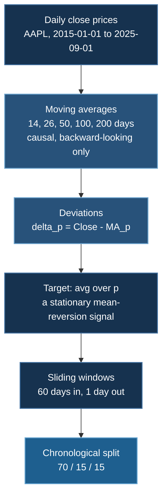
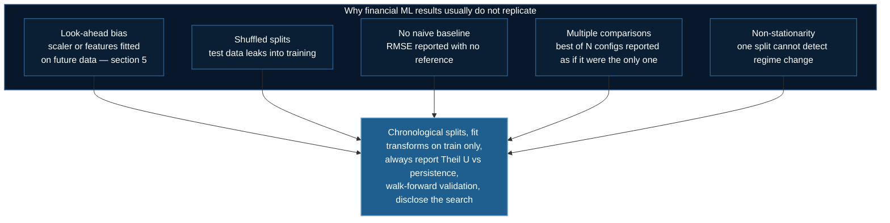

# Stock Price Prediction

A recurrent network on real market data — and a case study in the methodological traps that make financial machine learning uniquely easy to get wrong. The modelling is straightforward; **evaluating it honestly is the hard part**, and this page spends most of its length there.

:::danger Not investment advice
This is a pedagogical example for distributed training. Nothing here is a trading strategy, and the evaluation section explains at length why results that look good on this task usually are not. Do not trade on it.
:::

## 1. What Is Actually Being Predicted

An important detail that the framing "stock price prediction" obscures: the model does **not** predict price. It predicts a **mean-reversion signal**.

For each moving-average period $p \in \{14, 26, 50, 100, 200\}$ trading days, define the deviation of price from its own moving average:

$$
\delta_p(t) = P(t) - \mathrm{MA}_p(t), \qquad \mathrm{MA}_p(t) = \frac{1}{p}\sum_{i=0}^{p-1}P(t-i)
$$

and average across horizons:

$$
\bar\delta(t) = \frac{1}{|\mathcal{P}|}\sum_{p\in\mathcal{P}}\delta_p(t)
$$

The model observes $\bar\delta(t-59), \dots, \bar\delta(t)$ — 60 trading days — and predicts $\bar\delta(t+1)$.

**This choice is defensible and worth understanding.** Raw price is close to a random walk with a strong unit root: the best predictor of tomorrow's price is today's price, and a model trained on levels learns exactly that while appearing accurate. By contrast $\bar\delta$ is a *detrended* quantity, roughly stationary and genuinely mean-reverting — prices do tend to return toward their moving averages. Modelling a stationary transformation instead of a non-stationary level is the right instinct.

:::warning But it also builds in strong autocorrelation
$\mathrm{MA}_{200}$ changes by at most $\left(P(t) - P(t-200)\right)/200$ per day. Consecutive targets $\bar\delta(t)$ and $\bar\delta(t+1)$ are therefore **highly correlated by construction**, independent of any real predictability.

The consequence: a model that simply outputs its most recent input, $\hat{\bar\delta}(t+1) = \bar\delta(t)$, will score extremely well on RMSE. Low error on this task is largely evidence that the target is smooth, not that the model learned market dynamics. §5 makes this concrete.
:::



## 2. Quick Start

```bash
cd 04_intermediate_rnn_stock_data

# SLURM (CoreWeave / HPC)
sbatch run_deepspeed.sh

# Direct execution
deepspeed --num_gpus=2 train_rnn_stock_data_ds.py

# Single-machine version, no DeepSpeed
python train_rnn_stock_data.py
```

Data is fetched at runtime via `yfinance`, so the machine needs network access — a common failure on air-gapped HPC compute nodes. If `yfinance` cannot reach Yahoo, download the data on a login node and cache it to disk first.

## 3. Configuration as Implemented

Taken from `train_rnn_stock_data_ds.py`:

| Parameter | Value |
|---|---|
| Ticker | `AAPL` |
| Date range | 2015-01-01 → 2025-09-01 |
| MA periods | 14, 26, 50, 100, 200 |
| Sequence length | **60** trading days |
| Hidden size | **50** |
| Layers | 2 |
| Cell type | `nn.RNN` with `nonlinearity='relu'` |
| Input size | 1 (univariate — $\bar\delta$ only) |
| Epochs | 50 |
| Loss | `nn.MSELoss` |
| Split | 70 / 15 / 15, **chronological** |
| Seed | 42 |

Two things done right that are worth calling out, because they are commonly done wrong.

**The split is chronological, not shuffled.** `X[:train], X[train:train+val], X[train+val:]` with no shuffling. Random-splitting a time series is catastrophic: it places examples from *after* the test period into training, and the model interpolates rather than forecasts. Reported accuracy becomes fiction. Chronological splitting is the only defensible choice, and this code gets it right.

**The moving averages are causal.** `rolling(window=p).mean()` looks strictly backward. A centred rolling mean would embed future prices in each feature — a subtle and devastating leak.

## 4. The Model

```python
class SimpleRNN(nn.Module):
    def __init__(self, input_size, hidden_size, num_layers, output_size):
        super().__init__()
        self.rnn = nn.RNN(
            input_size=input_size,
            hidden_size=hidden_size,
            num_layers=num_layers,
            batch_first=True,
            nonlinearity="relu",
        )
        self.fc = nn.Linear(hidden_size, output_size)

    def forward(self, x):
        h0 = torch.zeros(self.num_layers, x.size(0), self.hidden_size,
                         device=x.device, dtype=x.dtype)
        out, _ = self.rnn(x, h0)
        return self.fc(out[:, -1, :])       # last timestep only
```

This is a **vanilla RNN, not an LSTM** — and with a ReLU nonlinearity, which is an aggressive choice. Recall from [the RNN gradient analysis](/docs/tutorials/basic/rnn#mathematical-analysis) that stability is governed by $\left(\gamma\,\sigma_{\max}\right)^{T}$. For $\tanh$, $\gamma = 1$ and activations are bounded to $(-1,1)$. **ReLU is unbounded**, so both activations and gradients can grow without limit over 60 timesteps.

Two design choices make it viable:

### Orthogonal recurrent initialization

```python
if 'weight_ih' in name:
    nn.init.xavier_uniform_(param.data)      # input-to-hidden
elif 'weight_hh' in name:
    nn.init.orthogonal_(param.data)          # hidden-to-hidden
```

An orthogonal matrix has **every singular value equal to 1**. That places $\sigma_{\max}(\mathbf{W}_{hh}) = 1$ exactly — the knife-edge where gradients neither vanish nor explode — and, because orthogonal matrices are normal, $\|\mathbf{W}_{hh}^n\| = 1$ for all $n$, so there is no transient-amplification loophole either. It is the single most important line in this model, and it is the standard companion to ReLU recurrence (Le et al., 2015).

This holds only at initialization; training moves $\mathbf{W}_{hh}$ off the orthogonal manifold. Hence:

### Gradient clipping

```json
{ "gradient_clipping": 1.0 }
```

Non-negotiable for a ReLU RNN. Orthogonal init sets a good starting point; clipping bounds the damage thereafter.

**Only the last timestep is used.** `out[:, -1, :]` discards the other 59 hidden states — a many-to-one architecture. The intermediate states still matter, because the last one is a function of all of them, but no loss is applied to them.

## 5. Look-Ahead Bias: Why the Scaler Must Be Fit After the Split

The most important thing on this page.

:::tip Fixed in the repository
This example **used to** contain the bug described below. It has been corrected —
the code now splits first and fits the scaler on the training slice only, and
`tests/test_stock_leakage.py` guards against a regression. The section is kept
because the mistake is subtle, extremely common in financial ML, and worth being
able to recognize in other people's code.

```bash
uv run tests/test_stock_leakage.py
```
:::

The original implementation was:

```python
# BEFORE — leaks the future:
scaler = MinMaxScaler(feature_range=(0, 1))
avg_delta_scaled = scaler.fit_transform(analysis_df['avg_delta'].values.reshape(-1, 1))

X, y = create_sequences(avg_delta_scaled, sequence_length)

train_size = int(len(X) * 0.7)          # <-- split happens AFTER scaling
```

`MinMaxScaler.fit` computes

$$
x_{\text{scaled}} = \frac{x - \min(\mathbf{x})}{\max(\mathbf{x}) - \min(\mathbf{x})}
$$

over **the entire series, including the test period.** The transform applied to training data therefore depends on the maximum and minimum of data from the future. That is **look-ahead bias** — a form of data leakage.

Why it matters concretely: if AAPL's largest deviation from its moving averages over the whole decade occurs in 2024 (test period), then every training example from 2016 has been normalized using a constant that could not have been known in 2016. The model implicitly learns the scale of future volatility. Reported test error is optimistically biased, and the gap can be large precisely when it matters most — around regime changes and volatility spikes.

**The fix, now in the repository** — fit on training data only, then apply that fitted transform to validation and test:

```python
# Split the raw series FIRST
n = len(avg_delta)
train_end = int(n * 0.7)
val_end   = int(n * 0.85)

scaler = MinMaxScaler(feature_range=(0, 1))
train_scaled = scaler.fit_transform(avg_delta[:train_end].reshape(-1, 1))   # fit here only
val_scaled   = scaler.transform(avg_delta[train_end:val_end].reshape(-1, 1))  # transform only
test_scaled  = scaler.transform(avg_delta[val_end:].reshape(-1, 1))           # transform only

# Then build sequences within each split independently
X_train, y_train = create_sequences(train_scaled, sequence_length)
X_val,   y_val   = create_sequences(val_scaled,   sequence_length)
X_test,  y_test  = create_sequences(test_scaled,  sequence_length)
```

:::note Two further consequences of fixing it properly
**Test values will fall outside $[0,1]$.** If the test period exceeds the training range, scaled values exceed 1. That is correct and expected — it is the honest representation of encountering conditions not seen in training. `MinMaxScaler` is in fact a poor choice here for exactly this reason; `StandardScaler`, or scaling by training-set volatility, degrades more gracefully. Being surprised by out-of-range test values *is the point*.

**Sequences must not straddle a split boundary.** Building sequences before splitting means the first ~60 test windows contain training-period observations. Constructing sequences within each split, as above, avoids it at the cost of losing `sequence_length` samples per boundary.
:::

### The baseline, now reported

:::tip Also fixed
The script previously reported a bare RMSE with nothing to compare it against.
It now also reports the persistence baseline, Theil U, and directional accuracy.
:::

The script reports test RMSE after inverting the scaling:

```python
test_predict_inv = scaler.inverse_transform(test_predict)
test_actual_inv  = scaler.inverse_transform(test_actual)
test_rmse = np.sqrt(mean_squared_error(test_actual_inv, test_predict_inv))
```

Inverting to original units before computing the metric is correct — RMSE in scaled units is uninterpretable.

But **an RMSE with nothing to compare it to carries no information.** For any time-series forecast the mandatory reference is the naive persistence predictor:

$$
\hat y_{\text{naive}}(t+1) = y(t)
$$

Given §1's observation that $\bar\delta$ is smooth by construction, persistence will be *hard to beat*. Always report the ratio — the Theil U statistic:

$$
U = \frac{\mathrm{RMSE}_{\text{model}}}{\mathrm{RMSE}_{\text{naive}}}
$$

$U < 1$ means the model adds value; $U \ge 1$ means a one-line baseline does as well as your distributed RNN. **A large fraction of published financial deep-learning results fail this test when it is applied.**

```python
naive_pred = test_actual_inv[:-1]          # predict tomorrow = today
naive_true = test_actual_inv[1:]
rmse_naive = np.sqrt(mean_squared_error(naive_true, naive_pred))
print(f"Model RMSE: {test_rmse:.4f}")
print(f"Naive RMSE: {rmse_naive:.4f}")
print(f"Theil U:    {test_rmse / rmse_naive:.4f}   (<1 means the model helps)")
```

:::tip For a trading signal, RMSE is the wrong metric anyway
Profit depends on **direction**, not magnitude. A model with excellent RMSE that systematically gets the sign wrong at turning points loses money. Report directional accuracy alongside RMSE:

$$\text{DA} = \frac{1}{n}\sum_{t}\mathbb{1}\left[\operatorname{sign}\left(\hat y_{t+1} - y_t\right) = \operatorname{sign}\left(y_{t+1} - y_t\right)\right]$$

and compare against 50%. Note that a persistence-like model has *undefined* direction, which is another way of seeing that low RMSE and useful signal are different things.
:::

## 6. DeepSpeed Configuration

From `train_rnn_stock_data_config.json`:

```json
{
  "train_batch_size": 64,
  "train_micro_batch_size_per_gpu": 32,
  "gradient_accumulation_steps": 1,
  "optimizer": {
    "type": "Adam",
    "params": {
      "lr": 0.001,
      "betas": [0.9, 0.999],
      "eps": 1e-8,
      "weight_decay": 1e-5
    }
  },
  "scheduler": {
    "type": "WarmupLR",
    "params": {
      "warmup_min_lr": 0,
      "warmup_max_lr": 0.001,
      "warmup_num_steps": 100
    }
  },
  "gradient_clipping": 1.0,
  "fp16": { "enabled": true, "loss_scale": 0, "loss_scale_window": 1000, "hysteresis": 2, "min_loss_scale": 1 },
  "zero_optimization": {
    "stage": 2,
    "allgather_partitions": true,
    "allgather_bucket_size": 2e8,
    "overlap_comm": true,
    "reduce_scatter": true,
    "reduce_bucket_size": 2e8,
    "contiguous_gradients": true
  }
}
```

The batch invariant resolves as $64 = 32 \times 1 \times 2$ — **this config assumes exactly 2 GPUs**, matching `run_deepspeed.sh`. Change `--num_gpus` and it aborts.

| Setting | Note |
|---|---|
| `loss_scale: 0` | Enables **dynamic** loss scaling — a fixed scale would be `> 0`. Correct for FP16 |
| `hysteresis: 2` | Consecutive overflows tolerated before the scale is reduced |
| `WarmupLR`, 100 steps | Adam's second-moment estimate is unreliable early; see [bias correction](/docs/tutorials/basic/neural-network#52-momentum-and-adam) |
| `weight_decay: 1e-5` | Mild; the model is small |
| ZeRO Stage 2 | Essentially free relative to DDP — though see the caveat below |

:::note Be honest about what DeepSpeed buys here
This model is roughly $2\times 50 \times (50 + 1 + 1) \approx 5{,}200$ parameters in the RNN plus 51 in the head. Model states are $16\Psi \approx 84$ KB. **ZeRO Stage 2 partitions nothing worth partitioning, and CPU offload would be pure overhead.**

The example is configured this way to demonstrate the mechanics on a realistic data pipeline, not because it needs the memory. At this scale, communication overhead means two GPUs are probably *slower* than one. Per [ZeRO Stages](/docs/getting-started/deepspeed-zero-stages), Stage 2 costs nothing extra in bandwidth, so it is a harmless default — but do not infer that it is helping.

Where distributed training genuinely helps a workload like this is **many models rather than a big one**: sweeping tickers, sequence lengths, or seeds in parallel. That is embarrassingly parallel and does not need ZeRO at all.
:::

## 7. Why This Task Is Hard

Beyond the mechanics, financial forecasting has structural properties that defeat the standard ML playbook.

**Low signal-to-noise.** Daily returns are dominated by noise. A model explaining 1–2% of variance can be economically valuable — but $R^2 = 0.02$ looks like failure by the standards of any other domain, so the usual "keep tuning until the metric looks good" loop pushes you directly into overfitting.

**Non-stationarity.** The data-generating process changes. A model fitted on 2015–2021 is fitted partly on a zero-rate regime that no longer exists. This violates the i.i.d. assumption behind essentially all generalization theory, and it is why a single train/test split is weak evidence — **walk-forward validation** (repeatedly retrain on an expanding window, test on the next block) is the appropriate protocol.

**Reflexivity.** If a predictive pattern is discovered and traded, the trading removes it. Unlike image classification, where cats do not adapt, the target here responds to being modelled.

**Multiple-comparisons bias.** Trying 100 architectures and reporting the best gives a result that is, with high probability, noise. Bailey et al. (2014) formalize this as the "deflated Sharpe ratio": a backtest's apparent quality must be discounted by the number of configurations tried. Since the count is rarely reported, most published backtests cannot be assessed.



## 8. Improving the Model

Ordered by expected value, not by novelty.

| Change | Why |
|---|---|
| ~~Fix the scaler leak (§5)~~ | **Done** — split-then-fit, with a regression test |
| ~~Add the persistence baseline and Theil U~~ | **Done** — reported alongside RMSE |
| **Walk-forward validation** | One chronological split cannot distinguish skill from a favourable regime |
| Multivariate input | `input_size=1` uses only $\bar\delta$. Volume, realized volatility, and the individual $\delta_p$ are already computed and discarded |
| Swap `nn.RNN` → `nn.LSTM`/`nn.GRU` | Gating handles 60-step dependencies far better; see [LSTM](/docs/tutorials/basic/rnn#long-short-term-memory-lstm) |
| Predict a distribution, not a point | Quantile regression or a Gaussian head gives calibrated intervals — far more useful than a point estimate under this much noise. See [Bayesian NNs](/docs/tutorials/intermediate/bayesian-nn) |
| Multiple tickers | ~2,400 usable samples from one stock is very little data. Cross-sectional training regularizes strongly |
| Huber loss instead of MSE | Financial data is heavy-tailed; MSE's quadratic outlier sensitivity lets a few crash days dominate. See [loss choice](/docs/tutorials/basic/neural-network#32-robust-regression-alternatives) |

## 9. Troubleshooting

**`yfinance` fails on a compute node.** Compute nodes are usually air-gapped. Download on a login node, cache to disk (`analysis_df.to_parquet(...)`), and load from disk in the job.

**Loss goes `NaN`.** ReLU RNN over 60 steps. Confirm `gradient_clipping: 1.0` is active and that orthogonal init is applied to `weight_hh`; try `nonlinearity='tanh'`, or switch to `nn.LSTM`. Alternatively use BF16, which removes the FP16 overflow path.

**Batch-size assertion at startup.** The config is fixed at 2 GPUs ($64 = 32\times1\times2$).

**Test RMSE much worse than validation.** Expected under non-stationarity — the test block is the most recent and most distributionally distant period. Evidence for walk-forward validation, not necessarily a bug.

**Suspiciously excellent results.** Check §5 first. Near-perfect fit on financial data is almost always leakage.

## Next Steps

- [Basic RNN](/docs/tutorials/basic/rnn) — the recurrence, gradient dynamics, and LSTM gating behind this model
- [Bayesian Neural Networks](/docs/tutorials/intermediate/bayesian-nn) — predictive uncertainty, which this task badly needs
- [DeepSpeed ZeRO Stages](/docs/getting-started/deepspeed-zero-stages) — when partitioning actually pays

## References

**Time series and forecasting**

1. Hyndman, R. J., & Athanasopoulos, G. (2021). *Forecasting: Principles and Practice* (3rd ed.). OTexts. [Free online](https://otexts.com/fpp3/) — baselines, evaluation, and why persistence is the reference.
2. Box, G. E. P., Jenkins, G. M., Reinsel, G. C., & Ljung, G. M. (2015). *Time Series Analysis: Forecasting and Control* (5th ed.). Wiley.
3. Makridakis, S., Spiliotis, E., & Assimakopoulos, V. (2018). Statistical and Machine Learning forecasting methods: Concerns and ways forward. *PLOS ONE*, 13(3). — ML methods repeatedly losing to simple statistical baselines in the M4 competition.
4. Theil, H. (1966). *Applied Economic Forecasting*. North-Holland. — the U statistic.

**Financial machine learning methodology**

5. López de Prado, M. (2018). *Advances in Financial Machine Learning*. Wiley. — the standard reference on leakage, purged cross-validation, and backtest overfitting.
6. Bailey, D. H., Borwein, J., López de Prado, M., & Zhu, Q. J. (2014). Pseudo-Mathematics and Financial Charlatanism: The Effects of Backtest Overfitting on Out-of-Sample Performance. *Notices of the AMS*, 61(5), 458–471.
7. Fama, E. F. (1970). Efficient Capital Markets: A Review of Theory and Empirical Work. *Journal of Finance*, 25(2), 383–417.
8. Kaufman, S., Rosset, S., Perlich, C., & Stitelman, O. (2012). Leakage in Data Mining: Formulation, Detection, and Avoidance. *ACM TKDD*, 6(4). — the general treatment of the §5 bug.

**Recurrent models**

9. Le, Q. V., Jaitly, N., & Hinton, G. E. (2015). A Simple Way to Initialize Recurrent Networks of Rectified Linear Units. [arXiv:1504.00941](https://arxiv.org/abs/1504.00941) — ReLU RNNs and orthogonal/identity initialization.
10. Saxe, A. M., McClelland, J. L., & Ganguli, S. (2014). Exact solutions to the nonlinear dynamics of learning in deep linear networks. *ICLR 2014*. [arXiv:1312.6120](https://arxiv.org/abs/1312.6120) — why orthogonal initialization works.
11. Pascanu, R., Mikolov, T., & Bengio, Y. (2013). On the difficulty of training Recurrent Neural Networks. *ICML 2013*. [arXiv:1211.5063](https://arxiv.org/abs/1211.5063)
12. Salinas, D., Flunkert, V., Gasthaus, J., & Januschowski, T. (2020). DeepAR: Probabilistic forecasting with autoregressive recurrent networks. *International Journal of Forecasting*, 36(3), 1181–1191. — probabilistic RNN forecasting done properly.
