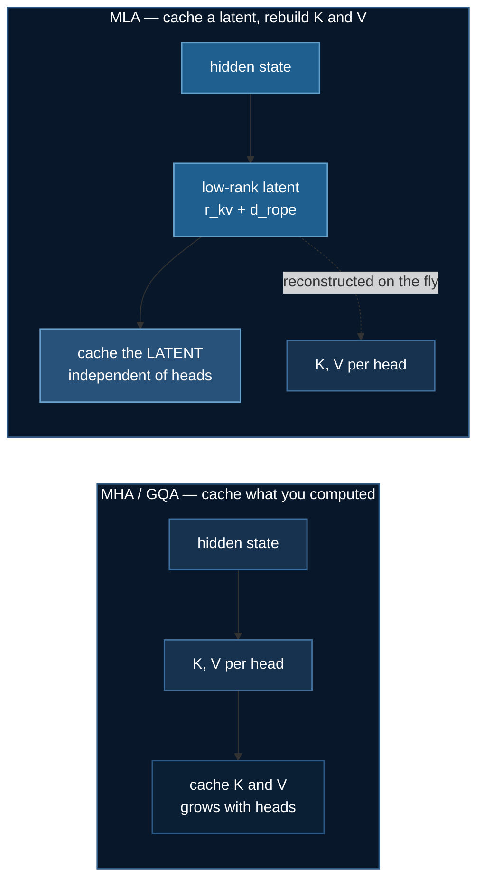

# DeepSeek MLA, Built From the Paper

Every other topic in this section *uses* a pretrained model. This one builds an
architecture: **Multi-head Latent Attention**, the mechanism DeepSeek-V2
introduced to make long context affordable.

It is the companion to [GLM-5.3](./glm53-moe-finetuning.md), which reports a 57×
KV-cache saving computed from a config file. Here you can see why that number is
what it is — and the test suite checks that this implementation reproduces it
independently.

Code: [`03_llms/10_deepseek_from_scratch/`](https://github.com/yiqiao-yin/deepspeed-course/tree/main/03_llms/10_deepseek_from_scratch)

:::tip The architecture needs no GPU
```bash
uv run mla.py                    # cache table + the absorption identity
uv run ../../tests/test_mla.py   # 19 property assertions
```
:::

## 1. The problem MLA solves

Autoregressive generation caches keys and values for every token it has already
seen. That cache is what makes long context expensive, and it grows linearly
with sequence length:

$$
\text{cache}_\text{MHA} = 2 \cdot n_\text{heads} \cdot d_\text{head}
\qquad
\text{cache}_\text{GQA} = 2 \cdot n_\text{kv heads} \cdot d_\text{head}
\qquad
\text{cache}_\text{MLA} = r_{kv} + d_\text{rope}
$$

Look at what is *absent* from the third expression. **MLA's cache does not
mention the head count.**



Measured by `mla.py`, holding GQA at a realistic 4:1 ratio:

```
 n_heads  kv_heads        mha        gqa        mla
       8         2      1,024        256         80
      16         4      2,048        512         80
      32         8      4,096      1,024         80
      64        16      8,192      2,048         80
```

MHA and GQA scale with heads. MLA does not move.

:::note GQA's flat column is available too — at a price
You can pin `n_kv_heads` while heads grow, and GQA's cache stops growing as
well. That is the trade made explicit: its cache shrinks because **fewer
distinct keys and values exist**, not because they are stored more cleverly.
MLA gives up neither.
:::

## 2. Decoupled RoPE — the detail that explains the `+64`

Rotary embeddings are position-dependent and **do not commute** with the
low-rank reconstruction. Rotate the reconstructed key and you can no longer fold
the up-projection into the query, so MLA stops being fast.

The architecture therefore splits the key in two: a compressed part carrying
content, and a small **decoupled** part carrying position, cached separately and
shared across all heads.

That is why GLM-5.3's cache is `512 + 64 = 576` values per token per layer and
not 512. The 64 is not overhead someone failed to optimise away — it is what
makes the rest of the scheme work.

## 3. Matrix absorption — why MLA is fast, not merely small

At inference $W_{UK}$ folds into the query once, ahead of time, so keys are
never reconstructed at all. You attend directly in the latent space:

$$
q^\top (W_{UK} c_{kv}) = (W_{UK}^\top q)^\top c_{kv}
$$

The left side rebuilds every key. The right side rebuilds none. They are the
same number.

:::danger An optimisation that changes the answer is the worst kind of bug
Faster, and wrong. So the test suite pins the identity rather than trusting it:

```
max |naive - absorbed| = 2.38e-07
```

and separately asserts that the same comparison **can** detect a genuine
difference — otherwise a loose tolerance would make the first check meaningless.
:::

## 4. What does the compression cost?

Cache sizes are exact arithmetic. Arithmetic cannot tell you what compression
costs in quality, so `train_deepseek_from_scratch.py` trains the same tiny
language model three times, changing only the attention module.

The task is **induction**: a marked pattern appears early and again late, and
predicting the second occurrence requires attending to the first. That is
deliberate — a task solvable from token frequencies would let all three variants
tie, and the tie would mean nothing.

2 layers, hidden 256, 8 heads, 8 epochs, 8,192 sequences of length 64:

| variant | cache/token | params | accuracy | loss |
|---|---|---|---|---|
| mha | 512 | 1,609,472 | 25.9% | 3.175 |
| gqa | 128 | 1,412,864 | 26.0% | 3.159 |
| **mla** | **40** | 1,396,800 | **28.3%** | **3.075** |

Chance is **1.6%** / 4.159 nats, so all three learned the task.

:::warning Read the result honestly
Across three seeds the accuracy differences are **within noise** — MLA ranged
26.1–28.3%, MHA 25.6–25.9%. What held in every run is the *loss* ordering,
`mla < gqa < mha`.

The defensible claim is that MLA cached **12.8× less without costing accuracy
here** — not that it is better. One small model on one synthetic task is not a
ranking, and presenting it as one would be exactly the sort of overclaim this
course tries to avoid.
:::

## 5. Two things the task design had to get right

Both were bugs in the first version of this example, and both produced numbers
that looked like results:

**The loss was averaged over every position.** Most positions in these sequences
are uniform random and unpredictable *by construction*, so the average sits at
chance however good the model is. The first run reported 4.147 against a 4.159
floor for all three variants. Loss is now computed only on the positions the
induction pattern makes recoverable.

**There was no marker token.** Matching a bare random token collides by chance
at this vocabulary size, making the first pattern position ambiguous. Measured
under identical training: **4.8% accuracy without the marker, 26% with it.**

## 6. Why this is in a DeepSpeed course

Because of what ZeRO does *not* do.

ZeRO shards optimizer state, gradients and parameters — none of which is the KV
cache. **The cache is an inference cost that ZeRO never touches**, which is
precisely why MLA exists as a separate idea. A reader who has met only ZeRO
tends to assume it covers both kinds of memory. It does not.

So `ds_config.json` here uses **stage 0**, and says why: sharding a 1.6M
parameter model would add communication to save kilobytes, and teach the wrong
lesson.

## 7. On provenance

This is an **independent implementation from the published paper** — DeepSeek-AI,
*DeepSeek-V2*, [arXiv:2405.04434](https://arxiv.org/abs/2405.04434), §2.1. No
third-party code is vendored.

That matters. Several popular "DeepSeek from scratch" repositories carry **no
licence at all**, which under default copyright means all rights reserved. Code
being public and readable on GitHub does not make it reusable, and this course
is MIT-licensed.

Implementing from the paper is the clean route, and it turned out to be the
better one: it is what allowed the cache accounting to be **cross-checked**
against the GLM-5.3 analysis. Plugging GLM-5.3's published dimensions into this
implementation reproduces 576 values per token and a 57× saving — the same
figures `train_glm53_ds.py` derives from a config file by completely different
code. Two independent routes to one number.

## 8. Running it

```bash
cd 03_llms/10_deepseek_from_scratch
uv sync

# no GPU
uv run mla.py
uv run ../../tests/test_mla.py

# CoreWeave
sbatch run_deepspeed.sh --variant all
sbatch run_deepspeed.sh --max-steps 20        # cheap dry run

# RunPod, with automatic shutdown
uv run runpod/runpod_ctl.py run 03_llms/10_deepseek_from_scratch \
    --dry-run --collect --wait --terminate --yes
uv run runpod/runpod_ctl.py pods              # must say "Nothing is billing."
```

## References

- DeepSeek-AI, *DeepSeek-V2: A Strong, Economical, and Efficient Mixture-of-Experts Language Model*, [arXiv:2405.04434](https://arxiv.org/abs/2405.04434)
- DeepSeek-AI, *DeepSeek-V3 Technical Report*, [arXiv:2412.19437](https://arxiv.org/abs/2412.19437)
- Ainslie et al., *GQA: Training Generalized Multi-Query Transformer Models from Multi-Head Checkpoints*, [arXiv:2305.13245](https://arxiv.org/abs/2305.13245)
