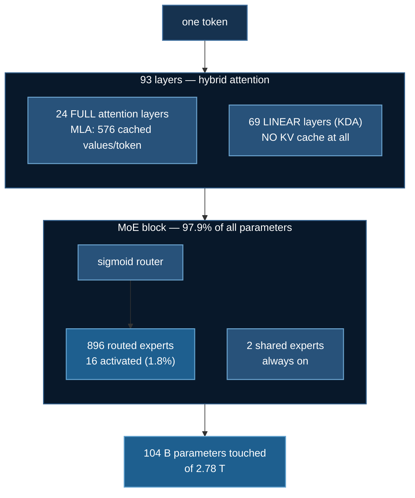

# Kimi K3: Reading a Model You Cannot Run

**Example:** `03_llms/01_llm_finetuning/analyze_kimi_k3.py`

Every other page in this section ends with a training run. This one does not,
and that is the lesson.

[Kimi K3](https://huggingface.co/moonshotai/Kimi-K3) is **2.78 trillion
parameters**, of which **104 billion** are activated per token. Its weights are
1,561 GB across 96 safetensors shards. You are not going to fine-tune it, and
no amount of renting will change that.

You can still read it completely — architecture, memory behaviour, where the
parameters live, what LoRA would adapt — **in about two seconds, with no GPU
and no download**:

```bash
cd 03_llms/01_llm_finetuning
uv run analyze_kimi_k3.py --plan
```

:::tip This is the technique, not the model
`--plan` and `--verify-arch` cost seconds and answer questions that otherwise
fail only *after* a multi-hundred-gigabyte download. The same two flags appear
on [GLM-5.3](./glm53-moe-finetuning.md) and
[Qwen3.8](./qwen38-hybrid-attention.md) in the same folder. Copy the technique
to whatever frontier model lands next month.
:::

## 1. Why this one is analysis-only

| | |
|---|---|
| parameters | 2.78 T total, 104 B activated per token |
| weights on the Hub | **1,561 GB** |
| at 4-bit NF4 | ~390 GB → **~5 × H100-80GB for the weights alone** |
| realistic floor | 8 × H200 (1,128 GB), ~$29/hour |

That 4-bit figure is *weights only*, which is the optimistic case. This course's
sizing rule is:

$$\text{per GPU} = \frac{\text{weights}}{N} + \text{overhead that does not shard}$$

Activations, gather buffers and fragmentation are all in that second term, and
none of them appear above.

Two further blockers that hardware does not fix:

- **The remote code does not import on the pinned transformers.** K3's
  `auto_map` points at `modeling_kimi_k3.py`, which imports `OutputRecorder`
  from `transformers.utils.generic` — a symbol that existed in 4.56–5.0 and was
  **removed by 5.10**. Every lab in this course pins 5.16.1. This is precisely
  the third class of [library API drift](./llm-finetuning.md) the repo's test
  suite hunts: not a rejected kwarg, but a vanished symbol.
- **It needs `fla-core`** for Kimi Delta Attention, a CUDA-compiled dependency.

**Reporting this honestly is the deliverable.** A lab that implied a 1.5 TB
model was rentable would cost a reader real money before teaching them anything.

## 2. What the config says

```
  layers           93
  FULL attention    24   (26%)
  LINEAR (KDA)      69   (74%)
  pattern          every 4th layer is full attention  ->  2.9:1 linear:full
```

| | |
|---|---|
| architecture | `KimiK3ForConditionalGeneration` (text backbone `KimiLinearForCausalLM`) |
| hidden / vocab | 7,168 / 163,840 |
| context | 1,048,576 tokens |
| experts | **896 routed, 16 active (1.8%), 2 shared** — sigmoid router |
| MLA cache | `kv_lora_rank 512 + qk_rope_head_dim 64` = **576 values/token/full layer** |

**97.9% of the parameters are experts.** That single number explains the model.
K3 is not a dense 2.8 T model — it is a ~104 B model with an enormous lookup
table of specialists attached. The router that picks 16 of 896 is a rounding
error in the parameter count and decides where almost everything goes.



### The hybrid layout compounds with MLA

**Linear-attention layers carry no KV cache at all.** So on this 3:1 hybrid the
cache scales with the **24** full layers, not all 93 — and MLA makes each of
those cheaper in turn, because its cache is
`kv_lora_rank + qk_rope_head_dim` and mentions **no head count**. Fewer cached
layers, and each one smaller. That is two independent savings multiplying, and
it is why a million-token context is expressible at all.

## 3. Everything here is already taught somewhere in this course

K3 is a good capstone read precisely because it invents little and composes a
lot:

| K3 uses | Taught in |
|---|---|
| MLA-style compressed KV | [DeepSeek MLA from scratch](./deepseek-mla.md) |
| fine-grained + shared MoE, sigmoid router | [MoE routing](./moe-routing.md) |
| hybrid linear/full attention | [Qwen3.8](./qwen38-hybrid-attention.md) |
| sparse MoE at frontier scale | [GLM-5.3](./glm53-moe-finetuning.md) |

The sigmoid router in particular is the DeepSeek-V3 convention, which
[`11_moe`](./moe-routing.md) implements from the paper at toy scale. Reading it
there and recognising it here at 896 experts is the whole point of the ordering.

## 4. A circulating snippet that cannot work

A fine-tuning snippet for "kimi-k3" appears on several tutorial sites. Run
against the versions this course pins, it fails four ways —
`--plan --audit-snippet` checks the last three against your **installed**
libraries rather than a remembered snapshot:

| in the snippet | what happens |
|---|---|
| `model_id = "kimi/kimi-k3"` | 401 — the id is `moonshotai/Kimi-K3` |
| `SFTTrainer(tokenizer=...)` | removed in transformers 5.x → `processing_class=` |
| `SFTTrainer(max_seq_length=...)` | moved out of the trainer in trl 1.x |
| `train_dataset="train.jsonl"` | a `str`, not a `Dataset` |

Its **LoRA targets, though, are fine.** Building the module tree on the meta
device shows `q_proj`/`k_proj`/`v_proj`/`o_proj` resolving to 300 modules — 89
in the full-attention layers and 211 in the linear ones. Worth saying out loud,
because the obvious guess — that a linear-attention model must name its
projections differently — is **wrong here**, and nothing but the module tree
tells you either way.

## 5. How a script whose output cannot be checked was checked

This script has no end-to-end run that would catch a mistake, which makes its
*derivations* the only testable surface. `tests/test_kimi_k3_plan.py` runs the
shipped functions against a fixture config with no torch and no network.

It exists because the first version printed a wrong number:

```
  pattern          every 1th layer is full attention  ->  2:1 linear:full
```

K3's `full_attn_layers` is `[4, 8, 12, … 92, 93]` — 23 gaps of 4 and **one gap
of 1**, because 93 layers do not divide evenly. The code took `min()` of the
gaps. The ratio was wrong a second, independent way: `69 // 24` is integer
division, so a nominal 3:1 design printed as 2:1.

:::warning Neither half was detectable by a shape assertion
Both fields were populated, both had the right type, and both held a plausible
small integer. This is the failure mode this course keeps returning to — **the
run exits 0 and the number is meaningless.** Assert properties, not shapes.
:::

The suite keeps that exact index list permanently, and asserts the mode is 4,
that the ratio reads 2.9 rather than 2, and — a third bug the test found on its
first run — that a **dense** model is not reported as hybrid, which the original
`(n - full) > 0` did wrongly for every model with no full-attention list.

```bash
uv run tests/test_kimi_k3_plan.py
```

## References

- [moonshotai/Kimi-K3](https://huggingface.co/moonshotai/Kimi-K3)
- *Kimi K3: Open Frontier Intelligence*, [arXiv:2607.24653](https://huggingface.co/papers/2607.24653)
