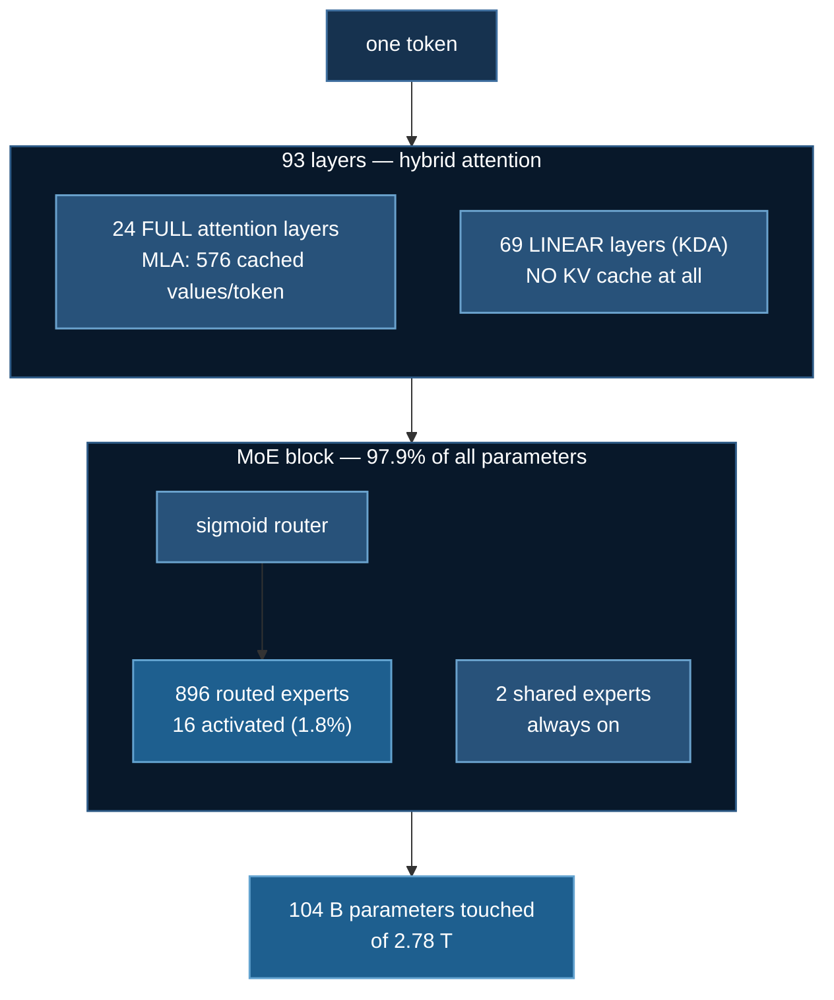

# Kimi K3: Reading a Model You Cannot Run

**Example:** [`03_llms/01_llm_finetuning/analyze_kimi_k3.py`](https://github.com/yiqiao-yin/deepspeed-course/blob/main/03_llms/01_llm_finetuning/analyze_kimi_k3.py)

Every other page in this section ends with a training run. This one does not,
and that is the lesson.

:::note What the script is for
`analyze_kimi_k3.py` **does not fine-tune anything, and is not a cut-down
version of something that would.** It answers the questions you would otherwise
answer by downloading 1,561 GB and waiting for a crash:

| you want to know | the flag | what it costs |
|---|---|---|
| where the parameters live, what the cache costs, whether your hardware could hold it | `--plan` | ~2 s, reads `config.json` over HTTPS |
| whether your LoRA target names resolve against the **real** module tree | `--verify-arch` | ~seconds on torch's meta device — no weights |
| whether a fine-tuning snippet you found online still runs on your libraries | `--plan --audit-snippet` | instant, imports what you have installed |

It is named `analyze_`, not `train_`, for exactly that reason — and it carries
no `require_gpu()` guard, deliberately, because it never touches a GPU.
:::

[Kimi K3](https://huggingface.co/moonshotai/Kimi-K3) is **2.78 trillion
parameters**, of which **104 billion** are activated per token. Its weights are
1,561 GB across 96 safetensors shards. You are not going to fine-tune it, and
no amount of renting will change that.

You can still read it completely — architecture, memory behaviour, where the
parameters live, what LoRA would adapt — **in about two seconds, with no GPU
and no download**:

```bash
cd 03_llms/01_llm_finetuning
uv run analyze_kimi_k3.py --plan
```

:::tip This is the technique, not the model
`--plan` and `--verify-arch` cost seconds and answer questions that otherwise
fail only *after* a multi-hundred-gigabyte download. The same two flags appear
on [GLM-5.3](./glm53-moe-finetuning.md) and
[Qwen3.8](./qwen38-hybrid-attention.md) in the same folder. Copy the technique
to whatever frontier model lands next month.
:::

## 1. Why this one is analysis-only

| | |
|---|---|
| parameters | 2.78 T total, 104 B activated per token |
| weights on the Hub | **1,561 GB** across 96 safetensors shards |
| as shipped | **0.56 bytes/parameter** — already quantised, 2.72 T of them in `U8` |
| realistic floor | **> 1,561 GB.** 8 × B200 is 1,440 GB and falls **121 GB short** |

**Quantisation is not the way out, because it has already been taken.** The
checkpoint is denser than fp8 on arrival, so there is no 4× left. Even true
4-bit across all 2.78 T parameters is ~1,390 GB — still eight B200s for the
weights alone, before a single activation.

Those figures are *weights only*, which is the optimistic case. This course's
sizing rule is:

$$\text{per GPU} = \frac{\text{weights}}{N} + \text{overhead that does not shard}$$

Activations, gather buffers and fragmentation are all in that second term, and
none of them appear above.

Two further blockers that hardware does not fix:

- **The remote code does not import on the pinned transformers.** K3's
  `auto_map` points at `modeling_kimi_k3.py`, which imports `OutputRecorder`
  from `transformers.utils.generic` — a symbol that survives in 5.1.0 and is
  **gone in 5.2.0**, verified by installing each version. Every lab here pins
  5.16.1. This is precisely
  the third class of [library API drift](./llm-finetuning.md) the repo's test
  suite hunts: not a rejected kwarg, but a vanished symbol.
- **It needs `fla-core`** for Kimi Delta Attention, a CUDA-compiled dependency.

**Reporting this honestly is the deliverable.** A lab that implied a 1.5 TB
model was rentable would cost a reader real money before teaching them anything.

### "Could I just rent 8 Blackwells?"

The obvious question, and worth answering with real prices rather than
intuition. RunPod's largest card is a **B200 at 180 GB, $5.98/GPU/hr**:

| | VRAM | $/hr |
|---|---:|---:|
| 8 × B200 | **1,440 GB** | ~$48 |
| 8 × H200 | 1,128 GB | ~$29 |
| 8 × RTX PRO 6000 Blackwell (96 GB) | 768 GB | ~$14 |

Eight B200s is **121 GB short** of just holding the weights as they ship. And
the usual escape — quantise harder — is already spent, because K3 arrives at
0.56 bytes/parameter. You would need nine, which in practice means sixteen.

**This is the rare case where "rent a bigger box" is the right diagnosis** —
which is worth stating plainly, because in this course it has been the *wrong*
one three times running (an OOM that was a missing `--use-lora`, a hang that
was NCCL peer-to-peer, a capacity model that was wrong). Here the arithmetic
really does say the machine is too small. It also does not matter, because the
remote code would not import even if the machine were big enough.


## 2. What the config says

```
  layers           93
  FULL attention    24   (26%)
  LINEAR (KDA)      69   (74%)
  pattern          every 4th layer is full attention  ->  2.9:1 linear:full
```

| | |
|---|---|
| architecture | `KimiK3ForConditionalGeneration` (text backbone `KimiLinearForCausalLM`) |
| hidden / vocab | 7,168 / 163,840 |
| context | 1,048,576 tokens |
| experts | **896 routed, 16 active (1.8%), 2 shared** — sigmoid router |
| MLA cache | `kv_lora_rank 512 + qk_rope_head_dim 64` = **576 values/token/full layer** |

**97.9% of the parameters are experts.** That single number explains the model.
K3 is not a dense 2.8 T model — it is a ~104 B model with an enormous lookup
table of specialists attached. The router that picks 16 of 896 is a rounding
error in the parameter count and decides where almost everything goes.



### The hybrid layout compounds with MLA

**Linear-attention layers carry no KV cache at all.** So on this 3:1 hybrid the
cache scales with the **24** full layers, not all 93 — and MLA makes each of
those cheaper in turn, because its cache is
`kv_lora_rank + qk_rope_head_dim` and mentions **no head count**. Fewer cached
layers, and each one smaller. That is two independent savings multiplying, and
it is why a million-token context is expressible at all.

## 3. Everything here is already taught somewhere in this course

K3 is a good capstone read precisely because it invents little and composes a
lot:

| K3 uses | Taught in |
|---|---|
| MLA-style compressed KV | [DeepSeek MLA from scratch](./deepseek-mla.md) |
| fine-grained + shared MoE, sigmoid router | [MoE routing](./moe-routing.md) |
| hybrid linear/full attention | [Qwen3.8](./qwen38-hybrid-attention.md) |
| sparse MoE at frontier scale | [GLM-5.3](./glm53-moe-finetuning.md) |

The sigmoid router in particular is the DeepSeek-V3 convention, which
[`11_moe`](./moe-routing.md) implements from the paper at toy scale. Reading it
there and recognising it here at 896 experts is the whole point of the ordering.

## 4. A circulating snippet that cannot work

A fine-tuning snippet for "kimi-k3" appears on several tutorial sites. Run
against the versions this course pins, it fails four ways —
`--plan --audit-snippet` checks the last three against your **installed**
libraries rather than a remembered snapshot:

| in the snippet | what happens |
|---|---|
| `model_id = "kimi/kimi-k3"` | 401 — the id is `moonshotai/Kimi-K3` |
| `SFTTrainer(tokenizer=...)` | removed in transformers 5.x → `processing_class=` |
| `SFTTrainer(max_seq_length=...)` | moved out of the trainer in trl 1.x |
| `train_dataset="train.jsonl"` | a `str`, not a `Dataset` |

Its **LoRA targets, though, are fine.** Building the module tree on the meta
device shows `q_proj`/`k_proj`/`v_proj`/`o_proj` resolving to 300 modules — 89
in the full-attention layers and 211 in the linear ones. Worth saying out loud,
because the obvious guess — that a linear-attention model must name its
projections differently — is **wrong here**, and nothing but the module tree
tells you either way.

## 5. How a script whose output cannot be checked was checked

This script has no end-to-end run that would catch a mistake, which makes its
*derivations* the only testable surface. `tests/test_kimi_k3_plan.py` runs the
shipped functions against a fixture config with no torch and no network.

It exists because the first version printed a wrong number:

```
  pattern          every 1th layer is full attention  ->  2:1 linear:full
```

K3's `full_attn_layers` is `[4, 8, 12, … 92, 93]` — 23 gaps of 4 and **one gap
of 1**, because 93 layers do not divide evenly. The code took `min()` of the
gaps. The ratio was wrong a second, independent way: `69 // 24` is integer
division, so a nominal 3:1 design printed as 2:1.

:::warning Neither half was detectable by a shape assertion
Both fields were populated, both had the right type, and both held a plausible
small integer. This is the failure mode this course keeps returning to — **the
run exits 0 and the number is meaningless.** Assert properties, not shapes.
:::

The suite keeps that exact index list permanently, and asserts the mode is 4,
that the ratio reads 2.9 rather than 2, and — a third bug the test found on its
first run — that a **dense** model is not reported as hybrid, which the original
`(n - full) > 0` did wrongly for every model with no full-attention list.

```bash
uv run tests/test_kimi_k3_plan.py
```

## 6. Preflight for any model you cannot afford to be wrong about

Everything above was found without renting anything, and none of it is
specific to K3. If you are sizing a pod for a frontier checkpoint, these four
checks cost minutes and are the ones that would otherwise fail *after* the
download.

### a. Do not assume the checkpoint is bf16

This is the check that changed the answer here. Ask the Hub what dtypes are
actually in the file:

```python
from huggingface_hub import HfApi
info = HfApi().model_info("moonshotai/Kimi-K3")
st = info.safetensors
print(f"total parameters: {st.total:,}")
for dtype, n in sorted(st.parameters.items(), key=lambda kv: -kv[1]):
    print(f"  {dtype:5} {n:>18,}")
```

```
total parameters: 2,779,931,837,184
  U8     2,722,740,830,208
  BF16      57,179,884,544
  F32           11,122,432
```

**`U8` for 98% of the parameters means the model is already quantised**, and
every "just load it in 4-bit" plan is dead on arrival. A `config.json` with
`torch_dtype: bfloat16` and `quantization_config: null` — which is exactly what
K3 has — tells you nothing about this. The dtype census does.

### b. The parameter count and the byte count are different questions

Two authoritative-looking sources disagree here, and picking the wrong one puts
you off by 1.8×:

| question | source | K3 |
|---|---|---|
| how much **disk and VRAM** do I need? | `model.safetensors.index.json` → `metadata.total_size` | **1,561 GB** |
| how many **parameters** is it? | the dtype census above | **2.78 T** |

```python
import json, urllib.request
u = "https://huggingface.co/<repo>/resolve/main/model.safetensors.index.json"
idx = json.load(urllib.request.urlopen(u, timeout=120))
print(f"disk needed: {idx['metadata']['total_size']/1e9:,.0f} GB")
```

They disagree because the census counts *parameters* while the index counts
*bytes*, and packed experts store **1.88 parameters per byte** — roughly 4-bit
packing plus per-block scales. Multiplying the parameter count by a bytes-per-
parameter you assumed is how the 390 GB error happened. **Use `total_size` for
capacity planning and the census only to understand what you are holding.**

### c. Check the remote code imports *before* you rent

Custom modelling code pins you to a transformers window that nothing documents.
K3's `modeling_kimi_linear.py` does:

```python
from transformers.utils.generic import OutputRecorder, check_model_inputs
```

Bisecting that symbol takes a few minutes and no GPU:

```bash
for v in 4.57.1 5.0.0 5.1.0 5.2.0 5.5.0 5.16.1; do
  printf "  %-8s " "$v"
  uv run --no-project --with "transformers==$v" python -c \
    "from transformers.utils.generic import OutputRecorder; print('HAS')" 2>&1 | tail -1
done
```

| transformers | `OutputRecorder` |
|---|---|
| 4.57.1, 5.0.0, **5.1.0** | present |
| **5.2.0** and later | **gone** |

So K3's remote code needs **transformers ≤ 5.1**. This course pins 5.16.1
everywhere, which is why `--verify-arch` needs its own environment. Note that
a changelog would have told you "removed in 5.2.0" only if you knew to look;
installing each version and importing the symbol is the check that cannot be
wrong.

### d. Check the compiled dependencies, and what is actually bookable

`fla-core` (Kimi Delta Attention) is CUDA-compiled, but it **installs and
imports on a CPU box**, so you can retire that risk for free:

```bash
uv run --no-project --with fla-core python -c "import fla; print('ok')"
```

And confirm the hardware exists before planning around it — RunPod's largest
card is a B200 at 180 GB:

```bash
uv run runpod/runpod_ctl.py gpus --min-vram 80 --limit 40
```

:::tip The order matters
Run **c** and **d** before **a** and **b**. Sizing is the interesting question,
but an import error makes it irrelevant — and it is the cheaper check.
:::

## 7. "What about GGUF, unsloth, llama.cpp?"

A fair objection to everything above: the community routinely runs models that
"do not fit". So does that change the answer?

**For inference, yes — completely.** For what this course is about, no. The two
halves are worth separating, because conflating them is how people end up
renting the wrong machine.

### The sizes are real

`unsloth/Kimi-K3-GGUF` publishes dynamic quants of K3, and they are not
marginal — measured from the Hub, against RunPod's largest card:

| quant | size | × B200-180GB |
|---|---:|---:|
| `UD-Q1_0` | 466 GB | 2.6 |
| `UD-IQ1_S` | 594 GB | 3.3 |
| `UD-IQ2_XXS` | 711 GB | 4.0 |
| **`UD-Q2_K_XL`** | **861 GB** | **4.8** |
| `UD-Q4_K_XL` | 1,509 GB | 8.4 |
| `UD-Q8_K_XL` | 1,561 GB | 8.7 |

So `UD-Q2_K_XL` at 861 GB fits on **8 × B200 with 579 GB to spare**, and
`UD-IQ2_XXS` fits on 8 × RTX PRO 6000 Blackwell — a **~$14/hour** machine
rather than a ~$48/hour one. The section above says eight Blackwells cannot
hold K3, and that remains true *of the released checkpoint*; it is not true of
a 2-bit conversion of it.

NVIDIA also publishes `Kimi-K3-NVFP4` at 1,610 GB, which despite the name is
**larger** than the original and still will not fit on eight cards.

### Why this does not make K3 a lab here

Three reasons, and the first is the one that matters:

- **GGUF is an inference format.** llama.cpp does not train. This course is
  about ZeRO, sharding and optimizer state — a quantised inference runtime is
  a different subject that happens to share a model. You cannot LoRA-tune a
  `UD-Q2_K_XL` file.
- **`UD-Q2_K_XL` is not Kimi K3.** It is a 2-bit approximation of it. Fine for
  "can I talk to it", not fine for any claim about the model's behaviour — and
  this course's rule is that a measured claim is scoped to the configuration it
  was measured in.
- **If you go this route you probably do not want 8 GPUs at all.** llama.cpp's
  real trick is CPU offload: the binding resource becomes system RAM and disk,
  not VRAM, and a large-RAM box is far cheaper per hour than eight Blackwells.
  Renting 8 × B200 to run a 2-bit GGUF is close to the most expensive way to
  do it.

**unsloth** is worth naming separately, because it is a *fine-tuning* library
and therefore the closest thing to an on-topic answer. Its speedups target
single-GPU LoRA on models that fit; K3 at 1,561 GB is not that, and nothing in
the unsloth repo listing above is a trainable K3. `unsloth/Kimi-K3-GGUF` is a
conversion for inference, not a training path.

:::note What was actually worth measuring
Not "can 8 GPUs hold a 2-bit GGUF" — the arithmetic above already answers that.
The open question was **how long 1,561 GB (or 861 GB) actually takes to fetch
onto a pod**, and whether that outlives the orchestrator's window. That is a
measurement rather than a derivation, so it has now been made — see
[§8](#8-measured-how-long-the-download-actually-takes). It cost three cents.
:::

## 8. Measured: how long the download actually takes

Everything above is derived from published metadata. This section is the one
thing here that required renting something — and it cost **about three cents**,
because measuring *throughput* does not require downloading 1,561 GB.

Measured on one RunPod pod (RTX 4000 Ada, $0.20/hr, ~10 minutes), fetching real
K3 shards from the Hub:

| method | throughput |
|---|---:|
| single-stream `curl` (one 17.0 GB shard) | **96.7 MB/s** |
| `hf download` (Xet, parallel — 34.0 GB in 269 s) | **126.3 MB/s** |

At the `hf download` figure:

| what you are fetching | size | download time |
|---|---:|---:|
| **K3 as released** | 1,561 GB | **3.4 hours** |
| `UD-Q4_K_XL` | 1,509 GB | 3.3 hours |
| `UD-Q2_K_XL` | 861 GB | 1.9 hours |
| `UD-IQ2_XXS` | 711 GB | 1.6 hours |
| `UD-Q1_0` | 466 GB | 1.0 hours |

### Two things this changes

**The download dominates the bill on the big machines.** Three and a half hours
of 8 × B200 at $47.84/hr is **~$164 before the first token is generated**, and
the GPUs are idle for all of it. If you are chasing the released checkpoint,
fetch it to a network volume on something cheap *first*.

**`--wait-seconds` defaults to 1800**, and at 126 MB/s that window buys you
**227 GB**. Every size in the table above outlives it. With `--terminate` the
pod is destroyed mid-download and you are billed for a run that produced
nothing — which is exactly the failure this repo has already recorded once, on
a much smaller model.

### The disk trap, found the same way

`runpod_ctl.py create --disk 120` does **not** give you 120 GB where it
matters. `--disk` sets the container disk; `--volume` (default **40 GB**) is
what mounts at `/workspace`, which is where `HF_HOME` points. The probe asked
for 120 and reported:

```
[info] disk: /dev/md0 40G 0 40G 0% /workspace
```

So a K3 fetch would die with `No space left on device` after 40 GB — about
nineteen minutes in — with the `--disk` flag looking correct the whole time.
Set `--volume`, not `--disk`.

### Scope

**One pod, one host, one region, measured once.** Network throughput varies by
datacenter and by neighbour, so treat 126 MB/s as an order of magnitude rather
than a constant — the honest claim is "hours, not minutes, and longer than the
default wait window", which is robust to a 2× error in either direction. The
probe also surfaced that `HF_HUB_ENABLE_HF_TRANSFER` is now deprecated in
favour of Xet (`HF_XET_HIGH_PERFORMANCE`), so guides recommending `hf_transfer`
are already stale.

## References

- [moonshotai/Kimi-K3](https://huggingface.co/moonshotai/Kimi-K3)
- *Kimi K3: Open Frontier Intelligence*, [arXiv:2607.24653](https://huggingface.co/papers/2607.24653)
