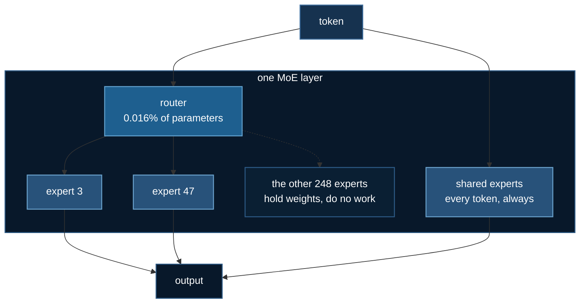
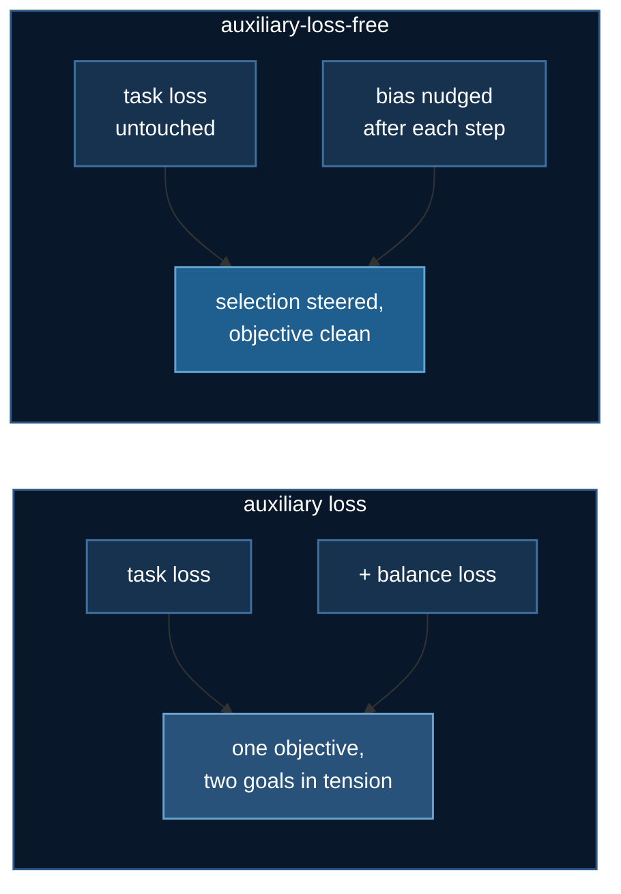
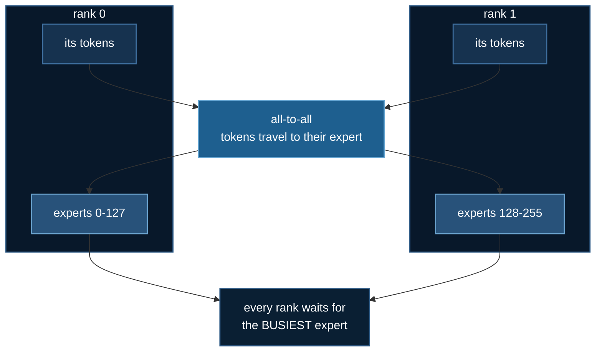

# Mixture of Experts: Routing and Load Balancing

DeepSeek-V2 and V3 have **two** headline architectural contributions. [DeepSeek
MLA](./deepseek-mla.md) covers one of them — MLA compresses what the model
*remembers*. This page covers the other: MoE changes what the model
*computes*.

:::info Prerequisite
Nothing formal, but [DeepSpeed ZeRO Stages](/docs/getting-started/deepspeed-zero-stages)
makes the last section land harder — expert parallelism is a **different axis**
from ZeRO, and the contrast is the point.
:::

## 1. Parameters and FLOPs stop being the same number

A dense feed-forward layer spends every parameter on every token. An MoE layer
holds $N$ experts and fires only $k$ of them:

$$
h_t = u_t + \sum_{i=1}^{N_s} \mathrm{FFN}^{(s)}_i(u_t)
          + \sum_{i=1}^{N_r} g_{i,t}\, \mathrm{FFN}^{(r)}_i(u_t)
$$

where $g_{i,t}$ is zero for every expert outside the token's top-$k$. GLM-5.3
activates 8 of 256 experts per token: ~743 B parameters of capacity at the
compute cost of ~30 B.

**This is the only technique in the course that makes a model bigger and
cheaper at the same time.** And the thing deciding it is remarkably small:

| component | parameters | share |
|---|---:|---:|
| routed experts | 724.78 B | 97.5% |
| shared experts | 2.83 B | 0.4% |
| **router (gate)** | **0.12 B** | **0.016%** |

The router is a rounding error in the parameter count and it decides where
97.5% of the model's capacity goes.



## 2. The routing rule, exactly

DeepSeek-V3 computes the token-to-expert affinity with a **sigmoid**, then
normalises among the selected experts:

$$
s_{i,t} = \mathrm{Sigmoid}\!\left(u_t^{T} e_i\right), \qquad
g_{i,t} = \frac{g'_{i,t}}{\sum_{j} g'_{j,t}}
$$

Two details here are easy to get wrong, and **the model trains fine either
way** — which is exactly what makes them worth stating.

**Sigmoid, not softmax over the top-k.** V2 used softmax; V3 changed it, and
the paper says so explicitly. Softmax over the top-$k$ forces the gates to sum
to 1 *by construction*, so a token routed to two poor experts produces just as
confident a mixture as one routed to two good ones.

**The load-balancing bias is used for selection only.** This is the one to
remember:

> "Note that the bias term is only used for routing. The gating value, which
> will be multiplied with the FFN output, is still derived from the original
> affinity score $s_{i,t}$."

So the bias decides *which* experts fire and never touches the weight their
output is multiplied by. Fold it into the gate and load-balancing pressure
begins perturbing the model's actual output — reintroducing through the back
door the very coupling the auxiliary-loss-free design exists to remove.

This course's implementation is checked against both properties in
`tests/test_moe_routing.py`, including a check that gates are **bit-identical**
when a bias change does not move a token's selection.

## 3. What load balancing actually buys

The usual telling is "without load balancing the router collapses, so balance
it." Measured on CPU over 300 steps — reproducible with `uv run moe.py` — that
is half true, and the wrong half is the interesting one.

| experts | groups | balance | eval loss | max/min | dead | purity |
|---:|---:|---|---:|---:|---:|---:|
| 16 | 4 | none | **0.144** | 264:1 | 0 | **0.975** |
| 16 | 4 | bias | 0.246 | 1.5 | 0 | 0.793 |
| 64 | 4 | none | **0.310** | ∞ | **12** | 0.932 |
| 64 | 4 | bias | 0.634 | 3.0 | 0 | 0.662 |

*purity* is the normalised mutual information between the task's latent groups
and the chosen expert — did the router find the structure, or is it just
spreading tokens evenly?

**Collapse is real, but it needs surplus.** At 64 experts for a 4-group task,
12 experts receive nothing at all. At 16 experts nothing dies, but one expert
still handles 264× the traffic of another.

**Balancing is a tax, not an improvement — at world size 1.** Read the loss
column: balancing makes the model *worse* in every configuration measured
there, and specialisation falls with it. Forcing 16 experts to share a 4-group
task means splitting each group across four experts that each learn a blurrier
version of it.

:::caution A 2-GPU measurement disagrees, and it is not yet resolved
Everything in that table is **single-process, world size 1**. A 2 × RTX 3090
run of the same script under DeepSpeed reported the reverse — `--balance bias`
at 0.024 against `--balance none` at **0.795**, with the unbalanced run's loss
*rising* through training (0.515 → 0.827). A rising loss is divergence, not
poor specialisation.

What is known: the world-size-1 table holds across **six seeds** with no
overlap between groups, so it is not seed luck. Reproducing the reversal on
**two gloo ranks on CPU**, with gradients all-reduced exactly as data
parallelism does, did **not** reverse it. And the 2-GPU observation is **one
run per arm**.

So the ordering is established at world size 1 and **open above it**. If the
reversal holds under repetition it is a *stronger* version of this page's
thesis — balancing would be required for convergence once experts span ranks,
not merely a tax paid for schedulability. This page will be rewritten around it
if so. Treating it as settled either way would be fabrication.
:::

That is not a defect. It is the trade the DeepSeek-V3 authors name, and the
reason they went looking for a cheaper mechanism:

> "However, too large an auxiliary loss will impair the model performance."

### The auxiliary-loss-free alternative

Rather than adding a term to the objective, V3 keeps a per-expert bias $b_i$
and nudges it after each step — up when an expert is starved, down when it is
swamped. The objective is never touched.



One implementation note that costs a debugging session if missed: that bias is
a **buffer, not a parameter**. No optimizer and no ZeRO stage synchronises it,
so across ranks the counts must be all-reduced before the update — the paper
measures load "on the whole batch of each training step." Skip that and every
rank quietly drifts to a different router, with nothing raising.

## 4. So why balance at all?

Because the unbalanced router is a **better model and a much worse program**,
and that only becomes visible once the experts live on different GPUs.

**Expert parallelism is not ZeRO.** Both split a model across GPUs; they split
different things:

| | shards | every rank runs |
|---|---|---|
| **ZeRO** | optimizer state, gradients, parameters | every layer, on different **data** |
| **Expert parallelism** | the **experts themselves** | a different **subset of the model** |

So EP introduces a communication pattern ZeRO never has — an all-to-all in the
forward pass and another in the backward — and its cost is set by the
**busiest** expert, because every rank waits at that all-to-all.



A 264:1 token imbalance is one GPU doing 264× the work while its peers idle at
a barrier. You accept a measurable loss penalty to avoid a far larger
wall-clock penalty.

That is the argument *if* the loss penalty is real at scale. The caution above
is the reason for the "if": on the one multi-GPU measurement available,
balancing did not cost loss — it was the only arm that converged at all.

**That is why MoE belongs in a DeepSpeed course rather than an architecture
course.** The balancing mechanism is not there to make the model better. It is
there to make the model *schedulable*.

## 5. One property that is deliberately false

Capacity-based routing drops tokens when an expert is full, and tokens are
admitted **in the order they appear**. So whether a token reaches its preferred
expert depends on where it sits in the batch — the same token, in a different
batch, routes differently.

This is worth stating because it is the mirror image of a property checked
elsewhere in this course. [Groupwise ranking](../intermediate/groupwise-ranking.md)
asserts **permutation equivariance**: a scorer must not read candidate order,
and the first implementation there scored well while quietly doing exactly
that. Here the equivalent property is *false by design*, and the test asserts
that it is false — so nobody later "fixes" it into silence.

The router itself remains permutation-equivariant. Only capacity is
order-dependent. The test checks both halves separately.

## 6. Running it

```bash
cd 03_llms/11_moe
uv sync

# the whole comparison, on CPU, no GPU needed
uv run moe.py

# under DeepSpeed
uv run deepspeed --num_gpus=2 train_moe_ds.py --balance bias
uv run deepspeed --num_gpus=2 train_moe_ds.py --balance none   # compare

# experts partitioned across ranks
uv run deepspeed --num_gpus=2 train_moe_ds.py --expert-parallel \
    --deepspeed_config ds_config_ep.json
```

The comparison to actually run is `--balance none` against `--balance bias`.
Read both the loss **and** the balance columns: one gets worse as the other
gets better, and that trade is the entire topic.

:::warning Not yet verified on multi-GPU hardware
The `--expert-parallel` path is believed correct from the DeepSpeed API but has
not been run on a 2-GPU box. The CPU comparison and the single-GPU training
paths are verified end to end. Those are different claims and this course does
not blur them.
:::

## References

- DeepSeek-AI, *DeepSeek-V3 Technical Report*, [arXiv:2412.19437](https://arxiv.org/abs/2412.19437) §2.1.2 — Eqs. 12–16, auxiliary-loss-free load balancing
- Dai et al., *DeepSeekMoE: Towards Ultimate Expert Specialization*, [arXiv:2401.06066](https://arxiv.org/abs/2401.06066)
- Fedus et al., *Switch Transformers*, [arXiv:2101.03961](https://arxiv.org/abs/2101.03961)
- Shazeer et al., *Outrageously Large Neural Networks*, [arXiv:1701.06538](https://arxiv.org/abs/1701.06538)
