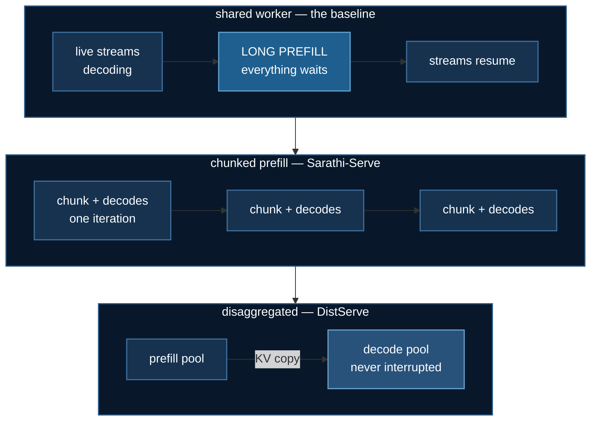

# Prefill and decode: when to split them

One inference request has two phases that want opposite things from a GPU,
and almost every serving decision follows from that single fact.

**Prefill** reads the whole prompt at once. Every token is available
simultaneously, so attention and the MLP become large dense GEMMs. It
saturates compute and finishes in one forward pass.

**Decode** emits one token at a time. Each step does a trivial amount of
arithmetic but must stream every weight — and the entire KV cache — out of
memory. It cannot use the parallelism prefill feasts on.

Put them on one worker and they interfere. A long prompt's prefill is a
long, indivisible block of GPU time, and every live stream stalls behind it.
The user does not experience this as *"someone else sent a long prompt"*.
They experience their own tokens stopping.



## The same run, on one timeline

The diagram above is a schematic. This one is **generated from an actual
trace** — every bar is an iteration the simulator ran, at the constants
measured on the GPU. A 2048-token prompt arrives 100 ms into two live
streams:

```mermaid
gantt
    title Prefill and decode on one timeline (milliseconds)
    dateFormat x
    axisFormat %L
    section shared
    prefill x2 :crit, sha0, 0, 71
    decode :active, sha1, 71, 109
    prefill :crit, sha2, 109, 255
    decode x96 :active, sha3, 255, 3930
    section chunked
    prefill :crit, chu0, 0, 35
    fused :active, chu1, 35, 74
    decode :active, chu2, 74, 112
    fused x4 :active, chu3, 112, 353
    decode x96 :active, chu4, 353, 4029
    section disaggregated
    prefill :crit, dis0, 0, 35
    transfer :done, dis1, 35, 36
    prefill :crit, dis2, 35, 71
    transfer :done, dis3, 71, 72
    prefill :crit, dis4, 100, 245
    transfer :done, dis5, 245, 254
    decode x102 :active, dis6, 36, 3941
```



Read the `shared` row first. The long red bar from 109 ms to 255 ms is one
indivisible prefill, and the decode bars stop for its entire duration —
that gap *is* the head-of-line stall, drawn to scale.

`chunked` breaks the same prefill into `fused` iterations that each carry
the decodes along, so no single bar is long. `disaggregated` has two
resources: prefill bars on one pool, and a decode bar that runs
**continuously from 36 ms** because nothing on its pool ever interrupts it.

:::note Why generate it rather than draw it
A hand-drawn schematic can illustrate a policy the code does not implement,
and nothing would catch the disagreement — the diagram equivalent of a stale
measurement. These bars come from `Trace.events`, the same run the tables
report, and `tests/test_prefill_decode.py` asserts the bars account for
every GPU-second the trace claims and that no resource is ever double-booked.
Consecutive identical iterations are coalesced (`x96`) and any truncation is
labelled, because a chart that silently drops half a timeline lies about
where the time went.
:::

## The falsifier, stated first

A claim that cannot lose is not a finding. Before measuring anything, this
lab commits to a sentence that the experiment is allowed to refute:

:::warning The claim under test
**If chunked prefill's worst decode gap is not below the shared worker's,
chunking does not help on this hardware and the central claim is wrong
here.**
:::

`serve_bench.py --demo` prints `HOLDS` or `FAILS` against exactly that
sentence. It printed `FAILS` the first time, for a reason worth keeping —
see [below](#the-regime-where-chunking-loses).

## The stall is real, measured against a baseline

RTX 3080 Ti Laptop (16 GB), Qwen3-0.6B bf16, prompt 4096, chunk 256.
**Median of 7 timed repeats after 3 warmup calls.**

| | decode step | vs baseline |
|---|---|---|
| **BASELINE** — nothing else running | **39.6 ms** `[33.1, 44.6]` | 1.0× |
| `shared` — behind a full prefill | 310.3 ms `[303.7, 313.4]` | **7.8×** |
| `chunked` — worst gap, chunk 256 | 115.7 ms | 2.9× |

The baseline row is what makes the other two mean anything. Without a
measurement of an *undisturbed* decode step there is no way to distinguish a
blocked step from an ordinary one, and "310 ms" is just a number.

Notice which column is noisy. `shared` is stable to ±1.5% because a
4096-token prefill dominates it. The **baseline** swings ±14%, because a
single 40 ms decode step is mostly launch overhead and scheduler jitter. The
*ratio* inherits that noisy denominator and wanders between about 4× and 8×
across runs while the absolute numbers barely move. Quote the absolutes.

## The obvious fix is the wrong one here

Feeding the measured constants into the scheduler, at an 8192-token prompt
against two live streams:

| chunk | TTFT p99 | max stall | TTFT cost | stall gain |
|---|---|---|---|---|
| `shared` (baseline) | 0.534 s | 0.524 s | 1.00× | 1.0× |
| 128 | 2.547 s | 0.039 s | **4.77×** | 13.4× |
| 256 | 1.526 s | 0.046 s | 2.86× | 11.4× |
| 512 | 1.015 s | 0.060 s | 1.90× | 8.7× |
| 1024 | 0.760 s | 0.089 s | 1.42× | 5.9× |
| 2048 | 0.632 s | 0.145 s | 1.18× | 3.6× |

**The stall gain saturates; the TTFT cost does not.** The stall is
approaching a floor of *one decode step* (38 ms) — once a chunk is cheaper
than the decode riding with it, shrinking it again cannot help. TTFT has no
floor; it grows linearly in the number of passes.

> **The smallest chunk worth using is the one whose prefill cost is about one
> decode step.** Here a 256-token chunk costs 46 ms against a 38 ms decode
> step, so 256–512 is the sensible range and 128 is past the knee.

**And on this GPU, disaggregation beats chunking outright.** The fixed cost
of a forward pass is 31.9 ms; thirty-two of them is **0.989 s of pure
overhead, twice the 0.486 s prefill being split.** Disaggregation reaches a
*better* stall (0.038 s) for a 10% TTFT cost instead of 186%, paying
instead in GPU-seconds — 4.88 against 4.27.

That inverts the usual recommendation, and it does **not** contradict
Sarathi-Serve. The overhead that makes chunking expensive is *launch*
overhead: large on a laptop GPU running eager PyTorch at batch 1, small on a
datacenter GPU with fused kernels and a big batch. A scheduling result is
scoped to the cost model it was measured under, and this one names its
model.

## A textbook claim that did not survive measurement

"Decode is memory-bandwidth bound" is the standard one-liner. On this setup
it is simply false:

| KV cache | decode step | spread |
|---|---|---|
| 128 | 36.07 ms | ±21% |
| 1,024 | 36.21 ms | ±36% |
| 4,096 | 35.37 ms | ±22% |
| 16,384 | 35.78 ms | ±22% |

**Flat across a 128× range**, with run-to-run spread far larger than any
trend. Fitting a marginal cost per cached token over two points returned a
**negative** number — which is impossible, since more cache cannot be
cheaper to read.

The calibrator detects that and refuses to publish the constant rather than
putting a negative value into a teaching cost model. It reproduced on an
independent run after the `transformers` pin changed.

At 0.6B parameters, batch 1, eager attention, this model is
**kernel-launch bound**. The bandwidth story is a claim about large models,
large batches and fused kernels — worth measuring before quoting.

## The regime where chunking loses

The first `--dry-run` capped the prompt at 512 tokens — two chunks — and
printed `FAILS` against the falsifier. That was not a bug in the lab. With a
31.9 ms per-pass overhead and only two passes to amortise it over, unfused
chunking genuinely is slower than letting the prefill run.

> Chunking pays only when the prompt is many chunks long. At two chunks the
> overhead is the whole story.

`--dry-run` now shortens the *repeats* rather than the prompt, because the
prompt length is the variable the claim is about. A smoke test that reports
the headline claim as false is worse than no smoke test.

:::note What the measurement does not model
The benchmark times **unfused** chunking: the chunk and the decode run as two
separate forward passes. A real serving stack batches them into one
iteration, so the decode rides along for free — that is Sarathi-Serve's
"stall-free" half, a *separate idea* from chunking itself. The measured
numbers are therefore an **upper bound** on the chunked stall, and the
simulator models the fused version and reports lower. They are not directly
comparable, and the tool says so in its own output.
:::

## Why this is in a DeepSpeed course

ZeRO shards what the model *is*. Token compression shrinks what it *looks
at*. STAR memory bounds what it *retains*. This page is about none of those:
the model fits, the memory is fine, and the problem is **when each piece of
work runs**.

That makes it the scheduling member of the same family — and the one where
the reflex ("it's slow, get a bigger box") helps least. Nothing here is
fixed by more VRAM.

It is also the clearest case in the course of a result that **reverses with
hardware**. The same code, the same model, the same policies, run on an
H100 with fused kernels, would favour chunking. The lab's job is to make you
measure your own constants rather than inherit someone else's conclusion.

## Run it

```bash
cd 03_llms/12_prefill_decode
uv sync

# No GPU, no download. The scheduling BEHAVIOUR is all here.
uv run --no-project python scheduler.py
uv run ../../tests/test_prefill_decode.py      # 27 property checks

# With a GPU
uv run serve_bench.py --calibrate --repeats 9 --warmup 4
uv run serve_bench.py --demo --prompt-len 4096 --chunk 256
```

The split between the two files is deliberate: a wrong constant makes the
*numbers* wrong, a wrong scheduler makes the *conclusion* wrong, and only
the second is a teaching error. The property tests police the second without
any hardware.

## References

- Agrawal et al., [Taming Throughput-Latency Tradeoff in LLM Inference with Sarathi-Serve](https://arxiv.org/abs/2403.02310), OSDI 2024
- Zhong et al., [DistServe: Disaggregating Prefill and Decoding for Goodput-optimized LLM Serving](https://arxiv.org/abs/2401.09670), OSDI 2024
- Kwon et al., [Efficient Memory Management for LLM Serving with PagedAttention](https://arxiv.org/abs/2309.06180), SOSP 2023
- Yu et al., Orca: A Distributed Serving System for Transformer-Based Generative Models, OSDI 2022
