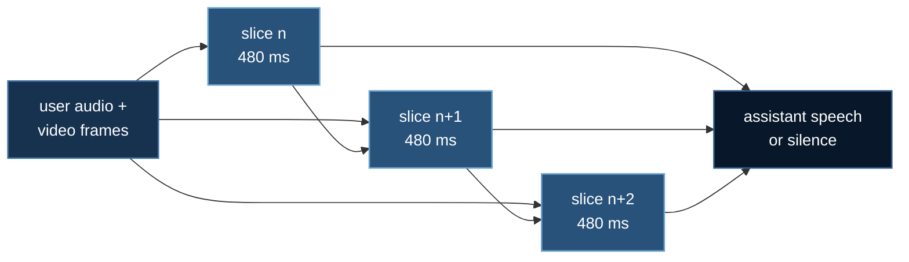

# Full Duplex: Listening While Speaking

[Omni Models](./omni-thinker-talker.md) built a system that understands two
synchronized streams and speaks back. It answers **one turn at a time**, and
while it is speaking it is **deaf**.

That is a walkie-talkie.

**Example:** `05_video_speech/03_duplex_streaming`

## 1. Why Half Duplex Is Not Just "Less Polished"

The gap is structural. In natural dialogue people:

- interrupt, and expect the other party to **stop**
- say "mm-hm" while the other is still talking, without taking the floor
- begin replying before the speaker has finished
- notice mid-sentence that they have been misunderstood, and correct

None of that is expressible if the model cannot hear itself being interrupted.

:::warning The video half is easy to forget
A user who starts **shaking their head** is interrupting just as surely as one
who starts talking. A system that only listens for barge-in misses it entirely.

A model that can *see* has no excuse — and this is precisely the property that a
port from an audio-only duplex system silently loses.
:::

## 2. Time-Sliced Autoregression

DuplexOmni stops thinking in turns and thinks in fixed **480 ms slices**. Every
slice, regardless of who is talking, the model:

1. consumes the last 480 ms of user audio **and** the video frames from that
   same window
2. consumes its own dialogue state
3. emits 480 ms of its own speech (or silence)



Because that loop never stops, input never stops.

:::tip The key reframing
**Interruption is not a special case handled by an interrupt handler — it is
just what the next slice happens to contain.**
:::

### Why 480 ms

A compromise between two failures. Shorter slices lower the latency floor and
give the model too little acoustic context to decide anything — a 100 ms window
cannot distinguish a breath from the start of a word. Longer slices decide
better and feel sluggish, because 480 ms is already close to the ~500 ms that
people perceive as a natural conversational gap.

## 3. RTF < 1 Is a Correctness Condition

$$
\mathrm{RTF} = \frac{\text{compute time}}{\text{audio duration produced}}
$$

:::danger RTF ≥ 1 is not slowness — it is failure
At RTF > 1 the model produces 480 ms of speech in more than 480 ms, so it falls
progressively further behind, the backlog grows **without bound**, and the
conversation collapses.

No batch size fixes it. No amount of waiting catches up.
:::

**Report the worst case, not the mean.** A system averaging 0.6 with occasional
spikes to 1.4 stutters audibly, and the mean hides it completely.

The 480 ms budget must cover **all** of:

| Stage |
|---|
| encode ~480 ms of audio (audio tower) |
| encode the video frames in that window (vision tower) |
| one Thinker forward step |
| one Talker forward step → 480 ms of audio tokens |
| vocoder / token2wav |

Which is why streaming omni models are small. A 3B at ~0.2 RTF has headroom; a
7B at ~0.7 does not, and the first time the user says something long, you hear
it.

This is the same shape of constraint as [Streaming Memory](./streaming-video.md):
not *"make it fast"* but *"make per-unit cost bounded, or the system does not
work."*

## 4. Control Tokens, Not a Classifier

Barge-in is learned from data rather than imposed:

| Token | Meaning |
|---|---|
| `^` | a second speaker began **here**, during assistant speech |
| `[CUT]` | the assistant's audio actually stops **here** |
| `[WAIT]` | suspend background reasoning; the user's intent changed |

:::note The gap between `^` and `[CUT]` is the interesting part
They are deliberately **not** the same instant, because people do not stop the
microsecond someone else starts — they finish the word.

And the text the assistant *would* have said after `[CUT]` is retained as
**ghost text**: never spoken, but kept in context, so the model knows what it was
in the middle of saying and can resume or refer back to it. Discard it and the
model has no idea it was cut off mid-thought.
:::

## 5. It Works

```
$ uv run 05_video_speech/03_duplex_streaming/duplex.py

  slice  user      state       assistant
  --------------------------------------------------------------
      7  speaking  speaking    has
      8  speaking  yielding    been         ^
      9  speaking  listening                [CUT] [WAIT]
     ...
     13  gesture   speaking    since
     14  gesture   yielding    the          ^
     15  -         listening                [CUT]

  barge-ins       2 detected, 2 completed
  ghost text      2 fragments retained
  worst RTF       0.229  OK
```

Slices 13–15 are the interesting ones: **barge-in triggered by a gesture, with
no speech at all.**

## 6. Turn-Taking Is Policy, and Policy Is Testable

Turn-taking bugs are the worst kind to receive as a bug report. They present as
*"it talks over me sometimes"* — intermittent, dependent on exactly when the user
started speaking relative to a slice boundary, essentially unreproducible by
hand.

Given a script, though, they are deterministic. So the scripts live in the test
suite and the timing is asserted exactly:

```bash
uv run 05_video_speech/03_duplex_streaming/duplex.py       # the scripted demo
uv run 05_video_speech/03_duplex_streaming/run_duplex.py --slices 200
uv run tests/test_duplex.py                       # 36 checks, no GPU
```

What those checks pin down:

- **input is never dropped** — one result per slice, including while speaking.
  Any code path that stops consuming makes it half duplex wearing a costume.
- **barge-in fires after exactly 2 active slices**, and a single-slice blip does
  not steal the floor (otherwise a cough takes over)
- **gesture-only barge-in works**, and alternating speech/gesture counts as one
  continuous active run
- **RTF ≥ 1 is reported as failure**, and a single slow slice is caught even
  though the mean looks fine

Explore your latency budget with no GPU at all:

```bash
uv run run_duplex.py --simulated-compute 0.6   # watch it fail correctly
```

## 7. Running With a Real Model

```bash
uv venv && source .venv/bin/activate
uv pip install torch --index-url https://download.pytorch.org/whl/cu128
uv pip install deepspeed transformers accelerate librosa soundfile opencv-python-headless
```

**CoreWeave / SLURM:**

```bash
cd 05_video_speech/03_duplex_streaming
sbatch run_deepspeed.sh
SLICES=1000 MODEL=Qwen/Qwen2.5-Omni-7B sbatch run_deepspeed.sh
```

**RunPod** — creates the pod and shuts it down:

```bash
export RUNPOD_API_KEY=...
uv run runpod/runpod_ctl.py run 05_video_speech/03_duplex_streaming \
    --collect --wait --terminate --yes
uv run runpod/runpod_ctl.py pods     # confirm: "Nothing is billing."
```

:::note Why `python` and not the `deepspeed` launcher here
Duplex inference is inherently sequential — slices arrive in order — so there is
no optimizer to shard and no gradient to reduce. Scale by running **more
conversations**, not by sharding one.
:::

The real-model step is an explicit `NotImplementedError` rather than a
plausible-looking stub, because the per-slice cost **is** the measurement, and
faking it would produce a confident, meaningless number.

## 8. Next

**[Omni Evaluation](./omni-evaluation.md)** — it talks, it listens, it watches.
Does it *understand*? The loss curve will not tell you, and neither will
accuracy.

## Reference

*DuplexOmni: Real-Time Listening, Seeing, Thinking, and Speaking for Full-Duplex
Interaction* (2026). [arXiv:2606.09186](https://arxiv.org/abs/2606.09186)
