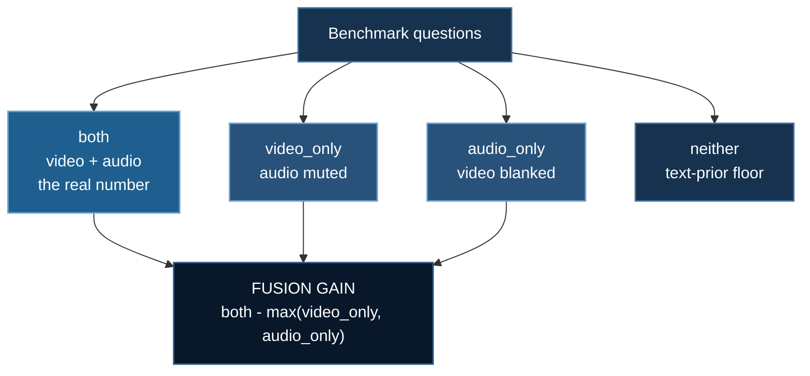
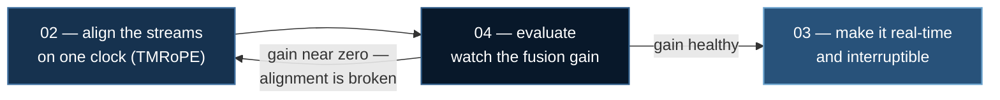

# Omni Evaluation: Does It Use Both Streams?

You have built an omni model. It takes video and speech in, it speaks back, and
it scores **62%**. Two completely different systems produce that number:

| | |
|---|---|
| **A** | genuinely fuses what it sees with what it hears |
| **B** | ignores the video entirely and answers from audio alone |

**Accuracy cannot tell them apart.**

**Example:** `09_vss/04_omni_eval`

:::danger B is what you get by default
During training, one modality is usually sufficient for most examples — so the
cheapest way to reduce loss is to learn one stream well and treat the other as
noise. Nothing in the training signal punishes this.

This is the omni-modal analogue of the single-frame problem in
[Video Evaluation](./video-evaluation.md), and it is worse: there are now **two**
ways to cheat instead of one.
:::

## 1. The Ablation Grid

Run the same benchmark four times, degrading the input:



Four numbers, four diagnostics — every one of which the single score hides:

$$
\begin{aligned}
\text{fusion\_gain} &= \text{both} - \max(\text{video\_only},\ \text{audio\_only}) \\
\text{video\_reliance} &= \text{both} - \text{audio\_only} \\
\text{audio\_reliance} &= \text{both} - \text{video\_only} \\
\text{prior\_floor} &= \text{neither}
\end{aligned}
$$

**`fusion_gain` is the headline.** Near zero means *no fusion* — the model picked
whichever single stream was better and ignored the other, and its impressive
score is a single-modality score wearing an omni-modal costume.

:::warning Check `prior_floor` first
Well above chance means the **benchmark** is broken: the questions are answerable
from the text prompt alone, and every other number is measuring a language model.

The harness refuses to report a fusion gain in that case rather than computing
one from noise — a diagnosis that stops is more useful than one that confidently
continues.
:::

## 2. It Demonstrably Catches the Failure

A harness that has never been *shown* to catch the bug it targets is one you are
trusting on faith. So `omni_eval.py` ships a simulated model with configurable
per-modality competence, and the test suite constructs a broken one on purpose:

```
$ uv run omni_eval.py --video-skill 0 --fusion-skill 0

  both          30.0%      <- still a non-trivial headline score
  video_only     0.0%
  audio_only    30.0%
  neither        0.0%

  FUSION GAIN         +0.0%
  video reliance      +0.0%

  Diagnosis:
    NO FUSION. Adding the second stream gains only +0.0%.
      The model is answering from ONE modality and ignoring the other. Its
      headline score is a single-modality score. Suspect the alignment —
      see ../02_thinker_talker/ for TMRoPE.
      Video is being IGNORED — removing it costs almost nothing.
```

Note the first line: **30% is a perfectly presentable headline number.** That is
exactly why accuracy alone lets this pass review.

`tests/test_omni_eval.py` asserts **both directions** — a broken model is caught,
*and* a healthy one is not falsely flagged. A diagnostic that fires on everything
is as useless as one that fires on nothing.

## 3. Scoring Speech Is Its Own Problem

This family **speaks** its answers, which breaks exact-match scoring in ways text
models never had to handle:

- the model says "twenty-three"; the reference says "23" — both correct
- the model says "uh, I think it's Paris" — correct, with disfluency
- **you must transcribe before you can score, and the ASR makes its own
  mistakes**

:::warning The ASR contaminates your numbers, non-uniformly
At 5% WER, roughly 5% of your "model errors" are not model errors. And the effect
is not evenly spread — it hits rare words, names, and numbers hardest, which is
exactly what benchmark answers are made of.

`score_spoken_response` reports an **ASR error band** alongside the score rather
than absorbing it. Subtracting it would invent a precision nobody has; reporting
it tells the reader that a 2-point gap between two systems may be entirely
transcription noise.
:::

### A real bug this file shipped with

Normalisation fails in **both** directions. Under-normalise and "Twenty-three."
scores wrong. Over-normalise and meaning is destroyed — the first version scored

> **`"not Paris"` as matching `"Paris"`**

because `"paris"` is a substring of `"not paris"`. Its own test suite caught it.

The fix was two-part, and the second half matters as much as the first:

| Fix | Why |
|---|---|
| **negation checked before any containment test** | negation inverts meaning, and containment cannot see it |
| **token-level matching, not character-level** | `"7"` *is* a substring of `"17"` — character matching scores the wrong number as correct on exactly the short numeric answers benchmarks are full of |

## 4. Runs on CPU

```bash
uv run 09_vss/04_omni_eval/omni_eval.py                          # healthy model
uv run 09_vss/04_omni_eval/omni_eval.py --video-skill 0 --fusion-skill 0
uv run tests/test_omni_eval.py                                   # 49 checks
```

## 5. Running Against a Real Model

```bash
uv venv && source .venv/bin/activate
uv pip install torch --index-url https://download.pytorch.org/whl/cu128
uv pip install deepspeed transformers accelerate librosa soundfile opencv-python-headless
```

**CoreWeave / SLURM:**

```bash
cd 09_vss/04_omni_eval
sbatch run_deepspeed.sh
MODEL=Qwen/Qwen2.5-Omni-7B DATASET=omnieval.json ASR_WER=0.03 sbatch run_deepspeed.sh
```

The script runs the **harness self-check first** — a deliberately
modality-ignoring model that must be caught — before touching your real model. If
the grid cannot catch a known-broken model, every number after it is meaningless.

**RunPod** — creates the pod and shuts it down:

```bash
export RUNPOD_API_KEY=...
uv run runpod/runpod_ctl.py run 09_vss/04_omni_eval \
    --collect --wait --terminate --yes
uv run runpod/runpod_ctl.py pods     # confirm: "Nothing is billing."
```

## 6. Bring Your Own Benchmark

`--dataset` takes JSON. The `requires` field is the one benchmarks usually omit
and the one the whole analysis depends on:

```json
[{"qid": "1", "question": "What did he say while pointing at the chart?",
  "answer": "revenue doubled", "requires": ["video", "audio"],
  "category": "cross-modal"}]
```

:::note Unknown categories default to cross-modal — deliberately
Mis-labelling a cross-modal question as single-modality **inflates** the
single-stream scores and **shrinks** the fusion gain, hiding the very failure
this harness exists to expose. When in doubt, the conservative direction is the
one that keeps the gain honest.
:::

Real benchmarks to point it at: [OmniEval](https://arxiv.org/abs/2506.20960)
(810 audio-visual synchronized videos, 2,617 QA pairs, explicit event grounding),
LVOmniBench, and OmniACBench.

## 7. The Workflow This Completes



> **Fusion gain is not a number you read once. It is the number you watch while
> changing the alignment.**

## References

- Wang et al. *OmniEval* (2025). [arXiv:2506.20960](https://arxiv.org/abs/2506.20960)
- Xu et al. *Qwen2.5-Omni Technical Report* (2025). [arXiv:2503.20215](https://arxiv.org/abs/2503.20215)
