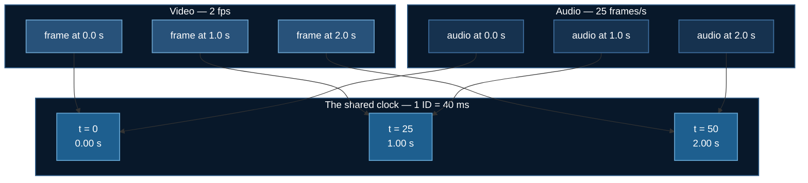
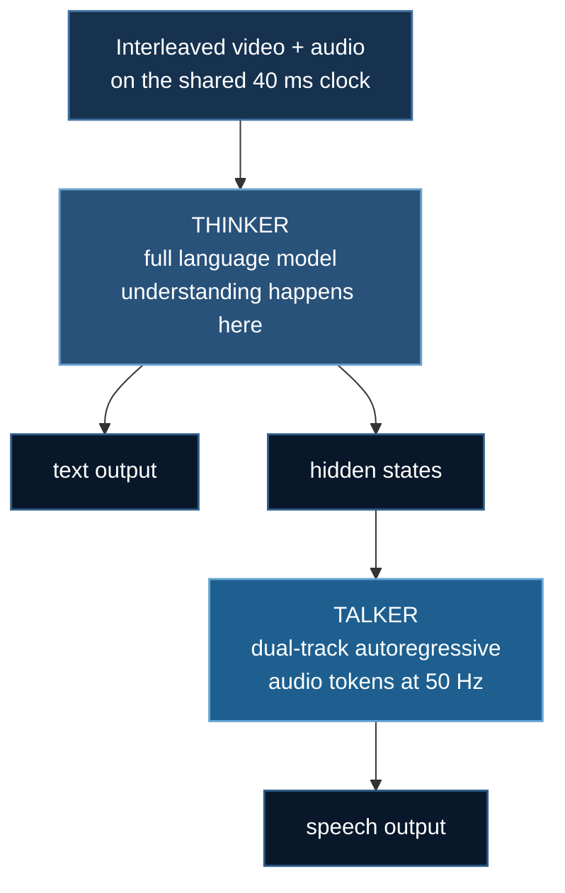

# Omni Models: Two Streams, One Clock

The final family in this course, and the only one that takes **video and speech
in** and **speaks back**.

**Example:** `09_vss/02_thinker_talker`

:::info Scope
This topic is specifically **video + audio in → speech out**. The neighbouring
families look similar and solve different problems:

| Family | Input | Output |
|---|---|---|
| Video-language | video | **text** — see [Video-Text Training](./video-text-training.md) |
| Speech-to-speech | **audio only** | speech — Moshi, GLM-4-Voice, Mini-Omni |
| **Video-speech-to-speech** | **video + audio** | **speech** — this page |

Audio-only duplex models are impressive and never face the problem that defines
this topic: two input streams that disagree about what time it is.
:::

## 1. The Problem

A video-speech model receives two streams on different clocks:

- **video** — 1–25 frames per second, irregular, whatever the sampler gave you
- **audio** — 16,000 samples per second, or ~50 encoder frames per second

Concatenate them and the transformer sees a flat list of tokens with no idea
which frame goes with which sound. Ask:

> *"What did he say while pointing at the whiteboard?"*

and it cannot answer. Not because it is undertrained — because the information
that **pointing and saying happened at the same moment** was never in the input.

:::note This is a strictly harder problem than 08_vtt
[Token Compression](./token-compression.md) and [Streaming Memory](./streaming-video.md)
only ever had to represent time *within* one stream. Here, **two streams have to
agree.**
:::

## 2. TMRoPE: One Clock, in 40 ms Ticks

Qwen2.5-Omni's answer is a single rule that does all the work:

$$
\text{one temporal position ID} \;=\; 40\text{ ms of real time}
$$

for **every** modality. Not one ID per token. Not one ID per frame. One ID per
40 ms of wall clock.

So a video frame at $t=1.00\,\text{s}$ and an audio frame at $t=1.00\,\text{s}$
both receive temporal position $\lfloor 1.00 / 0.04 \rceil = 25$. They are *the
same position* to attention, and co-occurrence lives in the position encoding
rather than being left for the model to infer.



Everything else follows from that one rule:

| Modality | Temporal | Spatial |
|---|---|---|
| **text** | $t = h = w$, +1 per token | — degenerates to 1-D RoPE |
| **audio** | one ID per 40 ms frame | $h, w$ pinned to $t$ |
| **image** | constant (one instant) | $h, w$ across the patch grid |
| **video** | **from the frame's real timestamp** | $h, w$ across the patch grid |

Text gets nothing clever on purpose: a scheme that did something special there
would break every pretrained text capability the backbone arrived with.

## 3. The Trap: Numbering Frames by Index

The obvious approach — number video frames $0, 1, 2, \dots$ — has a genuinely
nasty property. From `uv run tmrope.py`:

```
  Frame-INDEX positions drift from the audio clock:
      1 fps @  60.0s   audio ID 1500   naive video ID 60      drift   1440
      2 fps @  60.0s   audio ID 1500   naive video ID 120     drift   1380
      5 fps @  60.0s   audio ID 1500   naive video ID 300     drift   1200
     25 fps @  60.0s   audio ID 1500   naive video ID 1500    drift      0
```

:::danger At exactly 25 fps, the bug is invisible
25 fps **is** 40 ms per frame, which is exactly the tick — so index and time
coincide and drift is zero.

Test on 25 fps footage and everything works. Ship it. Then someone feeds it
2 fps and by the one-minute mark, video and audio positions describing the same
instant are **1,380 IDs apart** — and nothing raises.

`tests/test_tmrope.py` asserts both halves: that the coincidence is real, and
that it does not generalise. Testing at a single frame rate proves nothing.
:::

The correct version derives position from the timestamp, so sampling rate
becomes a **resolution** choice rather than a **semantic** one — which is what
lets you drop frames to save memory without lying to the model about when things
happened.

## 4. The 2-Second Interleave

Sharing a clock is necessary and not sufficient. Correctly-numbered tokens can
still sit 10,000 apart in the sequence, and attention has to span that.

So the layout is chunked by real time — visual first, then that same window's
audio:

```
[ video 0-2s ][ audio 0-2s ][ video 2-4s ][ audio 2-4s ][ video 4-6s ]...
```

Measured effect on a 6-second clip, from `uv run tmrope.py`:

| Layout | Worst-case video↔audio gap |
|---|---|
| flat (all video, then all audio) | 142 tokens |
| **2-second interleave** | **42 tokens** |

Two seconds is roughly the span of a spoken clause or a single gesture — the
natural unit of co-occurrence. Smaller chunks put co-occurring tokens closer but
fragment each stream's local coherence; larger ones do the reverse.

## 5. Thinker-Talker

A model that replies in speech has two jobs that pull against each other:

| Job | Wants |
|---|---|
| reason about what was seen and heard | a big language model |
| emit audio tokens at 50 Hz, in order | low latency, stability |

One autoregressive head doing both interferes. The classic symptom: **speech
quality degrades exactly when reasoning gets hard.** The model spends its
capacity deciding *what* to say and the prosody falls apart mid-sentence. Users
read that as the model being unsure of itself.



:::tip Why hidden states and not text
If the Talker read the Thinker's emitted **text**, it would have to wait for a
token to be decoded before it could speak, and it would lose everything text
does not encode: hesitation, emphasis, whether the model is confident.

Hidden states carry that — and arrive one step earlier, which is a meaningful
slice of the latency budget.
:::

### The training consequence people get wrong

**The Talker's gradient flows through the Thinker's hidden states.**

- Freeze the Thinker completely → the Talker can only learn to decode a
  representation that is not adapting to it.
- Unfreeze everything → the speech loss starts steering the reasoning model,
  degrading what it knew.

**LoRA on the Thinker is the middle path**, and it is why `train_omni.py` is
built the way it is: encoders frozen, LoRA on the Thinker's attention
projections, Talker tuned directly when you want a new voice.

## 6. Memory

| Model | Setup | VRAM |
|---|---|---|
| Qwen2.5-Omni-3B | LoRA + ZeRO-3 | ~24 GB (one card) |
| Qwen2.5-Omni-7B | LoRA + ZeRO-3 | ~40 GB |
| LongCat-Flash-Omni | 560B | 2×B200 + **~3 TB host RAM** |

An omni model is **four models resident at once** — language backbone, vision
encoder, audio encoder, speech decoder. That is why `ds_config.json` uses ZeRO-3
despite its 1.5× communication cost ($3\Psi$ vs $2\Psi$): every spare byte is
needed for activations.

Two token streams also make the sequence longer than a video-only model at the
same clip length: **25 audio tokens per second on top of the video.** A
30-second clip is ~750 audio tokens before a single frame.

## 7. Current Models

Researched Aug 2026. All accept video + audio and emit speech.

| Model | Scale | Notable |
|---|---|---|
| [Qwen3.5-Omni](https://arxiv.org/abs/2604.15804) | hundreds of B, MoE | Hybrid-attention MoE for both Thinker and Talker; 256k context; 10 h audio / 400 s of 720p video; ARIA text-speech alignment |
| [Qwen3-Omni](https://arxiv.org/abs/2509.17765) | 30B MoE | 234 ms end-to-end latency; SOTA on 32 of 36 audio-visual benchmarks |
| [Qwen2.5-Omni](https://arxiv.org/abs/2503.20215) | 3B / 7B | **Start here.** Introduced TMRoPE and Thinker-Talker |
| [DuplexOmni](https://arxiv.org/abs/2606.09186) | — | Full duplex — see [next page](./duplex-streaming.md) |
| MiniCPM-o 4.5 | 8B | SigLip2 + Whisper + CosyVoice2 on Qwen3 |
| [Baichuan-Omni-1.5](https://arxiv.org/abs/2501.15368) | 7B | Qwen2.5-7B backbone |
| [Ming-Omni](https://arxiv.org/abs/2506.09344) | 2.8B active | Ling MoE with **modality-specific routers** |

## 8. Running It

**`uv`** for packages, **`deepspeed`** for training.

```bash
uv venv && source .venv/bin/activate
uv pip install torch --index-url https://download.pytorch.org/whl/cu121
uv pip install deepspeed transformers accelerate peft datasets
uv pip install librosa soundfile opencv-python-headless
```

**CoreWeave / any SLURM cluster:**

```bash
cd 09_vss/02_thinker_talker
sbatch run_deepspeed.sh
sbatch run_deepspeed.sh --max-steps 20        # cheap dry run
```

**RunPod** — no SLURM, so the pod lifecycle is API-driven including shutdown:

```bash
export RUNPOD_API_KEY=...
uv run runpod/runpod_ctl.py run 09_vss/02_thinker_talker \
    --dry-run --collect --wait --terminate --yes
uv run runpod/runpod_ctl.py pods     # confirm: "Nothing is billing."
```

### No GPU? The important part still runs

TMRoPE is integer arithmetic:

```bash
uv run 09_vss/02_thinker_talker/tmrope.py
uv run tests/test_tmrope.py       # 58 checks, no GPU, no download
```

:::danger Getting the clock wrong raises nothing
The model trains, the loss falls, and it is simply unable to relate the two
streams. That is indistinguishable from an undertrained model, so you will spend
a week on the learning rate.

Position assignment is arithmetic, so it can be **proved** on a laptop instead —
which is exactly why `tmrope.py` contains no tensors.
:::

## 9. Next

**[Full Duplex](./duplex-streaming.md)** — this model answers one turn at a time
and is deaf while it speaks. Real conversation is not like that.

## References

- Xu et al. *Qwen2.5-Omni Technical Report* (2025). [arXiv:2503.20215](https://arxiv.org/abs/2503.20215)
- Qwen Team. *Qwen3-Omni Technical Report* (2025). [arXiv:2509.17765](https://arxiv.org/abs/2509.17765)
- Qwen Team. *Qwen3.5-Omni Technical Report* (2026). [arXiv:2604.15804](https://arxiv.org/abs/2604.15804)
